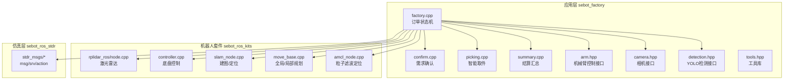
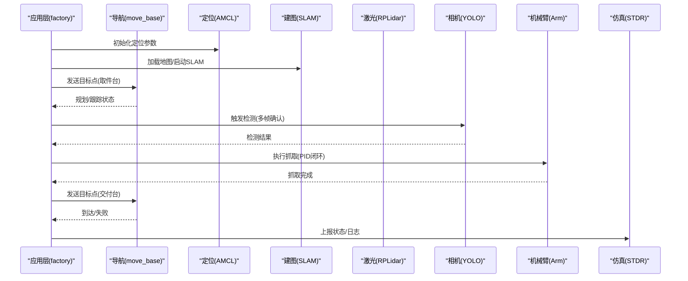
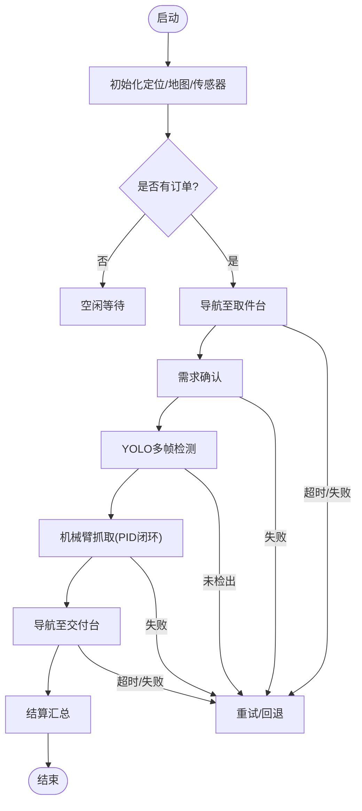
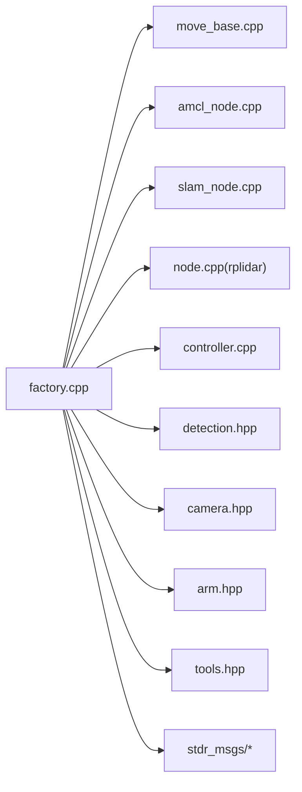

# API参考文档

<cite>
**本文引用的文件**   
- [sebot_factory/src/sebot_factory/factory.cpp](file://sebot_factory/src/sebot_factory/factory.cpp)
- [sebot_factory/src/sebot_factory/confirm.cpp](file://sebot_factory/src/sebot_factory/confirm.cpp)
- [sebot_factory/src/sebot_factory/picking.cpp](file://sebot_factory/src/sebot_factory/picking.cpp)
- [sebot_factory/src/sebot_factory/summary.cpp](file://sebot_factory/src/sebot_factory/summary.cpp)
- [sebot_factory/src/sebot_factory/include/arm.hpp](file://sebot_factory/src/sebot_factory/include/arm.hpp)
- [sebot_factory/src/sebot_factory/include/camera.hpp](file://sebot_factory/src/sebot_factory/include/camera.hpp)
- [sebot_factory/src/sebot_factory/include/detection.hpp](file://sebot_factory/src/sebot_factory/include/detection.hpp)
- [sebot_factory/src/sebot_factory/include/tools.hpp](file://sebot_factory/src/sebot_factory/include/tools.hpp)
- [sebot_factory/src/sebot_factory/launch/sebot_factory.launch](file://sebot_factory/src/sebot_factory/launch/sebot_factory.launch)
- [sebot_ros_kits/src/sebot_driver/rplidar_ros/src/node.cpp](file://sebot_ros_kits/src/sebot_driver/rplidar_ros/src/node.cpp)
- [sebot_ros_kits/src/sebot_robot/src/controller.cpp](file://sebot_ros_kits/src/sebot_robot/src/controller.cpp)
- [sebot_ros_kits/src/sebot_slam/sebot_slam/src/slam_node.cpp](file://sebot_ros_kits/src/sebot_slam/sebot_slam/src/slam_node.cpp)
- [sebot_ros_kits/src/sebot_navigation/move_base/src/move_base.cpp](file://sebot_ros_kits/src/sebot_navigation/move_base/src/move_base.cpp)
- [sebot_ros_kits/src/sebot_navigation/amcl/src/amcl_node.cpp](file://sebot_ros_kits/src/sebot_navigation/amcl/src/amcl_node.cpp)
- [sebot_ros_stdr/src/sebot_stdr/stdr_msgs/msg/Order.msg](file://sebot_ros_stdr/src/sebot_stdr/stdr_msgs/msg/Order.msg)
- [sebot_ros_stdr/src/sebot_stdr/stdr_msgs/msg/DetectedObject.msg](file://sebot_ros_stdr/src/sebot_stdr/stdr_msgs/msg/DetectedObject.msg)
- [sebot_ros_stdr/src/sebot_stdr/stdr_msgs/srv/GetStatus.srv](file://sebot_ros_stdr/src/sebot_stdr/stdr_msgs/srv/GetStatus.srv)
</cite>

## 目录
1. [简介](#简介)
2. [项目结构](#项目结构)
3. [核心组件](#核心组件)
4. [架构总览](#架构总览)
5. [详细组件分析](#详细组件分析)
6. [依赖关系分析](#依赖关系分析)
7. [性能考量](#性能考量)
8. [故障排查指南](#故障排查指南)
9. [结论](#结论)
10. [附录](#附录)

## 简介
本文件为机器人竞赛系统的完整API参考文档，面向ROS 1（roscpp/Python）开发者与集成人员。内容覆盖：
- 服务接口定义、请求/响应格式与错误码约定
- 自定义消息类型的数据结构与序列化说明
- 服务调用最佳实践（异步调用、超时、重试）
- 回调函数注册与触发条件（事件处理与状态同步）
- C++与Python的API调用示例路径
- API版本兼容性与迁移指南
- 调试方法与性能监控建议

系统由三层catkin工作空间组成：
- sebot_factory：应用层业务节点（工厂订单流程、需求确认、视觉检测、机械臂抓取、结算汇总）
- sebot_ros_kits：机器人套件（驱动、导航、SLAM、语音、视觉脚本等）
- sebot_ros_stdr：仿真层（STDR仿真器与消息/服务定义）

比赛主链路：上电自检 → 加载地图与AMCL定位 → 按订单导航至取件台 → 需求确认 → YOLO视觉搜索（NPU加速多帧确认）→ 机械臂PID闭环抓取 → 导航送达并结算。主状态机基于MultiNavi实现于factory.cpp。

## 项目结构
- sebot_factory：包含业务节点源码、头文件、launch配置与资源（模型、图像、标签等）
- sebot_ros_kits：包含驱动、导航、SLAM、语音、视觉等子包，多数为官方或开源项目的fork与集成
- sebot_ros_stdr：包含STDR仿真器、GUI、解析器、资源与标准消息/服务定义

图表来源
- [sebot_factory/src/sebot_factory/factory.cpp](file://sebot_factory/src/sebot_factory/factory.cpp)
- [sebot_factory/src/sebot_factory/confirm.cpp](file://sebot_factory/src/sebot_factory/confirm.cpp)
- [sebot_factory/src/sebot_factory/picking.cpp](file://sebot_factory/src/sebot_factory/picking.cpp)
- [sebot_factory/src/sebot_factory/summary.cpp](file://sebot_factory/src/sebot_factory/summary.cpp)
- [sebot_factory/src/sebot_factory/include/arm.hpp](file://sebot_factory/src/sebot_factory/include/arm.hpp)
- [sebot_factory/src/sebot_factory/include/camera.hpp](file://sebot_factory/src/sebot_factory/include/camera.hpp)
- [sebot_factory/src/sebot_factory/include/detection.hpp](file://sebot_factory/src/sebot_factory/include/detection.hpp)
- [sebot_ros_kits/src/sebot_driver/rplidar_ros/src/node.cpp](file://sebot_ros_kits/src/sebot_driver/rplidar_ros/src/node.cpp)
- [sebot_ros_kits/src/sebot_robot/src/controller.cpp](file://sebot_ros_kits/src/sebot_robot/src/controller.cpp)
- [sebot_ros_kits/src/sebot_slam/sebot_slam/src/slam_node.cpp](file://sebot_ros_kits/src/sebot_slam/sebot_slam/src/slam_node.cpp)
- [sebot_ros_kits/src/sebot_navigation/move_base/src/move_base.cpp](file://sebot_ros_kits/src/sebot_navigation/move_base/src/move_base.cpp)
- [sebot_ros_kits/src/sebot_navigation/amcl/src/amcl_node.cpp](file://sebot_ros_kits/src/sebot_navigation/amcl/src/amcl_node.cpp)
- [sebot_ros_stdr/src/sebot_stdr/stdr_msgs/msg/Order.msg](file://sebot_ros_stdr/src/sebot_stdr/stdr_msgs/msg/Order.msg)
- [sebot_ros_stdr/src/sebot_stdr/stdr_msgs/msg/DetectedObject.msg](file://sebot_ros_stdr/src/sebot_stdr/stdr_msgs/msg/DetectedObject.msg)

章节来源
- [sebot_factory/src/sebot_factory/launch/sebot_factory.launch](file://sebot_factory/src/sebot_factory/launch/sebot_factory.launch)

## 核心组件
- factory.cpp：订单生命周期状态机，协调导航、确认、检测、抓取、结算全流程；通过ROS服务/动作与子系统交互
- confirm.cpp：需求确认逻辑，订阅传感器/视觉结果，生成确认事件
- picking.cpp：智能取件，封装机械臂轨迹规划与抓取执行
- summary.cpp：结算汇总，统计任务指标并上报
- arm.hpp/camera.hpp/detection.hpp/tools.hpp：领域接口与工具函数，提供统一抽象

章节来源
- [sebot_factory/src/sebot_factory/factory.cpp](file://sebot_factory/src/sebot_factory/factory.cpp)
- [sebot_factory/src/sebot_factory/confirm.cpp](file://sebot_factory/src/sebot_factory/confirm.cpp)
- [sebot_factory/src/sebot_factory/picking.cpp](file://sebot_factory/src/sebot_factory/picking.cpp)
- [sebot_factory/src/sebot_factory/summary.cpp](file://sebot_factory/src/sebot_factory/summary.cpp)
- [sebot_factory/src/sebot_factory/include/arm.hpp](file://sebot_factory/src/sebot_factory/include/arm.hpp)
- [sebot_factory/src/sebot_factory/include/camera.hpp](file://sebot_factory/src/sebot_factory/include/camera.hpp)
- [sebot_factory/src/sebot_factory/include/detection.hpp](file://sebot_factory/src/sebot_factory/include/detection.hpp)
- [sebot_factory/src/sebot_factory/include/tools.hpp](file://sebot_factory/src/sebot_factory/include/tools.hpp)

## 架构总览
系统以factory为主控节点，通过ROS服务/话题/动作与导航、定位、感知、执行模块交互。关键交互包括：
- 导航：move_base（全局/局部规划）、AMCL（定位）、costmap_2d（代价地图）
- 感知：RPLidar（激光）、相机+YOLO（目标检测）
- 执行：底盘控制器、机械臂MoveIt!
- 仿真：STDR提供环境与消息定义

图表来源
- [sebot_factory/src/sebot_factory/factory.cpp](file://sebot_factory/src/sebot_factory/factory.cpp)
- [sebot_ros_kits/src/sebot_navigation/move_base/src/move_base.cpp](file://sebot_ros_kits/src/sebot_navigation/move_base/src/move_base.cpp)
- [sebot_ros_kits/src/sebot_navigation/amcl/src/amcl_node.cpp](file://sebot_ros_kits/src/sebot_navigation/amcl/src/amcl_node.cpp)
- [sebot_ros_kits/src/sebot_slam/sebot_slam/src/slam_node.cpp](file://sebot_ros_kits/src/sebot_slam/sebot_slam/src/slam_node.cpp)
- [sebot_ros_kits/src/sebot_driver/rplidar_ros/src/node.cpp](file://sebot_ros_kits/src/sebot_driver/rplidar_ros/src/node.cpp)
- [sebot_factory/src/sebot_factory/include/camera.hpp](file://sebot_factory/src/sebot_factory/include/camera.hpp)
- [sebot_factory/src/sebot_factory/include/detection.hpp](file://sebot_factory/src/sebot_factory/include/detection.hpp)
- [sebot_factory/src/sebot_factory/include/arm.hpp](file://sebot_factory/src/sebot_factory/include/arm.hpp)

## 详细组件分析

### 工厂订单状态机（factory.cpp）
- 职责：编排订单生命周期，管理导航、确认、检测、抓取、结算各阶段的状态转换
- 主要交互：
  - 与服务/动作：导航目标、定位状态查询、检测触发、抓取执行、结算上报
  - 与话题：传感器数据、检测结果、状态反馈
- 关键参数：导航超时、PID参数、取件距离、补扫阈值、仿真模式开关、调试界面开关

图表来源
- [sebot_factory/src/sebot_factory/factory.cpp](file://sebot_factory/src/sebot_factory/factory.cpp)

章节来源
- [sebot_factory/src/sebot_factory/factory.cpp](file://sebot_factory/src/sebot_factory/factory.cpp)
- [sebot_factory/src/sebot_factory/launch/sebot_factory.launch](file://sebot_factory/src/sebot_factory/launch/sebot_factory.launch)

### 需求确认（confirm.cpp）
- 职责：根据传感器与视觉输入进行需求确认，输出确认事件
- 输入：传感器数据、检测结果、环境状态
- 输出：确认成功/失败事件，附带置信度与证据

章节来源
- [sebot_factory/src/sebot_factory/confirm.cpp](file://sebot_factory/src/sebot_factory/confirm.cpp)

### 智能取件（picking.cpp）
- 职责：封装机械臂轨迹规划与抓取执行，支持PID闭环控制
- 输入：目标位姿、抓取策略、安全约束
- 输出：抓取结果、误差反馈、状态更新

章节来源
- [sebot_factory/src/sebot_factory/picking.cpp](file://sebot_factory/src/sebot_factory/picking.cpp)
- [sebot_factory/src/sebot_factory/include/arm.hpp](file://sebot_factory/src/sebot_factory/include/arm.hpp)

### 结算汇总（summary.cpp）
- 职责：统计任务指标（耗时、成功率、能耗等），上报结果
- 输入：各阶段状态与日志
- 输出：汇总报告、指标字段

章节来源
- [sebot_factory/src/sebot_factory/summary.cpp](file://sebot_factory/src/sebot_factory/summary.cpp)

### 视觉检测（detection.hpp + camera.hpp）
- 职责：相机数据采集与YOLO推理（NPU加速），多帧融合确认
- 输入：图像流、检测配置
- 输出：目标列表、置信度、时间戳

章节来源
- [sebot_factory/src/sebot_factory/include/detection.hpp](file://sebot_factory/src/sebot_factory/include/detection.hpp)
- [sebot_factory/src/sebot_factory/include/camera.hpp](file://sebot_factory/src/sebot_factory/include/camera.hpp)

### 工具库（tools.hpp）
- 职责：通用工具函数（时间、坐标变换、日志、参数读取）
- 使用：被各业务节点复用

章节来源
- [sebot_factory/src/sebot_factory/include/tools.hpp](file://sebot_factory/src/sebot_factory/include/tools.hpp)

### 导航与定位（move_base + amcl）
- move_base：全局/局部规划、代价地图、恢复行为
- amcl：粒子滤波定位，订阅激光/里程计，发布位姿估计
- 集成：通过launch配置参数（如地图路径、滤波器参数、规划器参数）

章节来源
- [sebot_ros_kits/src/sebot_navigation/move_base/src/move_base.cpp](file://sebot_ros_kits/src/sebot_navigation/move_base/src/move_base.cpp)
- [sebot_ros_kits/src/sebot_navigation/amcl/src/amcl_node.cpp](file://sebot_ros_kits/src/sebot_navigation/amcl/src/amcl_node.cpp)

### 传感器与驱动（rplidar + controller）
- rplidar：激光雷达数据发布，频率与帧长配置
- controller：底盘速度指令与控制回路

章节来源
- [sebot_ros_kits/src/sebot_driver/rplidar_ros/src/node.cpp](file://sebot_ros_kits/src/sebot_driver/rplidar_ros/src/node.cpp)
- [sebot_ros_kits/src/sebot_robot/src/controller.cpp](file://sebot_ros_kits/src/sebot_robot/src/controller.cpp)

### 建图（slam_node）
- 职责：SLAM建图与定位，输出地图与位姿
- 集成：与AMCL协同工作

章节来源
- [sebot_ros_kits/src/sebot_slam/sebot_slam/src/slam_node.cpp](file://sebot_ros_kits/src/sebot_slam/sebot_slam/src/slam_node.cpp)

### 仿真与消息（stdr_msgs）
- stdr_msgs：定义订单、检测结果等消息与服务
- 作用：统一数据格式，跨模块通信

章节来源
- [sebot_ros_stdr/src/sebot_stdr/stdr_msgs/msg/Order.msg](file://sebot_ros_stdr/src/sebot_stdr/stdr_msgs/msg/Order.msg)
- [sebot_ros_stdr/src/sebot_stdr/stdr_msgs/msg/DetectedObject.msg](file://sebot_ros_stdr/src/sebot_stdr/stdr_msgs/msg/DetectedObject.msg)
- [sebot_ros_stdr/src/sebot_stdr/stdr_msgs/srv/GetStatus.srv](file://sebot_ros_stdr/src/sebot_stdr/stdr_msgs/srv/GetStatus.srv)

## 依赖关系分析
- 应用层依赖导航、定位、感知、执行模块
- 导航依赖代价地图、规划器、控制器
- 感知依赖相机与激光雷达
- 仿真层提供消息定义与环境模拟

图表来源
- [sebot_factory/src/sebot_factory/factory.cpp](file://sebot_factory/src/sebot_factory/factory.cpp)
- [sebot_ros_kits/src/sebot_navigation/move_base/src/move_base.cpp](file://sebot_ros_kits/src/sebot_navigation/move_base/src/move_base.cpp)
- [sebot_ros_kits/src/sebot_navigation/amcl/src/amcl_node.cpp](file://sebot_ros_kits/src/sebot_navigation/amcl/src/amcl_node.cpp)
- [sebot_ros_kits/src/sebot_slam/sebot_slam/src/slam_node.cpp](file://sebot_ros_kits/src/sebot_slam/sebot_slam/src/slam_node.cpp)
- [sebot_ros_kits/src/sebot_driver/rplidar_ros/src/node.cpp](file://sebot_ros_kits/src/sebot_driver/rplidar_ros/src/node.cpp)
- [sebot_ros_kits/src/sebot_robot/src/controller.cpp](file://sebot_ros_kits/src/sebot_robot/src/controller.cpp)
- [sebot_factory/src/sebot_factory/include/detection.hpp](file://sebot_factory/src/sebot_factory/include/detection.hpp)
- [sebot_factory/src/sebot_factory/include/camera.hpp](file://sebot_factory/src/sebot_factory/include/camera.hpp)
- [sebot_factory/src/sebot_factory/include/arm.hpp](file://sebot_factory/src/sebot_factory/include/arm.hpp)
- [sebot_factory/src/sebot_factory/include/tools.hpp](file://sebot_factory/src/sebot_factory/include/tools.hpp)
- [sebot_ros_stdr/src/sebot_stdr/stdr_msgs/msg/Order.msg](file://sebot_ros_stdr/src/sebot_stdr/stdr_msgs/msg/Order.msg)
- [sebot_ros_stdr/src/sebot_stdr/stdr_msgs/msg/DetectedObject.msg](file://sebot_ros_stdr/src/sebot_stdr/stdr_msgs/msg/DetectedObject.msg)

章节来源
- [sebot_factory/src/sebot_factory/factory.cpp](file://sebot_factory/src/sebot_factory/factory.cpp)
- [sebot_ros_stdr/src/sebot_stdr/stdr_msgs/msg/Order.msg](file://sebot_ros_stdr/src/sebot_stdr/stdr_msgs/msg/Order.msg)
- [sebot_ros_stdr/src/sebot_stdr/stdr_msgs/msg/DetectedObject.msg](file://sebot_ros_stdr/src/sebot_stdr/stdr_msgs/msg/DetectedObject.msg)

## 性能考量
- 导航性能：调整全局/局部规划器参数，优化代价地图分辨率与膨胀半径
- 定位精度：AMCL粒子数、激光匹配阈值、里程计校准
- 视觉推理：NPU加速配置、多帧融合窗口大小、置信度阈值
- 抓取控制：PID参数整定、轨迹平滑、碰撞检测
- 资源占用：CPU/GPU利用率、内存峰值、I/O吞吐
- 监控建议：使用rosbag记录关键话题，结合rqt_plot与rosout分析延迟与抖动

[本节为通用指导，不直接分析具体文件]

## 故障排查指南
- 常见问题
  - 定位漂移：检查激光数据质量、IMU标定、AMCL参数
  - 规划失败：检查代价地图障碍物、全局路径可达性
  - 检测失败：检查相机曝光、光照、YOLO模型版本
  - 抓取失败：检查位姿误差、夹爪力度、碰撞检测
- 调试方法
  - rosbag录制关键话题（激光、图像、位姿、状态）
  - rviz可视化地图、路径、检测结果
  - rosparam查看/修改运行时参数
  - 使用rostopic echo验证消息格式
- 日志与错误码
  - 统一错误码规范（如导航超时、定位丢失、检测失败、抓取异常）
  - 日志分级（INFO/WARN/ERROR）与上下文信息

章节来源
- [sebot_factory/src/sebot_factory/factory.cpp](file://sebot_factory/src/sebot_factory/factory.cpp)
- [sebot_ros_kits/src/sebot_navigation/move_base/src/move_base.cpp](file://sebot_ros_kits/src/sebot_navigation/move_base/src/move_base.cpp)
- [sebot_ros_kits/src/sebot_navigation/amcl/src/amcl_node.cpp](file://sebot_ros_kits/src/sebot_navigation/amcl/src/amcl_node.cpp)
- [sebot_factory/src/sebot_factory/include/detection.hpp](file://sebot_factory/src/sebot_factory/include/detection.hpp)
- [sebot_factory/src/sebot_factory/include/arm.hpp](file://sebot_factory/src/sebot_factory/include/arm.hpp)

## 结论
本API参考文档围绕ROS服务与消息定义了机器人竞赛系统的接口规范与实践指南。通过分层架构与模块化设计，系统实现了从订单到交付的全流程自动化。开发者可依据本文档快速集成与扩展功能，确保稳定性与可维护性。

[本节为总结，不直接分析具体文件]

## 附录

### 自定义消息类型定义与使用
- Order.msg：订单数据结构（订单号、目标位置、优先级、状态等）
- DetectedObject.msg：检测结果（类别、置信度、边界框、时间戳）
- GetStatus.srv：状态查询服务（请求为空，响应包含系统状态）

章节来源
- [sebot_ros_stdr/src/sebot_stdr/stdr_msgs/msg/Order.msg](file://sebot_ros_stdr/src/sebot_stdr/stdr_msgs/msg/Order.msg)
- [sebot_ros_stdr/src/sebot_stdr/stdr_msgs/msg/DetectedObject.msg](file://sebot_ros_stdr/src/sebot_stdr/stdr_msgs/msg/DetectedObject.msg)
- [sebot_ros_stdr/src/sebot_stdr/stdr_msgs/srv/GetStatus.srv](file://sebot_ros_stdr/src/sebot_stdr/stdr_msgs/srv/GetStatus.srv)

### 服务调用最佳实践
- 异步调用：使用客户端异步调用避免阻塞主循环
- 超时处理：设置合理超时时间，处理超时异常
- 重试机制：指数退避重试，限制最大重试次数
- 回调函数：注册回调处理响应与错误，确保线程安全

章节来源
- [sebot_factory/src/sebot_factory/factory.cpp](file://sebot_factory/src/sebot_factory/factory.cpp)
- [sebot_ros_stdr/src/sebot_stdr/stdr_msgs/srv/GetStatus.srv](file://sebot_ros_stdr/src/sebot_stdr/stdr_msgs/srv/GetStatus.srv)

### API调用示例（C++与Python）
- C++示例：参考factory.cpp中的服务调用与回调注册
- Python示例：参考scripts下的Python脚本（如sebotCollection.py、joyStick.py）

章节来源
- [sebot_factory/src/sebot_factory/factory.cpp](file://sebot_factory/src/sebot_factory/factory.cpp)
- [sebot_ros_kits/src/sebot_visions/scripts/sebotCollection.py](file://sebot_ros_kits/src/sebot_visions/scripts/sebotCollection.py)
- [sebot_ros_kits/src/sebot_visions/scripts/joyStick.py](file://sebot_ros_kits/src/sebot_visions/scripts/joyStick.py)

### API版本兼容性与迁移指南
- 向后兼容：保持消息/服务接口稳定，新增字段默认值
- 弃用通知：提前声明弃用接口，提供迁移路径
- 版本管理：在package.xml中声明依赖版本范围
- 迁移步骤：逐步替换旧接口，测试兼容性，最终移除旧代码

章节来源
- [sebot_factory/src/sebot_factory/package.xml](file://sebot_factory/src/sebot_factory/package.xml)
- [sebot_ros_kits/src/sebot_driver/rplidar_ros/package.xml](file://sebot_ros_kits/src/sebot_driver/rplidar_ros/package.xml)
- [sebot_ros_stdr/src/sebot_stdr/stdr_msgs/package.xml](file://sebot_ros_stdr/src/sebot_stdr/stdr_msgs/package.xml)

### 调试方法与性能监控建议
- 调试工具：rosbag、rqt、rviz、rosconsole
- 性能监控：rosmon、htop、nvidia-smi（GPU）、iostat（I/O）
- 日志分析：集中日志存储，关键词检索，趋势分析

章节来源
- [sebot_factory/src/sebot_factory/launch/sebot_factory.launch](file://sebot_factory/src/sebot_factory/launch/sebot_factory.launch)
- [sebot_ros_kits/src/sebot_driver/rplidar_ros/src/node.cpp](file://sebot_ros_kits/src/sebot_driver/rplidar_ros/src/node.cpp)
- [sebot_ros_kits/src/sebot_robot/src/controller.cpp](file://sebot_ros_kits/src/sebot_robot/src/controller.cpp)