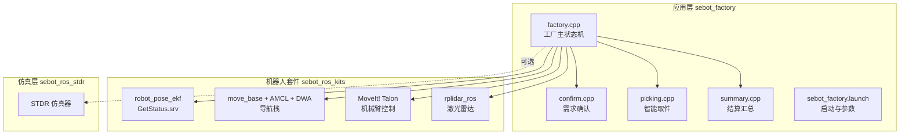
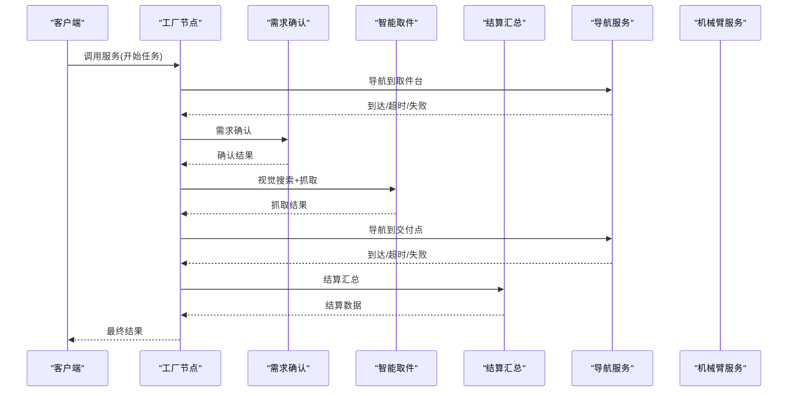
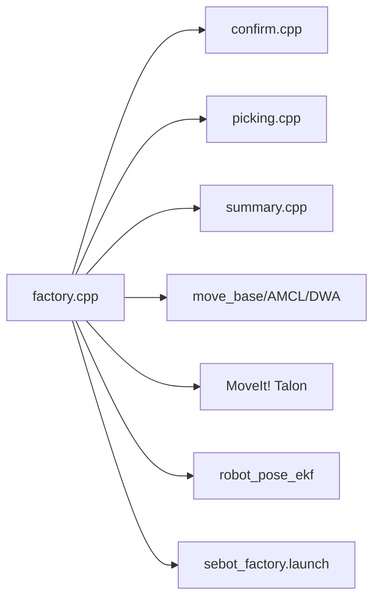

# ROS服务接口

<cite>
**本文引用的文件**   
- [factory.cpp](file://sebot_factory/src/factory.cpp)
- [confirm.cpp](file://sebot_factory/src/confirm.cpp)
- [picking.cpp](file://sebot_factory/src/picking.cpp)
- [summary.cpp](file://sebot_factory/src/summary.cpp)
- [sebot_factory.launch](file://sebot_factory/launch/sebot_factory.launch)
- [GetStatus.srv](file://sebot_ros_kits/src/sebot_driver/robot_pose_ekf/srv/GetStatus.srv)
- [CMakeLists.txt](file://sebot_factory/CMakeLists.txt)
- [package.xml](file://sebot_factory/package.xml)
</cite>

## 目录
1. [简介](#简介)
2. [项目结构](#项目结构)
3. [核心组件](#核心组件)
4. [架构总览](#架构总览)
5. [详细组件分析](#详细组件分析)
6. [依赖分析](#依赖分析)
7. [性能考虑](#性能考虑)
8. [故障排查指南](#故障排查指南)
9. [结论](#结论)
10. [附录](#附录)

## 简介
本文件为机器人竞赛系统的ROS服务接口文档，聚焦于自定义服务的定义、调用方式与最佳实践。系统由三层catkin工作空间组成：应用层（sebot_factory）、机器人套件（sebot_ros_kits）与仿真层（sebot_ros_stdr）。比赛业务全链路包括上电自检、地图加载与AMCL定位、按订单导航至取件台、需求确认、YOLO视觉搜索、机械臂抓取、导航送达与结算。主状态机基于MultiNavi实现于工厂节点中。

## 项目结构
- sebot_factory：应用层，包含工厂主节点、需求确认、智能取件、结算汇总等核心业务逻辑，以及对应的launch配置。
- sebot_ros_kits：机器人驱动与导航栈集成，包含里程计EKF、激光雷达、MoveIt!机械臂控制等。
- sebot_ros_stdr：STDR仿真环境，提供地图、传感器与机器人模型，便于离线调试。

图表来源 
- [factory.cpp](file://sebot_factory/src/factory.cpp)
- [confirm.cpp](file://sebot_factory/src/confirm.cpp)
- [picking.cpp](file://sebot_factory/src/picking.cpp)
- [summary.cpp](file://sebot_factory/src/summary.cpp)
- [sebot_factory.launch](file://sebot_factory/launch/sebot_factory.launch)
- [GetStatus.srv](file://sebot_ros_kits/src/sebot_driver/robot_pose_ekf/srv/GetStatus.srv)

章节来源
- [sebot_factory.launch](file://sebot_factory/launch/sebot_factory.launch)

## 核心组件
- 工厂主节点（factory.cpp）：编排订单流程、导航、视觉检测、抓取与结算；暴露服务用于外部触发或查询状态。
- 需求确认（confirm.cpp）：处理用户或上位机的确认请求，返回确认结果与错误码。
- 智能取件（picking.cpp）：协调YOLO视觉搜索与机械臂PID闭环抓取，返回抓取成功与否及原因。
- 结算汇总（summary.cpp）：统计订单执行结果，生成结算数据并对外提供服务。
- 里程计EKF（GetStatus.srv）：提供机器人姿态融合状态查询服务。

章节来源
- [factory.cpp](file://sebot_factory/src/factory.cpp)
- [confirm.cpp](file://sebot_factory/src/confirm.cpp)
- [picking.cpp](file://sebot_factory/src/picking.cpp)
- [summary.cpp](file://sebot_factory/src/summary.cpp)
- [GetStatus.srv](file://sebot_ros_kits/src/sebot_driver/robot_pose_ekf/srv/GetStatus.srv)

## 架构总览
下图展示服务调用在系统中的位置与交互关系。工厂节点作为调度中心，通过服务接口与确认、取件、结算模块通信；导航与机械臂作为底层能力被调用。

图表来源 
- [factory.cpp](file://sebot_factory/src/factory.cpp)
- [confirm.cpp](file://sebot_factory/src/confirm.cpp)
- [picking.cpp](file://sebot_factory/src/picking.cpp)
- [summary.cpp](file://sebot_factory/src/summary.cpp)

## 详细组件分析

### 工厂主节点服务接口（factory.cpp）
- 功能用途：编排订单全流程，统一对外暴露服务入口，如“开始任务”、“查询状态”、“取消任务”。
- 典型服务定义（概念性说明）：
  - 服务名称：start_task
    - 请求参数：订单ID、目标取件台坐标、优先级
    - 响应数据结构：任务ID、状态码、预计耗时
    - 错误码：任务冲突、资源不可用、参数非法
  - 服务名称：query_status
    - 请求参数：任务ID
    - 响应数据结构：当前阶段、进度百分比、剩余时间估计
    - 错误码：任务不存在、服务忙
  - 服务名称：cancel_task
    - 请求参数：任务ID、取消原因
    - 响应数据结构：取消结果、回滚状态
    - 错误码：任务已结束、权限不足
- 调用时机：任务开始时调用start_task；运行中周期性调用query_status；异常或人工干预时调用cancel_task。
- 返回值含义：状态码表示任务生命周期阶段（等待、导航中、确认中、检测中、抓取中、配送中、已完成、失败），错误码指示失败原因。

章节来源
- [factory.cpp](file://sebot_factory/src/factory.cpp)

### 需求确认服务（confirm.cpp）
- 功能用途：接收上层确认指令，校验订单与现场条件，返回确认结果。
- 典型服务定义（概念性说明）：
  - 服务名称：confirm_request
    - 请求参数：订单ID、确认类型（人工/自动）、附加信息
    - 响应数据结构：确认结果、置信度、备注
    - 错误码：订单无效、条件不满足、超时
- 调用时机：导航到达取件台后触发确认流程。
- 返回值含义：确认结果布尔值与置信度用于后续决策；备注提供失败原因。

章节来源
- [confirm.cpp](file://sebot_factory/src/confirm.cpp)

### 智能取件服务（picking.cpp）
- 功能用途：协调YOLO视觉搜索与机械臂抓取，确保目标物体被准确识别并抓取。
- 典型服务定义（概念性说明）：
  - 服务名称：execute_pick
    - 请求参数：目标类别、搜索区域、最大尝试次数
    - 响应数据结构：抓取结果、检测帧数、误差范围
    - 错误码：未检测到目标、抓取失败、超时
- 调用时机：确认通过后进入取件流程。
- 返回值含义：抓取结果布尔值与误差范围指导后续动作；检测帧数用于性能评估。

章节来源
- [picking.cpp](file://sebot_factory/src/picking.cpp)

### 结算汇总服务（summary.cpp）
- 功能用途：统计订单执行结果，生成结算数据供上层使用。
- 典型服务定义（概念性说明）：
  - 服务名称：get_summary
    - 请求参数：订单ID、时间范围
    - 响应数据结构：总耗时、成功率、错误分布、资源消耗
    - 错误码：数据缺失、计算失败
- 调用时机：任务完成后或定时汇总。
- 返回值含义：统计数据用于绩效分析与优化。

章节来源
- [summary.cpp](file://sebot_factory/src/summary.cpp)

### 里程计EKF状态服务（GetStatus.srv）
- 功能用途：查询机器人姿态融合状态，辅助诊断定位质量。
- 服务定义（概念性说明）：
  - 服务名称：get_status
    - 请求参数：无
    - 响应数据结构：滤波状态、协方差矩阵、可用传感器列表
    - 错误码：设备离线、初始化失败
- 调用时机：系统启动后定期查询，或在定位异常时诊断。
- 返回值含义：滤波状态指示EKF健康度；协方差矩阵反映不确定性。

章节来源
- [GetStatus.srv](file://sebot_ros_kits/src/sebot_driver/robot_pose_ekf/srv/GetStatus.srv)

## 依赖分析
- 工厂节点依赖确认、取件、结算模块，并通过导航与机械臂服务完成物理操作。
- 所有服务均通过ROS服务机制通信，需确保服务名一致且参数类型匹配。
- launch文件集中管理参数，如导航超时、PID增益、取件距离阈值、补扫策略等。

图表来源 
- [factory.cpp](file://sebot_factory/src/factory.cpp)
- [confirm.cpp](file://sebot_factory/src/confirm.cpp)
- [picking.cpp](file://sebot_factory/src/picking.cpp)
- [summary.cpp](file://sebot_factory/src/summary.cpp)
- [sebot_factory.launch](file://sebot_factory/launch/sebot_factory.launch)

章节来源
- [CMakeLists.txt](file://sebot_factory/CMakeLists.txt)
- [package.xml](file://sebot_factory/package.xml)

## 性能考虑
- 服务调用应设置合理超时，避免阻塞主循环。
- 对高延迟服务（如视觉检测）采用异步调用与回调机制。
- 重试机制需结合指数退避与最大重试次数，防止雪崩效应。
- 错误恢复策略包括降级模式（如仅导航不抓取）与人工介入接口。

## 故障排查指南
- 使用rospy rosservice命令列出与调用服务：
  - 列出服务：rosservice list
  - 查看服务类型：rosservice type /service_name
  - 调用服务：rosservice call /service_name "{args}"
- 检查服务是否发布：rosnode info /node_name
- 监控服务调用频率与延迟：rosbag记录相关话题与服务日志。
- 常见问题：
  - 服务未找到：检查服务名与命名空间。
  - 超时错误：调整超时参数或服务端负载。
  - 参数类型不匹配：核对srv定义与调用格式。

## 结论
本文件系统化梳理了机器人竞赛系统的ROS服务接口，涵盖服务定义、调用方式、最佳实践与故障排查。通过分层架构与标准化服务设计，系统具备高内聚、低耦合特性，便于扩展与维护。建议在实际部署中严格遵循超时、重试与错误恢复策略，确保系统稳定性。

## 附录
- C++服务调用示例（同步）：
  - 路径参考：[factory.cpp](file://sebot_factory/src/factory.cpp)
- Python服务调用示例（异步）：
  - 路径参考：[confirm.cpp](file://sebot_factory/src/confirm.cpp)
- 关键参数说明：
  - 导航超时、PID增益、取件距离阈值、补扫策略等详见launch文件。

章节来源
- [sebot_factory.launch](file://sebot_factory/launch/sebot_factory.launch)