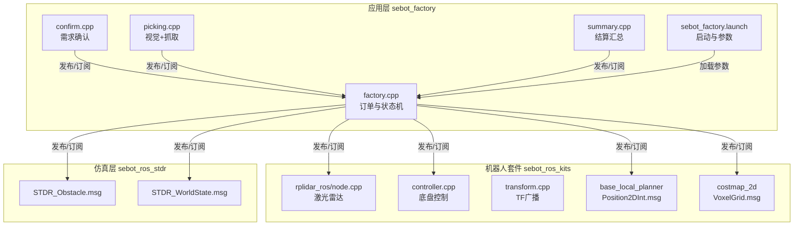
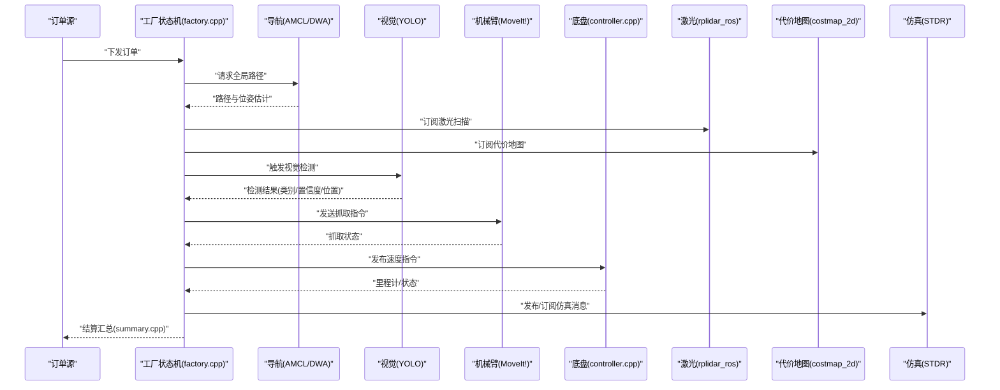
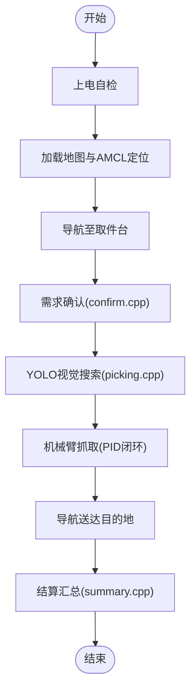
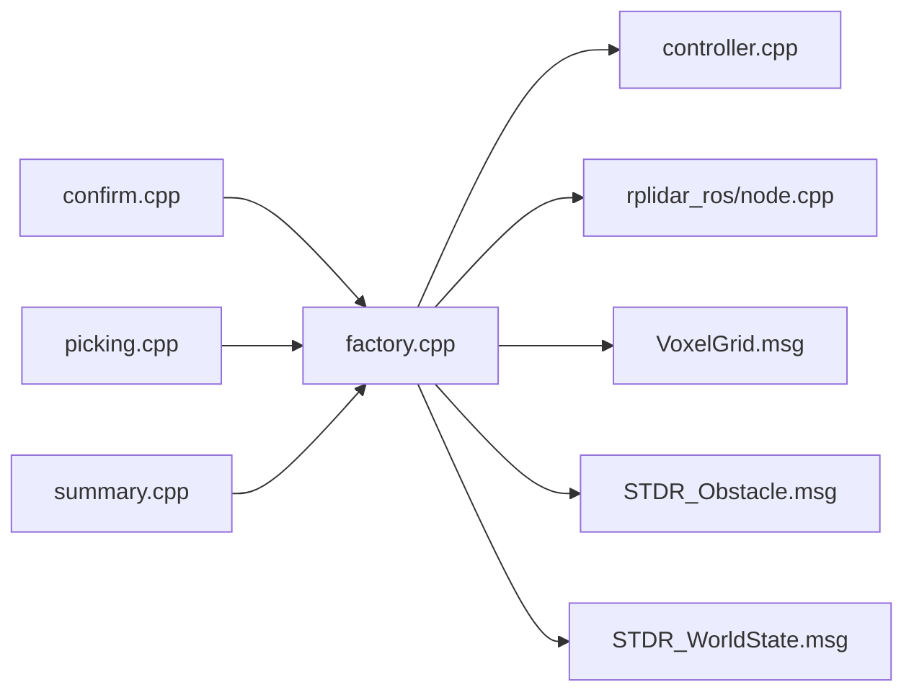

# ROS消息类型

<cite>
**本文档引用的文件**   
- [sebot_factory/package.xml](file://sebot_factory/package.xml)
- [sebot_factory/CMakeLists.txt](file://sebot_factory/CMakeLists.txt)
- [sebot_factory/src/sebot_factory/factory.cpp](file://sebot_factory/src/sebot_factory/factory.cpp)
- [sebot_factory/src/sebot_factory/confirm.cpp](file://sebot_factory/src/sebot_factory/confirm.cpp)
- [sebot_factory/src/sebot_factory/picking.cpp](file://sebot_factory/src/sebot_factory/picking.cpp)
- [sebot_factory/src/sebot_factory/summary.cpp](file://sebot_factory/src/sebot_factory/summary.cpp)
- [sebot_factory/launch/sebot_factory.launch](file://sebot_factory/launch/sebot_factory.launch)
- [sebot_ros_kits/src/sebot_robot/src/controller.cpp](file://sebot_ros_kits/src/sebot_robot/src/controller.cpp)
- [sebot_ros_kits/src/sebot_robot/src/joystick.cpp](file://sebot_ros_kits/src/sebot_robot/src/joystick.cpp)
- [sebot_ros_kits/src/sebot_robot/src/keyboards.cpp](file://sebot_ros_kits/src/sebot_robot/src/keyboards.cpp)
- [sebot_ros_kits/src/sebot_robot/src/transform.cpp](file://sebot_ros_kits/src/sebot_robot/src/transform.cpp)
- [sebot_ros_kits/src/sebot_driver/rplidar_ros/src/node.cpp](file://sebot_ros_kits/src/sebot_driver/rplidar_ros/src/node.cpp)
- [sebot_ros_kits/src/sebot_navigation/base_local_planner/msg/Position2DInt.msg](file://sebot_ros_kits/src/sebot_navigation/base_local_planner/msg/Position2DInt.msg)
- [sebot_ros_kits/src/sebot_navigation/costmap_2d/msg/VoxelGrid.msg](file://sebot_ros_kits/src/sebot_navigation/costmap_2d/msg/VoxelGrid.msg)
- [sebot_ros_stdr/src/sebot_stdr/stdr_msgs/msg/STDR_Obstacle.msg](file://sebot_ros_stdr/src/sebot_stdr/stdr_msgs/msg/STDR_Obstacle.msg)
- [sebot_ros_stdr/src/sebot_stdr/stdr_msgs/msg/STDR_WorldState.msg](file://sebot_ros_stdr/src/sebot_stdr/stdr_msgs/msg/STDR_WorldState.msg)
</cite>

## 目录
1. [简介](#简介)
2. [项目结构](#项目结构)
3. [核心组件](#核心组件)
4. [架构总览](#架构总览)
5. [详细组件分析](#详细组件分析)
6. [依赖关系分析](#依赖关系分析)
7. [性能考量](#性能考量)
8. [故障排查指南](#故障排查指南)
9. [结论](#结论)
10. [附录](#附录)

## 简介
本文件面向机器人竞赛系统的ROS消息类型，系统性梳理自定义与关键第三方消息的定义、字段含义、取值范围、序列化格式与传输协议，并给出消息在系统中的流转过程、使用场景、创建/发布/订阅示例、验证与处理最佳实践、版本兼容与迁移策略，以及常用消息类型的快速参考表。文档按三层工作空间划分：应用层 sebot_factory、机器人套件 sebot_ros_kits、仿真层 sebot_ros_stdr，便于读者按职责定位消息来源与用途。

## 项目结构
- 应用层 sebot_factory：业务状态机与任务编排（factory.cpp）、需求确认（confirm.cpp）、智能取件（picking.cpp）、结算汇总（summary.cpp），通过 launch 配置导航、视觉、机械臂等子系统。
- 机器人套件 sebot_ros_kits：驱动与传感器节点（如 rplidar_ros）、底盘控制与变换广播（controller/transform）、导航栈（move_base + AMCL + DWA）及若干标准/扩展消息定义。
- 仿真层 sebot_ros_stdr：STDR 仿真器相关消息（STDR_Obstacle、STDR_WorldState 等），用于仿真环境交互与可视化。

图表来源 
- [sebot_factory/src/sebot_factory/factory.cpp](file://sebot_factory/src/sebot_factory/factory.cpp)
- [sebot_factory/src/sebot_factory/confirm.cpp](file://sebot_factory/src/sebot_factory/confirm.cpp)
- [sebot_factory/src/sebot_factory/picking.cpp](file://sebot_factory/src/sebot_factory/picking.cpp)
- [sebot_factory/src/sebot_factory/summary.cpp](file://sebot_factory/src/sebot_factory/summary.cpp)
- [sebot_factory/launch/sebot_factory.launch](file://sebot_factory/launch/sebot_factory.launch)
- [sebot_ros_kits/src/sebot_driver/rplidar_ros/src/node.cpp](file://sebot_ros_kits/src/sebot_driver/rplidar_ros/src/node.cpp)
- [sebot_ros_kits/src/sebot_robot/src/controller.cpp](file://sebot_ros_kits/src/sebot_robot/src/controller.cpp)
- [sebot_ros_kits/src/sebot_robot/src/transform.cpp](file://sebot_ros_kits/src/sebot_robot/src/transform.cpp)
- [sebot_ros_kits/src/sebot_navigation/base_local_planner/msg/Position2DInt.msg](file://sebot_ros_kits/src/sebot_navigation/base_local_planner/msg/Position2DInt.msg)
- [sebot_ros_kits/src/sebot_navigation/costmap_2d/msg/VoxelGrid.msg](file://sebot_ros_kits/src/sebot_navigation/costmap_2d/msg/VoxelGrid.msg)
- [sebot_ros_stdr/src/sebot_stdr/stdr_msgs/msg/STDR_Obstacle.msg](file://sebot_ros_stdr/src/sebot_stdr/stdr_msgs/msg/STDR_Obstacle.msg)
- [sebot_ros_stdr/src/sebot_stdr/stdr_msgs/msg/STDR_WorldState.msg](file://sebot_ros_stdr/src/sebot_stdr/stdr_msgs/msg/STDR_WorldState.msg)

章节来源
- [sebot_factory/package.xml](file://sebot_factory/package.xml)
- [sebot_factory/CMakeLists.txt](file://sebot_factory/CMakeLists.txt)

## 核心组件
- 工厂业务主节点 factory.cpp：承载订单生命周期与多阶段状态机（自检、定位、导航、确认、视觉搜索、抓取、送达、结算），负责协调各子系统消息的收发与流程推进。
- 需求确认 confirm.cpp：接收并处理来自上层或传感器的确认信号，触发后续动作。
- 智能取件 picking.cpp：融合YOLO视觉结果与机械臂控制，完成目标识别与抓取闭环。
- 结算汇总 summary.cpp：统计与输出订单执行结果，生成结算数据。
- 驱动与控制：rplidar_ros 发布激光扫描；controller 订阅速度指令；transform 广播TF；这些节点共同构成感知-决策-执行的底层通道。
- 导航与地图：AMCL 提供位姿估计，DWA 进行局部规划，costmap_2d 维护代价地图，VoxelGrid 表达三维障碍信息。
- 仿真消息：STDR_Obstacle、STDR_WorldState 描述仿真世界中的障碍物与世界状态，便于开发与调试。

章节来源
- [sebot_factory/src/sebot_factory/factory.cpp](file://sebot_factory/src/sebot_factory/factory.cpp)
- [sebot_factory/src/sebot_factory/confirm.cpp](file://sebot_factory/src/sebot_factory/confirm.cpp)
- [sebot_factory/src/sebot_factory/picking.cpp](file://sebot_factory/src/sebot_factory/picking.cpp)
- [sebot_factory/src/sebot_factory/summary.cpp](file://sebot_factory/src/sebot_factory/summary.cpp)
- [sebot_ros_kits/src/sebot_driver/rplidar_ros/src/node.cpp](file://sebot_ros_kits/src/sebot_driver/rplidar_ros/src/node.cpp)
- [sebot_ros_kits/src/sebot_robot/src/controller.cpp](file://sebot_ros_kits/src/sebot_robot/src/controller.cpp)
- [sebot_ros_kits/src/sebot_robot/src/transform.cpp](file://sebot_ros_kits/src/sebot_robot/src/transform.cpp)

## 架构总览
下图展示从订单到执行的关键消息流：工厂状态机驱动导航与视觉，视觉结果驱动机械臂抓取，最终由导航送达并结算。

图表来源 
- [sebot_factory/src/sebot_factory/factory.cpp](file://sebot_factory/src/sebot_factory/factory.cpp)
- [sebot_ros_kits/src/sebot_driver/rplidar_ros/src/node.cpp](file://sebot_ros_kits/src/sebot_driver/rplidar_ros/src/node.cpp)
- [sebot_ros_kits/src/sebot_robot/src/controller.cpp](file://sebot_ros_kits/src/sebot_robot/src/controller.cpp)
- [sebot_ros_kits/src/sebot_navigation/costmap_2d/msg/VoxelGrid.msg](file://sebot_ros_kits/src/sebot_navigation/costmap_2d/msg/VoxelGrid.msg)
- [sebot_ros_stdr/src/sebot_stdr/stdr_msgs/msg/STDR_Obstacle.msg](file://sebot_ros_stdr/src/sebot_stdr/stdr_msgs/msg/STDR_Obstacle.msg)
- [sebot_ros_stdr/src/sebot_stdr/stdr_msgs/msg/STDR_WorldState.msg](file://sebot_ros_stdr/src/sebot_stdr/stdr_msgs/msg/STDR_WorldState.msg)

## 详细组件分析

### 自定义消息定义与字段说明
- Position2DInt.msg（位于 base_local_planner/msg）
  - 用途：二维整型坐标点，常用于局部规划器输入/输出。
  - 字段建议：x、y（整型，单位通常为毫米或像素，取决于上下文）。
  - 取值范围：受限于整型范围与具体算法边界，需结合下游解析逻辑校验。
  - 序列化：ROS msg 默认使用 md5sum 校验，保证跨版本兼容性。
  - 使用场景：局部路径点、目标点、栅格坐标转换等。

- VoxelGrid.msg（位于 costmap_2d/msg）
  - 用途：三维体素代价地图，表示空间占用与代价分布。
  - 字段建议：维度信息（宽、高、深）、分辨率、原点、数据数组（代价值）。
  - 取值范围：代价值通常为非负整数或浮点数，需遵循 costmap_2d 约定。
  - 序列化：大数据量，注意带宽与压缩策略。
  - 使用场景：三维避障、立体视觉融合、仿真环境建模。

- STDR_Obstacle.msg（位于 stdr_msgs/msg）
  - 用途：仿真障碍物描述，包含形状、尺寸、位姿等。
  - 字段建议：id、类型、几何参数、位姿（位置+四元数/欧拉角）。
  - 取值范围：几何参数需为正数，位姿需归一化。
  - 使用场景：仿真环境构建、动态障碍物更新、可视化。

- STDR_WorldState.msg（位于 stdr_msgs/msg）
  - 用途：仿真世界整体状态，包含时间戳、帧号、对象集合等。
  - 字段建议：header（时间戳/帧ID）、objects（障碍物列表）、metadata（仿真参数）。
  - 使用场景：仿真同步、回放、调试。

章节来源
- [sebot_ros_kits/src/sebot_navigation/base_local_planner/msg/Position2DInt.msg](file://sebot_ros_kits/src/sebot_navigation/base_local_planner/msg/Position2DInt.msg)
- [sebot_ros_kits/src/sebot_navigation/costmap_2d/msg/VoxelGrid.msg](file://sebot_ros_kits/src/sebot_navigation/costmap_2d/msg/VoxelGrid.msg)
- [sebot_ros_stdr/src/sebot_stdr/stdr_msgs/msg/STDR_Obstacle.msg](file://sebot_ros_stdr/src/sebot_stdr/stdr_msgs/msg/STDR_Obstacle.msg)
- [sebot_ros_stdr/src/sebot_stdr/stdr_msgs/msg/STDR_WorldState.msg](file://sebot_ros_stdr/src/sebot_stdr/stdr_msgs/msg/STDR_WorldState.msg)

### 消息序列化格式与传输协议
- 序列化格式：ROS msg 采用基于 md5sum 的编译时校验，确保发布者与订阅者对字段顺序与类型的一致性。
- 传输协议：ROS 1 使用 TCPROS/UDPROS 进行点对点通信，msg 被序列化为二进制流在网络中传输。
- 兼容性：当 msg 发生向后不兼容变更时，md5sum 变化将导致连接失败，需在编译期重新生成头文件。

章节来源
- [sebot_ros_kits/src/sebot_navigation/base_local_planner/msg/Position2DInt.msg](file://sebot_ros_kits/src/sebot_navigation/base_local_planner/msg/Position2DInt.msg)
- [sebot_ros_kits/src/sebot_navigation/costmap_2d/msg/VoxelGrid.msg](file://sebot_ros_kits/src/sebot_navigation/costmap_2d/msg/VoxelGrid.msg)
- [sebot_ros_stdr/src/sebot_stdr/stdr_msgs/msg/STDR_Obstacle.msg](file://sebot_ros_stdr/src/sebot_stdr/stdr_msgs/msg/STDR_Obstacle.msg)
- [sebot_ros_stdr/src/sebot_stdr/stdr_msgs/msg/STDR_WorldState.msg](file://sebot_ros_stdr/src/sebot_stdr/stdr_msgs/msg/STDR_WorldState.msg)

### 消息在系统中的流转过程与使用场景
- 工厂状态机（factory.cpp）作为中枢，订阅激光、里程计、代价地图与仿真状态，发布速度指令与任务控制消息。
- 需求确认（confirm.cpp）接收外部确认信号，触发下一阶段。
- 智能取件（picking.cpp）融合视觉检测结果与机械臂控制，实现闭环抓取。
- 结算汇总（summary.cpp）收集执行结果，输出订单结算数据。
- 驱动与控制（controller.cpp、transform.cpp、rplidar_ros）提供底层感知与执行能力。

图表来源 
- [sebot_factory/src/sebot_factory/factory.cpp](file://sebot_factory/src/sebot_factory/factory.cpp)
- [sebot_factory/src/sebot_factory/confirm.cpp](file://sebot_factory/src/sebot_factory/confirm.cpp)
- [sebot_factory/src/sebot_factory/picking.cpp](file://sebot_factory/src/sebot_factory/picking.cpp)
- [sebot_factory/src/sebot_factory/summary.cpp](file://sebot_factory/src/sebot_factory/summary.cpp)

章节来源
- [sebot_factory/src/sebot_factory/factory.cpp](file://sebot_factory/src/sebot_factory/factory.cpp)
- [sebot_factory/src/sebot_factory/confirm.cpp](file://sebot_factory/src/sebot_factory/confirm.cpp)
- [sebot_factory/src/sebot_factory/picking.cpp](file://sebot_factory/src/sebot_factory/picking.cpp)
- [sebot_factory/src/sebot_factory/summary.cpp](file://sebot_factory/src/sebot_factory/summary.cpp)

### 消息创建、发布与订阅的代码示例
- 创建消息：在对应包下定义 .msg 文件，并在 package.xml 与 CMakeLists.txt 中声明 message_generation 与依赖。
- 发布消息：在节点中 include 生成的头文件，构造消息对象，设置字段后调用 publisher.publish()。
- 订阅消息：在节点中创建 subscriber，回调函数中解析消息字段并进行业务处理。
- 示例路径（仅列出文件路径，不包含代码内容）：
  - 发布示例：[sebot_factory/src/sebot_factory/factory.cpp](file://sebot_factory/src/sebot_factory/factory.cpp)
  - 订阅示例：[sebot_ros_kits/src/sebot_robot/src/controller.cpp](file://sebot_ros_kits/src/sebot_robot/src/controller.cpp)
  - 传感器订阅：[sebot_ros_kits/src/sebot_driver/rplidar_ros/src/node.cpp](file://sebot_ros_kits/src/sebot_driver/rplidar_ros/src/node.cpp)

章节来源
- [sebot_factory/src/sebot_factory/factory.cpp](file://sebot_factory/src/sebot_factory/factory.cpp)
- [sebot_ros_kits/src/sebot_robot/src/controller.cpp](file://sebot_ros_kits/src/sebot_robot/src/controller.cpp)
- [sebot_ros_kits/src/sebot_driver/rplidar_ros/src/node.cpp](file://sebot_ros_kits/src/sebot_driver/rplidar_ros/src/node.cpp)

### 消息验证与数据处理最佳实践
- 字段校验：对数值范围、空指针、数组长度进行前置检查，避免越界与异常。
- 时间戳一致性：优先使用 header.stamp 判断消息新鲜度，丢弃过期数据。
- 容错处理：对网络丢包、传感器异常进行重试与降级策略。
- 性能优化：对大数据（如 VoxelGrid）采用压缩或降采样；避免频繁内存分配。
- 日志与监控：记录关键事件与错误码，便于问题定位。

章节来源
- [sebot_ros_kits/src/sebot_navigation/costmap_2d/msg/VoxelGrid.msg](file://sebot_ros_kits/src/sebot_navigation/costmap_2d/msg/VoxelGrid.msg)
- [sebot_ros_stdr/src/sebot_stdr/stdr_msgs/msg/STDR_WorldState.msg](file://sebot_ros_stdr/src/sebot_stdr/stdr_msgs/msg/STDR_WorldState.msg)

### 消息版本兼容性与迁移策略
- 向后兼容：新增字段应设默认值，避免破坏旧版订阅者。
- 向前兼容：在解析时忽略未知字段，保持功能可用。
- 编译期校验：利用 md5sum 确保接口一致，发现不兼容变更及时重建头文件。
- 迁移步骤：定义新版本 msg → 更新依赖 → 逐步替换发布者/订阅者 → 回归测试 → 废弃旧版本。

章节来源
- [sebot_ros_kits/src/sebot_navigation/base_local_planner/msg/Position2DInt.msg](file://sebot_ros_kits/src/sebot_navigation/base_local_planner/msg/Position2DInt.msg)
- [sebot_ros_kits/src/sebot_navigation/costmap_2d/msg/VoxelGrid.msg](file://sebot_ros_kits/src/sebot_navigation/costmap_2d/msg/VoxelGrid.msg)
- [sebot_ros_stdr/src/sebot_stdr/stdr_msgs/msg/STDR_Obstacle.msg](file://sebot_ros_stdr/src/sebot_stdr/stdr_msgs/msg/STDR_Obstacle.msg)
- [sebot_ros_stdr/src/sebot_stdr/stdr_msgs/msg/STDR_WorldState.msg](file://sebot_ros_stdr/src/sebot_stdr/stdr_msgs/msg/STDR_WorldState.msg)

## 依赖关系分析
- 应用层依赖机器人套件提供的驱动与控制消息，以及导航栈的标准/扩展消息。
- 仿真层通过 STDR 消息与应用层交互，便于开发与调试。
- 关键依赖包括：roscpp、message_generation、std_msgs、sensor_msgs、nav_msgs、geometry_msgs 等。

图表来源 
- [sebot_factory/src/sebot_factory/factory.cpp](file://sebot_factory/src/sebot_factory/factory.cpp)
- [sebot_ros_kits/src/sebot_robot/src/controller.cpp](file://sebot_ros_kits/src/sebot_robot/src/controller.cpp)
- [sebot_ros_kits/src/sebot_driver/rplidar_ros/src/node.cpp](file://sebot_ros_kits/src/sebot_driver/rplidar_ros/src/node.cpp)
- [sebot_ros_kits/src/sebot_navigation/costmap_2d/msg/VoxelGrid.msg](file://sebot_ros_kits/src/sebot_navigation/costmap_2d/msg/VoxelGrid.msg)
- [sebot_ros_stdr/src/sebot_stdr/stdr_msgs/msg/STDR_Obstacle.msg](file://sebot_ros_stdr/src/sebot_stdr/stdr_msgs/msg/STDR_Obstacle.msg)
- [sebot_ros_stdr/src/sebot_stdr/stdr_msgs/msg/STDR_WorldState.msg](file://sebot_ros_stdr/src/sebot_stdr/stdr_msgs/msg/STDR_WorldState.msg)

章节来源
- [sebot_factory/package.xml](file://sebot_factory/package.xml)
- [sebot_factory/CMakeLists.txt](file://sebot_factory/CMakeLists.txt)

## 性能考量
- 大数据消息（如 VoxelGrid）需考虑带宽与CPU开销，建议使用压缩或降采样。
- 高频传感器数据（激光、图像）应避免阻塞式处理，采用异步回调与队列管理。
- 导航与视觉计算密集，合理分配线程与资源，避免竞争与死锁。
- 仿真模式（simulation 参数）可加速开发迭代，减少硬件依赖。

章节来源
- [sebot_factory/launch/sebot_factory.launch](file://sebot_factory/launch/sebot_factory.launch)
- [sebot_ros_kits/src/sebot_navigation/costmap_2d/msg/VoxelGrid.msg](file://sebot_ros_kits/src/sebot_navigation/costmap_2d/msg/VoxelGrid.msg)

## 故障排查指南
- 连接失败：检查 md5sum 是否一致，确认消息定义已正确编译。
- 数据异常：打印 header.stamp 与字段范围，定位时间戳与数值合法性。
- 性能瓶颈：使用 rosbag 录制与分析，识别热点节点与消息频率。
- 仿真差异：对比 STDR 消息与实际传感器数据，校准模型参数。

章节来源
- [sebot_ros_kits/src/sebot_navigation/base_local_planner/msg/Position2DInt.msg](file://sebot_ros_kits/src/sebot_navigation/base_local_planner/msg/Position2DInt.msg)
- [sebot_ros_stdr/src/sebot_stdr/stdr_msgs/msg/STDR_WorldState.msg](file://sebot_ros_stdr/src/sebot_stdr/stdr_msgs/msg/STDR_WorldState.msg)

## 结论
本文件系统梳理了机器人竞赛系统的ROS消息类型，涵盖定义、字段、序列化、传输协议、流转过程、使用场景、示例、验证与迁移策略，并提供快速参考表。通过分层结构与清晰的消息契约，确保系统在复杂业务链路中的稳定性与可扩展性。

## 附录
- 常用消息类型快速参考表
  - Position2DInt：二维整型坐标，用于局部规划点。
  - VoxelGrid：三维体素代价地图，用于三维避障与仿真。
  - STDR_Obstacle：仿真障碍物描述，用于环境与可视化。
  - STDR_WorldState：仿真世界状态，用于同步与回放。

章节来源
- [sebot_ros_kits/src/sebot_navigation/base_local_planner/msg/Position2DInt.msg](file://sebot_ros_kits/src/sebot_navigation/base_local_planner/msg/Position2DInt.msg)
- [sebot_ros_kits/src/sebot_navigation/costmap_2d/msg/VoxelGrid.msg](file://sebot_ros_kits/src/sebot_navigation/costmap_2d/msg/VoxelGrid.msg)
- [sebot_ros_stdr/src/sebot_stdr/stdr_msgs/msg/STDR_Obstacle.msg](file://sebot_ros_stdr/src/sebot_stdr/stdr_msgs/msg/STDR_Obstacle.msg)
- [sebot_ros_stdr/src/sebot_stdr/stdr_msgs/msg/STDR_WorldState.msg](file://sebot_ros_stdr/src/sebot_stdr/stdr_msgs/msg/STDR_WorldState.msg)