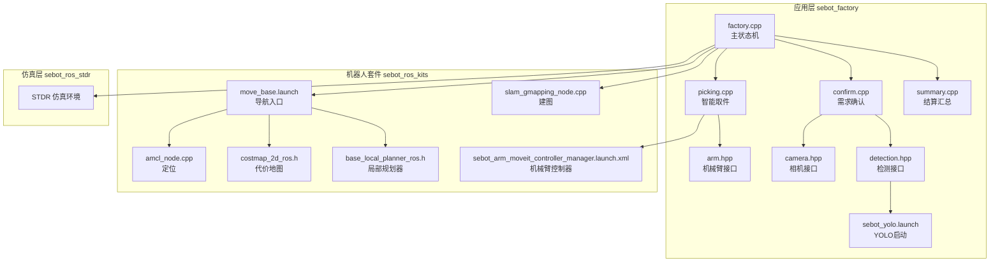
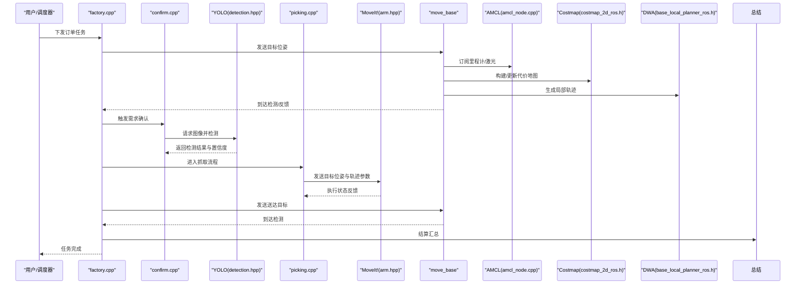
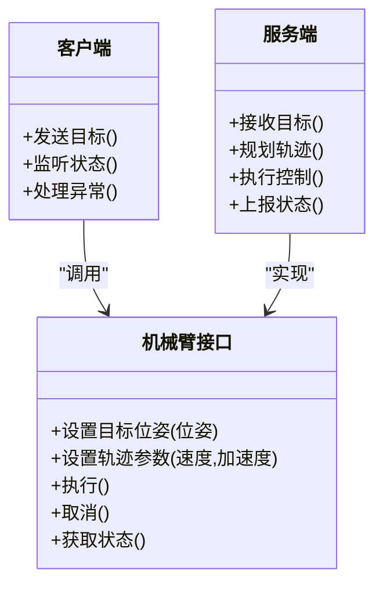
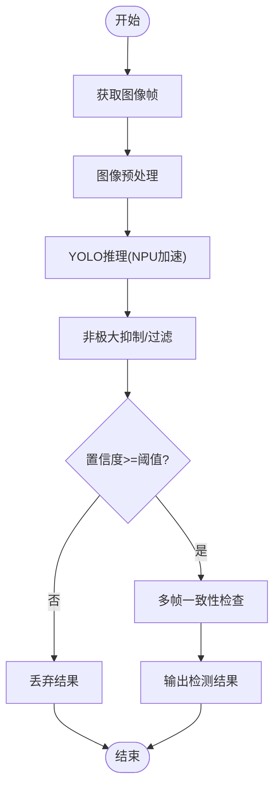
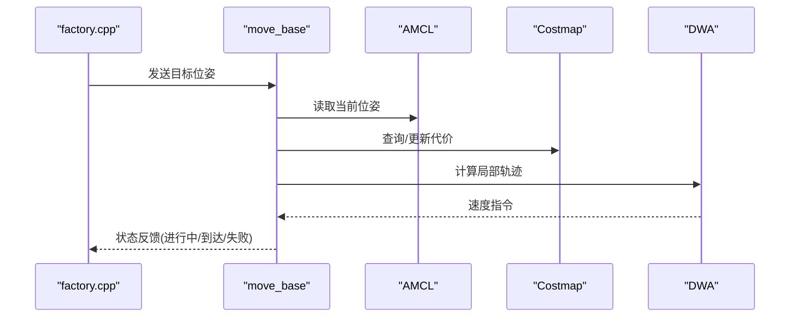
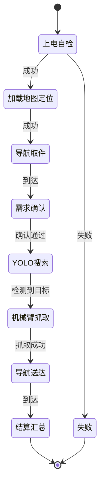
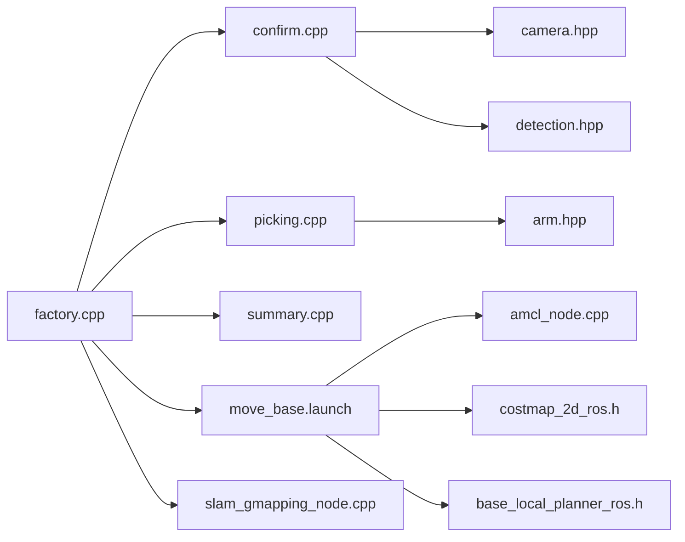

# 动作库接口

<cite>
**本文引用的文件**   
- [factory.cpp](file://sebot_factory/src/sebot_factory/src/factory.cpp)
- [confirm.cpp](file://sebot_factory/src/sebot_factory/src/confirm.cpp)
- [picking.cpp](file://sebot_factory/src/sebot_factory/src/picking.cpp)
- [summary.cpp](file://sebot_factory/src/sebot_factory/src/summary.cpp)
- [arm.hpp](file://sebot_factory/src/sebot_factory/include/arm.hpp)
- [camera.hpp](file://sebot_factory/src/sebot_factory/include/camera.hpp)
- [detection.hpp](file://sebot_factory/src/sebot_factory/include/detection.hpp)
- [sebot_yolo.launch](file://sebot_factory/src/sebot_factory/launch/sebot_yolo.launch)
- [sebot_arm_moveit_controller_manager.launch.xml](file://sebot_ros_kits/src/sebot_driver/sebot_talon_moveit/launch/sebot_arm_moveit_controller_manager.launch.xml)
- [move_base.launch](file://sebot_ros_kits/src/sebot_navigation/move_base/launch/move_base.launch)
- [amcl_node.cpp](file://sebot_ros_kits/src/sebot_navigation/amcl/src/amcl_node.cpp)
- [costmap_2d_ros.h](file://sebot_ros_kits/src/sebot_navigation/costmap_2d/include/costmap_2d/costmap_2d_ros.h)
- [base_local_planner_ros.h](file://sebot_ros_kits/src/sebot_navigation/base_local_planner/include/base_local_planner/trajectory_planner_ros.h)
- [slam_gmapping_node.cpp](file://sebot_ros_kits/src/sebot_slam/slam_gmapping/slam_gmapping/slam_gmapping_node.cpp)
- [sebot_marking.launch](file://sebot_marking/src/sebot_marking/launch/sebot_marking.launch)
</cite>

## 目录
1. [简介](#简介)
2. [项目结构](#项目结构)
3. [核心组件](#核心组件)
4. [架构总览](#架构总览)
5. [详细组件分析](#详细组件分析)
6. [依赖关系分析](#依赖关系分析)
7. [性能考虑](#性能考虑)
8. [故障排查指南](#故障排查指南)
9. [结论](#结论)
10. [附录](#附录)

## 简介
本文件为机器人竞赛系统的“动作库接口”文档，面向机械臂控制、YOLO视觉识别与导航三大动作域，给出统一的接口约定、数据定义、状态管理与异常处理策略，并提供客户端与服务端实现示例的参考路径。系统基于 ROS 1 + catkin，主业务状态机位于 sebot_factory，导航采用 move_base + AMCL + DWA，建图使用 Gmapping/Hector，机械臂通过 MoveIt!（Talon）驱动，传感器融合由 robot_pose_ekf 完成。

## 项目结构
仓库由三个相互独立的 catkin 工作空间组成：
- sebot_factory：应用层，包含工厂业务节点（订单、确认、取件、结算）、YOLO 视觉、机械臂控制等。
- sebot_ros_kits：机器人套件，包含导航栈、SLAM、MoveIt! 配置、传感器驱动等。
- sebot_ros_stdr：仿真层，提供 STDR 仿真环境与配套工具。

图表来源
- [factory.cpp](file://sebot_factory/src/sebot_factory/src/factory.cpp)
- [confirm.cpp](file://sebot_factory/src/sebot_factory/src/confirm.cpp)
- [picking.cpp](file://sebot_factory/src/sebot_factory/src/picking.cpp)
- [summary.cpp](file://sebot_factory/src/sebot_factory/src/summary.cpp)
- [arm.hpp](file://sebot_factory/src/sebot_factory/include/arm.hpp)
- [camera.hpp](file://sebot_factory/src/sebot_factory/include/camera.hpp)
- [detection.hpp](file://sebot_factory/src/sebot_factory/include/detection.hpp)
- [sebot_yolo.launch](file://sebot_factory/src/sebot_factory/launch/sebot_yolo.launch)
- [move_base.launch](file://sebot_ros_kits/src/sebot_navigation/move_base/launch/move_base.launch)
- [amcl_node.cpp](file://sebot_ros_kits/src/sebot_navigation/amcl/src/amcl_node.cpp)
- [costmap_2d_ros.h](file://sebot_ros_kits/src/sebot_navigation/costmap_2d/include/costmap_2d/costmap_2d_ros.h)
- [base_local_planner_ros.h](file://sebot_ros_kits/src/sebot_navigation/base_local_planner/include/base_local_planner/trajectory_planner_ros.h)
- [slam_gmapping_node.cpp](file://sebot_ros_kits/src/sebot_slam/slam_gmapping/slam_gmapping/slam_gmapping_node.cpp)
- [sebot_arm_moveit_controller_manager.launch.xml](file://sebot_ros_kits/src/sebot_driver/sebot_talon_moveit/launch/sebot_arm_moveit_controller_manager.launch.xml)

章节来源
- [factory.cpp](file://sebot_factory/src/sebot_factory/src/factory.cpp)
- [sebot_yolo.launch](file://sebot_factory/src/sebot_factory/launch/sebot_yolo.launch)
- [move_base.launch](file://sebot_ros_kits/src/sebot_navigation/move_base/launch/move_base.launch)

## 核心组件
- 机械臂控制接口（arm.hpp）
  - 目标位姿：关节角或笛卡尔坐标（x,y,z,roll,pitch,yaw），单位与坐标系说明见接口注释。
  - 运动轨迹：插值方式（线性/关节空间）、速度/加速度限制、避障开关。
  - 执行状态：就绪、运动中、到达、错误；支持取消与急停。
- YOLO 视觉识别接口（detection.hpp、camera.hpp）
  - 图像输入：分辨率、帧率、颜色格式、时间戳。
  - 检测结果：类别ID、边界框、中心点、置信度阈值、多帧确认计数。
  - 输出消息：检测列表、标注图像、统计信息。
- 导航动作（move_base + AMCL + DWA）
  - 路径规划：全局路径（NavFn/A*）、局部规划（DWA/Teb）。
  - 避障控制：代价地图动态更新、障碍物膨胀半径、紧急停止。
  - 到达检测：距离阈值、角度阈值、超时判定。
- 业务状态机（factory.cpp）
  - 上电自检 → 加载地图与定位 → 导航至取件台 → 需求确认 → YOLO 搜索 → 机械臂抓取 → 导航送达 → 结算汇总。

章节来源
- [arm.hpp](file://sebot_factory/src/sebot_factory/include/arm.hpp)
- [detection.hpp](file://sebot_factory/src/sebot_factory/include/detection.hpp)
- [camera.hpp](file://sebot_factory/src/sebot_factory/include/camera.hpp)
- [factory.cpp](file://sebot_factory/src/sebot_factory/src/factory.cpp)

## 架构总览
动作库以“服务/动作 + 状态机编排”的方式组织：上层 factory.cpp 作为编排者，调用 confirm.cpp、picking.cpp、summary.cpp 等业务节点；各节点通过 ROS 服务/动作与底层模块交互（YOLO、MoveIt!、move_base）。

图表来源
- [factory.cpp](file://sebot_factory/src/sebot_factory/src/factory.cpp)
- [confirm.cpp](file://sebot_factory/src/sebot_factory/src/confirm.cpp)
- [picking.cpp](file://sebot_factory/src/sebot_factory/src/picking.cpp)
- [detection.hpp](file://sebot_factory/src/sebot_factory/include/detection.hpp)
- [arm.hpp](file://sebot_factory/src/sebot_factory/include/arm.hpp)
- [move_base.launch](file://sebot_ros_kits/src/sebot_navigation/move_base/launch/move_base.launch)
- [amcl_node.cpp](file://sebot_ros_kits/src/sebot_navigation/amcl/src/amcl_node.cpp)
- [costmap_2d_ros.h](file://sebot_ros_kits/src/sebot_navigation/costmap_2d/include/costmap_2d/costmap_2d_ros.h)
- [base_local_planner_ros.h](file://sebot_ros_kits/src/sebot_navigation/base_local_planner/include/base_local_planner/trajectory_planner_ros.h)

## 详细组件分析

### 机械臂控制动作接口
- 目标位姿定义
  - 关节空间：关节角序列、速度/加速度限制。
  - 笛卡尔空间：位置(x,y,z)、姿态(四元数或RPY)。
- 运动轨迹
  - 插值策略：线性插值、关节空间平滑。
  - 约束：最大速度、加速度、加加速度、碰撞避免。
- 执行状态
  - 状态机：空闲→规划中→执行中→到达/失败。
  - 回调：进度、误差、异常事件。
- 客户端/服务端示例参考
  - 客户端：在 picking.cpp 中构造目标位姿、设置轨迹参数、发送并监听状态。
  - 服务端：在 arm.hpp 中定义接口与状态管理逻辑。

图表来源
- [arm.hpp](file://sebot_factory/src/sebot_factory/include/arm.hpp)
- [picking.cpp](file://sebot_factory/src/sebot_factory/src/picking.cpp)

章节来源
- [arm.hpp](file://sebot_factory/src/sebot_factory/include/arm.hpp)
- [picking.cpp](file://sebot_factory/src/sebot_factory/src/picking.cpp)

### YOLO 视觉识别动作接口
- 图像输入
  - 分辨率、帧率、编码格式、时间戳。
  - 可选预处理：缩放、归一化、ROI裁剪。
- 检测结果
  - 类别ID、边界框、中心点、置信度。
  - 多帧确认：连续N帧一致才输出稳定结果。
- 置信度阈值
  - 可配置阈值过滤低置信度检测。
  - 动态阈值：根据场景亮度/噪声调整。
- 客户端/服务端示例参考
  - 客户端：在 confirm.cpp 中订阅图像、调用检测服务、聚合结果。
  - 服务端：在 detection.hpp 中实现推理与后处理。

图表来源
- [detection.hpp](file://sebot_factory/src/sebot_factory/include/detection.hpp)
- [camera.hpp](file://sebot_factory/src/sebot_factory/include/camera.hpp)
- [sebot_yolo.launch](file://sebot_factory/src/sebot_factory/launch/sebot_yolo.launch)

章节来源
- [detection.hpp](file://sebot_factory/src/sebot_factory/include/detection.hpp)
- [camera.hpp](file://sebot_factory/src/sebot_factory/include/camera.hpp)
- [sebot_yolo.launch](file://sebot_factory/src/sebot_factory/launch/sebot_yolo.launch)

### 导航动作接口
- 路径规划
  - 全局规划：选择算法（A*/NavFn），代价地图静态层。
  - 局部规划：DWA/Teb，动态障碍物避让。
- 避障控制
  - 代价地图动态更新：激光雷达/深度相机观测。
  - 膨胀半径：机器人尺寸+安全裕量。
- 到达检测
  - 距离阈值：与目标位姿的距离小于设定值。
  - 角度阈值：朝向误差小于设定值。
  - 超时判定：超过最大时间视为失败。
- 客户端/服务端示例参考
  - 客户端：在 factory.cpp 中调用 move_base 动作，设置目标与超时。
  - 服务端：move_base 协调 AMCL、代价地图、局部规划器。

图表来源
- [move_base.launch](file://sebot_ros_kits/src/sebot_navigation/move_base/launch/move_base.launch)
- [amcl_node.cpp](file://sebot_ros_kits/src/sebot_navigation/amcl/src/amcl_node.cpp)
- [costmap_2d_ros.h](file://sebot_ros_kits/src/sebot_navigation/costmap_2d/include/costmap_2d/costmap_2d_ros.h)
- [base_local_planner_ros.h](file://sebot_ros_kits/src/sebot_navigation/base_local_planner/include/base_local_planner/trajectory_planner_ros.h)

章节来源
- [move_base.launch](file://sebot_ros_kits/src/sebot_navigation/move_base/launch/move_base.launch)
- [amcl_node.cpp](file://sebot_ros_kits/src/sebot_navigation/amcl/src/amcl_node.cpp)
- [costmap_2d_ros.h](file://sebot_ros_kits/src/sebot_navigation/costmap_2d/include/costmap_2d/costmap_2d_ros.h)
- [base_local_planner_ros.h](file://sebot_ros_kits/src/sebot_navigation/base_local_planner/include/base_local_planner/trajectory_planner_ros.h)

### 业务状态机与异常处理
- 状态机流程
  - 上电自检 → 加载地图与定位 → 导航至取件台 → 需求确认 → YOLO 搜索 → 机械臂抓取 → 导航送达 → 结算汇总。
- 异常处理
  - 超时：导航/视觉/机械臂均支持超时回退。
  - 重试：失败次数上限与退避策略。
  - 降级：视觉不可用时切换为手动确认或预设位姿。
- 客户端/服务端示例参考
  - 客户端：在 factory.cpp 中统一处理各子任务的异常分支。
  - 服务端：各节点内部维护状态与错误码。

图表来源
- [factory.cpp](file://sebot_factory/src/sebot_factory/src/factory.cpp)
- [confirm.cpp](file://sebot_factory/src/sebot_factory/src/confirm.cpp)
- [picking.cpp](file://sebot_factory/src/sebot_factory/src/picking.cpp)
- [summary.cpp](file://sebot_factory/src/sebot_factory/src/summary.cpp)

章节来源
- [factory.cpp](file://sebot_factory/src/sebot_factory/src/factory.cpp)
- [confirm.cpp](file://sebot_factory/src/sebot_factory/src/confirm.cpp)
- [picking.cpp](file://sebot_factory/src/sebot_factory/src/picking.cpp)
- [summary.cpp](file://sebot_factory/src/sebot_factory/src/summary.cpp)

## 依赖关系分析
- 模块耦合
  - factory.cpp 依赖 confirm.cpp、picking.cpp、summary.cpp。
  - picking.cpp 依赖 arm.hpp（机械臂接口）。
  - confirm.cpp 依赖 camera.hpp、detection.hpp（视觉接口）。
  - 导航依赖 move_base、AMCL、代价地图、局部规划器。
- 外部集成
  - MoveIt! 控制器通过 launch 文件加载。
  - SLAM 使用 slam_gmapping_node 进行建图。
  - 仿真模式通过 sebot_yolo.launch 与 STDR 集成。

图表来源
- [factory.cpp](file://sebot_factory/src/sebot_factory/src/factory.cpp)
- [confirm.cpp](file://sebot_factory/src/sebot_factory/src/confirm.cpp)
- [picking.cpp](file://sebot_factory/src/sebot_factory/src/picking.cpp)
- [summary.cpp](file://sebot_factory/src/sebot_factory/src/summary.cpp)
- [arm.hpp](file://sebot_factory/src/sebot_factory/include/arm.hpp)
- [camera.hpp](file://sebot_factory/src/sebot_factory/include/camera.hpp)
- [detection.hpp](file://sebot_factory/src/sebot_factory/include/detection.hpp)
- [move_base.launch](file://sebot_ros_kits/src/sebot_navigation/move_base/launch/move_base.launch)
- [amcl_node.cpp](file://sebot_ros_kits/src/sebot_navigation/amcl/src/amcl_node.cpp)
- [costmap_2d_ros.h](file://sebot_ros_kits/src/sebot_navigation/costmap_2d/include/costmap_2d/costmap_2d_ros.h)
- [base_local_planner_ros.h](file://sebot_ros_kits/src/sebot_navigation/base_local_planner/include/base_local_planner/trajectory_planner_ros.h)
- [slam_gmapping_node.cpp](file://sebot_ros_kits/src/sebot_slam/slam_gmapping/slam_gmapping/slam_gmapping_node.cpp)

章节来源
- [factory.cpp](file://sebot_factory/src/sebot_factory/src/factory.cpp)
- [move_base.launch](file://sebot_ros_kits/src/sebot_navigation/move_base/launch/move_base.launch)
- [slam_gmapping_node.cpp](file://sebot_ros_kits/src/sebot_slam/slam_gmapping/slam_gmapping/slam_gmapping_node.cpp)

## 性能考虑
- 视觉推理
  - NPU 加速 YOLOv3，减少 CPU 负载。
  - 多帧确认降低误检，但需平衡延迟。
- 导航优化
  - 代价地图增量更新，避免全图重算。
  - 局部规划器参数调优（速度、加速度、膨胀半径）。
- 并发控制
  - 使用线程池处理视觉与导航并行。
  - 资源锁保护共享状态（如位姿、检测结果）。
- 内存与带宽
  - 图像压缩传输，按需解码。
  - 缓冲区大小与队列长度限制，防止积压。

[本节为通用指导，不直接分析具体文件]

## 故障排查指南
- 常见问题
  - 定位漂移：检查 AMCL 参数与激光数据质量。
  - 视觉误检：调整置信度阈值与多帧确认计数。
  - 机械臂碰撞：检查轨迹规划与避障参数。
- 调试工具
  - RViz 可视化：查看路径、代价地图、检测结果。
  - rosbag 录制：回放问题场景。
- 日志与诊断
  - 关键节点日志级别提升。
  - 自定义诊断消息上报状态与健康指标。

章节来源
- [sebot_marking.launch](file://sebot_marking/src/sebot_marking/launch/sebot_marking.launch)

## 结论
本动作库接口文档围绕机械臂控制、YOLO 视觉识别与导航三大核心能力，给出了统一的接口约定、状态管理与异常处理策略，并结合实际代码路径提供了客户端与服务端的实现参考。通过合理的并发控制与性能优化，可在竞赛场景中实现稳定高效的自动化作业。

[本节为总结性内容，不直接分析具体文件]

## 附录
- 关键参数说明
  - 导航超时：move_base 动作超时时间。
  - PID 参数：机械臂闭环控制比例/积分/微分系数。
  - 取件距离：抓取前与目标的距离阈值。
  - 补扫参数：视觉缺失时的补充扫描策略。
- 启动配置
  - sebot_yolo.launch：YOLO 推理节点启动与参数。
  - sebot_arm_moveit_controller_manager.launch.xml：机械臂控制器加载。
  - move_base.launch：导航栈入口与参数。

章节来源
- [sebot_yolo.launch](file://sebot_factory/src/sebot_factory/launch/sebot_yolo.launch)
- [sebot_arm_moveit_controller_manager.launch.xml](file://sebot_ros_kits/src/sebot_driver/sebot_talon_moveit/launch/sebot_arm_moveit_controller_manager.launch.xml)
- [move_base.launch](file://sebot_ros_kits/src/sebot_navigation/move_base/launch/move_base.launch)