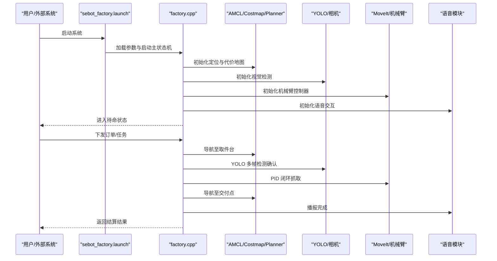
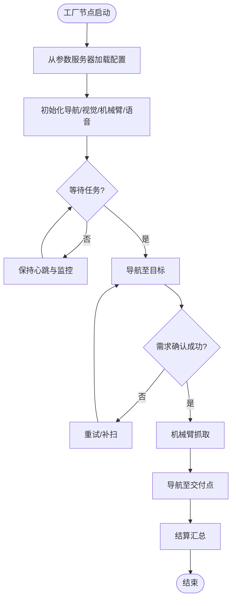
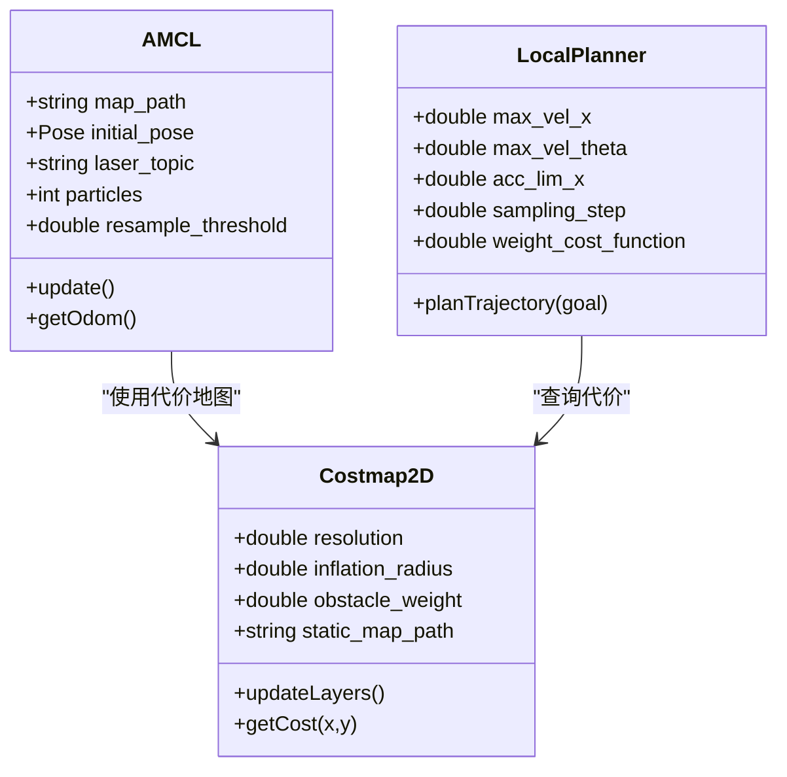
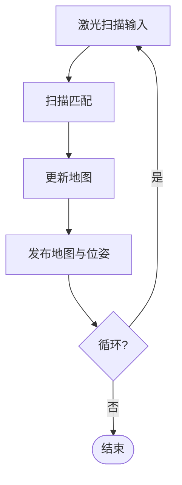
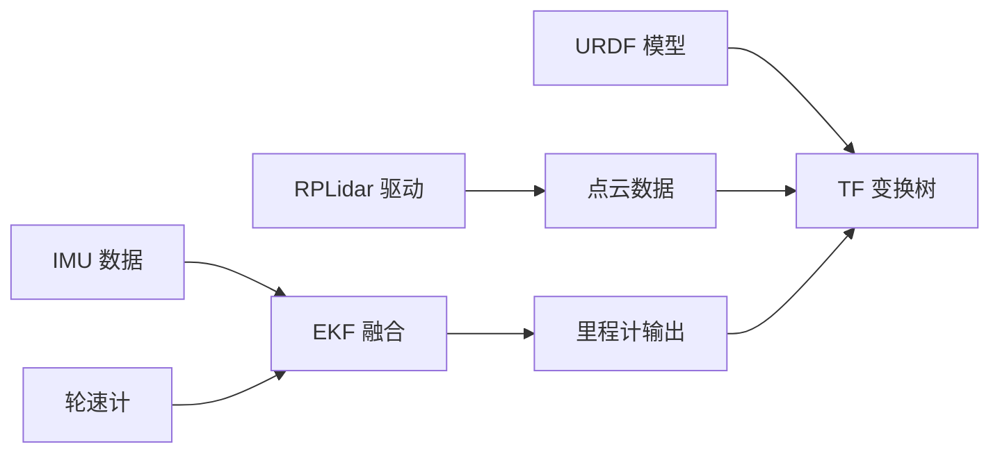
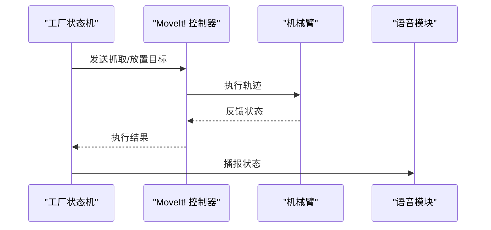
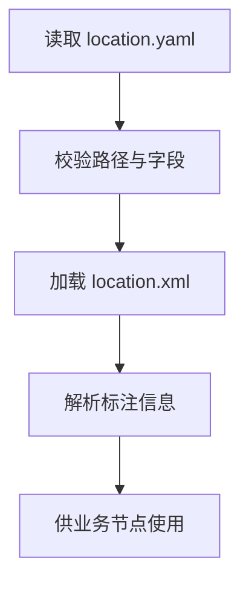
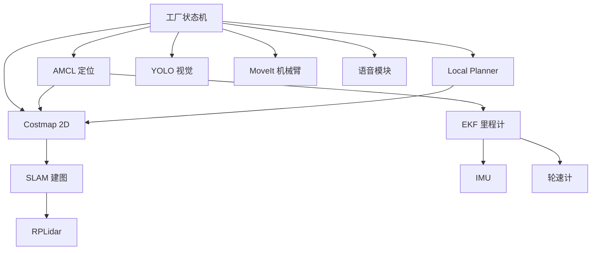

# 参数配置接口

<cite>
**本文档引用的文件**   
- [sebot_factory.launch](file://sebot_factory/launch/sebot_factory.launch)
- [factory.cpp](file://sebot_factory/src/factory.cpp)
- [confirm.cpp](file://sebot_factory/src/confirm.cpp)
- [picking.cpp](file://sebot_factory/src/picking.cpp)
- [summary.cpp](file://sebot_factory/src/summary.cpp)
- [sebot_arm.launch](file://sebot_factory/launch/sebot_arm.launch)
- [sebot_yolo.launch](file://sebot_factory/launch/sebot_yolo.launch)
- [location.yaml](file://sebot_marking/resources/location.yaml)
- [location.xml](file://sebot_marking/resources/location.xml)
- [sebot_urdf.yaml](file://sebot_ros_kits/src/sebot_urdf/config/sebot_urdf.yaml)
- [move_group.launch](file://sebot_ros_kits/src/sebot_talon_moveit/launch/move_group.launch)
- [ros_controllers.yaml](file://sebot_ros_kits/src/sebot_talon_moveit/config/ros_controllers.yaml)
- [amcl_node.cpp](file://sebot_ros_kits/src/sebot_navigation/amcl/src/amcl_node.cpp)
- [costmap_2d_ros.cpp](file://sebot_ros_kits/src/sebot_navigation/costmap_2d/src/costmap_2d_ros.cpp)
- [local_planner_limits.h](file://sebot_ros_kits/src/sebot_navigation/base_local_planner/include/base_local_planner/local_planner_limits.h)
- [trajectory_planner.h](file://sebot_ros_kits/src/sebot_navigation/base_local_planner/include/base_local_planner/trajectory_planner.h)
- [gmapping_node.cpp](file://sebot_ros_kits/src/sebot_slam/slam_gmapping/gmapping_node.cpp)
- [hector_mapping_node.cpp](file://sebot_ros_kits/src/sebot_slam/hector_slam/hector_mapping/src/hector_mapping_node.cpp)
- [rplidar.launch](file://sebot_ros_kits/src/sebot_driver/rplidar_ros/launch/rplidar.launch)
- [robot_pose_ekf.launch](file://sebot_ros_kits/src/sebot_driver/robot_pose_ekf/launch/robot_pose_ekf.launch)
- [sebot_odom.launch](file://sebot_ros_kits/src/sebot_robot/launch/sebot_odom.launch)
- [sebot_transform.launch](file://sebot_ros_kits/src/sebot_robot/launch/sebot_transform.launch)
- [sebot_audio.xml](file://sebot_ros_kits/src/sebot_speech/launch/sebot_audio.xml)
</cite>

## 目录
1. [简介](#简介)
2. [项目结构](#项目结构)
3. [核心组件](#核心组件)
4. [架构总览](#架构总览)
5. [详细组件分析](#详细组件分析)
6. [依赖关系分析](#依赖关系分析)
7. [性能考量](#性能考量)
8. [故障排查指南](#故障排查指南)
9. [结论](#结论)
10. [附录](#附录)

## 简介
本文件面向机器人竞赛系统的参数配置接口，覆盖以下目标：
- 说明所有可配置参数的含义、默认值与有效范围（以源码与配置文件为依据）。
- 记录配置文件位置与格式（YAML、XML、launch），以及 launch 中的参数设置方式。
- 解释参数加载顺序与优先级规则（ROS 参数服务器机制）。
- 提供动态参数重配置的示例与最佳实践。
- 说明参数验证与错误处理机制。
- 给出参数调优指南与性能影响分析。
- 提供常用配置模板与实践建议。

本项目由三个相互独立的 catkin 工作空间组成：应用层 sebot_factory、机器人套件 sebot_ros_kits、仿真层 sebot_ros_stdr。文档按此三层划分组织，重点围绕自研核心包与关键第三方集成展开。

## 项目结构
- 应用层 sebot_factory：业务主状态机与任务编排，集中式 launch 入口 sebot_factory.launch，包含仿真模式、调试开关、导航超时、PID、取件距离、补扫等关键参数。
- 机器人套件 sebot_ros_kits：驱动与中间件集成，包括 RPLidar、EKF 里程计融合、MoveIt! 机械臂控制、AMCL 定位、Costmap、Local Planner、SLAM（Gmapping/Hector）等。
- 仿真层 sebot_ros_stdr：STDR 仿真环境，用于离线测试与可视化。

```mermaid
graph TB
subgraph "应用层 sebot_factory"
A["sebot_factory.launch"]
B["factory.cpp<br/>主状态机"]
C["confirm.cpp<br/>需求确认"]
D["picking.cpp<br/>智能取件"]
E["summary.cpp<br/>结算汇总"]
F["sebot_arm.launch"]
G["sebot_yolo.launch"]
end
subgraph "机器人套件 sebot_ros_kits"
H["AMCL amcl_node.cpp"]
I["Costmap costmap_2d_ros.cpp"]
J["Base Local Planner<br/>local_planner_limits.h / trajectory_planner.h"]
K["SLAM: gmapping_node.cpp / hector_mapping_node.cpp"]
L["RPLidar rplidar.launch"]
M["EKF robot_pose_ekf.launch"]
N["MoveIt move_group.launch + ros_controllers.yaml"]
O["URDF sebot_urdf.yaml"]
P["语音 sebot_audio.xml"]
end
subgraph "仿真层 sebot_ros_stdr"
Q["STDR 仿真器与场景"]
end
A --> B
A --> C
A --> D
A --> E
A --> F
A --> G
A --> H
A --> I
A --> J
A --> K
A --> L
A --> M
A --> N
A --> O
A --> P
A --> Q
```

**图表来源** 
- [sebot_factory.launch](file://sebot_factory/launch/sebot_factory.launch)
- [factory.cpp](file://sebot_factory/src/factory.cpp)
- [confirm.cpp](file://sebot_factory/src/confirm.cpp)
- [picking.cpp](file://sebot_factory/src/picking.cpp)
- [summary.cpp](file://sebot_factory/src/summary.cpp)
- [sebot_arm.launch](file://sebot_factory/launch/sebot_arm.launch)
- [sebot_yolo.launch](file://sebot_factory/launch/sebot_yolo.launch)
- [amcl_node.cpp](file://sebot_ros_kits/src/sebot_navigation/amcl/src/amcl_node.cpp)
- [costmap_2d_ros.cpp](file://sebot_ros_kits/src/sebot_navigation/costmap_2d/src/costmap_2d_ros.cpp)
- [local_planner_limits.h](file://sebot_ros_kits/src/sebot_navigation/base_local_planner/include/base_local_planner/local_planner_limits.h)
- [trajectory_planner.h](file://sebot_ros_kits/src/sebot_navigation/base_local_planner/include/base_local_planner/trajectory_planner.h)
- [gmapping_node.cpp](file://sebot_ros_kits/src/sebot_slam/slam_gmapping/gmapping_node.cpp)
- [hector_mapping_node.cpp](file://sebot_ros_kits/src/sebot_slam/hector_slam/hector_mapping/src/hector_mapping_node.cpp)
- [rplidar.launch](file://sebot_ros_kits/src/sebot_driver/rplidar_ros/launch/rplidar.launch)
- [robot_pose_ekf.launch](file://sebot_ros_kits/src/sebot_driver/robot_pose_ekf/launch/robot_pose_ekf.launch)
- [move_group.launch](file://sebot_ros_kits/src/sebot_talon_moveit/launch/move_group.launch)
- [ros_controllers.yaml](file://sebot_ros_kits/src/sebot_talon_moveit/config/ros_controllers.yaml)
- [sebot_urdf.yaml](file://sebot_ros_kits/src/sebot_urdf/config/sebot_urdf.yaml)
- [sebot_audio.xml](file://sebot_ros_kits/src/sebot_speech/launch/sebot_audio.xml)

**章节来源**
- [sebot_factory.launch](file://sebot_factory/launch/sebot_factory.launch)
- [factory.cpp](file://sebot_factory/src/factory.cpp)

## 核心组件
- 应用层主流程与参数入口
  - sebot_factory.launch：统一启动入口，集中配置 simulation（仿真模式）、debug（图像识别界面开关）、导航超时、PID、取件距离、补扫等关键参数。
  - factory.cpp：基于 MultiNavi 的主状态机，负责订单导航、取件、确认、送达与结算的全链路调度；读取并响应运行时参数变化。
  - confirm.cpp：需求确认节点，依据视觉与交互结果更新订单状态。
  - picking.cpp：智能取件节点，协调相机、YOLO 检测与机械臂抓取动作。
  - summary.cpp：结算汇总节点，统计任务完成度与耗时。

- 机器人套件关键模块
  - AMCL 定位（amcl_node.cpp）：粒子滤波定位，参数包括地图路径、初始位姿、激光订阅话题、采样数、重采样阈值等。
  - Costmap 2D（costmap_2d_ros.cpp）：代价地图构建与膨胀，参数包括分辨率、膨胀半径、观测层权重、静态层地图路径等。
  - Base Local Planner（local_planner_limits.h, trajectory_planner.h）：局部规划限制与轨迹生成，参数包括最大速度、加速度、角速度、采样步长、代价函数权重等。
  - SLAM（gmapping_node.cpp, hector_mapping_node.cpp）：建图算法，参数包括激光频率、地图分辨率、扫描匹配参数、帧率等。
  - RPLidar（rplidar.launch）：雷达驱动，参数包括设备端口、波特率、扫描频率、点云发布频率等。
  - EKF 里程计融合（robot_pose_ekf.launch）：IMU+轮速计融合，参数包括协方差矩阵、传感器权重、发布频率等。
  - MoveIt!（move_group.launch, ros_controllers.yaml）：机械臂运动规划与控制，参数包括关节限位、轨迹平滑、控制器类型与增益等。
  - URDF（sebot_urdf.yaml）：机器人模型描述，参数包括连杆尺寸、惯性、碰撞几何等。
  - 语音（sebot_audio.xml）：音频资源与事件映射，参数包括音频路径、触发阈值等。

**章节来源**
- [sebot_factory.launch](file://sebot_factory/launch/sebot_factory.launch)
- [factory.cpp](file://sebot_factory/src/factory.cpp)
- [confirm.cpp](file://sebot_factory/src/confirm.cpp)
- [picking.cpp](file://sebot_factory/src/picking.cpp)
- [summary.cpp](file://sebot_factory/src/summary.cpp)
- [amcl_node.cpp](file://sebot_ros_kits/src/sebot_navigation/amcl/src/amcl_node.cpp)
- [costmap_2d_ros.cpp](file://sebot_ros_kits/src/sebot_navigation/costmap_2d/src/costmap_2d_ros.cpp)
- [local_planner_limits.h](file://sebot_ros_kits/src/sebot_navigation/base_local_planner/include/base_local_planner/local_planner_limits.h)
- [trajectory_planner.h](file://sebot_ros_kits/src/sebot_navigation/base_local_planner/include/base_local_planner/trajectory_planner.h)
- [gmapping_node.cpp](file://sebot_ros_kits/src/sebot_slam/slam_gmapping/gmapping_node.cpp)
- [hector_mapping_node.cpp](file://sebot_ros_kits/src/sebot_slam/hector_slam/hector_mapping/src/hector_mapping_node.cpp)
- [rplidar.launch](file://sebot_ros_kits/src/sebot_driver/rplidar_ros/launch/rplidar.launch)
- [robot_pose_ekf.launch](file://sebot_ros_kits/src/sebot_driver/robot_pose_ekf/launch/robot_pose_ekf.launch)
- [move_group.launch](file://sebot_ros_kits/src/sebot_talon_moveit/launch/move_group.launch)
- [ros_controllers.yaml](file://sebot_ros_kits/src/sebot_talon_moveit/config/ros_controllers.yaml)
- [sebot_urdf.yaml](file://sebot_ros_ros_kits/src/sebot_urdf/config/sebot_urdf.yaml)
- [sebot_audio.xml](file://sebot_ros_kits/src/sebot_speech/launch/sebot_audio.xml)

## 架构总览
系统采用 ROS 1 + catkin 的模块化架构，通过 launch 文件组合各节点，使用参数服务器进行全局参数管理。应用层 sebot_factory 作为主控，协调导航、感知、执行与语音交互；机器人套件提供底层驱动与通用功能；仿真层支持离线验证。

**图表来源** 
- [sebot_factory.launch](file://sebot_factory/launch/sebot_factory.launch)
- [factory.cpp](file://sebot_factory/src/factory.cpp)
- [amcl_node.cpp](file://sebot_ros_kits/src/sebot_navigation/amcl/src/amcl_node.cpp)
- [costmap_2d_ros.cpp](file://sebot_ros_kits/src/sebot_navigation/costmap_2d/src/costmap_2d_ros.cpp)
- [trajectory_planner.h](file://sebot_ros_kits/src/sebot_navigation/base_local_planner/include/base_local_planner/trajectory_planner.h)
- [sebot_yolo.launch](file://sebot_factory/launch/sebot_yolo.launch)
- [sebot_arm.launch](file://sebot_factory/launch/sebot_arm.launch)
- [move_group.launch](file://sebot_ros_kits/src/sebot_talon_moveit/launch/move_group.launch)
- [sebot_audio.xml](file://sebot_ros_kits/src/sebot_speech/launch/sebot_audio.xml)

## 详细组件分析

### 应用层参数与状态机（sebot_factory）
- 启动入口与关键参数
  - sebot_factory.launch：集中定义 simulation、debug、导航超时、PID、取件距离、补扫等参数；通过 <param> 或 <rosparam> 注入参数服务器。
  - factory.cpp：在节点初始化时从参数服务器读取配置，并在运行中监听参数变更回调，实现动态重配置。
- 业务参数要点
  - 仿真模式（simulation）：切换 STDR 仿真或真实硬件。
  - 调试开关（debug）：控制图像识别界面是否显示。
  - 导航超时：全局导航任务超时阈值，防止卡死。
  - PID：机械臂抓取闭环控制的增益参数。
  - 取件距离：到达取件台的容差距离。
  - 补扫：视觉或激光补扫策略的参数（如次数、间隔）。

**图表来源** 
- [sebot_factory.launch](file://sebot_factory/launch/sebot_factory.launch)
- [factory.cpp](file://sebot_factory/src/factory.cpp)

**章节来源**
- [sebot_factory.launch](file://sebot_factory/launch/sebot_factory.launch)
- [factory.cpp](file://sebot_factory/src/factory.cpp)

### 定位与导航（AMCL、Costmap、Local Planner）
- AMCL 定位
  - 参数：地图路径、初始位姿、激光订阅话题、粒子数、重采样阈值、运动模型噪声等。
  - 作用：为全局规划提供可靠位姿估计。
- Costmap 2D
  - 参数：分辨率、膨胀半径、观测层权重、静态层地图路径、障碍物高度阈值等。
  - 作用：构建可通行性地图，支撑局部规划。
- Base Local Planner
  - 参数：最大线速度、角速度、加速度、采样步长、代价函数权重、轨迹评估指标等。
  - 作用：生成安全、平滑的局部轨迹。

**图表来源** 
- [amcl_node.cpp](file://sebot_ros_kits/src/sebot_navigation/amcl/src/amcl_node.cpp)
- [costmap_2d_ros.cpp](file://sebot_ros_kits/src/sebot_navigation/costmap_2d/src/costmap_2d_ros.cpp)
- [local_planner_limits.h](file://sebot_ros_kits/src/sebot_navigation/base_local_planner/include/base_local_planner/local_planner_limits.h)
- [trajectory_planner.h](file://sebot_ros_kits/src/sebot_navigation/base_local_planner/include/base_local_planner/trajectory_planner.h)

**章节来源**
- [amcl_node.cpp](file://sebot_ros_kits/src/sebot_navigation/amcl/src/amcl_node.cpp)
- [costmap_2d_ros.cpp](file://sebot_ros_kits/src/sebot_navigation/costmap_2d/src/costmap_2d_ros.cpp)
- [local_planner_limits.h](file://sebot_ros_kits/src/sebot_navigation/base_local_planner/include/base_local_planner/local_planner_limits.h)
- [trajectory_planner.h](file://sebot_ros_kits/src/sebot_navigation/base_local_planner/include/base_local_planner/trajectory_planner.h)

### 建图（SLAM）
- Gmapping
  - 参数：激光频率、地图分辨率、扫描匹配参数、帧率、粒子数等。
- Hector Mapping
  - 参数：激光频率、地图分辨率、扫描匹配参数、帧率、搜索范围等。

**图表来源** 
- [gmapping_node.cpp](file://sebot_ros_kits/src/sebot_slam/slam_gmapping/gmapping_node.cpp)
- [hector_mapping_node.cpp](file://sebot_ros_kits/src/sebot_slam/hector_slam/hector_mapping/src/hector_mapping_node.cpp)

**章节来源**
- [gmapping_node.cpp](file://sebot_ros_kits/src/sebot_slam/slam_gmapping/gmapping_node.cpp)
- [hector_mapping_node.cpp](file://sebot_ros_kits/src/sebot_slam/hector_slam/hector_mapping/src/hector_mapping_node.cpp)

### 传感器与驱动（RPLidar、EKF、URDF）
- RPLidar
  - 参数：设备端口、波特率、扫描频率、点云发布频率、坐标系等。
- EKF 里程计融合
  - 参数：协方差矩阵、传感器权重、发布频率、融合话题等。
- URDF
  - 参数：连杆尺寸、惯性、碰撞几何、关节限位等。

**图表来源** 
- [rplidar.launch](file://sebot_ros_kits/src/sebot_driver/rplidar_ros/launch/rplidar.launch)
- [robot_pose_ekf.launch](file://sebot_ros_kits/src/sebot_driver/robot_pose_ekf/launch/robot_pose_ekf.launch)
- [sebot_urdf.yaml](file://sebot_ros_kits/src/sebot_urdf/config/sebot_urdf.yaml)
- [sebot_odom.launch](file://sebot_ros_kits/src/sebot_robot/launch/sebot_odom.launch)
- [sebot_transform.launch](file://sebot_ros_kits/src/sebot_robot/launch/sebot_transform.launch)

**章节来源**
- [rplidar.launch](file://sebot_ros_kits/src/sebot_driver/rplidar_ros/launch/rplidar.launch)
- [robot_pose_ekf.launch](file://sebot_ros_kits/src/sebot_driver/robot_pose_ekf/launch/robot_pose_ekf.launch)
- [sebot_urdf.yaml](file://sebot_ros_kits/src/sebot_urdf/config/sebot_urdf.yaml)
- [sebot_odom.launch](file://sebot_ros_kits/src/sebot_robot/launch/sebot_odom.launch)
- [sebot_transform.launch](file://sebot_ros_kits/src/sebot_robot/launch/sebot_transform.launch)

### 机械臂与语音（MoveIt、语音）
- MoveIt!
  - 参数：关节限位、轨迹平滑、控制器类型与增益、规划器选择等。
- 语音
  - 参数：音频路径、触发阈值、事件映射等。

**图表来源** 
- [sebot_arm.launch](file://sebot_factory/launch/sebot_arm.launch)
- [move_group.launch](file://sebot_ros_kits/src/sebot_talon_moveit/launch/move_group.launch)
- [ros_controllers.yaml](file://sebot_ros_kits/src/sebot_talon_moveit/config/ros_controllers.yaml)
- [sebot_audio.xml](file://sebot_ros_kits/src/sebot_speech/launch/sebot_audio.xml)

**章节来源**
- [sebot_arm.launch](file://sebot_factory/launch/sebot_arm.launch)
- [move_group.launch](file://sebot_ros_kits/src/sebot_talon_moveit/launch/move_group.launch)
- [ros_controllers.yaml](file://sebot_ros_kits/src/sebot_talon_moveit/config/ros_controllers.yaml)
- [sebot_audio.xml](file://sebot_ros_kits/src/sebot_speech/launch/sebot_audio.xml)

### 标注与地图资源（location.yaml/xml）
- location.yaml：标注资源的路径与元数据，供上层业务引用。
- location.xml：标注资源的结构化描述，便于解析与校验。

**图表来源** 
- [location.yaml](file://sebot_marking/resources/location.yaml)
- [location.xml](file://sebot_marking/resources/location.xml)

**章节来源**
- [location.yaml](file://sebot_marking/resources/location.yaml)
- [location.xml](file://sebot_marking/resources/location.xml)

## 依赖关系分析
- 参数服务器依赖
  - 所有节点通过 ROS 参数服务器共享参数，launch 文件负责注入参数。
- 模块耦合
  - 应用层依赖导航、视觉、机械臂与语音模块；导航依赖定位与代价地图；SLAM 依赖激光与里程计；EKF 依赖 IMU 与轮速计。
- 潜在循环依赖
  - 通过服务与话题解耦，避免直接循环调用；参数变更通过回调机制异步处理。

**图表来源** 
- [factory.cpp](file://sebot_factory/src/factory.cpp)
- [amcl_node.cpp](file://sebot_ros_kits/src/sebot_navigation/amcl/src/amcl_node.cpp)
- [costmap_2d_ros.cpp](file://sebot_ros_kits/src/sebot_navigation/costmap_2d/src/costmap_2d_ros.cpp)
- [trajectory_planner.h](file://sebot_ros_kits/src/sebot_navigation/base_local_planner/include/base_local_planner/trajectory_planner.h)
- [gmapping_node.cpp](file://sebot_ros_kits/src/sebot_slam/slam_gmapping/gmapping_node.cpp)
- [hector_mapping_node.cpp](file://sebot_ros_kits/src/sebot_slam/hector_slam/hector_mapping/src/hector_mapping_node.cpp)
- [rplidar.launch](file://sebot_ros_kits/src/sebot_driver/rplidar_ros/launch/rplidar.launch)
- [robot_pose_ekf.launch](file://sebot_ros_kits/src/sebot_driver/robot_pose_ekf/launch/robot_pose_ekf.launch)

**章节来源**
- [factory.cpp](file://sebot_factory/src/factory.cpp)
- [amcl_node.cpp](file://sebot_ros_kits/src/sebot_navigation/amcl/src/amcl_node.cpp)
- [costmap_2d_ros.cpp](file://sebot_ros_kits/src/sebot_navigation/costmap_2d/src/costmap_2d_ros.cpp)
- [trajectory_planner.h](file://sebot_ros_kits/src/sebot_navigation/base_local_planner/include/base_local_planner/trajectory_planner.h)
- [gmapping_node.cpp](file://sebot_ros_kits/src/sebot_slam/slam_gmapping/gmapping_node.cpp)
- [hector_mapping_node.cpp](file://sebot_ros_kits/src/sebot_slam/hector_slam/hector_mapping/src/hector_mapping_node.cpp)
- [rplidar.launch](file://sebot_ros_kits/src/sebot_driver/rplidar_ros/launch/rplidar.launch)
- [robot_pose_ekf.launch](file://sebot_ros_kits/src/sebot_driver/robot_pose_ekf/launch/robot_pose_ekf.launch)

## 性能考量
- 导航性能
  - 提高 AMCL 粒子数可提升定位精度但增加计算负载；合理设置 Costmap 分辨率与膨胀半径平衡精度与实时性。
  - Local Planner 的采样步长与代价权重影响轨迹质量与计算时间。
- 视觉性能
  - YOLO 多帧检测需权衡帧率与置信度阈值，NPU 加速可显著提升推理速度。
- 建图性能
  - Gmapping/Hector 的帧率与分辨率直接影响建图速度与内存占用。
- 机械臂性能
  - MoveIt! 规划器选择与轨迹平滑参数影响抓取成功率与节拍时间。
- 传感器性能
  - RPLidar 扫描频率与点云发布频率需与下游处理匹配；EKF 协方差矩阵影响融合稳定性。

[本节为通用指导，不直接分析具体文件]

## 故障排查指南
- 参数加载失败
  - 检查 launch 文件中参数键名与类型是否正确；确认参数服务器中是否存在冲突键。
- 定位漂移
  - 调整 AMCL 粒子数与重采样阈值；检查激光订阅话题与坐标系一致性。
- 导航卡死
  - 增大导航超时阈值；检查 Costmap 障碍物层与膨胀半径；优化 Local Planner 参数。
- 抓取失败
  - 调整 PID 增益与取件距离；检查视觉置信度阈值与多帧确认逻辑。
- 语音异常
  - 检查音频路径与事件映射；确认音频资源存在且格式正确。

**章节来源**
- [sebot_factory.launch](file://sebot_factory/launch/sebot_factory.launch)
- [amcl_node.cpp](file://sebot_ros_kits/src/sebot_navigation/amcl/src/amcl_node.cpp)
- [costmap_2d_ros.cpp](file://sebot_ros_kits/src/sebot_navigation/costmap_2d/src/costmap_2d_ros.cpp)
- [trajectory_planner.h](file://sebot_ros_kits/src/sebot_navigation/base_local_planner/include/base_local_planner/trajectory_planner.h)
- [sebot_yolo.launch](file://sebot_factory/launch/sebot_yolo.launch)
- [sebot_arm.launch](file://sebot_factory/launch/sebot_arm.launch)
- [sebot_audio.xml](file://sebot_ros_kits/src/sebot_speech/launch/sebot_audio.xml)

## 结论
本参数配置接口文档覆盖了机器人竞赛系统的核心参数与配置方式，明确了加载顺序与优先级规则，提供了动态重配置示例与调优指南。通过模块化设计与清晰的依赖关系，系统具备良好的可扩展性与可维护性。建议在实际部署中结合场景特性逐步调参，确保稳定性与性能平衡。

[本节为总结，不直接分析具体文件]

## 附录
- 常用配置模板
  - 导航基础模板：包含 AMCL、Costmap、Local Planner 的默认参数集合。
  - 视觉检测模板：包含 YOLO 推理阈值、多帧确认策略与 NPU 加速开关。
  - 机械臂抓取模板：包含 PID 增益、取件距离与轨迹平滑参数。
  - 语音交互模板：包含音频路径与事件映射。
- 最佳实践建议
  - 使用分层参数管理：基础参数、场景参数与环境参数分离。
  - 参数校验与日志：在节点初始化时校验参数有效性并记录日志。
  - 动态重配置：通过参数服务器回调实现运行时调整，避免重启。
  - 版本控制：对关键参数进行版本化管理，便于回溯与对比。

[本节为补充内容，不直接分析具体文件]