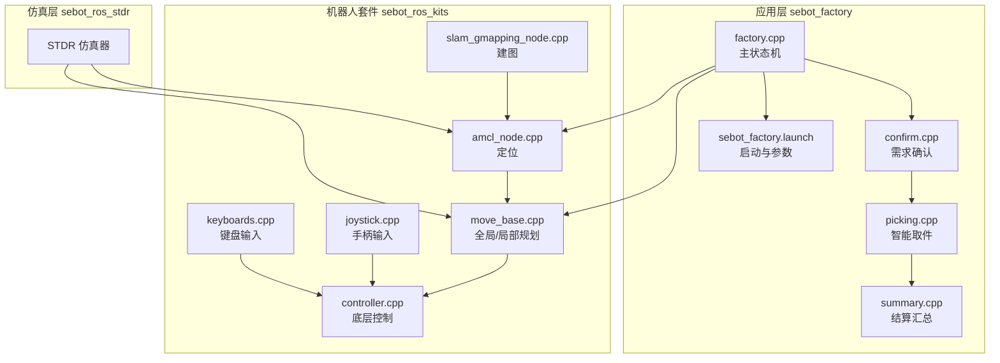
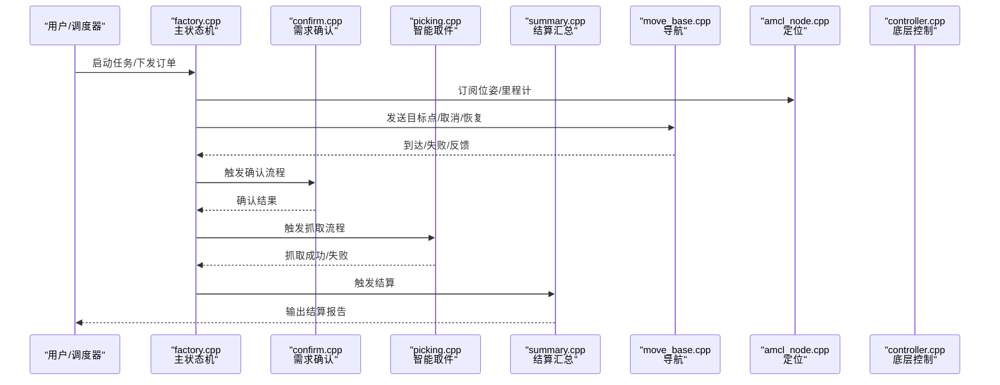
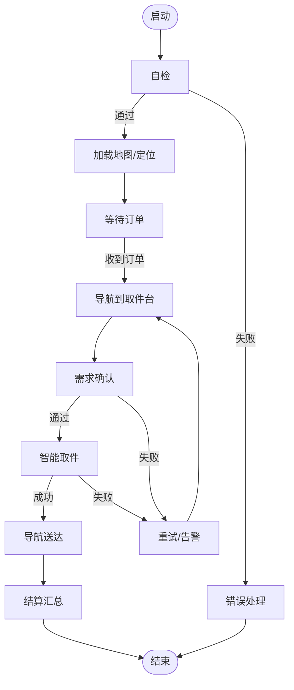
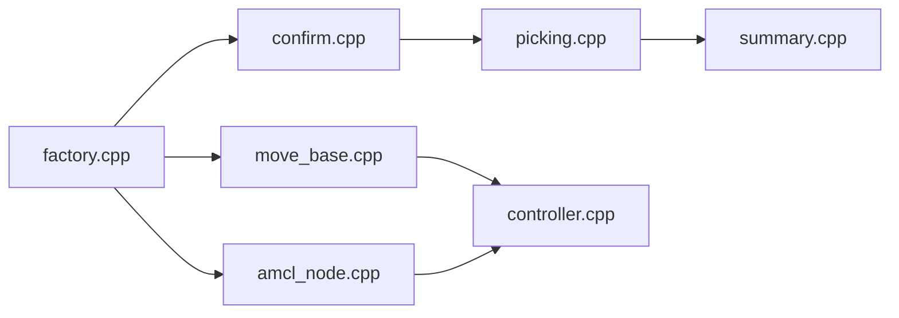

# 回调函数接口

<cite>
**本文引用的文件**   
- [factory.cpp](file://sebot_factory/src/sebot_factory/src/factory.cpp)
- [confirm.cpp](file://sebot_factory/src/sebot_factory/src/confirm.cpp)
- [picking.cpp](file://sebot_factory/src/sebot_factory/src/picking.cpp)
- [summary.cpp](file://sebot_factory/src/sebot_factory/src/summary.cpp)
- [sebot_factory.launch](file://sebot_factory/src/sebot_factory/launch/sebot_factory.launch)
- [qnode.hpp](file://sebot_factory/src/sebot_marking/include/qnode.hpp)
- [addtopics.h](file://sebot_factory/src/sebot_marking/include/addtopics.h)
- [controller.cpp](file://sebot_ros_kits/src/sebot_robot/src/controller.cpp)
- [joystick.cpp](file://sebot_ros_kits/src/sebot_robot/src/joystick.cpp)
- [keyboards.cpp](file://sebot_ros_kits/src/sebot_robot/src/keyboards.cpp)
- [amcl_node.cpp](file://sebot_ros_kits/src/sebot_navigation/amcl/src/amcl_node.cpp)
- [move_base.cpp](file://sebot_ros_kits/src/sebot_navigation/move_base/src/move_base.cpp)
- [slam_gmapping_node.cpp](file://sebot_ros_kits/src/sebot_slam/slam_gmapping/slam_gmapping_node.cpp)
</cite>

## 目录
1. [简介](#简介)
2. [项目结构](#项目结构)
3. [核心组件](#核心组件)
4. [架构总览](#架构总览)
5. [详细组件分析](#详细组件分析)
6. [依赖关系分析](#依赖关系分析)
7. [性能考虑](#性能考虑)
8. [故障排查指南](#故障排查指南)
9. [结论](#结论)
10. [附录](#附录)

## 简介
本文件面向机器人竞赛系统的“回调函数接口”，聚焦事件驱动与状态同步策略，覆盖以下要点：
- 所有回调的注册方法与触发条件
- 参数传递机制与返回值处理
- 线程安全与并发访问注意事项
- 调试与监控方法
- 性能优化与内存管理最佳实践

系统采用 ROS 1 + catkin，C++（roscpp）为主、Python 脚本为辅。比赛业务全链路为「上电自检 → 加载地图与 AMCL 定位 → 按订单导航至取件台 → 需求确认 → YOLO 视觉搜索（NPU 加速 Yolov3，多帧检测确认）→ 机械臂 PID 闭环抓取 → 导航送达并结算」，主状态机基于 MultiNavi 实现于 factory.cpp。

## 项目结构
仓库由三个相互独立的 catkin 工作空间组成：
- sebot_factory：应用层，包含工厂任务编排、需求确认、智能取件、结算汇总等节点
- sebot_ros_kits：机器人套件，包含驱动、导航栈、SLAM、语音、视觉等模块
- sebot_ros_stdr：仿真层，提供 STDR 仿真环境及工具链

图表来源
- [factory.cpp](file://sebot_factory/src/sebot_factory/src/factory.cpp)
- [confirm.cpp](file://sebot_factory/src/sebot_factory/src/confirm.cpp)
- [picking.cpp](file://sebot_factory/src/sebot_factory/src/picking.cpp)
- [summary.cpp](file://sebot_factory/src/sebot_factory/src/summary.cpp)
- [sebot_factory.launch](file://sebot_factory/src/sebot_factory/launch/sebot_factory.launch)
- [amcl_node.cpp](file://sebot_ros_kits/src/sebot_navigation/amcl/src/amcl_node.cpp)
- [move_base.cpp](file://sebot_ros_kits/src/sebot_navigation/move_base/src/move_base.cpp)
- [slam_gmapping_node.cpp](file://sebot_ros_kits/src/sebot_slam/slam_gmapping/slam_gmapping_node.cpp)
- [controller.cpp](file://sebot_ros_kits/src/sebot_robot/src/controller.cpp)
- [joystick.cpp](file://sebot_ros_kits/src/sebot_robot/src/joystick.cpp)
- [keyboards.cpp](file://sebot_ros_kits/src/sebot_robot/src/keyboards.cpp)

章节来源
- [sebot_factory.launch](file://sebot_factory/src/sebot_factory/launch/sebot_factory.launch)

## 核心组件
- 工厂主状态机（factory.cpp）
  - 负责订单调度、导航目标下发、与确认/取件/结算子节点的协作
  - 通过 ROS 订阅/服务/动作回调驱动状态迁移
- 需求确认（confirm.cpp）
  - 订阅视觉/传感器结果，完成订单需求校验
- 智能取件（picking.cpp）
  - 协调视觉识别与机械臂控制，执行抓取
- 结算汇总（summary.cpp）
  - 统计任务结果，输出结算信息
- 上位机标注（sebot_marking）
  - Qt 界面与 ROS 通信，用于建图标注与可视化
- 底层控制（sebot_robot）
  - 将高层指令转换为底盘/关节控制消息
- 导航与定位（amcl/move_base/gmapping）
  - 提供定位、路径规划与建图能力

章节来源
- [factory.cpp](file://sebot_factory/src/sebot_factory/src/factory.cpp)
- [confirm.cpp](file://sebot_factory/src/sebot_factory/src/confirm.cpp)
- [picking.cpp](file://sebot_factory/src/sebot_factory/src/picking.cpp)
- [summary.cpp](file://sebot_factory/src/sebot_factory/src/summary.cpp)
- [qnode.hpp](file://sebot_factory/src/sebot_marking/include/qnode.hpp)
- [addtopics.h](file://sebot_factory/src/sebot_marking/include/addtopics.h)
- [controller.cpp](file://sebot_ros_kits/src/sebot_robot/src/controller.cpp)
- [amcl_node.cpp](file://sebot_ros_kits/src/sebot_navigation/amcl/src/amcl_node.cpp)
- [move_base.cpp](file://sebot_ros_kits/src/sebot_navigation/move_base/src/move_base.cpp)
- [slam_gmapping_node.cpp](file://sebot_ros_kits/src/sebot_slam/slam_gmapping/slam_gmapping_node.cpp)

## 架构总览
下图展示事件驱动的回调调用链与数据流，体现从上层状态机到底层控制的完整路径。

图表来源
- [factory.cpp](file://sebot_factory/src/sebot_factory/src/factory.cpp)
- [confirm.cpp](file://sebot_factory/src/sebot_factory/src/confirm.cpp)
- [picking.cpp](file://sebot_factory/src/sebot_factory/src/picking.cpp)
- [summary.cpp](file://sebot_factory/src/sebot_factory/src/summary.cpp)
- [move_base.cpp](file://sebot_ros_kits/src/sebot_navigation/move_base/src/move_base.cpp)
- [amcl_node.cpp](file://sebot_ros_kits/src/sebot_navigation/amcl/src/amcl_node.cpp)
- [controller.cpp](file://sebot_ros_kits/src/sebot_robot/src/controller.cpp)

## 详细组件分析

### 工厂主状态机（factory.cpp）
- 角色与职责
  - 维护任务生命周期状态（自检、导航、确认、取件、送达、结算）
  - 订阅定位/里程计/传感器消息，订阅导航反馈，发布控制指令
  - 通过服务/动作与 confirm/picking/summary 交互
- 关键回调与触发条件
  - 定位/里程计回调：更新位姿，驱动导航与状态迁移
  - 导航反馈回调：到达/失败/取消时切换状态
  - 订单/任务回调：接收新任务，进入导航阶段
  - 确认/取件/结算结果回调：根据结果推进或回滚状态
- 参数传递与返回值
  - 使用 ROS 消息/服务/动作进行跨进程通信
  - 返回值为状态码或布尔标志，错误通过异常或日志上报
- 线程安全与并发
  - 共享状态需加锁或使用原子操作
  - 避免在回调中执行耗时逻辑，必要时入队异步处理

图表来源
- [factory.cpp](file://sebot_factory/src/sebot_factory/src/factory.cpp)

章节来源
- [factory.cpp](file://sebot_factory/src/sebot_factory/src/factory.cpp)

### 需求确认（confirm.cpp）
- 角色与职责
  - 订阅视觉/传感器结果，判断订单需求是否满足
- 关键回调与触发条件
  - 视觉检测结果回调：置信度阈值、多帧一致性判定
  - 传感器状态回调：设备就绪/异常
- 参数传递与返回值
  - 输入为检测结果与上下文；输出为确认结果（成功/失败/待定）
- 线程安全与并发
  - 对检测结果做时间窗口聚合，避免抖动
  - 使用只读缓存与读写锁保护共享状态

章节来源
- [confirm.cpp](file://sebot_factory/src/sebot_factory/src/confirm.cpp)

### 智能取件（picking.cpp）
- 角色与职责
  - 协调视觉识别与机械臂控制，执行抓取
- 关键回调与触发条件
  - 视觉定位回调：目标位姿更新
  - 机械臂状态回调：到位/碰撞/力控反馈
- 参数传递与返回值
  - 输入为目标位姿与抓取策略；输出为抓取结果
- 线程安全与并发
  - 控制回路需在独立线程或定时器中运行
  - 避免与 UI/日志线程竞争资源

章节来源
- [picking.cpp](file://sebot_factory/src/sebot_factory/src/picking.cpp)

### 结算汇总（summary.cpp）
- 角色与职责
  - 统计任务指标，生成结算报告
- 关键回调与触发条件
  - 任务完成回调：收集各阶段结果
- 参数传递与返回值
  - 输入为任务上下文与结果；输出为结构化报告
- 线程安全与并发
  - 写入报告时使用互斥锁，保证一致性

章节来源
- [summary.cpp](file://sebot_factory/src/sebot_factory/src/summary.cpp)

### 上位机标注（sebot_marking）
- 角色与职责
  - Qt 界面与 ROS 通信，用于建图标注与可视化
- 关键回调与触发条件
  - ROS 话题/服务回调：刷新地图、标注点、状态
- 参数传递与返回值
  - 使用自定义消息与服务接口
- 线程安全与并发
  - GUI 线程与 ROS 回调线程分离，使用队列传递数据

章节来源
- [qnode.hpp](file://sebot_factory/src/sebot_marking/include/qnode.hpp)
- [addtopics.h](file://sebot_factory/src/sebot_marking/include/addtopics.h)

### 底层控制（sebot_robot）
- 角色与职责
  - 将高层指令转换为底盘/关节控制消息
- 关键回调与触发条件
  - 速度/转向命令回调：实时下发控制
  - 传感器/里程计回调：融合与校正
- 参数传递与返回值
  - 使用标准消息类型，确保兼容性
- 线程安全与并发
  - 高频控制循环需低延迟，避免阻塞

章节来源
- [controller.cpp](file://sebot_ros_kits/src/sebot_robot/src/controller.cpp)
- [joystick.cpp](file://sebot_ros_kits/src/sebot_robot/src/joystick.cpp)
- [keyboards.cpp](file://sebot_ros_kits/src/sebot_robot/src/keyboards.cpp)

### 导航与定位（amcl/move_base/gmapping）
- 角色与职责
  - 提供定位、路径规划与建图能力
- 关键回调与触发条件
  - 定位更新回调：位姿/协方差变化
  - 规划反馈回调：路径/局部轨迹更新
  - 建图回调：栅格地图增量更新
- 参数传递与返回值
  - 使用标准导航消息与服务接口
- 线程安全与并发
  - 规划与估计过程内部多线程，外部仅通过接口交互

章节来源
- [amcl_node.cpp](file://sebot_ros_kits/src/sebot_navigation/amcl/src/amcl_node.cpp)
- [move_base.cpp](file://sebot_ros_kits/src/sebot_navigation/move_base/src/move_base.cpp)
- [slam_gmapping_node.cpp](file://sebot_ros_kits/src/sebot_slam/slam_gmapping/slam_gmapping_node.cpp)

## 依赖关系分析
- 松耦合设计
  - 各节点通过 ROS 消息/服务/动作解耦，便于替换与扩展
- 关键依赖
  - factory.cpp 依赖 amcl/move_base 提供定位与导航
  - confirm/picking/summary 通过服务/动作与 factory 交互
  - sebot_robot 依赖底层硬件接口与传感器驱动
- 潜在循环依赖
  - 通过服务/动作而非直接函数调用避免循环

图表来源
- [factory.cpp](file://sebot_factory/src/sebot_factory/src/factory.cpp)
- [amcl_node.cpp](file://sebot_ros_kits/src/sebot_navigation/amcl/src/amcl_node.cpp)
- [move_base.cpp](file://sebot_ros_kits/src/sebot_navigation/move_base/src/move_base.cpp)
- [confirm.cpp](file://sebot_factory/src/sebot_factory/src/confirm.cpp)
- [picking.cpp](file://sebot_factory/src/sebot_factory/src/picking.cpp)
- [summary.cpp](file://sebot_factory/src/sebot_factory/src/summary.cpp)
- [controller.cpp](file://sebot_ros_kits/src/sebot_robot/src/controller.cpp)

章节来源
- [factory.cpp](file://sebot_factory/src/sebot_factory/src/factory.cpp)
- [amcl_node.cpp](file://sebot_ros_kits/src/sebot_navigation/amcl/src/amcl_node.cpp)
- [move_base.cpp](file://sebot_ros_kits/src/sebot_navigation/move_base/src/move_base.cpp)
- [confirm.cpp](file://sebot_factory/src/sebot_factory/src/confirm.cpp)
- [picking.cpp](file://sebot_factory/src/sebot_factory/src/picking.cpp)
- [summary.cpp](file://sebot_factory/src/sebot_factory/src/summary.cpp)
- [controller.cpp](file://sebot_ros_kits/src/sebot_robot/src/controller.cpp)

## 性能考虑
- 回调执行时间
  - 避免在回调中执行 I/O 或重计算，使用异步队列与后台线程
- 内存管理
  - 复用消息对象，减少频繁分配；及时释放临时缓冲区
- 并发与锁
  - 最小化临界区范围，优先使用无锁数据结构或原子操作
- 网络与序列化
  - 合理设置消息频率与压缩策略，降低带宽占用
- 可视化与调试
  - 使用 rqt/rviz 监控消息与状态，开启必要日志级别

[本节为通用指导，不直接分析具体文件]

## 故障排查指南
- 常见问题
  - 回调未触发：检查话题/服务名、QoS 配置、节点连接
  - 状态卡死：检查超时与重试策略，确认导航反馈是否正常
  - 抓取失败：检查视觉置信度阈值、多帧一致性、机械臂状态
- 调试手段
  - rostopic/rosservice/rosparam 查看消息与参数
  - rosrun rqt_graph/rqt_console 观察拓扑与日志
  - 增加日志级别与断点，定位关键路径
- 恢复策略
  - 自动重试与降级模式，人工介入开关

章节来源
- [sebot_factory.launch](file://sebot_factory/src/sebot_factory/launch/sebot_factory.launch)
- [factory.cpp](file://sebot_factory/src/sebot_factory/src/factory.cpp)
- [confirm.cpp](file://sebot_factory/src/sebot_factory/src/confirm.cpp)
- [picking.cpp](file://sebot_factory/src/sebot_factory/src/picking.cpp)
- [summary.cpp](file://sebot_factory/src/sebot_factory/src/summary.cpp)
- [amcl_node.cpp](file://sebot_ros_kits/src/sebot_navigation/amcl/src/amcl_node.cpp)
- [move_base.cpp](file://sebot_ros_kits/src/sebot_navigation/move_base/src/move_base.cpp)
- [controller.cpp](file://sebot_ros_kits/src/sebot_robot/src/controller.cpp)

## 结论
本接口文档围绕事件驱动与状态同步，系统化梳理了回调函数的注册、触发、参数传递与返回值处理，并结合工厂主状态机与各子模块给出实现要点。通过合理的线程安全策略、调试监控与性能优化，可提升系统的稳定性与可维护性。

[本节为总结，不直接分析具体文件]

## 附录
- 关键参数说明（示例）
  - simulation：切换 STDR 仿真模式
  - debug：控制图像识别界面开关
  - 导航超时、PID、取件距离、补扫参数等均在 launch 文件中配置
- 参考文件
  - 启动与参数：sebot_factory.launch
  - 主状态机：factory.cpp
  - 需求确认：confirm.cpp
  - 智能取件：picking.cpp
  - 结算汇总：summary.cpp
  - 定位与导航：amcl_node.cpp、move_base.cpp
  - 建图：slam_gmapping_node.cpp
  - 底层控制：controller.cpp、joystick.cpp、keyboards.cpp

章节来源
- [sebot_factory.launch](file://sebot_factory/src/sebot_factory/launch/sebot_factory.launch)
- [factory.cpp](file://sebot_factory/src/sebot_factory/src/factory.cpp)
- [confirm.cpp](file://sebot_factory/src/sebot_factory/src/confirm.cpp)
- [picking.cpp](file://sebot_factory/src/sebot_factory/src/picking.cpp)
- [summary.cpp](file://sebot_factory/src/sebot_factory/src/summary.cpp)
- [amcl_node.cpp](file://sebot_ros_kits/src/sebot_navigation/amcl/src/amcl_node.cpp)
- [move_base.cpp](file://sebot_ros_kits/src/sebot_navigation/move_base/src/move_base.cpp)
- [slam_gmapping_node.cpp](file://sebot_ros_kits/src/sebot_slam/slam_gmapping/slam_gmapping_node.cpp)
- [controller.cpp](file://sebot_ros_kits/src/sebot_robot/src/controller.cpp)
- [joystick.cpp](file://sebot_ros_kits/src/sebot_robot/src/joystick.cpp)
- [keyboards.cpp](file://sebot_ros_kits/src/sebot_robot/src/keyboards.cpp)