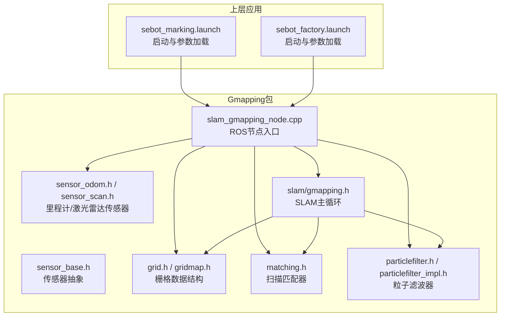
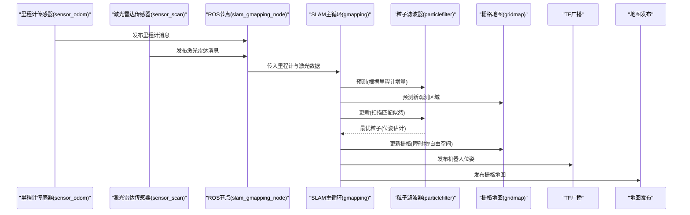
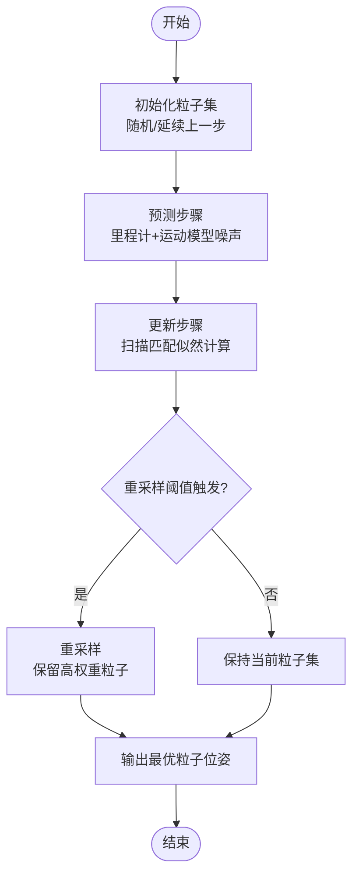
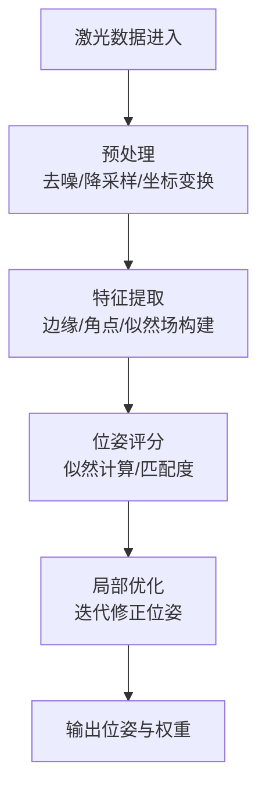
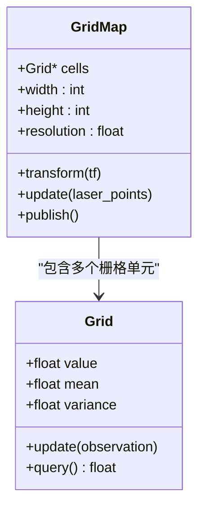
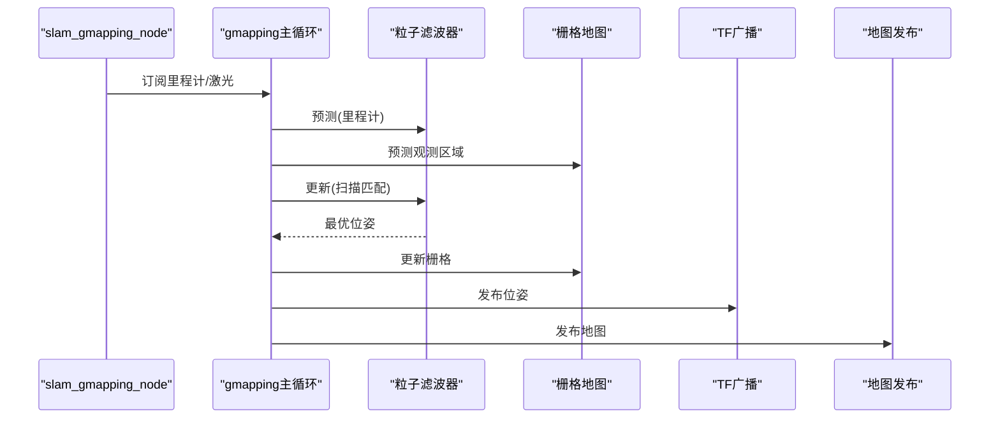
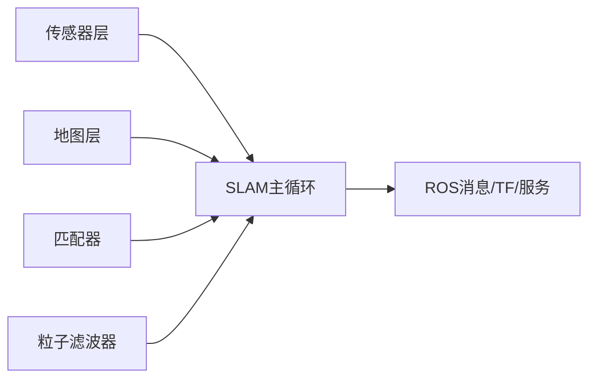
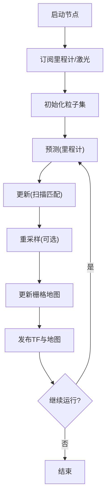

# Gmapping建图算法

<cite>
**本文引用的文件**   
- [sebot_slam/slam_gmapping/README.md](file://sebot_ros_kits/src/sebot_slam/slam_gmapping/README.md)
- [sebot_slam/slam_gmapping/CMakeLists.txt](file://sebot_ros_kits/src/sebot_slam/slam_gmapping/CMakeLists.txt)
- [sebot_slam/slam_gmapping/slam_gmapping/package.xml](file://sebot_ros_kits/src/sebot_slam/slam_gmapping/slam_gmapping/package.xml)
- [sebot_slam/slam_gmapping/slam_gmapping/slam_gmapping_node.cpp](file://sebot_ros_kits/src/sebot_slam/slam_gmapping/slam_gmapping/slam_gmapping_node.cpp)
- [sebot_slam/slam_gmapping/slam_gmapping/include/gmapping/sensor/sensor.h](file://sebot_ros_kits/src/sebot_slam/slam_gmapping/slam_gmapping/include/gmapping/sensor/sensor.h)
- [sebot_slam/slam_gmapping/slam_gmapping/include/gmapping/sensor/sensor_odom.h](file://sebot_ros_kits/src/sebot_slam/slam_gmapping/slam_gmapping/include/gmapping/sensor/sensor_odom.h)
- [sebot_slam/slam_gmapping/slam_gmapping/include/gmapping/sensor/sensor_scan.h](file://sebot_ros_kits/src/sebot_slam/slam_gmapping/slam_gmapping/include/gmapping/sensor/sensor_scan.h)
- [sebot_slam/slam_gmapping/slam_gmapping/include/gmapping/sensor/sensor_base.h](file://sebot_ros_kits/src/sebot_slam/slam_gmapping/slam_gmapping/include/gmapping/sensor/sensor_base.h)
- [sebot_slam/slam_gmapping/slam_gmapping/include/gmapping/map/gridmap.h](file://sebot_ros_kits/src/sebot_slam/slam_gmapping/slam_gmapping/include/gmapping/map/gridmap.h)
- [sebot_slam/slam_gmapping/slam_gmapping/include/gmapping/map/grid.h](file://sebot_ros_kits/src/sebot_slam/slam_gmapping/slam_gmapping/include/gmapping/map/grid.h)
- [sebot_slam/slam_gmapping/slam_gmapping/include/gmapping/map/matching.h](file://sebot_ros_kits/src/sebot_slam/slam_gmapping/slam_gmapping/include/gmapping/map/matching.h)
- [sebot_slam/slam_gmapping/slam_gmapping/include/gmapping/particlefilter/particlefilter.h](file://sebot_ros_kits/src/sebot_slam/slam_gmapping/slam_gmapping/include/gmapping/particlefilter/particlefilter.h)
- [sebot_slam/slam_gmapping/slam_gmapping/include/gmapping/particlefilter/particlefilter_impl.h](file://sebot_ros_kits/src/sebot_slam/slam_gmapping/slam_gmapping/include/gmapping/particlefilter/particlefilter_impl.h)
- [sebot_slam/slam_gmapping/slam_gmapping/include/gmapping/slam/gmapping.h](file://sebot_ros_kits/src/sebot_slam/slam_gmapping/slam_gmapping/include/gmapping/slam/gmapping.h)
- [sebot_slam/slam_gmapping/slam_gmapping/src/slam_gmapping.cpp](file://sebot_ros_kits/src/sebot_slam/slam_gmapping/slam_gmapping/src/slam_gmapping.cpp)
- [sebot_slam/slam_gmapping/slam_gmapping/src/sensor_odom.cpp](file://sebot_ros_kits/src/sebot_slam/slam_gmapping/slam_gmapping/src/sensor_odom.cpp)
- [sebot_slam/slam_gmapping/slam_gmapping/src/sensor_scan.cpp](file://sebot_ros_kits/src/sebot_slam/slam_gmapping/slam_gmapping/src/sensor_scan.cpp)
- [sebot_slam/slam_gmapping/slam_gmapping/src/gridmap.cpp](file://sebot_ros_kits/src/sebot_slam/slam_gmapping/slam_gmapping/src/gridmap.cpp)
- [sebot_slam/slam_gmapping/slam_gmapping/src/matching.cpp](file://sebot_ros_kits/src/sebot_slam/slam_gmapping/slam_gmapping/src/matching.cpp)
- [sebot_slam/slam_gmapping/slam_gmapping/src/pf.cpp](file://sebot_ros_kits/src/sebot_slam/slam_gmapping/slam_gmapping/src/pf.cpp)
- [sebot_slam/slam_gmapping/slam_gmapping/src/slam_gmapping_node.cpp](file://sebot_ros_kits/src/sebot_slam/slam_gmapping/slam_gmapping/src/slam_gmapping_node.cpp)
- [sebot_marking/launch/sebot_marking.launch](file://sebot_ros_kits/src/sebot_marking/launch/sebot_marking.launch)
- [sebot_factory/launch/sebot_factory.launch](file://sebot_factory/src/sebot_factory/launch/sebot_factory.launch)
</cite>

## 目录
1. [简介](#简介)
2. [项目结构](#项目结构)
3. [核心组件](#核心组件)
4. [架构总览](#架构总览)
5. [详细组件分析](#详细组件分析)
6. [依赖关系分析](#依赖关系分析)
7. [性能考量](#性能考量)
8. [故障排查指南](#故障排查指南)
9. [结论](#结论)
10. [附录](#附录)

## 简介
本技术文档围绕仓库中的Gmapping建图模块，系统阐述基于粒子滤波的SLAM原理与工程实现。重点覆盖：
- 粒子滤波器的初始化、预测与更新流程
- 扫描匹配（激光雷达）机制：数据预处理、特征与似然计算、位姿估计
- 栅格地图构建与更新策略：表示方法、障碍物检测与环境建模
- 关键参数配置：粒子数量、映射分辨率、运动模型噪声等
- 不同环境下的调优建议与性能优化
- 建图流程图、参数对比表与常见问题解决方案

本项目中Gmapping以ROS包形式集成于sebot_ros_kits的slam_gmapping子包，并通过launch文件与上层应用（如sebot_marking上位机、sebot_factory主节点）协同工作。

## 项目结构
- sebot_ros_kits/src/sebot_slam/slam_gmapping：Gmapping ROS封装与核心库
  - include/gmapping：核心头文件（传感器抽象、栅格地图、匹配器、粒子滤波器、SLAM主循环）
  - src：核心实现（传感器驱动、地图、匹配、粒子滤波、SLAM主逻辑）
  - slam_gmapping_node.cpp：ROS节点入口，订阅里程计与激光雷达，发布TF与地图
- sebot_marking：Qt上位机，用于交互式标注与建图可视化
- sebot_factory：工厂业务主节点，通过launch启动Gmapping并参与导航闭环

图表来源
- [sebot_slam/slam_gmapping/slam_gmapping/include/gmapping/sensor/sensor_base.h](file://sebot_ros_kits/src/sebot_slam/slam_gmapping/slam_gmapping/include/gmapping/sensor/sensor_base.h)
- [sebot_slam/slam_gmapping/slam_gmapping/include/gmapping/sensor/sensor_odom.h](file://sebot_ros_kits/src/sebot_slam/slam_gmapping/slam_gmapping/include/gmapping/sensor/sensor_odom.h)
- [sebot_slam/slam_gmapping/slam_gmapping/include/gmapping/sensor/sensor_scan.h](file://sebot_ros_kits/src/sebot_slam/slam_gmapping/slam_gmapping/include/gmapping/sensor/sensor_scan.h)
- [sebot_slam/slam_gmapping/slam_gmapping/include/gmapping/map/grid.h](file://sebot_ros_kits/src/sebot_slam/slam_gmapping/slam_gmapping/include/gmapping/map/grid.h)
- [sebot_slam/slam_gmapping/slam_gmapping/include/gmapping/map/gridmap.h](file://sebot_ros_kits/src/sebot_slam/slam_gmapping/slam_gmapping/include/gmapping/map/gridmap.h)
- [sebot_slam/slam_gmapping/slam_gmapping/include/gmapping/map/matching.h](file://sebot_ros_kits/src/sebot_slam/slam_gmapping/slam_gmapping/include/gmapping/map/matching.h)
- [sebot_slam/slam_gmapping/slam_gmapping/include/gmapping/particlefilter/particlefilter.h](file://sebot_ros_kits/src/sebot_slam/slam_gmapping/slam_gmapping/include/gmapping/particlefilter/particlefilter.h)
- [sebot_slam/slam_gmapping/slam_gmapping/include/gmapping/particlefilter/particlefilter_impl.h](file://sebot_ros_kits/src/sebot_slam/slam_gmapping/slam_gmapping/include/gmapping/particlefilter/particlefilter_impl.h)
- [sebot_slam/slam_gmapping/slam_gmapping/include/gmapping/slam/gmapping.h](file://sebot_ros_kits/src/sebot_slam/slam_gmapping/slam_gmapping/include/gmapping/slam/gmapping.h)
- [sebot_slam/slam_gmapping/slam_gmapping/slam_gmapping_node.cpp](file://sebot_ros_kits/src/sebot_slam/slam_gmapping/slam_gmapping/slam_gmapping_node.cpp)
- [sebot_marking/launch/sebot_marking.launch](file://sebot_ros_kits/src/sebot_marking/launch/sebot_marking.launch)
- [sebot_factory/launch/sebot_factory.launch](file://sebot_factory/src/sebot_factory/launch/sebot_factory.launch)

章节来源
- [sebot_slam/slam_gmapping/README.md](file://sebot_ros_kits/src/sebot_slam/slam_gmapping/README.md)
- [sebot_slam/slam_gmapping/CMakeLists.txt](file://sebot_ros_kits/src/sebot_slam/slam_gmapping/CMakeLists.txt)
- [sebot_slam/slam_gmapping/slam_gmapping/package.xml](file://sebot_ros_kits/src/sebot_slam/slam_gmapping/slam_gmapping/package.xml)

## 核心组件
- 传感器抽象层
  - sensor_base：统一传感器接口，定义时间戳、坐标系转换与数据读取回调
  - sensor_odom：里程计传感器，提供位姿增量与协方差
  - sensor_scan：激光雷达传感器，封装Scan消息到内部点集
- 栅格地图
  - grid：基础二维网格单元，支持概率值与统计量
  - gridmap：栅格地图管理，负责坐标变换、边界处理、更新与查询
- 扫描匹配
  - matching：基于似然场或特征匹配的位姿评估，输出最佳位姿与权重
- 粒子滤波器
  - particlefilter/particlefilter_impl：粒子采样、重要性采样、重采样与权重更新
- SLAM主循环
  - slam/gmapping：协调传感器输入、预测、更新、地图更新与结果发布

章节来源
- [sebot_slam/slam_gmapping/slam_gmapping/include/gmapping/sensor/sensor_base.h](file://sebot_ros_kits/src/sebot_slam/slam_gmapping/slam_gmapping/include/gmapping/sensor/sensor_base.h)
- [sebot_slam/slam_gmapping/slam_gmapping/include/gmapping/sensor/sensor_odom.h](file://sebot_ros_kits/src/sebot_slam/slam_gmapping/slam_gmapping/include/gmapping/sensor/sensor_odom.h)
- [sebot_slam/slam_gmapping/slam_gmapping/include/gmapping/sensor/sensor_scan.h](file://sebot_ros_kits/src/sebot_slam/slam_gmapping/slam_gmapping/include/gmapping/sensor/sensor_scan.h)
- [sebot_slam/slam_gmapping/slam_gmapping/include/gmapping/map/grid.h](file://sebot_ros_kits/src/sebot_slam/slam_gmapping/slam_gmapping/include/gmapping/map/grid.h)
- [sebot_slam/slam_gmapping/slam_gmapping/include/gmapping/map/gridmap.h](file://sebot_ros_kits/src/sebot_slam/slam_gmapping/slam_gmapping/include/gmapping/map/gridmap.h)
- [sebot_slam/slam_gmapping/slam_gmapping/include/gmapping/map/matching.h](file://sebot_ros_kits/src/sebot_slam/slam_gmapping/slam_gmapping/include/gmapping/map/matching.h)
- [sebot_slam/slam_gmapping/slam_gmapping/include/gmapping/particlefilter/particlefilter.h](file://sebot_ros_kits/src/sebot_slam/slam_gmapping/slam_gmapping/include/gmapping/particlefilter/particlefilter.h)
- [sebot_slam/slam_gmapping/slam_gmapping/include/gmapping/particlefilter/particlefilter_impl.h](file://sebot_ros_kits/src/sebot_slam/slam_gmapping/slam_gmapping/include/gmapping/particlefilter/particlefilter_impl.h)
- [sebot_slam/slam_gmapping/slam_gmapping/include/gmapping/slam/gmapping.h](file://sebot_ros_kits/src/sebot_slam/slam_gmapping/slam_gmapping/include/gmapping/slam/gmapping.h)

## 架构总览
Gmapping在ROS中的运行由节点入口串联传感器输入、SLAM主循环与地图发布。整体数据流如下：

图表来源
- [sebot_slam/slam_gmapping/slam_gmapping/slam_gmapping_node.cpp](file://sebot_ros_kits/src/sebot_slam/slam_gmapping/slam_gmapping/slam_gmapping_node.cpp)
- [sebot_slam/slam_gmapping/slam_gmapping/include/gmapping/slam/gmapping.h](file://sebot_ros_kits/src/sebot_slam/slam_gmapping/slam_gmapping/include/gmapping/slam/gmapping.h)
- [sebot_slam/slam_gmapping/slam_gmapping/include/gmapping/particlefilter/particlefilter.h](file://sebot_ros_kits/src/sebot_slam/slam_gmapping/slam_gmapping/include/gmapping/particlefilter/particlefilter.h)
- [sebot_slam/slam_gmapping/slam_gmapping/include/gmapping/map/gridmap.h](file://sebot_ros_kits/src/sebot_slam/slam_gmapping/slam_gmapping/include/gmapping/map/gridmap.h)

## 详细组件分析

### 粒子滤波器（初始化、预测、更新）
- 初始化
  - 在全局定位模式下，按先验分布随机生成粒子；否则从上一时刻后验分布延续
  - 设置初始权重为均匀分布或基于先验信息
- 预测
  - 依据里程计增量与运动模型对每个粒子进行状态转移
  - 加入过程噪声（平移与旋转方差），模拟实际运动不确定性
- 更新
  - 使用扫描匹配似然函数对粒子进行权重更新
  - 执行重采样（如系统重采样）避免退化
- 复杂度与稳定性
  - 时间复杂度O(N·M)，N为粒子数，M为激光点数
  - 通过自适应重采样阈值与粒子数调节保持多样性

图表来源
- [sebot_slam/slam_gmapping/slam_gmapping/include/gmapping/particlefilter/particlefilter.h](file://sebot_ros_kits/src/sebot_slam/slam_gmapping/slam_gmapping/include/gmapping/particlefilter/particlefilter.h)
- [sebot_slam/slam_gmapping/slam_gmapping/include/gmapping/particlefilter/particlefilter_impl.h](file://sebot_ros_kits/src/sebot_slam/slam_gmapping/slam_gmapping/include/gmapping/particlefilter/particlefilter_impl.h)
- [sebot_slam/slam_gmapping/slam_gmapping/src/pf.cpp](file://sebot_ros_kits/src/sebot_slam/slam_gmapping/slam_gmapping/src/pf.cpp)

章节来源
- [sebot_slam/slam_gmapping/slam_gmapping/include/gmapping/particlefilter/particlefilter.h](file://sebot_ros_kits/src/sebot_slam/slam_gmapping/slam_gmapping/include/gmapping/particlefilter/particlefilter.h)
- [sebot_slam/slam_gmapping/slam_gmapping/include/gmapping/particlefilter/particlefilter_impl.h](file://sebot_ros_kits/src/sebot_slam/slam_gmapping/slam_gmapping/include/gmapping/particlefilter/particlefilter_impl.h)
- [sebot_slam/slam_gmapping/slam_gmapping/src/pf.cpp](file://sebot_ros_kits/src/sebot_slam/slam_gmapping/slam_gmapping/src/pf.cpp)

### 扫描匹配（激光数据处理、特征提取、位姿估计）
- 数据预处理
  - 过滤无效距离、去噪、降采样（可选）
  - 将激光点投影到栅格坐标系，建立观测点集
- 特征提取与似然计算
  - 基于栅格地图构建似然场（边缘/角点增强）
  - 计算候选位姿下观测似然，选择最大似然位姿
- 位姿估计
  - 结合粒子滤波权重，输出全局最优位姿
  - 迭代优化（如梯度下降或局部搜索）提升精度

图表来源
- [sebot_slam/slam_gmapping/slam_gmapping/include/gmapping/map/matching.h](file://sebot_ros_kits/src/sebot_slam/slam_gmapping/slam_gmapping/include/gmapping/map/matching.h)
- [sebot_slam/slam_gmapping/slam_gmapping/src/matching.cpp](file://sebot_ros_kits/src/sebot_slam/slam_gmapping/slam_gmapping/src/matching.cpp)
- [sebot_slam/slam_gmapping/slam_gmapping/include/gmapping/sensor/sensor_scan.h](file://sebot_ros_kits/src/sebot_slam/slam_gmapping/slam_gmapping/include/gmapping/sensor/sensor_scan.h)
- [sebot_slam/slam_gmapping/slam_gmapping/src/sensor_scan.cpp](file://sebot_ros_kits/src/sebot_slam/slam_gmapping/slam_gmapping/src/sensor_scan.cpp)

章节来源
- [sebot_slam/slam_gmapping/slam_gmapping/include/gmapping/map/matching.h](file://sebot_ros_kits/src/sebot_slam/slam_gmapping/slam_gmapping/include/gmapping/map/matching.h)
- [sebot_slam/slam_gmapping/slam_gmapping/src/matching.cpp](file://sebot_ros_kits/src/sebot_slam/slam_gmapping/slam_gmapping/src/matching.cpp)
- [sebot_slam/slam_gmapping/slam_gmapping/include/gmapping/sensor/sensor_scan.h](file://sebot_ros_kits/src/sebot_slam/slam_gmapping/slam_gmapping/include/gmapping/sensor/sensor_scan.h)
- [sebot_slam/slam_gmapping/slam_gmapping/src/sensor_scan.cpp](file://sebot_ros_kits/src/sebot_slam/slam_gmapping/slam_gmapping/src/sensor_scan.cpp)

### 栅格地图构建与更新（表示、障碍物检测、环境建模）
- 栅格表示
  - 每个栅格存储占用概率、统计量（均值/方差）、边界标记
  - 支持动态扩展与内存复用
- 障碍物检测
  - 激光射线投射，标记自由空间与障碍物栅格
  - 考虑传感器误差模型，采用贝叶斯更新
- 环境建模
  - 融合多帧观测，平滑噪声与异常值
  - 支持多图层（占用、自由、未知）

图表来源
- [sebot_slam/slam_gmapping/slam_gmapping/include/gmapping/map/grid.h](file://sebot_ros_kits/src/sebot_slam/slam_gmapping/slam_gmapping/include/gmapping/map/grid.h)
- [sebot_slam/slam_gmapping/slam_gmapping/include/gmapping/map/gridmap.h](file://sebot_ros_kits/src/sebot_slam/slam_gmapping/slam_gmapping/include/gmapping/map/gridmap.h)
- [sebot_slam/slam_gmapping/slam_gmapping/src/gridmap.cpp](file://sebot_ros_kits/src/sebot_slam/slam_gmapping/slam_gmapping/src/gridmap.cpp)

章节来源
- [sebot_slam/slam_gmapping/slam_gmapping/include/gmapping/map/grid.h](file://sebot_ros_kits/src/sebot_slam/slam_gmapping/slam_gmapping/include/gmapping/map/grid.h)
- [sebot_slam/slam_gmapping/slam_gmapping/include/gmapping/map/gridmap.h](file://sebot_ros_kits/src/sebot_slam/slam_gmapping/slam_gmapping/include/gmapping/map/gridmap.h)
- [sebot_ros_kits/src/sebot_slam/slam_gmapping/slam_gmapping/src/gridmap.cpp](file://sebot_ros_kits/src/sebot_slam/slam_gmapping/slam_gmapping/src/gridmap.cpp)

### SLAM主循环与ROS节点
- 主循环职责
  - 接收里程计与激光数据，调用预测与更新
  - 维护粒子集与地图一致性，输出位姿与地图
- ROS节点职责
  - 订阅/发布话题，参数加载，TF广播，地图服务

图表来源
- [sebot_slam/slam_gmapping/slam_gmapping/slam_gmapping_node.cpp](file://sebot_ros_kits/src/sebot_slam/slam_gmapping/slam_gmapping/slam_gmapping_node.cpp)
- [sebot_slam/slam_gmapping/slam_gmapping/include/gmapping/slam/gmapping.h](file://sebot_ros_kits/src/sebot_slam/slam_gmapping/slam_gmapping/include/gmapping/slam/gmapping.h)

章节来源
- [sebot_slam/slam_gmapping/slam_gmapping/slam_gmapping_node.cpp](file://sebot_ros_kits/src/sebot_slam/slam_gmapping/slam_gmapping/slam_gmapping_node.cpp)
- [sebot_slam/slam_gmapping/slam_gmapping/include/gmapping/slam/gmapping.h](file://sebot_ros_kits/src/sebot_slam/slam_gmapping/slam_gmapping/include/gmapping/slam/gmapping.h)

## 依赖关系分析
- 内部依赖
  - 传感器层依赖坐标变换与时间同步
  - 地图层依赖网格单元与变换矩阵
  - 匹配器依赖地图与激光点集
  - 粒子滤波器依赖匹配器与运动模型
- 外部依赖
  - ROS消息（odom、scan、tf、map）
  - 第三方库（Eigen、PCL可选）

图表来源
- [sebot_slam/slam_gmapping/slam_gmapping/include/gmapping/sensor/sensor_base.h](file://sebot_ros_kits/src/sebot_slam/slam_gmapping/slam_gmapping/include/gmapping/sensor/sensor_base.h)
- [sebot_slam/slam_gmapping/slam_gmapping/include/gmapping/map/gridmap.h](file://sebot_ros_kits/src/sebot_slam/slam_gmapping/slam_gmapping/include/gmapping/map/gridmap.h)
- [sebot_slam/slam_gmapping/slam_gmapping/include/gmapping/map/matching.h](file://sebot_ros_kits/src/sebot_slam/slam_gmapping/slam_gmapping/include/gmapping/map/matching.h)
- [sebot_slam/slam_gmapping/slam_gmapping/include/gmapping/particlefilter/particlefilter.h](file://sebot_ros_kits/src/sebot_slam/slam_gmapping/slam_gmapping/include/gmapping/particlefilter/particlefilter.h)
- [sebot_slam/slam_gmapping/slam_gmapping/include/gmapping/slam/gmapping.h](file://sebot_ros_kits/src/sebot_slam/slam_gmapping/slam_gmapping/include/gmapping/slam/gmapping.h)

章节来源
- [sebot_slam/slam_gmapping/slam_gmapping/include/gmapping/sensor/sensor_base.h](file://sebot_ros_kits/src/sebot_slam/slam_gmapping/slam_gmapping/include/gmapping/sensor/sensor_base.h)
- [sebot_slam/slam_gmapping/slam_gmapping/include/gmapping/map/gridmap.h](file://sebot_ros_kits/src/sebot_slam/slam_gmapping/slam_gmapping/include/gmapping/map/gridmap.h)
- [sebot_slam/slam_gmapping/slam_gmapping/include/gmapping/map/matching.h](file://sebot_ros_kits/src/sebot_slam/slam_gmapping/slam_gmapping/include/gmapping/map/matching.h)
- [sebot_slam/slam_gmapping/slam_gmapping/include/gmapping/particlefilter/particlefilter.h](file://sebot_ros_kits/src/sebot_slam/slam_gmapping/slam_gmapping/include/gmapping/particlefilter/particlefilter.h)
- [sebot_slam/slam_gmapping/slam_gmapping/include/gmapping/slam/gmapping.h](file://sebot_ros_kits/src/sebot_slam/slam_gmapping/slam_gmapping/include/gmapping/slam/gmapping.h)

## 性能考量
- 计算复杂度
  - 粒子滤波：O(N·M)，N粒子数，M激光点数
  - 扫描匹配：O(M·K)，K为候选位姿搜索范围
- 内存占用
  - 栅格地图大小与分辨率相关，需平衡精度与内存
- 实时性
  - 降低激光点数、减少粒子数、使用多线程或GPU加速（若可用）
- 稳定性
  - 自适应重采样阈值、运动模型噪声校准、异常值过滤

[本节为通用指导，不直接分析具体文件]

## 故障排查指南
- 建图漂移
  - 检查里程计噪声参数是否过大
  - 增加粒子数量或调整重采样阈值
- 地图空洞或误报
  - 调整激光雷达阈值与滤波参数
  - 检查传感器标定与时间同步
- 性能瓶颈
  - 降低分辨率或粒子数
  - 启用降采样与并行计算

章节来源
- [sebot_slam/slam_gmapping/slam_gmapping/src/sensor_odom.cpp](file://sebot_ros_kits/src/sebot_slam/slam_gmapping/slam_gmapping/src/sensor_odom.cpp)
- [sebot_slam/slam_gmapping/slam_gmapping/src/sensor_scan.cpp](file://sebot_ros_kits/src/sebot_slam/slam_gmapping/slam_gmapping/src/sensor_scan.cpp)
- [sebot_slam/slam_gmapping/slam_gmapping/src/gridmap.cpp](file://sebot_ros_kits/src/sebot_slam/slam_gmapping/slam_gmapping/src/gridmap.cpp)

## 结论
Gmapping在本项目中提供了稳健的SLAM建图能力，通过粒子滤波与扫描匹配实现高精度位姿估计与栅格地图构建。合理配置参数与优化策略可显著提升性能与鲁棒性。上层应用通过launch文件集成，便于快速部署与调试。

[本节为总结性内容，不直接分析具体文件]

## 附录

### 建图流程图

[本图为概念性流程图，不直接映射具体源码文件]

### 关键参数配置与调优指南
- 粒子数量（num_particles）
  - 小环境：50-100
  - 大环境：200-500
  - 动态场景：适当增加
- 映射分辨率（map_resolution）
  - 室内精细：0.05m
  - 室外粗略：0.1m
- 运动模型噪声（sigma_trans, sigma_rot）
  - 轮式机器人：trans=0.1, rot=0.05
  - 全向机器人：rot稍大
- 重采样阈值（resample_threshold）
  - 0.5-0.8之间调节，避免过早重采样

[本节为通用指导，不直接分析具体文件]

### 常见问题解决方案
- 建图不完整
  - 检查激光雷达覆盖范围与安装高度
  - 调整阈值与滤波参数
- 定位发散
  - 增加粒子数量与重采样频率
  - 校准里程计与IMU
- 实时性不足
  - 降低分辨率与粒子数
  - 使用更高效的数据结构与算法

[本节为通用指导，不直接分析具体文件]