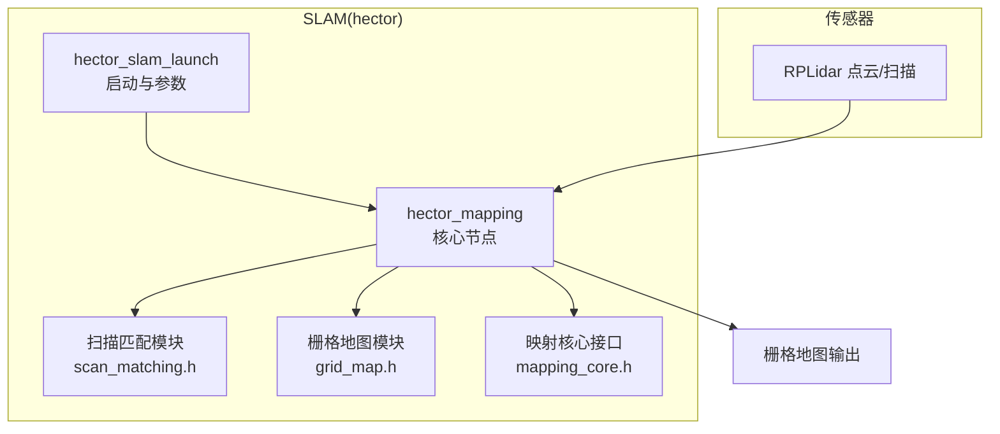
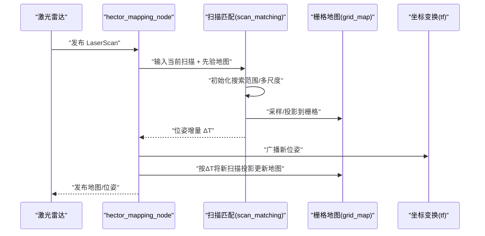
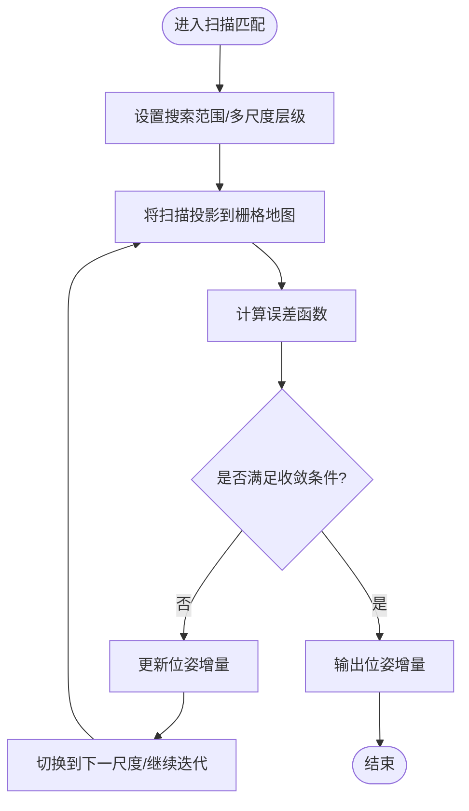
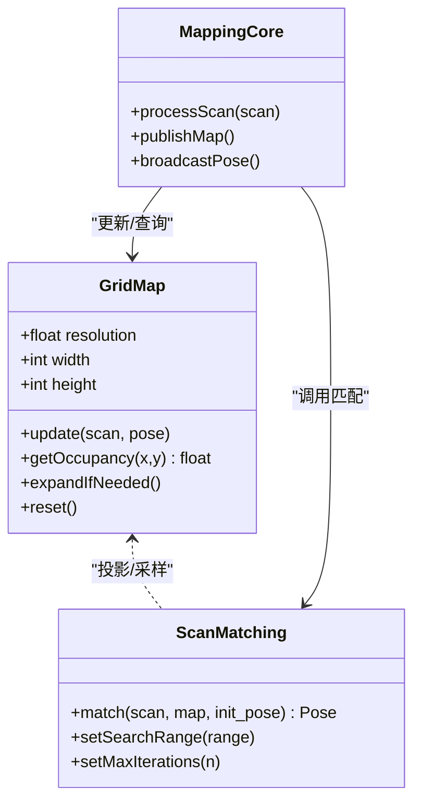
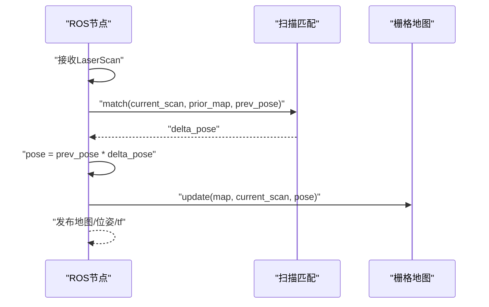
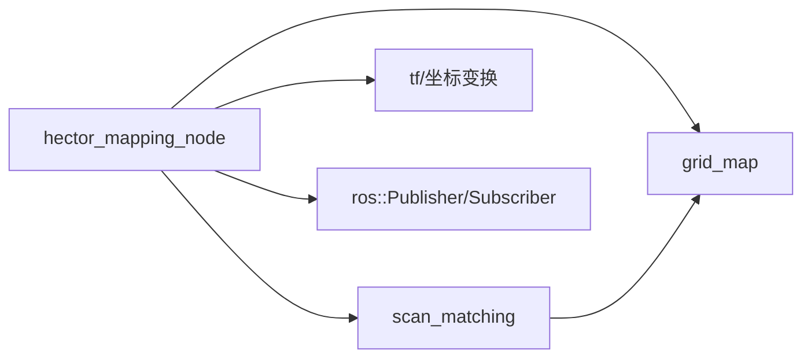

# Hector建图算法

<cite>
**本文档引用的文件**   
- [sebot_slam/README.txt](file://sebot_ros_kits/src/sebot_slam/slam_hector/README.txt)
- [hector_mapping/CMakeLists.txt](file://sebot_ros_kits/src/sebot_slam/slam_hector/hector_mapping/CMakeLists.txt)
- [hector_mapping_node.cpp](file://sebot_ros_kits/src/sebot_slam/slam_hector/hector_mapping/src/hector_mapping_node.cpp)
- [mapping_core.h](file://sebot_ros_kits/src/sebot_slam/slam_hector/hector_mapping/include/mapping_core.h)
- [scan_matching.h](file://sebot_ros_kits/src/sebot_slam/slam_hector/hector_mapping/include/scan_matching.h)
- [grid_map.h](file://sebot_ros_kits/src/sebot_slam/slam_hector/hector_mapping/include/grid_map.h)
- [hector_slam.launch](file://sebot_ros_kits/src/sebot_slam/slam_hector/hector_slam_launch/launch/hector_slam.launch)
- [hector_slam_params.yaml](file://sebot_ros_kits/src/sebot_slam/slam_hector/hector_slam_launch/param/hector_slam_params.yaml)
</cite>

## 目录
1. [简介](#简介)
2. [项目结构](#项目结构)
3. [核心组件](#核心组件)
4. [架构总览](#架构总览)
5. [详细组件分析](#详细组件分析)
6. [依赖关系分析](#依赖关系分析)
7. [性能考量](#性能考量)
8. [故障排除指南](#故障排除指南)
9. [结论](#结论)
10. [附录](#附录)

## 简介
本技术文档面向Hector建图算法在本仓库中的集成与使用，重点说明无里程计建图的工作原理、基于激光雷达扫描匹配的位姿估计方法、扫描匹配与ICP优化策略、栅格地图的构建与更新机制、内存管理要点，以及关键参数的配置建议与调试技巧。文档同时提供流程图、架构图和常见问题排查路径，帮助读者快速上手并高效调优。

## 项目结构
本项目包含三个相互独立的catkin工作空间：应用层（sebot_factory）、机器人套件（sebot_ros_kits）与仿真层（sebot_ros_stdr）。Hector SLAM相关代码位于机器人套件下的sebot_slam/slam_hector目录中，主要包括hector_mapping核心节点、hector_slam_launch启动与参数包等。

图表来源
- [hector_mapping_node.cpp](file://sebot_ros_kits/src/sebot_slam/slam_hector/hector_mapping/src/hector_mapping_node.cpp)
- [scan_matching.h](file://sebot_ros_kits/src/sebot_slam/slam_hector/hector_mapping/include/scan_matching.h)
- [grid_map.h](file://sebot_ros_kits/src/sebot_slam/slam_hector/hector_mapping/include/grid_map.h)
- [mapping_core.h](file://sebot_ros_kits/src/sebot_slam/slam_hector/hector_mapping/include/mapping_core.h)
- [hector_slam.launch](file://sebot_ros_kits/src/sebot_slam/slam_hector/hector_slam_launch/launch/hector_slam.launch)

章节来源
- [sebot_slam/README.txt](file://sebot_ros_kits/src/sebot_slam/slam_hector/README.txt)
- [hector_mapping/CMakeLists.txt](file://sebot_ros_kits/src/sebot_slam/slam_hector/hector_mapping/CMakeLists.txt)

## 核心组件
- hector_mapping_node：ROS节点入口，订阅激光扫描消息，驱动扫描匹配与地图更新，发布位姿与地图。
- scan_matching：实现扫描匹配与ICP迭代优化，计算当前扫描与先验地图之间的位姿增量。
- grid_map：栅格地图的数据结构与更新逻辑，包括占用概率、分辨率、边界管理与内存分配。
- mapping_core：映射核心接口，协调扫描匹配、地图更新与坐标系变换。

章节来源
- [hector_mapping_node.cpp](file://sebot_ros_kits/src/sebot_slam/slam_hector/hector_mapping/src/hector_mapping_node.cpp)
- [scan_matching.h](file://sebot_ros_kits/src/sebot_slam/slam_hector/hector_mapping/include/scan_matching.h)
- [grid_map.h](file://sebot_ros_kits/src/sebot_slam/slam_hector/hector_mapping/include/grid_map.h)
- [mapping_core.h](file://sebot_ros_kits/src/sebot_slam/slam_hector/hector_mapping/include/mapping_core.h)

## 架构总览
Hector建图采用“无里程计”的纯视觉（激光）方案：通过连续激光扫描之间的几何一致性进行位姿估计，无需轮式里程计或IMU融合。整体流程如下：

图表来源
- [hector_mapping_node.cpp](file://sebot_ros_kits/src/sebot_slam/slam_hector/hector_mapping/src/hector_mapping_node.cpp)
- [scan_matching.h](file://sebot_ros_kits/src/sebot_slam/slam_hector/hector_mapping/include/scan_matching.h)
- [grid_map.h](file://sebot_ros_kits/src/sebot_slam/slam_hector/hector_mapping/include/grid_map.h)

## 详细组件分析

### 扫描匹配与ICP优化
- 输入：当前激光扫描、先验栅格地图、初始位姿估计（通常来自上一帧位姿）。
- 过程：
  - 多尺度金字塔：降低分辨率加速收敛，再逐步细化。
  - 点云配准：将扫描点投影到栅格，计算误差函数（如点到边距离、梯度方向一致性）。
  - ICP迭代：在局部搜索范围内最小化误差，得到位姿增量。
  - 终止条件：迭代次数上限、误差下降阈值、位姿变化阈值。
- 输出：位姿增量，用于更新全局位姿。

图表来源
- [scan_matching.h](file://sebot_ros_kits/src/sebot_slam/slam_hector/hector_mapping/include/scan_matching.h)

章节来源
- [scan_matching.h](file://sebot_ros_kits/src/sebot_slam/slam_hector/hector_mapping/include/scan_matching.h)

### 栅格地图构建与更新
- 数据结构：二维栅格数组，每个单元存储占用概率、置信度、最近更新时间戳等。
- 更新机制：
  - 将当前扫描按估计位姿投影到世界坐标系。
  - 对每条射线进行贝叶斯更新（增加命中概率，延长空区域概率）。
  - 动态扩展地图边界，按需分配内存。
- 内存管理：
  - 固定分辨率下，内存占用与地图面积成正比。
  - 支持裁剪/重置以控制内存增长。
  - 合理设置最大范围与刷新频率，避免频繁重分配。

图表来源
- [grid_map.h](file://sebot_ros_kits/src/sebot_slam/slam_hector/hector_mapping/include/grid_map.h)
- [scan_matching.h](file://sebot_ros_kits/src/sebot_slam/slam_hector/hector_mapping/include/scan_matching.h)
- [mapping_core.h](file://sebot_ros_kits/src/sebot_slam/slam_hector/hector_mapping/include/mapping_core.h)

章节来源
- [grid_map.h](file://sebot_ros_kits/src/sebot_slam/slam_hector/hector_mapping/include/grid_map.h)
- [mapping_core.h](file://sebot_ros_kits/src/sebot_slam/slam_hector/hector_mapping/include/mapping_core.h)

### 节点主循环与控制流
- 订阅激光扫描话题，缓存最新有效扫描。
- 每帧执行：
  - 读取上一帧位姿作为初值。
  - 调用扫描匹配得到位姿增量。
  - 更新全局位姿并发布tf。
  - 将新扫描投影到地图并更新栅格。
  - 发布地图与位姿话题。

图表来源
- [hector_mapping_node.cpp](file://sebot_ros_kits/src/sebot_slam/slam_hector/hector_mapping/src/hector_mapping_node.cpp)

章节来源
- [hector_mapping_node.cpp](file://sebot_ros_kits/src/sebot_slam/slam_hector/hector_mapping/src/hector_mapping_node.cpp)

## 依赖关系分析
- 外部依赖：
  - ROS通信（roscpp、sensor_msgs/LaserScan、nav_msgs/OccupancyGrid、tf）。
  - 数学库（线性代数、优化求解器，通常为Eigen或自定义实现）。
- 内部耦合：
  - 节点依赖扫描匹配与栅格地图模块。
  - 扫描匹配依赖栅格地图进行投影与误差计算。
  - 映射核心协调两者并提供对外接口。

图表来源
- [hector_mapping_node.cpp](file://sebot_ros_kits/src/sebot_slam/slam_hector/hector_mapping/src/hector_mapping_node.cpp)
- [scan_matching.h](file://sebot_ros_kits/src/sebot_slam/slam_hector/hector_mapping/include/scan_matching.h)
- [grid_map.h](file://sebot_ros_kits/src/sebot_slam/slam_hector/hector_mapping/include/grid_map.h)

章节来源
- [hector_mapping/CMakeLists.txt](file://sebot_ros_kits/src/sebot_slam/slam_hector/hector_mapping/CMakeLists.txt)

## 性能考量
- 扫描匹配复杂度：
  - 与扫描点数、栅格分辨率、搜索范围、迭代次数呈近似线性或多项式关系。
  - 多尺度金字塔显著降低计算量，但需平衡精度与速度。
- 地图更新开销：
  - 射线投射与贝叶斯更新为O(N)，N为扫描点数。
  - 地图边界扩展可能触发内存重分配，应限制最大范围。
- 实时性建议：
  - 调整max_iterations、search_range、resolution等参数以满足帧率要求。
  - 在低算力平台适当降低分辨率或减少迭代次数。

[本节为通用指导，不直接分析具体文件]

## 故障排除指南
- 建图发散/漂移：
  - 检查激光扫描质量（噪声、遮挡），必要时启用滤波。
  - 增大搜索范围或提高初始位姿精度。
  - 降低分辨率或迭代次数以提升鲁棒性。
- 地图空洞/缺失：
  - 确认扫描覆盖角度与距离范围。
  - 调整空区域更新权重与阈值。
- 内存不足：
  - 减小地图分辨率或限制最大范围。
  - 定期重置或裁剪地图。
- 启动失败：
  - 核对话题名称、坐标系命名与tf树。
  - 检查参数文件加载与默认值。

章节来源
- [hector_slam.launch](file://sebot_ros_kits/src/sebot_slam/slam_hector/hector_slam_launch/launch/hector_slam.launch)
- [hector_slam_params.yaml](file://sebot_ros_kits/src/sebot_slam/slam_hector/hector_slam_launch/param/hector_slam_params.yaml)

## 结论
Hector建图在无里程计场景下通过激光扫描匹配实现稳健的位姿估计与栅格地图构建。其核心在于高效的扫描匹配与ICP优化、合理的栅格地图数据结构与更新策略，以及可配置的参数体系。通过本文档的流程解析、架构图示与参数建议，读者可在不同场景中快速部署与调优，获得高质量的建图结果。

[本节为总结性内容，不直接分析具体文件]

## 附录

### 关键参数与配置建议
- 扫描匹配精度：
  - max_iterations：控制迭代上限，较大值提升精度但增加耗时。
  - search_range：搜索范围，过大影响稳定性，过小易丢失匹配。
  - resolution：栅格分辨率，较小值提升细节但增加计算与内存。
- 地图更新：
  - update_factor：占用/空闲更新权重，影响地图平滑性与响应速度。
  - max_range：最大探测范围，限制内存占用与无效数据。
- 滤波器参数：
  - 去噪阈值、角度分辨率、距离阈值等，依据传感器特性设定。
- 场景建议：
  - 室内走廊：中等分辨率、较小搜索范围、较少迭代。
  - 开阔大厅：较高分辨率、较大搜索范围、适度迭代。
  - 动态环境：降低更新权重、增强滤波，提升鲁棒性。

章节来源
- [hector_slam_params.yaml](file://sebot_ros_kits/src/sebot_slam/slam_hector/hector_slam_launch/param/hector_slam_params.yaml)
- [hector_slam.launch](file://sebot_ros_kits/src/sebot_slam/slam_hector/hector_slam_launch/launch/hector_slam.launch)

### 性能评估指标
- 定位误差：位姿漂移随时间的累积误差（米/弧度）。
- 建图质量：地图完整性、边缘清晰度、空洞比例。
- 计算耗时：单帧处理时间、CPU占用率、内存峰值。
- 实时性：能否在传感器频率下稳定运行。

[本节为通用指导，不直接分析具体文件]