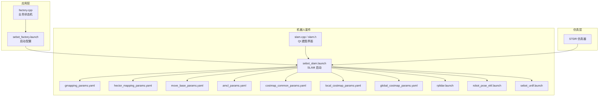
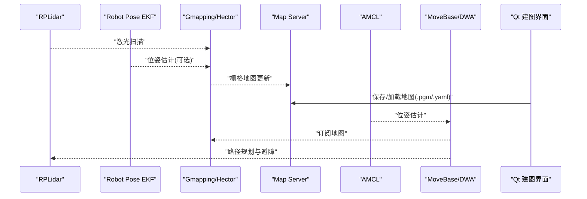
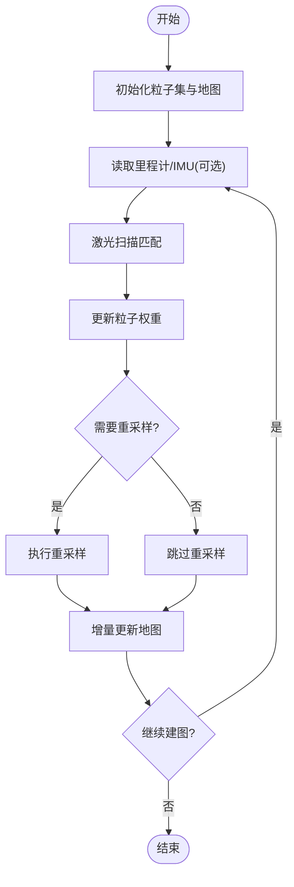
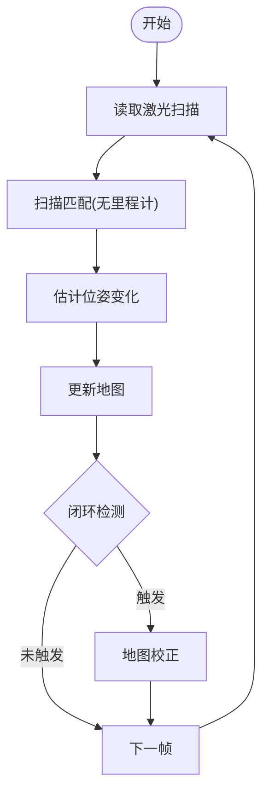
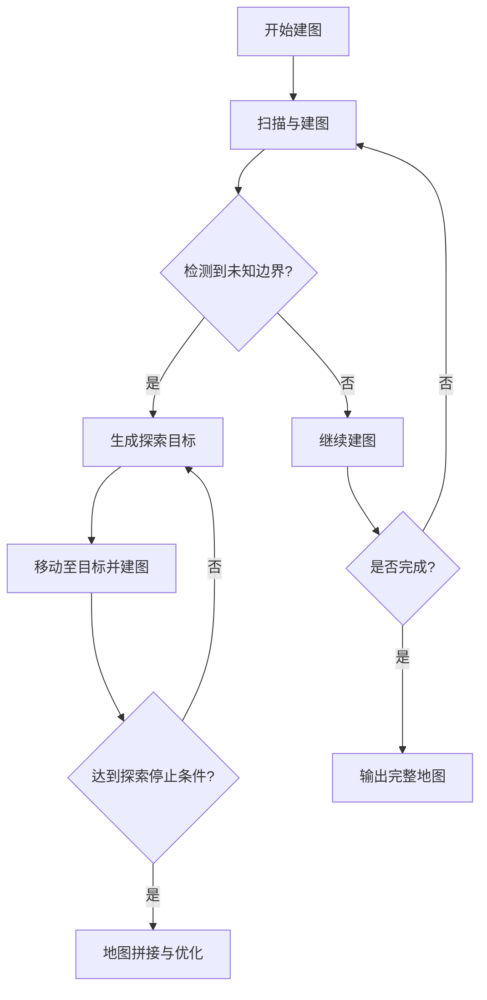
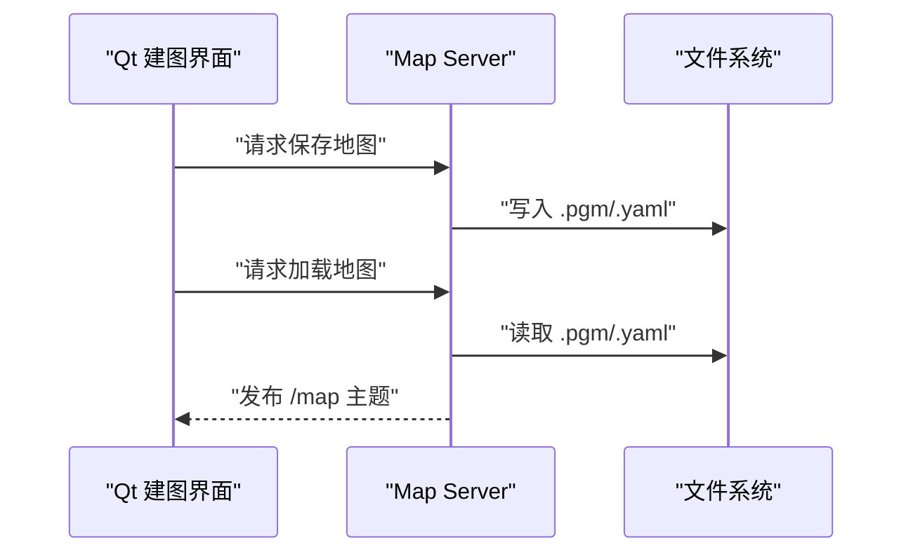
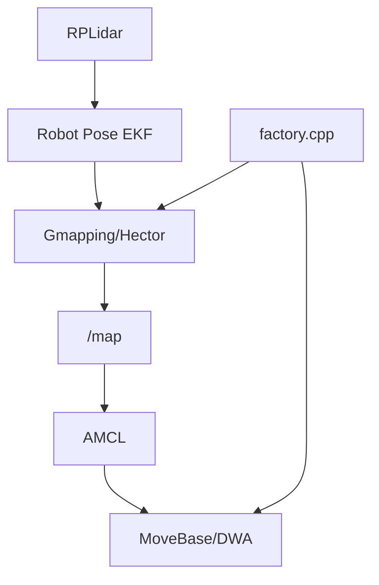

# SLAM建图系统

<cite>
**本文引用的文件**   
- [sebot_factory.launch](file://sebot_factory/src/sebot_factory/launch/sebot_factory.launch)
- [slam.h](file://sebot_ros_kits/src/sebot_marking/include/slam.h)
- [slam.cpp](file://sebot_ros_kits/src/sebot_marking/src/slam.cpp)
- [slam.ui](file://sebot_ros_kits/src/sebot_marking/ui/slam.ui)
- [sebot_slam.launch](file://sebot_ros_kits/src/sebot_slam/sebot_slam/launch/sebot_slam.launch)
- [gmapping_params.yaml](file://sebot_ros_kits/src/sebot_slam/sebot_slam/param/gmapping_params.yaml)
- [hector_mapping_params.yaml](file://sebot_ros_kits/src/sebot_slam/sebot_slam/param/hector_mapping_params.yaml)
- [amcl_params.yaml](file://sebot_ros_kits/src/sebot_navigation/sebot_navigation/param/amcl_params.yaml)
- [move_base_params.yaml](file://sebot_ros_kits/src/sebot_navigation/sebot_navigation/param/move_base_params.yaml)
- [costmap_common_params.yaml](file://sebot_ros_kits/src/sebot_navigation/sebot_navigation/param/costmap_common_params.yaml)
- [local_costmap_params.yaml](file://sebot_ros_kits/src/sebot_navigation/sebot_navigation/param/local_costmap_params.yaml)
- [global_costmap_params.yaml](file://sebot_ros_kits/src/sebot_navigation/sebot_navigation/param/global_costmap_params.yaml)
- [rplidar.launch](file://sebot_ros_kits/src/sebot_driver/rplidar_ros/launch/rplidar.launch)
- [robot_pose_ekf.launch](file://sebot_ros_kits/src/sebot_driver/robot_pose_ekf/launch/robot_pose_ekf.launch)
- [sebot_urdf.launch](file://sebot_ros_kits/src/sebot_driver/sebot_urdf/launch/sebot_urdf.launch)
- [factory.cpp](file://sebot_factory/src/sebot_factory/src/factory.cpp)
- [confirm.cpp](file://sebot_factory/src/sebot_factory/src/confirm.cpp)
- [picking.cpp](file://sebot_factory/src/sebot_factory/src/picking.cpp)
- [summary.cpp](file://sebot_factory/src/sebot_factory/src/summary.cpp)
</cite>

## 目录
1. [简介](#简介)
2. [项目结构](#项目结构)
3. [核心组件](#核心组件)
4. [架构总览](#架构总览)
5. [详细组件分析](#详细组件分析)
6. [依赖关系分析](#依赖关系分析)
7. [性能与质量](#性能与质量)
8. [故障排除指南](#故障排除指南)
9. [结论](#结论)
10. [附录](#附录)

## 简介
本仓库由三个相互独立的 catkin 工作空间组成：应用层 sebot_factory、机器人套件 sebot_ros_kits、仿真层 sebot_ros_stdr。SLAM 建图系统主要位于 sebot_ros_kits 的 sebot_slam 与 sebot_marking（Qt 上位机）中，结合 Gmapping 与 Hector 两种建图算法，配合 RPLidar、IMU 与里程计 EKF 融合，形成完整的建图与定位管线。导航采用 move_base + AMCL + DWA，地图数据以标准 ROS map 格式存储与加载。

## 项目结构
- sebot_factory：业务主节点与状态机（工厂流程），集成建图与导航启动参数。
- sebot_ros_kits：驱动与中间件（RPLidar、EKF、URDF）、导航栈（move_base、AMCL、DWA、Costmap）、SLAM（Gmapping/Hector）、语音与视觉等。
- sebot_ros_stdr：STDR 仿真环境及示例，用于离线验证与调试。

图表来源
- [sebot_factory.launch](file://sebot_factory/src/sebot_factory/launch/sebot_factory.launch)
- [sebot_slam.launch](file://sebot_ros_kits/src/sebot_slam/sebot_slam/launch/sebot_slam.launch)
- [gmapping_params.yaml](file://sebot_ros_kits/src/sebot_slam/sebot_slam/param/gmapping_params.yaml)
- [hector_mapping_params.yaml](file://sebot_ros_kits/src/sebot_slam/sebot_slam/param/hector_mapping_params.yaml)
- [move_base_params.yaml](file://sebot_ros_kits/src/sebot_navigation/sebot_navigation/param/move_base_params.yaml)
- [amcl_params.yaml](file://sebot_ros_kits/src/sebot_navigation/sebot_navigation/param/amcl_params.yaml)
- [costmap_common_params.yaml](file://sebot_ros_kits/src/sebot_navigation/sebot_navigation/param/costmap_common_params.yaml)
- [local_costmap_params.yaml](file://sebot_ros_kits/src/sebot_navigation/sebot_navigation/param/local_costmap_params.yaml)
- [global_costmap_params.yaml](file://sebot_ros_kits/src/sebot_navigation/sebot_navigation/param/global_costmap_params.yaml)
- [rplidar.launch](file://sebot_ros_kits/src/sebot_driver/rplidar_ros/launch/rplidar.launch)
- [robot_pose_ekf.launch](file://sebot_ros_kits/src/sebot_driver/robot_pose_ekf/launch/robot_pose_ekf.launch)
- [sebot_urdf.launch](file://sebot_ros_kits/src/sebot_driver/sebot_urdf/launch/sebot_urdf.launch)

章节来源
- [sebot_factory.launch](file://sebot_factory/src/sebot_factory/launch/sebot_factory.launch)
- [sebot_slam.launch](file://sebot_ros_kits/src/sebot_slam/sebot_slam/launch/sebot_slam.launch)

## 核心组件
- Gmapping 建图：基于粒子滤波与扫描匹配，适合有里程计的室内环境，鲁棒性好。
- Hector 建图：无里程计建图，直接利用激光雷达进行扫描匹配，适用于缺少轮式里程计或 IMU 的场景。
- Qt 建图界面：提供一键建图、边界检测、探索策略与地图拼接等功能入口。
- 地图服务：使用 ROS map_server 加载/保存标准 .pgm/.yaml 地图。
- 定位与导航：AMCL 粒子滤波定位 + move_base/DWA 局部规划，配合 Costmap 动态代价地图。

章节来源
- [slam.h](file://sebot_ros_kits/src/sebot_marking/include/slam.h)
- [slam.cpp](file://sebot_ros_kits/src/sebot_marking/src/slam.cpp)
- [gmapping_params.yaml](file://sebot_ros_kits/src/sebot_slam/sebot_slam/param/gmapping_params.yaml)
- [hector_mapping_params.yaml](file://sebot_ros_kits/src/sebot_slam/sebot_slam/param/hector_mapping_params.yaml)
- [amcl_params.yaml](file://sebot_ros_kits/src/sebot_navigation/sebot_navigation/param/amcl_params.yaml)
- [move_base_params.yaml](file://sebot_ros_kits/src/sebot_navigation/sebot_navigation/param/move_base_params.yaml)

## 架构总览
下图展示了从传感器到建图、再到定位与导航的整体数据流与模块交互。

图表来源
- [rplidar.launch](file://sebot_ros_kits/src/sebot_driver/rplidar_ros/launch/rplidar.launch)
- [robot_pose_ekf.launch](file://sebot_ros_kits/src/sebot_driver/robot_pose_ekf/launch/robot_pose_ekf.launch)
- [sebot_slam.launch](file://sebot_ros_kits/src/sebot_slam/sebot_slam/launch/sebot_slam.launch)
- [amcl_params.yaml](file://sebot_ros_kits/src/sebot_navigation/sebot_navigation/param/amcl_params.yaml)
- [move_base_params.yaml](file://sebot_ros_kits/src/sebot_navigation/sebot_navigation/param/move_base_params.yaml)

## 详细组件分析

### Gmapping 建图算法原理与配置
- 粒子滤波：维护大量假设位姿的粒子集，随运动与观测更新权重，实现全局定位与建图。
- 扫描匹配：将当前激光扫描与已有地图进行匹配，优化粒子位姿并更新地图。
- 地图更新机制：根据匹配结果增量更新栅格概率，支持重采样与噪声模型。
- 关键参数：粒子数、分辨率、最大范围、更新频率、重采样阈值等。

图表来源
- [gmapping_params.yaml](file://sebot_ros_kits/src/sebot_slam/sebot_slam/param/gmapping_params.yaml)

章节来源
- [gmapping_params.yaml](file://sebot_ros_kits/src/sebot_slam/sebot_slam/param/gmapping_params.yaml)

### Hector 建图算法特点与适用场景
- 无里程计建图：不依赖轮式里程计，直接通过激光扫描匹配估计位姿变化。
- 适用场景：缺少可靠里程计、IMU 噪声大或轮打滑的环境；短走廊、开阔区域效果较好。
- 参数调优：扫描匹配步长、搜索窗口、迭代次数、地图分辨率、时间戳对齐等。

图表来源
- [hector_mapping_params.yaml](file://sebot_ros_kits/src/sebot_slam/sebot_slam/param/hector_mapping_params.yaml)

章节来源
- [hector_mapping_params.yaml](file://sebot_ros_kits/src/sebot_slam/sebot_slam/param/hector_mapping_params.yaml)

### 自动建图功能实现（边界检测、探索策略、地图拼接）
- 边界检测：基于代价地图与激光扫描识别未知区域与障碍物边界。
- 探索策略：向未知区域推进，避免重复覆盖，保持安全距离。
- 地图拼接：多段建图片段通过特征匹配或位姿一致性进行拼接，提升整体一致性。

章节来源
- [slam.h](file://sebot_ros_kits/src/sebot_marking/include/slam.h)
- [slam.cpp](file://sebot_ros_kits/src/sebot_marking/src/slam.cpp)
- [slam.ui](file://sebot_ros_kits/src/sebot_marking/ui/slam.ui)

### 地图数据存储、加载与编辑
- 存储格式：标准 ROS map 格式（.pgm 栅格图像 + .yaml 元数据）。
- 加载方式：map_server 节点加载地图并发布 /map 主题。
- 编辑工具：可使用在线编辑器或离线工具修正标注、修复空洞与噪声。

章节来源
- [sebot_slam.launch](file://sebot_ros_kits/src/sebot_slam/sebot_slam/launch/sebot_slam.launch)

### 建图质量控制（精度评估、地图优化、后处理）
- 精度评估：对比已知地标、回环闭合误差、轨迹一致性。
- 地图优化：去噪、空洞填充、边缘平滑、比例尺校准。
- 后处理：裁剪无关区域、统一坐标系、导出为导航可用格式。

章节来源
- [amcl_params.yaml](file://sebot_ros_kits/src/sebot_navigation/sebot_navigation/param/amcl_params.yaml)
- [move_base_params.yaml](file://sebot_ros_kits/src/sebot_navigation/sebot_navigation/param/move_base_params.yaml)

## 依赖关系分析
- 传感器层：RPLidar 提供激光扫描；robot_pose_ekf 融合 IMU 与里程计。
- 建图层：Gmapping/Hector 订阅激光与位姿，输出地图。
- 定位层：AMCL 使用地图与传感器数据进行粒子滤波定位。
- 导航层：move_base 与 DWA 基于 Costmap 进行全局/局部路径规划。
- 应用层：factory.cpp 状态机协调建图、定位与任务执行。

图表来源
- [rplidar.launch](file://sebot_ros_kits/src/sebot_driver/rplidar_ros/launch/rplidar.launch)
- [robot_pose_ekf.launch](file://sebot_ros_kits/src/sebot_driver/robot_pose_ekf/launch/robot_pose_ekf.launch)
- [sebot_slam.launch](file://sebot_ros_kits/src/sebot_slam/sebot_slam/launch/sebot_slam.launch)
- [amcl_params.yaml](file://sebot_ros_kits/src/sebot_navigation/sebot_navigation/param/amcl_params.yaml)
- [move_base_params.yaml](file://sebot_ros_kits/src/sebot_navigation/sebot_navigation/param/move_base_params.yaml)
- [factory.cpp](file://sebot_factory/src/sebot_factory/src/factory.cpp)

章节来源
- [factory.cpp](file://sebot_factory/src/sebot_factory/src/factory.cpp)
- [confirm.cpp](file://sebot_factory/src/sebot_factory/src/confirm.cpp)
- [picking.cpp](file://sebot_factory/src/sebot_factory/src/picking.cpp)
- [summary.cpp](file://sebot_factory/src/sebot_factory/src/summary.cpp)

## 性能与质量
- 建图速度：Gmapping 在里程计良好时更快更稳；Hector 在无里程计时仍可运行但需更高算力。
- 内存占用：粒子数与地图分辨率直接影响内存与 CPU 负载。
- 实时性：激光频率、EKF 更新率、SLAM 线程调度需平衡。
- 质量指标：轨迹漂移、地图空洞率、回环闭合误差、定位收敛时间。

[本节为通用指导，无需特定文件引用]

## 故障排除指南
- 建图发散：检查激光数据是否连续、EKF 位姿是否合理、SLAM 参数是否过大。
- 定位失败：确认地图与传感器坐标系一致、AMCL 初始位姿正确、粒子数足够。
- 导航卡顿：调整 Costmap 膨胀半径、DWA 速度与加速度限制、全局/局部规划频率。
- 地图拼接错位：检查时间戳同步、位姿一致性、特征匹配阈值。

章节来源
- [amcl_params.yaml](file://sebot_ros_kits/src/sebot_navigation/sebot_navigation/param/amcl_params.yaml)
- [move_base_params.yaml](file://sebot_ros_kits/src/sebot_navigation/sebot_navigation/param/move_base_params.yaml)
- [costmap_common_params.yaml](file://sebot_ros_kits/src/sebot_navigation/sebot_navigation/param/costmap_common_params.yaml)
- [local_costmap_params.yaml](file://sebot_ros_kits/src/sebot_navigation/sebot_navigation/param/local_costmap_params.yaml)
- [global_costmap_params.yaml](file://sebot_ros_kits/src/sebot_navigation/sebot_navigation/param/global_costmap_params.yaml)

## 结论
本项目将 Gmapping 与 Hector 建图算法整合于统一的 ROS 框架中，并通过 Qt 界面提供自动化建图能力。结合 EKF 位姿融合、AMCL 定位与 move_base 导航，形成端到端的建图与导航解决方案。通过合理的参数调优与质量控制，可在多种环境下获得稳定可靠的地图与定位结果。

[本节为总结，无需特定文件引用]

## 附录
- 建图流程图：见“架构总览”与“自动建图功能实现”。
- 参数对比表：Gmapping vs Hector 的关键参数差异与适用场景。
- 最佳实践：优先保证传感器数据质量、合理设置分辨率与粒子数、定期校验地图一致性。

[本节为补充信息，无需特定文件引用]