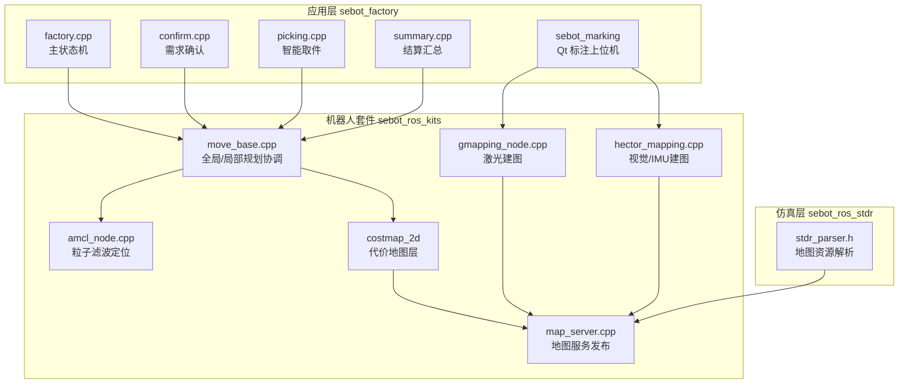
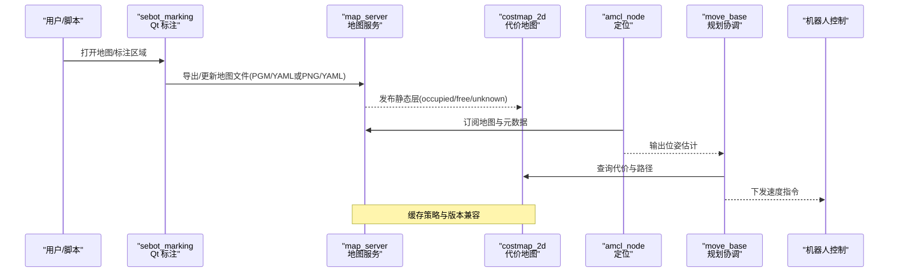
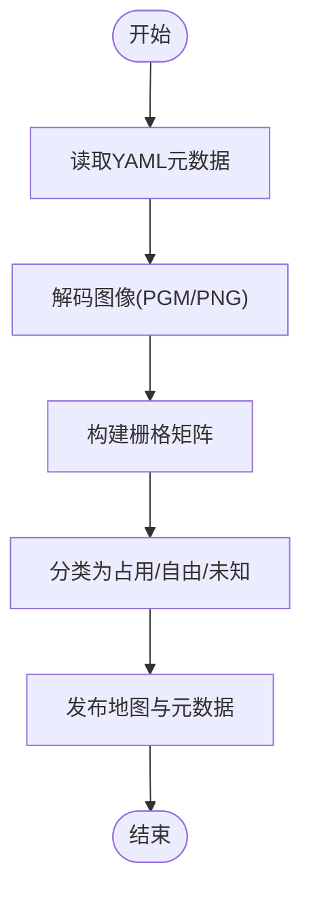
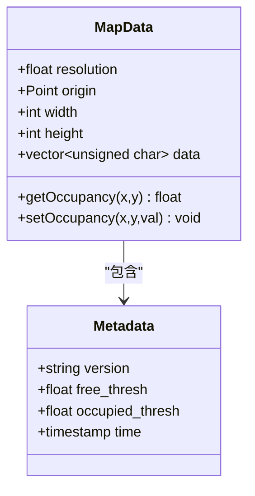
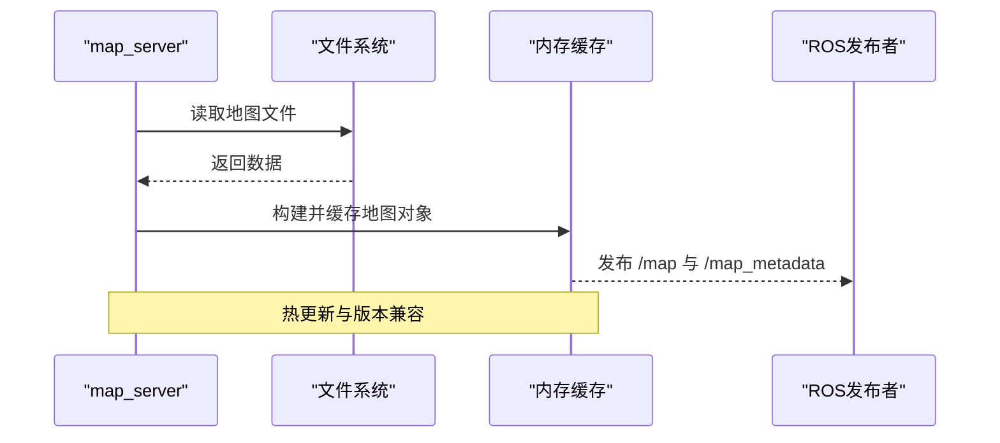
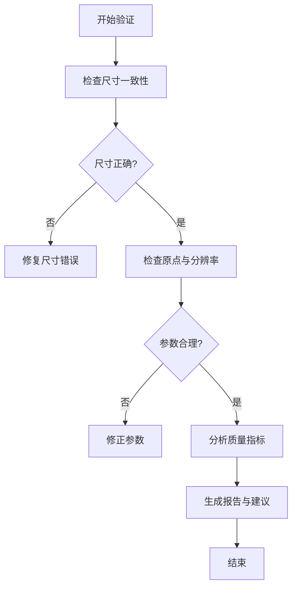
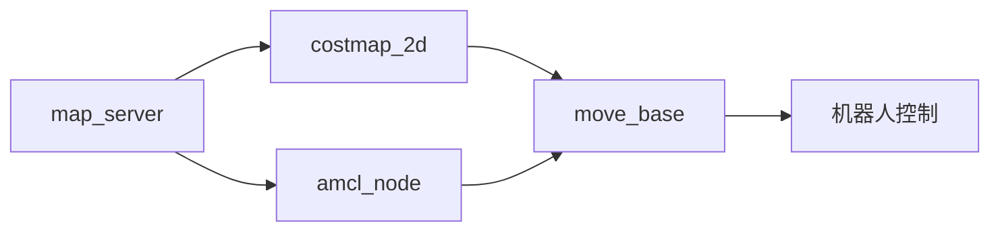

# 地图管理与存储

<cite>
**本文引用的文件**   
- [sebot_factory.launch](file://sebot_factory/src/sebot_factory/launch/sebot_factory.launch)
- [factory.cpp](file://sebot_factory/src/sebot_factory/src/factory.cpp)
- [confirm.cpp](file://sebot_factory/src/sebot_factory/src/confirm.cpp)
- [picking.cpp](file://sebot_factory/src/sebot_factory/src/picking.cpp)
- [summary.cpp](file://sebot_factory/src/sebot_factory/src/summary.cpp)
- [qnode.hpp](file://sebot_factory/src/sebot_marking/include/qnode.hpp)
- [slam.h](file://sebot_factory/src/sebot_marking/include/slam.h)
- [location.yaml](file://sebot_factory/src/sebot_marking/resources/location.yaml)
- [costmap_2d.h](file://sebot_ros_kits/src/sebot_navigation/costmap_2d/include/costmap_2d/costmap_2d.h)
- [map_grid.h](file://sebot_ros_kits/src/sebot_navigation/base_local_planner/include/base_local_planner/map_grid.h)
- [amcl_node.cpp](file://sebot_ros_kits/src/sebot_navigation/amcl/src/amcl_node.cpp)
- [move_base.cpp](file://sebot_ros_kits/src/sebot_navigation/move_base/src/move_base.cpp)
- [gmapping_node.cpp](file://sebot_ros_kits/src/sebot_slam/slam_gmapping/slam_gmapping/gmapping_node.cpp)
- [hector_mapping.cpp](file://sebot_ros_kits/src/sebot_slam/slam_hector/hector_mapping/src/hector_mapping.cpp)
- [map_server.cpp](file://sebot_ros_kits/src/sebot_navigation/map_server/src/map_server.cpp)
- [static_layer.cpp](file://sebot_ros_kits/src/sebot_navigation/costmap_2d/plugins/static_layer.cpp)
- [obstacle_layer.cpp](file://sebot_ros_kits/src/sebot_navigation/costmap_2d/plugins/obstacle_layer.cpp)
- [inflation_layer.cpp](file://sebot_ros_kits/src/sebot_navigation/costmap_2d/plugins/inflation_layer.cpp)
- [stdr_parser.h](file://sebot_ros_stdr/src/sebot_stdr/stdr_parser/include/stdr_parser/stdr_parser.h)
</cite>

## 目录
1. [简介](#简介)
2. [项目结构](#项目结构)
3. [核心组件](#核心组件)
4. [架构总览](#架构总览)
5. [详细组件分析](#详细组件分析)
6. [依赖关系分析](#依赖关系分析)
7. [性能考量](#性能考量)
8. [故障排查指南](#故障排查指南)
9. [结论](#结论)
10. [附录](#附录)

## 简介
本技术文档面向“地图管理与存储系统”，围绕机器人竞赛项目中地图的格式支持、数据结构设计、加载与保存机制、编辑工具使用、验证与质量检查、以及优化策略进行系统化说明。项目由三个相互独立的 catkin 工作空间组成：应用层 sebot_factory、机器人套件 sebot_ros_kits、仿真层 sebot_ros_stdr。导航栈采用 move_base + AMCL + DWA，建图采用 Gmapping/Hector，机械臂通过 MoveIt!（Talon）控制，传感器融合基于 EKF。地图数据在系统中以栅格形式表示，并通过 ROS map_server 提供标准服务接口，供定位、规划与控制模块消费。

## 项目结构
- 应用层 sebot_factory：包含工厂业务节点（factory.cpp 主状态机）、需求确认（confirm.cpp）、智能取件（picking.cpp）、结算汇总（summary.cpp），以及 Qt 标注上位机（sebot_marking）。
- 机器人套件 sebot_ros_kits：集成导航栈（AMCL、DWA、move_base、costmap_2d、map_server）、SLAM（Gmapping、Hector）、驱动与传感器等。
- 仿真层 sebot_ros_stdr：STDR 仿真环境及解析器，用于离线地图资源与场景管理。

图表来源
- [factory.cpp](file://sebot_factory/src/sebot_factory/src/factory.cpp)
- [amcl_node.cpp](file://sebot_ros_kits/src/sebot_navigation/amcl/src/amcl_node.cpp)
- [move_base.cpp](file://sebot_ros_kits/src/sebot_navigation/move_base/src/move_base.cpp)
- [map_server.cpp](file://sebot_ros_kits/src/sebot_navigation/map_server/src/map_server.cpp)
- [static_layer.cpp](file://sebot_ros_kits/src/sebot_navigation/costmap_2d/plugins/static_layer.cpp)
- [obstacle_layer.cpp](file://sebot_ros_kits/src/sebot_navigation/costmap_2d/plugins/obstacle_layer.cpp)
- [inflation_layer.cpp](file://sebot_ros_kits/src/sebot_navigation/costmap_2d/plugins/inflation_layer.cpp)
- [gmapping_node.cpp](file://sebot_ros_kits/src/sebot_slam/slam_gmapping/slam_gmapping/gmapping_node.cpp)
- [hector_mapping.cpp](file://sebot_ros_kits/src/sebot_slam/slam_hector/hector_mapping/src/hector_mapping.cpp)
- [stdr_parser.h](file://sebot_ros_stdr/src/sebot_stdr/stdr_parser/include/stdr_parser/stdr_parser.h)

章节来源
- [sebot_factory.launch](file://sebot_factory/src/sebot_factory/launch/sebot_factory.launch)

## 核心组件
- 地图服务与格式支持
  - map_server 负责加载与发布标准地图（PGM/YAML、PNG/YAML 等），并提供 /map、/map_metadata 等主题与服务接口。
  - costmap_2d 将静态地图与实时观测融合为代价地图，支持多图层（静态层、障碍物层、膨胀层）。
- 定位与导航
  - AMCL 基于粒子滤波对地图进行定位，订阅激光与里程计信息，输出位姿估计。
  - move_base 协调全局与局部规划器，生成轨迹并下发给底层控制器。
- 建图与标注
  - Gmapping/Hector 完成在线建图，输出栅格地图；sebot_marking 提供 Qt 标注界面，便于离线修改与批量处理。
- 仿真与资源解析
  - STDR 提供仿真环境与地图资源解析能力，便于离线测试与验证。

章节来源
- [map_server.cpp](file://sebot_ros_kits/src/sebot_navigation/map_server/src/map_server.cpp)
- [costmap_2d.h](file://sebot_ros_kits/src/sebot_navigation/costmap_2d/include/costmap_2d/costmap_2d.h)
- [amcl_node.cpp](file://sebot_ros_kits/src/sebot_navigation/amcl/src/amcl_node.cpp)
- [move_base.cpp](file://sebot_ros_kits/src/sebot_navigation/move_base/src/move_base.cpp)
- [gmapping_node.cpp](file://sebot_ros_kits/src/sebot_slam/slam_gmapping/slam_gmapping/gmapping_node.cpp)
- [hector_mapping.cpp](file://sebot_ros_kits/src/sebot_slam/slam_hector/hector_mapping/src/hector_mapping.cpp)
- [stdr_parser.h](file://sebot_ros_stdr/src/sebot_stdr/stdr_parser/include/stdr_parser/stdr_parser.h)

## 架构总览
地图数据流从建图或外部导入开始，经 map_server 发布为标准栅格地图，AMCL 读取地图进行定位，move_base 基于代价地图进行路径规划，最终驱动机器人执行任务。sebot_marking 提供可视化标注与批量处理能力，STDR 提供仿真与资源解析。

图表来源
- [map_server.cpp](file://sebot_ros_kits/src/sebot_navigation/map_server/src/map_server.cpp)
- [costmap_2d.h](file://sebot_ros_kits/src/sebot_navigation/costmap_2d/include/costmap_2d/costmap_2d.h)
- [amcl_node.cpp](file://sebot_ros_kits/src/sebot_navigation/amcl/src/amcl_node.cpp)
- [move_base.cpp](file://sebot_ros_kits/src/sebot_navigation/move_base/src/move_base.cpp)

## 详细组件分析

### 地图文件格式支持与解析
- 支持的格式
  - PGM/YAML：经典 ROS 地图格式，PGM 存储栅格图像，YAML 描述分辨率、原点、占用阈值等元数据。
  - PNG/YAML：PNG 作为栅格图像，YAML 提供相同元数据；适用于需要压缩的场景。
  - 自定义格式：可通过扩展 map_server 或独立解析器实现，需遵循坐标系统与元数据约定。
- 解析流程
  - 读取 YAML 元数据（分辨率、原点、占用阈值、自由阈值）。
  - 解码图像（PGM/PNG）为栅格矩阵，映射到 occupied/free/unknown 三类。
  - 构建地图对象并发布 /map 与 /map_metadata 主题。

章节来源
- [map_server.cpp](file://sebot_ros_kits/src/sebot_navigation/map_server/src/map_server.cpp)

### 地图数据结构设计
- 栅格表示
  - 二维矩阵，每个单元表示占用概率或类别（occupied/free/unknown）。
  - 分辨率（米/像素）决定精度与内存占用。
- 坐标系统
  - 原点在地图左下角，X轴向右，Y轴向上；ROS 坐标系中通常以米为单位。
  - 元数据包含 origin（位置与朝向）、resolution、width、height。
- 元数据管理
  - 包括分辨率、原点、占用阈值、自由阈值、时间戳、版本号等。
  - 版本兼容性通过元数据字段与解析器逻辑保证。

章节来源
- [costmap_2d.h](file://sebot_ros_kits/src/sebot_navigation/costmap_2d/include/costmap_2d/costmap_2d.h)
- [map_grid.h](file://sebot_ros_kits/src/sebot_navigation/base_local_planner/include/base_local_planner/map_grid.h)

### 地图加载与保存机制
- 加载流程
  - 从文件系统读取地图文件（PGM/YAML 或 PNG/YAML）。
  - 解析元数据并构建栅格矩阵。
  - 发布 /map 与 /map_metadata 主题，供 AMCL 与 costmap_2d 订阅。
- 保存流程
  - 将内存中的栅格矩阵编码为图像（PGM/PNG）。
  - 写入 YAML 元数据文件。
  - 可选：增量更新仅保存变化区域以减少 I/O 开销。
- 缓存策略
  - 内存缓存地图对象，避免重复解码。
  - 热更新时保留旧版本直至新地图完全加载成功。
- 版本兼容性
  - 通过元数据 version 字段与解析器向后兼容逻辑处理。

章节来源
- [map_server.cpp](file://sebot_ros_kits/src/sebot_navigation/map_server/src/map_server.cpp)

### 地图编辑工具使用方法
- 在线编辑
  - 通过 sebot_marking 的 Qt 界面实时标注与修改地图，支持撤销/重做与批量操作。
  - 编辑结果可即时导出为 PGM/YAML 或 PNG/YAML。
- 离线修改
  - 使用图像编辑工具修改 PGM/PNG，再同步更新 YAML 元数据。
  - 适合大规模修正与批量处理。
- 批量处理
  - 脚本化流程：读取地图 → 应用规则（如填充空洞、平滑边界）→ 导出新地图。
  - 结合 STDR 解析器进行离线验证与测试。

章节来源
- [qnode.hpp](file://sebot_factory/src/sebot_marking/include/qnode.hpp)
- [slam.h](file://sebot_factory/src/sebot_marking/include/slam.h)
- [location.yaml](file://sebot_factory/src/sebot_marking/resources/location.yaml)

### 地图验证与质量检查
- 完整性检测
  - 检查栅格尺寸与元数据一致性（width*height == data.size）。
  - 验证原点与分辨率合理性。
- 精度评估
  - 统计占用/自由比例，评估地图清晰度。
  - 计算边界连通性与空洞数量。
- 错误修复
  - 自动修复：填充小空洞、平滑噪声、修正孤立点。
  - 人工干预：标注界面高亮问题区域，支持手动修正。

### 地图优化技术
- 压缩算法
  - 使用 PNG 替代 PGM 减少存储空间。
  - 可选：无损压缩（如 zlib）应用于 YML 元数据。
- 增量更新
  - 仅保存变化区域，降低 I/O 与网络传输开销。
  - 适用于动态环境下的地图维护。
- 多分辨率支持
  - 生成不同分辨率的地图副本，适配不同计算资源与精度需求。
  - 运行时根据场景选择合适分辨率。

章节来源
- [map_server.cpp](file://sebot_ros_kits/src/sebot_navigation/map_server/src/map_server.cpp)

## 依赖关系分析
- 组件耦合
  - map_server 与 costmap_2d 强耦合（静态层依赖地图格式）。
  - AMCL 依赖 map_server 发布的地图与元数据。
  - move_base 依赖 costmap_2d 的代价地图进行规划。
- 外部依赖
  - ROS 通信（topic/service）。
  - 图像处理库（PGM/PNG 解码）。
  - 配置文件（YAML 解析）。

图表来源
- [map_server.cpp](file://sebot_ros_kits/src/sebot_navigation/map_server/src/map_server.cpp)
- [costmap_2d.h](file://sebot_ros_kits/src/sebot_navigation/costmap_2d/include/costmap_2d/costmap_2d.h)
- [amcl_node.cpp](file://sebot_ros_kits/src/sebot_navigation/amcl/src/amcl_node.cpp)
- [move_base.cpp](file://sebot_ros_kits/src/sebot_navigation/move_base/src/move_base.cpp)

章节来源
- [static_layer.cpp](file://sebot_ros_kits/src/sebot_navigation/costmap_2d/plugins/static_layer.cpp)
- [obstacle_layer.cpp](file://sebot_ros_kits/src/sebot_navigation/costmap_2d/plugins/obstacle_layer.cpp)
- [inflation_layer.cpp](file://sebot_ros_kits/src/sebot_navigation/costmap_2d/plugins/inflation_layer.cpp)

## 性能考量
- 内存占用
  - 高分辨率地图导致内存增长，建议按需调整分辨率或使用多分辨率策略。
- I/O 效率
  - 频繁读写地图文件可能成为瓶颈，建议使用缓存与增量更新。
- 计算开销
  - 代价地图更新与路径规划消耗 CPU，可考虑并行化或简化算法。
- 网络负载
  - 大地图传输占用带宽，建议压缩与分块传输。

## 故障排查指南
- 常见问题
  - 地图无法加载：检查 YAML 元数据与图像格式是否匹配。
  - 定位漂移：验证地图分辨率与原点设置是否正确。
  - 路径规划失败：检查代价地图层配置与障碍物检测。
- 调试方法
  - 使用 rqt 查看地图与元数据主题。
  - 启用详细日志输出，定位解析与发布错误。
  - 通过 sebot_marking 界面可视化问题区域。

章节来源
- [map_server.cpp](file://sebot_ros_kits/src/sebot_navigation/map_server/src/map_server.cpp)
- [amcl_node.cpp](file://sebot_ros_kits/src/sebot_navigation/amcl/src/amcl_node.cpp)
- [move_base.cpp](file://sebot_ros_kits/src/sebot_navigation/move_base/src/move_base.cpp)

## 结论
本地图管理与存储系统基于 ROS 生态，实现了标准化的地图格式支持、高效的数据结构与加载机制、灵活的编辑工具与验证功能，以及多种优化策略。通过合理的配置与最佳实践，可确保系统在复杂环境中稳定运行，并为机器人导航与任务执行提供可靠支持。

## 附录
- 文件格式规范
  - PGM/YAML：PGM 为灰度图像，YAML 包含 resolution、origin、free_thresh、occupied_thresh。
  - PNG/YAML：PNG 为压缩图像，YAML 同 PGM/YAML。
- API 接口说明
  - /map：发布地图栅格数据。
  - /map_metadata：发布地图元数据。
  - get_map 服务：获取当前地图。
- 最佳实践
  - 使用 PNG 格式节省存储空间。
  - 定期验证地图质量并进行必要修复。
  - 根据应用场景选择合适的分辨率与缓存策略。