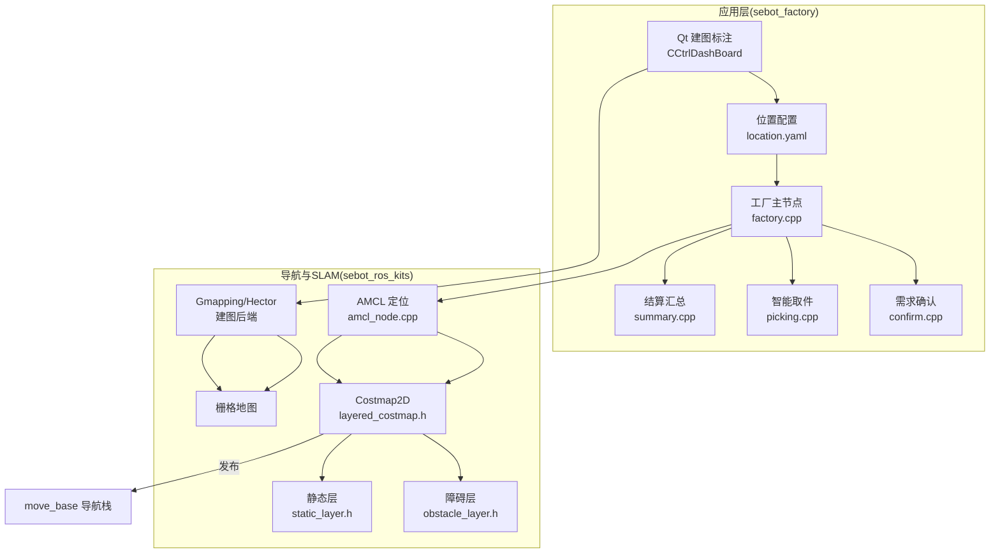
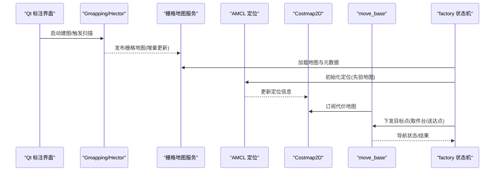
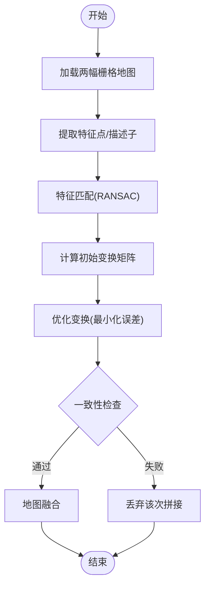
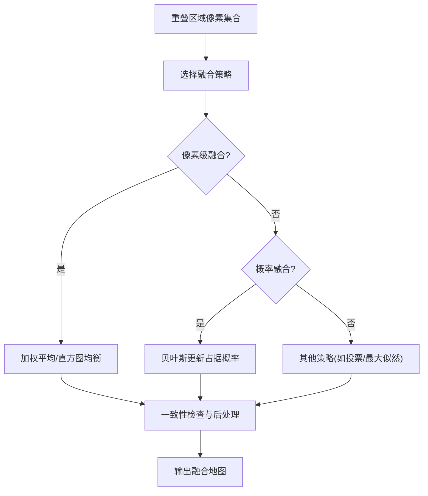
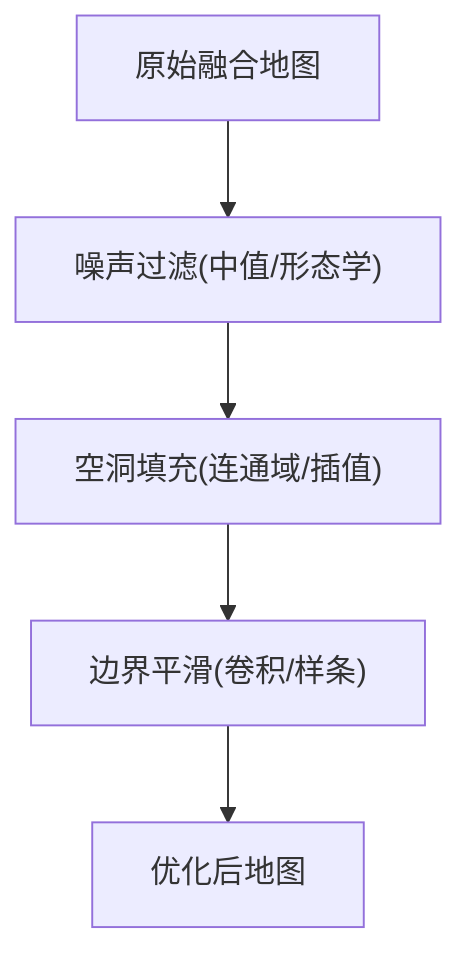
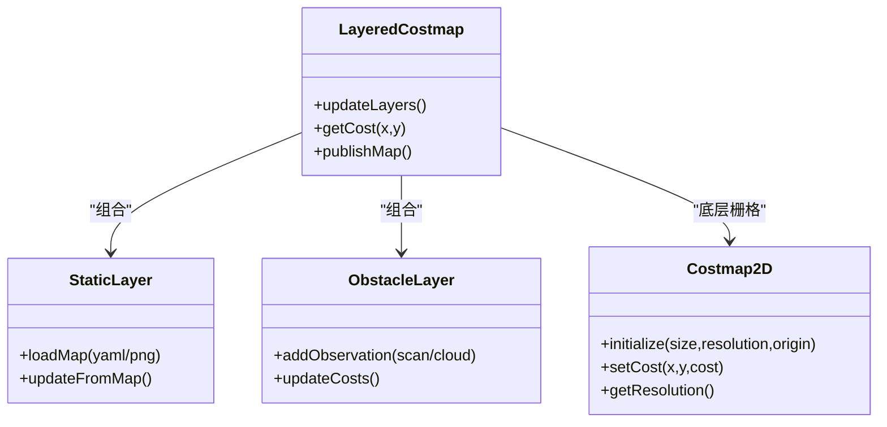
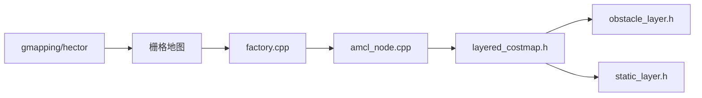

# 地图拼接系统

<cite>
**本文引用的文件**   
- [sebot_factory.launch](file://sebot_factory/src/sebot_factory/launch/sebot_factory.launch)
- [factory.cpp](file://sebot_factory/src/sebot_factory/src/factory.cpp)
- [confirm.cpp](file://sebot_factory/src/sebot_factory/src/confirm.cpp)
- [picking.cpp](file://sebot_factory/src/sebot_factory/src/picking.cpp)
- [summary.cpp](file://sebot_factory/src/sebot_factory/src/summary.cpp)
- [slam.h](file://sebot_factory/src/sebot_marking/include/slam.h)
- [qnode.hpp](file://sebot_factory/src/sebot_marking/include/qnode.hpp)
- [CCtrlDashBoard.cpp](file://sebot_factory/src/sebot_marking/src/CCtrlDashBoard.cpp)
- [location.yaml](file://sebot_factory/src/sebot_marking/resources/location.yaml)
- [costmap_2d.h](file://sebot_ros_kits/src/sebot_navigation/costmap_2d/include/costmap_2d/costmap_2d.h)
- [obstacle_layer.h](file://sebot_ros_kits/src/sebot_navigation/costmap_2d/include/costmap_2d/obstacle_layer.h)
- [static_layer.h](file://sebot_ros_kits/src/sebot_navigation/costmap_2d/include/costmap_2d/static_layer.h)
- [layered_costmap.h](file://sebot_ros_kits/src/sebot_navigation/costmap_2d/include/costmap_2d/layered_costmap.h)
- [amcl_node.cpp](file://sebot_ros_kits/src/sebot_navigation/amcl/src/amcl_node.cpp)
- [gmapping 包说明](file://sebot_ros_kits/src/sebot_slam/slam_gmapping/README.md)
- [hector_mapping 包说明](file://sebot_ros_kits/src/sebot_slam/slam_hector/README.txt)
</cite>

## 目录
1. [简介](#简介)
2. [项目结构](#项目结构)
3. [核心组件](#核心组件)
4. [架构总览](#架构总览)
5. [详细组件分析](#详细组件分析)
6. [依赖关系分析](#依赖关系分析)
7. [性能考虑](#性能考虑)
8. [故障排除指南](#故障排除指南)
9. [结论](#结论)
10. [附录](#附录)

## 简介
本技术文档面向“自动建图的地图拼接系统”，围绕机器人竞赛场景中的多源地图构建与融合、成本地图生成与动态更新、存储格式与版本管理，以及质量评估与参数调优进行系统化阐述。结合仓库中 sebot_factory（应用层）、sebot_marking（Qt 建图标注上位机）与 sebot_ros_kits（导航与 SLAM 套件）的集成方式，给出从数据输入到地图输出的端到端流程，并提供流程图、算法示意图与质量评估指标，帮助读者快速理解并落地部署。

## 项目结构
本项目由三个相互独立的 catkin 工作空间组成：
- sebot_factory：应用层业务节点与 Qt 建图标注工具
- sebot_ros_kits：机器人驱动、SLAM、导航等开源/自研套件
- sebot_ros_stdr：仿真环境与配套资源

在地图拼接系统中，关键路径包括：
- 建图与标注：sebot_marking 提供 Qt 界面与位置配置，输出 location.yaml 等元数据
- 建图后端：基于 ROS 生态的 Gmapping/Hector 完成栅格化建图与位姿估计
- 导航与定位：AMCL + move_base 使用 costmap_2d 进行代价地图管理与动态更新
- 业务编排：factory.cpp 状态机串联取件、确认、抓取、送达与结算

图表来源
- [sebot_factory.launch](file://sebot_factory/src/sebot_factory/launch/sebot_factory.launch)
- [factory.cpp](file://sebot_factory/src/sebot_factory/src/factory.cpp)
- [confirm.cpp](file://sebot_factory/src/sebot_factory/src/confirm.cpp)
- [picking.cpp](file://sebot_factory/src/sebot_factory/src/picking.cpp)
- [summary.cpp](file://sebot_factory/src/sebot_factory/src/summary.cpp)
- [slam.h](file://sebot_factory/src/sebot_marking/include/slam.h)
- [qnode.hpp](file://sebot_factory/src/sebot_marking/include/qnode.hpp)
- [CCtrlDashBoard.cpp](file://sebot_factory/src/sebot_marking/src/CCtrlDashBoard.cpp)
- [location.yaml](file://sebot_factory/src/sebot_marking/resources/location.yaml)
- [amcl_node.cpp](file://sebot_ros_kits/src/sebot_navigation/amcl/src/amcl_node.cpp)
- [layered_costmap.h](file://sebot_ros_kits/src/sebot_navigation/costmap_2d/include/costmap_2d/layered_costmap.h)
- [obstacle_layer.h](file://sebot_ros_kits/src/sebot_navigation/costmap_2d/include/costmap_2d/obstacle_layer.h)
- [static_layer.h](file://sebot_ros_kits/src/sebot_navigation/costmap_2d/include/costmap_2d/static_layer.h)
- [gmapping 包说明](file://sebot_ros_kits/src/sebot_slam/slam_gmapping/README.md)
- [hector_mapping 包说明](file://sebot_ros_kits/src/sebot_slam/slam_hector/README.txt)

章节来源
- [sebot_factory.launch](file://sebot_factory/src/sebot_factory/launch/sebot_factory.launch)
- [factory.cpp](file://sebot_factory/src/sebot_factory/src/factory.cpp)
- [slam.h](file://sebot_factory/src/sebot_marking/include/slam.h)
- [qnode.hpp](file://sebot_factory/src/sebot_marking/include/qnode.hpp)
- [CCtrlDashBoard.cpp](file://sebot_factory/src/sebot_marking/src/CCtrlDashBoard.cpp)
- [location.yaml](file://sebot_factory/src/sebot_marking/resources/location.yaml)
- [amcl_node.cpp](file://sebot_ros_kits/src/sebot_navigation/amcl/src/amcl_node.cpp)
- [layered_costmap.h](file://sebot_ros_kits/src/sebot_navigation/costmap_2d/include/costmap_2d/layered_costmap.h)
- [obstacle_layer.h](file://sebot_ros_kits/src/sebot_navigation/costmap_2d/include/costmap_2d/obstacle_layer.h)
- [static_layer.h](file://sebot_ros_kits/src/sebot_navigation/costmap_2d/include/costmap_2d/static_layer.h)
- [gmapping 包说明](file://sebot_ros_kits/src/sebot_slam/slam_gmapping/README.md)
- [hector_mapping 包说明](file://sebot_ros_kits/src/sebot_slam/slam_hector/README.txt)

## 核心组件
- 建图与标注（sebot_marking）
  - Qt 界面负责采集传感器数据、触发建图、标注关键点与导出位置配置
  - 通过 qnode.hpp 封装 ROS 通信，slam.h 暴露建图接口
  - 输出 location.yaml 作为地图元数据与参考点定义
- 建图后端（Gmapping/Hector）
  - 将激光/里程计/IMU观测转换为栅格地图，支持在线增量更新
  - 提供标准 map 消息与 YAML/PNG 存储格式
- 定位与导航（AMCL + move_base）
  - AMCL 粒子滤波定位，配合 costmap_2d 进行代价地图管理
  - layered_costmap 组合静态层、障碍层、膨胀层等，实现动态更新
- 业务编排（factory.cpp）
  - 以 MultiNavi 状态机串联“加载地图 → AMCL 定位 → 导航至取件台 → 需求确认 → 视觉搜索 → 机械臂抓取 → 送达结算”全流程
  - 关键参数（导航超时、PID、取件距离、补扫等）集中在 launch 配置

章节来源
- [slam.h](file://sebot_factory/src/sebot_marking/include/slam.h)
- [qnode.hpp](file://sebot_factory/src/sebot_marking/include/qnode.hpp)
- [CCtrlDashBoard.cpp](file://sebot_factory/src/sebot_marking/src/CCtrlDashBoard.cpp)
- [location.yaml](file://sebot_factory/src/sebot_marking/resources/location.yaml)
- [amcl_node.cpp](file://sebot_ros_kits/src/sebot_navigation/amcl/src/amcl_node.cpp)
- [layered_costmap.h](file://sebot_ros_kits/src/sebot_navigation/costmap_2d/include/costmap_2d/layered_costmap.h)
- [obstacle_layer.h](file://sebot_ros_kits/src/sebot_navigation/costmap_2d/include/costmap_2d/obstacle_layer.h)
- [static_layer.h](file://sebot_ros_kits/src/sebot_navigation/costmap_2d/include/costmap_2d/static_layer.h)
- [factory.cpp](file://sebot_factory/src/sebot_factory/src/factory.cpp)
- [sebot_factory.launch](file://sebot_factory/src/sebot_factory/launch/sebot_factory.launch)

## 架构总览
地图拼接系统的整体架构分为三层：
- 数据采集与标注层：Qt 上位机采集传感器数据，触发建图与标注，输出位置配置
- 建图与定位层：Gmapping/Hector 生成栅格地图，AMCL 提供实时定位
- 导航与应用层：move_base 与 costmap_2d 管理代价地图，factory.cpp 编排业务流程

图表来源
- [CCtrlDashBoard.cpp](file://sebot_factory/src/sebot_marking/src/CCtrlDashBoard.cpp)
- [gmapping 包说明](file://sebot_ros_kits/src/sebot_slam/slam_gmapping/README.md)
- [hector_mapping 包说明](file://sebot_ros_kits/src/sebot_slam/slam_hector/README.txt)
- [amcl_node.cpp](file://sebot_ros_kits/src/sebot_navigation/amcl/src/amcl_node.cpp)
- [layered_costmap.h](file://sebot_ros_kits/src/sebot_navigation/costmap_2d/include/costmap_2d/layered_costmap.h)
- [factory.cpp](file://sebot_factory/src/sebot_factory/src/factory.cpp)

## 详细组件分析

### 地图拼接算法与坐标变换
- 重叠区域检测
  - 基于两幅栅格地图的语义特征或几何特征匹配，计算重叠区域的像素级对应关系
  - 常用方法包括 SIFT/SURF/ORB 特征匹配与 RANSAC 外点剔除，得到初始变换矩阵
- 坐标变换与对齐
  - 将局部坐标系下的栅格映射到全局坐标系，采用仿射或刚体变换（平移+旋转）
  - 通过最小化重叠区域像素误差（如互相关、NCC）优化变换参数
- 一致性检查
  - 对变换后的重叠区域进行一致性校验（如边缘连续性、语义标签一致性），剔除异常匹配

图表来源
- [gmapping 包说明](file://sebot_ros_kits/src/sebot_slam/slam_gmapping/README.md)
- [hector_mapping 包说明](file://sebot_ros_kits/src/sebot_slam/slam_hector/README.txt)

章节来源
- [gmapping 包说明](file://sebot_ros_kits/src/sebot_slam/slam_gmapping/README.md)
- [hector_mapping 包说明](file://sebot_ros_kits/src/sebot_slam/slam_hector/README.txt)

### 地图融合策略
- 像素级融合
  - 在重叠区域内按权重合成像素值，避免重影与亮度突变
  - 适用于纹理丰富、光照稳定的场景
- 概率融合
  - 将每个栅格的占据概率进行贝叶斯更新，提高鲁棒性
  - 适合存在噪声与不确定性的观测
- 一致性检查
  - 对融合结果进行边界平滑与空洞填充，确保拓扑一致性与可导航性

图表来源
- [gmapping 包说明](file://sebot_ros_kits/src/sebot_slam/slam_gmapping/README.md)
- [hector_mapping 包说明](file://sebot_ros_kits/src/sebot_slam/slam_hector/README.txt)

章节来源
- [gmapping 包说明](file://sebot_ros_kits/src/sebot_slam/slam_gmapping/README.md)
- [hector_mapping 包说明](file://sebot_ros_kits/src/sebot_slam/slam_hector/README.txt)

### 地图优化技术
- 噪声过滤
  - 使用中值滤波、形态学开闭运算去除离群点与细小噪声
- 空洞填充
  - 基于连通域分析与插值填补空洞，保证连续通行区域
- 边界平滑
  - 对障碍物边界进行平滑处理，减少锯齿效应，提升路径规划稳定性

图表来源
- [gmapping 包说明](file://sebot_ros_kits/src/sebot_slam/slam_gmapping/README.md)
- [hector_mapping 包说明](file://sebot_ros_kits/src/sebot_slam/slam_hector/README.txt)

章节来源
- [gmapping 包说明](file://sebot_ros_kits/src/sebot_slam/slam_gmapping/README.md)
- [hector_mapping 包说明](file://sebot_ros_kits/src/sebot_slam/slam_hector/README.txt)

### 成本地图生成过程
- 栅格化处理
  - 将激光点云与传感器观测投影到二维栅格，标记自由/占用/未知
- 代价计算
  - 根据障碍物距离计算代价，支持指数衰减与自定义函数
- 动态更新
  - layered_costmap 组合静态层（已知环境）、障碍层（实时观测）、膨胀层（安全距离）
  - 通过 amcl_node 的定位信息实时更新代价地图

图表来源
- [layered_costmap.h](file://sebot_ros_kits/src/sebot_navigation/costmap_2d/include/costmap_2d/layered_costmap.h)
- [static_layer.h](file://sebot_ros_kits/src/sebot_navigation/costmap_2d/include/costmap_2d/static_layer.h)
- [obstacle_layer.h](file://sebot_ros_kits/src/sebot_navigation/costmap_2d/include/costmap_2d/obstacle_layer.h)
- [costmap_2d.h](file://sebot_ros_kits/src/sebot_navigation/costmap_2d/include/costmap_2d/costmap_2d.h)
- [amcl_node.cpp](file://sebot_ros_kits/src/sebot_navigation/amcl/src/amcl_node.cpp)

章节来源
- [layered_costmap.h](file://sebot_ros_kits/src/sebot_navigation/costmap_2d/include/costmap_2d/layered_costmap.h)
- [static_layer.h](file://sebot_ros_kits/src/sebot_navigation/costmap_2d/include/costmap_2d/static_layer.h)
- [obstacle_layer.h](file://sebot_ros_kits/src/sebot_navigation/costmap_2d/include/costmap_2d/obstacle_layer.h)
- [costmap_2d.h](file://sebot_ros_kits/src/sebot_navigation/costmap_2d/include/costmap_2d/costmap_2d.h)
- [amcl_node.cpp](file://sebot_ros_kits/src/sebot_navigation/amcl/src/amcl_node.cpp)

### 地图存储格式与版本管理
- 文件格式
  - 标准 ROS map 格式：YAML 头（分辨率、原点、尺寸）+ PNG 图像（灰度栅格）
  - 支持增量更新与离线编辑
- 压缩技术
  - PNG 无损压缩；可选 ZIP/TAR 打包批量管理
- 增量更新
  - 仅保存变化区域或差异层，降低存储与传输开销
- 版本管理
  - 文件名包含时间戳/版本号；配合 Git 或专用版本库管理变更历史

章节来源
- [gmapping 包说明](file://sebot_ros_kits/src/sebot_slam/slam_gmapping/README.md)
- [hector_mapping 包说明](file://sebot_ros_kits/src/sebot_slam/slam_hector/README.txt)

### 拼接质量评估、参数调优与故障排除
- 质量评估指标
  - 重叠区域配准误差（RMSE）、边缘连续性、空洞率、导航成功率
- 参数调优
  - 建图分辨率、激光阈值、AMCL 粒子数、costmap 膨胀半径、融合权重
- 故障排除
  - 定位漂移：检查 IMU/里程计校准、AMCL 参数
  - 地图错位：重新标定传感器外参、调整特征匹配阈值
  - 导航失败：检查代价地图动态更新、障碍物层观测频率

章节来源
- [amcl_node.cpp](file://sebot_ros_kits/src/sebot_navigation/amcl/src/amcl_node.cpp)
- [layered_costmap.h](file://sebot_ros_kits/src/sebot_navigation/costmap_2d/include/costmap_2d/layered_costmap.h)
- [obstacle_layer.h](file://sebot_ros_kits/src/sebot_navigation/costmap_2d/include/costmap_2d/obstacle_layer.h)
- [static_layer.h](file://sebot_ros_kits/src/sebot_navigation/costmap_2d/include/costmap_2d/static_layer.h)

## 依赖关系分析
- 应用层依赖导航与 SLAM 提供的地图与定位服务
- 导航栈依赖 costmap_2d 的代价地图与 AMCL 的定位结果
- 建图后端依赖传感器数据（激光、里程计、IMU）

图表来源
- [factory.cpp](file://sebot_factory/src/sebot_factory/src/factory.cpp)
- [amcl_node.cpp](file://sebot_ros_kits/src/sebot_navigation/amcl/src/amcl_node.cpp)
- [layered_costmap.h](file://sebot_ros_kits/src/sebot_navigation/costmap_2d/include/costmap_2d/layered_costmap.h)
- [obstacle_layer.h](file://sebot_ros_kits/src/sebot_navigation/costmap_2d/include/costmap_2d/obstacle_layer.h)
- [static_layer.h](file://sebot_ros_kits/src/sebot_navigation/costmap_2d/include/costmap_2d/static_layer.h)
- [gmapping 包说明](file://sebot_ros_kits/src/sebot_slam/slam_gmapping/README.md)
- [hector_mapping 包说明](file://sebot_ros_kits/src/sebot_slam/slam_hector/README.txt)

章节来源
- [factory.cpp](file://sebot_factory/src/sebot_factory/src/factory.cpp)
- [amcl_node.cpp](file://sebot_ros_kits/src/sebot_navigation/amcl/src/amcl_node.cpp)
- [layered_costmap.h](file://sebot_ros_kits/src/sebot_navigation/costmap_2d/include/costmap_2d/layered_costmap.h)
- [obstacle_layer.h](file://sebot_ros_kits/src/sebot_navigation/costmap_2d/include/costmap_2d/obstacle_layer.h)
- [static_layer.h](file://sebot_ros_kits/src/sebot_navigation/costmap_2d/include/costmap_2d/static_layer.h)
- [gmapping 包说明](file://sebot_ros_kits/src/sebot_slam/slam_gmapping/README.md)
- [hector_mapping 包说明](file://sebot_ros_kits/src/sebot_slam/slam_hector/README.txt)

## 性能考虑
- 建图分辨率与内存占用平衡：高分辨率提升精度但增加内存与计算压力
- 特征匹配复杂度：控制特征点数与匹配阈值，避免实时性下降
- 代价地图更新频率：合理设置 obstacle_layer 的更新周期，兼顾实时性与准确性
- 并行化与缓存：对重叠区域计算与融合步骤进行并行优化，缓存中间结果

[本节为通用指导，不直接分析具体文件]

## 故障排除指南
- 常见问题
  - 地图错位：检查传感器标定、特征匹配阈值与 RANSAC 参数
  - 定位漂移：调整 AMCL 粒子数与观测模型，检查 IMU/里程计噪声
  - 导航失败：检查 costmap 膨胀半径与障碍物层观测频率
- 调试手段
  - 使用 RViz 可视化地图、代价地图与定位粒子
  - 打印关键日志（建图帧率、匹配成功率、定位收敛时间）
  - 回放 bag 数据复现问题

章节来源
- [amcl_node.cpp](file://sebot_ros_kits/src/sebot_navigation/amcl/src/amcl_node.cpp)
- [layered_costmap.h](file://sebot_ros_kits/src/sebot_navigation/costmap_2d/include/costmap_2d/layered_costmap.h)
- [obstacle_layer.h](file://sebot_ros_kits/src/sebot_navigation/costmap_2d/include/costmap_2d/obstacle_layer.h)
- [static_layer.h](file://sebot_ros_kits/src/sebot_navigation/costmap_2d/include/costmap_2d/static_layer.h)

## 结论
本地图拼接系统以 ROS 生态为基础，结合 Qt 标注工具与 Gmapping/Hector 建图后端，形成从数据采集、建图、定位到导航与业务编排的完整链路。通过合理的融合策略、优化技术与质量评估，可在复杂环境中实现稳定可靠的地图拼接与动态更新。建议在实际部署中关注参数调优与故障排除，确保系统在竞赛场景下的高可用性与高效性。

[本节为总结性内容，不直接分析具体文件]

## 附录
- 关键参数说明（示例）
  - 导航超时：限制单次导航任务的最长时间
  - PID 参数：控制机械臂抓取与运动的闭环控制
  - 取件距离：接近目标的容差范围
  - 补扫参数：在定位不确定时触发额外扫描以提升地图质量
- 质量评估指标（示例）
  - RMSE：重叠区域配准误差
  - 空洞率：未知/未覆盖区域占比
  - 导航成功率：目标到达成功率

章节来源
- [sebot_factory.launch](file://sebot_factory/src/sebot_factory/launch/sebot_factory.launch)
- [factory.cpp](file://sebot_factory/src/sebot_factory/src/factory.cpp)
- [confirm.cpp](file://sebot_factory/src/sebot_factory/src/confirm.cpp)
- [picking.cpp](file://sebot_factory/src/sebot_factory/src/picking.cpp)
- [summary.cpp](file://sebot_factory/src/sebot_factory/src/summary.cpp)