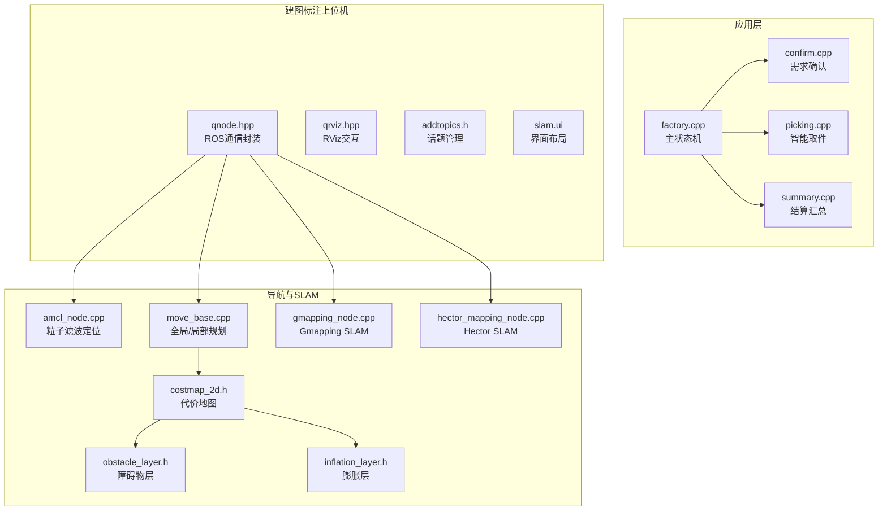
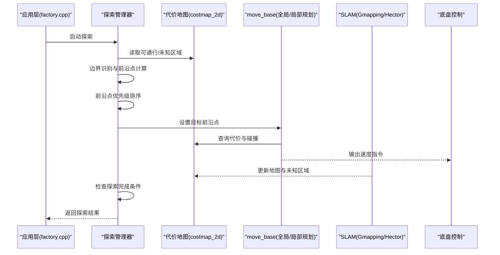
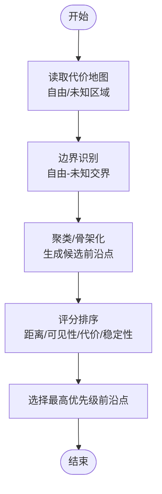
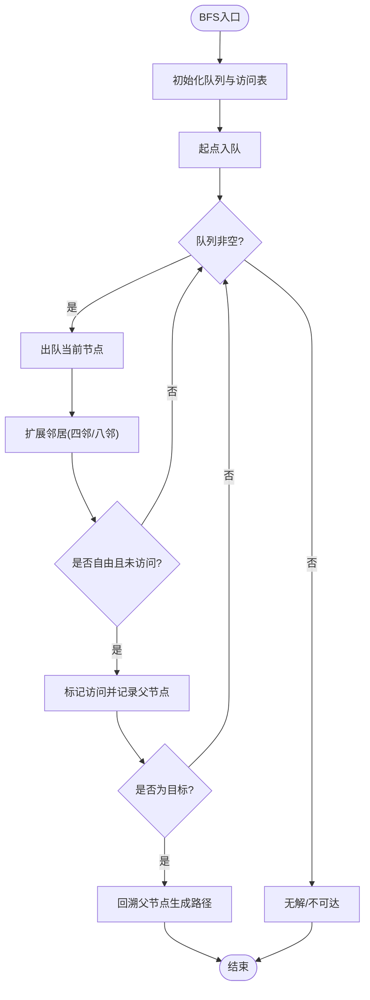
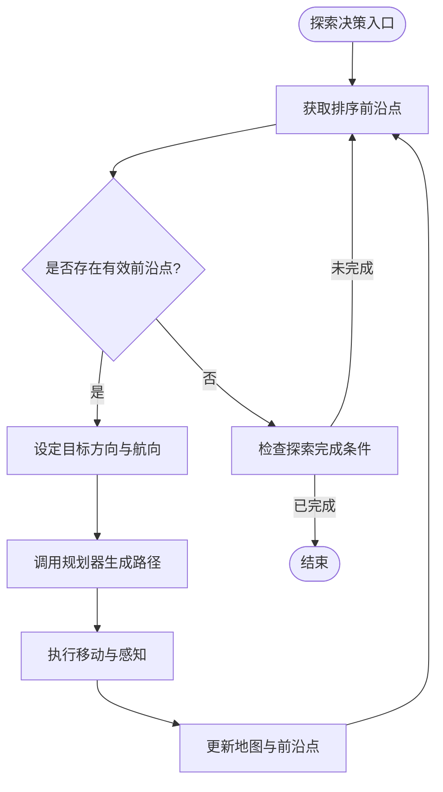
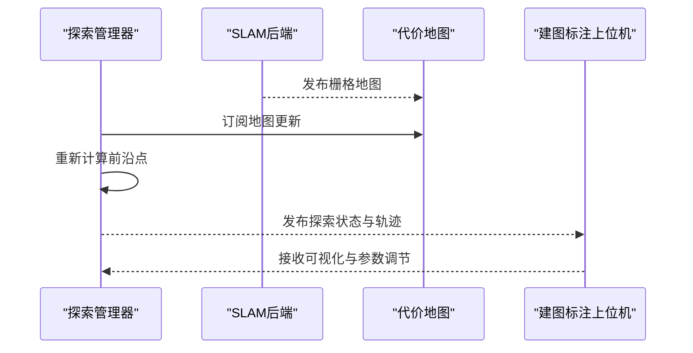
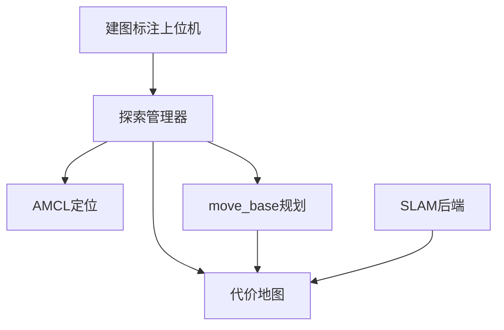

# 探索算法实现

<cite>
**本文引用的文件**   
- [sebot_factory.launch](file://sebot_factory/src/sebot_factory/launch/sebot_factory.launch)
- [factory.cpp](file://sebot_factory/src/sebot_factory/src/factory.cpp)
- [confirm.cpp](file://sebot_factory/src/sebot_factory/src/confirm.cpp)
- [picking.cpp](file://sebot_factory/src/sebot_factory/src/picking.cpp)
- [summary.cpp](file://sebot_factory/src/sebot_factory/src/summary.cpp)
- [slam.ui](file://sebot_marking/src/sebot_marking/ui/slam.ui)
- [qnode.hpp](file://sebot_marking/src/sebot_marking/include/qnode.hpp)
- [qrviz.hpp](file://sebot_marking/src/sebot_marking/include/qrviz.hpp)
- [addtopics.h](file://sebot_marking/src/sebot_marking/include/addtopics.h)
- [slam.h](file://sebot_marking/src/sebot_marking/include/slam.h)
- [costmap_2d.h](file://sebot_ros_kits/src/sebot_navigation/costmap_2d/include/costmap_2d/costmap_2d.h)
- [obstacle_layer.h](file://sebot_ros_kits/src/sebot_navigation/costmap_2d/include/costmap_2d/obstacle_layer.h)
- [inflation_layer.h](file://sebot_ros_kits/src/sebot_navigation/costmap_2d/include/costmap_2d/inflation_layer.h)
- [amcl_node.cpp](file://sebot_ros_kits/src/sebot_navigation/amcl/src/amcl_node.cpp)
- [move_base.cpp](file://sebot_ros_kits/src/sebot_navigation/move_base/src/move_base.cpp)
- [gmapping_node.cpp](file://sebot_ros_kits/src/sebot_slam/slam_gmapping/slam_gmapping/gmapping_node.cpp)
- [hector_mapping_node.cpp](file://sebot_ros_kits/src/sebot_slam/slam_hector/hector_mapping/src/hector_mapping_node.cpp)
</cite>

## 目录
1. [引言](#引言)
2. [项目结构](#项目结构)
3. [核心组件](#核心组件)
4. [架构总览](#架构总览)
5. [详细组件分析](#详细组件分析)
6. [依赖关系分析](#依赖关系分析)
7. [性能考虑](#性能考虑)
8. [故障排查指南](#故障排查指南)
9. [结论](#结论)
10. [附录](#附录)

## 引言
本技术文档围绕“自动建图的探索算法”展开，聚焦前沿点检测、边界识别、优先级排序与广度优先搜索（BFS）在路径规划中的应用。同时说明探索决策逻辑（目标选择、方向确定、完成判断），以及与SLAM系统的集成方式（地图数据获取、实时反馈、状态同步）。文档面向具备基础机器人知识的读者，提供从原理到工程落地的完整说明，并给出参数配置、性能调优与调试方法，辅以流程图、伪代码与实际运行示例。

## 项目结构
本项目由三个相互独立的 catkin 工作空间组成：
- sebot_factory：应用层业务节点（订单导航、需求确认、视觉取件、结算汇总等）
- sebot_ros_kits：机器人套件与导航栈（AMCL、move_base、costmap_2d、SLAM Gmapping/Hector 等）
- sebot_ros_stdr：仿真环境（STDR 模拟器与配套工具）

与探索算法直接相关的工程位置：
- 上层任务编排与状态机：sebot_factory/src/sebot_factory/src/factory.cpp
- 建图标注上位机（Qt）：sebot_marking（含 UI 与 ROS 话题订阅）
- 代价地图与障碍物层：sebot_ros_kits 中的 costmap_2d 相关头文件
- AMCL 定位与 move_base 全局/局部规划器
- SLAM 后端（Gmapping/Hector）



图表来源 
- [factory.cpp](file://sebot_factory/src/sebot_factory/src/factory.cpp)
- [confirm.cpp](file://sebot_factory/src/sebot_factory/src/confirm.cpp)
- [picking.cpp](file://sebot_factory/src/sebot_factory/src/picking.cpp)
- [summary.cpp](file://sebot_factory/src/sebot_factory/src/summary.cpp)
- [qnode.hpp](file://sebot_marking/src/sebot_marking/include/qnode.hpp)
- [qrviz.hpp](file://sebot_marking/src/sebot_marking/include/qrviz.hpp)
- [addtopics.h](file://sebot_marking/src/sebot_marking/include/addtopics.h)
- [slam.ui](file://sebot_marking/src/sebot_marking/ui/slam.ui)
- [amcl_node.cpp](file://sebot_ros_kits/src/sebot_navigation/amcl/src/amcl_node.cpp)
- [move_base.cpp](file://sebot_ros_kits/src/sebot_navigation/move_base/src/move_base.cpp)
- [costmap_2d.h](file://sebot_ros_kits/src/sebot_navigation/costmap_2d/include/costmap_2d/costmap_2d.h)
- [obstacle_layer.h](file://sebot_ros_kits/src/sebot_navigation/costmap_2d/include/costmap_2d/obstacle_layer.h)
- [inflation_layer.h](file://sebot_ros_kits/src/sebot_navigation/costmap_2d/include/costmap_2d/inflation_layer.h)
- [gmapping_node.cpp](file://sebot_ros_kits/src/sebot_slam/slam_gmapping/slam_gmapping/gmapping_node.cpp)
- [hector_mapping_node.cpp](file://sebot_ros_kits/src/sebot_slam/slam_hector/hector_mapping/src/hector_mapping_node.cpp)

章节来源
- [sebot_factory.launch](file://sebot_factory/src/sebot_factory/launch/sebot_factory.launch)

## 核心组件
- 探索管理器（位于应用层）：负责前沿点计算、边界识别、目标选择与探索方向确定，驱动机器人执行探索动作。
- 代价地图与障碍物层：提供可通行性信息、障碍物分布与膨胀区域，支撑前沿点评估与路径规划。
- 定位与规划器：AMCL 提供位姿估计；move_base 进行全局/局部路径规划，结合代价地图生成安全轨迹。
- SLAM 后端：Gmapping/Hector 将激光/里程计数据融合为栅格地图，实时更新可通行区域与未知区域。
- 建图标注上位机：通过 Qt + RViz 可视化地图、前沿点与探索轨迹，支持人工干预与参数调节。

章节来源
- [costmap_2d.h](file://sebot_ros_kits/src/sebot_navigation/costmap_2d/include/costmap_2d/costmap_2d.h)
- [obstacle_layer.h](file://sebot_ros_kits/src/sebot_navigation/costmap_2d/include/costmap_2d/obstacle_layer.h)
- [inflation_layer.h](file://sebot_ros_kits/src/sebot_navigation/costmap_2d/include/costmap_2d/inflation_layer.h)
- [amcl_node.cpp](file://sebot_ros_kits/src/sebot_navigation/amcl/src/amcl_node.cpp)
- [move_base.cpp](file://sebot_ros_kits/src/sebot_navigation/move_base/src/move_base.cpp)
- [gmapping_node.cpp](file://sebot_ros_kits/src/sebot_slam/slam_gmapping/slam_gmapping/gmapping_node.cpp)
- [hector_mapping_node.cpp](file://sebot_ros_kits/src/sebot_slam/slam_hector/hector_mapping/src/hector_mapping_node.cpp)

## 架构总览
探索系统以“应用层状态机 + 导航栈 + SLAM 后端”的协作模式运行：
- 应用层根据当前任务（如订单导航、取件、结算）触发探索流程。
- 探索管理器从代价地图中识别未知区域与边界，计算前沿点并排序。
- move_base 基于全局/局部规划器生成到达前沿点的轨迹，避开障碍物。
- SLAM 后端实时更新地图，反馈未知区域变化，驱动下一轮探索。



图表来源 
- [factory.cpp](file://sebot_factory/src/sebot_factory/src/factory.cpp)
- [costmap_2d.h](file://sebot_ros_kits/src/sebot_navigation/costmap_2d/include/costmap_2d/costmap_2d.h)
- [move_base.cpp](file://sebot_ros_kits/src/sebot_navigation/move_base/src/move_base.cpp)
- [gmapping_node.cpp](file://sebot_ros_kits/src/sebot_slam/slam_gmapping/slam_gmapping/gmapping_node.cpp)
- [hector_mapping_node.cpp](file://sebot_ros_kits/src/sebot_slam/slam_hector/hector_mapping/src/hector_mapping_node.cpp)

## 详细组件分析

### 前沿点检测算法
前沿点检测是探索的核心，包括边界识别、前沿点计算与优先级排序：
- 边界识别：遍历代价地图的已知自由单元格与未知单元格的交界，提取边界像素序列。
- 前沿点计算：对边界序列进行聚类或骨架化，得到候选前沿点坐标。
- 优先级排序：依据距离、可见性、代价、稳定性等指标对候选点进行打分，选取最优目标。



图表来源 
- [costmap_2d.h](file://sebot_ros_kits/src/sebot_navigation/costmap_2d/include/costmap_2d/costmap_2d.h)
- [obstacle_layer.h](file://sebot_ros_kits/src/sebot_navigation/costmap_2d/include/costmap_2d/obstacle_layer.h)

章节来源
- [costmap_2d.h](file://sebot_ros_kits/src/sebot_navigation/costmap_2d/include/costmap_2d/costmap_2d.h)
- [obstacle_layer.h](file://sebot_ros_kits/src/sebot_navigation/costmap_2d/include/costmap_2d/obstacle_layer.h)

### 广度优先搜索（BFS）在路径规划中的应用
BFS 用于在栅格地图上快速寻找最短路径，适用于静态或慢变环境的探索目标可达性判定：
- 搜索策略：从起点按层扩展，记录访问状态与父节点，直到到达目标或穷尽。
- 障碍物处理：仅扩展自由单元格，忽略障碍物与高代价区域。
- 路径优化：回溯父节点生成路径，必要时结合 A* 或 Dijkstra 进行加权优化。



图表来源 
- [move_base.cpp](file://sebot_ros_kits/src/sebot_navigation/move_base/src/move_base.cpp)
- [costmap_2d.h](file://sebot_ros_kits/src/sebot_navigation/costmap_2d/include/costmap_2d/costmap_2d.h)

章节来源
- [move_base.cpp](file://sebot_ros_kits/src/sebot_navigation/move_base/src/move_base.cpp)
- [costmap_2d.h](file://sebot_ros_kits/src/sebot_navigation/costmap_2d/include/costmap_2d/costmap_2d.h)

### 探索决策逻辑
探索决策包括目标选择、方向确定与完成判断：
- 目标选择：从排序后的前沿点中选择最优目标，考虑距离、可见性与代价。
- 方向确定：根据当前位姿与目标方位，生成初始航向角，避免急转。
- 完成判断：当未知区域比例低于阈值或连续多轮无新前沿点时，判定探索完成。



图表来源 
- [factory.cpp](file://sebot_factory/src/sebot_factory/src/factory.cpp)
- [amcl_node.cpp](file://sebot_ros_kits/src/sebot_navigation/amcl/src/amcl_node.cpp)
- [move_base.cpp](file://sebot_ros_kits/src/sebot_navigation/move_base/src/move_base.cpp)

章节来源
- [factory.cpp](file://sebot_factory/src/sebot_factory/src/factory.cpp)
- [amcl_node.cpp](file://sebot_ros_kits/src/sebot_navigation/amcl/src/amcl_node.cpp)
- [move_base.cpp](file://sebot_ros_kits/src/sebot_navigation/move_base/src/move_base.cpp)

### 与SLAM系统的集成
- 地图数据获取：从 SLAM 后端订阅栅格地图消息，解析自由/未知/障碍物区域。
- 实时建图反馈：SLAM 持续更新地图，探索管理器周期性重采样前沿点。
- 探索状态同步：通过 ROS 服务/参数发布探索状态（进行中、暂停、完成），供上位机显示与控制。



图表来源 
- [gmapping_node.cpp](file://sebot_ros_kits/src/sebot_slam/slam_gmapping/slam_gmapping/gmapping_node.cpp)
- [hector_mapping_node.cpp](file://sebot_ros_kits/src/sebot_slam/slam_hector/hector_mapping/src/hector_mapping_node.cpp)
- [qnode.hpp](file://sebot_marking/src/sebot_marking/include/qnode.hpp)
- [qrviz.hpp](file://sebot_marking/src/sebot_marking/include/qrviz.hpp)

章节来源
- [gmapping_node.cpp](file://sebot_ros_kits/src/sebot_slam/slam_gmapping/slam_gmapping/gmapping_node.cpp)
- [hector_mapping_node.cpp](file://sebot_ros_kits/src/sebot_slam/slam_hector/hector_mapping/src/hector_mapping_node.cpp)
- [qnode.hpp](file://sebot_marking/src/sebot_marking/include/qnode.hpp)
- [qrviz.hpp](file://sebot_marking/src/sebot_marking/include/qrviz.hpp)

### 算法伪代码
以下为探索算法的高层伪代码，便于理解整体流程：

```
函数 探索循环():
    初始化探索状态 = 进行中
    循环:
        读取代价地图
        识别边界并计算前沿点
        对前沿点评分并排序
        若存在有效前沿点:
            选择最高优先级前沿点作为目标
            调用规划器生成路径
            执行移动直至接近目标
            更新地图与前沿点
        否则:
            若未知区域比例 < 阈值 或 连续多轮无新前沿点:
                探索状态 = 完成
                退出循环
    返回 探索状态
```

[本节为概念性内容，不直接分析具体文件]

### 实际运行示例
- 启动 SLAM：运行 Gmapping/Hector 节点，订阅激光与里程计数据，生成栅格地图。
- 启动探索：在应用层触发探索流程，前端显示前沿点与轨迹。
- 观察反馈：上位机实时显示地图更新与探索状态，支持暂停/继续。
- 完成判断：当未知区域比例低于阈值，探索自动结束。

[本节为概念性内容，不直接分析具体文件]

## 依赖关系分析
探索算法依赖导航栈与 SLAM 后端的紧密协作：
- 代价地图提供可通行性信息，支撑前沿点评估与路径规划。
- AMCL 提供位姿估计，确保探索目标在正确坐标系下计算。
- move_base 负责全局/局部规划，结合代价地图生成安全轨迹。
- SLAM 后端实时更新地图，影响前沿点与探索决策。



图表来源 
- [costmap_2d.h](file://sebot_ros_kits/src/sebot_navigation/costmap_2d/include/costmap_2d/costmap_2d.h)
- [amcl_node.cpp](file://sebot_ros_kits/src/sebot_navigation/amcl/src/amcl_node.cpp)
- [move_base.cpp](file://sebot_ros_kits/src/sebot_navigation/move_base/src/move_base.cpp)
- [gmapping_node.cpp](file://sebot_ros_kits/src/sebot_slam/slam_gmapping/slam_gmapping/gmapping_node.cpp)
- [hector_mapping_node.cpp](file://sebot_ros_kits/src/sebot_slam/slam_hector/hector_mapping/src/hector_mapping_node.cpp)
- [qnode.hpp](file://sebot_marking/src/sebot_marking/include/qnode.hpp)

章节来源
- [costmap_2d.h](file://sebot_ros_kits/src/sebot_navigation/costmap_2d/include/costmap_2d/costmap_2d.h)
- [amcl_node.cpp](file://sebot_ros_kits/src/sebot_navigation/amcl/src/amcl_node.cpp)
- [move_base.cpp](file://sebot_ros_kits/src/sebot_navigation/move_base/src/move_base.cpp)
- [gmapping_node.cpp](file://sebot_ros_kits/src/sebot_slam/slam_gmapping/slam_gmapping/gmapping_node.cpp)
- [hector_mapping_node.cpp](file://sebot_ros_kits/src/sebot_slam/slam_hector/hector_mapping/src/hector_mapping_node.cpp)
- [qnode.hpp](file://sebot_marking/src/sebot_marking/include/qnode.hpp)

## 性能考虑
- 前沿点计算复杂度：边界识别与聚类的时间复杂度与地图分辨率和边界长度相关，建议采用增量更新与缓存机制。
- BFS 搜索效率：使用双向 BFS 或 A* 优化大规模地图下的搜索时间。
- 代价地图更新频率：平衡 SLAM 更新频率与内存占用，避免频繁重建导致延迟。
- 规划器参数：调整全局/局部规划器的步长、采样数与权重，提升轨迹质量与安全性。

[本节为通用指导，不直接分析具体文件]

## 故障排查指南
- 地图更新异常：检查 SLAM 节点日志与传感器数据，确认激光/里程计同步。
- 前沿点缺失：验证代价地图的自由/未知区域划分，调整边界识别阈值。
- 路径规划失败：检查障碍物层与膨胀层参数，确保目标可达。
- 探索卡死：增加超时与重试机制，监控未知区域比例变化。

章节来源
- [gmapping_node.cpp](file://sebot_ros_kits/src/sebot_slam/slam_gmapping/slam_gmapping/gmapping_node.cpp)
- [hector_mapping_node.cpp](file://sebot_ros_kits/src/sebot_slam/slam_hector/hector_mapping/src/hector_mapping_node.cpp)
- [costmap_2d.h](file://sebot_ros_kits/src/sebot_navigation/costmap_2d/include/costmap_2d/costmap_2d.h)

## 结论
探索算法通过前沿点检测与 BFS 路径规划，结合 SLAM 实时建图与导航栈，实现了高效的自动建图与探索。工程上需关注参数配置、性能优化与故障排查，以确保系统在复杂环境中的鲁棒性与实时性。

[本节为总结性内容，不直接分析具体文件]

## 附录
- 关键参数配置：参考 sebot_factory.launch 中的 simulation、debug、导航超时、PID、取件距离、补扫等参数。
- 调试方法：使用 RViz 可视化地图、前沿点与轨迹；查看 ROS 日志与 SLAM 节点输出。
- 最佳实践：分阶段调试（SLAM → 定位 → 规划 → 探索），逐步验证各模块功能。

章节来源
- [sebot_factory.launch](file://sebot_factory/src/sebot_factory/launch/sebot_factory.launch)