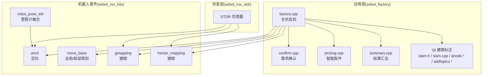
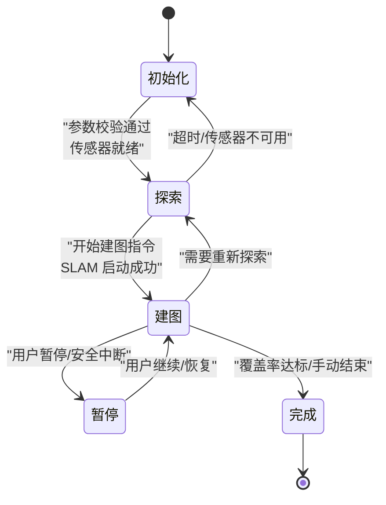
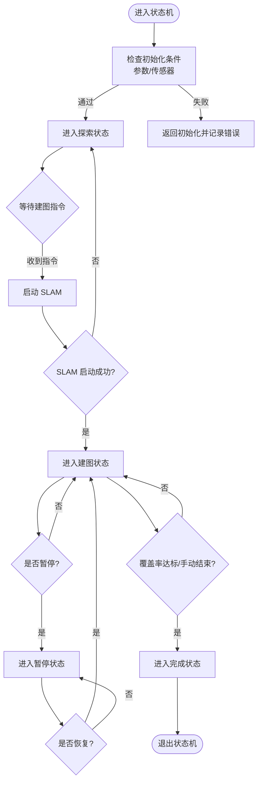
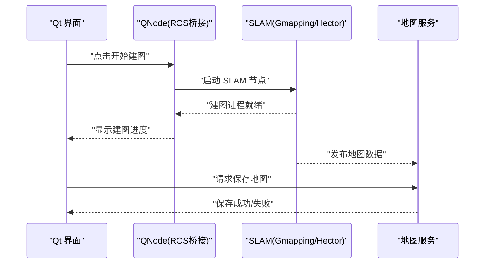
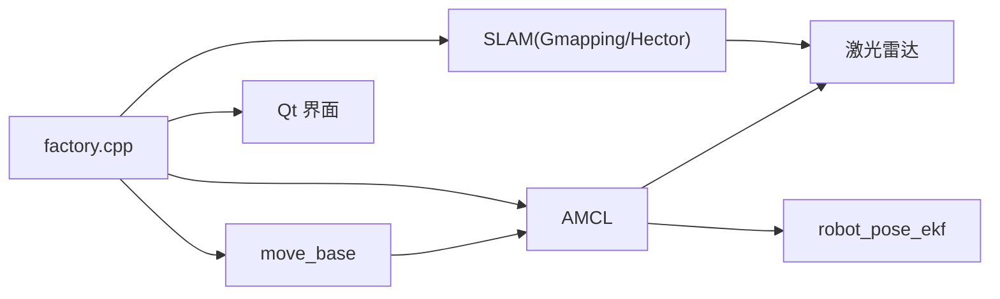

# 状态管理系统

<cite>
**本文引用的文件**   
- [factory.cpp](file://sebot_factory/src/sebot_factory/src/factory.cpp)
- [confirm.cpp](file://sebot_factory/src/sebot_factory/src/confirm.cpp)
- [picking.cpp](file://sebot_factory/src/sebot_factory/src/picking.cpp)
- [summary.cpp](file://sebot_factory/src/sebot_factory/src/summary.cpp)
- [sebot_factory.launch](file://sebot_factory/src/sebot_factory/launch/sebot_factory.launch)
- [slam.h](file://sebot_factory/src/sebot_marking/include/slam.h)
- [slam.cpp](file://sebot_factory/src/sebot_marking/src/slam.cpp)
- [qnode.hpp](file://sebot_factory/src/sebot_marking/include/qnode.hpp)
- [qnode.cpp](file://sebot_factory/src/sebot_marking/src/qnode.cpp)
- [addtopics.h](file://sebot_factory/src/sebot_marking/include/addtopics.h)
- [addtopics.cpp](file://sebot_factory/src/sebot_marking/src/addtopics.cpp)
- [robot_pose_ekf_node.h](file://sebot_ros_kits/src/sebot_driver/robot_pose_ekf/include/robot_pose_ekf/odom_estimation_node.h)
- [amcl_node.cpp](file://sebot_ros_kits/src/sebot_navigation/amcl/src/amcl_node.cpp)
- [move_base.cpp](file://sebot_ros_kits/src/sebot_navigation/move_base/src/move_base.cpp)
- [gmapping_node.cpp](file://sebot_ros_kits/src/sebot_slam/slam_gmapping/gmapping_node.cpp)
- [hector_mapping_node.cpp](file://sebot_ros_kits/src/sebot_slam/slams_hector/hector_mapping/src/hector_mapping_node.cpp)
</cite>

## 目录
1. [简介](#简介)
2. [项目结构](#项目结构)
3. [核心组件](#核心组件)
4. [架构总览](#架构总览)
5. [详细组件分析](#详细组件分析)
6. [依赖关系分析](#依赖关系分析)
7. [性能考虑](#性能考虑)
8. [故障排查指南](#故障排查指南)
9. [结论](#结论)
10. [附录](#附录)

## 简介
本技术文档围绕“自动建图的状态管理系统”展开，聚焦于机器人竞赛项目中与建图、定位、导航和任务执行相关的状态机设计与实现。系统涵盖以下关键状态：初始化状态、探索状态、建图状态、暂停状态与完成状态；并解释状态转换条件与触发机制（用户输入、传感器反馈、时间控制）。同时给出状态机的实现架构（状态定义、转换逻辑、事件处理）、状态持久化（保存/恢复/故障恢复）、监控与诊断（日志、错误检测、异常处理），以及配置选项、调试方法与最佳实践。

## 项目结构
本项目由三个相互独立的 catkin 工作空间组成：
- sebot_factory：应用层，包含业务节点（工厂流程、需求确认、智能取件、结算汇总）与 Qt 建图标注上位机。
- sebot_ros_kits：机器人驱动与导航套件，包含 AMCL、move_base、SLAM（Gmapping/Hector）、EKF 里程计融合等。
- sebot_ros_stdr：仿真环境（STDR），用于在仿真中验证建图与导航流程。

图表来源
- [factory.cpp](file://sebot_factory/src/sebot_factory/src/factory.cpp)
- [confirm.cpp](file://sebot_factory/src/sebot_factory/src/confirm.cpp)
- [picking.cpp](file://sebot_factory/src/sebot_factory/src/picking.cpp)
- [summary.cpp](file://sebot_factory/src/sebot_factory/src/summary.cpp)
- [slam.h](file://sebot_factory/src/sebot_marking/include/slam.h)
- [slam.cpp](file://sebot_factory/src/sebot_marking/src/slam.cpp)
- [qnode.hpp](file://sebot_factory/src/sebot_marking/include/qnode.hpp)
- [qnode.cpp](file://sebot_factory/src/sebot_marking/src/qnode.cpp)
- [addtopics.h](file://sebot_factory/src/sebot_marking/include/addtopics.h)
- [addtopics.cpp](file://sebot_factory/src/sebot_marking/src/addtopics.cpp)
- [robot_pose_ekf_node.h](file://sebot_ros_kits/src/sebot_driver/robot_pose_ekf/include/robot_pose_ekf/odom_estimation_node.h)
- [amcl_node.cpp](file://sebot_ros_kits/src/sebot_navigation/amcl/src/amcl_node.cpp)
- [move_base.cpp](file://sebot_ros_kits/src/sebot_navigation/move_base/src/move_base.cpp)
- [gmapping_node.cpp](file://sebot_ros_kits/src/sebot_slam/slam_gmapping/gmapping_node.cpp)
- [hector_mapping_node.cpp](file://sebot_ros_kits/src/sebot_slam/slams_hector/hector_mapping/src/hector_mapping_node.cpp)

章节来源
- [sebot_factory.launch](file://sebot_factory/src/sebot_factory/launch/sebot_factory.launch)

## 核心组件
- 主状态机（factory.cpp）：协调建图、定位、导航与任务执行的总体流程，管理状态转换与事件分发。
- 建图模块（slam.h / slam.cpp 与 Qt 界面）：负责启动 SLAM、订阅激光数据、生成地图、保存/加载地图。
- 定位模块（AMCL）：基于粒子滤波的自适应蒙特卡洛定位，提供位姿估计与重定位能力。
- 导航模块（move_base）：全局路径规划与局部避障，支持超时、代价地图更新与恢复行为。
- 里程计融合（robot_pose_ekf）：融合 IMU 与轮式里程计，输出更稳定的位姿。
- 建图算法（Gmapping/Hector）：根据传感器数据构建栅格地图，支持在线增量更新。

章节来源
- [factory.cpp](file://sebot_factory/src/sebot_factory/src/factory.cpp)
- [slam.h](file://sebot_factory/src/sebot_marking/include/slam.h)
- [slam.cpp](file://sebot_factory/src/sebot_marking/src/slam.cpp)
- [qnode.hpp](file://sebot_factory/src/sebot_marking/include/qnode.hpp)
- [qnode.cpp](file://sebot_factory/src/sebot_marking/src/qnode.cpp)
- [addtopics.h](file://sebot_factory/src/sebot_marking/include/addtopics.h)
- [addtopics.cpp](file://sebot_factory/src/sebot_marking/src/addtopics.cpp)
- [amcl_node.cpp](file://sebot_ros_kits/src/sebot_navigation/amcl/src/amcl_node.cpp)
- [move_base.cpp](file://sebot_ros_kits/src/sebot_navigation/move_base/src/move_base.cpp)
- [robot_pose_ekf_node.h](file://sebot_ros_kits/src/sebot_driver/robot_pose_ekf/include/robot_pose_ekf/odom_estimation_node.h)
- [gmapping_node.cpp](file://sebot_ros_kits/src/sebot_slam/slam_gmapping/gmapping_node.cpp)
- [hector_mapping_node.cpp](file://sebot_ros_kits/src/sebot_slam/slams_hector/hector_mapping/src/hector_mapping_node.cpp)

## 架构总览
状态机以 factory.cpp 为核心，向上对接 Qt 建图标注界面，向下协调 AMCL、move_base、SLAM 与 EKF。建图过程中，状态从“初始化”进入“探索”，再进入“建图”，期间可被“暂停”，最终达到“完成”。

图表来源
- [factory.cpp](file://sebot_factory/src/sebot_factory/src/factory.cpp)
- [slam.cpp](file://sebot_factory/src/sebot_marking/src/slam.cpp)
- [amcl_node.cpp](file://sebot_ros_kits/src/sebot_navigation/amcl/src/amcl_node.cpp)
- [move_base.cpp](file://sebot_ros_kits/src/sebot_navigation/move_base/src/move_base.cpp)

## 详细组件分析

### 主状态机（factory.cpp）
- 职责：维护当前状态、监听事件（用户输入、传感器状态、定时器）、调用子模块（SLAM、AMCL、move_base）并记录日志。
- 状态定义：初始化、探索、建图、暂停、完成。
- 转换逻辑：
  - 初始化 → 探索：当所有必要参数合法且传感器（激光、IMU、里程计）可用时进入探索。
  - 探索 → 建图：收到“开始建图”指令且 SLAM 节点启动成功后进入建图。
  - 建图 ↔ 暂停：用户可通过界面或消息暂停/恢复建图。
  - 建图 → 完成：当满足覆盖率阈值或用户手动结束。
  - 探索/建图 → 初始化：超时或关键传感器不可用时回退到初始化。
- 事件处理：订阅传感器话题、接收 UI 命令、处理定时器回调。

图表来源
- [factory.cpp](file://sebot_factory/src/sebot_factory/src/factory.cpp)

章节来源
- [factory.cpp](file://sebot_factory/src/sebot_factory/src/factory.cpp)

### 建图模块（slam.h / slam.cpp + Qt 界面）
- 职责：启动 SLAM 节点、订阅激光数据、可视化建图过程、保存/加载地图。
- 交互：通过 ROS 服务/动作与 Gmapping/Hector 通信；UI 提供开始/停止/保存按钮。
- 数据流：激光扫描 → SLAM 节点 → 栅格地图 → 保存为 pgm/yaml。

图表来源
- [slam.h](file://sebot_factory/src/sebot_marking/include/slam.h)
- [slam.cpp](file://sebot_factory/src/sebot_marking/src/slam.cpp)
- [qnode.hpp](file://sebot_factory/src/sebot_marking/include/qnode.hpp)
- [qnode.cpp](file://sebot_factory/src/sebot_marking/src/qnode.cpp)
- [addtopics.h](file://sebot_factory/src/sebot_marking/include/addtopics.h)
- [addtopics.cpp](file://sebot_factory/src/sebot_marking/src/addtopics.cpp)

章节来源
- [slam.h](file://sebot_factory/src/sebot_marking/include/slam.h)
- [slam.cpp](file://sebot_factory/src/sebot_marking/src/slam.cpp)
- [qnode.hpp](file://sebot_factory/src/sebot_marking/include/qnode.hpp)
- [qnode.cpp](file://sebot_factory/src/sebot_marking/src/qnode.cpp)
- [addtopics.h](file://sebot_factory/src/sebot_marking/include/addtopics.h)
- [addtopics.cpp](file://sebot_factory/src/sebot_marking/src/addtopics.cpp)

### 定位模块（AMCL）
- 职责：基于粒子滤波进行自定位，支持重定位与初始位姿设置。
- 集成：通过 move_base 订阅 odom 与激光数据，输出位姿估计。
- 关键参数：粒子数、重采样阈值、地图分辨率、观测模型等。

章节来源
- [amcl_node.cpp](file://sebot_ros_kits/src/sebot_navigation/amcl/src/amcl_node.cpp)

### 导航模块（move_base）
- 职责：全局路径规划（navfn/global_planner）与局部避障（DWA/base_local_planner），管理代价地图与恢复行为。
- 集成：订阅 AMCL 位姿与激光数据，发布速度指令给底盘。
- 关键参数：全局/局部代价地图、规划频率、超时、恢复策略。

章节来源
- [move_base.cpp](file://sebot_ros_kits/src/sebot_navigation/move_base/src/move_base.cpp)

### 里程计融合（robot_pose_ekf）
- 职责：融合 IMU 与轮式里程计，输出更稳定的位姿估计。
- 集成：订阅 IMU 与里程计话题，发布融合后的 odom。

章节来源
- [robot_pose_ekf_node.h](file://sebot_ros_kits/src/sebot_driver/robot_pose_ekf/include/robot_pose_ekf/odom_estimation_node.h)

### 建图算法（Gmapping/Hector）
- Gmapping：基于粒子滤波的 SLAM，适合有里程计的差速/全向机器人。
- Hector：无需里程计，适用于平面场景快速建图。
- 集成：通过 ROS 节点运行，发布地图与 TF 变换。

章节来源
- [gmapping_node.cpp](file://sebot_ros_kits/src/sebot_slam/slam_gmapping/gmapping_node.cpp)
- [hector_mapping_node.cpp](file://sebot_ros_kits/src/sebot_slam/slams_hector/hector_mapping/src/hector_mapping_node.cpp)

## 依赖关系分析
状态机依赖多个子系统，形成清晰的层次与耦合关系：
- factory.cpp 作为上层协调者，依赖 SLAM、AMCL、move_base 与 UI。
- SLAM 依赖激光数据与 TF；AMCL 依赖 odom 与激光；move_base 依赖 AMCL 与代价地图。
- robot_pose_ekf 为 AMCL 提供更稳定的 odom。

图表来源
- [factory.cpp](file://sebot_factory/src/sebot_factory/src/factory.cpp)
- [slam.cpp](file://sebot_factory/src/sebot_marking/src/slam.cpp)
- [amcl_node.cpp](file://sebot_ros_kits/src/sebot_navigation/amcl/src/amcl_node.cpp)
- [move_base.cpp](file://sebot_ros_kits/src/sebot_navigation/move_base/src/move_base.cpp)
- [robot_pose_ekf_node.h](file://sebot_ros_kits/src/sebot_driver/robot_pose_ekf/include/robot_pose_ekf/odom_estimation_node.h)

章节来源
- [factory.cpp](file://sebot_factory/src/sebot_factory/src/factory.cpp)
- [slam.cpp](file://sebot_factory/src/sebot_marking/src/slam.cpp)
- [amcl_node.cpp](file://sebot_ros_kits/src/sebot_navigation/amcl/src/amcl_node.cpp)
- [move_base.cpp](file://sebot_ros_kits/src/sebot_navigation/move_base/src/move_base.cpp)
- [robot_pose_ekf_node.h](file://sebot_ros_kits/src/sebot_driver/robot_pose_ekf/include/robot_pose_ekf/odom_estimation_node.h)

## 性能考虑
- 建图效率：合理设置 SLAM 参数（如激光降采样、栅格分辨率）以减少计算量。
- 定位精度：调整 AMCL 粒子数与重采样阈值，平衡精度与实时性。
- 导航稳定性：优化 move_base 的代价地图更新频率与局部规划步长。
- 资源占用：在仿真模式下降低渲染与感知频率，避免 CPU/GPU 瓶颈。

## 故障排查指南
- 传感器不可用：检查激光、IMU、里程计话题是否正常发布；查看 EKF 融合状态。
- 建图失败：确认 SLAM 节点启动日志；检查 TF 树与坐标系一致性；验证地图保存权限。
- 定位漂移：检查 AMCL 初始位姿设置；增加粒子数或调整观测模型参数。
- 导航超时：检查全局/局部代价地图；调整 move_base 超时与恢复策略。
- 状态机卡死：查看 factory.cpp 日志；确认事件回调未被阻塞；检查 UI 与 ROS 通信。

章节来源
- [factory.cpp](file://sebot_factory/src/sebot_factory/src/factory.cpp)
- [slam.cpp](file://sebot_factory/src/sebot_marking/src/slam.cpp)
- [amcl_node.cpp](file://sebot_ros_kits/src/sebot_navigation/amcl/src/amcl_node.cpp)
- [move_base.cpp](file://sebot_ros_kits/src/sebot_navigation/move_base/src/move_base.cpp)
- [robot_pose_ekf_node.h](file://sebot_ros_kits/src/sebot_driver/robot_pose_ekf/include/robot_pose_ekf/odom_estimation_node.h)

## 结论
本状态管理系统以 factory.cpp 为核心，结合 SLAM、AMCL、move_base 与 EKF，构建了完整的自动建图与导航流程。通过清晰的状态定义、转换逻辑与事件处理，系统在用户输入、传感器反馈与时间控制的共同作用下稳定运行。配合 Qt 界面与完善的日志诊断，可实现高效的建图与调试。建议在实际部署中关注参数调优与资源占用，确保系统在高负载下的可靠性。

## 附录
- 关键配置项（示例，具体值以 launch 为准）：
  - simulation：切换 STDR 仿真模式
  - debug：控制图像识别界面开关
  - 导航超时、PID、取件距离、补扫参数：影响建图与导航行为
- 调试方法：
  - 使用 rqt_console 查看日志
  - 使用 rviz 可视化建图与定位结果
  - 使用 rostopic echo 检查传感器数据
- 最佳实践：
  - 先离线验证参数，再上机运行
  - 分阶段启用模块，逐步排查问题
  - 保持 TF 树一致性与坐标帧命名规范