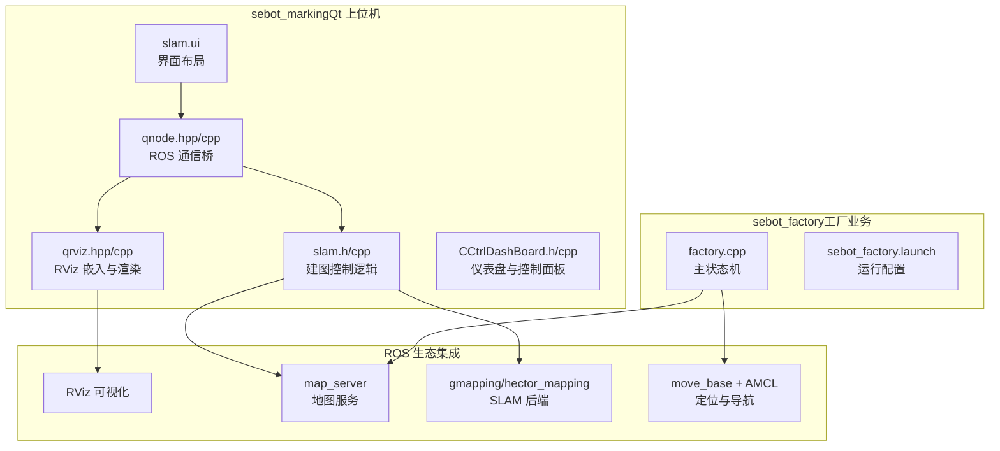
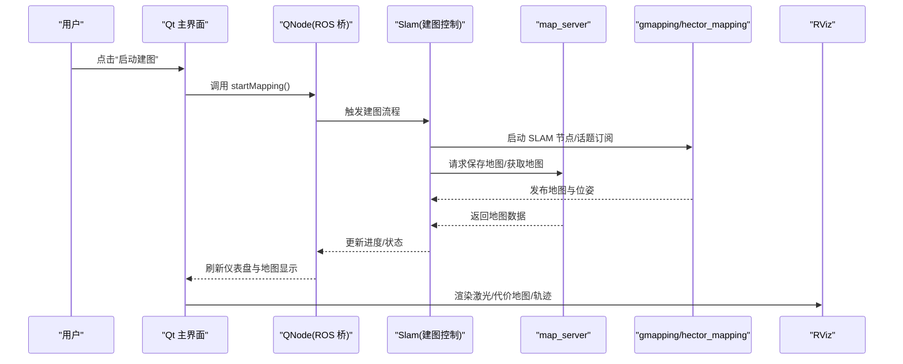
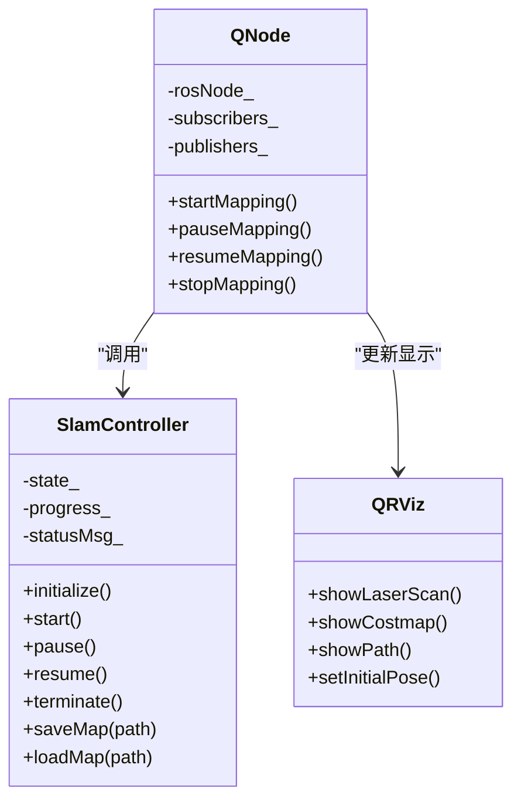
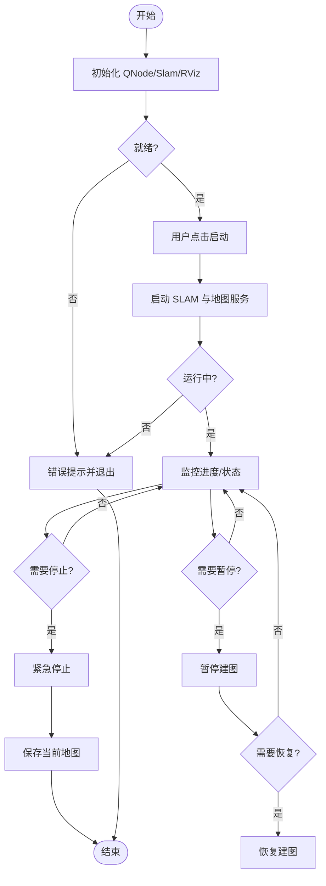
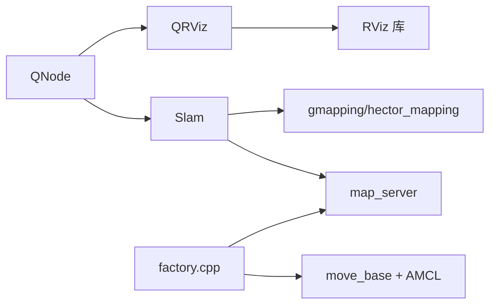

# 用户交互接口

<cite>
**本文引用的文件**   
- [sebot_marking/src/main.cpp](file://sebot_ros_kits/src/sebot_marking/src/main.cpp)
- [sebot_marking/src/qnode.cpp](file://sebot_ros_kits/src/sebot_marking/src/qnode.cpp)
- [sebot_marking/include/qnode.hpp](file://sebot_ros_kits/src/sebot_marking/include/qnode.hpp)
- [sebot_marking/src/slam.cpp](file://sebot_ros_kits/src/sebot_marking/src/slam.cpp)
- [sebot_marking/include/slam.h](file://sebot_ros_kits/src/sebot_marking/include/slam.h)
- [sebot_marking/src/qrviz.cpp](file://sebot_ros_kits/src/sebot_marking/src/qrviz.cpp)
- [sebot_marking/include/qrviz.hpp](file://sebot_ros_kits/src/sebot_marking/include/qrviz.hpp)
- [sebot_marking/src/CCtrlDashBoard.cpp](file://sebot_ros_kits/src/sebot_marking/src/CCtrlDashBoard.cpp)
- [sebot_marking/include/CCtrlDashBoard.h](file://sebot_ros_kits/src/sebot_marking/include/CCtrlDashBoard.h)
- [sebot_marking/ui/slam.ui](file://sebot_ros_kits/src/sebot_marking/ui/slam.ui)
- [sebot_marking/resources/location.yaml](file://sebot_ros_kits/src/sebot_marking/resources/location.yaml)
- [sebot_marking/resources/location.xml](file://sebot_ros_kits/src/sebot_marking/resources/location.xml)
- [sebot_marking/CMakeLists.txt](file://sebot_ros_kits/src/sebot_marking/CMakeLists.txt)
- [sebot_marking/package.xml](file://sebot_ros_kits/src/sebot_marking/package.xml)
- [sebot_factory/launch/sebot_factory.launch](file://sebot_factory/src/sebot_factory/launch/sebot_factory.launch)
- [sebot_factory/src/factory.cpp](file://sebot_factory/src/sebot_factory/src/factory.cpp)
</cite>

## 目录
1. [简介](#简介)
2. [项目结构](#项目结构)
3. [核心组件](#核心组件)
4. [架构总览](#架构总览)
5. [详细组件分析](#详细组件分析)
6. [依赖关系分析](#依赖关系分析)
7. [性能与实时性](#性能与实时性)
8. [故障排查指南](#故障排查指南)
9. [结论](#结论)
10. [附录：操作手册与界面定制](#附录操作手册与界面定制)

## 简介
本技术文档面向“自动建图”的用户交互接口，聚焦 sebot_marking（Qt 上位机）与 sebot_factory（工厂业务节点）的协作。文档覆盖 Qt 界面布局、控件绑定与事件处理；建图控制（启动、暂停/恢复、手动干预、紧急停止）；实时监控（地图显示、进度指示、状态信息、错误提示）；参数配置（算法参数、传感器校准、系统配置）；数据导出（地图保存、日志记录、统计分析）；以及界面定制、用户体验优化与国际化支持。读者可据此快速上手并扩展功能。

## 项目结构
本项目由三个相互独立的 catkin 工作空间组成：sebot_factory（应用层）、sebot_ros_kits（机器人套件）、sebot_ros_stdr（仿真层）。自动建图的 Qt 交互位于 sebot_ros_kits/src/sebot_marking，工厂业务主流程位于 sebot_factory/src/sebot_factory。导航栈与 SLAM 相关包（move_base、AMCL、Gmapping/Hector 等）在 sebot_ros_kits 中作为集成组件使用，不深入其内部实现。

图表来源
- [sebot_marking/ui/slam.ui](file://sebot_ros_kits/src/sebot_marking/ui/slam.ui)
- [sebot_marking/include/qnode.hpp](file://sebot_ros_kits/src/sebot_marking/include/qnode.hpp)
- [sebot_marking/src/qnode.cpp](file://sebot_ros_kits/src/sebot_marking/src/qnode.cpp)
- [sebot_marking/include/slam.h](file://sebot_ros_kits/src/sebot_marking/include/slam.h)
- [sebot_marking/src/slam.cpp](file://sebot_ros_kits/src/sebot_marking/src/slam.cpp)
- [sebot_marking/include/qrviz.hpp](file://sebot_ros_kits/src/sebot_marking/include/qrviz.hpp)
- [sebot_marking/src/qrviz.cpp](file://sebot_ros_kits/src/sebot_marking/src/qrviz.cpp)
- [sebot_marking/include/CCtrlDashBoard.h](file://sebot_ros_kits/src/sebot_marking/include/CCtrlDashBoard.h)
- [sebot_marking/src/CCtrlDashBoard.cpp](file://sebot_ros_kits/src/sebot_marking/src/CCtrlDashBoard.cpp)
- [sebot_factory/src/factory.cpp](file://sebot_factory/src/sebot_factory/src/factory.cpp)
- [sebot_factory/launch/sebot_factory.launch](file://sebot_factory/src/sebot_factory/launch/sebot_factory.launch)

章节来源
- [sebot_marking/CMakeLists.txt](file://sebot_ros_kits/src/sebot_marking/CMakeLists.txt)
- [sebot_marking/package.xml](file://sebot_ros_kits/src/sebot_marking/package.xml)
- [sebot_factory/launch/sebot_factory.launch](file://sebot_factory/src/sebot_factory/launch/sebot_factory.launch)

## 核心组件
- Qt 主程序入口：负责初始化 QApplication、加载 UI、创建并展示主窗口。
- ROS 通信桥（QNode）：封装 ROS 节点生命周期、订阅/发布 Topic、调用 Service/Action，提供线程安全的回调机制。
- 建图控制器（Slam）：封装建图流程（启动、暂停/恢复、终止），管理地图服务调用、里程计/LiDAR 数据流、进度与状态上报。
- RViz 嵌入（QRViz）：将 RViz 嵌入 Qt 窗口，显示激光扫描、点云、代价地图、机器人位姿与路径。
- 控制面板（CCtrlDashBoard）：集中展示关键指标（速度、里程、电池、误差）、提供快捷按钮与参数输入框。
- 资源与配置：location.yaml/xml 用于初始位姿与地图元数据；UI 资源与媒体资源通过 .qrc 打包。

章节来源
- [sebot_marking/src/main.cpp](file://sebot_ros_kits/src/sebot_marking/src/main.cpp)
- [sebot_marking/include/qnode.hpp](file://sebot_ros_kits/src/sebot_marking/include/qnode.hpp)
- [sebot_marking/src/qnode.cpp](file://sebot_ros_kits/src/sebot_marking/src/qnode.cpp)
- [sebot_marking/include/slam.h](file://sebot_ros_kits/src/sebot_marking/include/slam.h)
- [sebot_marking/src/slam.cpp](file://sebot_ros_kits/src/sebot_marking/src/slam.cpp)
- [sebot_marking/include/qrviz.hpp](file://sebot_ros_kits/src/sebot_marking/include/qrviz.hpp)
- [sebot_marking/src/qrviz.cpp](file://sebot_ros_kits/src/sebot_marking/src/qrviz.cpp)
- [sebot_marking/include/CCtrlDashBoard.h](file://sebot_ros_kits/src/sebot_marking/include/CCtrlDashBoard.h)
- [sebot_marking/src/CCtrlDashBoard.cpp](file://sebot_ros_kits/src/sebot_marking/src/CCtrlDashBoard.cpp)
- [sebot_marking/resources/location.yaml](file://sebot_ros_kits/src/sebot_marking/resources/location.yaml)
- [sebot_marking/resources/location.xml](file://sebot_ros_kits/src/sebot_marking/resources/location.xml)

## 架构总览
下图展示了 Qt 上位机与 ROS 生态的交互关系，包括建图控制、地图服务、SLAM 后端与 RViz 可视化。

图表来源
- [sebot_marking/src/qnode.cpp](file://sebot_ros_kits/src/sebot_marking/src/qnode.cpp)
- [sebot_marking/src/slam.cpp](file://sebot_ros_kits/src/sebot_marking/src/slam.cpp)
- [sebot_marking/src/qrviz.cpp](file://sebot_ros_kits/src/sebot_marking/src/qrviz.cpp)

## 详细组件分析

### Qt 界面与布局（slam.ui）
- 布局分区：顶部工具栏（启动/暂停/恢复/停止）、中部 RViz 嵌入区域、底部仪表盘（状态/进度/错误提示）、右侧参数面板（算法参数、传感器校准、系统配置）。
- 控件绑定：按钮信号槽连接至 QNode/Slam 方法；文本框与滑块绑定到参数模型；状态标签与进度条由定时器或回调驱动更新。
- 主题与样式：通过样式表统一配色与字体，支持高对比度模式与缩放。

章节来源
- [sebot_marking/ui/slam.ui](file://sebot_ros_kits/src/sebot_marking/ui/slam.ui)

### ROS 通信桥（QNode）
- 职责：封装 ros::init/ros::spin，维护订阅者/发布者/服务客户端；提供线程安全的数据收发接口；将 ROS 消息转换为 Qt 可用的数据结构。
- 关键接口：startMapping()/pauseMapping()/resumeMapping()/stopMapping()；subscribeTopics()；publishCmd()；updateStatus()。
- 错误处理：网络断开、Topic 未找到、服务超时等异常捕获与重试策略。

章节来源
- [sebot_marking/include/qnode.hpp](file://sebot_ros_kits/src/sebot_marking/include/qnode.hpp)
- [sebot_marking/src/qnode.cpp](file://sebot_ros_kits/src/sebot_marking/src/qnode.cpp)

### 建图控制器（Slam）
- 职责：编排建图流程，协调 SLAM 后端与 map_server；维护建图状态机（空闲、进行中、暂停、完成、失败）；计算进度与质量评估。
- 关键接口：initialize()/start()/pause()/resume()/terminate()/saveMap()/loadMap()。
- 数据流：订阅激光/里程计/IMU，发布速度指令；接收地图增量更新，合并栅格并输出。

图表来源
- [sebot_marking/include/qnode.hpp](file://sebot_ros_kits/src/sebot_marking/include/qnode.hpp)
- [sebot_marking/src/qnode.cpp](file://sebot_ros_kits/src/sebot_marking/src/qnode.cpp)
- [sebot_marking/include/slam.h](file://sebot_ros_kits/src/sebot_marking/include/slam.h)
- [sebot_marking/src/slam.cpp](file://sebot_ros_kits/src/sebot_marking/src/slam.cpp)
- [sebot_marking/include/qrviz.hpp](file://sebot_ros_kits/src/sebot_marking/include/qrviz.hpp)
- [sebot_marking/src/qrviz.cpp](file://sebot_ros_kits/src/sebot_marking/src/qrviz.cpp)

章节来源
- [sebot_marking/include/slam.h](file://sebot_ros_kits/src/sebot_marking/include/slam.h)
- [sebot_marking/src/slam.cpp](file://sebot_ros_kits/src/sebot_marking/src/slam.cpp)

### RViz 嵌入与渲染（QRViz）
- 职责：在 Qt 窗口内嵌入 RViz，订阅并渲染激光扫描、点云、代价地图、机器人位姿与规划路径。
- 交互：设置初始位姿、切换图层可见性、调整显示阈值与颜色映射。
- 性能：按需刷新、帧率限制、异步渲染避免阻塞 UI。

章节来源
- [sebot_marking/include/qrviz.hpp](file://sebot_ros_kits/src/sebot_marking/include/qrviz.hpp)
- [sebot_marking/src/qrviz.cpp](file://sebot_ros_kits/src/sebot_marking/src/qrviz.cpp)

### 控制面板与仪表盘（CCtrlDashBoard）
- 职责：集中展示速度、里程、电池电量、定位误差、建图进度；提供快捷按钮与参数输入框。
- 更新机制：定时器轮询或回调驱动；数据聚合与格式化显示。
- 交互：参数修改即时生效，带校验与回滚。

章节来源
- [sebot_marking/include/CCtrlDashBoard.h](file://sebot_ros_kits/src/sebot_marking/include/CCtrlDashBoard.h)
- [sebot_marking/src/CCtrlDashBoard.cpp](file://sebot_ros_kits/src/sebot_marking/src/CCtrlDashBoard.cpp)

### 建图控制流程（启动、暂停/恢复、手动干预、紧急停止）

图表来源
- [sebot_marking/src/slam.cpp](file://sebot_ros_kits/src/sebot_marking/src/slam.cpp)
- [sebot_marking/src/qnode.cpp](file://sebot_ros_kits/src/sebot_marking/src/qnode.cpp)

章节来源
- [sebot_marking/src/slam.cpp](file://sebot_ros_kits/src/sebot_marking/src/slam.cpp)
- [sebot_marking/src/qnode.cpp](file://sebot_ros_kits/src/sebot_marking/src/qnode.cpp)

### 实时监控界面（地图显示、进度指示、状态信息、错误提示）
- 地图显示：RViz 嵌入层实时渲染激光与代价地图；可选叠加路径与位姿估计。
- 进度指示：基于已建栅格面积/时间估算；支持百分比与 ETA。
- 状态信息：建图状态、传感器健康、CPU/内存占用、网络延迟。
- 错误提示：分类告警（传感器离线、SLAM 发散、地图服务不可用），支持一键诊断。

章节来源
- [sebot_marking/src/qrviz.cpp](file://sebot_ros_kits/src/sebot_marking/src/qrviz.cpp)
- [sebot_marking/src/CCtrlDashBoard.cpp](file://sebot_ros_kits/src/sebot_marking/src/CCtrlDashBoard.cpp)

### 参数配置界面（算法参数、传感器校准、系统配置）
- 算法参数：SLAM 分辨率、滤波阈值、匹配窗口、代价地图膨胀半径等。
- 传感器校准：LiDAR 安装偏移、IMU 偏置、里程计比例因子。
- 系统配置：网络端口、日志级别、缓存大小、UI 主题与语言。
- 持久化：参数写入 YAML/XML 或 ROS Parameter Server；支持导入/导出模板。

章节来源
- [sebot_marking/resources/location.yaml](file://sebot_ros_kits/src/sebot_marking/resources/location.yaml)
- [sebot_marking/resources/location.xml](file://sebot_ros_kits/src/sebot_marking/resources/location.xml)
- [sebot_marking/src/CCtrlDashBoard.cpp](file://sebot_ros_kits/src/sebot_marking/src/CCtrlDashBoard.cpp)

### 数据导出（地图保存、日志记录、统计分析）
- 地图保存：调用 map_server 服务导出 pgm/yaml；支持命名规则与版本管理。
- 日志记录：ROS log 与自定义 CSV/JSON；包含时间戳、事件类型、关键指标。
- 统计分析：建图时长、覆盖率、漂移量、丢帧率；生成报告与图表。

章节来源
- [sebot_marking/src/slam.cpp](file://sebot_ros_kits/src/sebot_marking/src/slam.cpp)
- [sebot_marking/src/qnode.cpp](file://sebot_ros_kits/src/sebot_marking/src/qnode.cpp)

### 界面定制、用户体验优化与国际化
- 界面定制：通过 .ui 文件调整布局与控件；样式表统一主题；插件化模块扩展面板。
- 用户体验：快捷键、拖拽排序、撤销/重做、自动保存、崩溃恢复。
- 国际化：多语言资源文件（.ts/.qm），运行时切换语言；日期/单位本地化。

章节来源
- [sebot_marking/ui/slam.ui](file://sebot_ros_kits/src/sebot_marking/ui/slam.ui)
- [sebot_marking/CMakeLists.txt](file://sebot_ros_kits/src/sebot_marking/CMakeLists.txt)

## 依赖关系分析
- Qt 与 ROS：QNode 作为桥梁，解耦 UI 与 ROS 通信；Slam 控制器依赖 ROS 服务与 Topic。
- RViz 嵌入：QRViz 依赖 rviz 库与 Qt 集成；渲染线程独立于 UI 线程。
- 工厂业务：factory.cpp 主状态机与 move_base/AMCL 协同，受 launch 配置影响。

图表来源
- [sebot_marking/src/qnode.cpp](file://sebot_ros_kits/src/sebot_marking/src/qnode.cpp)
- [sebot_marking/src/slam.cpp](file://sebot_ros_kits/src/sebot_marking/src/slam.cpp)
- [sebot_marking/src/qrviz.cpp](file://sebot_ros_kits/src/sebot_marking/src/qrviz.cpp)
- [sebot_factory/src/factory.cpp](file://sebot_factory/src/sebot_factory/src/factory.cpp)

章节来源
- [sebot_marking/package.xml](file://sebot_ros_kits/src/sebot_marking/package.xml)
- [sebot_factory/launch/sebot_factory.launch](file://sebot_factory/src/sebot_factory/launch/sebot_factory.launch)

## 性能与实时性
- 渲染优化：RViz 按需刷新、帧率限制、异步渲染；大地图分块加载。
- 数据处理：Topic 订阅去抖、队列长度限制、消息压缩。
- 资源管理：内存池、对象复用、垃圾回收策略；CPU/内存监控与告警。
- 并发模型：UI 线程与 ROS 回调分离，避免阻塞；关键路径加锁与无锁队列。

[本节为通用指导，无需特定文件引用]

## 故障排查指南
- 常见问题：
  - 无法连接 ROS：检查 roscore、网络配置、防火墙。
  - 地图服务不可用：确认 map_server 启动、Topic 名称一致。
  - SLAM 发散：检查 LiDAR/里程计数据质量、参数调优。
  - RViz 黑屏：确认 rviz 库安装、OpenGL 驱动正常。
- 诊断步骤：查看日志、回放 bag、最小化复现、逐项禁用模块。
- 恢复策略：重启节点、清理缓存、回滚参数、重新标定传感器。

章节来源
- [sebot_marking/src/qnode.cpp](file://sebot_ros_kits/src/sebot_marking/src/qnode.cpp)
- [sebot_marking/src/slam.cpp](file://sebot_ros_kits/src/sebot_marking/src/slam.cpp)

## 结论
本用户交互接口以 Qt 为主界面，结合 ROS 生态实现自动建图的全流程控制与可视化。通过清晰的组件划分与松耦合设计，既保证了实时性与稳定性，又提供了良好的可扩展性与用户体验。建议在实际部署中结合环境特点调参，并完善日志与统计以持续优化建图质量与效率。

[本节为总结，无需特定文件引用]

## 附录：操作手册与界面定制
- 操作流程：
  - 上电自检 → 启动 Qt 上位机 → 连接 ROS → 加载初始位姿 → 启动建图 → 监控进度 → 保存地图 → 导出日志。
- 界面截图：
  - 主界面：工具栏、RViz 嵌入区、仪表盘、参数面板。
  - 建图进行中：激光扫描、代价地图、路径与位姿叠加。
  - 参数配置：算法参数、传感器校准、系统配置页签。
- 用户手册要点：
  - 快捷键与手势；批量任务与模板；错误告警与一键修复。
  - 多语言切换与主题选择；数据导出格式与命名规范。

[本节为概念性内容，无需特定文件引用]