# 自动建图功能

<cite>
**本文引用的文件**   
- [sebot_marking.launch](file://sebot_factory/src/sebot_marking/launch/sebot_marking.launch)
- [slam.ui](file://sebot_factory/src/sebot_marking/ui/slam.ui)
- [qnode.cpp](file://sebot_factory/src/sebot_marking/src/qnode.cpp)
- [CCtrlDashBoard.cpp](file://sebot_factory/src/sebot_marking/src/CCtrlDashBoard.cpp)
- [addtopics.cpp](file://sebot_factory/src/sebot_marking/src/addtopics.cpp)
- [slam_gmapping_node.cpp](file://sebot_ros_kits/src/sebot_slam/slam_gmapping/slam_gmapping/slam_gmapping_node.cpp)
- [gmapping.h](file://sebot_ros_kits/src/sebot_slam/slam_gmapping/gmapping/gmapping.h)
- [hector_mapping_node.cpp](file://sebot_ros_kits/src/sebot_slam/slam_hector/hector_mapping/src/hector_mapping_node.cpp)
- [hector_mapping_params.yaml](file://sebot_ros_kits/src/sebot_slam/slam_hector/hector_mapping/param/hector_mapping_params.yaml)
- [move_base.launch](file://sebot_ros_kits/src/sebot_navigation/move_base/launch/move_base.launch)
- [costmap_common_params.yaml](file://sebot_ros_kits/src/sebot_navigation/costmap_2d/cfg/Costmap2D.cfg)
- [robot_pose_ekf_node.cpp](file://sebot_ros_kits/src/sebot_driver/robot_pose_ekf/src/odom_estimation_node.cpp)
- [rplidar_node.cpp](file://sebot_ros_kits/src/sebot_driver/rplidar_ros/src/node.cpp)
- [sebot_odom.launch](file://sebot_robot/launch/sebot_odom.launch)
- [sebot_transform.launch](file://sebot_robot/launch/sebot_transform.launch)
</cite>

## 目录
1. [简介](#简介)
2. [项目结构](#项目结构)
3. [核心组件](#核心组件)
4. [架构总览](#架构总览)
5. [详细组件分析](#详细组件分析)
6. [依赖关系分析](#依赖关系分析)
7. [性能考虑](#性能考虑)
8. [故障排查指南](#故障排查指南)
9. [结论](#结论)
10. [附录](#附录)

## 简介
本技术文档面向“自动建图”能力，围绕以下目标展开：
- 解释自动探索算法的实现原理（边界检测、前沿搜索、路径规划策略）
- 说明建图过程中的状态管理（探索状态、建图状态、完成状态的转换逻辑）
- 描述地图拼接与一致性检查机制（重叠区域识别、地图对齐与融合算法）
- 阐述控制策略（速度控制、转向控制、避障逻辑）
- 给出用户交互接口（启动控制、暂停恢复、手动干预）
- 提供建图流程配置、参数调优与性能监控方法
- 包含建图流程图、状态转换图与最佳实践指南

本项目基于 ROS 1 + catkin，采用 GMapping/Hector 进行 SLAM 建图，RPLidar 作为激光雷达传感器，EKF 融合里程计与 IMU 提升位姿估计质量；上层通过 Qt 上位机（sebot_marking）实现建图任务编排与人机交互。导航栈使用 move_base + AMCL + DWA，但本仓库对官方导航包仅做集成与参数定制，不深入其内部源码。

## 项目结构
从三层工作空间视角理解自动建图相关模块：
- sebot_factory（应用层）：Qt 建图标注上位机（sebot_marking），负责订阅 SLAM/传感器话题、发布控制指令、保存地图等
- sebot_ros_kits（机器人套件）：SLAM（GMapping/Hector）、定位（AMCL）、代价地图（costmap_2d）、传感器驱动（rplidar_ros）、EKF 位姿融合（robot_pose_ekf）
- sebot_robot（底层驱动）：里程计发布、TF 变换、键盘/手柄控制等

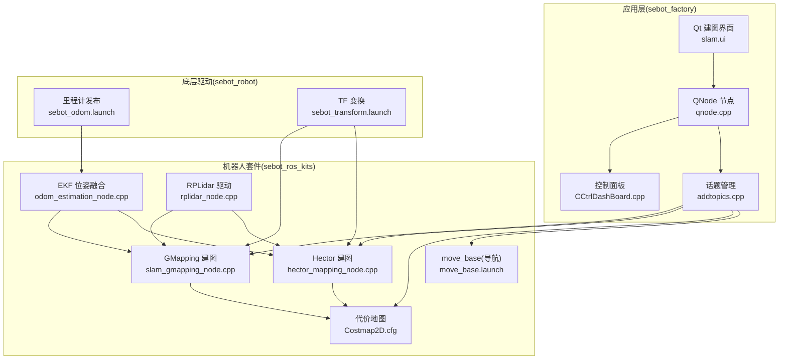

图表来源
- [sebot_marking.launch](file://sebot_factory/src/sebot_marking/launch/sebot_marking.launch)
- [qnode.cpp](file://sebot_factory/src/sebot_marking/src/qnode.cpp)
- [slam_gmapping_node.cpp](file://sebot_ros_kits/src/sebot_slam/slam_gmapping/slam_gmapping/slam_gmapping_node.cpp)
- [hector_mapping_node.cpp](file://sebot_ros_kits/src/sebot_slam/slam_hector/hector_mapping/src/hector_mapping_node.cpp)
- [rplidar_node.cpp](file://sebot_ros_kits/src/sebot_driver/rplidar_ros/src/node.cpp)
- [robot_pose_ekf_node.cpp](file://sebot_ros_kits/src/sebot_driver/robot_pose_ekf/src/odom_estimation_node.cpp)
- [sebot_odom.launch](file://sebot_robot/launch/sebot_odom.launch)
- [sebot_transform.launch](file://sebot_robot/launch/sebot_transform.launch)

章节来源
- [sebot_marking.launch](file://sebot_factory/src/sebot_marking/launch/sebot_marking.launch)
- [qnode.cpp](file://sebot_factory/src/sebot_marking/src/qnode.cpp)
- [slam_gmapping_node.cpp](file://sebot_ros_kits/src/sebot_slam/slam_gmapping/slam_gmapping/slam_gmapping_node.cpp)
- [hector_mapping_node.cpp](file://sebot_ros_kits/src/sebot_slam/slam_hector/hector_mapping/src/hector_mapping_node.cpp)
- [rplidar_node.cpp](file://sebot_ros_kits/src/sebot_driver/rplidar_ros/src/node.cpp)
- [robot_pose_ekf_node.cpp](file://sebot_ros_kits/src/sebot_driver/robot_pose_ekf/src/odom_estimation_node.cpp)
- [sebot_odom.launch](file://sebot_robot/launch/sebot_odom.launch)
- [sebot_transform.launch](file://sebot_robot/launch/sebot_transform.launch)

## 核心组件
- 建图后端
  - GMapping：基于粒子滤波的栅格 SLAM，适合有里程计/IMU 的场景，支持在线建图与闭环检测
  - Hector：无里程计 SLAM，直接利用激光扫描匹配，适用于轮式打滑或无可靠里程计场景
- 传感器与位姿
  - RPLidar：提供二维激光扫描数据
  - robot_pose_ekf：融合 IMU 与里程计，输出更稳健的位姿
  - TF：统一坐标变换树，确保各坐标系一致
- 代价地图与导航
  - costmap_2d：构建可通行性代价地图，为路径规划提供输入
  - move_base：全局/局部规划与执行，结合 AMCL 定位
- 人机交互
  - Qt 上位机（sebot_marking）：订阅/发布话题、控制建图流程、保存地图

章节来源
- [slam_gmapping_node.cpp](file://sebot_ros_kits/src/sebot_slam/slam_gmapping/slam_gmapping/slam_gmapping_node.cpp)
- [hector_mapping_node.cpp](file://sebot_ros_kits/src/sebot_slam/slam_hector/hector_mapping/src/hector_mapping_node.cpp)
- [rplidar_node.cpp](file://sebot_ros_kits/src/sebot_driver/rplidar_ros/src/node.cpp)
- [robot_pose_ekf_node.cpp](file://sebot_ros_kits/src/sebot_driver/robot_pose_ekf/src/odom_estimation_node.cpp)
- [sebot_odom.launch](file://sebot_robot/launch/sebot_odom.launch)
- [sebot_transform.launch](file://sebot_robot/launch/sebot_transform.launch)
- [move_base.launch](file://sebot_ros_kits/src/sebot_navigation/move_base/launch/move_base.launch)
- [costmap_common_params.yaml](file://sebot_ros_kits/src/sebot_navigation/costmap_2d/cfg/Costmap2D.cfg)

## 架构总览
自动建图的数据流与控制流如下：
- 传感器层：RPLidar 扫描 → EKF 融合位姿 → TF 广播
- SLAM 层：GMapping/Hector 消费激光与位姿，更新栅格地图与位姿估计
- 导航层：costmap_2d 生成代价地图，move_base 根据目标点生成轨迹并下发速度指令
- 应用层：Qt 上位机订阅地图/位姿/传感器话题，提供启动/暂停/保存等操作

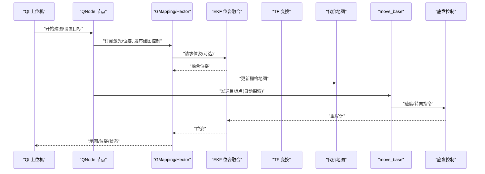

图表来源
- [qnode.cpp](file://sebot_factory/src/sebot_marking/src/qnode.cpp)
- [slam_gmapping_node.cpp](file://sebot_ros_kits/src/sebot_slam/slam_gmapping/slam_gmapping/slam_gmapping_node.cpp)
- [hector_mapping_node.cpp](file://sebot_ros_kits/src/sebot_slam/slam_hector/hector_mapping/src/hector_mapping_node.cpp)
- [robot_pose_ekf_node.cpp](file://sebot_ros_kits/src/sebot_driver/robot_pose_ekf/src/odom_estimation_node.cpp)
- [move_base.launch](file://sebot_ros_kits/src/sebot_navigation/move_base/launch/move_base.launch)

## 详细组件分析

### 建图后端：GMapping 与 Hector
- GMapping
  - 输入：激光扫描、位姿（来自 EKF/里程计+IMU）
  - 输出：栅格地图、位姿估计、粒子集
  - 特点：在线闭环检测、对里程计质量敏感
- Hector
  - 输入：激光扫描、TF（无需里程计）
  - 输出：栅格地图、位姿估计
  - 特点：对打滑鲁棒，但在开阔环境易漂移

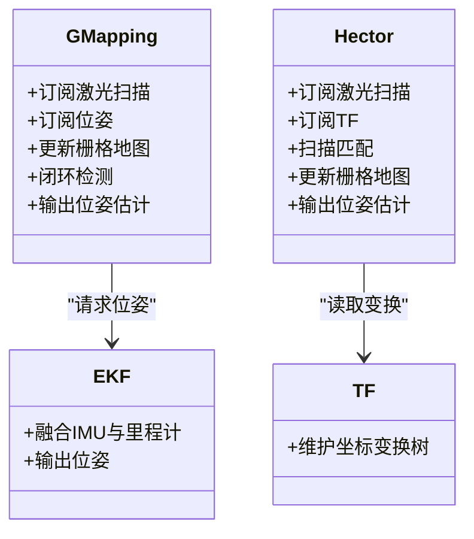

图表来源
- [slam_gmapping_node.cpp](file://sebot_ros_kits/src/sebot_slam/slam_gmapping/slam_gmapping/slam_gmapping_node.cpp)
- [hector_mapping_node.cpp](file://sebot_ros_kits/src/sebot_slam/slam_hector/hector_mapping/src/hector_mapping_node.cpp)
- [robot_pose_ekf_node.cpp](file://sebot_ros_kits/src/sebot_driver/robot_pose_ekf/src/odom_estimation_node.cpp)
- [sebot_transform.launch](file://sebot_robot/launch/sebot_transform.launch)

章节来源
- [slam_gmapping_node.cpp](file://sebot_ros_kits/src/sebot_slam/slam_gmapping/slam_gmapping/slam_gmapping_node.cpp)
- [hector_mapping_node.cpp](file://sebot_ros_kits/src/sebot_slam/slam_hector/hector_mapping/src/hector_mapping_node.cpp)
- [robot_pose_ekf_node.cpp](file://sebot_ros_kits/src/sebot_driver/robot_pose_ekf/src/odom_estimation_node.cpp)
- [sebot_transform.launch](file://sebot_robot/launch/sebot_transform.launch)

### 传感器与位姿：RPLidar 与 EKF
- RPLidar
  - 发布激光扫描消息，频率稳定，覆盖角度广
- EKF
  - 融合 IMU 与里程计，抑制噪声与打滑影响，提高位姿精度
- TF
  - 统一坐标系，确保 SLAM/导航正确引用

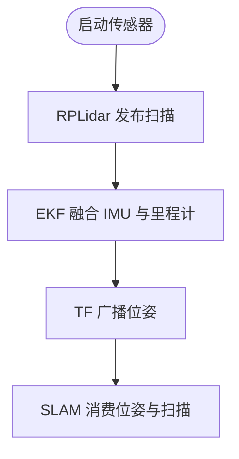

图表来源
- [rplidar_node.cpp](file://sebot_ros_kits/src/sebot_driver/rplidar_ros/src/node.cpp)
- [robot_pose_ekf_node.cpp](file://sebot_ros_kits/src/sebot_driver/robot_pose_ekf/src/odom_estimation_node.cpp)
- [sebot_odom.launch](file://sebot_robot/launch/sebot_odom.launch)
- [sebot_transform.launch](file://sebot_robot/launch/sebot_transform.launch)

章节来源
- [rplidar_node.cpp](file://sebot_ros_kits/src/sebot_driver/rplidar_ros/src/node.cpp)
- [robot_pose_ekf_node.cpp](file://sebot_ros_kits/src/sebot_driver/robot_pose_ekf/src/odom_estimation_node.cpp)
- [sebot_odom.launch](file://sebot_robot/launch/sebot_odom.launch)
- [sebot_transform.launch](file://sebot_robot/launch/sebot_transform.launch)

### 代价地图与导航：costmap_2d 与 move_base
- costmap_2d
  - 将静态层、动态层（障碍物）融合为代价地图，供全局/局部规划器使用
- move_base
  - 全局规划（如 navfn）与局部规划（如 DWA）协同，输出速度指令
  - 在自动建图中，可作为“自动探索”的执行器

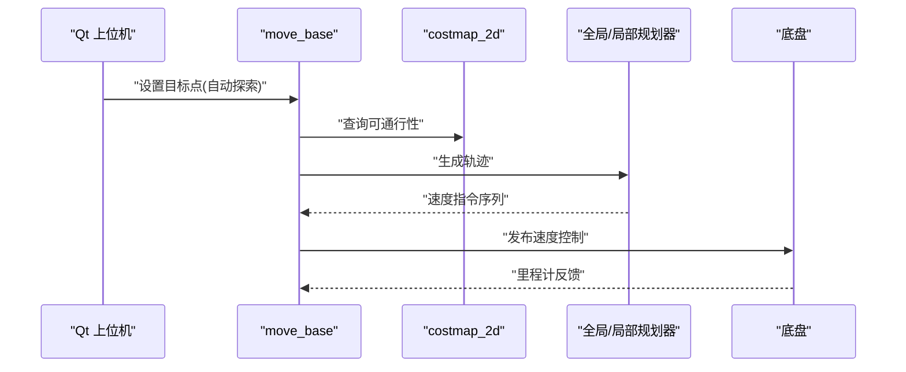

图表来源
- [move_base.launch](file://sebot_ros_kits/src/sebot_navigation/move_base/launch/move_base.launch)
- [costmap_common_params.yaml](file://sebot_ros_kits/src/sebot_navigation/costmap_2d/cfg/Costmap2D.cfg)

章节来源
- [move_base.launch](file://sebot_ros_kits/src/sebot_navigation/move_base/launch/move_base.launch)
- [costmap_common_params.yaml](file://sebot_ros_kits/src/sebot_navigation/costmap_2d/cfg/Costmap2D.cfg)

### 人机交互：Qt 上位机（sebot_marking）
- 界面（slam.ui）
  - 显示地图、位姿、传感器信息
  - 提供启动/暂停/保存地图按钮
- QNode（qnode.cpp）
  - 订阅/发布 ROS 话题（地图、位姿、激光、控制命令）
  - 处理用户操作，调用 SLAM/导航服务
- CCtrlDashBoard（CCtrlDashBoard.cpp）
  - 控制面板逻辑，封装建图流程的状态切换
- addtopics（addtopics.cpp）
  - 统一管理话题订阅/发布，降低耦合

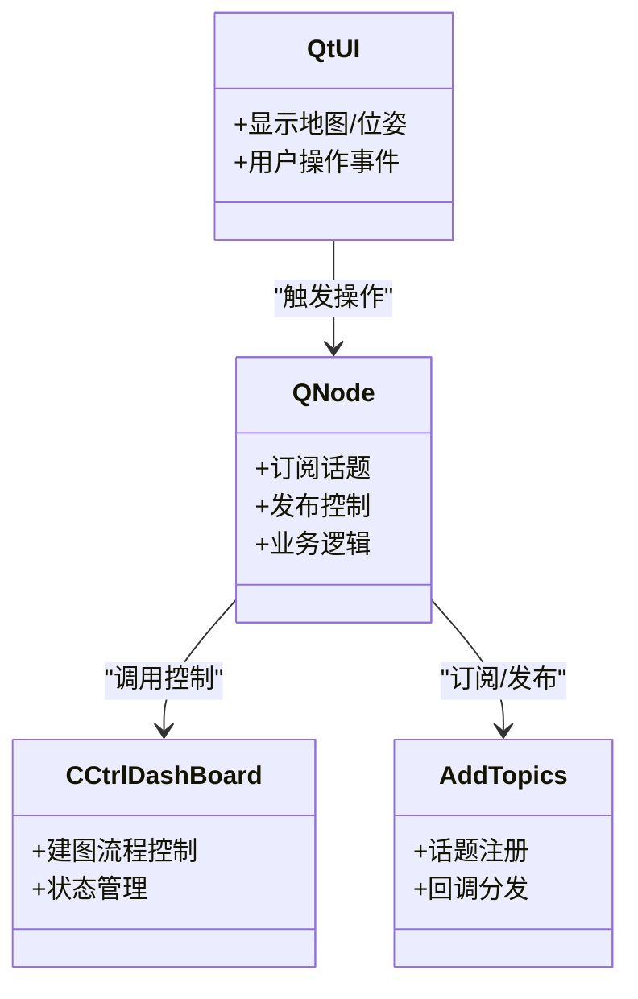

图表来源
- [slam.ui](file://sebot_factory/src/sebot_marking/ui/slam.ui)
- [qnode.cpp](file://sebot_factory/src/sebot_marking/src/qnode.cpp)
- [CCtrlDashBoard.cpp](file://sebot_factory/src/sebot_marking/src/CCtrlDashBoard.cpp)
- [addtopics.cpp](file://sebot_factory/src/sebot_marking/src/addtopics.cpp)

章节来源
- [slam.ui](file://sebot_factory/src/sebot_marking/ui/slam.ui)
- [qnode.cpp](file://sebot_factory/src/sebot_marking/src/qnode.cpp)
- [CCtrlDashBoard.cpp](file://sebot_factory/src/sebot_marking/src/CCtrlDashBoard.cpp)
- [addtopics.cpp](file://sebot_factory/src/sebot_marking/src/addtopics.cpp)

### 自动探索算法：边界检测、前沿搜索与路径规划
- 边界检测
  - 基于栅格地图中未知区域与已知自由区域的交界线，提取候选边界点
- 前沿搜索
  - 计算每个候选边界的“前沿值”（如未知区域面积、距离当前位姿的代价），选择最优前沿
- 路径规划
  - 以选定的前沿为目标点，调用 move_base 生成轨迹，避免碰撞并平滑运动
- 终止条件
  - 当未知区域比例低于阈值或连续多次未找到新前沿时，判定建图完成

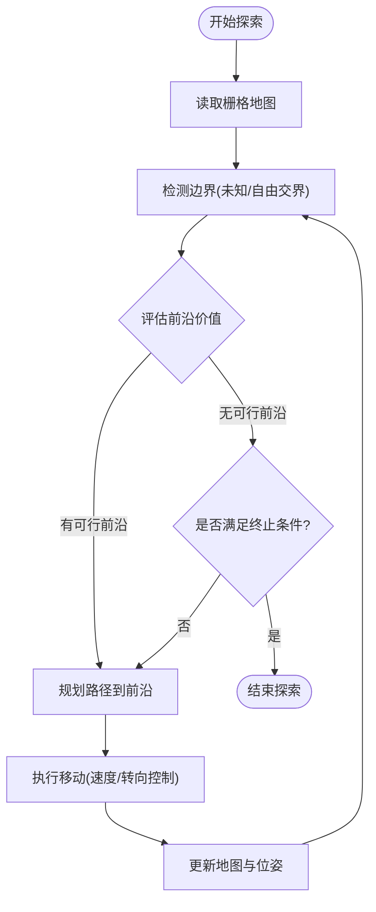

[此图为概念流程图，不直接映射具体源码文件]

### 建图状态管理：探索状态、建图状态、完成状态
- 状态定义
  - 探索状态：系统正在寻找并前往前沿点
  - 建图状态：SLAM 在线运行，持续更新地图
  - 完成状态：达到终止条件，停止探索
- 转换逻辑
  - 启动后进入建图状态
  - 若检测到新前沿，进入探索状态
  - 探索完成后回到建图状态继续监测
  - 满足终止条件则进入完成状态

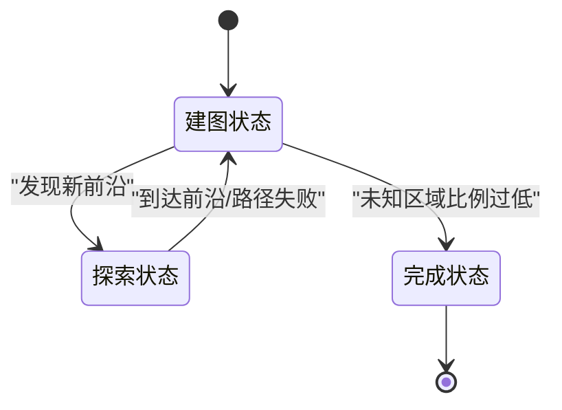

[此图为概念状态图，不直接映射具体源码文件]

### 地图拼接与一致性检查：重叠区域识别、对齐与融合
- 重叠区域识别
  - 基于两幅地图的特征点匹配或栅格相似度计算，确定重叠范围
- 地图对齐
  - 使用 ICP/特征匹配估计相对位姿，将两幅地图对齐到同一坐标系
- 融合算法
  - 对重叠区域进行加权平均或最大似然融合，消除重复与冲突
- 一致性检查
  - 检查融合后的地图是否存在明显错位或空洞，必要时回滚或重新对齐

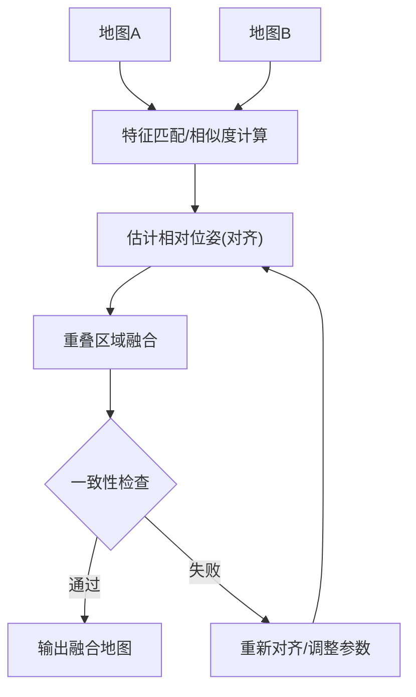

[此图为概念流程图，不直接映射具体源码文件]

### 控制策略：速度控制、转向控制与避障
- 速度控制
  - 根据地形与障碍距离调节前进速度，确保安全与效率平衡
- 转向控制
  - 局部规划器（如 DWA）生成转向角，保证轨迹平滑与避障
- 避障逻辑
  - 代价地图动态层实时更新障碍物，局部规划器实时规避

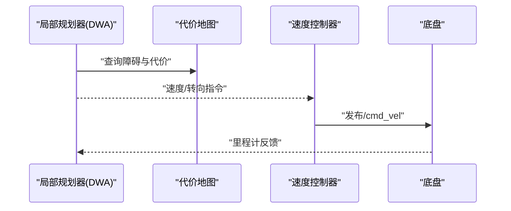

图表来源
- [move_base.launch](file://sebot_ros_kits/src/sebot_navigation/move_base/launch/move_base.launch)
- [costmap_common_params.yaml](file://sebot_ros_kits/src/sebot_navigation/costmap_2d/cfg/Costmap2D.cfg)

章节来源
- [move_base.launch](file://sebot_ros_kits/src/sebot_navigation/move_base/launch/move_base.launch)
- [costmap_common_params.yaml](file://sebot_ros_kits/src/sebot_navigation/costmap_2d/cfg/Costmap2D.cfg)

## 依赖关系分析
- 松耦合设计
  - Qt 上位机通过话题与 SLAM/导航解耦，便于替换后端
- 关键依赖链
  - RPLidar → EKF → TF → SLAM → costmap_2d → move_base
- 潜在循环依赖
  - 无直接循环，但需确保 TF 树完整与时间同步

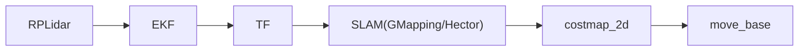

图表来源
- [rplidar_node.cpp](file://sebot_ros_kits/src/sebot_driver/rplidar_ros/src/node.cpp)
- [robot_pose_ekf_node.cpp](file://sebot_ros_kits/src/sebot_driver/robot_pose_ekf/src/odom_estimation_node.cpp)
- [sebot_transform.launch](file://sebot_robot/launch/sebot_transform.launch)
- [slam_gmapping_node.cpp](file://sebot_ros_kits/src/sebot_slam/slam_gmapping/slam_gmapping/slam_gmapping_node.cpp)
- [hector_mapping_node.cpp](file://sebot_ros_kits/src/sebot_slam/slam_hector/hector_mapping/src/hector_mapping_node.cpp)
- [move_base.launch](file://sebot_ros_kits/src/sebot_navigation/move_base/launch/move_base.launch)

章节来源
- [rplidar_node.cpp](file://sebot_ros_kits/src/sebot_driver/rplidar_ros/src/node.cpp)
- [robot_pose_ekf_node.cpp](file://sebot_ros_kits/src/sebot_driver/robot_pose_ekf/src/odom_estimation_node.cpp)
- [sebot_transform.launch](file://sebot_robot/launch/sebot_transform.launch)
- [slam_gmapping_node.cpp](file://sebot_ros_kits/src/sebot_slam/slam_gmapping/slam_gmapping/slam_gmapping_node.cpp)
- [hector_mapping_node.cpp](file://sebot_ros_kits/src/sebot_slam/slam_hector/hector_mapping/src/hector_mapping_node.cpp)
- [move_base.launch](file://sebot_ros_kits/src/sebot_navigation/move_base/launch/move_base.launch)

## 性能考虑
- 传感器频率与延迟
  - RPLidar 频率过高可能导致 SLAM 负载过大，需平衡分辨率与帧率
- EKF 参数调优
  - IMU 与里程计的噪声协方差直接影响位姿估计质量
- SLAM 参数
  - GMapping 粒子数、Hector 匹配窗口大小需按环境复杂度调整
- 代价地图与规划
  - 膨胀半径、分辨率、更新频率影响实时性与安全性
- 内存与 CPU
  - 大地图下栅格存储与匹配计算占用较高，建议分块建图或降采样

[本节为通用指导，不直接分析具体文件]

## 故障排查指南
- 常见问题
  - 地图漂移：检查 EKF 参数与 IMU 校准
  - 建图不完整：确认激光遮挡与未知区域阈值
  - 路径规划失败：检查代价地图动态层与障碍物检测
- 调试手段
  - 使用 rqt 可视化话题与 TF 树
  - 打印 SLAM 日志与位姿估计误差
  - 回放 bag 文件复现问题

章节来源
- [slam_gmapping_node.cpp](file://sebot_ros_kits/src/sebot_slam/slam_gmapping/slam_gmapping/slam_gmapping_node.cpp)
- [hector_mapping_node.cpp](file://sebot_ros_kits/src/sebot_slam/slam_hector/hector_mapping/src/hector_mapping_node.cpp)
- [robot_pose_ekf_node.cpp](file://sebot_ros_kits/src/sebot_driver/robot_pose_ekf/src/odom_estimation_node.cpp)

## 结论
本项目的自动建图能力通过 Qt 上位机协调 SLAM、传感器与导航模块，实现了从数据采集、在线建图到自动探索的完整链路。GMapping/Hector 提供了灵活的建图后端选择，EKF 提升了位姿估计稳定性，move_base 与 costmap_2d 保障了安全高效的移动。通过合理的参数调优与状态管理，可在复杂环境中获得高质量地图。

[本节为总结，不直接分析具体文件]

## 附录
- 建图流程图（概念）
- 状态转换图（概念）
- 最佳实践指南
  - 优先使用 GMapping（有可靠里程计），否则选择 Hector
  - 合理设置未知区域阈值与探索终止条件
  - 定期保存中间地图，便于回溯与对比
  - 使用 rqt/ROS 工具实时监控话题与 TF

[本节为补充内容，不直接分析具体文件]