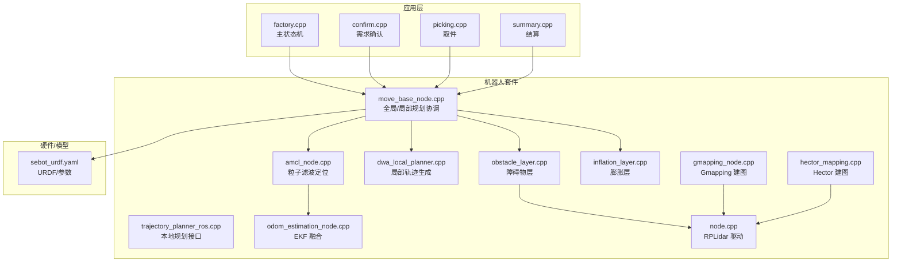
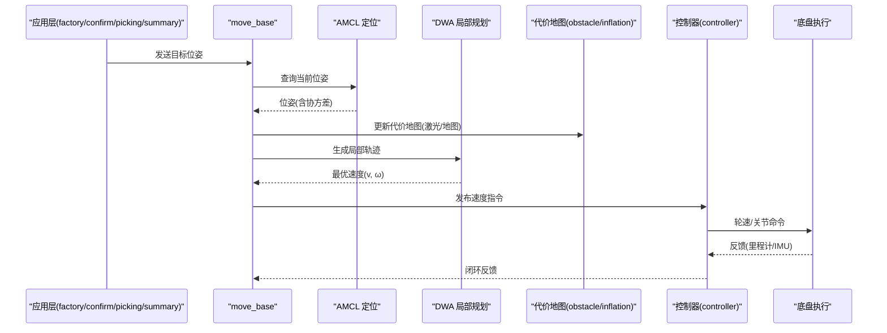
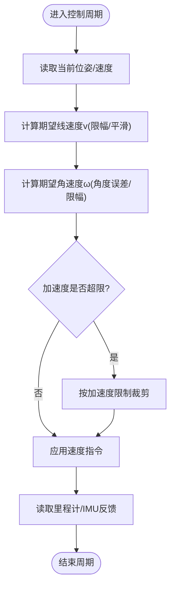
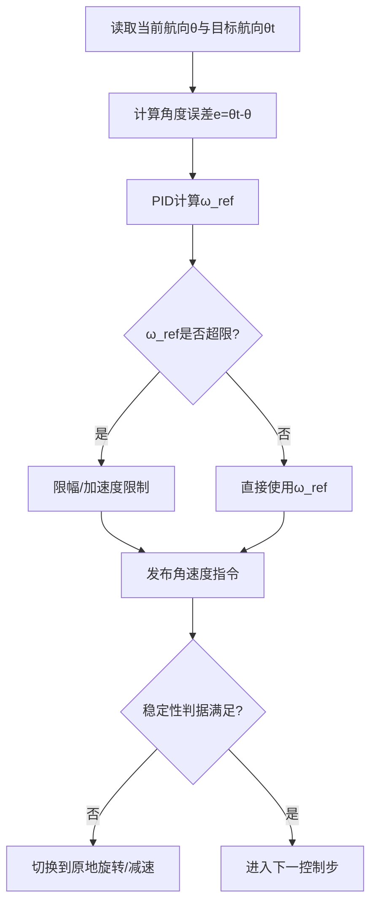
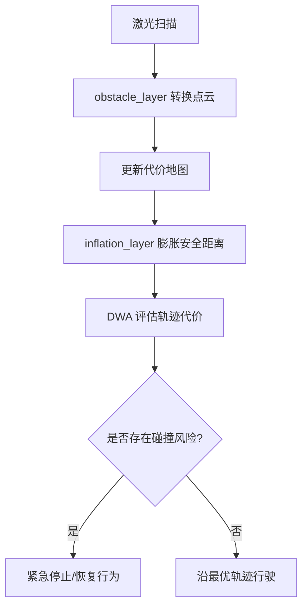
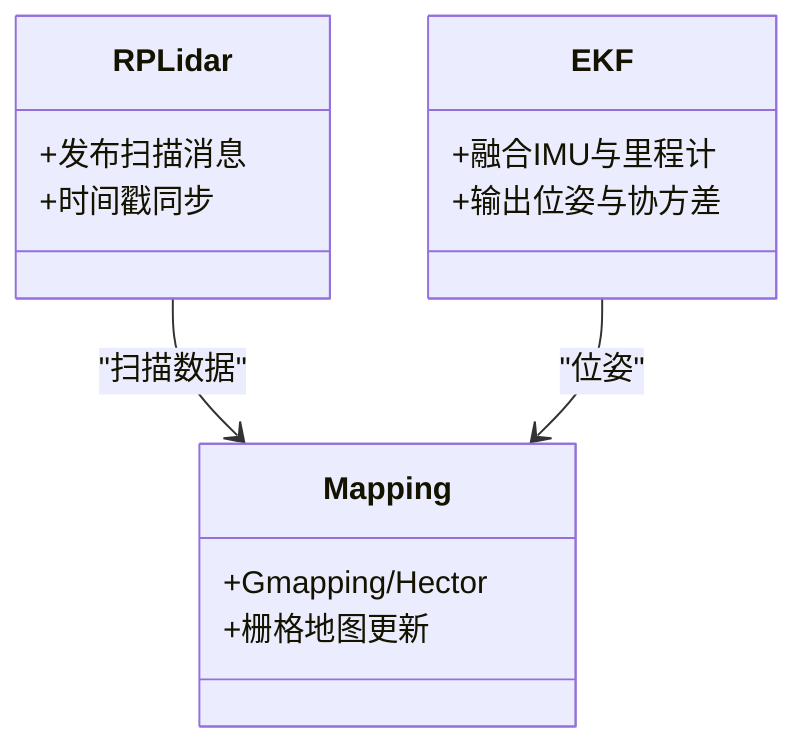
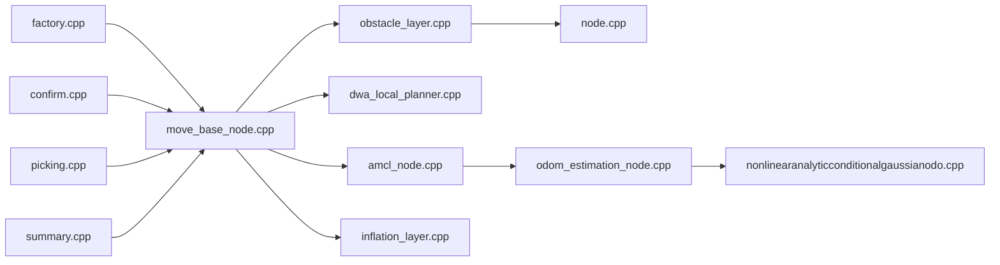

# 运动控制策略

<cite>
**本文引用的文件**   
- [factory.cpp](file://sebot_factory/src/sebot_factory/src/factory.cpp)
- [confirm.cpp](file://sebot_factory/src/sebot_factory/src/confirm.cpp)
- [picking.cpp](file://sebot_factory/src/sebot_factory/src/picking.cpp)
- [summary.cpp](file://sebot_factory/src/sebot_factory/src/summary.cpp)
- [sebot_factory.launch](file://sebot_factory/src/sebot_factory/launch/sebot_factory.launch)
- [controller.cpp](file://sebot_ros_kits/src/sebot_robot/src/controller.cpp)
- [joystick.cpp](file://sebot_ros_kits/src/sebot_robot/src/joystick.cpp)
- [keyboards.cpp](file://sebot_ros_kits/src/sebot_robot/src/keyboards.cpp)
- [transform.cpp](file://sebot_ros_kits/src/sebot_robot/src/transform.cpp)
- [odom_estimation_node.cpp](file://sebot_ros_kits/src/sebot_driver/robot_pose_ekf/src/odom_estimation_node.cpp)
- [nonlinearanalyticconditionalgaussianodo.cpp](file://sebot_ros_kits/src/sebot_driver/robot_pose_ekf/src/nonlinearanalyticconditionalgaussianodo.cpp)
- [node.cpp](file://sebot_ros_kits/src/sebot_driver/rplidar_ros/src/node.cpp)
- [move_base_node.cpp](file://sebot_ros_kits/src/sebot_navigation/move_base/src/move_base_node.cpp)
- [trajectory_planner_ros.cpp](file://sebot_ros_kits/src/sebot_navigation/base_local_planner/src/trajectory_planner_ros.cpp)
- [dwa_local_planner.cpp](file://sebot_ros_kits/src/sebot_navigation/dwa_local_planner/src/dwa_local_planner.cpp)
- [obstacle_layer.cpp](file://sebot_ros_kits/src/sebot_navigation/costmap_2d/plugins/obstacle_layer.cpp)
- [inflation_layer.cpp](file://sebot_ros_kits/src/sebot_navigation/costmap_2d/plugins/inflation_layer.cpp)
- [amcl_node.cpp](file://sebot_ros_kits/src/sebot_navigation/amcl/src/amcl_node.cpp)
- [gmapping_node.cpp](file://sebot_ros_kits/src/sebot_slam/slam_gmapping/slam_gmapping/gmapping_node.cpp)
- [hector_mapping.cpp](file://sebot_ros_kits/src/sebot_slam/hector_slam/hector_mapping/src/hector_mapping.cpp)
- [sebot_urdf.yaml](file://sebot_ros_kits/src/sebot_urdf/config/sebot_urdf.yaml)
</cite>

## 目录
1. [简介](#简介)
2. [项目结构](#项目结构)
3. [核心组件](#核心组件)
4. [架构总览](#架构总览)
5. [详细组件分析](#详细组件分析)
6. [依赖关系分析](#依赖关系分析)
7. [性能与参数整定](#性能与参数整定)
8. [故障诊断与调试](#故障诊断与调试)
9. [结论](#结论)
10. [附录：配置与测试清单](#附录配置与测试清单)

## 简介
本技术文档面向“自动建图的运动控制策略”，围绕速度控制算法（线性速度调节、角速度控制、加速度限制）、转向控制逻辑（角度跟踪、偏差修正、稳定性保证）、避障机制（障碍物检测、距离计算、紧急停止）、多传感器数据融合（激光雷达、里程计、IMU）以及控制参数整定方法（PID、响应特性、稳定性分析）进行系统化说明。同时给出控制流程图、参数影响分析与调试技巧，覆盖从配置到性能测试的全链路。

本项目由三层 catkin 工作空间组成：
- sebot_factory：应用层业务节点（工厂流程状态机、需求确认、取件、结算等）
- sebot_ros_kits：机器人套件（驱动、导航栈、SLAM、语音、视觉等）
- sebot_ros_stdr：仿真环境（STDR 仿真器与配套包）

导航采用 move_base + AMCL + DWA，建图采用 Gmapping/Hector，定位通过 robot_pose_ekf 融合 IMU 与里程计，机械臂使用 MoveIt!（Talon），传感器以 RPLidar 为主。

## 项目结构
- 应用层（sebot_factory）
  - factory.cpp：主状态机（MultiNavi）编排导航、确认、取件、结算等任务
  - confirm.cpp：需求确认交互逻辑
  - picking.cpp：智能取件流程
  - summary.cpp：结算汇总
  - launch/sebot_factory.launch：启动与关键参数集中配置（仿真模式、debug、导航超时、PID、取件距离、补扫等）

- 机器人套件（sebot_ros_kits）
  - sebot_robot：控制器与输入设备（joystick、keyboard）、TF 变换
  - sebot_driver：rplidar_ros（激光雷达）、robot_pose_ekf（EKF 融合）
  - sebot_navigation：move_base、AMCL、DWA、costmap_2d、base_local_planner 等
  - sebot_slam：slam_gmapping、hector_mapping
  - sebot_urdf：机器人 URDF 与参数

- 仿真层（sebot_ros_stdr）
  - stdr_*：仿真器、GUI、导航与资源包

图表来源
- [move_base_node.cpp](file://sebot_ros_kits/src/sebot_navigation/move_base/src/move_base_node.cpp)
- [amcl_node.cpp](file://sebot_ros_kits/src/sebot_navigation/amcl/src/amcl_node.cpp)
- [dwa_local_planner.cpp](file://sebot_ros_kits/src/sebot_navigation/dwa_local_planner/src/dwa_local_planner.cpp)
- [obstacle_layer.cpp](file://sebot_ros_kits/src/sebot_navigation/costmap_2d/plugins/obstacle_layer.cpp)
- [inflation_layer.cpp](file://sebot_ros_kits/src/sebot_navigation/costmap_2d/plugins/inflation_layer.cpp)
- [odom_estimation_node.cpp](file://sebot_ros_kits/src/sebot_driver/robot_pose_ekf/src/odom_estimation_node.cpp)
- [node.cpp](file://sebot_ros_kits/src/sebot_driver/rplidar_ros/src/node.cpp)
- [gmapping_node.cpp](file://sebot_ros_kits/src/sebot_slam/slam_gmapping/slam_gmapping/gmapping_node.cpp)
- [hector_mapping.cpp](file://sebot_ros_kits/src/sebot_slam/hector_slam/hector_mapping/src/hector_mapping.cpp)
- [sebot_urdf.yaml](file://sebot_ros_kits/src/sebot_urdf/config/sebot_urdf.yaml)

章节来源
- [factory.cpp](file://sebot_factory/src/sebot_factory/src/factory.cpp)
- [sebot_factory.launch](file://sebot_factory/src/sebot_factory/launch/sebot_factory.launch)

## 核心组件
- 速度控制与加速度限制
  - 底层速度指令由 sebot_robot 的 controller.cpp 发布，结合输入设备（joystick、keyboard）或上层规划输出
  - 加速度限制在控制器与规划层共同约束，确保平滑加减速
- 转向控制与角度跟踪
  - 局部规划器（DWA）根据目标位姿与当前位姿估计角度误差，生成角速度与线速度组合
  - 角度跟踪通过误差反馈与限幅实现稳定收敛
- 避障机制
  - costmap_2d 的 obstacle_layer 将激光点云转换为代价地图
  - inflation_layer 对障碍物进行膨胀，形成安全边界
  - 紧急停止由 move_base 或 recovery 行为触发
- 多传感器融合
  - robot_pose_ekf 融合 IMU 与里程计，提供稳健位姿
  - rplidar_ros 提供实时扫描；slam_gmapping/hector_mapping 用于建图
- 控制参数整定
  - PID 参数在 sebot_factory.launch 中集中配置，影响响应与稳定性
  - DWA 与 costmap 参数决定避障与轨迹质量

章节来源
- [controller.cpp](file://sebot_ros_kits/src/sebot_robot/src/controller.cpp)
- [joystick.cpp](file://sebot_ros_kits/src/sebot_robot/src/joystick.cpp)
- [keyboards.cpp](file://sebot_ros_kits/src/sebot_robot/src/keyboards.cpp)
- [dwa_local_planner.cpp](file://sebot_ros_kits/src/sebot_navigation/dwa_local_planner/src/dwa_local_planner.cpp)
- [obstacle_layer.cpp](file://sebot_ros_kits/src/sebot_navigation/costmap_2d/plugins/obstacle_layer.cpp)
- [inflation_layer.cpp](file://sebot_ros_kits/src/sebot_navigation/costmap_2d/plugins/inflation_layer.cpp)
- [odom_estimation_node.cpp](file://sebot_ros_kits/src/sebot_driver/robot_pose_ekf/src/odom_estimation_node.cpp)
- [node.cpp](file://sebot_ros_kits/src/sebot_driver/rplidar_ros/src/node.cpp)
- [gmapping_node.cpp](file://sebot_ros_kits/src/sebot_slam/slam_gmapping/slam_gmapping/gmapping_node.cpp)
- [hector_mapping.cpp](file://sebot_ros_kits/src/sebot_slam/hector_slam/hector_mapping/src/hector_mapping.cpp)
- [sebot_factory.launch](file://sebot_factory/src/sebot_factory/launch/sebot_factory.launch)

## 架构总览
整体控制流自上而下：应用层状态机 → move_base 协调 → 局部规划（DWA）→ 代价地图（障碍/膨胀）→ 控制器发布速度指令 → 底盘执行。定位与建图并行运行，为导航提供先验地图与实时位姿。

图表来源
- [move_base_node.cpp](file://sebot_ros_kits/src/sebot_navigation/move_base/src/move_base_node.cpp)
- [amcl_node.cpp](file://sebot_ros_kits/src/sebot_navigation/amcl/src/amcl_node.cpp)
- [dwa_local_planner.cpp](file://sebot_ros_kits/src/sebot_navigation/dwa_local_planner/src/dwa_local_planner.cpp)
- [obstacle_layer.cpp](file://sebot_ros_kits/src/sebot_navigation/costmap_2d/plugins/obstacle_layer.cpp)
- [inflation_layer.cpp](file://sebot_ros_kits/src/sebot_navigation/costmap_2d/plugins/inflation_layer.cpp)
- [controller.cpp](file://sebot_ros_kits/src/sebot_robot/src/controller.cpp)

## 详细组件分析

### 速度控制与加速度限制
- 线性速度调节
  - 上层规划输出期望线速度 v，控制器依据底盘动力学与负载限制进行限幅与平滑
  - 加速度限制通过速度变化率约束实现，避免突变
- 角速度控制
  - 角速度 ω 由角度误差与稳定性判据共同决定，防止过冲与振荡
- 执行与反馈
  - 控制器将 v、ω 转换为轮速或关节指令，读取里程计/IMU 反馈形成闭环

图表来源
- [controller.cpp](file://sebot_ros_kits/src/sebot_robot/src/controller.cpp)
- [joystick.cpp](file://sebot_ros_kits/src/sebot_robot/src/joystick.cpp)
- [keyboards.cpp](file://sebot_ros_kits/src/sebot_robot/src/keyboards.cpp)

章节来源
- [controller.cpp](file://sebot_ros_kits/src/sebot_robot/src/controller.cpp)
- [joystick.cpp](file://sebot_ros_kits/src/sebot_robot/src/joystick.cpp)
- [keyboards.cpp](file://sebot_ros_kits/src/sebot_robot/src/keyboards.cpp)

### 转向控制与角度跟踪
- 角度跟踪
  - 基于当前航向与目标航向的差值计算角度误差，经比例/积分/微分环节得到角速度参考
- 偏差修正
  - 引入前馈补偿与误差阈值，减少稳态误差
- 稳定性保证
  - 角速度限幅与加速度限制抑制超调与振荡；必要时切换至原地旋转模式

图表来源
- [dwa_local_planner.cpp](file://sebot_ros_kits/src/sebot_navigation/dwa_local_planner/src/dwa_local_planner.cpp)
- [trajectory_planner_ros.cpp](file://sebot_ros_kits/src/sebot_navigation/base_local_planner/src/trajectory_planner_ros.cpp)

章节来源
- [dwa_local_planner.cpp](file://sebot_ros_kits/src/sebot_navigation/dwa_local_planner/src/dwa_local_planner.cpp)
- [trajectory_planner_ros.cpp](file://sebot_ros_kits/src/sebot_navigation/base_local_planner/src/trajectory_planner_ros.cpp)

### 避障机制
- 障碍物检测
  - rplidar_ros 订阅激光扫描，obstacle_layer 将点云投影到代价地图
- 距离计算与安全边界
  - inflation_layer 对障碍物进行膨胀，形成安全距离带
- 紧急停止
  - move_base 或 recovery 行为检测到危险时，立即下发零速度指令并触发恢复策略

图表来源
- [node.cpp](file://sebot_ros_kits/src/sebot_driver/rplidar_ros/src/node.cpp)
- [obstacle_layer.cpp](file://sebot_ros_kits/src/sebot_navigation/costmap_2d/plugins/obstacle_layer.cpp)
- [inflation_layer.cpp](file://sebot_ros_kits/src/sebot_navigation/costmap_2d/plugins/inflation_layer.cpp)
- [dwa_local_planner.cpp](file://sebot_ros_kits/src/sebot_navigation/dwa_local_planner/src/dwa_local_planner.cpp)
- [move_base_node.cpp](file://sebot_ros_kits/src/sebot_navigation/move_base/src/move_base_node.cpp)

章节来源
- [node.cpp](file://sebot_ros_kits/src/sebot_driver/rplidar_ros/src/node.cpp)
- [obstacle_layer.cpp](file://sebot_ros_kits/src/sebot_navigation/costmap_2d/plugins/obstacle_layer.cpp)
- [inflation_layer.cpp](file://sebot_ros_kits/src/sebot_navigation/costmap_2d/plugins/inflation_layer.cpp)
- [dwa_local_planner.cpp](file://sebot_ros_kits/src/sebot_navigation/dwa_local_planner/src/dwa_local_planner.cpp)
- [move_base_node.cpp](file://sebot_ros_kits/src/sebot_navigation/move_base/src/move_base_node.cpp)

### 多传感器数据融合
- 激光雷达
  - rplidar_ros 提供实时扫描，供避障与建图使用
- 里程计与 IMU
  - robot_pose_ekf 融合两者，输出更稳定的位姿与协方差
- 建图
  - slam_gmapping 或 hector_mapping 利用激光与位姿构建栅格地图

图表来源
- [node.cpp](file://sebot_ros_kits/src/sebot_driver/rplidar_ros/src/node.cpp)
- [odom_estimation_node.cpp](file://sebot_ros_kits/src/sebot_driver/robot_pose_ekf/src/odom_estimation_node.cpp)
- [nonlinearanalyticconditionalgaussianodo.cpp](file://sebot_ros_kits/src/sebot_driver/robot_pose_ekf/src/nonlinearanalyticconditionalgaussianodo.cpp)
- [gmapping_node.cpp](file://sebot_ros_kits/src/sebot_slam/slam_gmapping/slam_gmapping/gmapping_node.cpp)
- [hector_mapping.cpp](file://sebot_ros_kits/src/sebot_slam/hector_slam/hector_mapping/src/hector_mapping.cpp)

章节来源
- [node.cpp](file://sebot_ros_kits/src/sebot_driver/rplidar_ros/src/node.cpp)
- [odom_estimation_node.cpp](file://sebot_ros_kits/src/sebot_driver/robot_pose_ekf/src/odom_estimation_node.cpp)
- [nonlinearanalyticconditionalgaussianodo.cpp](file://sebot_ros_kits/src/sebot_driver/robot_pose_ekf/src/nonlinearanalyticconditionalgaussianodo.cpp)
- [gmapping_node.cpp](file://sebot_ros_kits/src/sebot_slam/slam_gmapping/slam_gmapping/gmapping_node.cpp)
- [hector_mapping.cpp](file://sebot_ros_kits/src/sebot_slam/hector_slam/hector_mapping/src/hector_mapping.cpp)

### 控制参数整定
- PID 参数调整
  - 在 sebot_factory.launch 中集中配置，影响响应速度与稳定性
  - 建议先调比例项，再引入积分与微分，逐步降低超调与振荡
- 响应特性与稳定性分析
  - 观察阶跃响应曲线，评估上升时间、峰值时间与稳态误差
  - 通过频域分析（相位裕度、增益裕度）验证稳定性
- 其他关键参数
  - DWA 采样步长、最大速度、加速度上限
  - costmap 膨胀半径、观测衰减率
  - 导航超时与恢复策略阈值

章节来源
- [sebot_factory.launch](file://sebot_factory/src/sebot_factory/launch/sebot_factory.launch)
- [dwa_local_planner.cpp](file://sebot_ros_kits/src/sebot_navigation/dwa_local_planner/src/dwa_local_planner.cpp)
- [obstacle_layer.cpp](file://sebot_ros_kits/src/sebot_navigation/costmap_2d/plugins/obstacle_layer.cpp)
- [inflation_layer.cpp](file://sebot_ros_kits/src/sebot_navigation/costmap_2d/plugins/inflation_layer.cpp)

## 依赖关系分析
- 应用层依赖 move_base 完成导航任务编排
- move_base 依赖 AMCL 定位、DWA 局部规划、costmap_2d 代价地图
- costmap_2d 依赖 obstacle_layer 与 inflation_layer
- 建图依赖 rplidar_ros 与 EKF 位姿
- 控制器依赖输入设备与 TF 变换

图表来源
- [factory.cpp](file://sebot_factory/src/sebot_factory/src/factory.cpp)
- [confirm.cpp](file://sebot_factory/src/sebot_factory/src/confirm.cpp)
- [picking.cpp](file://sebot_factory/src/sebot_factory/src/picking.cpp)
- [summary.cpp](file://sebot_factory/src/sebot_factory/src/summary.cpp)
- [move_base_node.cpp](file://sebot_ros_kits/src/sebot_navigation/move_base/src/move_base_node.cpp)
- [amcl_node.cpp](file://sebot_ros_kits/src/sebot_navigation/amcl/src/amcl_node.cpp)
- [dwa_local_planner.cpp](file://sebot_ros_kits/src/sebot_navigation/dwa_local_planner/src/dwa_local_planner.cpp)
- [obstacle_layer.cpp](file://sebot_ros_kits/src/sebot_navigation/costmap_2d/plugins/obstacle_layer.cpp)
- [inflation_layer.cpp](file://sebot_ros_kits/src/sebot_navigation/costmap_2d/plugins/inflation_layer.cpp)
- [node.cpp](file://sebot_ros_kits/src/sebot_driver/rplidar_ros/src/node.cpp)
- [odom_estimation_node.cpp](file://sebot_ros_kits/src/sebot_driver/robot_pose_ekf/src/odom_estimation_node.cpp)
- [nonlinearanalyticconditionalgaussianodo.cpp](file://sebot_ros_kits/src/sebot_driver/robot_pose_ekf/src/nonlinearanalyticconditionalgaussianodo.cpp)

章节来源
- [factory.cpp](file://sebot_factory/src/sebot_factory/src/factory.cpp)
- [confirm.cpp](file://sebot_factory/src/sebot_factory/src/confirm.cpp)
- [picking.cpp](file://sebot_factory/src/sebot_factory/src/picking.cpp)
- [summary.cpp](file://sebot_factory/src/sebot_factory/src/summary.cpp)
- [move_base_node.cpp](file://sebot_ros_kits/src/sebot_navigation/move_base/src/move_base_node.cpp)
- [amcl_node.cpp](file://sebot_ros_kits/src/sebot_navigation/amcl/src/amcl_node.cpp)
- [dwa_local_planner.cpp](file://sebot_ros_kits/src/sebot_navigation/dwa_local_planner/src/dwa_local_planner.cpp)
- [obstacle_layer.cpp](file://sebot_ros_kits/src/sebot_navigation/costmap_2d/plugins/obstacle_layer.cpp)
- [inflation_layer.cpp](file://sebot_ros_kits/src/sebot_navigation/costmap_2d/plugins/inflation_layer.cpp)
- [node.cpp](file://sebot_ros_kits/src/sebot_driver/rplidar_ros/src/node.cpp)
- [odom_estimation_node.cpp](file://sebot_ros_kits/src/sebot_driver/robot_pose_ekf/src/odom_estimation_node.cpp)
- [nonlinearanalyticconditionalgaussianodo.cpp](file://sebot_ros_kits/src/sebot_driver/robot_pose_ekf/src/nonlinearanalyticconditionalgaussianodo.cpp)

## 性能与参数整定
- 速度控制性能
  - 提升响应速度需增大比例增益，但可能引起超调；加入微分项可抑制振荡
  - 加速度限制应随负载与环境动态调整，避免打滑与抖动
- 转向控制稳定性
  - 角度误差阈值与角速度限幅是关键；过大阈值导致跟踪慢，过小导致频繁修正
- 避障与代价地图
  - 膨胀半径需大于机器人安全半径；观测衰减率影响地图更新频率与精度
- 定位与建图
  - EKF 噪声参数影响位姿协方差；Gmapping/Hector 的参数需匹配环境特征与激光分辨率

章节来源
- [sebot_factory.launch](file://sebot_factory/src/sebot_factory/launch/sebot_factory.launch)
- [dwa_local_planner.cpp](file://sebot_ros_kits/src/sebot_navigation/dwa_local_planner/src/dwa_local_planner.cpp)
- [obstacle_layer.cpp](file://sebot_ros_kits/src/sebot_navigation/costmap_2d/plugins/obstacle_layer.cpp)
- [inflation_layer.cpp](file://sebot_ros_kits/src/sebot_navigation/costmap_2d/plugins/inflation_layer.cpp)
- [odom_estimation_node.cpp](file://sebot_ros_kits/src/sebot_driver/robot_pose_ekf/src/odom_estimation_node.cpp)
- [gmapping_node.cpp](file://sebot_ros_kits/src/sebot_slam/slam_gmapping/slam_gmapping/gmapping_node.cpp)
- [hector_mapping.cpp](file://sebot_ros_kits/src/sebot_slam/hector_slam/hector_mapping/src/hector_mapping.cpp)

## 故障诊断与调试
- 常见问题
  - 定位漂移：检查 EKF 噪声与激光数据质量；必要时重置初始位姿
  - 避障失效：确认 obstacle_layer 订阅正确、点云时间戳同步；调整膨胀半径
  - 振荡与超调：降低比例增益，增加微分或加速度限制
  - 导航超时：检查目标可达性与地图有效性
- 调试技巧
  - 使用 rviz 可视化代价地图、轨迹与位姿协方差
  - 记录关键话题（scan、odom、tf、cmd_vel）进行离线分析
  - 在仿真环境中快速迭代参数，再迁移到真机

章节来源
- [move_base_node.cpp](file://sebot_ros_kits/src/sebot_navigation/move_base/src/move_base_node.cpp)
- [amcl_node.cpp](file://sebot_ros_kits/src/sebot_navigation/amcl/src/amcl_node.cpp)
- [dwa_local_planner.cpp](file://sebot_ros_kits/src/sebot_navigation/dwa_local_planner/src/dwa_local_planner.cpp)
- [obstacle_layer.cpp](file://sebot_ros_kits/src/sebot_navigation/costmap_2d/plugins/obstacle_layer.cpp)
- [inflation_layer.cpp](file://sebot_ros_kits/src/sebot_navigation/costmap_2d/plugins/inflation_layer.cpp)
- [odom_estimation_node.cpp](file://sebot_ros_kits/src/sebot_driver/robot_pose_ekf/src/odom_estimation_node.cpp)
- [node.cpp](file://sebot_ros_kits/src/sebot_driver/rplidar_ros/src/node.cpp)

## 结论
本方案以 move_base + AMCL + DWA 为核心，结合 costmap_2d 的障碍与膨胀层实现可靠避障，通过 robot_pose_ekf 融合 IMU 与里程计提升定位稳定性，并以 sebot_factory 的状态机编排业务全流程。参数整定遵循“先稳后快”的原则，结合仿真与真机迭代优化。通过系统化的调试方法与可视化手段，可有效提升控制性能与鲁棒性。

## 附录：配置与测试清单
- 关键配置文件
  - sebot_factory.launch：仿真模式、debug、导航超时、PID、取件距离、补扫等
  - sebot_urdf.yaml：机器人几何与惯性参数
- 测试场景
  - 直线加速/减速：验证加速度限制与速度平滑
  - 角度跟踪：验证转向控制与稳定性
  - 动态避障：验证 obstacle_layer 与 inflation_layer 参数
  - 定位与建图：验证 EKF 与 Gmapping/Hector 参数
- 指标采集
  - 响应时间、超调量、稳态误差
  - 避障成功率、轨迹平滑度
  - 定位误差与建图一致性

章节来源
- [sebot_factory.launch](file://sebot_factory/src/sebot_factory/launch/sebot_factory.launch)
- [sebot_urdf.yaml](file://sebot_ros_kits/src/sebot_urdf/config/sebot_urdf.yaml)
- [gmapping_node.cpp](file://sebot_ros_kits/src/sebot_slam/slam_gmapping/slam_gmapping/gmapping_node.cpp)
- [hector_mapping.cpp](file://sebot_ros_kits/src/sebot_slam/hector_slam/hector_mapping/src/hector_mapping.cpp)
- [odom_estimation_node.cpp](file://sebot_ros_kits/src/sebot_driver/robot_pose_ekf/src/odom_estimation_node.cpp)