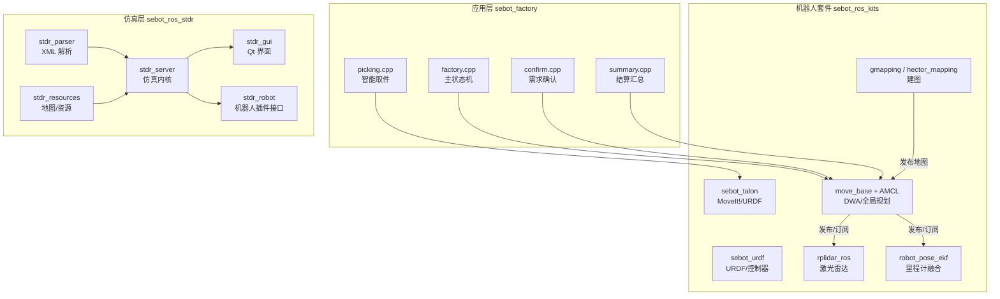
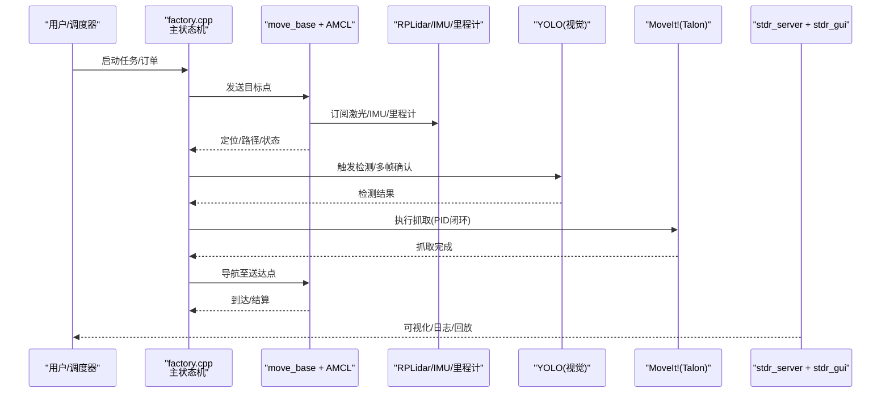
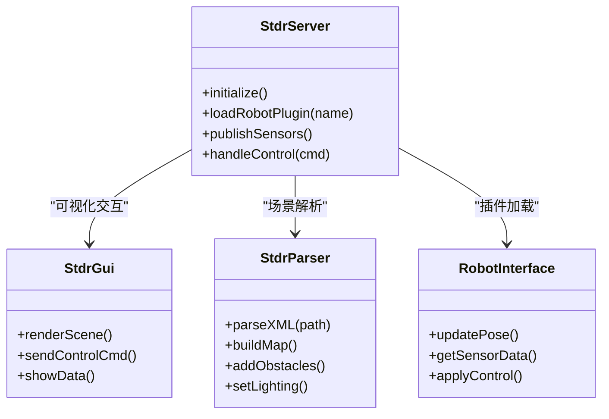
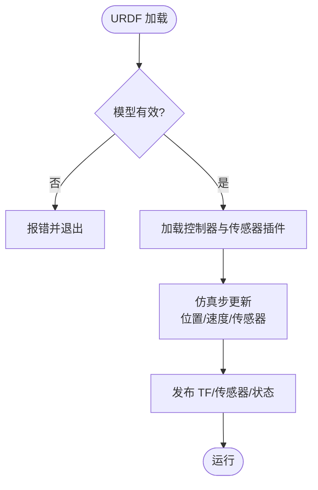
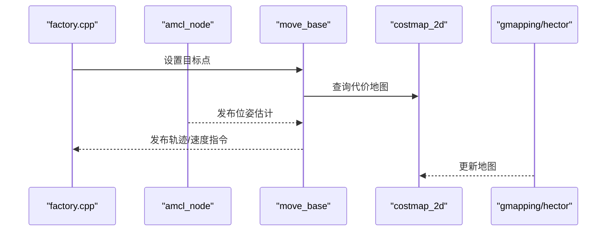
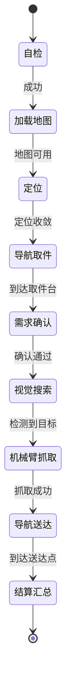
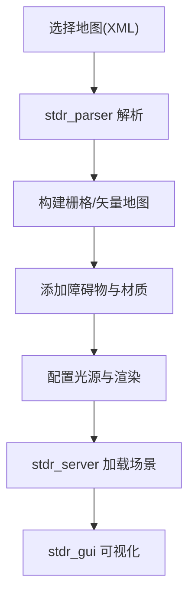
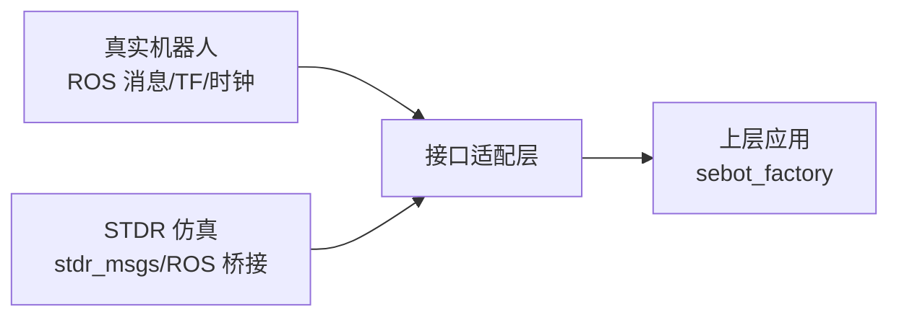
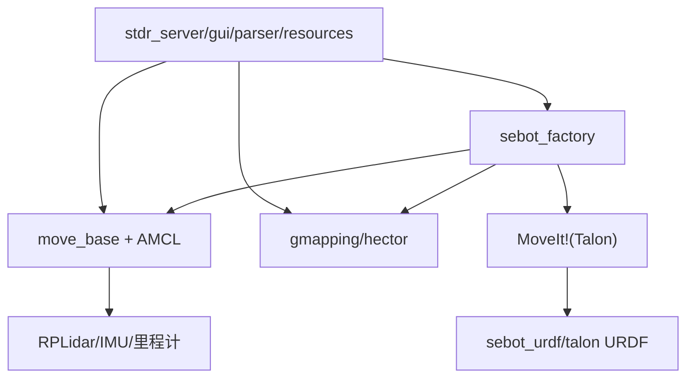

# 仿真系统

<cite>
**本文引用的文件**   
- [sebot_factory.launch](file://sebot_factory/src/sebot_factory/launch/sebot_factory.launch)
- [factory.cpp](file://sebot_factory/src/sebot_factory/src/factory.cpp)
- [confirm.cpp](file://sebot_factory/src/sebot_factory/src/confirm.cpp)
- [picking.cpp](file://sebot_factory/src/sebot_factory/src/picking.cpp)
- [summary.cpp](file://sebot_factory/src/sebot_factory/src/summary.cpp)
- [test_arm.cpp](file://sebot_factory/src/sebot_factory/unit/test_arm.cpp)
- [model_check.cpp](file://sebot_factory/src/sebot_factory/unit/model_check.cpp)
- [order.cpp](file://sebot_factory/src/sebot_factory/unit/order.cpp)
- [pick.cpp](file://sebot_factory/src/sebot_factory/unit/pick.cpp)
- [pay.cpp](file://sebot_factory/src/sebot_factory/unit/pay.cpp)
- [yolo.cpp](file://sebot_factory/src/sebot_factory/unit/yolo.cpp)
- [qnode.hpp](file://sebot_factory/src/sebot_marking/include/qnode.hpp)
- [CCtrlDashBoard.h](file://sebot_factory/src/sebot_marking/include/CCtrlDashBoard.h)
- [slam.h](file://sebot_factory/src/sebot_marking/include/slam.h)
- [sebot_urdf.urdf](file://sebot_ros_kits/src/sebot_driver/sebot_urdf/urdf/sebot_urdf.urdf)
- [sebot_talon.urdf](file://sebot_ros_kits/src/sebot_driver/sebot_talon/urdf/sebot_talon.urdf)
- [sebot_urdf.yaml](file://sebot_ros_kits/src/sebot_driver/sebot_urdf/config/sebot_urdf.yaml)
- [sebot_urdf.launch](file://sebot_ros_kits/src/sebot_driver/sebot_urdf/launch/sebot_urdf.launch)
- [talon_simulation.py](file://sebot_ros_kits/src/sebot_driver/sebot_talon/scripts/talon_simulation.py)
- [move_group.launch](file://sebot_ros_kits/src/sebot_driver/sebot_talon_moveit/launch/move_group.launch)
- [gazebo.launch](file://sebot_ros_kits/src/sebot_driver/sebot_talon_moveit/launch/gazebo.launch)
- [amcl_node.cpp](file://sebot_ros_kits/src/sebot_navigation/amcl/src/amcl_node.cpp)
- [move_base 主循环入口](file://sebot_ros_kits/src/sebot_navigation/move_base/src/move_base.cpp)
- [gmapping 节点](file://sebot_ros_kits/src/sebot_slam/slam_gmapping/slam_gmapping/slam_gmapping_node.cpp)
- [hector_mapping 节点](file://sebot_ros_kits/src/sebot_slam/slam_hector/hector_mapping/src/hector_mapping.cpp)
- [stdr_server 主程序](file://sebot_ros_stdr/src/sebot_stdr/stdr_server/src/main.cpp)
- [stdr_gui 主界面](file://sebot_ros_stdr/src/sebot_stdr/stdr_gui/src/stdr_gui/main.cpp)
- [stdr_msgs 消息定义](file://sebot_ros_stdr/src/sebot_stdr/stdr_msgs/msg/RobotState.msg)
- [stdr_robot 机器人插件接口](file://sebot_ros_stdr/src/sebot_stdr/stdr_robot/include/stdr_robot/robot_interface.h)
- [stdr_parser 解析器](file://sebot_ros_stdr/src/sebot_stdr/stdr_parser/src/parser.cpp)
- [stdr_resources 地图与资源](file://sebot_ros_stdr/src/sebot_stdr/stdr_resources/maps/map1.xml)
- [stdr_launchers 启动脚本](file://sebot_ros_stdr/src/sebot_stdr/stdr_launchers/launch/stdr.launch)
</cite>

## 目录
1. [简介](#简介)
2. [项目结构](#项目结构)
3. [核心组件](#核心组件)
4. [架构总览](#架构总览)
5. [详细组件分析](#详细组件分析)
6. [依赖关系分析](#依赖关系分析)
7. [性能考虑](#性能考虑)
8. [故障排查指南](#故障排查指南)
9. [结论](#结论)
10. [附录](#附录)

## 简介
本仓库由三个相互独立的 catkin 工作空间组成：应用层 sebot_factory、机器人套件 sebot_ros_kits、仿真层 sebot_ros_stdr。文档围绕 STDR 仿真器的架构与功能，说明服务器端、机器人模型与 GUI 的集成；阐述仿真机器人的配置（运动学模型、传感器模拟、环境设置）；描述仿真环境的搭建（地图导入、障碍物配置、光照效果）；解释与真实系统的兼容性（消息接口、坐标系统、时间同步）；给出仿真测试方法（单元、集成、性能）；并提供场景示例、配置模板与调试技巧，以及仿真与实机差异和迁移指南。

## 项目结构
- sebot_factory（应用层）
  - 业务节点：factory.cpp（主状态机）、confirm.cpp（需求确认）、picking.cpp（智能取件）、summary.cpp（结算汇总）
  - 单元测试：unit/ 下 test_arm.cpp、model_check.cpp、order.cpp、pick.cpp、pay.cpp、yolo.cpp
  - 启动配置：launch/sebot_factory.launch（simulation 参数切换 STDR 模式、debug 控制图像识别界面等）
- sebot_ros_kits（机器人套件）
  - 驱动与模型：sebot_urdf（URDF 模型与控制器）、sebot_talon（机械臂 URDF 与 MoveIt! 配置）、rplidar_ros（激光雷达驱动）、robot_pose_ekf（里程计融合）
  - 导航与 SLAM：amcl、move_base、base_local_planner、costmap_2d、gmapping、hector_mapping
  - 语音与视觉：sebot_speech、sebot_visions
- sebot_ros_stdr（仿真层）
  - 仿真内核：stdr_server（物理与传感器仿真）、stdr_gui（Qt 可视化与控制）、stdr_parser（XML 场景解析）、stdr_robot（机器人插件接口）
  - 导航适配：stdr_amcl、stdr_navigation、stdr_move_base
  - 资源与启动：stdr_resources（地图与资源）、stdr_launchers（一键启动）

**图示来源** 
- [sebot_factory.launch](file://sebot_factory/src/sebot_factory/launch/sebot_factory.launch)
- [factory.cpp](file://sebot_factory/src/sebot_factory/src/factory.cpp)
- [stdr_server 主程序](file://sebot_ros_stdr/src/sebot_stdr/stdr_server/src/main.cpp)
- [stdr_gui 主界面](file://sebot_ros_stdr/src/sebot_stdr/stdr_gui/src/stdr_gui/main.cpp)
- [stdr_parser 解析器](file://sebot_ros_stdr/src/sebot_stdr/stdr_parser/src/parser.cpp)
- [stdr_resources 地图与资源](file://sebot_ros_stdr/src/sebot_stdr/stdr_resources/maps/map1.xml)

**章节来源**
- [sebot_factory.launch](file://sebot_factory/src/sebot_factory/launch/sebot_factory.launch)

## 核心组件
- STDR 仿真服务器（stdr_server）
  - 负责物理引擎、传感器仿真、时间同步与 ROS 桥接
  - 通过 stdr_robot 插件接口加载不同机器人模型
  - 与 stdr_gui 交互提供可视化与控制
- 机器人模型与控制器
  - sebot_urdf 定义差速底盘、传感器安装位与控制器
  - sebot_talon 定义机械臂 URDF 与 MoveIt! 配置，支持仿真与真机一致的消息接口
- 导航与定位
  - AMCL 粒子滤波定位，move_base 全局/局部规划，DWA 局部避障
  - Gmapping/Hector 建图，输出标准 map 服务
- GUI 与标注工具
  - stdr_gui 提供场景编辑、机器人控制与数据回放
  - sebot_marking Qt 上位机用于建图标注与主题管理

**章节来源**
- [stdr_server 主程序](file://sebot_ros_stdr/src/sebot_stdr/stdr_server/src/main.cpp)
- [stdr_gui 主界面](file://sebot_ros_stdr/src/sebot_stdr/stdr_gui/src/stdr_gui/main.cpp)
- [stdr_robot 机器人插件接口](file://sebot_ros_stdr/src/sebot_stdr/stdr_robot/include/stdr_robot/robot_interface.h)
- [sebot_urdf.urdf](file://sebot_ros_kits/src/sebot_driver/sebot_urdf/urdf/sebot_urdf.urdf)
- [sebot_talon.urdf](file://sebot_ros_kits/src/sebot_driver/sebot_talon/urdf/sebot_talon.urdf)
- [amcl_node.cpp](file://sebot_ros_kits/src/sebot_navigation/amcl/src/amcl_node.cpp)
- [move_base 主循环入口](file://sebot_ros_kits/src/sebot_navigation/move_base/src/move_base.cpp)
- [gmapping 节点](file://sebot_ros_kits/src/sebot_slam/slam_gmapping/slam_gmapping/slam_gmapping_node.cpp)
- [hector_mapping 节点](file://sebot_ros_kits/src/sebot_slam/slam_hector/hector_mapping/src/hector_mapping.cpp)

## 架构总览
STDR 仿真器以 stdr_server 为核心，结合 stdr_gui 提供可视化与交互；stdr_parser 解析 XML 场景（地图、障碍物、光照），stdr_robot 插件化加载机器人模型；上层 sebot_factory 通过 ROS 消息与 move_base/AMCL/Gmapping 等导航与 SLAM 模块交互，实现从“上电自检 → 加载地图与定位 → 导航取件 → 视觉确认 → 机械臂抓取 → 送达结算”的全链路流程。

**图示来源** 
- [factory.cpp](file://sebot_factory/src/sebot_factory/src/factory.cpp)
- [amcl_node.cpp](file://sebot_ros_kits/src/sebot_navigation/amcl/src/amcl_node.cpp)
- [move_base 主循环入口](file://sebot_ros_kits/src/sebot_navigation/move_base/src/move_base.cpp)
- [stdr_server 主程序](file://sebot_ros_stdr/src/sebot_stdr/stdr_server/src/main.cpp)
- [stdr_gui 主界面](file://sebot_ros_stdr/src/sebot_stdr/stdr_gui/src/stdr_gui/main.cpp)

## 详细组件分析

### STDR 仿真服务器与 GUI 集成
- stdr_server
  - 初始化仿真时钟、物理引擎、传感器模型
  - 注册 ROS 话题与服务，暴露机器人状态、传感器数据与控制接口
  - 通过 stdr_robot 插件加载机器人模型，统一消息格式
- stdr_gui
  - Qt 界面提供场景编辑、机器人控制、数据回放与调试面板
  - 与 stdr_server 通过内部通信或 ROS 桥接进行交互
- stdr_parser
  - 解析 XML 场景文件，生成地图、障碍物、光源与材质
- stdr_resources
  - 预置地图与资源，便于快速搭建仿真环境

**图示来源** 
- [stdr_server 主程序](file://sebot_ros_stdr/src/sebot_stdr/stdr_server/src/main.cpp)
- [stdr_gui 主界面](file://sebot_ros_stdr/src/sebot_stdr/stdr_gui/src/stdr_gui/main.cpp)
- [stdr_parser 解析器](file://sebot_ros_stdr/src/sebot_stdr/stdr_parser/src/parser.cpp)
- [stdr_robot 机器人插件接口](file://sebot_ros_stdr/src/sebot_stdr/stdr_robot/include/stdr_robot/robot_interface.h)

**章节来源**
- [stdr_server 主程序](file://sebot_ros_stdr/src/sebot_stdr/stdr_server/src/main.cpp)
- [stdr_gui 主界面](file://sebot_ros_stdr/src/sebot_stdr/stdr_gui/src/stdr_gui/main.cpp)
- [stdr_parser 解析器](file://sebot_ros_stdr/src/sebot_stdr/stdr_parser/src/parser.cpp)
- [stdr_robot 机器人插件接口](file://sebot_ros_stdr/src/sebot_stdr/stdr_robot/include/stdr_robot/robot_interface.h)

### 机器人模型与传感器配置
- sebot_urdf
  - 定义差速底盘、轮子、传感器安装位与控制器参数
  - 与 robot_pose_ekf 配合进行里程计融合
- sebot_talon
  - 机械臂 URDF 与 MoveIt! 配置文件，支持仿真与真机一致的关节/末端消息
  - talon_simulation.py 提供仿真脚本，简化调试
- 传感器模拟
  - RPLidar 在 STDR 中通过插件模拟激光扫描
  - IMU/里程计通过 stdr_robot 插件输出噪声与延迟

**图示来源** 
- [sebot_urdf.urdf](file://sebot_ros_kits/src/sebot_driver/sebot_urdf/urdf/sebot_urdf.urdf)
- [sebot_talon.urdf](file://sebot_ros_kits/src/sebot_driver/sebot_talon/urdf/sebot_talon.urdf)
- [talon_simulation.py](file://sebot_ros_kits/src/sebot_driver/sebot_talon/scripts/talon_simulation.py)

**章节来源**
- [sebot_urdf.urdf](file://sebot_ros_kits/src/sebot_driver/sebot_urdf/urdf/sebot_urdf.urdf)
- [sebot_talon.urdf](file://sebot_ros_kits/src/sebot_driver/sebot_talon/urdf/sebot_talon.urdf)
- [talon_simulation.py](file://sebot_ros_kits/src/sebot_driver/sebot_talon/scripts/talon_simulation.py)

### 导航与 SLAM 集成
- AMCL
  - 基于粒子滤波的定位，订阅激光与 TF，发布位姿估计
- move_base
  - 全局规划（navfn/global_planner）+ 局部规划（DWA/base_local_planner）
  - 与 costmap_2d 协作处理静态/动态障碍
- Gmapping/Hector
  - Gmapping 使用激光构建栅格地图
  - Hector 适用于无里程计场景

**图示来源** 
- [amcl_node.cpp](file://sebot_ros_kits/src/sebot_navigation/amcl/src/amcl_node.cpp)
- [move_base 主循环入口](file://sebot_ros_kits/src/sebot_navigation/move_base/src/move_base.cpp)
- [gmapping 节点](file://sebot_ros_kits/src/sebot_slam/slam_gmapping/slam_gmapping/slam_gmapping_node.cpp)
- [hector_mapping 节点](file://sebot_ros_kits/src/sebot_slam/slam_hector/hector_mapping/src/hector_mapping.cpp)

**章节来源**
- [amcl_node.cpp](file://sebot_ros_kits/src/sebot_navigation/amcl/src/amcl_node.cpp)
- [move_base 主循环入口](file://sebot_ros_kits/src/sebot_navigation/move_base/src/move_base.cpp)
- [gmapping 节点](file://sebot_ros_kits/src/sebot_slam/slam_gmapping/slam_gmapping/slam_gmapping_node.cpp)
- [hector_mapping 节点](file://sebot_ros_kits/src/sebot_slam/slam_hector/hector_mapping/src/hector_mapping.cpp)

### 业务状态机与仿真联动
- factory.cpp
  - 实现主状态机：自检 → 加载地图/定位 → 导航取件 → 需求确认 → 视觉搜索 → 机械臂抓取 → 送达结算
  - 通过 ROS 话题与 move_base/AMCL/YOLO/MoveIt 交互
- confirm/picking/summary
  - 分别处理需求确认、智能取件逻辑与结算汇总
- 单元测试
  - unit/ 下各测试覆盖机械臂、模型检查、订单、取件、支付、YOLO 等关键路径

**图示来源** 
- [factory.cpp](file://sebot_factory/src/sebot_factory/src/factory.cpp)
- [confirm.cpp](file://sebot_factory/src/sebot_factory/src/confirm.cpp)
- [picking.cpp](file://sebot_factory/src/sebot_factory/src/picking.cpp)
- [summary.cpp](file://sebot_factory/src/sebot_factory/src/summary.cpp)

**章节来源**
- [factory.cpp](file://sebot_factory/src/sebot_factory/src/factory.cpp)
- [confirm.cpp](file://sebot_factory/src/sebot_factory/src/confirm.cpp)
- [picking.cpp](file://sebot_factory/src/sebot_factory/src/picking.cpp)
- [summary.cpp](file://sebot_factory/src/sebot_factory/src/summary.cpp)

### 仿真环境搭建（地图、障碍物、光照）
- 地图导入
  - 使用 stdr_resources 中的 XML 地图，或通过 stdr_parser 解析自定义地图
- 障碍物配置
  - 在 XML 中声明障碍物类型、尺寸、材质与碰撞属性
- 光照效果
  - 在 XML 中配置光源强度、颜色与阴影开关，提升可视化效果

**图示来源** 
- [stdr_parser 解析器](file://sebot_ros_stdr/src/sebot_stdr/stdr_parser/src/parser.cpp)
- [stdr_resources 地图与资源](file://sebot_ros_stdr/src/sebot_stdr/stdr_resources/maps/map1.xml)
- [stdr_server 主程序](file://sebot_ros_stdr/src/sebot_stdr/stdr_server/src/main.cpp)
- [stdr_gui 主界面](file://sebot_ros_stdr/src/sebot_stdr/stdr_gui/src/stdr_gui/main.cpp)

**章节来源**
- [stdr_parser 解析器](file://sebot_ros_stdr/src/sebot_stdr/stdr_parser/src/parser.cpp)
- [stdr_resources 地图与资源](file://sebot_ros_stdr/src/sebot_stdr/stdr_resources/maps/map1.xml)

### 与真实系统的兼容性
- 消息接口
  - 使用标准 ROS 消息（如 sensor_msgs/LaserScan、nav_msgs/Odometry、geometry_msgs/Twist）
  - stdr_msgs 定义仿真专用消息（如 RobotState）
- 坐标系统
  - 遵循 ROS TF 坐标系约定（odom → base_link → 传感器）
- 时间同步
  - stdr_server 提供仿真时钟，确保传感器与控制器时序一致

**图示来源** 
- [stdr_msgs 消息定义](file://sebot_ros_stdr/src/sebot_stdr/stdr_msgs/msg/RobotState.msg)
- [stdr_server 主程序](file://sebot_ros_stdr/src/sebot_stdr/stdr_server/src/main.cpp)

**章节来源**
- [stdr_msgs 消息定义](file://sebot_ros_stdr/src/sebot_stdr/stdr_msgs/msg/RobotState.msg)
- [stdr_server 主程序](file://sebot_ros_stdr/src/sebot_stdr/stdr_server/src/main.cpp)

### 仿真测试方法
- 单元测试
  - unit/ 下包含 test_arm.cpp、model_check.cpp、order.cpp、pick.cpp、pay.cpp、yolo.cpp 等，覆盖机械臂、模型、订单、取件、支付、视觉等
- 集成测试
  - 通过 launch 文件组合多个节点，验证端到端流程（如 sebot_factory.launch 的 simulation 模式）
- 性能测试
  - 使用 rosbag 录制与回放，评估 CPU/内存占用与实时性
  - 调整仿真步长、传感器噪声与规划频率，观察稳定性与效率

**章节来源**
- [test_arm.cpp](file://sebot_factory/src/sebot_factory/unit/test_arm.cpp)
- [model_check.cpp](file://sebot_factory/src/sebot_factory/unit/model_check.cpp)
- [order.cpp](file://sebot_factory/src/sebot_factory/unit/order.cpp)
- [pick.cpp](file://sebot_factory/src/sebot_factory/unit/pick.cpp)
- [pay.cpp](file://sebot_factory/src/sebot_factory/unit/pay.cpp)
- [yolo.cpp](file://sebot_factory/src/sebot_factory/unit/yolo.cpp)
- [sebot_factory.launch](file://sebot_factory/src/sebot_factory/launch/sebot_factory.launch)

## 依赖关系分析
- 应用层依赖导航与 SLAM 模块，通过 ROS 消息与 STDR 仿真器交互
- 机器人套件提供 URDF、控制器与传感器驱动，与 STDR 插件接口对齐
- STDR 层通过解析器与资源库加载场景，GUI 提供可视化

**图示来源** 
- [factory.cpp](file://sebot_factory/src/sebot_factory/src/factory.cpp)
- [amcl_node.cpp](file://sebot_ros_kits/src/sebot_navigation/amcl/src/amcl_node.cpp)
- [move_base 主循环入口](file://sebot_ros_kits/src/sebot_navigation/move_base/src/move_base.cpp)
- [gmapping 节点](file://sebot_ros_kits/src/sebot_slam/slam_gmapping/slam_gmapping/slam_gmapping_node.cpp)
- [hector_mapping 节点](file://sebot_ros_kits/src/sebot_slam/slam_hector/hector_mapping/src/hector_mapping.cpp)
- [stdr_server 主程序](file://sebot_ros_stdr/src/sebot_stdr/stdr_server/src/main.cpp)
- [stdr_gui 主界面](file://sebot_ros_stdr/src/sebot_stdr/stdr_gui/src/stdr_gui/main.cpp)
- [stdr_parser 解析器](file://sebot_ros_stdr/src/sebot_stdr/stdr_parser/src/parser.cpp)
- [stdr_resources 地图与资源](file://sebot_ros_stdr/src/sebot_stdr/stdr_resources/maps/map1.xml)

**章节来源**
- [factory.cpp](file://sebot_factory/src/sebot_factory/src/factory.cpp)
- [amcl_node.cpp](file://sebot_ros_kits/src/sebot_navigation/amcl/src/amcl_node.cpp)
- [move_base 主循环入口](file://sebot_ros_kits/src/sebot_navigation/move_base/src/move_base.cpp)
- [gmapping 节点](file://sebot_ros_kits/src/sebot_slam/slam_gmapping/slam_gmapping/slam_gmapping_node.cpp)
- [hector_mapping 节点](file://sebot_ros_kits/src/sebot_slam/slam_hector/hector_mapping/src/hector_mapping.cpp)
- [stdr_server 主程序](file://sebot_ros_stdr/src/sebot_stdr/stdr_server/src/main.cpp)
- [stdr_gui 主界面](file://sebot_ros_stdr/src/sebot_stdr/stdr_gui/src/stdr_gui/main.cpp)
- [stdr_parser 解析器](file://sebot_ros_stdr/src/sebot_stdr/stdr_parser/src/parser.cpp)
- [stdr_resources 地图与资源](file://sebot_ros_stdr/src/sebot_stdr/stdr_resources/maps/map1.xml)

## 性能考虑
- 仿真步长与传感器频率
  - 合理设置仿真步长与传感器发布频率，避免 CPU 过载
- 规划与代价地图更新
  - 调整全局/局部规划频率与代价地图更新周期，平衡实时性与准确性
- 视觉与 NPU 加速
  - YOLO 使用 NPU 加速时，注意线程与内存占用，避免阻塞主循环
- 资源复用
  - 复用地图与模型资源，减少重复加载开销

[本节为通用指导，不直接分析具体文件]

## 故障排查指南
- 常见问题
  - 地图未加载：检查 stdr_resources 路径与 XML 语法
  - 定位发散：检查 AMCL 参数与激光数据质量
  - 导航卡住：检查 costmap 与障碍物配置
  - 机械臂无法抓取：检查 MoveIt! 配置与 PID 参数
- 调试技巧
  - 使用 rqt/rviz 可视化 TF、激光与路径
  - 使用 rosbag 录制与回放，定位时序问题
  - 启用 debug 参数关闭图像识别界面，降低负载

**章节来源**
- [sebot_factory.launch](file://sebot_factory/src/sebot_factory/launch/sebot_factory.launch)
- [amcl_node.cpp](file://sebot_ros_kits/src/sebot_navigation/amcl/src/amcl_node.cpp)
- [move_base 主循环入口](file://sebot_ros_kits/src/sebot_navigation/move_base/src/move_base.cpp)
- [gmapping 节点](file://sebot_ros_kits/src/sebot_slam/slam_gmapping/slam_gmapping/slam_gmapping_node.cpp)
- [hector_mapping 节点](file://sebot_ros_kits/src/sebot_slam/slam_hector/hector_mapping/src/hector_mapping.cpp)

## 结论
本仿真系统以 STDR 为核心，结合 ROS 导航与 SLAM 栈，实现了从环境搭建、机器人建模到业务状态机的完整闭环。通过统一的 ROS 消息接口与 TF 坐标系统，仿真与实机具备良好兼容性。合理的配置与测试方法可显著提升开发效率与系统稳定性。

[本节为总结，不直接分析具体文件]

## 附录
- 仿真场景示例
  - 使用 stdr_resources 中的 map1.xml 快速搭建基础场景
  - 自定义 XML 添加障碍物与光源，验证导航与避障
- 配置模板
  - sebot_factory.launch 中 simulation/debug 参数切换仿真模式与调试界面
  - sebot_urdf.yaml 与 sebot_urdf.launch 配置 URDF 与控制器
  - move_group.launch 与 gazebo.launch 配置 MoveIt! 与仿真环境
- 调试技巧
  - 使用 rqt 查看话题与参数
  - 使用 rosbag 录制与回放，定位时序与数据问题
  - 逐步启用节点，隔离问题模块

**章节来源**
- [stdr_resources 地图与资源](file://sebot_ros_stdr/src/sebot_stdr/stdr_resources/maps/map1.xml)
- [sebot_factory.launch](file://sebot_factory/src/sebot_factory/launch/sebot_factory.launch)
- [sebot_urdf.yaml](file://sebot_ros_kits/src/sebot_driver/sebot_urdf/config/sebot_urdf.yaml)
- [sebot_urdf.launch](file://sebot_ros_kits/src/sebot_driver/sebot_urdf/launch/sebot_urdf.launch)
- [move_group.launch](file://sebot_ros_kits/src/sebot_driver/sebot_talon_moveit/launch/move_group.launch)
- [gazebo.launch](file://sebot_ros_kits/src/sebot_driver/sebot_talon_moveit/launch/gazebo.launch)