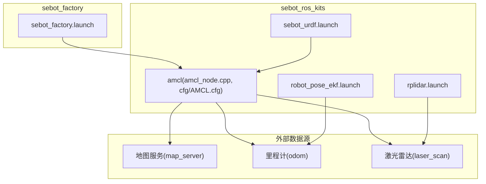
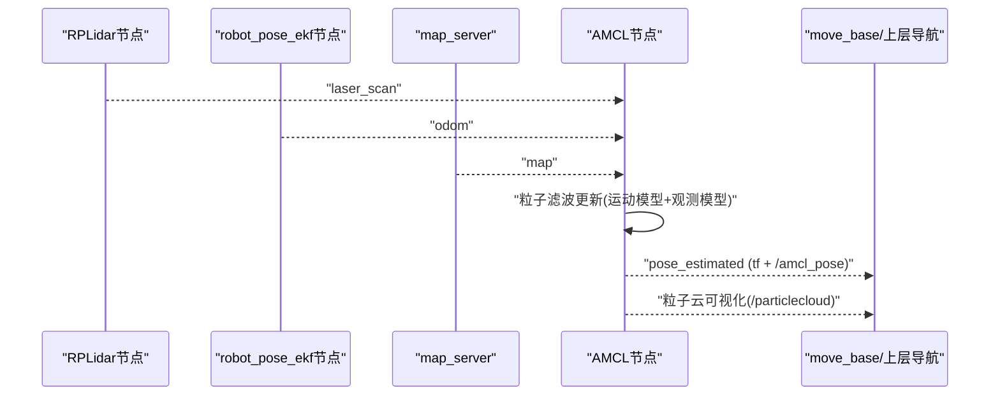
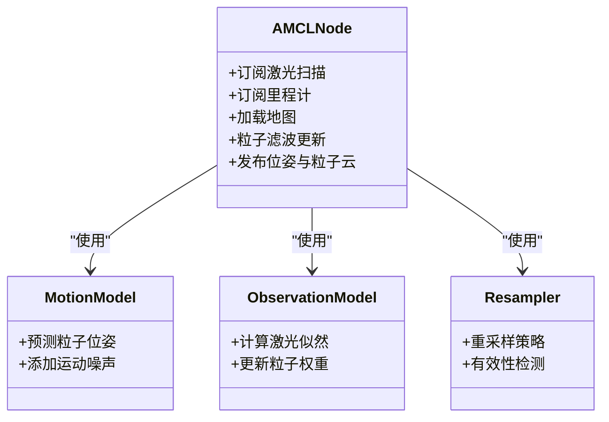
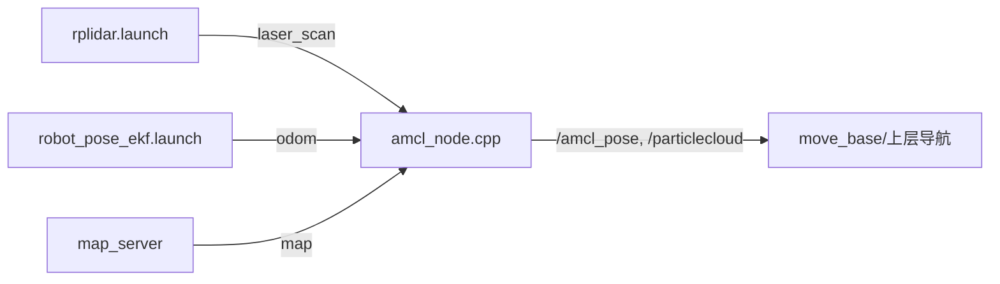

# AMCL粒子滤波定位

<cite>
**本文引用的文件**   
- [amcl_node.cpp](file://sebot_ros_kits/src/sebot_navigation/amcl/src/amcl_node.cpp)
- [AMCL.cfg](file://sebot_ros_kits/src/sebot_navigation/amcl/cfg/AMCL.cfg)
- [amcl_diff.launch](file://sebot_ros_kits/src/sebot_navigation/amcl/examples/amcl_diff.launch)
- [amcl_omni.launch](file://sebot_ros_kits/src/sebot_navigation/amcl/examples/amcl_omni.launch)
- [basic_localization.py](file://sebot_ros_kits/src/sebot_navigation/amcl/test/basic_localization.py)
- [set_initial_pose.py](file://sebot_ros_kits/src/sebot_navigation/amcl/test/set_initial_pose.py)
- [robot_pose_ekf.launch](file://sebot_ros_kits/src/sebot_driver/robot_pose_ekf/launch/robot_pose_ekf.launch)
- [rplidar.launch](file://sebot_ros_kits/src/sebot_driver/rplidar_ros/launch/rplidar.launch)
- [sebot_factory.launch](file://sebot_factory/src/sebot_factory/launch/sebot_factory.launch)
- [sebot_urdf.launch](file://sebot_ros_kits/src/sebot_urdf/launch/sebot_urdf.launch)
</cite>

## 目录
1. [简介](#简介)
2. [项目结构](#项目结构)
3. [核心组件](#核心组件)
4. [架构总览](#架构总览)
5. [详细组件分析](#详细组件分析)
6. [依赖关系分析](#依赖关系分析)
7. [性能考虑](#性能考虑)
8. [故障排查指南](#故障排查指南)
9. [结论](#结论)
10. [附录](#附录)

## 简介
本文件面向在 sebot 导航栈中集成与使用 AMCL（自适应蒙特卡洛定位）的工程师与研究者，系统阐述 AMCL 的基本原理、在本仓库中的实现与配置方式、与激光雷达/里程计/地图的集成流程，以及初始定位、收敛判据、精度评估与参数调优方法。文档同时给出可视化与常见问题诊断建议，并针对不同环境提供参数配置建议与性能优化技巧。

## 项目结构
本项目由三个相互独立的 catkin 工作空间组成：应用层 sebot_factory、机器人套件 sebot_ros_kits、仿真层 sebot_ros_stdr。AMCL 相关代码位于 sebot_ros_kits 的 navigation 子包 amcl 中；驱动与传感器节点（如 RPLidar、robot_pose_ekf）位于 sebot_ros_kits 的 driver 子包；工厂主启动脚本位于 sebot_factory 的 launch 目录。

图表来源 
- [amcl_node.cpp](file://sebot_ros_kits/src/sebot_navigation/amcl/src/amcl_node.cpp)
- [AMCL.cfg](file://sebot_ros_kits/src/sebot_navigation/amcl/cfg/AMCL.cfg)
- [rplidar.launch](file://sebot_ros_kits/src/sebot_driver/rplidar_ros/launch/rplidar.launch)
- [robot_pose_ekf.launch](file://sebot_ros_kits/src/sebot_driver/robot_pose_ekf/launch/robot_pose_ekf.launch)
- [sebot_urdf.launch](file://sebot_ros_kits/src/sebot_urdf/launch/sebot_urdf.launch)

章节来源
- [sebot_factory.launch](file://sebot_factory/src/sebot_factory/launch/sebot_factory.launch)
- [amcl_node.cpp](file://sebot_ros_kits/src/sebot_navigation/amcl/src/amcl_node.cpp)
- [AMCL.cfg](file://sebot_ros_kits/src/sebot_navigation/amcl/cfg/AMCL.cfg)

## 核心组件
- AMCL 节点：订阅激光扫描与里程计，结合全局地图进行粒子滤波定位，发布位姿估计与粒子云。
- 参数配置：通过动态重加载参数（dynamic_reconfigure）与 launch 文件统一配置粒子数量、运动模型、观测模型、初始分布等。
- 传感器集成：RPLidar 提供激光扫描；robot_pose_ekf 融合 IMU 与轮式里程计输出 odom；map_server 提供静态栅格地图。
- 测试与示例：包含基础定位与设置初始位姿的测试脚本与示例 launch。

章节来源
- [amcl_node.cpp](file://sebot_ros_kits/src/sebot_navigation/amcl/src/amcl_node.cpp)
- [AMCL.cfg](file://sebot_ros_kits/src/sebot_navigation/amcl/cfg/AMCL.cfg)
- [basic_localization.py](file://sebot_ros_kits/src/sebot_navigation/amcl/test/basic_localization.py)
- [set_initial_pose.py](file://sebot_ros_kits/src/sebot_navigation/amcl/test/set_initial_pose.py)

## 架构总览
AMCL 作为定位后端，接收来自传感器与状态估计模块的数据，结合地图进行位姿估计，并将结果反馈给上层导航控制器。

图表来源 
- [amcl_node.cpp](file://sebot_ros_kits/src/sebot_navigation/amcl/src/amcl_node.cpp)
- [rplidar.launch](file://sebot_ros_kits/src/sebot_driver/rplidar_ros/launch/rplidar.launch)
- [robot_pose_ekf.launch](file://sebot_ros_kits/src/sebot_driver/robot_pose_ekf/launch/robot_pose_ekf.launch)

## 详细组件分析

### AMCL 算法原理与实现要点
- 粒子滤波理论：用一组带权重的粒子近似后验位姿分布，每步根据运动模型预测新位姿，再根据观测似然更新权重。
- 重采样策略：当有效粒子数低于阈值时进行重采样，避免退化；常见包括系统重采样、残差重采样等。
- 位姿估计过程：对每个粒子计算观测似然（基于激光与地图匹配），加权平均得到当前位姿估计，并输出协方差。
- 初始化与恢复：支持随机全局搜索与用户指定初始位姿；当定位失败时可触发重新初始化。

章节来源
- [amcl_node.cpp](file://sebot_ros_kits/src/sebot_navigation/amcl/src/amcl_node.cpp)

### 关键参数与配置
- 粒子数量与重采样阈值：控制定位精度与计算开销的平衡。
- 运动模型参数：针对差速/全向底盘的运动噪声与漂移建模。
- 观测模型参数：激光似然场构建、最大观测距离、噪声模型等。
- 初始分布设置：均匀分布或高斯分布，范围与方差影响初始定位速度与鲁棒性。
- 动态重加载：通过 AMCL.cfg 暴露可在线调节的参数集。

章节来源
- [AMCL.cfg](file://sebot_ros_kits/src/sebot_navigation/amcl/cfg/AMCL.cfg)

### 与传感器与地图的集成
- 激光雷达：订阅 laser_scan，用于观测似然计算。
- 里程计：订阅 odom，作为运动模型的输入；通常由 robot_pose_ekf 融合 IMU 与轮式里程计输出。
- 地图：从 map_server 获取静态栅格地图，用于计算观测似然。
- TF 坐标变换：AMCL 将位姿估计广播到 tf，供导航栈使用。

章节来源
- [amcl_node.cpp](file://sebot_ros_kits/src/sebot_navigation/amcl/src/amcl_node.cpp)
- [rplidar.launch](file://sebot_ros_kits/src/sebot_driver/rplidar_ros/launch/rplidar.launch)
- [robot_pose_ekf.launch](file://sebot_ros_kits/src/sebot_driver/robot_pose_ekf/launch/robot_pose_ekf.launch)

### 初始定位与收敛条件
- 初始定位：可通过 set_initial_pose 服务或 RViz 工具设置初始位姿；也可启用全局搜索模式。
- 收敛判据：粒子权重集中度、有效粒子数、位姿协方差变化率等指标可用于判断是否收敛。
- 定位精度评估：比较 AMCL 输出位姿与真实位姿（仿真或地面真值），统计误差均值与方差。

章节来源
- [set_initial_pose.py](file://sebot_ros_kits/src/sebot_navigation/amcl/test/set_initial_pose.py)
- [basic_localization.py](file://sebot_ros_kits/src/sebot_navigation/amcl/test/basic_localization.py)

### 不同运动模型的 Launch 示例
- 差速底盘：amcl_diff.launch 展示差速模型的典型配置。
- 全向底盘：amcl_omni.launch 展示全向模型的典型配置。

章节来源
- [amcl_diff.launch](file://sebot_ros_kits/src/sebot_navigation/amcl/examples/amcl_diff.launch)
- [amcl_omni.launch](file://sebot_ros_kits/src/sebot_navigation/amcl/examples/amcl_omni.launch)

### 类图（概念映射到源码）

图表来源 
- [amcl_node.cpp](file://sebot_ros_kits/src/sebot_navigation/amcl/src/amcl_node.cpp)

## 依赖关系分析
AMCL 依赖以下外部节点与消息：
- 激光扫描：来自 rplidar_ros 或其他激光驱动。
- 里程计：来自 robot_pose_ekf 或原始里程计。
- 地图：来自 map_server。
- TF：用于坐标变换与位姿传播。

图表来源 
- [rplidar.launch](file://sebot_ros_kits/src/sebot_driver/rplidar_ros/launch/rplidar.launch)
- [robot_pose_ekf.launch](file://sebot_ros_kits/src/sebot_driver/robot_pose_ekf/launch/robot_pose_ekf.launch)
- [amcl_node.cpp](file://sebot_ros_kits/src/sebot_navigation/amcl/src/amcl_node.cpp)

章节来源
- [rplidar.launch](file://sebot_ros_kits/src/sebot_driver/rplidar_ros/launch/rplidar.launch)
- [robot_pose_ekf.launch](file://sebot_ros_kits/src/sebot_driver/robot_pose_ekf/launch/robot_pose_ekf.launch)
- [amcl_node.cpp](file://sebot_ros_kits/src/sebot_navigation/amcl/src/amcl_node.cpp)

## 性能考虑
- 粒子数量：增加粒子数提升精度但增大计算量；建议在保证实时性的前提下逐步上调。
- 重采样频率：过频繁重采样可能导致粒子多样性下降；需结合有效粒子数阈值调整。
- 观测模型：合理设置最大观测距离与噪声参数，避免远距噪声影响。
- 地图分辨率：高分辨率地图提高匹配精度但增加内存与计算开销。
- 传感器质量：IMU与轮式里程计的噪声直接影响运动模型；建议使用 EKF 融合提升稳定性。

[本节为通用指导，不直接分析具体文件]

## 故障排查指南
- 定位发散：检查里程计噪声与漂移、激光遮挡与反射、地图准确性；适当增加粒子数或调整观测模型参数。
- 初始定位失败：确认初始位姿设置正确，必要时启用全局搜索；检查地图坐标系与 TF 链。
- 收敛缓慢：降低运动噪声、提高观测似然区分度；确保激光数据新鲜且无丢帧。
- 资源占用过高：减少粒子数、降低地图分辨率、限制激光最大距离。

章节来源
- [basic_localization.py](file://sebot_ros_kits/src/sebot_navigation/amcl/test/basic_localization.py)
- [set_initial_pose.py](file://sebot_ros_kits/src/sebot_navigation/amcl/test/set_initial_pose.py)

## 结论
AMCL 在本项目中作为核心定位模块，通过与激光雷达、里程计与地图的紧密集成，实现了鲁棒的位姿估计。合理的参数配置与传感器质量是保证定位精度的关键。通过本文档的原理说明、配置指南与故障排查建议，可在不同环境下快速调优并获得稳定可靠的定位效果。

[本节为总结性内容，不直接分析具体文件]

## 附录
- 运行入口：sebot_factory.launch 负责整体启动与参数切换（仿真/调试）。
- 传感器启动：rplidar.launch 启动激光雷达；robot_pose_ekf.launch 融合 IMU 与里程计。
- 机器人模型：sebot_urdf.launch 加载机器人 URDF，确保 TF 与碰撞模型正确。

章节来源
- [sebot_factory.launch](file://sebot_factory/src/sebot_factory/launch/sebot_factory.launch)
- [rplidar.launch](file://sebot_ros_kits/src/sebot_driver/rplidar_ros/launch/rplidar.launch)
- [robot_pose_ekf.launch](file://sebot_ros_kits/src/sebot_driver/robot_pose_ekf/launch/robot_pose_ekf.launch)
- [sebot_urdf.launch](file://sebot_ros_kits/src/sebot_urdf/launch/sebot_urdf.launch)