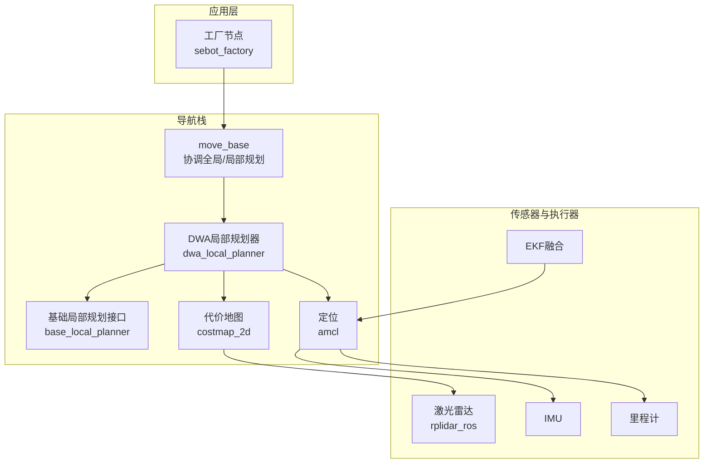
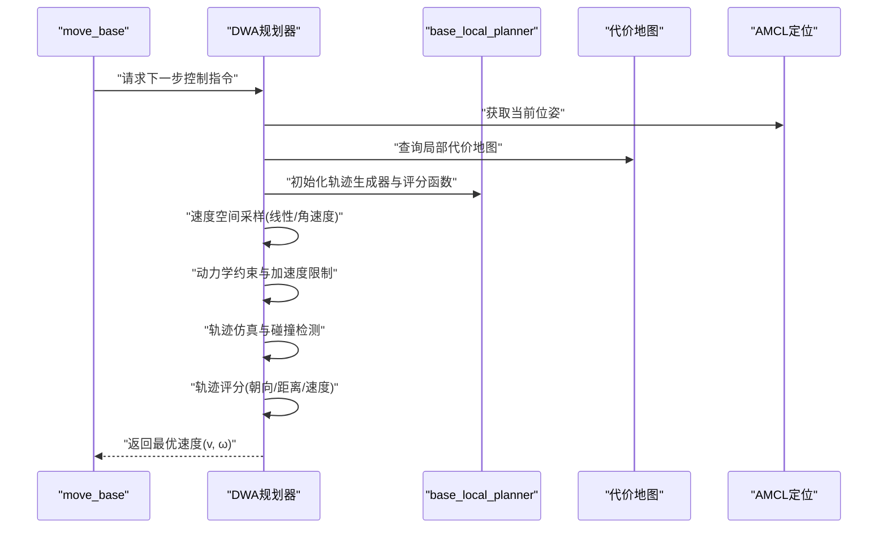
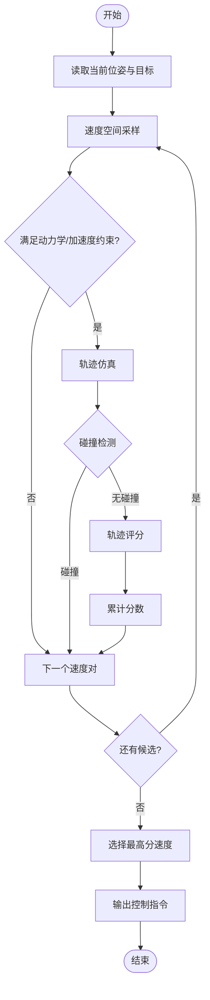
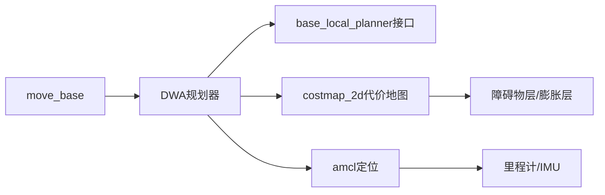

# DWA局部规划器

<cite>
**本文引用的文件**   
- [dwa_local_planner/package.xml](file://sebot_ros_kits/src/sebot_navigation/dwa_local_planner/package.xml)
- [dwa_local_planner/blp_plugin.xml](file://sebot_ros_kits/src/sebot_navigation/dwa_local_planner/blp_plugin.xml)
- [include/dwa_local_planner/dwa_planner_ros.h](file://sebot_ros_kits/src/sebot_navigation/dwa_local_planner/include/dwa_local_planner/dwa_planner_ros.h)
- [src/dwa_planner_ros.cpp](file://sebot_ros_kits/src/sebot_navigation/dwa_local_planner/src/dwa_planner_ros.cpp)
- [cfg/DWAPlannerConfig.cfg](file://sebot_ros_kits/src/sebot_navigation/dwa_local_planner/cfg/DWAPlannerConfig.cfg)
- [move_base/src/move_base.cpp](file://sebot_ros_kits/src/sebot_navigation/move_base/src/move_base.cpp)
- [base_local_planner/include/base_local_planner/trajectory_planner.h](file://sebot_ros_kits/src/sebot_navigation/base_local_planner/include/base_local_planner/trajectory_planner.h)
- [base_local_planner/src/trajectory_planner.cpp](file://sebot_ros_kits/src/sebot_navigation/base_local_planner/src/trajectory_planner.cpp)
- [costmap_2d/include/costmap_2d/costmap_2d_ros.h](file://sebot_ros_kits/src/sebot_navigation/costmap_2d/include/costmap_2d/costmap_2d_ros.h)
- [amcl/amcl_node.cpp](file://sebot_ros_kits/src/sebot_navigation/amcl/src/amcl_node.cpp)
- [sebot_navigation/param/local_costmap_params.yaml](file://sebot_ros_kits/src/sebot_navigation/sebot_navigation/param/local_costmap_params.yaml)
- [sebot_navigation/param/global_costmap_params.yaml](file://sebot_ros_kits/src/sebot_navigation/sebot_navigation/param/global_costmap_params.yaml)
- [sebot_navigation/param/dwa_local_planner_params.yaml](file://sebot_ros_kits/src/sebot_navigation/sebot_navigation/param/dwa_local_planner_params.yaml)
- [sebot_factory/launch/sebot_factory.launch](file://sebot_factory/src/sebot_factory/launch/sebot_factory.launch)
</cite>

## 目录
1. [简介](#简介)
2. [项目结构](#项目结构)
3. [核心组件](#核心组件)
4. [架构总览](#架构总览)
5. [详细组件分析](#详细组件分析)
6. [依赖关系分析](#依赖关系分析)
7. [性能考量](#性能考量)
8. [故障排查指南](#故障排查指南)
9. [结论](#结论)
10. [附录](#附录)

## 简介
本文件面向DWA（动态窗口法）局部规划器，系统阐述其在机器人导航中的工作原理与工程实现。内容覆盖速度空间搜索、轨迹评分函数、实时避障机制、参数配置与调优、轨迹可视化与性能分析工具，以及与差速驱动和全向移动机器人的运动学集成方式。同时给出复杂环境下的规划策略与故障恢复建议，帮助读者在真实或仿真环境中稳定部署DWA。

## 项目结构
本项目由三个相互独立的catkin工作空间组成：应用层 sebot_factory、机器人套件 sebot_ros_kits、仿真层 sebot_ros_stdr。DWA局部规划器位于 sebot_ros_kits 的 navigation 栈中，通过 move_base 调用，并依赖 costmap_2d 提供代价地图、AMCL 提供定位信息。

图表来源
- [move_base/src/move_base.cpp](file://sebot_ros_kits/src/sebot_navigation/move_base/src/move_base.cpp)
- [include/dwa_local_planner/dwa_planner_ros.h](file://sebot_ros_kits/src/sebot_navigation/dwa_local_planner/include/dwa_local_planner/dwa_planner_ros.h)
- [costmap_2d/include/costmap_2d/costmap_2d_ros.h](file://sebot_ros_kits/src/sebot_navigation/costmap_2d/include/costmap_2d/costmap_2d_ros.h)
- [amcl/amcl_node.cpp](file://sebot_ros_kits/src/sebot_navigation/amcl/src/amcl_node.cpp)

章节来源
- [sebot_factory/launch/sebot_factory.launch](file://sebot_factory/src/sebot_factory/launch/sebot_factory.launch)
- [sebot_ros_kits/src/sebot_navigation/dwa_local_planner/package.xml](file://sebot_ros_kits/src/sebot_navigation/dwa_local_planner/package.xml)

## 核心组件
- DWA局部规划器（dwa_local_planner）：基于ROS base_local_planner框架实现的动态窗口法局部规划插件，负责在速度空间内采样候选轨迹、评估质量并输出控制指令。
- 基础局部规划接口（base_local_planner）：定义轨迹生成、采样、碰撞检测与评分的统一接口，DWA在其之上实现具体算法。
- 代价地图（costmap_2d）：提供局部/全局二维代价栅格，用于障碍物表示与膨胀处理。
- 定位模块（amcl）：提供机器人在地图中的位姿估计，作为DWA的初始状态输入。
- 协调器（move_base）：调度全局路径与局部规划器，管理恢复行为与状态机。

章节来源
- [include/dwa_local_planner/dwa_planner_ros.h](file://sebot_ros_kits/src/sebot_navigation/dwa_local_planner/include/dwa_local_planner/dwa_planner_ros.h)
- [src/dwa_planner_ros.cpp](file://sebot_ros_kits/src/sebot_navigation/dwa_local_planner/src/dwa_planner_ros.cpp)
- [base_local_planner/include/base_local_planner/trajectory_planner.h](file://sebot_ros_kits/src/sebot_navigation/base_local_planner/include/base_local_planner/trajectory_planner.h)
- [base_local_planner/src/trajectory_planner.cpp](file://sebot_ros_kits/src/sebot_navigation/base_local_planner/src/trajectory_planner.cpp)
- [costmap_2d/include/costmap_2d/costmap_2d_ros.h](file://sebot_ros_kits/src/sebot_navigation/costmap_2d/include/costmap_2d/costmap_2d_ros.h)
- [amcl/amcl_node.cpp](file://sebot_ros_kits/src/sebot_navigation/amcl/src/amcl_node.cpp)
- [move_base/src/move_base.cpp](file://sebot_ros_kits/src/sebot_navigation/move_base/src/move_base.cpp)

## 架构总览
DWA在move_base的调度下运行，周期性地读取当前位姿、目标点与代价地图，进行速度空间采样与轨迹仿真，选择最优轨迹段的速度指令下发给底层控制器。

图表来源
- [move_base/src/move_base.cpp](file://sebot_ros_kits/src/sebot_navigation/move_base/src/move_base.cpp)
- [include/dwa_local_planner/dwa_planner_ros.h](file://sebot_ros_kits/src/sebot_navigation/dwa_local_planner/include/dwa_local_planner/dwa_planner_ros.h)
- [base_local_planner/include/base_local_planner/trajectory_planner.h](file://sebot_ros_kits/src/sebot_navigation/base_local_planner/include/base_local_planner/trajectory_planner.h)
- [costmap_2d/include/costmap_2d/costmap_2d_ros.h](file://sebot_ros_kits/src/sebot_navigation/costmap_2d/include/costmap_2d/costmap_2d_ros.h)
- [amcl/amcl_node.cpp](file://sebot_ros_kits/src/sebot_navigation/amcl/src/amcl_node.cpp)

## 详细组件分析

### DWA算法原理与流程
- 速度空间搜索：在当前时间步，根据机器人最大/最小线速度与角速度以及加速度限制，生成可行的速度对集合（动态窗口）。
- 轨迹仿真：对每个速度对，按固定时间步长向前仿真一段轨迹，考虑机器人运动学模型（差速或全向），得到离散位姿序列。
- 碰撞检测：将仿真轨迹投影到代价地图，检查是否进入障碍物区域或超出安全阈值。
- 轨迹评分：综合多个指标计算分数，常见包括：
  - 朝向得分：轨迹末端方向与目标方向的夹角误差越小得分越高。
  - 距离得分：轨迹上离障碍物的最近距离越大得分越高。
  - 速度得分：平均速度或末端速度越大得分越高（鼓励高效前进）。
- 选择最优：选取总分最高的速度对作为当前控制指令。

图表来源
- [base_local_planner/include/base_local_planner/trajectory_planner.h](file://sebot_ros_kits/src/sebot_navigation/base_local_planner/include/base_local_planner/trajectory_planner.h)
- [base_local_planner/src/trajectory_planner.cpp](file://sebot_ros_kits/src/sebot_navigation/base_local_planner/src/trajectory_planner.cpp)
- [include/dwa_local_planner/dwa_planner_ros.h](file://sebot_ros_kits/src/sebot_navigation/dwa_local_planner/include/dwa_local_planner/dwa_planner_ros.h)

章节来源
- [base_local_planner/include/base_local_planner/trajectory_planner.h](file://sebot_ros_kits/src/sebot_navigation/base_local_planner/include/base_local_planner/trajectory_planner.h)
- [base_local_planner/src/trajectory_planner.cpp](file://sebot_ros_kits/src/sebot_navigation/base_local_planner/src/trajectory_planner.cpp)
- [include/dwa_local_planner/dwa_planner_ros.h](file://sebot_ros_kits/src/sebot_navigation/dwa_local_planner/include/dwa_local_planner/dwa_planner_ros.h)
- [src/dwa_planner_ros.cpp](file://sebot_ros_kits/src/sebot_navigation/dwa_local_planner/src/dwa_planner_ros.cpp)

### 参数配置与含义
DWA的关键参数通常通过ROS参数服务器加载，常见类别如下：
- 速度搜索范围
  - 最大/最小线速度（m/s）
  - 最大/最小角速度（rad/s）
  - 线/角加速度上限（m/s², rad/s²）
- 轨迹评估权重
  - 朝向权重（heading_weight）
  - 距离权重（dist_goal_weight / obstacle_distance_weight）
  - 速度权重（vel_weight）
- 时间与分辨率
  - 仿真时间长度（sim_time）
  - 速度采样步长（v_step, theta_step）
  - 轨迹采样数量（n_samples）
- 障碍物与安全阈值
  - 代价地图膨胀半径（inflation_radius）
  - 最小安全距离阈值（min_obstacle_dist）
- 运动学适配
  - 差速驱动：仅支持 v 与 ω
  - 全向移动：可支持横向速度 vx、vy 与旋转 ω（需扩展采样与评分）

章节来源
- [cfg/DWAPlannerConfig.cfg](file://sebot_ros_kits/src/sebot_navigation/dwa_local_planner/cfg/DWAPlannerConfig.cfg)
- [sebot_ros_kits/src/sebot_navigation/sebot_navigation/param/dwa_local_planner_params.yaml](file://sebot_ros_kits/src/sebot_navigation/sebot_navigation/param/dwa_local_planner_params.yaml)

### 轨迹生成与优化过程
- 候选轨迹采样：在动态窗口内以一定步长对线速度和角速度进行网格或随机采样，结合加速度限制确保物理可行性。
- 碰撞检测：使用代价地图的障碍物层与膨胀层，沿轨迹逐点检查是否越界；必要时引入足迹（footprint）几何进行精确碰撞判断。
- 路径质量评估：对每条轨迹计算加权分数，平衡“靠近目标”“远离障碍”“快速前进”等目标；可通过权重调节不同场景偏好。
- 优化策略：
  - 自适应采样密度：在狭窄通道增加角度采样，在开阔区域提高速度采样。
  - 多目标权衡：根据任务阶段切换权重（如接近目标时增大朝向权重）。
  - 实时性保障：限制仿真步数与轨迹长度，保证控制频率。

章节来源
- [base_local_planner/include/base_local_planner/trajectory_planner.h](file://sebot_ros_kits/src/sebot_navigation/base_local_planner/include/base_local_planner/trajectory_planner.h)
- [base_local_planner/src/trajectory_planner.cpp](file://sebot_ros_kits/src/sebot_navigation/base_local_planner/src/trajectory_planner.cpp)
- [costmap_2d/include/costmap_2d/costmap_2d_ros.h](file://sebot_ros_kits/src/sebot_navigation/costmap_2d/include/costmap_2d/costmap_2d_ros.h)

### 与机器人运动学模型的集成
- 差速驱动：DWA直接输出线速度 v 与角速度 ω，通过差速运动学模型转换为左右轮速。
- 全向移动：若支持vx、vy、ω三自由度，需在采样与评分中扩展维度，并确保代价地图与足迹模型匹配。
- 参数化接口：通过base_local_planner的轨迹生成器抽象，替换不同运动学模型，保持上层接口一致。

章节来源
- [base_local_planner/include/base_local_planner/trajectory_planner.h](file://sebot_ros_kits/src/sebot_navigation/base_local_planner/include/base_local_planner/trajectory_planner.h)
- [include/dwa_local_planner/dwa_planner_ros.h](file://sebot_ros_kits/src/sebot_navigation/dwa_local_planner/include/dwa_local_planner/dwa_planner_ros.h)

### 参数调优指南
- 起步建议
  - 设置合理的最大/最小速度与加速度，避免过激动作。
  - 调整朝向权重与距离权重，使机器人在走廊与房间表现均衡。
- 场景化调参
  - 狭窄通道：提高角度采样密度与距离权重，降低速度权重。
  - 开阔区域：提高速度权重，减少角度采样以提升效率。
- 验证方法
  - 使用rviz可视化轨迹与代价地图，观察是否频繁震荡或贴墙。
  - 记录控制频率与CPU占用，确保实时性。

章节来源
- [sebot_ros_kits/src/sebot_navigation/sebot_navigation/param/dwa_local_planner_params.yaml](file://sebot_ros_kits/src/sebot_navigation/sebot_navigation/param/dwa_local_planner_params.yaml)
- [sebot_ros_kits/src/sebot_navigation/costmap_2d/include/costmap_2d/costmap_2d_ros.h](file://sebot_ros_kits/src/sebot_navigation/costmap_2d/include/costmap_2d/costmap_2d_ros.h)

### 轨迹可视化方法与性能分析工具
- 轨迹可视化
  - 在rviz中启用DWA轨迹显示，查看候选轨迹与最终选择轨迹。
  - 叠加代价地图与膨胀层，直观理解避障效果。
- 性能分析
  - 使用rosbag录制话题，回放分析控制频率与延迟。
  - 监控CPU与内存占用，识别瓶颈（如代价地图更新或轨迹仿真耗时）。

章节来源
- [sebot_ros_kits/src/sebot_navigation/costmap_2d/include/costmap_2d/costmap_2d_ros.h](file://sebot_ros_kits/src/sebot_navigation/costmap_2d/include/costmap_2d/costmap_2d_ros.h)
- [sebot_ros_kits/src/sebot_navigation/sebot_navigation/param/local_costmap_params.yaml](file://sebot_ros_kits/src/sebot_navigation/sebot_navigation/param/local_costmap_params.yaml)

### 复杂环境下的规划策略与故障恢复
- 复杂环境策略
  - 多目标切换：在全局路径分段处动态调整朝向权重。
  - 动态障碍：缩短仿真时间、提高采样频率，增强响应速度。
- 故障恢复
  - 卡住检测：长时间位移小于阈值则触发原地旋转或后退。
  - 代价地图异常：重置局部代价地图，重新订阅传感器数据。
  - 定位丢失：回退至全局重定位或等待AMCL收敛。

章节来源
- [move_base/src/move_base.cpp](file://sebot_ros_kits/src/sebot_navigation/move_base/src/move_base.cpp)
- [amcl/amcl_node.cpp](file://sebot_ros_kits/src/sebot_navigation/amcl/src/amcl_node.cpp)

## 依赖关系分析
DWA依赖base_local_planner接口、costmap_2d代价地图与amcl定位，并通过move_base统一调度。

图表来源
- [include/dwa_local_planner/dwa_planner_ros.h](file://sebot_ros_kits/src/sebot_navigation/dwa_local_planner/include/dwa_local_planner/dwa_planner_ros.h)
- [base_local_planner/include/base_local_planner/trajectory_planner.h](file://sebot_ros_kits/src/sebot_navigation/base_local_planner/include/base_local_planner/trajectory_planner.h)
- [costmap_2d/include/costmap_2d/costmap_2d_ros.h](file://sebot_ros_kits/src/sebot_navigation/costmap_2d/include/costmap_2d/costmap_2d_ros.h)
- [amcl/amcl_node.cpp](file://sebot_ros_kits/src/sebot_navigation/amcl/src/amcl_node.cpp)
- [move_base/src/move_base.cpp](file://sebot_ros_kits/src/sebot_navigation/move_base/src/move_base.cpp)

章节来源
- [dwa_local_planner/blp_plugin.xml](file://sebot_ros_kits/src/sebot_navigation/dwa_local_planner/blp_plugin.xml)
- [dwa_local_planner/package.xml](file://sebot_ros_kits/src/sebot_navigation/dwa_local_planner/package.xml)

## 性能考量
- 控制频率：确保DWA循环频率足够高（通常≥10Hz），避免滞后导致碰撞。
- 采样复杂度：合理设置n_samples与步长，平衡精度与实时性。
- 代价地图更新：局部代价地图应高频刷新，但避免过度计算。
- CPU占用：监控轨迹仿真与碰撞检测耗时，必要时简化评分函数或减少仿真步数。

[本节为通用指导，不直接分析具体文件]

## 故障排查指南
- 常见问题
  - 轨迹震荡：降低速度权重或增大阻尼，调整朝向权重。
  - 频繁贴墙：减小膨胀半径或提高距离权重。
  - 无法到达目标：检查全局路径与目标可达性，确认AMCL定位正常。
- 诊断步骤
  - 使用rviz观察轨迹与代价地图，定位问题区域。
  - rostopic echo相关话题，检查输入输出数据。
  - 调整参数后对比前后效果，逐步收敛。

章节来源
- [sebot_ros_kits/src/sebot_navigation/sebot_navigation/param/dwa_local_planner_params.yaml](file://sebot_ros_kits/src/sebot_navigation/sebot_navigation/param/dwa_local_planner_params.yaml)
- [sebot_ros_kits/src/sebot_navigation/costmap_2d/include/costmap_2d/costmap_2d_ros.h](file://sebot_ros_kits/src/sebot_navigation/costmap_2d/include/costmap_2d/costmap_2d_ros.h)

## 结论
DWA局部规划器通过速度空间搜索与轨迹评分，在实时避障与目标导向之间取得平衡。通过合理配置参数、可视化调试与性能分析，可在复杂环境中实现稳定高效的局部规划。结合move_base与代价地图、定位模块，形成完整的导航闭环。

[本节为总结，不直接分析具体文件]

## 附录
- 关键配置文件位置
  - DWA参数：sebot_navigation/param/dwa_local_planner_params.yaml
  - 局部代价地图：sebot_navigation/param/local_costmap_params.yaml
  - 全局代价地图：sebot_navigation/param/global_costmap_params.yaml
- 启动与集成
  - 工厂主启动：sebot_factory/launch/sebot_factory.launch
  - move_base协调：move_base/src/move_base.cpp

章节来源
- [sebot_ros_kits/src/sebot_navigation/sebot_navigation/param/dwa_local_planner_params.yaml](file://sebot_ros_kits/src/sebot_navigation/sebot_navigation/param/dwa_local_planner_params.yaml)
- [sebot_ros_kits/src/sebot_navigation/sebot_navigation/param/local_costmap_params.yaml](file://sebot_ros_kits/src/sebot_navigation/sebot_navigation/param/local_costmap_params.yaml)
- [sebot_ros_kits/src/sebot_navigation/sebot_navigation/param/global_costmap_params.yaml](file://sebot_ros_kits/src/sebot_navigation/sebot_navigation/param/global_costmap_params.yaml)
- [sebot_factory/launch/sebot_factory.launch](file://sebot_factory/src/sebot_factory/launch/sebot_factory.launch)
- [move_base/src/move_base.cpp](file://sebot_ros_kits/src/sebot_navigation/move_base/src/move_base.cpp)