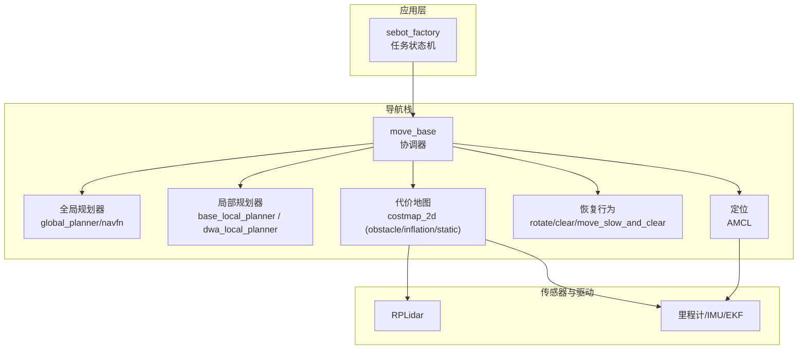
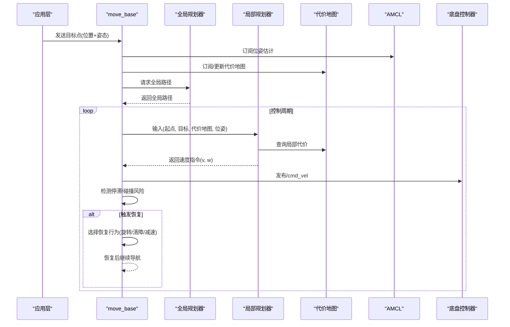
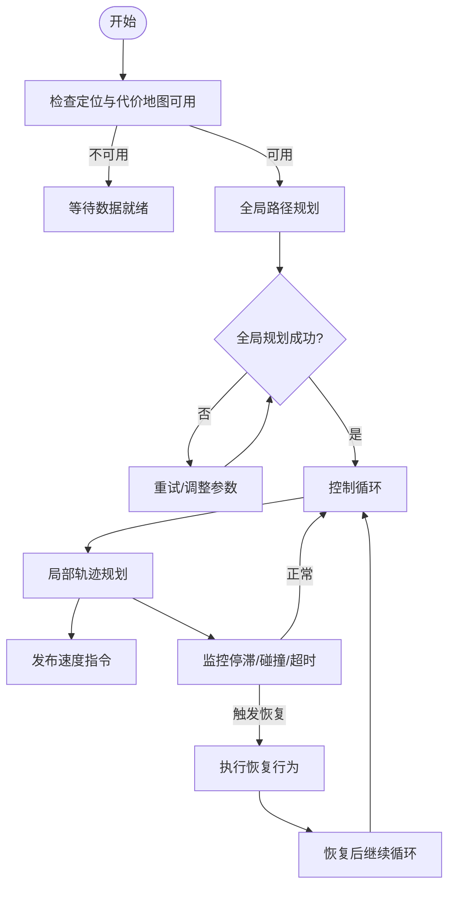
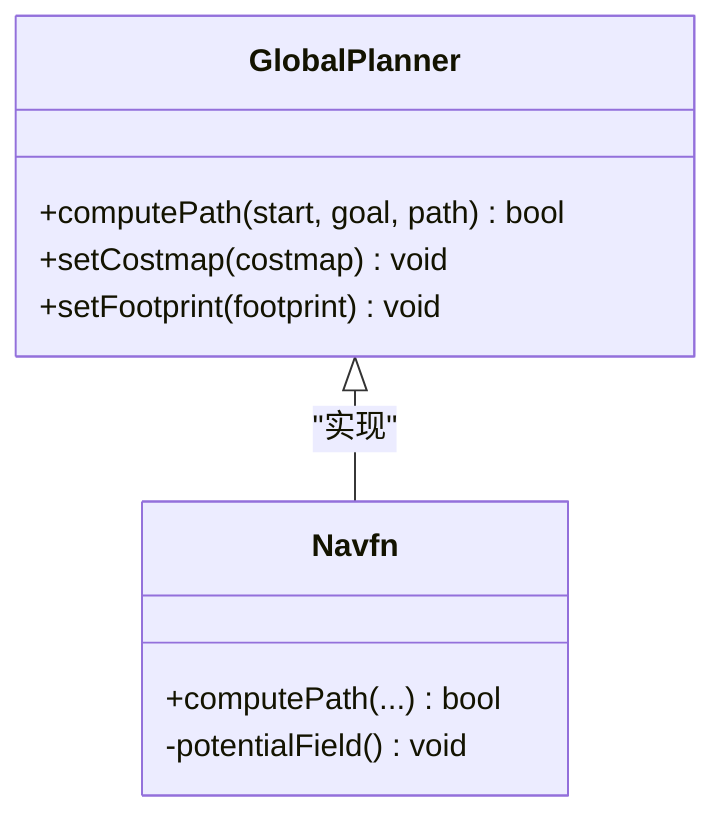
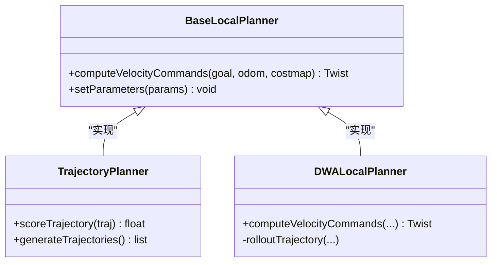
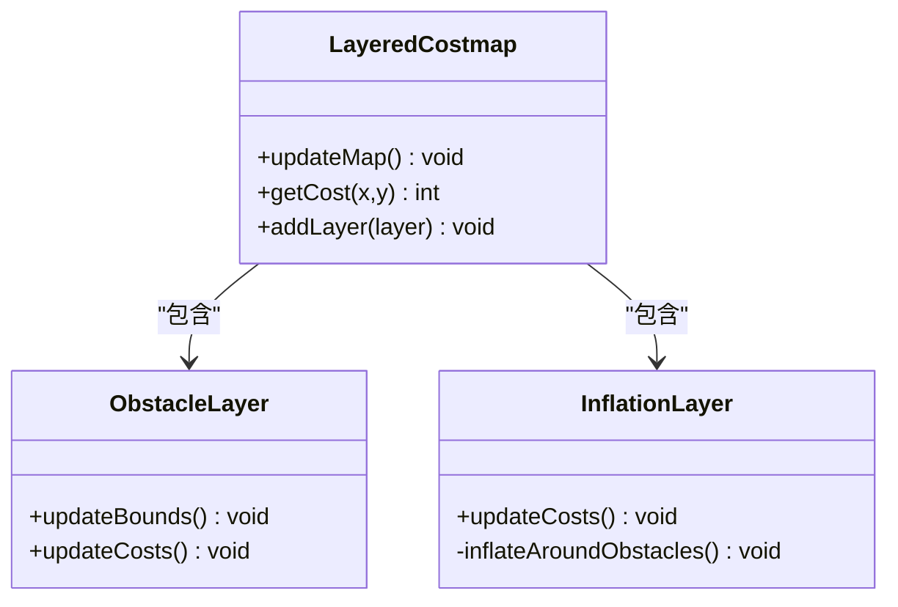
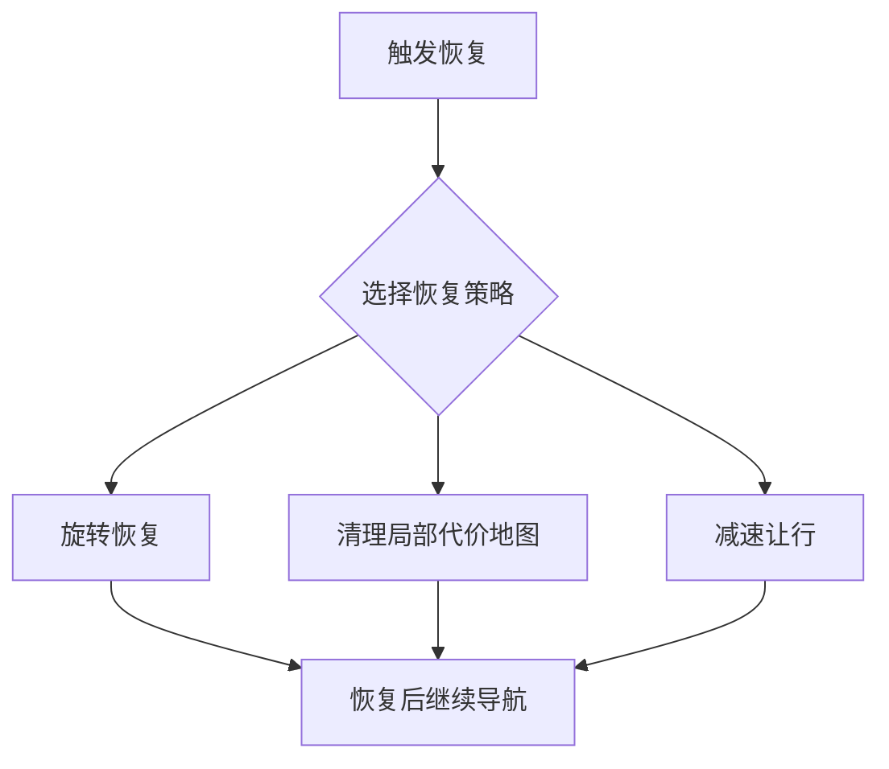
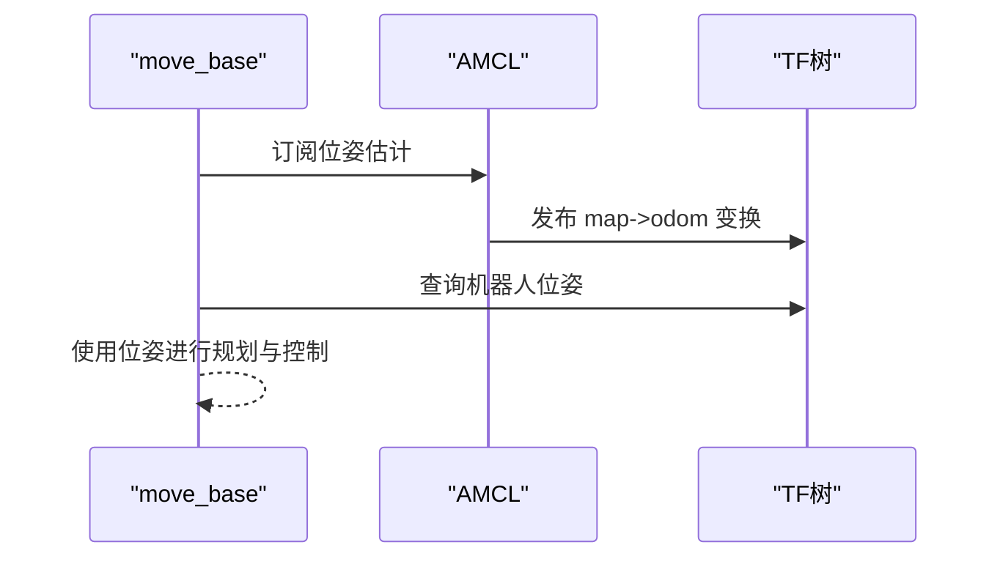
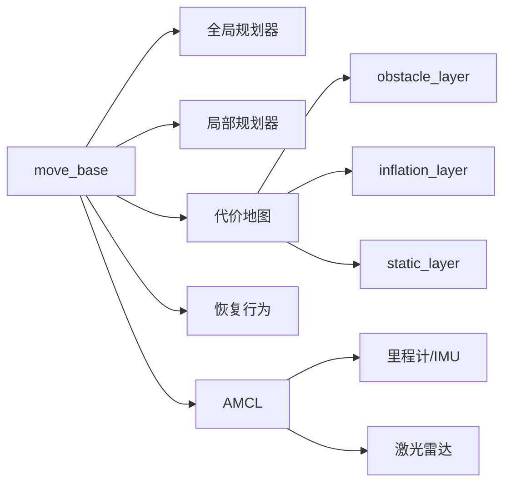

# MoveBase导航框架

<cite>
**本文引用的文件**   
- [sebot_factory.launch](file://sebot_factory/launch/sebot_factory.launch)
- [factory.cpp](file://sebot_factory/src/factory.cpp)
- [move_base 主程序](file://sebot_ros_kits/src/sebot_navigation/move_base/src/move_base.cpp)
- [move_base 头文件](file://sebot_ros_kits/src/sebot_navigation/move_base/include/move_base/move_base.h)
- [base_local_planner 轨迹规划器](file://sebot_ros_kits/src/sebot_navigation/base_local_planner/src/trajectory_planner.cpp)
- [dwa_local_planner](file://sebot_ros_kits/src/sebot_navigation/dwa_local_planner/src/dwa_planner.cpp)
- [costmap_2d 代价地图核心](file://sebot_ros_kits/src/sebot_navigation/costmap_2d/src/costmap_2d.cpp)
- [layered_costmap 分层代价地图](file://sebot_ros_kits/src/sebot_navigation/costmap_2d/src/layered_costmap.cpp)
- [obstacle_layer 障碍物层](file://sebot_ros_kits/src/sebot_navigation/costmap_2d/plugins/obstacle_layer.cpp)
- [inflation_layer 膨胀层](file://sebot_ros_kits/src/sebot_navigation/costmap_2d/plugins/inflation_layer.cpp)
- [amcl_node 定位节点](file://sebot_ros_kits/src/sebot_navigation/amcl/src/amcl_node.cpp)
- [global_planner 全局规划器](file://sebot_ros_kits/src/sebot_navigation/global_planner/src/global_planner.cpp)
- [navfn 全局路径规划实现](file://sebot_ros_kits/src/sebot_navigation/navfn/src/navfn.cpp)
- [rotate_recovery 旋转恢复行为](file://sebot_ros_kits/src/sebot_navigation/rotate_recovery/src/rotate_recovery.cpp)
- [clear_costmap_recovery 清障恢复行为](file://sebot_ros_kits/src/sebot_navigation/clear_costmap_recovery/src/clear_costmap_recovery.cpp)
- [move_slow_and_clear 减速清障行为](file://sebot_ros_kits/src/sebot_navigation/move_slow_and_clear/src/move_slow_and_clear.cpp)
- [sebot_navigation 参数配置](file://sebot_ros_kits/src/sebot_navigation/sebot_navigation/param/navigation.yaml)
- [sebot_navigation 启动脚本](file://sebot_ros_kits/src/sebot_navigation/sebot_navigation/launch/navigation.launch)
</cite>

## 目录
1. [简介](#简介)
2. [项目结构](#项目结构)
3. [核心组件](#核心组件)
4. [架构总览](#架构总览)
5. [详细组件分析](#详细组件分析)
6. [依赖关系分析](#依赖关系分析)
7. [性能考虑](#性能考虑)
8. [故障排查指南](#故障排查指南)
9. [结论](#结论)
10. [附录](#附录)

## 简介
本文件面向使用 ROS 的机器人导航开发者，聚焦 move_base 作为导航核心框架的作用与架构设计。文档从系统级到代码级，解释全局规划器、局部规划器与恢复行为的协调机制；详述 move_base 的启动与参数（规划频率、恢复触发条件、控制器切换逻辑）；描述全局路径规划与局部轨迹执行的完整流程（路径验证、速度命令生成、障碍物响应）；说明与 AMCL 定位、代价地图、传感器数据的集成方式；并提供参数配置示例、调试方法与性能优化建议，以及常见导航问题的诊断步骤与解决方案。

## 项目结构
本项目由三个相互独立的 catkin 工作空间组成：
- sebot_factory：应用层业务（工厂任务状态机、需求确认、取件、结算等）
- sebot_ros_kits：机器人套件（导航栈、驱动、SLAM、语音、视觉等）
- sebot_ros_stdr：仿真环境（STDR 仿真器与配套包）

导航相关代码集中在 sebot_ros_kits 下的 sebot_navigation 包集合中，包含 move_base、AMCL、DWA、base_local_planner、costmap_2d、global_planner、navfn、各类 recovery 行为等。上层业务通过 launch 文件统一启动并注入参数。

图表来源
- [sebot_factory.launch](file://sebot_factory/launch/sebot_factory.launch)
- [move_base 主程序](file://sebot_ros_kits/src/sebot_navigation/move_base/src/move_base.cpp)
- [amcl_node 定位节点](file://sebot_ros_kits/src/sebot_navigation/amcl/src/amcl_node.cpp)
- [costmap_2d 代价地图核心](file://sebot_ros_kits/src/sebot_navigation/costmap_2d/src/costmap_2d.cpp)

章节来源
- [sebot_factory.launch](file://sebot_factory/launch/sebot_factory.launch)

## 核心组件
- move_base：导航协调器，负责全局/局部规划器与恢复行为的调度、控制器切换、目标管理与周期执行。
- 全局规划器：基于 global_planner 接口，常用 navfn 实现，在静态/动态代价地图上计算全局路径。
- 局部规划器：base_local_planner（TrajectoryPlanner）或 dwa_local_planner（DWA），在局部窗口内采样轨迹并选择最优速度指令。
- 代价地图：costmap_2d 提供分层融合（static、obstacle、inflation），为全局/局部规划提供可通行性信息。
- 恢复行为：rotate_recovery、clear_costmap_recovery、move_slow_and_clear 等，用于卡住、阻塞、碰撞风险等场景的自救。
- 定位：AMCL 粒子滤波估计位姿，输出 odom->map 变换，供 move_base 使用。

章节来源
- [move_base 主程序](file://sebot_ros_kits/src/sebot_navigation/move_base/src/move_base.cpp)
- [move_base 头文件](file://sebot_ros_kits/src/sebot_navigation/move_base/include/move_base/move_base.h)
- [global_planner 全局规划器](file://sebot_ros_kits/src/sebot_navigation/global_planner/src/global_planner.cpp)
- [navfn 全局路径规划实现](file://sebot_ros_kits/src/sebot_navigation/navfn/src/navfn.cpp)
- [base_local_planner 轨迹规划器](file://sebot_ros_kits/src/sebot_navigation/base_local_planner/src/trajectory_planner.cpp)
- [dwa_local_planner](file://sebot_ros_kits/src/sebot_navigation/dwa_local_planner/src/dwa_planner.cpp)
- [costmap_2d 代价地图核心](file://sebot_ros_kits/src/sebot_navigation/costmap_2d/src/costmap_2d.cpp)
- [layered_costmap 分层代价地图](file://sebot_ros_kits/src/sebot_navigation/costmap_2d/src/layered_costmap.cpp)
- [obstacle_layer 障碍物层](file://sebot_ros_kits/src/sebot_navigation/costmap_2d/plugins/obstacle_layer.cpp)
- [inflation_layer 膨胀层](file://sebot_ros_kits/src/sebot_navigation/costmap_2d/plugins/inflation_layer.cpp)
- [amcl_node 定位节点](file://sebot_ros_kits/src/sebot_navigation/amcl/src/amcl_node.cpp)

## 架构总览
move_base 以“协调器”角色运行，周期性调用全局规划器生成路径，再由局部规划器根据当前位姿与代价地图实时生成速度指令。当局部规划失败或长时间未进展时，进入恢复行为序列，尝试旋转、清理局部代价地图或减速让行，随后回到正常导航循环。

图表来源
- [move_base 主程序](file://sebot_ros_kits/src/sebot_navigation/move_base/src/move_base.cpp)
- [global_planner 全局规划器](file://sebot_ros_kits/src/sebot_navigation/global_planner/src/global_planner.cpp)
- [base_local_planner 轨迹规划器](file://sebot_ros_kits/src/sebot_navigation/base_local_planner/src/trajectory_planner.cpp)
- [costmap_2d 代价地图核心](file://sebot_ros_kits/src/sebot_navigation/costmap_2d/src/costmap_2d.cpp)
- [amcl_node 定位节点](file://sebot_ros_kits/src/sebot_navigation/amcl/src/amcl_node.cpp)

## 详细组件分析

### move_base 协调器与控制流
- 职责：管理目标队列、全局/局部规划器生命周期、恢复行为序列、控制器切换与错误处理。
- 关键流程：
  - 接收目标后，先检查定位与代价地图可用性。
  - 调用全局规划器生成路径，若失败则尝试重规划。
  - 局部规划器按周期生成速度指令，同时监测停滞、碰撞风险、时间阈值等条件。
  - 满足恢复条件时，顺序执行恢复行为，成功后回到正常循环。
- 控制器切换：根据环境复杂度与传感器质量，可在 base_local_planner 与 dwa_local_planner 之间切换（通过参数与运行时策略）。

图表来源
- [move_base 主程序](file://sebot_ros_kits/src/sebot_navigation/move_base/src/move_base.cpp)
- [move_base 头文件](file://sebot_ros_kits/src/sebot_navigation/move_base/include/move_base/move_base.h)

章节来源
- [move_base 主程序](file://sebot_ros_kits/src/sebot_navigation/move_base/src/move_base.cpp)
- [move_base 头文件](file://sebot_ros_kits/src/sebot_navigation/move_base/include/move_base/move_base.h)

### 全局规划器（global_planner + navfn）
- 作用：在 costmap_2d 上搜索从起点到目标的最优路径，通常采用势场/距离变换算法（如 navfn）。
- 输入：起点、终点、代价地图、机器人足迹与膨胀半径。
- 输出：全局路径（点列），供局部规划器跟踪。
- 常见问题：地图膨胀过大导致路径绕行；静态层误报导致不可达；目标位于障碍区需回退策略。

图表来源
- [global_planner 全局规划器](file://sebot_ros_kits/src/sebot_navigation/global_planner/src/global_planner.cpp)
- [navfn 全局路径规划实现](file://sebot_ros_kits/src/sebot_navigation/navfn/src/navfn.cpp)

章节来源
- [global_planner 全局规划器](file://sebot_ros_kits/src/sebot_navigation/global_planner/src/global_planner.cpp)
- [navfn 全局路径规划实现](file://sebot_ros_kits/src/sebot_navigation/navfn/src/navfn.cpp)

### 局部规划器（base_local_planner / dwa_local_planner）
- base_local_planner（TrajectoryPlanner）：在局部窗口内采样速度与角速度，评估轨迹得分（方向、距离、碰撞、偏好前向等），选择最优指令。
- dwa_local_planner（DWA）：基于微分运动学模型进行速度采样与滚动窗口优化，适合非全向移动机器人与动态避障。
- 输入：当前位姿、速度、目标点、局部代价地图、机器人动力学限制。
- 输出：线速度 v 与角速度 w。

图表来源
- [base_local_planner 轨迹规划器](file://sebot_ros_kits/src/sebot_navigation/base_local_planner/src/trajectory_planner.cpp)
- [dwa_local_planner](file://sebot_ros_kits/src/sebot_navigation/dwa_local_planner/src/dwa_planner.cpp)

章节来源
- [base_local_planner 轨迹规划器](file://sebot_ros_kits/src/sebot_navigation/base_local_planner/src/trajectory_planner.cpp)
- [dwa_local_planner](file://sebot_ros_kits/src/sebot_navigation/dwa_local_planner/src/dwa_planner.cpp)

### 代价地图（costmap_2d）
- layered_costmap：管理多个 layer（static、obstacle、inflation 等），按优先级与时间戳融合。
- obstacle_layer：订阅激光/深度数据，将观测投影到地图，设置占用栅格。
- inflation_layer：对占用栅格进行距离膨胀，形成安全边界，影响全局/局部规划。
- 更新频率与分辨率直接影响规划实时性与精度。

图表来源
- [layered_costmap 分层代价地图](file://sebot_ros_kits/src/sebot_navigation/costmap_2d/src/layered_costmap.cpp)
- [obstacle_layer 障碍物层](file://sebot_ros_kits/src/sebot_navigation/costmap_2d/plugins/obstacle_layer.cpp)
- [inflation_layer 膨胀层](file://sebot_ros_kits/src/sebot_navigation/costmap_2d/plugins/inflation_layer.cpp)
- [costmap_2d 代价地图核心](file://sebot_ros_kits/src/sebot_navigation/costmap_2d/src/costmap_2d.cpp)

章节来源
- [layered_costmap 分层代价地图](file://sebot_ros_kits/src/sebot_navigation/costmap_2d/src/layered_costmap.cpp)
- [obstacle_layer 障碍物层](file://sebot_ros_kits/src/sebot_navigation/costmap_2d/plugins/obstacle_layer.cpp)
- [inflation_layer 膨胀层](file://sebot_ros_kits/src/sebot_navigation/costmap_2d/plugins/inflation_layer.cpp)
- [costmap_2d 代价地图核心](file://sebot_ros_kits/src/sebot_navigation/costmap_2d/src/costmap_2d.cpp)

### 恢复行为（rotate_recovery / clear_costmap_recovery / move_slow_and_clear）
- rotate_recovery：原地旋转以重新感知环境，适用于被遮挡或视角受限。
- clear_costmap_recovery：清理局部代价地图中的临时障碍物，适用于短暂遮挡。
- move_slow_and_clear：减速并让行，适用于前方有行人/车辆等动态障碍。
- 触发条件：局部规划失败次数、停滞时间、碰撞风险、外部服务请求等。

图表来源
- [rotate_recovery 旋转恢复行为](file://sebot_ros_kits/src/sebot_navigation/rotate_recovery/src/rotate_recovery.cpp)
- [clear_costmap_recovery 清障恢复行为](file://sebot_ros_kits/src/sebot_navigation/clear_costmap_recovery/src/clear_costmap_recovery.cpp)
- [move_slow_and_clear 减速清障行为](file://sebot_ros_kits/src/sebot_navigation/move_slow_and_clear/src/move_slow_and_clear.cpp)

章节来源
- [rotate_recovery 旋转恢复行为](file://sebot_ros_kits/src/sebot_navigation/rotate_recovery/src/rotate_recovery.cpp)
- [clear_costmap_recovery 清障恢复行为](file://sebot_ros_kits/src/sebot_navigation/clear_costmap_recovery/src/clear_costmap_recovery.cpp)
- [move_slow_and_clear 减速清障行为](file://sebot_ros_kits/src/sebot_navigation/move_slow_and_clear/src/move_slow_and_clear.cpp)

### 与 AMCL 定位的集成
- AMCL 订阅里程计/IMU与激光数据，输出 map->odom 变换与位姿估计。
- move_base 订阅 AMCL 位姿，结合代价地图进行路径跟踪。
- 初始定位与重定位：可通过 2D Pose Estimate 或 Set Goal 触发。

图表来源
- [amcl_node 定位节点](file://sebot_ros_kits/src/sebot_navigation/amcl/src/amcl_node.cpp)

章节来源
- [amcl_node 定位节点](file://sebot_ros_kits/src/sebot_navigation/amcl/src/amcl_node.cpp)

### 传感器数据集成
- 激光雷达（RPLidar）：通过 obstacle_layer 订阅 scan 消息，更新占用栅格。
- 里程计/IMU：EKF 融合后提供稳定位姿增量，供 AMCL 与局部规划器使用。
- 代价地图更新频率与激光刷新率需匹配，避免滞后或抖动。

章节来源
- [obstacle_layer 障碍物层](file://sebot_ros_kits/src/sebot_navigation/costmap_2d/plugins/obstacle_layer.cpp)

## 依赖关系分析
- move_base 依赖：
  - 全局规划器（global_planner 接口）
  - 局部规划器（base_local_planner 接口）
  - 代价地图（costmap_2d 接口）
  - 恢复行为（recovery 插件）
  - 定位（AMCL 提供的位姿）
- 代价地图依赖：
  - static_layer（地图）
  - obstacle_layer（激光/深度）
  - inflation_layer（安全边界）
- AMCL 依赖：
  - 里程计/IMU
  - 激光数据
  - TF 坐标变换

图表来源
- [move_base 主程序](file://sebot_ros_kits/src/sebot_navigation/move_base/src/move_base.cpp)
- [costmap_2d 代价地图核心](file://sebot_ros_kits/src/sebot_navigation/costmap_2d/src/costmap_2d.cpp)
- [amcl_node 定位节点](file://sebot_ros_kits/src/sebot_navigation/amcl/src/amcl_node.cpp)

章节来源
- [move_base 主程序](file://sebot_ros_kits/src/sebot_navigation/move_base/src/move_base.cpp)
- [costmap_2d 代价地图核心](file://sebot_ros_kits/src/sebot_navigation/costmap_2d/src/costmap_2d.cpp)
- [amcl_node 定位节点](file://sebot_ros_kits/src/sebot_navigation/amcl/src/amcl_node.cpp)

## 性能考虑
- 规划频率：提高 move_base 控制频率可提升响应性，但会增加 CPU 负载；建议根据硬件能力与传感器刷新率调优。
- 代价地图分辨率：高分辨率提升精度但增加内存与计算开销；建议在保证精度的前提下降低分辨率。
- 局部窗口大小：增大窗口可提高全局视野但增加采样与评估成本；过小易陷入局部最优。
- 膨胀半径：过大导致路径绕行严重，过小增加碰撞风险；应结合机器人尺寸与环境复杂度调整。
- 传感器延迟：激光与里程计的延迟会导致位姿与地图不一致，需校准时间戳与 TF 延迟补偿。
- 恢复行为频率：过于频繁的恢复会打断导航进程，应合理设置触发阈值与持续时间。

## 故障排查指南
- 无法到达目标：
  - 检查 AMCL 定位是否收敛（查看位姿估计与粒子分布）。
  - 检查代价地图是否存在误报（静态层/障碍物层）。
  - 检查全局路径是否被阻挡（可视化路径与代价地图）。
- 频繁触发恢复：
  - 检查局部规划器参数（速度上限、加速度限制、轨迹评分权重）。
  - 检查传感器噪声与延迟（激光点云缺失、里程计漂移）。
  - 调整恢复行为阈值与序列顺序。
- 路径绕行严重：
  - 减小膨胀半径或调整膨胀层的最大代价。
  - 检查静态地图准确性与更新频率。
- 卡顿或死锁：
  - 检查 move_base 日志与 ROS 话题带宽。
  - 降低规划频率或简化局部规划器复杂度。

章节来源
- [move_base 主程序](file://sebot_ros_kits/src/sebot_navigation/move_base/src/move_base.cpp)
- [base_local_planner 轨迹规划器](file://sebot_ros_kits/src/sebot_navigation/base_local_planner/src/trajectory_planner.cpp)
- [costmap_2d 代价地图核心](file://sebot_ros_kits/src/sebot_navigation/costmap_2d/src/costmap_2d.cpp)

## 结论
move_base 作为 ROS 导航的核心协调器，通过全局/局部规划器与恢复行为的协同，实现了从路径规划到速度控制的完整闭环。合理的参数配置与系统集成是确保导航稳定性与效率的关键。通过本文档的架构解析、流程图与故障排查指南，开发者可快速定位问题并优化导航性能。

## 附录
- 参数配置示例（navigation.yaml）：
  - 规划频率：control_frequency、planner_frequency
  - 恢复行为：recovery_behavior_enabled、recovery_behaviors 列表
  - 代价地图：resolution、inflation_radius、obstacle_range、raytrace_range
  - 局部规划器：max_vel_x、acc_lim_x、sim_time、scoring_weights
  - AMCL：min_particles、max_particles、laser_min/max_range、update_min/max
- 调试方法：
  - 使用 rqt_plot 观察 cmd_vel 与位姿曲线
  - 使用 rviz 可视化路径、代价地图、激光扫描与位姿估计
  - 使用 rosbag 录制与回放传感器数据，复现问题
- 性能优化建议：
  - 降低代价地图分辨率与膨胀半径
  - 调整局部规划器窗口大小与采样步数
  - 优化传感器时间同步与 TF 延迟补偿

章节来源
- [sebot_navigation 参数配置](file://sebot_ros_kits/src/sebot_navigation/sebot_navigation/param/navigation.yaml)
- [sebot_navigation 启动脚本](file://sebot_ros_kits/src/sebot_navigation/sebot_navigation/launch/navigation.launch)
- [sebot_factory.launch](file://sebot_factory/launch/sebot_factory.launch)
- [factory.cpp](file://sebot_factory/src/factory.cpp)