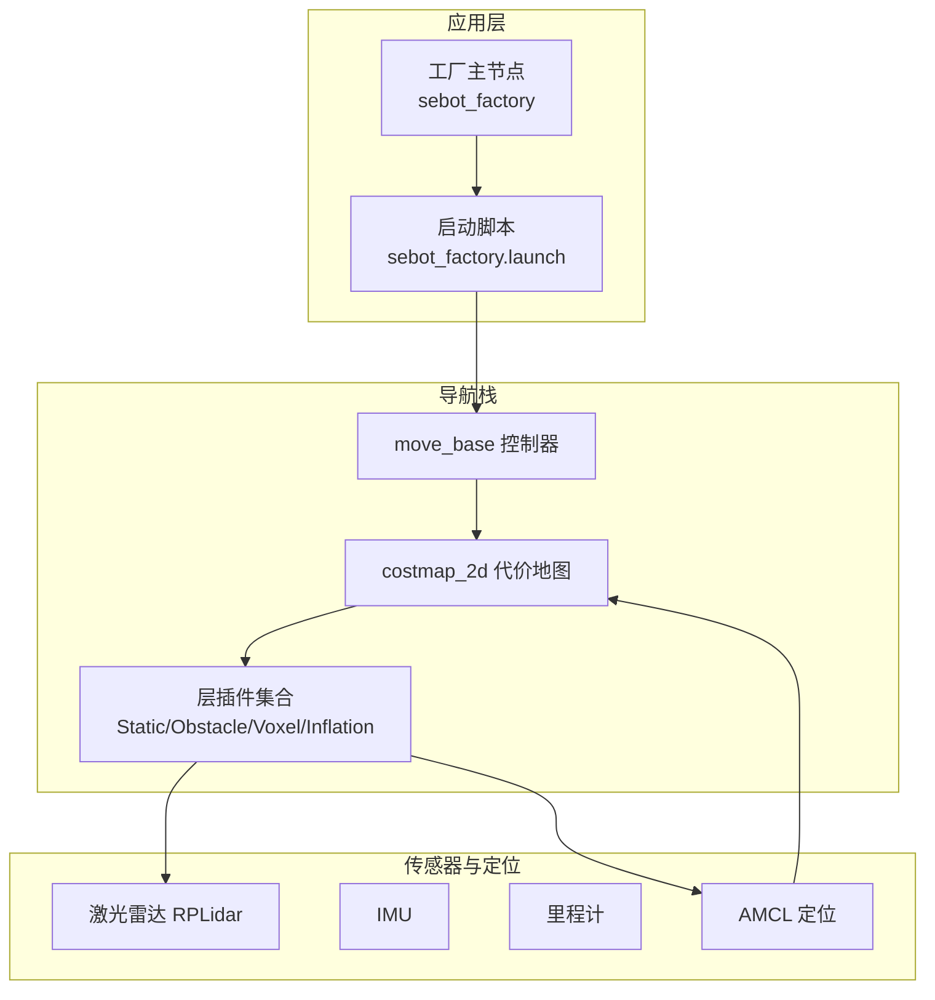
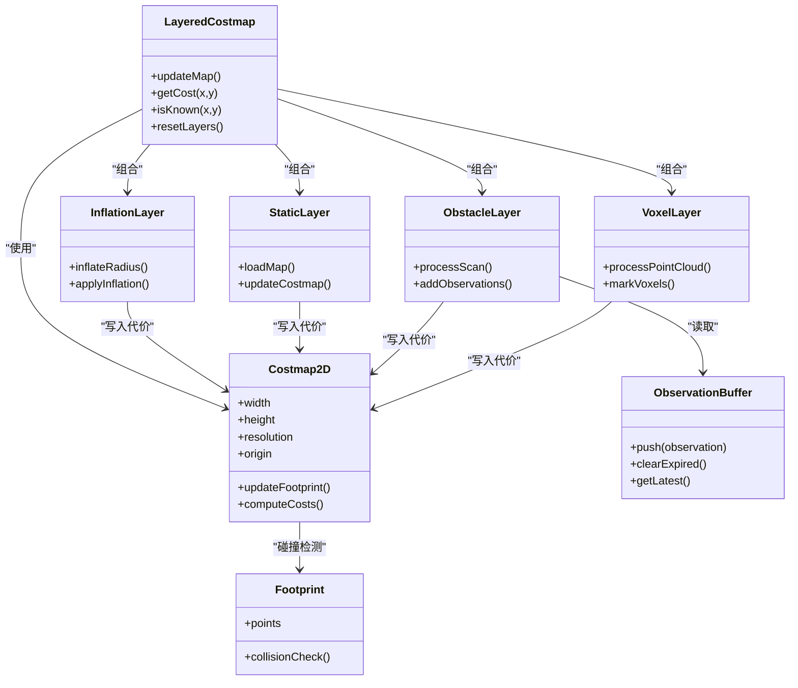
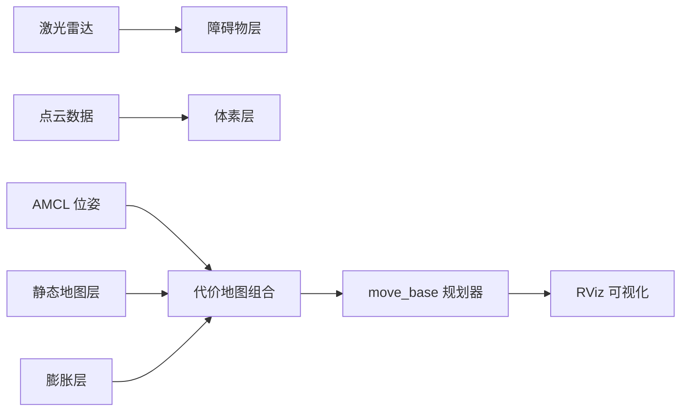

# 代价地图管理

<cite>
**本文引用的文件**   
- [sebot_factory.launch](file://sebot_factory/src/sebot_factory/launch/sebot_factory.launch)
- [costmap_2d_ros.h](file://sebot_ros_kits/src/sebot_navigation/costmap_2d/include/costmap_2d/costmap_2d_ros.h)
- [layered_costmap.h](file://sebot_ros_kits/src/sebot_navigation/costmap_2d/include/costmap_2d/layered_costmap.h)
- [costmap_2d.h](file://sebot_ros_kits/src/sebot_navigation/costmap_2d/include/costmap_2d/costmap_2d.h)
- [static_layer.h](file://sebot_ros_kits/src/sebot_navigation/costmap_2d/include/costmap_2d/static_layer.h)
- [obstacle_layer.h](file://sebot_ros_kits/src/sebot_navigation/costmap_2d/include/costmap_2d/obstacle_layer.h)
- [inflation_layer.h](file://sebot_ros_kits/src/sebot_navigation/costmap_2d/include/costmap_2d/inflation_layer.h)
- [voxel_layer.h](file://sebot_ros_kits/src/sebot_navigation/costmap_2d/include/costmap_2d/voxel_layer.h)
- [observation_buffer.h](file://sebot_ros_kits/src/sebot_navigation/costmap_2d/include/costmap_2d/observation_buffer.h)
- [footprint.h](file://sebot_ros_kits/src/sebot_navigation/costmap_2d/include/costmap_2d/footprint.h)
- [costmap_plugins.xml](file://sebot_ros_kits/src/sebot_navigation/costmap_2d/costmap_plugins.xml)
- [example_params.yaml](file://sebot_ros_kits/src/sebot_navigation/costmap_2d/launch/example_params.yaml)
- [move_base.launch](file://sebot_ros_kits/src/sebot_navigation/move_base/launch/move_base.launch)
</cite>

## 目录
1. [简介](#简介)
2. [项目结构](#项目结构)
3. [核心组件](#核心组件)
4. [架构总览](#架构总览)
5. [详细组件分析](#详细组件分析)
6. [依赖关系分析](#依赖关系分析)
7. [性能考虑](#性能考虑)
8. [故障排查指南](#故障排查指南)
9. [结论](#结论)
10. [附录：配置模板与最佳实践](#附录配置模板与最佳实践)

## 简介
本文件面向“代价地图管理系统”，系统性阐述代价地图的概念、分层组合机制（静态地图层、动态障碍物层、膨胀层等）、关键配置参数（分辨率、尺寸、更新频率、传感器融合参数等）、各层插件工作原理（静态地图加载、激光雷达数据融合、障碍物膨胀算法）、更新机制（增量更新、全量重建、内存管理）、可视化与调试方法，以及不同场景下的配置模板与优化策略。文档基于仓库中 sebot_navigation/costmap_2d 相关源码与 sebot_factory 的 launch 集成进行说明，兼顾工程落地与可维护性。

## 项目结构
本项目由三个相互独立的 catkin 工作空间组成：
- sebot_factory：应用层业务节点与启动脚本
- sebot_ros_kits：机器人套件与导航栈（含 costmap_2d）
- sebot_ros_stdr：仿真环境

与代价地图直接相关的代码集中在 sebot_ros_kits/src/sebot_navigation/costmap_2d 包内，包含核心数据结构、层接口与实现、ROS 封装、插件注册与示例参数；sebot_factory 通过 launch 文件将 move_base 与 costmap_2d 集成到整体导航流程中。

图表来源
- [sebot_factory.launch](file://sebot_factory/src/sebot_factory/launch/sebot_factory.launch)
- [move_base.launch](file://sebot_ros_kits/src/sebot_navigation/move_base/launch/move_base.launch)
- [costmap_2d_ros.h](file://sebot_ros_kits/src/sebot_navigation/costmap_2d/include/costmap_2d/costmap_2d_ros.h)
- [layered_costmap.h](file://sebot_ros_kits/src/sebot_navigation/costmap_2d/include/costmap_2d/layered_costmap.h)

章节来源
- [sebot_factory.launch](file://sebot_factory/src/sebot_factory/launch/sebot_factory.launch)
- [move_base.launch](file://sebot_ros_kits/src/sebot_navigation/move_base/launch/move_base.launch)

## 核心组件
- 代价地图核心
  - LayeredCostmap：负责多层的组合、更新调度与对外接口
  - Costmap2D：二维栅格地图的数据结构与基础操作（坐标变换、足迹计算、代价合并）
  - Footprint：机器人足迹几何表示与碰撞检测
- 层接口与实现
  - Layer：抽象层接口（初始化、更新、重置、重配）
  - StaticLayer：静态地图加载与常驻占用信息
  - ObstacleLayer：激光雷达点云融合，生成动态占用
  - VoxelLayer：三维体素层，用于深度相机或点云融合
  - InflationLayer：障碍物膨胀，生成安全距离代价
- ROS 封装与插件系统
  - Costmap2DROS：ROS 节点封装，订阅话题、服务、参数重配
  - 插件注册：costmap_plugins.xml 声明可用层插件
  - 观测缓冲：ObservationBuffer 管理传感器观测的时间窗口与有效性

章节来源
- [layered_costmap.h](file://sebot_ros_kits/src/sebot_navigation/costmap_2d/include/costmap_2d/layered_costmap.h)
- [costmap_2d.h](file://sebot_ros_kits/src/sebot_navigation/costmap_2d/include/costmap_2d/costmap_2d.h)
- [footprint.h](file://sebot_ros_kits/src/sebot_navigation/costmap_2d/include/costmap_2d/footprint.h)
- [static_layer.h](file://sebot_ros_kits/src/sebot_navigation/costmap_2d/include/costmap_2d/static_layer.h)
- [obstacle_layer.h](file://sebot_ros_kits/src/sebot_navigation/costmap_2d/include/costmap_2d/obstacle_layer.h)
- [voxel_layer.h](file://sebot_ros_kits/src/sebot_navigation/costmap_2d/include/costmap_2d/voxel_layer.h)
- [inflation_layer.h](file://sebot_ros_kits/src/sebot_navigation/costmap_2d/include/costmap_2d/inflation_layer.h)
- [costmap_2d_ros.h](file://sebot_ros_kits/src/sebot_navigation/costmap_2d/include/costmap_2d/costmap_2d_ros.h)
- [costmap_plugins.xml](file://sebot_ros_kits/src/sebot_navigation/costmap_2d/costmap_plugins.xml)
- [observation_buffer.h](file://sebot_ros_kits/src/sebot_navigation/costmap_2d/include/costmap_2d/observation_buffer.h)

## 架构总览
代价地图采用“分层组合 + 插件化”的架构：上层通过 LayeredCostmap 统一调度各层更新，底层 Costmap2D 提供栅格存储与坐标变换能力。ROS 封装层 Costmap2DROS 负责与外部系统交互（话题订阅、服务调用、参数重配）。

图表来源
- [layered_costmap.h](file://sebot_ros_kits/src/sebot_navigation/costmap_2d/include/costmap_2d/layered_costmap.h)
- [costmap_2d.h](file://sebot_ros_kits/src/sebot_navigation/costmap_2d/include/costmap_2d/costmap_2d.h)
- [footprint.h](file://sebot_ros_kits/src/sebot_navigation/costmap_2d/include/costmap_2d/footprint.h)
- [static_layer.h](file://sebot_ros_kits/src/sebot_navigation/costmap_2d/include/costmap_2d/static_layer.h)
- [obstacle_layer.h](file://sebot_ros_kits/src/sebot_navigation/costmap_2d/include/costmap_2d/obstacle_layer.h)
- [voxel_layer.h](file://sebot_ros_kits/src/sebot_navigation/costmap_2d/include/costmap_2d/voxel_layer.h)
- [inflation_layer.h](file://sebot_ros_kits/src/sebot_navigation/costmap_2d/include/costmap_2d/inflation_layer.h)
- [observation_buffer.h](file://sebot_ros_kits/src/sebot_navigation/costmap_2d/include/costmap_2d/observation_buffer.h)

## 详细组件分析

### 静态地图层（StaticLayer）
- 作用：加载并常驻静态地图（如建图结果），提供不可变的占用信息基础层
- 关键点：
  - 地图加载：支持常见格式（PGM/YAML），解析分辨率、原点、占用阈值
  - 坐标映射：将世界坐标转换为栅格索引，处理边界与无效区域
  - 更新策略：通常仅在初始化或收到重加载服务时更新
  - 内存管理：地图数据持久驻留，避免重复 I/O

章节来源
- [static_layer.h](file://sebot_ros_kits/src/sebot_navigation/costmap_2d/include/costmap_2d/static_layer.h)

### 动态障碍物层（ObstacleLayer）
- 作用：融合激光雷达扫描数据，生成动态占用区域
- 关键点：
  - 传感器融合：将激光扫描投影到地图坐标系，标记自由空间与占用空间
  - 时间戳与过期：通过 ObservationBuffer 管理观测有效期，自动清理过期数据
  - 更新频率：按扫描频率触发增量更新，减少不必要的计算
  - 噪声处理：过滤离群点、设置最大探测距离与最小角度间隔

章节来源
- [obstacle_layer.h](file://sebot_ros_kits/src/sebot_navigation/costmap_2d/include/costmap_2d/obstacle_layer.h)
- [observation_buffer.h](file://sebot_ros_kits/src/sebot_navigation/costmap_2d/include/costmap_2d/observation_buffer.h)

### 体素层（VoxelLayer）
- 作用：处理三维点云（如深度相机），在三维空间中标记占用与自由空间
- 关键点：
  - 体素网格：将点云下采样到体素，降低计算复杂度
  - 投影到二维：将有效体素投影到二维代价地图，支持高度阈值过滤
  - 适用场景：复杂室内环境、存在悬空障碍物的情况

章节来源
- [voxel_layer.h](file://sebot_ros_kits/src/sebot_navigation/costmap_2d/include/costmap_2d/voxel_layer.h)

### 膨胀层（InflationLayer）
- 作用：在障碍物周围生成安全距离代价，引导规划器避开危险区域
- 关键点：
  - 膨胀半径：根据机器人尺寸与安全裕度设定
  - 代价函数：距离衰减曲线（线性或指数），影响路径平滑性与安全性
  - 增量更新：仅对受影响的局部区域重新计算代价

章节来源
- [inflation_layer.h](file://sebot_ros_kits/src/sebot_navigation/costmap_2d/include/costmap_2d/inflation_layer.h)

### 代价地图核心（Costmap2D & LayeredCostmap）
- Costmap2D：
  - 数据结构：二维数组存储代价值，支持快速索引与范围查询
  - 坐标变换：世界坐标与栅格索引的双向转换
  - 足迹计算：根据机器人轮廓计算占用区域
- LayeredCostmap：
  - 层调度：按顺序调用各层 update 方法，合并代价
  - 更新策略：支持增量更新与全量重建，平衡实时性与准确性
  - 对外接口：提供 getCost、isKnown、resetLayers 等 API

章节来源
- [costmap_2d.h](file://sebot_ros_kits/src/sebot_navigation/costmap_2d/include/costmap_2d/costmap_2d.h)
- [layered_costmap.h](file://sebot_ros_kits/src/sebot_navigation/costmap_2d/include/costmap_2d/layered_costmap.h)
- [footprint.h](file://sebot_ros_kits/src/sebot_navigation/costmap_2d/include/costmap_2d/footprint.h)

### ROS 封装与插件系统（Costmap2DROS）
- 功能：
  - 订阅激光雷达、点云、位姿等话题
  - 发布代价地图、可视化标记
  - 提供服务：重加载地图、清除区域、重配参数
  - 参数服务器集成：动态重配层参数
- 插件注册：
  - 通过 XML 配置文件声明可用层插件
  - 运行时动态加载，支持热插拔

章节来源
- [costmap_2d_ros.h](file://sebot_ros_kits/src/sebot_navigation/costmap_2d/include/costmap_2d/costmap_2d_ros.h)
- [costmap_plugins.xml](file://sebot_ros_kits/src/sebot_navigation/costmap_2d/costmap_plugins.xml)

## 依赖关系分析
代价地图模块依赖以下子系统：
- 传感器：激光雷达（RPLidar）、深度相机（可选）、IMU、里程计
- 定位：AMCL 提供位姿估计
- 规划：move_base 调用代价地图进行全局与局部规划
- 可视化：RViz 显示代价地图、层叠加、足迹等

图表来源
- [costmap_2d_ros.h](file://sebot_ros_kits/src/sebot_navigation/costmap_2d/include/costmap_2d/costmap_2d_ros.h)
- [layered_costmap.h](file://sebot_ros_kits/src/sebot_navigation/costmap_2d/include/costmap_2d/layered_costmap.h)

章节来源
- [costmap_2d_ros.h](file://sebot_ros_kits/src/sebot_navigation/costmap_2d/include/costmap_2d/costmap_2d_ros.h)
- [layered_costmap.h](file://sebot_ros_kits/src/sebot_navigation/costmap_2d/include/costmap_2d/layered_costmap.h)

## 性能考虑
- 分辨率选择：高分辨率提升精度但增加内存与计算开销，建议根据传感器精度与环境复杂度权衡
- 更新频率：障碍物层按传感器频率更新，静态层低频更新，膨胀层按需增量更新
- 内存管理：合理设置地图尺寸，避免过大导致内存不足；及时清理过期观测
- 并行处理：层更新可考虑并行化（需注意线程安全）
- 缓存策略：重用已计算的代价区域，减少重复计算

[本节为通用指导，不直接分析具体文件]

## 故障排查指南
常见问题与解决方案：
- 地图未加载：检查静态地图路径与格式，确认权限与 YAML 配置正确
- 障碍物不更新：验证激光雷达话题是否正常，检查时间戳与坐标系变换
- 膨胀效果异常：调整膨胀半径与代价函数参数，确保与机器人尺寸匹配
- 内存溢出：减小地图尺寸或分辨率，优化层更新策略
- 定位漂移：检查 AMCL 参数与传感器校准，确保位姿估计准确

章节来源
- [costmap_2d_ros.h](file://sebot_ros_kits/src/sebot_navigation/costmap_2d/include/costmap_2d/costmap_2d_ros.h)
- [observation_buffer.h](file://sebot_ros_kits/src/sebot_navigation/costmap_2d/include/costmap_2d/observation_buffer.h)

## 结论
代价地图管理系统通过分层组合与插件化设计，实现了灵活、可扩展的二维环境建模。静态地图层提供基础占用信息，动态障碍物层融合传感器数据，膨胀层生成安全代价，共同支撑上层规划与决策。合理的参数配置与性能优化是确保系统稳定运行的关键。

[本节为总结性内容，不直接分析具体文件]

## 附录：配置模板与最佳实践

### 基本配置参数
- 分辨率（resolution）：单位米/像素，建议 0.05-0.1m
- 尺寸（width, height）：根据覆盖区域与分辨率计算
- 原点（origin_x, origin_y, origin_theta）：地图左下角在世界坐标系中的位置
- 更新频率（update_frequency, publish_frequency）：控制层更新与发布频率
- 传感器融合参数：
  - 激光雷达：最大距离、最小角度、噪声过滤
  - 点云：体素大小、高度阈值
- 膨胀参数：半径、代价衰减函数

章节来源
- [example_params.yaml](file://sebot_ros_kits/src/sebot_navigation/costmap_2d/launch/example_params.yaml)

### 场景化配置模板
- 室内窄通道：高分辨率（0.05m）、小膨胀半径、高频更新
- 室外开阔地：中等分辨率（0.1m）、大膨胀半径、低频更新
- 动态环境：启用体素层、缩短观测过期时间、提高更新频率
- 静态环境：禁用体素层、延长静态地图缓存时间

[本节为概念性内容，不直接分析具体文件]

### 启动与集成
- 通过 sebot_factory.launch 启动导航流程，配置 simulation 模式与调试选项
- move_base.launch 集成 costmap_2d，订阅必要话题并发布服务
- 参数动态重配：运行时调整层参数，无需重启节点

章节来源
- [sebot_factory.launch](file://sebot_factory/src/sebot_factory/launch/sebot_factory.launch)
- [move_base.launch](file://sebot_ros_kits/src/sebot_navigation/move_base/launch/move_base.launch)

### 可视化与调试
- RViz 显示：代价地图、层叠加、机器人足迹、路径规划
- 话题监控：rqt_topic 查看传感器数据与层输出
- 日志分析：rosbag 录制与回放，定位问题根因

[本节为概念性内容，不直接分析具体文件]