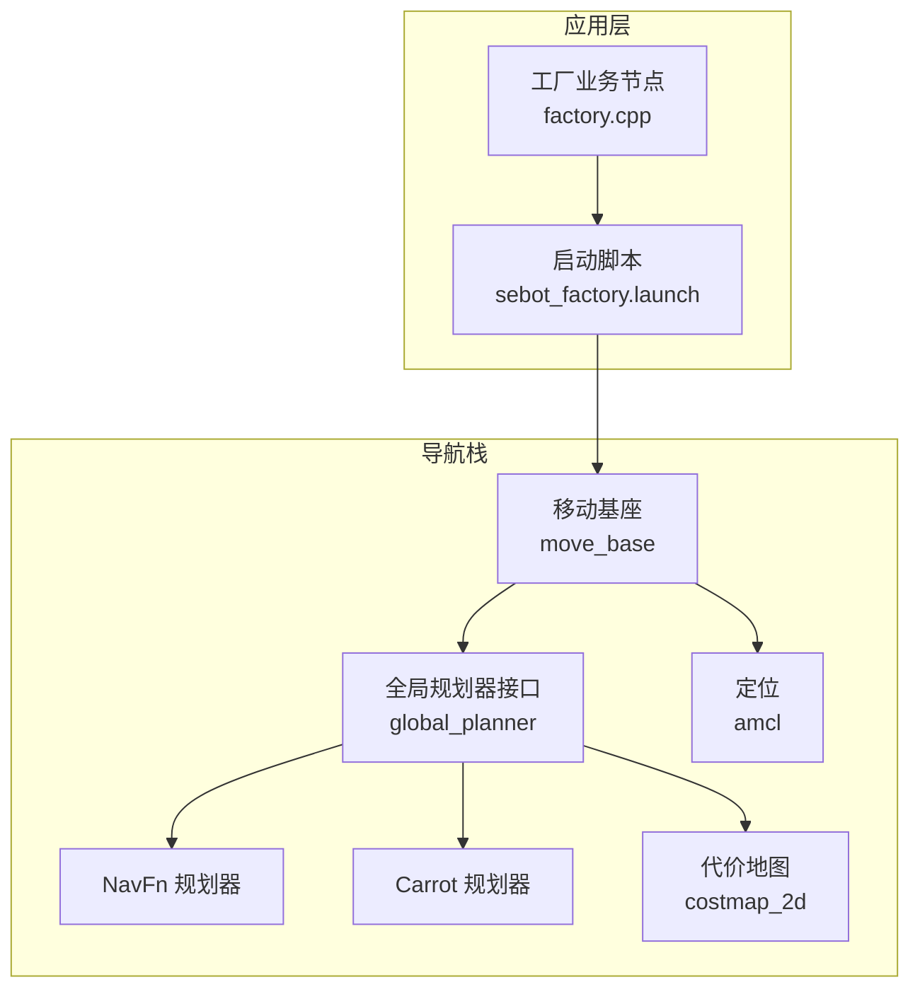
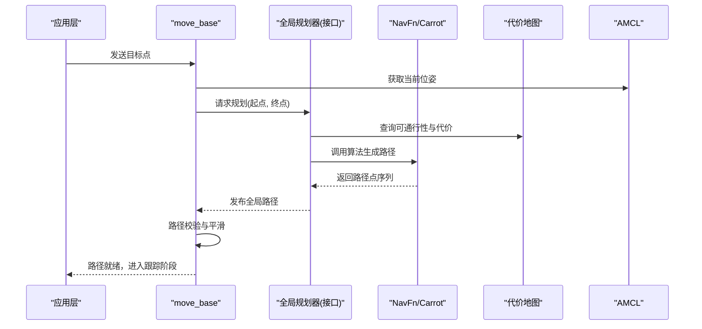
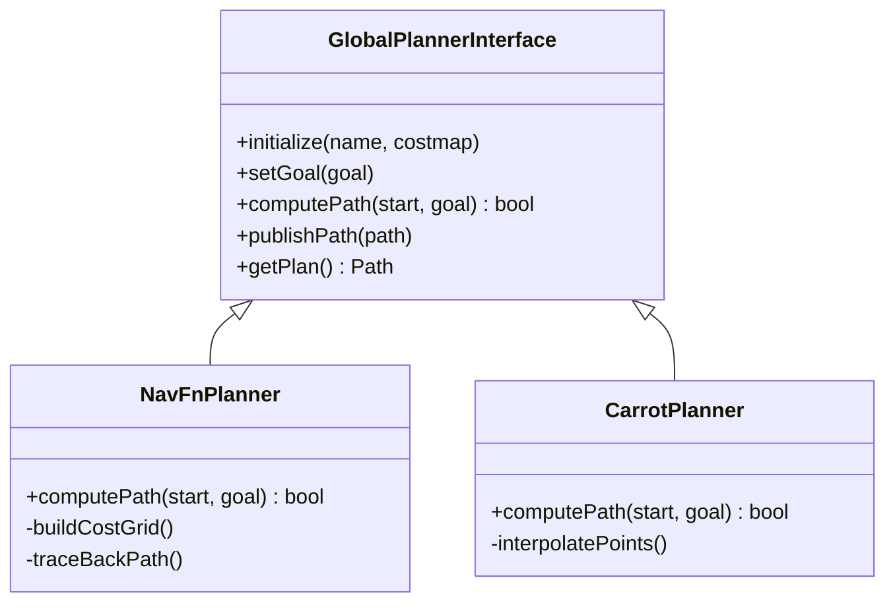
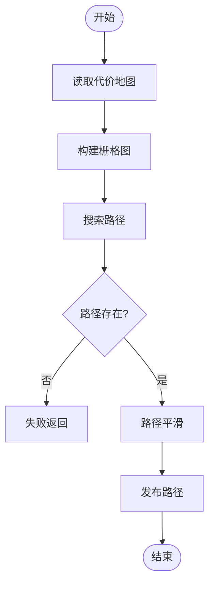
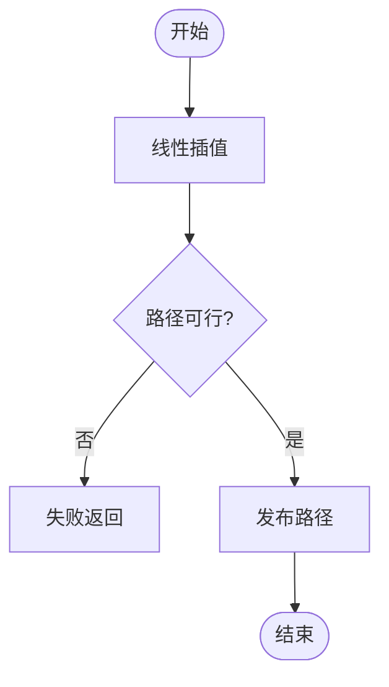
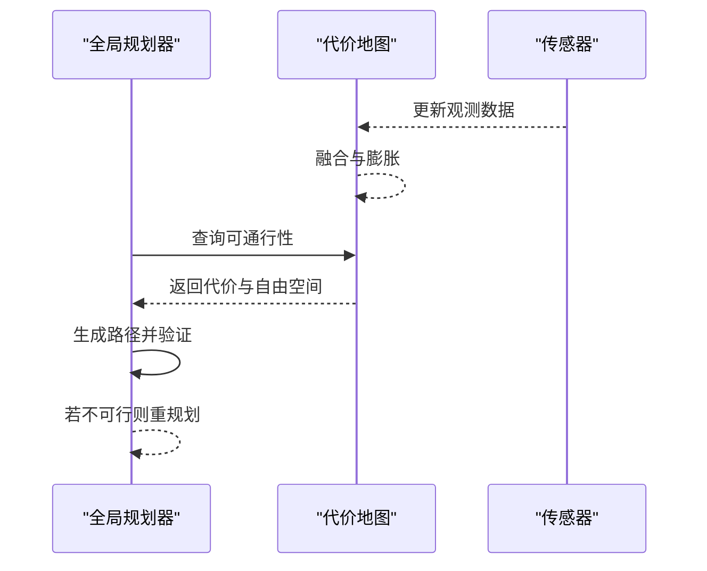
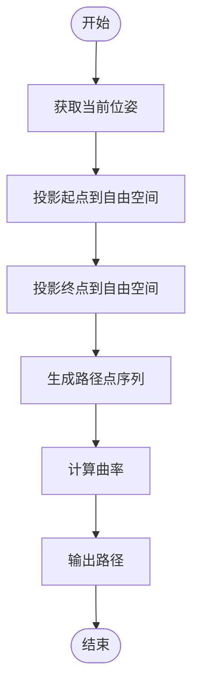
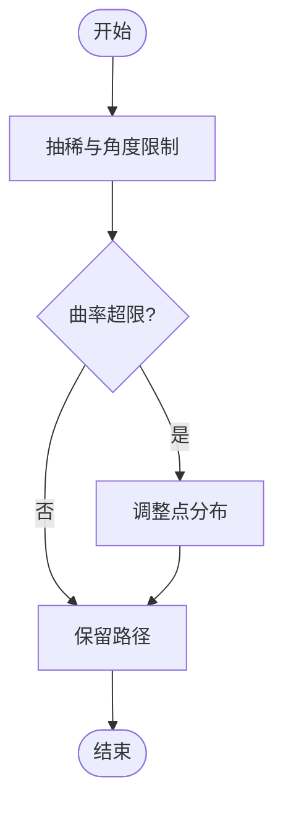
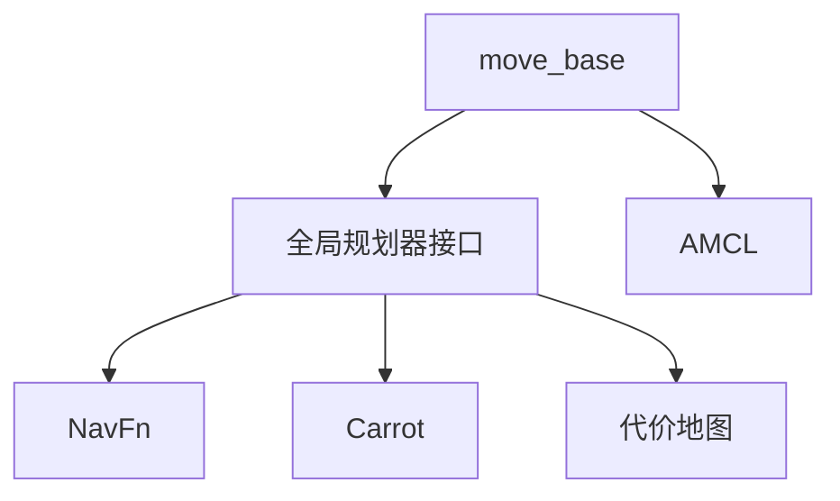

# 全局规划器

<cite>
**本文引用的文件**   
- [sebot_factory.launch](file://sebot_factory/src/sebot_factory/launch/sebot_factory.launch)
- [factory.cpp](file://sebot_factory/src/sebot_factory/src/factory.cpp)
- [CMakeLists.txt](file://sebot_factory/src/sebot_factory/CMakeLists.txt)
- [package.xml](file://sebot_factory/src/sebot_factory/package.xml)
- [global_planner_package.xml](file://sebot_ros_kits/src/sebot_navigation/global_planner/package.xml)
- [bgp_plugin.xml](file://sebot_ros_kits/src/sebot_navigation/global_planner/bgp_plugin.xml)
- [navfn_package.xml](file://sebot_ros_kits/src/sebot_navigation/navfn/package.xml)
- [carrot_package.xml](file://sebot_ros_kits/src/sebot_navigation/carrot_planner/package.xml)
- [move_base_package.xml](file://sebot_ros_kits/src/sebot_navigation/move_base/package.xml)
- [costmap_2d_package.xml](file://sebot_ros_kits/src/sebot_navigation/costmap_2d/package.xml)
- [amcl_package.xml](file://sebot_ros_kits/src/sebot_navigation/amcl/package.xml)
</cite>

## 目录
1. [简介](#简介)
2. [项目结构](#项目结构)
3. [核心组件](#核心组件)
4. [架构总览](#架构总览)
5. [详细组件分析](#详细组件分析)
6. [依赖关系分析](#依赖关系分析)
7. [性能考量](#性能考量)
8. [故障排查指南](#故障排查指南)
9. [结论](#结论)
10. [附录](#附录)

## 简介
本文件面向“全局规划器系统”的文档，聚焦于全局路径规划在机器人导航中的作用、算法选择（A*、Dijkstra、NavFn 等）、配置参数（规划频率、路径平滑、方向约束等）、路径生成与优化流程（起点终点处理、路径回溯、曲率计算）、与代价地图的交互（可通行区域判断、路径可行性验证），以及不同算法的性能对比、选择策略与参数调优方法。同时给出自定义全局规划器的开发接口与扩展方式，帮助读者快速理解并高效使用本项目中的全局规划能力。

## 项目结构
本项目由三个相互独立的 catkin 工作空间组成：
- sebot_factory：应用层业务节点（工厂订单、取件、确认、结算等）
- sebot_ros_kits：机器人套件与导航栈（包含 move_base、AMCL、全局/局部规划器、代价地图等）
- sebot_ros_stdr：仿真环境（STDR 模拟器及示例）

全局规划器相关代码主要位于 sebot_ros_kits 的 navigation 子包中，包括 global_planner、navfn、carrot_planner、move_base、costmap_2d 等。上层业务通过 launch 文件启动 move_base，并在其中选择具体全局规划器实现。

图表来源
- [sebot_factory.launch](file://sebot_factory/src/sebot_factory/launch/sebot_factory.launch)
- [factory.cpp](file://sebot_factory/src/sebot_factory/src/factory.cpp)
- [move_base_package.xml](file://sebot_ros_kits/src/sebot_navigation/move_base/package.xml)
- [global_planner_package.xml](file://sebot_ros_kits/src/sebot_navigation/global_planner/package.xml)
- [navfn_package.xml](file://sebot_ros_kits/src/sebot_navigation/navfn/package.xml)
- [carrot_package.xml](file://sebot_ros_kits/src/sebot_navigation/carrot_planner/package.xml)
- [costmap_2d_package.xml](file://sebot_ros_kits/src/sebot_navigation/costmap_2d/package.xml)
- [amcl_package.xml](file://sebot_ros_kits/src/sebot_navigation/amcl/package.xml)

章节来源
- [sebot_factory.launch](file://sebot_factory/src/sebot_factory/launch/sebot_factory.launch)
- [factory.cpp](file://sebot_factory/src/sebot_factory/src/factory.cpp)
- [CMakeLists.txt](file://sebot_factory/src/sebot_factory/CMakeLists.txt)
- [package.xml](file://sebot_factory/src/sebot_factory/package.xml)

## 核心组件
- 全局规划器接口（global_planner）：定义统一的全局路径规划插件接口，供 move_base 动态加载与调用。
- NavFn 规划器（navfn）：基于栅格代价地图的快速近似最短路径规划，适合静态或变化缓慢的环境。
- Carrot 规划器（carrot_planner）：轻量级直线插值规划器，常用于简单场景或作为基准。
- 代价地图（costmap_2d）：提供可通行性、膨胀、障碍物等信息，是全局规划的核心输入。
- 定位（AMCL）：为全局规划器提供机器人位姿估计，影响起点与路径质量。
- 移动基座（move_base）：协调全局/局部规划器与代价地图，驱动机器人执行路径。

章节来源
- [global_planner_package.xml](file://sebot_ros_kits/src/sebot_navigation/global_planner/package.xml)
- [navfn_package.xml](file://sebot_ros_kits/src/sebot_navigation/navfn/package.xml)
- [carrot_package.xml](file://sebot_ros_kits/src/sebot_navigation/carrot_planner/package.xml)
- [costmap_2d_package.xml](file://sebot_ros_kits/src/sebot_navigation/costmap_2d/package.xml)
- [amcl_package.xml](file://sebot_ros_kits/src/sebot_navigation/amcl/package.xml)
- [move_base_package.xml](file://sebot_ros_kits/src/sebot_navigation/move_base/package.xml)

## 架构总览
全局规划器在 move_base 框架下运行，接收目标点与当前位姿，查询代价地图的可通行信息，调用所选算法（如 NavFn）生成全局路径，再交由局部规划器跟踪。

图表来源
- [move_base_package.xml](file://sebot_ros_kits/src/sebot_navigation/move_base/package.xml)
- [global_planner_package.xml](file://sebot_ros_kits/src/sebot_navigation/global_planner/package.xml)
- [navfn_package.xml](file://sebot_ros_kits/src/sebot_navigation/navfn/package.xml)
- [carrot_package.xml](file://sebot_ros_kits/src/sebot_navigation/carrot_planner/package.xml)
- [costmap_2d_package.xml](file://sebot_ros_kits/src/sebot_navigation/costmap_2d/package.xml)
- [amcl_package.xml](file://sebot_ros_kits/src/sebot_navigation/amcl/package.xml)

## 详细组件分析

### 全局规划器接口与插件机制
- 接口职责：定义统一的规划函数签名、状态管理、参数加载与发布接口。
- 插件机制：通过 XML 配置文件注册具体实现（如 NavFn、Carrot），move_base 动态加载。
- 关键行为：
  - 初始化时读取参数（规划频率、平滑参数、方向约束等）。
  - 收到目标点后，检查起点/终点有效性，必要时进行投影到自由空间。
  - 调用具体算法生成路径，并进行基本可行性验证（是否穿越障碍、长度阈值等）。
  - 将路径以标准消息格式发布给下游模块。

图表来源
- [global_planner_package.xml](file://sebot_ros_kits/src/sebot_navigation/global_planner/package.xml)
- [navfn_package.xml](file://sebot_ros_kits/src/sebot_navigation/navfn/package.xml)
- [carrot_package.xml](file://sebot_ros_kits/src/sebot_navigation/carrot_planner/package.xml)

章节来源
- [global_planner_package.xml](file://sebot_ros_kits/src/sebot_navigation/global_planner/package.xml)
- [bgp_plugin.xml](file://sebot_ros_kits/src/sebot_navigation/global_planner/bgp_plugin.xml)

### NavFn 规划器（近似最短路径）
- 适用场景：静态或慢变地图，要求快速响应；对路径曲率要求不高。
- 算法特点：
  - 基于代价地图构建栅格图，采用近似传播或启发式搜索。
  - 路径回溯从目标点向起点推进，得到离散路径点序列。
  - 支持简单的路径平滑（如抽稀、角度限制）。
- 关键流程：
  - 输入：起点、终点、代价地图。
  - 构建代价网格，标记不可通行区域。
  - 搜索生成路径，回溯得到点列。
  - 输出：标准化路径消息。

图表来源
- [navfn_package.xml](file://sebot_ros_kits/src/sebot_navigation/navfn/package.xml)

章节来源
- [navfn_package.xml](file://sebot_ros_kits/src/sebot_navigation/navfn/package.xml)

### Carrot 规划器（直线插值）
- 适用场景：无障碍或简单环境，追求极低计算开销。
- 算法特点：
  - 直接连接起点与终点，按固定步长插值生成路径点。
  - 不进行复杂代价评估，需依赖代价地图进行后续可行性验证。
- 关键流程：
  - 输入：起点、终点。
  - 线性插值生成路径点。
  - 输出：标准化路径消息。

图表来源
- [carrot_package.xml](file://sebot_ros_kits/src/sebot_navigation/carrot_planner/package.xml)

章节来源
- [carrot_package.xml](file://sebot_ros_kits/src/sebot_navigation/carrot_planner/package.xml)

### 代价地图与全局规划器交互
- 可通行区域判断：全局规划器依据代价地图的“自由空间”与“膨胀层”判定路径是否安全。
- 路径可行性验证：生成路径后，检查是否穿越高代价或不可通行区域，必要时触发重规划。
- 更新机制：代价地图随传感器数据实时更新，全局规划器按需重新计算。

图表来源
- [costmap_2d_package.xml](file://sebot_ros_kits/src/sebot_navigation/costmap_2d/package.xml)

章节来源
- [costmap_2d_package.xml](file://sebot_ros_kits/src/sebot_navigation/costmap_2d/package.xml)

### 起点终点处理与路径回溯
- 起点处理：从 AMCL 获取当前位姿，必要时投影到自由空间以避免起点被障碍占据。
- 终点处理：目标点可能落在障碍上，需投影到最近自由空间点。
- 路径回溯：从目标点沿代价梯度或搜索树回溯至起点，形成离散路径点序列。
- 曲率计算：根据相邻点方向变化估算曲率，用于后续平滑与局部跟踪。

图表来源
- [amcl_package.xml](file://sebot_ros_kits/src/sebot_navigation/amcl/package.xml)
- [navfn_package.xml](file://sebot_ros_kits/src/sebot_navigation/navfn/package.xml)

章节来源
- [amcl_package.xml](file://sebot_ros_kits/src/sebot_navigation/amcl/package.xml)
- [navfn_package.xml](file://sebot_ros_kits/src/sebot_navigation/navfn/package.xml)

### 路径平滑与方向约束
- 平滑策略：抽稀冗余点、角度限制、曲率阈值过滤。
- 方向约束：考虑机器人运动学（如差速/全向），限制转向角或最小转弯半径。
- 效果：提升路径可跟踪性，减少局部规划压力。

图表来源
- [navfn_package.xml](file://sebot_ros_kits/src/sebot_navigation/navfn/package.xml)

章节来源
- [navfn_package.xml](file://sebot_ros_kits/src/sebot_navigation/navfn/package.xml)

### 与 move_base 的集成与参数配置
- 规划频率：控制全局规划的重规划周期，避免频繁计算。
- 路径平滑参数：平滑强度、角度阈值、曲率阈值等。
- 方向约束：最小转弯半径、最大转向角等。
- 可行性验证：路径长度阈值、最大允许代价、重规划触发条件。

章节来源
- [move_base_package.xml](file://sebot_ros_kits/src/sebot_navigation/move_base/package.xml)
- [sebot_factory.launch](file://sebot_factory/src/sebot_factory/launch/sebot_factory.launch)

## 依赖关系分析
全局规划器依赖代价地图与定位信息，受 move_base 调度，并通过插件机制加载具体算法实现。

图表来源
- [move_base_package.xml](file://sebot_ros_kits/src/sebot_navigation/move_base/package.xml)
- [global_planner_package.xml](file://sebot_ros_kits/src/sebot_navigation/global_planner/package.xml)
- [navfn_package.xml](file://sebot_ros_kits/src/sebot_navigation/navfn/package.xml)
- [carrot_package.xml](file://sebot_ros_kits/src/sebot_navigation/carrot_planner/package.xml)
- [costmap_2d_package.xml](file://sebot_ros_kits/src/sebot_navigation/costmap_2d/package.xml)
- [amcl_package.xml](file://sebot_ros_kits/src/sebot_navigation/amcl/package.xml)

章节来源
- [move_base_package.xml](file://sebot_ros_kits/src/sebot_navigation/move_base/package.xml)
- [global_planner_package.xml](file://sebot_ros_kits/src/sebot_navigation/global_planner/package.xml)
- [navfn_package.xml](file://sebot_ros_kits/src/sebot_navigation/navfn/package.xml)
- [carrot_package.xml](file://sebot_ros_kits/src/sebot_navigation/carrot_planner/package.xml)
- [costmap_2d_package.xml](file://sebot_ros_kits/src/sebot_navigation/costmap_2d/package.xml)
- [amcl_package.xml](file://sebot_ros_kits/src/sebot_navigation/amcl/package.xml)

## 性能考量
- 算法复杂度：
  - NavFn：近似最短路径，时间复杂度与栅格规模相关，适合中等规模地图。
  - Carrot：O(n) 插值，计算开销极低，但缺乏代价感知。
- 内存占用：代价地图大小直接影响内存与计算量。
- 实时性：规划频率与路径长度影响整体响应时间。
- 可扩展性：插件机制便于引入更高效算法（如 A*/Dijkstra 的改进实现）。

[本节为通用指导，不直接分析具体文件]

## 故障排查指南
- 常见问题：
  - 路径不可行：检查代价地图是否正确更新、起点/终点投影是否成功。
  - 规划超时：降低规划频率、简化地图分辨率或启用更高效的算法。
  - 路径抖动：调整平滑参数与方向约束，提高局部跟踪稳定性。
- 调试建议：
  - 可视化代价地图与路径，观察障碍与膨胀层设置。
  - 记录规划耗时与路径长度，定位瓶颈。
  - 切换不同全局规划器对比性能。

章节来源
- [sebot_factory.launch](file://sebot_factory/src/sebot_factory/launch/sebot_factory.launch)
- [factory.cpp](file://sebot_factory/src/sebot_factory/src/factory.cpp)

## 结论
全局规划器是导航栈的核心组件，负责在代价地图基础上生成安全、可行的全局路径。选择合适的算法（NavFn、Carrot 或自定义 A*/Dijkstra）与合理配置参数（规划频率、平滑、方向约束）是保证导航性能的关键。通过插件机制与 move_base 集成，开发者可灵活扩展与优化全局规划能力，满足不同场景需求。

[本节为总结，不直接分析具体文件]

## 附录
- 自定义全局规划器开发要点：
  - 实现全局规划器接口，遵循参数加载与消息发布规范。
  - 在 XML 插件配置中注册新算法，确保 move_base 可动态加载。
  - 充分测试起点/终点投影、路径可行性验证与平滑策略。
  - 结合代价地图与定位信息进行鲁棒性验证。

章节来源
- [global_planner_package.xml](file://sebot_ros_kits/src/sebot_navigation/global_planner/package.xml)
- [bgp_plugin.xml](file://sebot_ros_kits/src/sebot_navigation/global_planner/bgp_plugin.xml)