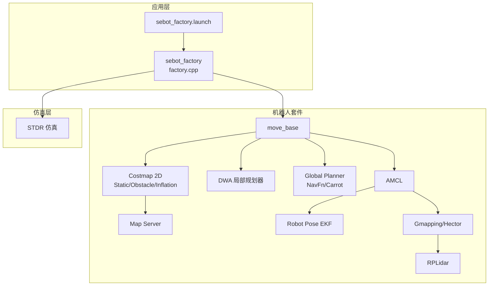
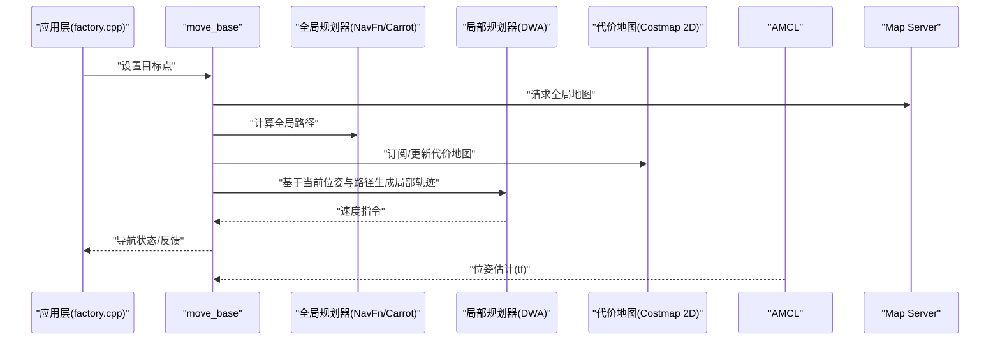
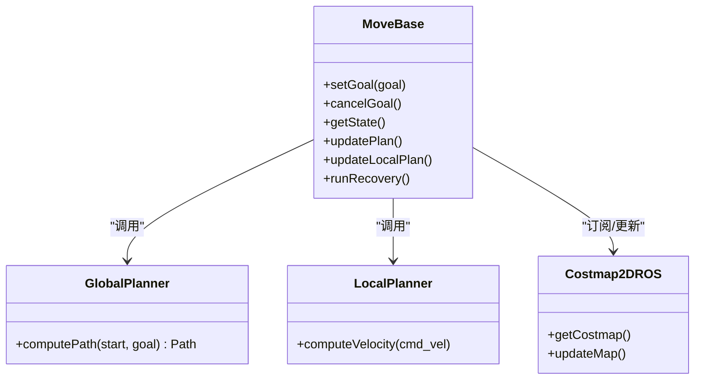
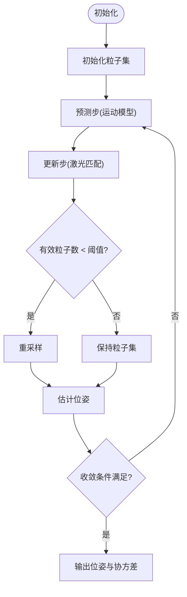
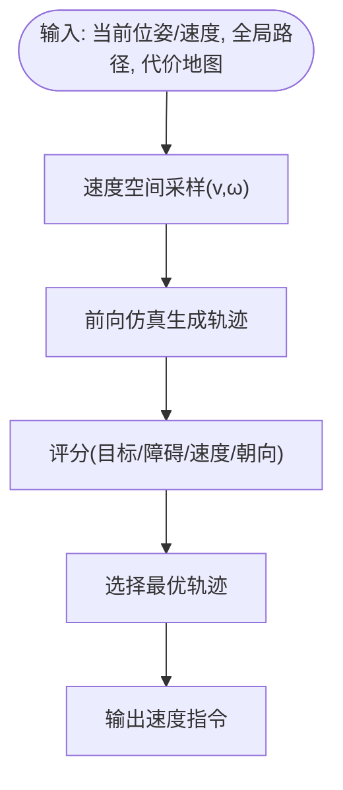
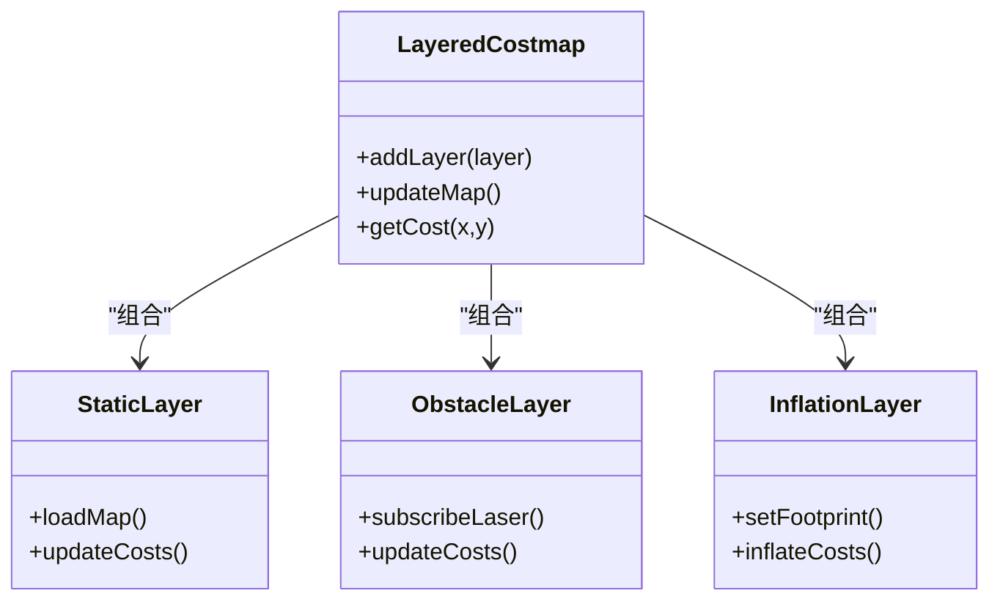
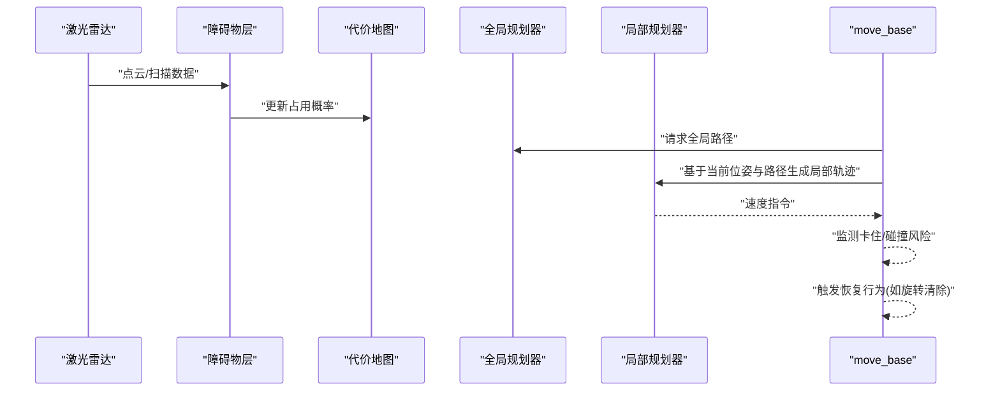
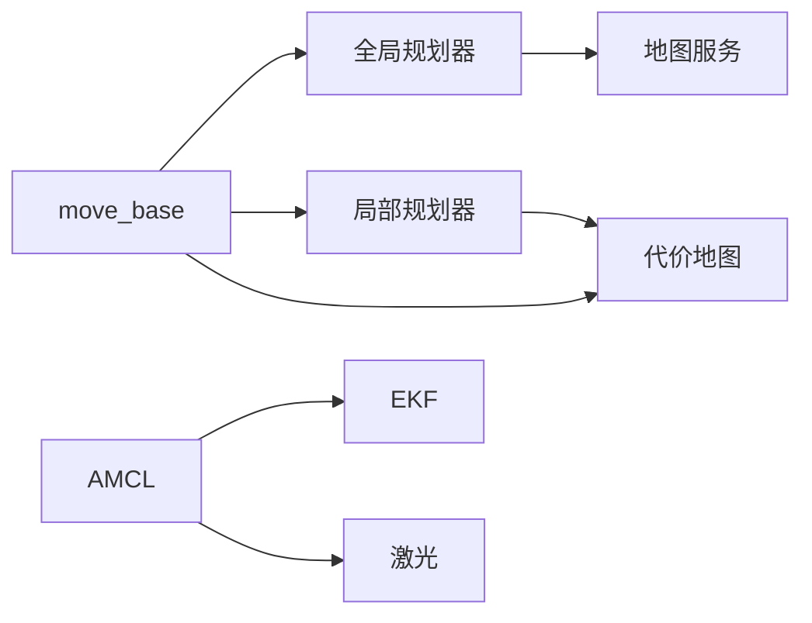

# 导航系统

<cite>
**本文引用的文件**   
- [sebot_factory.launch](file://sebot_factory/src/sebot_factory/launch/sebot_factory.launch)
- [factory.cpp](file://sebot_factory/src/sebot_factory/src/factory.cpp)
- [amcl_node.cpp](file://sebot_ros_kits/src/sebot_navigation/amcl/src/amcl_node.cpp)
- [costmap_2d_ros.h](file://sebot_ros_kits/src/sebot_navigation/costmap_2d/include/costmap_2d/costmap_2d_ros.h)
- [layered_costmap.h](file://sebot_ros_kits/src/sebot_navigation/costmap_2d/include/costmap_2d/layered_costmap.h)
- [obstacle_layer.h](file://sebot_ros_kits/src/sebot_navigation/costmap_2d/include/costmap_2d/obstacle_layer.h)
- [static_layer.h](file://sebot_ros_kits/src/sebot_navigation/costmap_2d/include/costmap_2d/static_layer.h)
- [inflation_layer.h](file://sebot_ros_kits/src/sebot_navigation/costmap_2d/include/costmap_2d/inflation_layer.h)
- [dwa_local_planner.h](file://sebot_ros_kits/src/sebot_navigation/dwa_local_planner/include/dwa_local_planner/dwa_local_planner.h)
- [move_base.h](file://sebot_ros_kits/src/sebot_navigation/move_base/include/move_base/move_base.h)
- [navfn.h](file://sebot_ros_kits/src/sebot_navigation/navfn/include/navfn/navfn.h)
- [carrot_planner.h](file://sebot_ros_kits/src/sebot_navigation/carrot_planner/include/carrot_planner/carrot_planner.h)
- [gmapping.launch](file://sebot_ros_kits/src/sebot_slam/slam_gmapping/launch/gmapping.launch)
- [robot_pose_ekf.launch](file://sebot_ros_kits/src/sebot_driver/robot_pose_ekf/launch/robot_pose_ekf.launch)
</cite>

## 目录
1. [简介](#简介)
2. [项目结构](#项目结构)
3. [核心组件](#核心组件)
4. [架构总览](#架构总览)
5. [详细组件分析](#详细组件分析)
6. [依赖关系分析](#依赖关系分析)
7. [性能考虑](#性能考虑)
8. [故障排查指南](#故障排查指南)
9. [结论](#结论)
10. [附录](#附录)

## 简介
本仓库由三个相互独立的 catkin 工作空间组成：应用层 sebot_factory、机器人套件 sebot_ros_kits、仿真层 sebot_ros_stdr。导航系统基于 ROS 1 + move_base 框架，采用 AMCL 粒子滤波定位与 DWA 局部规划器，配合 costmap_2d 代价地图进行全局/局部路径规划与避障。建图可选 Gmapping/Hector，里程计融合使用 robot_pose_ekf。主业务状态机位于 sebot_factory 的 factory.cpp，通过 launch 配置切换仿真模式与调试开关，并集中管理导航超时、PID、取件距离、补扫等关键参数。

## 项目结构
- 应用层（sebot_factory）：包含工厂业务节点与启动脚本，负责订单驱动的多阶段导航与任务编排。
- 机器人套件（sebot_ros_kits）：集成 move_base、AMCL、DWA、costmap_2d、map_server、slam_gmapping/hector、robot_pose_ekf、rplidar_ros 等导航相关包。
- 仿真层（sebot_ros_stdr）：提供 STDR 仿真环境及对应的 move_base 配置与启动脚本。

图表来源
- [sebot_factory.launch](file://sebot_factory/src/sebot_factory/launch/sebot_factory.launch)
- [move_base.h](file://sebot_ros_kits/src/sebot_navigation/move_base/include/move_base/move_base.h)
- [amcl_node.cpp](file://sebot_ros_kits/src/sebot_navigation/amcl/src/amcl_node.cpp)
- [dwa_local_planner.h](file://sebot_ros_kits/src/sebot_navigation/dwa_local_planner/include/dwa_local_planner/dwa_local_planner.h)
- [navfn.h](file://sebot_ros_kits/src/sebot_navigation/navfn/include/navfn/navfn.h)
- [carrot_planner.h](file://sebot_ros_kits/src/sebot_navigation/carrot_planner/include/carrot_planner/carrot_planner.h)
- [costmap_2d_ros.h](file://sebot_ros_kits/src/sebot_navigation/costmap_2d/include/costmap_2d/costmap_2d_ros.h)
- [gmapping.launch](file://sebot_ros_kits/src/sebot_slam/slam_gmapping/launch/gmapping.launch)
- [robot_pose_ekf.launch](file://sebot_ros_kits/src/sebot_driver/robot_pose_ekf/launch/robot_pose_ekf.launch)

章节来源
- [sebot_factory.launch](file://sebot_factory/src/sebot_factory/launch/sebot_factory.launch)
- [factory.cpp](file://sebot_factory/src/sebot_factory/src/factory.cpp)

## 核心组件
- move_base：导航协调器，负责全局/局部规划器选择、代价地图更新、恢复行为与目标管理。
- AMCL：基于粒子滤波的定位器，订阅激光与里程计，估计位姿并发布 tf。
- DWA：局部轨迹生成与评分优化，输出速度指令以避开动态障碍。
- Costmap 2D：多层代价地图（静态、障碍物、膨胀），为规划器提供可通行性信息。
- Global Planner：NavFn/Carrot 等全局路径规划算法，生成粗路径供 DWA 跟踪。
- Map Server：加载/发布栅格地图。
- SLAM：Gmapping/Hector 在线建图。
- Robot Pose EKF：融合 IMU、轮式里程计与激光测距，提升位姿估计精度。

章节来源
- [move_base.h](file://sebot_ros_kits/src/sebot_navigation/move_base/include/move_base/move_base.h)
- [amcl_node.cpp](file://sebot_ros_kits/src/sebot_navigation/amcl/src/amcl_node.cpp)
- [dwa_local_planner.h](file://sebot_ros_kits/src/sebot_navigation/dwa_local_planner/include/dwa_local_planner/dwa_local_planner.h)
- [costmap_2d_ros.h](file://sebot_ros_kits/src/sebot_navigation/costmap_2d/include/costmap_2d/costmap_2d_ros.h)
- [navfn.h](file://sebot_ros_kits/src/sebot_navigation/navfn/include/navfn/navfn.h)
- [carrot_planner.h](file://sebot_ros_kits/src/sebot_navigation/carrot_planner/include/carrot_planner/carrot_planner.h)

## 架构总览
move_base 作为中枢，协调 AMCL 定位、全局/局部规划与代价地图更新；上层 factory.cpp 根据订单驱动导航流程，并在必要时触发视觉与机械臂动作。

图表来源
- [move_base.h](file://sebot_ros_kits/src/sebot_navigation/move_base/include/move_base/move_base.h)
- [amcl_node.cpp](file://sebot_ros_kits/src/sebot_navigation/amcl/src/amcl_node.cpp)
- [costmap_2d_ros.h](file://sebot_ros_kits/src/sebot_navigation/costmap_2d/include/costmap_2d/costmap_2d_ros.h)
- [navfn.h](file://sebot_ros_kits/src/sebot_navigation/navfn/include/navfn/navfn.h)
- [carrot_planner.h](file://sebot_ros_kits/src/sebot_navigation/carrot_planner/include/carrot_planner/carrot_planner.h)

## 详细组件分析

### move_base 导航框架集成与配置
- 角色与职责：接收目标点、维护全局/局部规划器实例、周期更新代价地图、执行恢复策略（如旋转清除）。
- 关键接口：目标设置、取消、状态查询、恢复行为注册。
- 典型参数：全局/局部规划器选择、代价地图尺寸与分辨率、更新频率、恢复行为阈值。

图表来源
- [move_base.h](file://sebot_ros_kits/src/sebot_navigation/move_base/include/move_base/move_base.h)
- [costmap_2d_ros.h](file://sebot_ros_kits/src/sebot_navigation/costmap_2d/include/costmap_2d/costmap_2d_ros.h)

章节来源
- [move_base.h](file://sebot_ros_kits/src/sebot_navigation/move_base/include/move_base/move_base.h)

### AMCL 粒子滤波定位原理与参数调优
- 原理：基于粒子集表示位姿分布，利用激光匹配与运动模型更新权重，周期性重采样以保持有效粒子数。
- 初始定位：支持手动设置或自动全局搜索；建议结合地图质量与传感器噪声调整初始粒子数量与范围。
- 重采样策略：按权重归一化后抽样，避免退化；需平衡收敛速度与多样性。
- 收敛条件：粒子阈值、最小有效粒子数、观测似然阈值；过严导致震荡，过松导致漂移。
- 关键参数：粒子数、最大/最小距离误差、角度误差、重采样阈值、激光匹配参数、里程计噪声模型。

图表来源
- [amcl_node.cpp](file://sebot_ros_kits/src/sebot_navigation/amcl/src/amcl_node.cpp)

章节来源
- [amcl_node.cpp](file://sebot_ros_kits/src/sebot_navigation/amcl/src/amcl_node.cpp)

### DWA 局部规划器的轨迹生成与优化
- 轨迹生成：在速度空间内采样 (v, ω)，对每个候选轨迹进行前向仿真，评估可达性与碰撞风险。
- 评分函数：综合目标导向、障碍物距离、速度平滑度、朝向误差等指标。
- 优化策略：滚动时间窗口内选择最优速度指令，保证实时性与安全性。
- 关键参数：最大/最小线速度、角速度、加速度限制、轨迹采样步长、评分权重、机器人足迹。

图表来源
- [dwa_local_planner.h](file://sebot_ros_kits/src/sebot_navigation/dwa_local_planner/include/dwa_local_planner/dwa_local_planner.h)

章节来源
- [dwa_local_planner.h](file://sebot_ros_kits/src/sebot_navigation/dwa_local_planner/include/dwa_local_planner/dwa_local_planner.h)

### 代价地图管理机制（静态层、动态层、膨胀层）
- 静态层：加载地图服务器发布的栅格地图，定义不可通行区域与自由区域。
- 动态层（障碍物层）：订阅激光/深度数据，实时更新动态障碍物的占用概率。
- 膨胀层：根据机器人足迹与安全距离对代价进行膨胀，确保规划安全裕度。
- 更新机制：分层独立更新，合并为最终代价地图供规划器使用。

图表来源
- [layered_costmap.h](file://sebot_ros_kits/src/sebot_navigation/costmap_2d/include/costmap_2d/layered_costmap.h)
- [static_layer.h](file://sebot_ros_kits/src/sebot_navigation/costmap_2d/include/costmap_2d/static_layer.h)
- [obstacle_layer.h](file://sebot_ros_kits/src/sebot_navigation/costmap_2d/include/costmap_2d/obstacle_layer.h)
- [inflation_layer.h](file://sebot_ros_kits/src/sebot_navigation/costmap_2d/include/costmap_2d/inflation_layer.h)

章节来源
- [costmap_2d_ros.h](file://sebot_ros_kits/src/sebot_navigation/costmap_2d/include/costmap_2d/costmap_2d_ros.h)
- [layered_costmap.h](file://sebot_ros_kits/src/sebot_navigation/costmap_2d/include/costmap_2d/layered_costmap.h)
- [static_layer.h](file://sebot_ros_kits/src/sebot_navigation/costmap_2d/include/costmap_2d/static_layer.h)
- [obstacle_layer.h](file://sebot_ros_kits/src/sebot_navigation/costmap_2d/include/costmap_2d/obstacle_layer.h)
- [inflation_layer.h](file://sebot_ros_kits/src/sebot_navigation/costmap_2d/include/costmap_2d/inflation_layer.h)

### 导航过程中的障碍物检测、路径规划与避障策略
- 障碍物检测：激光扫描经坐标变换投影到代价地图，动态层实时更新占用概率。
- 路径规划：全局规划器依据静态地图生成粗路径，局部规划器在滚动窗口内优化轨迹。
- 避障策略：DWA 通过评分函数抑制靠近障碍物的轨迹；膨胀层提供安全边界；必要时触发恢复行为（如原地旋转清除）。

图表来源
- [obstacle_layer.h](file://sebot_ros_kits/src/sebot_navigation/costmap_2d/include/costmap_2d/obstacle_layer.h)
- [costmap_2d_ros.h](file://sebot_ros_kits/src/sebot_navigation/costmap_2d/include/costmap_2d/costmap_2d_ros.h)
- [navfn.h](file://sebot_ros_kits/src/sebot_navigation/navfn/include/navfn/navfn.h)
- [carrot_planner.h](file://sebot_ros_kits/src/sebot_navigation/carrot_planner/include/carrot_planner/carrot_planner.h)
- [move_base.h](file://sebot_ros_kits/src/sebot_navigation/move_base/include/move_base/move_base.h)

章节来源
- [obstacle_layer.h](file://sebot_ros_kits/src/sebot_navigation/costmap_2d/include/costmap_2d/obstacle_layer.h)
- [costmap_2d_ros.h](file://sebot_ros_kits/src/sebot_navigation/costmap_2d/include/costmap_2d/costmap_2d_ros.h)
- [navfn.h](file://sebot_ros_kits/src/sebot_navigation/navfn/include/navfn/navfn.h)
- [carrot_planner.h](file://sebot_ros_kits/src/sebot_navigation/carrot_planner/include/carrot_planner/carrot_planner.h)
- [move_base.h](file://sebot_ros_kits/src/sebot_navigation/move_base/include/move_base/move_base.h)

### 全局规划器与局部规划器选择与配置
- 全局规划器：NavFn（势场法）、Carrot（简单追踪）等，适用于不同场景与性能需求。
- 局部规划器：DWA 在动态环境中表现稳健，适合移动机器人。
- 配置要点：分辨率、膨胀半径、轨迹采样步长、评分权重、机器人动力学约束。

章节来源
- [navfn.h](file://sebot_ros_kits/src/sebot_navigation/navfn/include/navfn/navfn.h)
- [carrot_planner.h](file://sebot_ros_kits/src/sebot_navigation/carrot_planner/include/carrot_planner/carrot_planner.h)
- [dwa_local_planner.h](file://sebot_ros_kits/src/sebot_navigation/dwa_local_planner/include/dwa_local_planner/dwa_local_planner.h)

### 建图与定位集成（Gmapping/Hector + AMCL + EKF）
- 建图：Gmapping/Hector 在线构建栅格地图，输出 map 主题。
- 定位：AMCL 订阅激光与里程计，发布位姿与 tf。
- 融合：robot_pose_ekf 融合 IMU、轮式里程计与激光测距，提高位姿估计鲁棒性。

章节来源
- [gmapping.launch](file://sebot_ros_kits/src/sebot_slam/slam_gmapping/launch/gmapping.launch)
- [robot_pose_ekf.launch](file://sebot_ros_kits/src/sebot_driver/robot_pose_ekf/launch/robot_pose_ekf.launch)
- [amcl_node.cpp](file://sebot_ros_kits/src/sebot_navigation/amcl/src/amcl_node.cpp)

## 依赖关系分析
- move_base 依赖全局/局部规划器与代价地图；AMCL 依赖里程计与激光；DWA 依赖代价地图与机器人模型；EKF 依赖多源传感器。
- 耦合点：tf 坐标系、map 主题、激光主题、位姿主题。
- 潜在循环：应避免规划器与代价地图之间的直接循环订阅，通常通过 move_base 协调。

图表来源
- [move_base.h](file://sebot_ros_kits/src/sebot_navigation/move_base/include/move_base/move_base.h)
- [amcl_node.cpp](file://sebot_ros_kits/src/sebot_navigation/amcl/src/amcl_node.cpp)
- [costmap_2d_ros.h](file://sebot_ros_kits/src/sebot_navigation/costmap_2d/include/costmap_2d/costmap_2d_ros.h)

章节来源
- [move_base.h](file://sebot_ros_kits/src/sebot_navigation/move_base/include/move_base/move_base.h)
- [amcl_node.cpp](file://sebot_ros_kits/src/sebot_navigation/amcl/src/amcl_node.cpp)
- [costmap_2d_ros.h](file://sebot_ros_kits/src/sebot_navigation/costmap_2d/include/costmap_2d/costmap_2d_ros.h)

## 性能考虑
- 代价地图分辨率与更新频率：高分辨率提升精度但增加计算量；合理设置更新频率以平衡实时性。
- 粒子数量与重采样阈值：过多粒子影响定位速度，过少导致定位不稳定。
- DWA 采样步长与窗口长度：影响轨迹质量与计算开销。
- 传感器噪声模型：准确建模能显著提升定位与规划效果。
- 恢复行为阈值：避免频繁触发恢复导致效率下降。

## 故障排查指南
- 定位发散：检查 AMCL 粒子数、激光匹配参数、里程计噪声模型；确认 tf 树正确。
- 频繁卡住：调整膨胀层半径、DWA 评分权重、障碍物层更新频率；检查激光遮挡。
- 全局路径不合理：验证静态地图质量、全局规划器参数、机器人足迹。
- 导航超时：检查 move_base 超时参数、恢复行为配置、目标可达性。
- 建图漂移：校准 IMU 与轮式里程计，调整 EKF 融合参数。

章节来源
- [amcl_node.cpp](file://sebot_ros_kits/src/sebot_navigation/amcl/src/amcl_node.cpp)
- [costmap_2d_ros.h](file://sebot_ros_kits/src/sebot_navigation/costmap_2d/include/costmap_2d/costmap_2d_ros.h)
- [move_base.h](file://sebot_ros_kits/src/sebot_navigation/move_base/include/move_base/move_base.h)

## 结论
本项目导航系统以 move_base 为核心，结合 AMCL 定位、DWA 局部规划与 costmap_2d 代价地图，形成完整的自主导航能力。上层 factory.cpp 通过 launch 配置驱动业务流程，兼顾仿真与实机运行。通过合理调参与故障排查，可在复杂环境中实现稳定高效的导航。

## 附录
- 关键参数配置表（示例类别）
  - AMCL：粒子数、最大/最小距离误差、角度误差、重采样阈值、激光匹配参数、里程计噪声模型。
  - DWA：最大/最小线速度、角速度、加速度限制、轨迹采样步长、评分权重、机器人足迹。
  - Costmap：分辨率、膨胀半径、更新频率、静态地图源、障碍物层订阅主题。
  - move_base：全局/局部规划器选择、超时参数、恢复行为阈值、目标到达容差。
  - EKF：IMU/里程计/激光权重、噪声协方差、融合频率。
- 导航流程图（高层）
  - 上电自检 → 加载地图与 AMCL 定位 → 按订单导航至取件台 → 需求确认 → 视觉搜索 → 机械臂抓取 → 导航送达并结算。

章节来源
- [sebot_factory.launch](file://sebot_factory/src/sebot_factory/launch/sebot_factory.launch)
- [factory.cpp](file://sebot_factory/src/sebot_factory/src/factory.cpp)