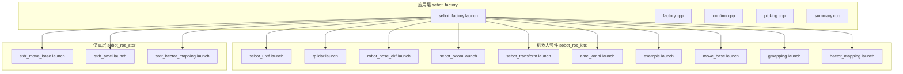
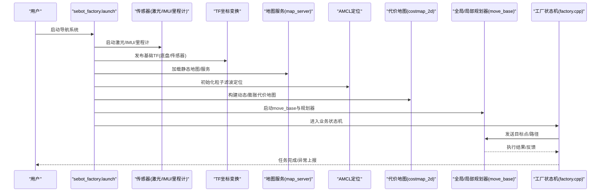
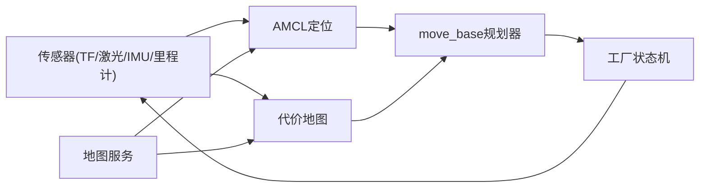
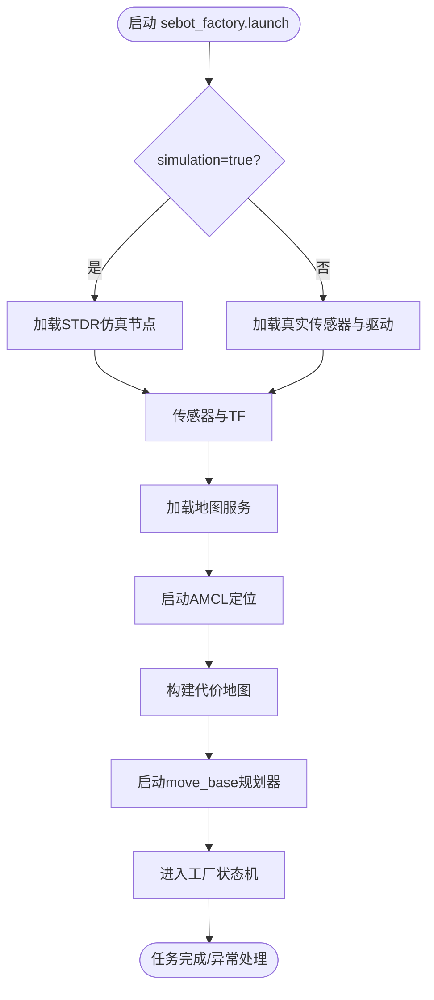

# 导航配置与部署

<cite>
**本文引用的文件**   
- [sebot_factory.launch](file://sebot_factory/src/sebot_factory/launch/sebot_factory.launch)
- [factory.cpp](file://sebot_factory/src/sebot_factory/src/factory.cpp)
- [confirm.cpp](file://sebot_factory/src/sebot_factory/src/confirm.cpp)
- [picking.cpp](file://sebot_factory/src/sebot_factory/src/picking.cpp)
- [summary.cpp](file://sebot_factory/src/sebot_factory/src/summary.cpp)
- [sebot_urdf.launch](file://sebot_ros_kits/src/sebot_driver/sebot_urdf/launch/sebot_urdf.launch)
- [rplidar.launch](file://sebot_ros_kits/src/sebot_driver/rplidar_ros/launch/rplidar.launch)
- [robot_pose_ekf.launch](file://sebot_ros_kits/src/sebot_driver/robot_pose_ekf/launch/robot_pose_ekf.launch)
- [sebot_odom.launch](file://sebot_ros_kits/src/sebot_robot/launch/sebot_odom.launch)
- [sebot_transform.launch](file://sebot_ros_kits/src/sebot_robot/launch/sebot_transform.launch)
- [amcl_omni.launch](file://sebot_ros_kits/src/sebot_navigation/amcl/examples/amcl_omni.launch)
- [example.launch](file://sebot_ros_kits/src/sebot_navigation/costmap_2d/launch/example.launch)
- [move_base.launch](file://sebot_ros_kits/src/sebot_navigation/move_base/launch/move_base.launch)
- [gmapping.launch](file://sebot_ros_kits/src/sebot_slam/sebot_slam/launch/gmapping.launch)
- [hector_mapping.launch](file://sebot_ros_kits/src/sebot_slam/slam_hector/hector_slam_launch/launch/hector_mapping.launch)
- [stdr_move_base.launch](file://sebot_ros_stdr/src/sebot_stdr/stdr_move_base/launch/stdr_move_base.launch)
- [stdr_amcl.launch](file://sebot_ros_stdr/src/sebot_stdr/stdr_amcl/launch/stdr_amcl.launch)
- [stdr_hector_mapping.launch](file://sebot_ros_stdr/src/sebot_stdr/stdr_hector_mapping/launch/stdr_hector_mapping.launch)
- [sebot_navigation.rviz](file://sebot_ros_kits/src/sebot_navigation/sebot_navigation/rviz/sebot_navigation.rviz)
</cite>

## 目录
1. [简介](#简介)
2. [项目结构](#项目结构)
3. [核心组件](#核心组件)
4. [架构总览](#架构总览)
5. [详细组件分析](#详细组件分析)
6. [依赖关系分析](#依赖关系分析)
7. [性能考虑](#性能考虑)
8. [故障排除指南](#故障排除指南)
9. [结论](#结论)
10. [附录](#附录)

## 简介
本文件面向“导航系统配置与部署”，围绕 sebot_factory（应用层）、sebot_ros_kits（机器人套件）与 sebot_ros_stdr（仿真层）三层工作空间，系统化说明：
- launch 文件组织、参数文件管理与环境变量设置
- move_base 主配置文件的关键参数（全局规划器、局部规划器、恢复行为等）
- 不同运行模式（仿真、真实机器人、调试）的配置差异
- 启动流程与依赖（TF 坐标变换、传感器数据发布、地图服务加载）
- 完整配置模板、参数说明表与故障排除
- 性能调优建议与监控方法

## 项目结构
本项目由三个相互独立的 catkin 工作空间组成，各自含 src/ 且需分别 catkin_make。导航相关能力主要分布在：
- sebot_factory：业务状态机与上层控制（factory.cpp、confirm.cpp、picking.cpp、summary.cpp），以及统一入口 launch（sebot_factory.launch）
- sebot_ros_kits：驱动与导航栈集成（URDF、RPLidar、EKF 里程计融合、AMCL、costmap_2d、move_base、SLAM Gmapping/Hector）
- sebot_ros_stdr：STDR 仿真环境（STDR AMCL、STDR Move Base、STDR Hector Mapping、STDR Launchers）

图表来源
- [sebot_factory.launch](file://sebot_factory/src/sebot_factory/launch/sebot_factory.launch)
- [sebot_urdf.launch](file://sebot_ros_kits/src/sebot_driver/sebot_urdf/launch/sebot_urdf.launch)
- [rplidar.launch](file://sebot_ros_kits/src/sebot_driver/rplidar_ros/launch/rplidar.launch)
- [robot_pose_ekf.launch](file://sebot_ros_kits/src/sebot_driver/robot_pose_ekf/launch/robot_pose_ekf.launch)
- [sebot_odom.launch](file://sebot_ros_kits/src/sebot_robot/launch/sebot_odom.launch)
- [sebot_transform.launch](file://sebot_ros_kits/src/sebot_robot/launch/sebot_transform.launch)
- [amcl_omni.launch](file://sebot_ros_kits/src/sebot_navigation/amcl/examples/amcl_omni.launch)
- [example.launch](file://sebot_ros_kits/src/sebot_navigation/costmap_2d/launch/example.launch)
- [move_base.launch](file://sebot_ros_kits/src/sebot_navigation/move_base/launch/move_base.launch)
- [gmapping.launch](file://sebot_ros_kits/src/sebot_slam/sebot_slam/launch/gmapping.launch)
- [hector_mapping.launch](file://sebot_ros_kits/src/sebot_slam/slam_hector/hector_slam_launch/launch/hector_mapping.launch)
- [stdr_move_base.launch](file://sebot_ros_stdr/src/sebot_stdr/stdr_move_base/launch/stdr_move_base.launch)
- [stdr_amcl.launch](file://sebot_ros_stdr/src/sebot_stdr/stdr_amcl/launch/stdr_amcl.launch)
- [stdr_hector_mapping.launch](file://sebot_ros_stdr/src/sebot_stdr/stdr_hector_mapping/launch/stdr_hector_mapping.launch)

章节来源
- [sebot_factory.launch](file://sebot_factory/src/sebot_factory/launch/sebot_factory.launch)
- [factory.cpp](file://sebot_factory/src/sebot_factory/src/factory.cpp)

## 核心组件
- 应用层状态机与任务编排
  - factory.cpp：实现 MultiNavi 主状态机，串联建图/定位、导航取件、需求确认、视觉搜索、机械臂抓取、送达结算等阶段
  - confirm.cpp：需求确认节点，负责与上层交互或传感器信号确认
  - picking.cpp：智能取件逻辑，协调视觉与机械臂动作
  - summary.cpp：结算汇总，输出订单完成统计
- 驱动与传感器
  - sebot_urdf.launch：加载 URDF 模型与关节状态
  - rplidar.launch：发布激光雷达扫描数据
  - robot_pose_ekf.launch：融合 IMU 与里程计，输出稳定位姿
  - sebot_odom.launch / sebot_transform.launch：发布里程计与 TF 变换
- 定位与建图
  - amcl_omni.launch：基于 AMCL 的粒子滤波定位
  - gmapping.launch / hector_mapping.launch：Gmapping/Hector SLAM 建图
- 导航栈
  - costmap_2d example.launch：二维代价地图示例
  - move_base.launch：move_base 主节点与默认参数加载
- 仿真环境
  - stdr_*：STDR 仿真中的 AMCL、Move Base、Hector Mapping 启动脚本

章节来源
- [factory.cpp](file://sebot_factory/src/sebot_factory/src/factory.cpp)
- [confirm.cpp](file://sebot_factory/src/sebot_factory/src/confirm.cpp)
- [picking.cpp](file://sebot_factory/src/sebot_factory/src/picking.cpp)
- [summary.cpp](file://sebot_factory/src/sebot_factory/src/summary.cpp)
- [sebot_urdf.launch](file://sebot_ros_kits/src/sebot_driver/sebot_urdf/launch/sebot_urdf.launch)
- [rplidar.launch](file://sebot_ros_kits/src/sebot_driver/rplidar_ros/launch/rplidar.launch)
- [robot_pose_ekf.launch](file://sebot_ros_kits/src/sebot_driver/robot_pose_ekf/launch/robot_pose_ekf.launch)
- [sebot_odom.launch](file://sebot_ros_kits/src/sebot_robot/launch/sebot_odom.launch)
- [sebot_transform.launch](file://sebot_ros_kits/src/sebot_robot/launch/sebot_transform.launch)
- [amcl_omni.launch](file://sebot_ros_kits/src/sebot_navigation/amcl/examples/amcl_omni.launch)
- [gmapping.launch](file://sebot_ros_kits/src/sebot_slam/sebot_slam/launch/gmapping.launch)
- [hector_mapping.launch](file://sebot_ros_kits/src/sebot_slam/slam_hector/hector_slam_launch/launch/hector_mapping.launch)
- [example.launch](file://sebot_ros_kits/src/sebot_navigation/costmap_2d/launch/example.launch)
- [move_base.launch](file://sebot_ros_kits/src/sebot_navigation/move_base/launch/move_base.launch)
- [stdr_move_base.launch](file://sebot_ros_stdr/src/sebot_stdr/stdr_move_base/launch/stdr_move_base.launch)
- [stdr_amcl.launch](file://sebot_ros_stdr/src/sebot_stdr/stdr_amcl/launch/stdr_amcl.launch)
- [stdr_hector_mapping.launch](file://sebot_ros_stdr/src/sebot_stdr/stdr_hector_mapping/launch/stdr_hector_mapping.launch)

## 架构总览
导航系统以 sebot_factory.launch 为统一入口，根据 simulation/debug 等参数动态选择仿真或真实机器人模式，并依次启动传感器、TF、定位、建图与 move_base。应用层状态机在 factory.cpp 中编排各阶段任务。

图表来源
- [sebot_factory.launch](file://sebot_factory/src/sebot_factory/launch/sebot_factory.launch)
- [rplidar.launch](file://sebot_ros_kits/src/sebot_driver/rplidar_ros/launch/rplidar.launch)
- [robot_pose_ekf.launch](file://sebot_ros_kits/src/sebot_driver/robot_pose_ekf/launch/robot_pose_ekf.launch)
- [sebot_odom.launch](file://sebot_ros_kits/src/sebot_robot/launch/sebot_odom.launch)
- [sebot_transform.launch](file://sebot_ros_kits/src/sebot_robot/launch/sebot_transform.launch)
- [amcl_omni.launch](file://sebot_ros_kits/src/sebot_navigation/amcl/examples/amcl_omni.launch)
- [example.launch](file://sebot_ros_kits/src/sebot_navigation/costmap_2d/launch/example.launch)
- [move_base.launch](file://sebot_ros_kits/src/sebot_navigation/move_base/launch/move_base.launch)
- [factory.cpp](file://sebot_factory/src/sebot_factory/src/factory.cpp)

## 详细组件分析

### 统一入口与运行模式（sebot_factory.launch）
- 作用
  - 作为导航系统的主启动脚本，集中管理仿真/真实模式切换、调试开关、关键参数（导航超时、PID、取件距离、补扫等）
- 关键要点
  - simulation 参数：true 时启用 STDR 仿真；false 时加载真实传感器与驱动
  - debug 参数：控制图像识别界面是否打开
  - 通过 include 或 param 方式加载各子模块 launch 与参数文件
  - 按顺序启动传感器、TF、定位、地图与 move_base，确保依赖满足

章节来源
- [sebot_factory.launch](file://sebot_factory/src/sebot_factory/launch/sebot_factory.launch)

### 应用层状态机（factory.cpp）
- 作用
  - 实现 MultiNavi 主状态机，串联建图/定位、导航至取件台、需求确认、YOLO 视觉搜索、机械臂 PID 抓取、送达结算
- 关键点
  - 状态转换条件：传感器就绪、定位收敛、路径可达、视觉确认、机械臂到位
  - 错误处理：超时重试、回退策略、人工介入接口
  - 与 move_base 交互：发送目标点、订阅执行状态、处理取消/失败

章节来源
- [factory.cpp](file://sebot_factory/src/sebot_factory/src/factory.cpp)

### 需求确认（confirm.cpp）
- 作用
  - 与上层或传感器信号进行需求确认，确保下一步动作合法性
- 关键点
  - 输入：订单信息、传感器状态
  - 输出：确认信号/拒绝信号
  - 容错：超时与重试机制

章节来源
- [confirm.cpp](file://sebot_factory/src/sebot_factory/src/confirm.cpp)

### 智能取件（picking.cpp）
- 作用
  - 协调 YOLO 视觉搜索与机械臂 PID 闭环抓取
- 关键点
  - 视觉：多帧检测确认，降低误检
  - 机械臂：MoveIt! 轨迹规划与执行
  - 安全：碰撞检测与急停

章节来源
- [picking.cpp](file://sebot_factory/src/sebot_factory/src/picking.cpp)

### 结算汇总（summary.cpp）
- 作用
  - 统计订单完成情况，输出日志与服务接口
- 关键点
  - 指标：成功率、平均耗时、异常分类
  - 持久化：记录到文件或数据库

章节来源
- [summary.cpp](file://sebot_factory/src/sebot_factory/src/summary.cpp)

### 传感器与TF（rplidar.launch、robot_pose_ekf.launch、sebot_odom.launch、sebot_transform.launch、sebot_urdf.launch）
- 作用
  - 发布激光扫描、IMU、里程计数据，维护 TF 树（base_link、odom、map、sensor frames）
- 关键点
  - rplidar.launch：激光主题与帧ID配置
  - robot_pose_ekf.launch：融合参数与噪声模型
  - sebot_odom.launch / sebot_transform.launch：里程计发布与TF广播
  - sebot_urdf.launch：URDF加载与关节状态

章节来源
- [rplidar.launch](file://sebot_ros_kits/src/sebot_driver/rplidar_ros/launch/rplidar.launch)
- [robot_pose_ekf.launch](file://sebot_ros_kits/src/sebot_driver/robot_pose_ekf/launch/robot_pose_ekf.launch)
- [sebot_odom.launch](file://sebot_ros_kits/src/sebot_robot/launch/sebot_odom.launch)
- [sebot_transform.launch](file://sebot_ros_kits/src/sebot_robot/launch/sebot_transform.launch)
- [sebot_urdf.launch](file://sebot_ros_kits/src/sebot_driver/sebot_urdf/launch/sebot_urdf.launch)

### 定位与建图（amcl_omni.launch、gmapping.launch、hector_mapping.launch）
- 作用
  - AMCL 提供粒子滤波定位；Gmapping/Hector 提供 SLAM 建图
- 关键点
  - amcl_omni.launch：粒子数、重采样阈值、观测模型
  - gmapping.launch：激光参数、地图分辨率、更新频率
  - hector_mapping.launch：无里程计建图场景下的参数

章节来源
- [amcl_omni.launch](file://sebot_ros_kits/src/sebot_navigation/amcl/examples/amcl_omni.launch)
- [gmapping.launch](file://sebot_ros_kits/src/sebot_slam/sebot_slam/launch/gmapping.launch)
- [hector_mapping.launch](file://sebot_ros_kits/src/sebot_slam/slam_hector/hector_slam_launch/launch/hector_mapping.launch)

### 代价地图与规划器（example.launch、move_base.launch）
- 作用
  - costmap_2d 构建静态/动态/膨胀层；move_base 整合全局/局部规划器与恢复行为
- 关键点
  - example.launch：图层插件、观测源、膨胀半径
  - move_base.launch：全局规划器（navfn/global_planner）、局部规划器（base_local_planner/dwa_local_planner）、恢复行为（clear_costmap_recovery/rotate_recovery）

章节来源
- [example.launch](file://sebot_ros_kits/src/sebot_navigation/costmap_2d/launch/example.launch)
- [move_base.launch](file://sebot_ros_kits/src/sebot_navigation/move_base/launch/move_base.launch)

### 仿真模式（stdr_move_base.launch、stdr_amcl.launch、stdr_hector_mapping.launch）
- 作用
  - 在 STDR 仿真环境中快速验证导航流程
- 关键点
  - stdr_move_base.launch：仿真版 move_base 参数
  - stdr_amcl.launch：仿真定位参数
  - stdr_hector_mapping.launch：仿真建图参数

章节来源
- [stdr_move_base.launch](file://sebot_ros_stdr/src/sebot_stdr/stdr_move_base/launch/stdr_move_base.launch)
- [stdr_amcl.launch](file://sebot_ros_stdr/src/sebot_stdr/stdr_amcl/launch/stdr_amcl.launch)
- [stdr_hector_mapping.launch](file://sebot_ros_stdr/src/sebot_stdr/stdr_hector_mapping/launch/stdr_hector_mapping.launch)

### RViz 可视化（sebot_navigation.rviz）
- 作用
  - 显示地图、TF、激光、路径、代价地图与机器人模型
- 关键点
  - 固定帧设置为 map 或 odom
  - 订阅必要话题（/map、/scan、/move_base_simple/goal 等）

章节来源
- [sebot_navigation.rviz](file://sebot_ros_kits/src/sebot_navigation/sebot_navigation/rviz/sebot_navigation.rviz)

## 依赖关系分析
- 启动顺序依赖
  - 传感器与TF必须先于定位与规划器
  - 地图服务需在 AMCL 与 move_base 之前加载
  - 仿真模式下使用 STDR 提供的替代节点
- 模块耦合
  - factory.cpp 依赖 move_base 与传感器状态
  - confirm/picking/summary 与 factory 通过 ROS 通信解耦
- 外部依赖
  - ROS 1 + catkin
  - move_base、AMCL、costmap_2d、SLAM 包

图表来源
- [sebot_factory.launch](file://sebot_factory/src/sebot_factory/launch/sebot_factory.launch)
- [rplidar.launch](file://sebot_ros_kits/src/sebot_driver/rplidar_ros/launch/rplidar.launch)
- [robot_pose_ekf.launch](file://sebot_ros_kits/src/sebot_driver/robot_pose_ekf/launch/robot_pose_ekf.launch)
- [sebot_odom.launch](file://sebot_ros_kits/src/sebot_robot/launch/sebot_odom.launch)
- [sebot_transform.launch](file://sebot_ros_kits/src/sebot_robot/launch/sebot_transform.launch)
- [amcl_omni.launch](file://sebot_ros_kits/src/sebot_navigation/amcl/examples/amcl_omni.launch)
- [example.launch](file://sebot_ros_kits/src/sebot_navigation/costmap_2d/launch/example.launch)
- [move_base.launch](file://sebot_ros_kits/src/sebot_navigation/move_base/launch/move_base.launch)
- [factory.cpp](file://sebot_factory/src/sebot_factory/src/factory.cpp)

## 性能考虑
- 传感器与TF
  - 合理设置激光频率与分辨率，避免过高导致CPU占用
  - 保证TF广播频率稳定，减少延迟与抖动
- 定位与建图
  - AMCL 粒子数与重采样阈值平衡精度与性能
  - Gmapping/Hector 地图分辨率与更新频率按需调整
- 代价地图与规划器
  - 膨胀半径与代价层权重影响避障质量与计算量
  - 全局/局部规划器参数调优（速度限制、加速度、曲率）
- 应用层状态机
  - 超时与重试策略避免死锁
  - 视觉与机械臂动作去抖与并发控制

[本节为通用指导，不直接分析具体文件]

## 故障排除指南
- 常见问题
  - TF 缺失或不连续：检查 sebot_transform.launch 与传感器帧ID
  - 定位发散：调整 AMCL 粒子数与观测模型参数
  - 无法加载地图：确认 map_server 服务与路径权限
  - 规划失败：检查代价地图障碍物与膨胀半径
  - 仿真模式异常：核对 STDR 参数与仿真环境一致性
- 诊断步骤
  - 使用 rostopic list 与 rqt_graph 查看节点与话题连接
  - 使用 rviz 可视化 TF、激光、路径与代价地图
  - 查看各节点日志（roslog）定位错误堆栈
  - 逐步关闭非必需节点，缩小问题范围

章节来源
- [sebot_factory.launch](file://sebot_factory/src/sebot_factory/launch/sebot_factory.launch)
- [move_base.launch](file://sebot_ros_kits/src/sebot_navigation/move_base/launch/move_base.launch)
- [amcl_omni.launch](file://sebot_ros_kits/src/sebot_navigation/amcl/examples/amcl_omni.launch)
- [example.launch](file://sebot_ros_kits/src/sebot_navigation/costmap_2d/launch/example.launch)
- [stdr_move_base.launch](file://sebot_ros_stdr/src/sebot_stdr/stdr_move_base/launch/stdr_move_base.launch)

## 结论
通过 sebot_factory.launch 统一入口与 factory.cpp 状态机编排，结合 sebot_ros_kits 的传感器、TF、定位、建图与 move_base，以及 sebot_ros_stdr 的仿真支持，本项目实现了从建图、定位到导航、取件与结算的全链路自动化。合理的参数配置与性能调优是保障系统稳定与高效的关键。

[本节为总结性内容，不直接分析具体文件]

## 附录

### 启动流程与依赖关系（流程图）

图表来源
- [sebot_factory.launch](file://sebot_factory/src/sebot_factory/launch/sebot_factory.launch)
- [stdr_move_base.launch](file://sebot_ros_stdr/src/sebot_stdr/stdr_move_base/launch/stdr_move_base.launch)
- [rplidar.launch](file://sebot_ros_kits/src/sebot_driver/rplidar_ros/launch/rplidar.launch)
- [robot_pose_ekf.launch](file://sebot_ros_kits/src/sebot_driver/robot_pose_ekf/launch/robot_pose_ekf.launch)
- [sebot_odom.launch](file://sebot_ros_kits/src/sebot_robot/launch/sebot_odom.launch)
- [sebot_transform.launch](file://sebot_ros_kits/src/sebot_robot/launch/sebot_transform.launch)
- [amcl_omni.launch](file://sebot_ros_kits/src/sebot_navigation/amcl/examples/amcl_omni.launch)
- [example.launch](file://sebot_ros_kits/src/sebot_navigation/costmap_2d/launch/example.launch)
- [move_base.launch](file://sebot_ros_kits/src/sebot_navigation/move_base/launch/move_base.launch)
- [factory.cpp](file://sebot_factory/src/sebot_factory/src/factory.cpp)

### 关键参数说明表（模板）
- 运行模式
  - simulation：true/false（仿真/真实）
  - debug：true/false（图像识别界面开关）
- 导航超时
  - navigation_timeout：单位秒，控制任务超时
- 机械臂控制
  - pid_gain_p/i/d：比例/积分/微分增益
- 取件与补扫
  - pick_distance：取件距离阈值
  - rescan_interval：补扫间隔
- 传感器与TF
  - laser_frame_id：激光帧ID
  - base_link_frame_id：底盘帧ID
  - odom_frame_id：里程计帧ID
- 定位与建图
  - amcl_particles：粒子数
  - gmapping_map_resolution：地图分辨率
  - hector_mapping_update_rate：更新频率
- 代价地图与规划器
  - inflation_radius：膨胀半径
  - global_planner：navfn/global_planner
  - local_planner：base_local_planner/dwa_local_planner
  - recovery_behaviors：clear_costmap_recovery/rotate_recovery

[本节为模板与说明，不直接分析具体文件]

### 监控方法
- 实时指标
  - 定位误差（AMCL 粒子分布方差）
  - 规划成功率与耗时
  - 传感器丢帧与延迟
- 工具
  - roscore 与 rosnode 列表
  - rqt_plot 绘制关键指标曲线
  - rosbag 录制与回放用于离线分析

[本节为通用指导，不直接分析具体文件]