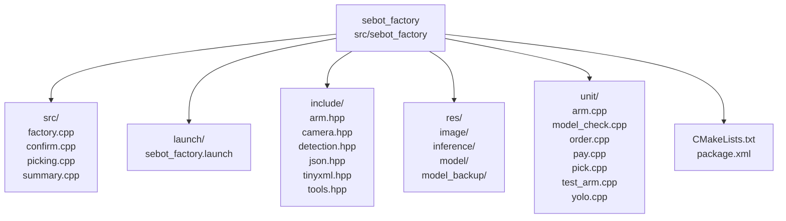
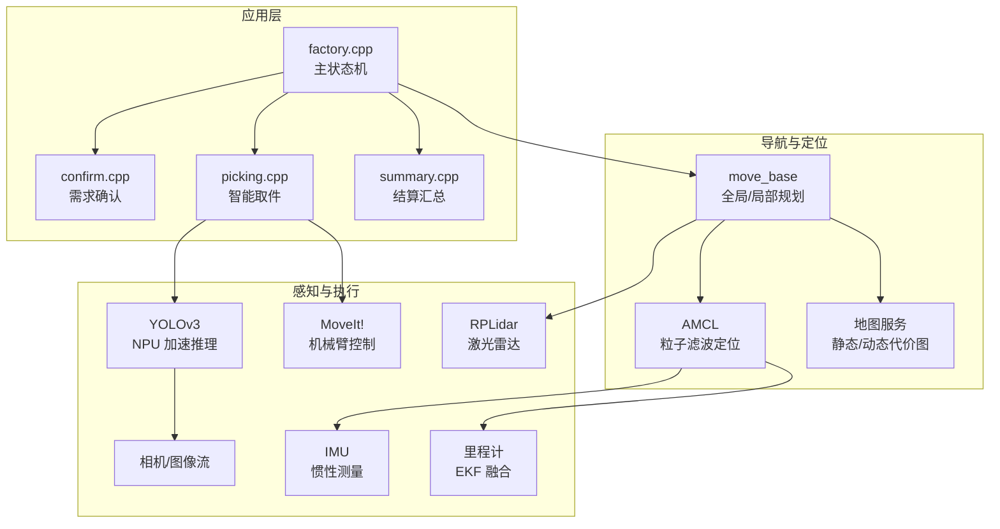
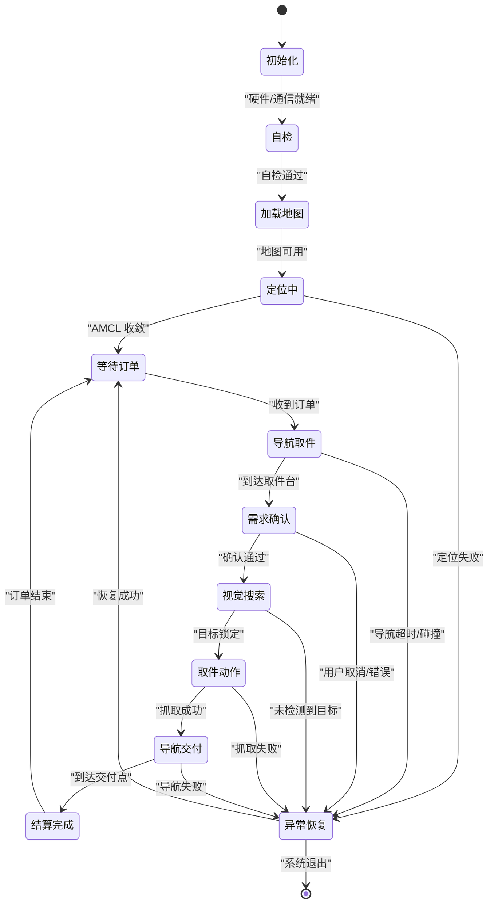
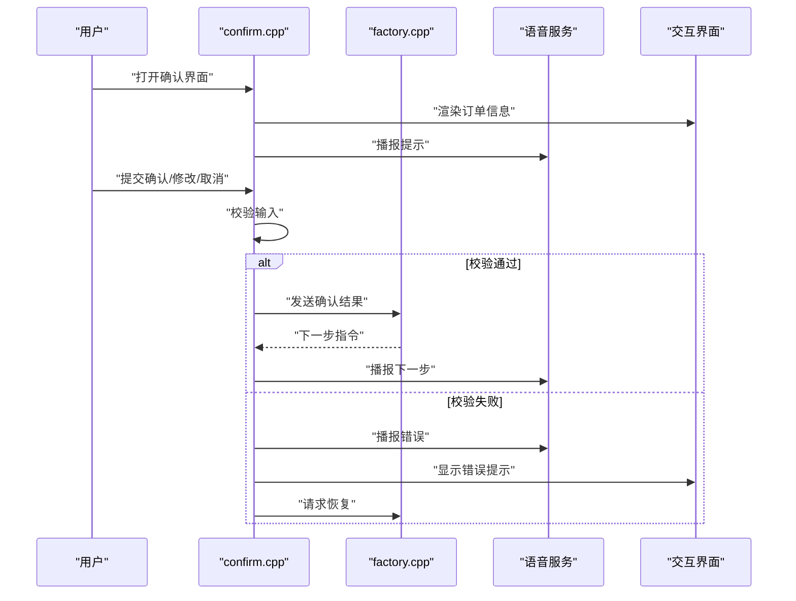
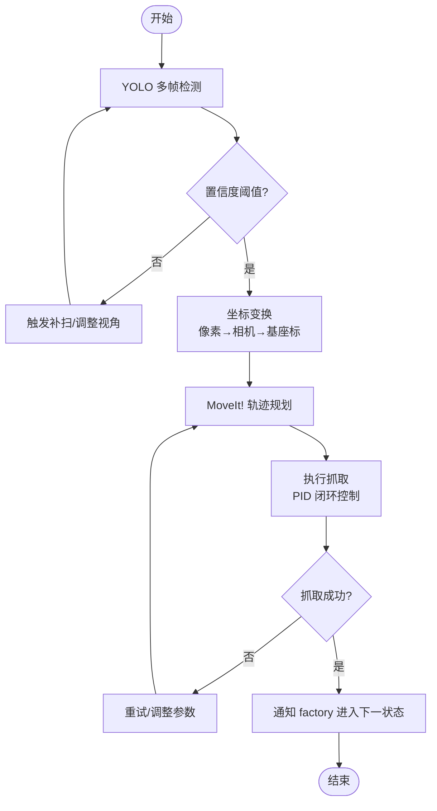
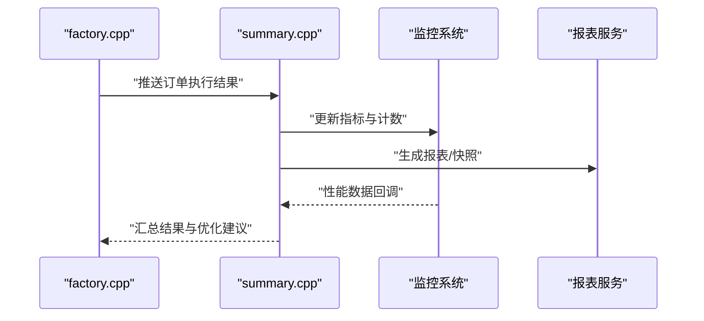
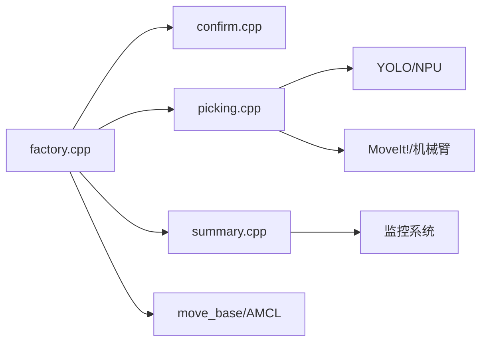

# 工厂管理系统

<cite>
**本文档引用的文件**   
- [factory.cpp](file://sebot_factory/src/sebot_factory/src/factory.cpp)
- [confirm.cpp](file://sebot_factory/src/sebot_factory/src/confirm.cpp)
- [picking.cpp](file://sebot_factory/src/sebot_factory/src/picking.cpp)
- [summary.cpp](file://sebot_factory/src/sebot_factory/src/summary.cpp)
- [sebot_factory.launch](file://sebot_factory/src/sebot_factory/launch/sebot_factory.launch)
- [CMakeLists.txt](file://sebot_factory/src/sebot_factory/CMakeLists.txt)
- [package.xml](file://sebot_factory/src/sebot_factory/package.xml)
</cite>

## 目录
1. [简介](#简介)
2. [项目结构](#项目结构)
3. [核心组件](#核心组件)
4. [架构总览](#架构总览)
5. [详细组件分析](#详细组件分析)
6. [依赖关系分析](#依赖关系分析)
7. [性能考虑](#性能考虑)
8. [故障排查指南](#故障排查指南)
9. [结论](#结论)
10. [附录](#附录)

## 简介
本仓库由三个相互独立的 catkin 工作空间组成：应用层 sebot_factory、机器人套件 sebot_ros_kits、仿真层 sebot_ros_stdr。文档聚焦于 sebot_factory 的工厂管理系统，围绕以下四个核心模块展开：
- factory.cpp：基于 MultiNavi 的主状态机，驱动订单处理与任务调度
- confirm.cpp：需求确认交互（用户界面、语音反馈、错误处理）
- picking.cpp：智能取件系统（视觉搜索、目标定位、机械臂控制协调）
- summary.cpp：结算汇总（数据统计、报告生成、性能监控）

技术栈为 ROS 1 + catkin，C++（roscpp）为主；导航采用 move_base + AMCL + DWA，建图为 Gmapping/Hector，机械臂为 MoveIt!（Talon），传感器为 RPLidar + IMU + 里程计 EKF 融合。比赛业务全链路为「上电自检 → 加载地图与 AMCL 定位 → 按订单导航至取件台 → 需求确认 → YOLO 视觉搜索（NPU 加速 Yolov3，多帧检测确认）→ 机械臂 PID 闭环抓取 → 导航送达并结算」。

## 项目结构
sebot_factory 包的核心源码位于 src/sebot_factory/src，包含四个主要节点：factory、confirm、picking、summary。启动配置集中在 launch/sebot_factory.launch，用于统一拉起各节点、加载参数与模型、切换仿真模式与调试开关。构建与依赖通过 CMakeLists.txt 与 package.xml 管理。

图表来源
- [CMakeLists.txt](file://sebot_factory/src/sebot_factory/CMakeLists.txt)
- [package.xml](file://sebot_factory/src/sebot_factory/package.xml)

章节来源
- [sebot_factory.launch](file://sebot_factory/src/sebot_factory/launch/sebot_factory.launch)
- [CMakeLists.txt](file://sebot_factory/src/sebot_factory/CMakeLists.txt)
- [package.xml](file://sebot_factory/src/sebot_factory/package.xml)

## 核心组件
- 主状态机（factory.cpp）：实现 MultiNavi 状态机，定义各状态（如初始化、定位、导航、确认、取件、送达、结算等）、状态转换条件与业务流程控制，负责订单队列管理与任务调度策略。
- 需求确认（confirm.cpp）：提供人机交互界面与语音反馈，校验订单信息，处理异常与重试逻辑。
- 智能取件（picking.cpp）：集成 YOLO 视觉搜索与多帧确认，计算目标位置，协调机械臂进行 PID 闭环抓取。
- 结算汇总（summary.cpp）：统计订单执行数据，生成报告，采集性能指标（耗时、成功率、失败原因分布）。

章节来源
- [factory.cpp](file://sebot_factory/src/sebot_factory/src/factory.cpp)
- [confirm.cpp](file://sebot_factory/src/sebot_factory/src/confirm.cpp)
- [picking.cpp](file://sebot_factory/src/sebot_factory/src/picking.cpp)
- [summary.cpp](file://sebot_factory/src/sebot_factory/src/summary.cpp)

## 架构总览
工厂管理系统以 factory 节点为核心编排器，协调 confirm、picking、summary 以及底层导航、视觉、机械臂服务。关键外部依赖包括 move_base（全局/局部规划）、AMCL（定位）、YOLO（视觉推理）、MoveIt!（机械臂控制）、语音与 UI 组件。

图表来源
- [sebot_factory.launch](file://sebot_factory/src/sebot_factory/launch/sebot_factory.launch)
- [factory.cpp](file://sebot_factory/src/sebot_factory/src/factory.cpp)
- [confirm.cpp](file://sebot_factory/src/sebot_factory/src/confirm.cpp)
- [picking.cpp](file://sebot_factory/src/sebot_factory/src/picking.cpp)
- [summary.cpp](file://sebot_factory/src/sebot_factory/src/summary.cpp)

## 详细组件分析

### 主状态机（factory.cpp）
- 状态定义：初始化、自检、加载地图与定位、等待订单、导航到取件台、需求确认、视觉搜索、取件动作、导航到交付点、结算完成、异常恢复等。
- 状态转换条件：基于事件驱动（如订单到达、定位成功、确认结果、视觉检测结果、机械臂动作反馈、超时/错误信号）触发状态迁移。
- 业务流程控制：维护订单队列与优先级，支持并发任务拆分与资源分配；对每个订单执行生命周期管理，记录状态与日志。
- 任务调度策略：根据订单类型、距离、资源占用情况选择最优路径与执行顺序；在异常时回退或重试。
- 异常处理机制：捕获导航失败、定位漂移、视觉误检、机械臂碰撞等异常，进入恢复状态（重定位、重新规划、重试抓取），必要时降级到人工干预。

图表来源
- [factory.cpp](file://sebot_factory/src/sebot_factory/src/factory.cpp)

章节来源
- [factory.cpp](file://sebot_factory/src/sebot_factory/src/factory.cpp)

### 需求确认（confirm.cpp）
- 用户交互界面：显示订单详情、物品清单、数量与位置提示，支持确认/修改/取消操作。
- 语音反馈：播报当前步骤、提示信息与错误告警，增强可访问性。
- 错误处理：输入校验、网络/服务不可用时的重试与降级；异常时返回明确错误码与提示。
- 与状态机协作：向 factory 发送确认结果，驱动状态迁移；在异常时请求恢复流程。

图表来源
- [confirm.cpp](file://sebot_factory/src/sebot_factory/src/confirm.cpp)
- [factory.cpp](file://sebot_factory/src/sebot_factory/src/factory.cpp)

章节来源
- [confirm.cpp](file://sebot_factory/src/sebot_factory/src/confirm.cpp)

### 智能取件（picking.cpp）
- 视觉搜索：调用 YOLOv3（NPU 加速）进行多帧检测，提升鲁棒性与置信度；过滤误检，聚合检测结果。
- 目标定位：将像素坐标转换为相机坐标系，再变换到机器人基座标系，输出目标位姿。
- 机械臂控制：通过 MoveIt! 生成避障轨迹，PID 闭环控制夹爪力度，确保稳定抓取。
- 协调策略：与 factory 同步状态，接收导航到达与确认结果；在视觉失败时触发补扫或重试。

图表来源
- [picking.cpp](file://sebot_factory/src/sebot_factory/src/picking.cpp)

章节来源
- [picking.cpp](file://sebot_factory/src/sebot_factory/src/picking.cpp)

### 结算汇总（summary.cpp）
- 数据统计：收集订单执行时间、成功率、失败原因分类、资源占用（CPU/GPU/内存）。
- 报告生成：按日/周/月生成报表，包含关键指标与趋势图，支持导出与上传。
- 性能监控：实时采集延迟、吞吐、错误率，设置阈值告警；与 factory 共享指标用于优化调度。
- 数据持久化：本地存储与远程上报，保证数据一致性与可追溯性。

图表来源
- [summary.cpp](file://sebot_factory/src/sebot_factory/src/summary.cpp)
- [factory.cpp](file://sebot_factory/src/sebot_factory/src/factory.cpp)

章节来源
- [summary.cpp](file://sebot_factory/src/sebot_factory/src/summary.cpp)

## 依赖关系分析
- 内部依赖：factory 作为编排器依赖 confirm、picking、summary；picking 依赖视觉与机械臂接口；summary 依赖工厂事件与监控系统。
- 外部依赖：ROS 1 生态（move_base、AMCL、Gmapping/Hector、MoveIt!、RPLidar、IMU、EKF 里程计）、YOLO NPU 推理库、语音与 UI 组件。
- 耦合与内聚：factory 高内聚状态机逻辑，对外暴露清晰接口；各子模块职责单一，降低耦合。
- 循环依赖：通过事件与消息传递避免直接循环引用。
- 接口契约：状态迁移事件、订单数据结构、视觉检测结果、机械臂动作反馈均有明确约定。

图表来源
- [factory.cpp](file://sebot_factory/src/sebot_factory/src/factory.cpp)
- [confirm.cpp](file://sebot_factory/src/sebot_factory/src/confirm.cpp)
- [picking.cpp](file://sebot_factory/src/sebot_factory/src/picking.cpp)
- [summary.cpp](file://sebot_factory/src/sebot_factory/src/summary.cpp)

章节来源
- [factory.cpp](file://sebot_factory/src/sebot_factory/src/factory.cpp)
- [confirm.cpp](file://sebot_factory/src/sebot_factory/src/confirm.cpp)
- [picking.cpp](file://sebot_factory/src/sebot_factory/src/picking.cpp)
- [summary.cpp](file://sebot_factory/src/sebot_factory/src/summary.cpp)

## 性能考虑
- 视觉推理：使用 NPU 加速 YOLOv3，多帧融合提高准确率；合理设置阈值与窗口大小平衡精度与延迟。
- 导航规划：全局规划与局部规划参数调优，避免频繁重规划；在动态环境中增加代价图更新频率。
- 机械臂控制：PID 参数整定，抓取力矩限制与碰撞保护；轨迹平滑减少抖动。
- 资源管理：监控 CPU/GPU/内存占用，避免峰值拥塞；异步处理非关键路径。
- 超时与重试：设置合理的超时阈值与重试次数，防止死锁与资源泄漏。

## 故障排查指南
- 定位失败：检查 AMCL 收敛与地图质量；查看激光雷达与 IMU 数据是否有效；必要时重新初始化。
- 导航超时：检查全局/局部规划参数、障碍物检测与代价图更新；确认路径可达性。
- 视觉误检：调整置信度阈值、增加多帧融合；检查光照与遮挡情况。
- 抓取失败：检查机械臂轨迹与夹爪力度；确认目标位姿与相机标定。
- 语音/UI 异常：检查语音服务与 UI 进程状态；确认消息总线连通性。
- 日志与诊断：启用 debug 模式，查看关键节点日志与指标；使用 rosbag 回放问题场景。

章节来源
- [sebot_factory.launch](file://sebot_factory/src/sebot_factory/launch/sebot_factory.launch)

## 结论
工厂管理系统以 factory 状态机为核心，串联需求确认、智能取件与结算汇总，形成完整的订单执行闭环。通过 ROS 生态与 NPU 加速视觉、MoveIt! 机械臂控制，系统在准确性、鲁棒性与效率方面具备良好表现。合理的参数配置与异常恢复机制保障了生产环境的稳定性。

## 附录
- 运行配置要点（sebot_factory.launch）：
  - simulation：切换 STDR 仿真模式
  - debug：控制图像识别界面开关
  - 导航超时、PID、取件距离、补扫参数：影响导航与取件行为
- 关键接口说明：
  - 订单数据结构：订单号、物品清单、数量、位置、优先级
  - 视觉检测结果：类别、置信度、边界框、位姿估计
  - 机械臂动作反馈：轨迹状态、抓取力、碰撞检测
  - 状态迁移事件：初始化、定位、导航、确认、取件、交付、结算、异常