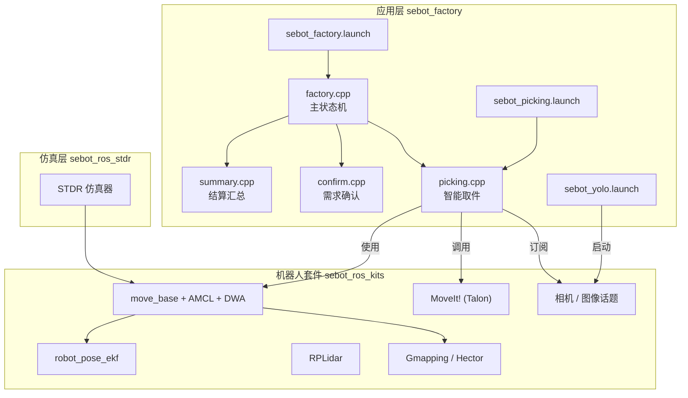
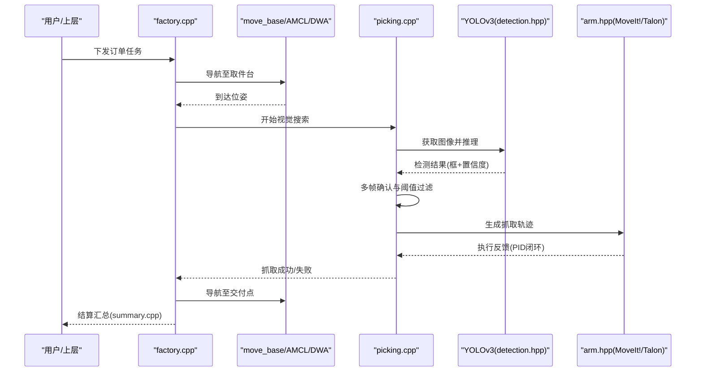
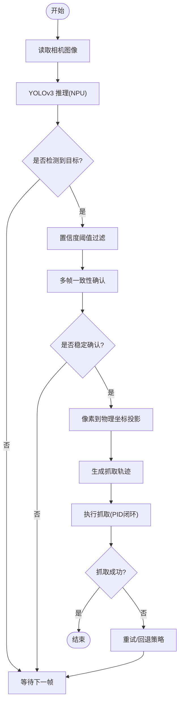
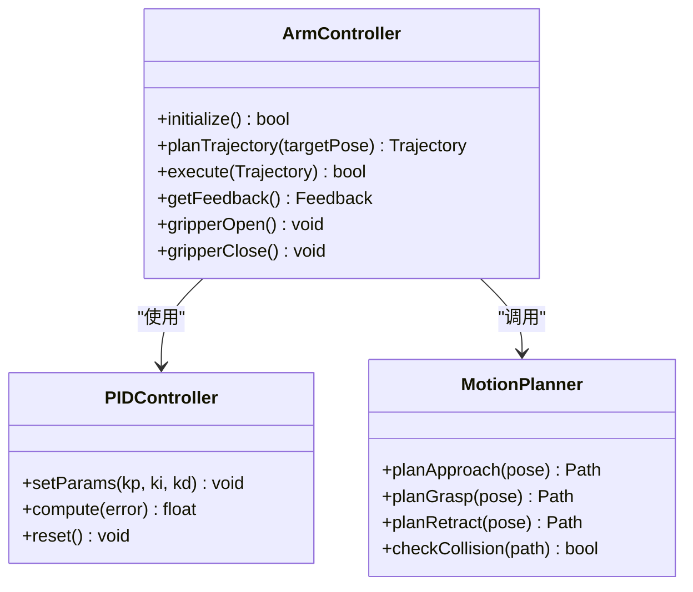
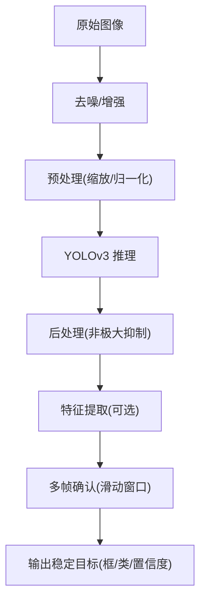
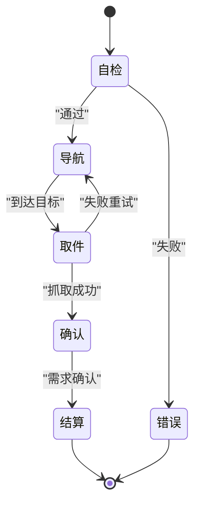
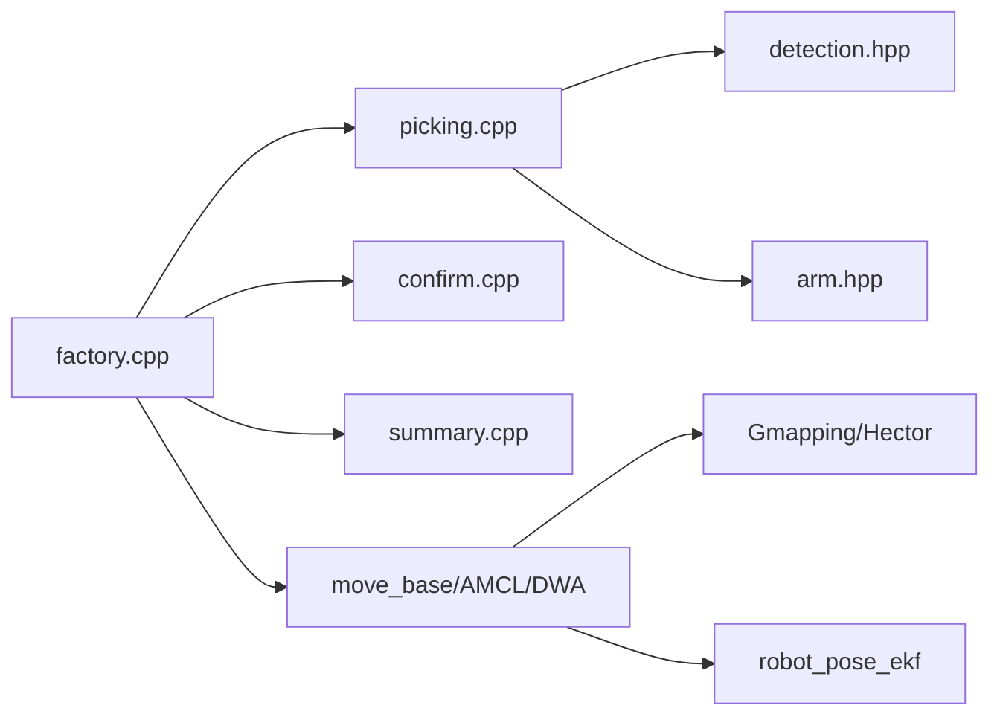

# 智能取件系统

<cite>
**本文引用的文件**   
- [picking.cpp](file://sebot_factory/src/sebot_factory/src/picking.cpp)
- [arm.hpp](file://sebot_factory/src/sebot_factory/include/arm.hpp)
- [detection.hpp](file://sebot_factory/src/sebot_factory/include/detection.hpp)
- [factory.cpp](file://sebot_factory/src/sebot_factory/src/factory.cpp)
- [confirm.cpp](file://sebot_factory/src/sebot_factory/src/confirm.cpp)
- [summary.cpp](file://sebot_factory/src/sebot_factory/src/summary.cpp)
- [sebot_picking.launch](file://sebot_factory/src/sebot_factory/launch/sebot_picking.launch)
- [sebot_yolo.launch](file://sebot_factory/src/sebot_factory/launch/sebot_yolo.launch)
- [sebot_factory.launch](file://sebot_factory/src/sebot_factory/launch/sebot_factory.launch)
- [CMakeLists.txt](file://sebot_factory/src/sebot_factory/CMakeLists.txt)
- [package.xml](file://sebot_factory/src/sebot_factory/package.xml)
- [unit/pick.cpp](file://sebot_factory/src/sebot_factory/unit/pick.cpp)
- [unit/test_arm.cpp](file://sebot_factory/src/sebot_factory/unit/test_arm.cpp)
- [unit/yolo.cpp](file://sebot_factory/src/sebot_factory/unit/yolo.cpp)
</cite>

## 目录
1. [简介](#简介)
2. [项目结构](#项目结构)
3. [核心组件](#核心组件)
4. [架构总览](#架构总览)
5. [详细组件分析](#详细组件分析)
6. [依赖关系分析](#依赖关系分析)
7. [性能与调优](#性能与调优)
8. [故障排查指南](#故障排查指南)
9. [结论](#结论)
10. [附录](#附录)

## 简介
本仓库由三个相互独立的 catkin 工作空间组成：应用层 sebot_factory、机器人套件 sebot_ros_kits、仿真层 sebot_ros_stdr。比赛业务全链路为「上电自检 → 加载地图与 AMCL 定位 → 按订单导航至取件台 → 需求确认 → YOLO 视觉搜索（NPU 加速 Yolov3，多帧检测确认）→ 机械臂 PID 闭环抓取 → 导航送达并结算」。主状态机基于 MultiNavi 实现于 factory.cpp，智能取件流程由 picking.cpp 驱动，视觉模块通过 detection.hpp 暴露接口，机械臂控制通过 arm.hpp 提供 API。

## 项目结构
- sebot_factory：应用层核心，包含工厂状态机、取件、确认、汇总等节点及 launch 配置。
- sebot_ros_kits：底层驱动与通用功能包（导航栈、传感器、语音、视觉工具等）。
- sebot_ros_stdr：STDR 仿真环境，用于离线验证与调试。

图表来源
- [factory.cpp](file://sebot_factory/src/sebot_factory/src/factory.cpp)
- [picking.cpp](file://sebot_factory/src/sebot_factory/src/picking.cpp)
- [confirm.cpp](file://sebot_factory/src/sebot_factory/src/confirm.cpp)
- [summary.cpp](file://sebot_factory/src/sebot_factory/src/summary.cpp)
- [sebot_factory.launch](file://sebot_factory/src/sebot_factory/launch/sebot_factory.launch)
- [sebot_picking.launch](file://sebot_factory/src/sebot_factory/launch/sebot_picking.launch)
- [sebot_yolo.launch](file://sebot_factory/src/sebot_factory/launch/sebot_yolo.launch)

章节来源
- [CMakeLists.txt](file://sebot_factory/src/sebot_factory/CMakeLists.txt)
- [package.xml](file://sebot_factory/src/sebot_factory/package.xml)

## 核心组件
- 主状态机（factory.cpp）：协调导航、取件、确认、结算等阶段，管理任务生命周期与异常恢复。
- 智能取件（picking.cpp）：视觉搜索算法、目标定位逻辑、与机械臂控制的协调。
- 需求确认（confirm.cpp）：与上层交互确认订单需求，触发后续动作。
- 结算汇总（summary.cpp）：统计与输出任务结果。
- 视觉接口（detection.hpp）：图像处理、特征提取、目标跟踪与多帧确认。
- 机械臂接口（arm.hpp）：运动学、PID 闭环控制、轨迹规划与抓取序列。

章节来源
- [factory.cpp](file://sebot_factory/src/sebot_factory/src/factory.cpp)
- [picking.cpp](file://sebot_factory/src/sebot_factory/src/picking.cpp)
- [confirm.cpp](file://sebot_factory/src/sebot_factory/src/confirm.cpp)
- [summary.cpp](file://sebot_factory/src/sebot_factory/src/summary.cpp)
- [detection.hpp](file://sebot_factory/src/sebot_factory/include/detection.hpp)
- [arm.hpp](file://sebot_factory/src/sebot_factory/include/arm.hpp)

## 架构总览
智能取件系统以 ROS 1 为通信总线，采用模块化设计：
- 感知层：相机与激光雷达数据经处理进入视觉与建图模块。
- 决策层：factory.cpp 的状态机根据订单与环境信息调度子任务。
- 执行层：picking.cpp 负责视觉搜索与抓取协调；arm.hpp 驱动 MoveIt! 完成轨迹规划与执行。
- 支持层：导航栈（move_base + AMCL + DWA）、SLAM（Gmapping/Hector）、EKF 融合里程计与 IMU。

图表来源
- [factory.cpp](file://sebot_factory/src/sebot_factory/src/factory.cpp)
- [picking.cpp](file://sebot_factory/src/sebot_factory/src/picking.cpp)
- [detection.hpp](file://sebot_factory/src/sebot_factory/include/detection.hpp)
- [arm.hpp](file://sebot_factory/src/sebot_factory/include/arm.hpp)

## 详细组件分析

### 视觉搜索与目标定位（picking.cpp）
- 视觉搜索算法
  - 订阅相机图像，调用 YOLOv3 推理（NPU 加速），得到目标框与类别、置信度。
  - 多帧检测确认：对连续 N 帧的同一目标进行一致性校验，降低误检率。
  - 置信度阈值：设置全局阈值与类别阈值，过滤低置信度结果。
- 目标定位逻辑
  - 将像素坐标转换到相机坐标系，再结合相机外参与深度信息（如有）映射到手部或基座坐标系。
  - 计算目标中心与机械臂末端相对位姿，生成抓取姿态。
- 与机械臂协调
  - 根据目标位姿调用 arm.hpp 的轨迹规划接口，生成安全路径。
  - 执行过程中接收 PID 反馈，动态调整末端位姿与夹爪开合。

图表来源
- [picking.cpp](file://sebot_factory/src/sebot_factory/src/picking.cpp)
- [detection.hpp](file://sebot_factory/src/sebot_factory/include/detection.hpp)

章节来源
- [picking.cpp](file://sebot_factory/src/sebot_factory/src/picking.cpp)
- [detection.hpp](file://sebot_factory/src/sebot_factory/include/detection.hpp)

### 机械臂控制接口与运动规划（arm.hpp）
- API 接口
  - 初始化与连接：建立与 MoveIt! / Talon 的控制通道。
  - 轨迹规划：输入目标位姿，返回关节角或笛卡尔路径。
  - 执行与反馈：发送轨迹指令，实时获取关节位置、速度、力矩。
  - 夹爪控制：开合指令与状态查询。
- PID 闭环控制
  - 位置环：根据期望位姿与实测位姿误差计算控制量。
  - 速度环：限制加速度与速度，避免冲击。
  - 力矩/电流环：保护电机与负载，防止过流。
- 运动规划策略
  - 避障：结合环境点云或代价地图，选择无碰撞路径。
  - 平滑：S 曲线或样条插值，保证轨迹连续性。
  - 抓取序列：接近 → 对准 → 下压 → 闭合 → 提升。

图表来源
- [arm.hpp](file://sebot_factory/src/sebot_factory/include/arm.hpp)

章节来源
- [arm.hpp](file://sebot_factory/src/sebot_factory/include/arm.hpp)
- [unit/test_arm.cpp](file://sebot_factory/src/sebot_factory/unit/test_arm.cpp)

### 图像处理与目标跟踪（detection.hpp）
- 图像处理流程
  - 图像去噪与增强：提高对比度与边缘清晰度。
  - 预处理：缩放、归一化、格式转换适配 YOLOv3。
- 特征提取与跟踪
  - 特征描述：颜色直方图、纹理特征辅助分类。
  - 目标跟踪：在连续帧中维护目标 ID，减少重识别开销。
- 多帧确认机制
  - 滑动窗口：记录最近 N 帧检测结果，统计一致比例。
  - 置信度融合：加权平均或投票法确定最终类别与框。
  - 阈值设置：类别阈值、IoU 阈值、时间窗口长度可调。

图表来源
- [detection.hpp](file://sebot_factory/src/sebot_factory/include/detection.hpp)

章节来源
- [detection.hpp](file://sebot_factory/src/sebot_factory/include/detection.hpp)
- [unit/yolo.cpp](file://sebot_factory/src/sebot_factory/unit/yolo.cpp)

### 主状态机与工作流（factory.cpp）
- 阶段划分
  - 自检与初始化：检查传感器、导航、视觉、机械臂状态。
  - 导航阶段：根据订单目标点规划路径并移动。
  - 取件阶段：调用 picking.cpp 进行视觉搜索与抓取。
  - 确认阶段：confirm.cpp 与上层交互确认需求。
  - 结算阶段：summary.cpp 统计结果并上报。
- 异常处理
  - 超时与重试：导航超时、视觉未检出、抓取失败的回退策略。
  - 降级模式：在部分传感器失效时切换备用方案。

图表来源
- [factory.cpp](file://sebot_factory/src/sebot_factory/src/factory.cpp)

章节来源
- [factory.cpp](file://sebot_factory/src/sebot_factory/src/factory.cpp)
- [confirm.cpp](file://sebot_factory/src/sebot_factory/src/confirm.cpp)
- [summary.cpp](file://sebot_factory/src/sebot_factory/src/summary.cpp)

## 依赖关系分析
- 模块耦合
  - factory.cpp 作为调度中心，依赖 picking.cpp、confirm.cpp、summary.cpp。
  - picking.cpp 依赖 detection.hpp（视觉）与 arm.hpp（机械臂）。
  - 导航与 SLAM 被 factory.cpp 间接调用，用于位姿估计与路径规划。
- 外部依赖
  - MoveIt!（Talon）：机械臂运动学与轨迹规划。
  - YOLOv3（NPU）：目标检测推理。
  - RPLidar、IMU、里程计：通过 EKF 融合提供位姿。

图表来源
- [factory.cpp](file://sebot_factory/src/sebot_factory/src/factory.cpp)
- [picking.cpp](file://sebot_factory/src/sebot_factory/src/picking.cpp)
- [detection.hpp](file://sebot_factory/src/sebot_factory/include/detection.hpp)
- [arm.hpp](file://sebot_factory/src/sebot_factory/include/arm.hpp)

章节来源
- [CMakeLists.txt](file://sebot_factory/src/sebot_factory/CMakeLists.txt)
- [package.xml](file://sebot_factory/src/sebot_factory/package.xml)

## 性能与调优
- 视觉推理优化
  - NPU 加速：确保模型量化与部署配置正确，减少 CPU/GPU 负载。
  - 多帧确认参数：调整窗口长度与阈值，平衡精度与延迟。
- 机械臂控制调优
  - PID 参数整定：先调 kp，再 ki，最后 kd，避免振荡与超调。
  - 轨迹平滑：增加采样点与约束，减少抖动与能耗。
- 导航与定位
  - AMCL 粒子数与更新频率：提高定位稳定性。
  - DWA 局部规划参数：速度与加速度限制，避免碰撞。
- 资源管理
  - 线程与队列：合理分配视觉、控制、导航线程，避免阻塞。
  - 内存与缓存：复用图像缓冲区与模型权重，减少分配开销。

[本节为通用指导，不直接分析具体文件]

## 故障排查指南
- 视觉未检出
  - 检查相机话题与图像质量，确认光照与对焦。
  - 调整 YOLOv3 阈值与多帧确认参数。
  - 查看 unit/yolo.cpp 测试用例，验证推理链路。
- 抓取失败
  - 检查 arm.hpp 的 PID 参数与轨迹规划是否合理。
  - 使用 unit/test_arm.cpp 进行单步测试，观察反馈与误差。
- 导航超时
  - 检查地图与定位，确认 AMCL 收敛。
  - 调整 move_base 参数与障碍物代价地图。
- 日志与可视化
  - 启用 debug 参数打开图像识别界面，观察中间结果。
  - 使用 rosbag 录制关键话题，回放分析问题。

章节来源
- [unit/yolo.cpp](file://sebot_factory/src/sebot_factory/unit/yolo.cpp)
- [unit/test_arm.cpp](file://sebot_factory/src/sebot_factory/unit/test_arm.cpp)
- [sebot_factory.launch](file://sebot_factory/src/sebot_factory/launch/sebot_factory.launch)

## 结论
智能取件系统通过模块化设计与 ROS 生态实现了从感知到执行的完整闭环。picking.cpp 整合 YOLOv3 视觉与多帧确认，arm.hpp 提供稳定的机械臂控制与轨迹规划，factory.cpp 协调全流程。通过合理的参数调优与故障排查策略，可显著提升抓取成功率与系统鲁棒性。

[本节为总结，不直接分析具体文件]

## 附录
- 关键 launch 文件
  - sebot_factory.launch：系统级配置，含 simulation、debug、导航超时、PID、取件距离、补扫等参数。
  - sebot_picking.launch：取件节点启动与参数配置。
  - sebot_yolo.launch：视觉推理节点启动与模型路径配置。
- 单元测试
  - unit/pick.cpp：取件流程集成测试。
  - unit/test_arm.cpp：机械臂控制与轨迹测试。
  - unit/yolo.cpp：视觉推理与后处理测试。

章节来源
- [sebot_factory.launch](file://sebot_factory/src/sebot_factory/launch/sebot_factory.launch)
- [sebot_picking.launch](file://sebot_factory/src/sebot_factory/launch/sebot_picking.launch)
- [sebot_yolo.launch](file://sebot_factory/src/sebot_factory/launch/sebot_yolo.launch)
- [unit/pick.cpp](file://sebot_factory/src/sebot_factory/unit/pick.cpp)
- [unit/test_arm.cpp](file://sebot_factory/src/sebot_factory/unit/test_arm.cpp)
- [unit/yolo.cpp](file://sebot_factory/src/sebot_factory/unit/yolo.cpp)