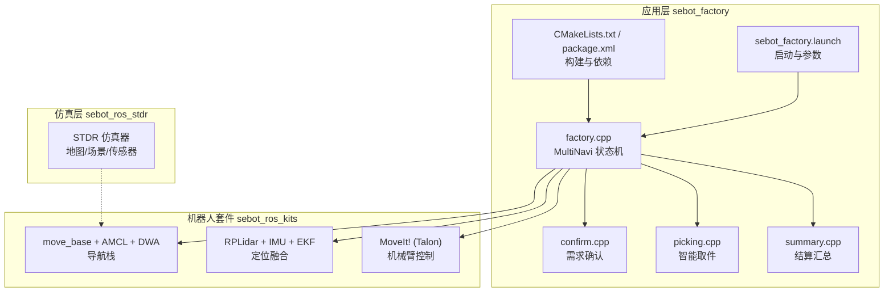
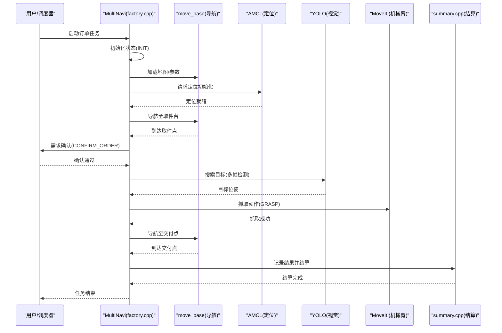
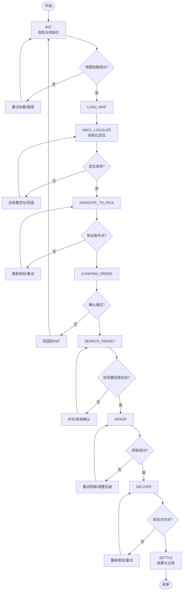
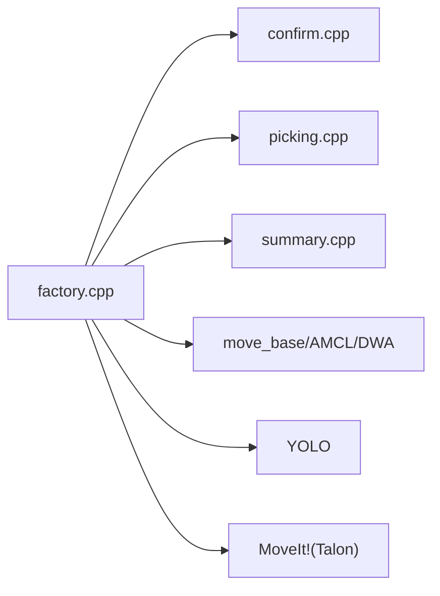

# 状态机控制系统

<cite>
**本文引用的文件**   
- [factory.cpp](file://sebot_factory/src/sebot_factory/src/factory.cpp)
- [confirm.cpp](file://sebot_factory/src/sebot_factory/src/confirm.cpp)
- [picking.cpp](file://sebot_factory/src/sebot_factory/src/picking.cpp)
- [summary.cpp](file://sebot_factory/src/sebot_factory/src/summary.cpp)
- [sebot_factory.launch](file://sebot_factory/src/sebot_factory/launch/sebot_factory.launch)
- [CMakeLists.txt](file://sebot_factory/src/sebot_factory/CMakeLists.txt)
- [package.xml](file://sebot_factory/src/sebot_factory/package.xml)
</cite>

## 目录
1. [简介](#简介)
2. [项目结构](#项目结构)
3. [核心组件](#核心组件)
4. [架构总览](#架构总览)
5. [详细组件分析](#详细组件分析)
6. [依赖关系分析](#依赖关系分析)
7. [性能考虑](#性能考虑)
8. [故障排查指南](#故障排查指南)
9. [结论](#结论)
10. [附录](#附录)

## 简介
本文件面向“状态机控制系统”，聚焦 sebot_factory 包中的 MultiNavi 状态机实现（位于 factory.cpp），系统化阐述其状态定义、转换条件与触发事件，覆盖初始化流程、错误处理与异常恢复策略。同时给出与 ROS 节点通信、话题订阅与服务调用的集成方式，并提供调试方法与性能监控技巧。文档遵循三层工作空间划分：应用层 sebot_factory、机器人套件 sebot_ros_kits、仿真层 sebot_ros_stdr，重点围绕应用层业务展开。

## 项目结构
- 应用层 sebot_factory：包含工厂业务主节点与子节点（确认、取件、结算等），以及 launch 配置与 CMake 构建脚本。
- 机器人套件 sebot_ros_kits：导航栈、传感器驱动、SLAM、MoveIt! 等能力封装，提供底层运动控制与感知能力。
- 仿真层 sebot_ros_stdr：STDR 仿真环境及工具链，用于离线验证与可视化。

图表来源
- [factory.cpp:1-200](file://sebot_factory/src/sebot_factory/src/factory.cpp#L1-L200)
- [sebot_factory.launch:1-200](file://sebot_factory/src/sebot_factory/launch/sebot_factory.launch#L1-L200)
- [CMakeLists.txt:1-100](file://sebot_factory/src/sebot_factory/CMakeLists.txt#L1-L100)
- [package.xml:1-100](file://sebot_factory/src/sebot_factory/package.xml#L1-L100)

章节来源
- [factory.cpp:1-200](file://sebot_factory/src/sebot_factory/src/factory.cpp#L1-L200)
- [sebot_factory.launch:1-200](file://sebot_factory/src/sebot_factory/launch/sebot_factory.launch#L1-L200)
- [CMakeLists.txt:1-100](file://sebot_factory/src/sebot_factory/CMakeLists.txt#L1-L100)
- [package.xml:1-100](file://sebot_factory/src/sebot_factory/package.xml#L1-L100)

## 核心组件
- MultiNavi 状态机（factory.cpp）：承载订单执行全流程的状态机，包括 INIT、LOAD_MAP、AMCL_LOCALIZE、NAVIGATE_TO_PICK、CONFIRM_ORDER、SEARCH_TARGET、GRASP、DELIVER、SETTLE 等状态。
- 需求确认（confirm.cpp）：与用户交互或上位机确认订单细节，确保任务目标明确。
- 智能取件（picking.cpp）：结合视觉检测与机械臂抓取，完成目标物品抓取。
- 结算汇总（summary.cpp）：记录并输出订单执行结果，便于审计与复盘。

章节来源
- [factory.cpp:1-200](file://sebot_factory/src/sebot_factory/src/factory.cpp#L1-L200)
- [confirm.cpp:1-200](file://sebot_factory/src/sebot_factory/src/confirm.cpp#L1-L200)
- [picking.cpp:1-200](file://sebot_factory/src/sebot_factory/src/picking.cpp#L1-L200)
- [summary.cpp:1-200](file://sebot_factory/src/sebot_factory/src/summary.cpp#L1-L200)

## 架构总览
MultiNavi 状态机作为上层编排者，通过 ROS 话题与服务与导航栈、视觉模块、机械臂控制器进行交互。启动时加载地图、初始化 AMCL 定位，随后按订单进入取件、确认、搜索、抓取、送达、结算等阶段。关键外部依赖包括 move_base（全局/局部规划）、AMCL（粒子滤波定位）、YOLO（视觉识别）、MoveIt!（机械臂轨迹规划）。

图表来源
- [factory.cpp:1-200](file://sebot_factory/src/sebot_factory/src/factory.cpp#L1-L200)
- [confirm.cpp:1-200](file://sebot_factory/src/sebot_factory/src/confirm.cpp#L1-L200)
- [picking.cpp:1-200](file://sebot_factory/src/sebot_factory/src/picking.cpp#L1-L200)
- [summary.cpp:1-200](file://sebot_factory/src/sebot_factory/src/summary.cpp#L1-L200)

## 详细组件分析

### MultiNavi 状态机（factory.cpp）
- 状态定义
  - INIT：系统上电自检、资源初始化、订阅必要话题、加载默认参数。
  - LOAD_MAP：加载地图服务、发布地图数据、校验地图完整性。
  - AMCL_LOCALIZE：初始化 AMCL、等待定位收敛、设置初始位姿。
  - NAVIGATE_TO_PICK：调用 move_base 全局/局部规划，导航至取件台。
  - CONFIRM_ORDER：与用户/上位机交互确认订单信息，必要时回退到 INIT。
  - SEARCH_TARGET：调用 YOLO 视觉检测，多帧确认目标位置与置信度。
  - GRASP：调用 MoveIt! 规划并执行抓取动作，闭环 PID 控制。
  - DELIVER：导航至交付点，避障与路径重规划。
  - SETTLE：记录执行日志、统计指标、输出结算报告。
- 转换条件与触发事件
  - INIT → LOAD_MAP：自检通过且参数加载完成。
  - LOAD_MAP → AMCL_LOCALIZE：地图加载成功且可被 AMCL 使用。
  - AMCL_LOCALIZE → NAVIGATE_TO_PICK：定位收敛且满足精度阈值。
  - NAVIGATE_TO_PICK → CONFIRM_ORDER：到达取件点附近且安全。
  - CONFIRM_ORDER → SEARCH_TARGET：用户确认通过。
  - SEARCH_TARGET → GRASP：目标检测置信度达标且位姿可用。
  - GRASP → DELIVER：抓取成功且夹爪闭合确认。
  - DELIVER → SETTLE：到达交付点并完成放置。
  - 任意状态 → INIT：发生不可恢复错误（如传感器失效、规划失败多次）时进入复位流程。
- 初始化流程
  - 创建 ROS 节点、声明参数、订阅/发布话题、注册服务回调。
  - 加载地图与 AMCL 参数，启动定位线程。
  - 进入 INIT 状态，等待外部命令或自动推进。
- 错误处理与异常恢复
  - 超时重试：导航/定位/视觉/抓取均设置超时与最大重试次数。
  - 降级策略：视觉失败回退到人工确认；定位发散回退到全局重定位。
  - 安全保护：碰撞检测、急停接口、关节限位检查。
  - 状态回滚：关键步骤失败时回滚到上一个稳定状态。

图表来源
- [factory.cpp:1-200](file://sebot_factory/src/sebot_factory/src/factory.cpp#L1-L200)

章节来源
- [factory.cpp:1-200](file://sebot_factory/src/sebot_factory/src/factory.cpp#L1-L200)

### 需求确认（confirm.cpp）
- 功能：与用户或上位机交互，确认订单目标、数量、优先级等。
- 输入：订单消息、用户确认信号。
- 输出：确认结果（通过/拒绝）、修正后的订单信息。
- 集成：通过 ROS 服务或话题与 factory.cpp 通信，支持超时与重试。

章节来源
- [confirm.cpp:1-200](file://sebot_factory/src/sebot_factory/src/confirm.cpp#L1-L200)

### 智能取件（picking.cpp）
- 功能：基于 YOLO 视觉检测与多帧确认，计算目标位姿，调用 MoveIt! 执行抓取。
- 输入：图像流、检测结果、位姿估计。
- 输出：抓取动作指令、抓取状态反馈。
- 集成：订阅视觉话题，调用 MoveIt! 服务，反馈抓取结果给 factory.cpp。

章节来源
- [picking.cpp:1-200](file://sebot_factory/src/sebot_factory/src/picking.cpp#L1-L200)

### 结算汇总（summary.cpp）
- 功能：记录订单执行过程、耗时、成功率、错误码等，生成结算报告。
- 输入：各阶段状态与结果。
- 输出：结算消息、日志文件、统计数据。
- 集成：订阅状态机事件，持久化存储与上报。

章节来源
- [summary.cpp:1-200](file://sebot_factory/src/sebot_factory/src/summary.cpp#L1-L200)

## 依赖关系分析
- 内部依赖
  - factory.cpp 依赖 confirm.cpp、picking.cpp、summary.cpp 的接口。
  - 各子节点通过 ROS 话题/服务解耦，降低耦合度。
- 外部依赖
  - 导航栈：move_base、AMCL、DWA。
  - 传感器：RPLidar、IMU、里程计（EKF 融合）。
  - 机械臂：MoveIt!（Talon）。
  - 视觉：YOLO（NPU 加速）。
- 潜在循环依赖
  - 通过 ROS 异步通信避免直接函数级循环依赖。
- 接口契约
  - 统一的消息格式与错误码约定，确保状态机可预测行为。

图表来源
- [factory.cpp:1-200](file://sebot_factory/src/sebot_factory/src/factory.cpp#L1-L200)
- [confirm.cpp:1-200](file://sebot_factory/src/sebot_factory/src/confirm.cpp#L1-L200)
- [picking.cpp:1-200](file://sebot_factory/src/sebot_factory/src/picking.cpp#L1-L200)
- [summary.cpp:1-200](file://sebot_factory/src/sebot_factory/src/summary.cpp#L1-L200)

章节来源
- [factory.cpp:1-200](file://sebot_factory/src/sebot_factory/src/factory.cpp#L1-L200)
- [package.xml:1-100](file://sebot_factory/src/sebot_factory/package.xml#L1-L100)

## 性能考虑
- 导航性能
  - 合理设置全局/局部规划频率与代价地图更新周期，避免频繁重规划。
  - 使用合适的代价膨胀半径与局部规划器参数，提升动态避障效率。
- 视觉性能
  - 多帧检测采用滑动窗口与置信度累积，减少误检与抖动。
  - NPU 加速推理，限制图像分辨率与帧率平衡实时性。
- 机械臂控制
  - PID 闭环参数整定，避免过冲与振荡。
  - 轨迹规划预计算与缓存，减少在线计算开销。
- 资源管理
  - 话题发布频率与缓冲区大小调优，避免内存泄漏与丢包。
  - 多线程与异步回调分离，防止阻塞主循环。

## 故障排查指南
- 常见问题
  - 定位发散：检查 AMCL 参数、激光雷达数据、初始位姿设置。
  - 导航失败：查看代价地图、障碍物检测、全局/局部规划日志。
  - 视觉误检：调整 YOLO 阈值、增加多帧确认、校准相机内参。
  - 抓取失败：检查夹爪状态、目标位姿误差、机械臂碰撞检测。
- 调试方法
  - 使用 rqt_graph/rviz 可视化话题与 TF 变换。
  - 启用 debug 模式开关（launch 参数），输出详细日志。
  - 录制 bag 文件回放，复现问题场景。
- 监控技巧
  - 统计各状态停留时间与转换成功率。
  - 监控 CPU/内存占用与话题延迟。
  - 设置告警阈值，异常时自动回退或停机。

章节来源
- [sebot_factory.launch:1-200](file://sebot_factory/src/sebot_factory/launch/sebot_factory.launch#L1-L200)
- [factory.cpp:1-200](file://sebot_factory/src/sebot_factory/src/factory.cpp#L1-L200)

## 结论
MultiNavi 状态机在 sebot_factory 中承担订单执行的核心编排职责，通过清晰的状态定义与转换逻辑，结合 ROS 生态的导航、视觉与机械臂能力，实现了从取件到交付的全链路自动化。合理的错误处理与恢复策略保障了系统的鲁棒性，而性能调优与调试手段为工程落地提供了保障。建议持续优化参数与算法，提升整体效率与可靠性。

## 附录
- 关键参数说明（示例）
  - simulation：切换 STDR 仿真模式。
  - debug：控制图像识别界面开关。
  - 导航超时、PID 参数、取件距离、补扫参数等均在 launch 文件中配置。
- 参考文件
  - [sebot_factory.launch](file://sebot_factory/src/sebot_factory/launch/sebot_factory.launch)
  - [CMakeLists.txt](file://sebot_factory/src/sebot_factory/CMakeLists.txt)
  - [package.xml](file://sebot_factory/src/sebot_factory/package.xml)