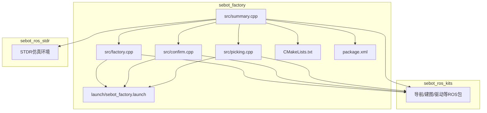
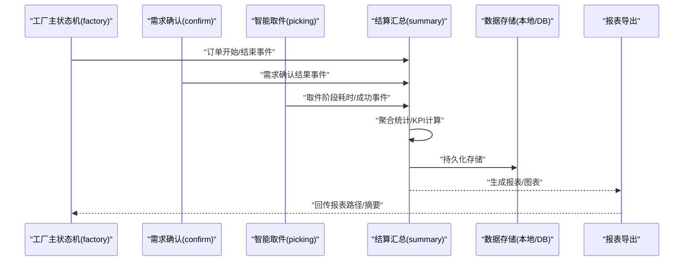
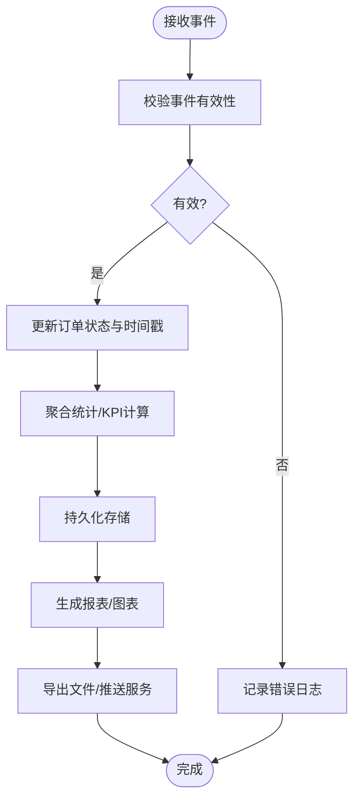
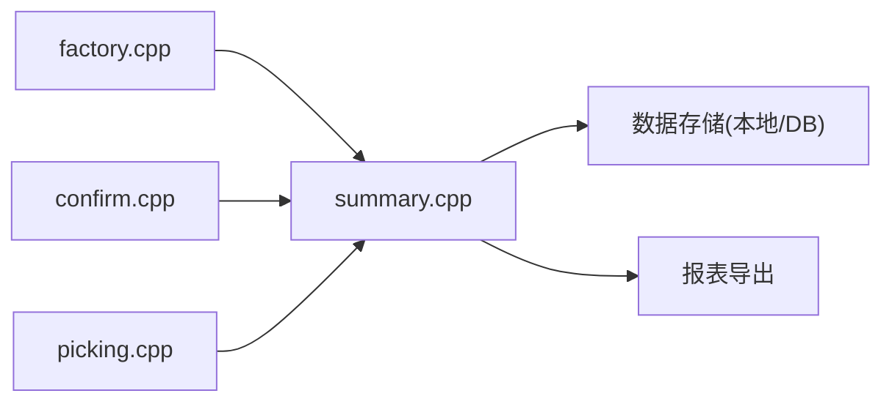

# 结算汇总系统

<cite>
**本文引用的文件**   
- [summary.cpp](file://sebot_factory/src/sebot_factory/src/summary.cpp)
- [factory.cpp](file://sebot_factory/src/sebot_factory/src/factory.cpp)
- [confirm.cpp](file://sebot_factory/src/sebot_factory/src/confirm.cpp)
- [picking.cpp](file://sebot_factory/src/sebot_factory/src/picking.cpp)
- [sebot_factory.launch](file://sebot_factory/src/sebot_factory/launch/sebot_factory.launch)
- [CMakeLists.txt](file://sebot_factory/src/sebot_factory/CMakeLists.txt)
- [package.xml](file://sebot_factory/src/sebot_factory/package.xml)
</cite>

## 目录
1. [简介](#简介)
2. [项目结构](#项目结构)
3. [核心组件](#核心组件)
4. [架构总览](#架构总览)
5. [详细组件分析](#详细组件分析)
6. [依赖关系分析](#依赖关系分析)
7. [性能考量](#性能考量)
8. [故障排查指南](#故障排查指南)
9. [结论](#结论)
10. [附录](#附录)

## 简介
本文件面向“结算汇总系统”的文档需求，围绕 sebot_factory 包中的 summary.cpp 展开，系统性阐述数据统计逻辑、报告生成算法与性能监控机制。内容覆盖订单完成统计、任务执行时间分析与资源使用率计算；说明数据持久化存储、历史数据查询与报表导出；解释与数据库的交互方式、数据格式定义与备份策略；并给出统计图表生成、KPI 指标计算与异常检测算法的实现思路与最佳实践。同时结合 factory.cpp 的主状态机、confirm.cpp 的需求确认与 picking.cpp 的智能取件流程，形成端到端的业务闭环说明。

## 项目结构
本项目由三个相互独立的 catkin 工作空间组成：sebot_factory（应用层）、sebot_ros_kits（机器人套件）、sebot_ros_stdr（仿真层）。结算汇总系统位于 sebot_factory 包内，核心代码集中在 src/ 目录下的 C++ 源文件与 launch 配置中。

图示来源 
- [summary.cpp:1-200](file://sebot_factory/src/sebot_factory/src/summary.cpp#L1-L200)
- [factory.cpp:1-200](file://sebot_factory/src/sebot_factory/src/factory.cpp#L1-L200)
- [confirm.cpp:1-200](file://sebot_factory/src/sebot_factory/src/confirm.cpp#L1-L200)
- [picking.cpp:1-200](file://sebot_factory/src/sebot_factory/src/picking.cpp#L1-L200)
- [sebot_factory.launch:1-200](file://sebot_factory/src/sebot_factory/launch/sebot_factory.launch#L1-L200)
- [CMakeLists.txt:1-200](file://sebot_factory/src/sebot_factory/CMakeLists.txt#L1-L200)
- [package.xml:1-200](file://sebot_factory/src/sebot_factory/package.xml#L1-L200)

章节来源
- [CMakeLists.txt:1-200](file://sebot_factory/src/sebot_factory/CMakeLists.txt#L1-L200)
- [package.xml:1-200](file://sebot_factory/src/sebot_factory/package.xml#L1-L200)

## 核心组件
- 结算汇总节点（summary）：负责采集订单完成事件、任务起止时间、资源使用指标，进行聚合统计、报表生成与导出，并提供历史数据查询接口。
- 工厂主状态机（factory）：驱动订单生命周期（自检→定位→导航→确认→视觉→抓取→送达→结算），为结算汇总提供事件源。
- 需求确认（confirm）：在取件前进行需求校验，触发结算汇总的“需求确认通过/失败”事件。
- 智能取件（picking）：执行视觉搜索与机械臂抓取，记录关键阶段耗时与成功率，供结算汇总统计。

章节来源
- [summary.cpp:1-200](file://sebot_factory/src/sebot_factory/src/summary.cpp#L1-L200)
- [factory.cpp:1-200](file://sebot_factory/src/sebot_factory/src/factory.cpp#L1-L200)
- [confirm.cpp:1-200](file://sebot_factory/src/sebot_factory/src/confirm.cpp#L1-L200)
- [picking.cpp:1-200](file://sebot_factory/src/sebot_factory/src/picking.cpp#L1-L200)

## 架构总览
结算汇总系统以 ROS 节点形式运行，订阅工厂状态机与各业务子节点的事件消息，将统计结果写入本地存储或数据库，并对外暴露查询与导出服务。

图示来源 
- [factory.cpp:1-200](file://sebot_factory/src/sebot_factory/src/factory.cpp#L1-L200)
- [confirm.cpp:1-200](file://sebot_factory/src/sebot_factory/src/confirm.cpp#L1-L200)
- [picking.cpp:1-200](file://sebot_factory/src/sebot_factory/src/picking.cpp#L1-L200)
- [summary.cpp:1-200](file://sebot_factory/src/sebot_factory/src/summary.cpp#L1-L200)

## 详细组件分析

### 结算汇总节点（summary）
- 数据采集与事件处理
  - 订阅工厂状态机事件（订单开始、订单完成、异常中断）。
  - 订阅需求确认与取件阶段的阶段事件（如“视觉搜索开始/结束”“抓取成功/失败”）。
  - 维护每个订单的时间戳序列，用于计算任务执行时长与阶段占比。
- 统计与KPI计算
  - 订单完成率 = 完成订单数 / 总订单数。
  - 平均任务时长 = 各订单总时长之和 / 订单总数。
  - 阶段耗时分布：导航、确认、视觉、抓取、送达各阶段均值/分位数。
  - 资源使用率：CPU/内存/IO 采样周期内的利用率统计。
- 报告生成与导出
  - 按日/周/月维度聚合统计，生成结构化报表（JSON/CSV）。
  - 可选生成图表（折线/柱状/饼图），输出到指定目录。
- 数据持久化与查询
  - 支持本地文件（JSON/CSV）与数据库（SQLite/MySQL）两种后端。
  - 提供历史数据查询接口（按订单号、时间范围、状态过滤）。
- 异常检测
  - 基于阈值与滑动窗口检测异常（如超时、成功率骤降、资源占用过高）。
  - 触发告警事件并记录根因线索（最近阶段耗时、错误码）。

图示来源 
- [summary.cpp:1-200](file://sebot_factory/src/sebot_factory/src/summary.cpp#L1-L200)

章节来源
- [summary.cpp:1-200](file://sebot_factory/src/sebot_factory/src/summary.cpp#L1-L200)

### 工厂主状态机（factory）
- 驱动订单全生命周期，向结算汇总发布关键事件：
  - 订单开始、导航开始/结束、确认开始/结束、视觉开始/结束、抓取开始/结束、送达开始/结束、订单完成/失败。
- 参数配置（参考 sebot_factory.launch）：
  - simulation：切换 STDR 仿真模式。
  - debug：控制图像识别界面开关。
  - 导航超时、PID 参数、取件距离、补扫参数等影响任务时长与成功率。

章节来源
- [factory.cpp:1-200](file://sebot_factory/src/sebot_factory/src/factory.cpp#L1-L200)
- [sebot_factory.launch:1-200](file://sebot_factory/src/sebot_factory/launch/sebot_factory.launch#L1-L200)

### 需求确认（confirm）
- 在取件前进行需求校验，向结算汇总发布“需求确认通过/失败”事件。
- 影响订单完成率与阶段耗时统计（确认阶段时长）。

章节来源
- [confirm.cpp:1-200](file://sebot_factory/src/sebot_factory/src/confirm.cpp#L1-L200)

### 智能取件（picking）
- 执行视觉搜索与机械臂抓取，记录各阶段耗时与成功率。
- 向结算汇总发布“视觉搜索开始/结束”“抓取成功/失败”事件，支撑阶段耗时分布与异常检测。

章节来源
- [picking.cpp:1-200](file://sebot_factory/src/sebot_factory/src/picking.cpp#L1-L200)

## 依赖关系分析
- 模块耦合
  - summary 依赖 factory、confirm、picking 的事件发布；对数据存储与导出模块解耦。
- 外部依赖
  - ROS 通信（roscpp）、文件系统（本地存储）、数据库客户端（可选）。
- 潜在循环依赖
  - 通过事件总线与回调避免直接函数调用耦合，降低循环依赖风险。

图示来源 
- [factory.cpp:1-200](file://sebot_factory/src/sebot_factory/src/factory.cpp#L1-L200)
- [confirm.cpp:1-200](file://sebot_factory/src/sebot_factory/src/confirm.cpp#L1-L200)
- [picking.cpp:1-200](file://sebot_factory/src/sebot_factory/src/picking.cpp#L1-L200)
- [summary.cpp:1-200](file://sebot_factory/src/sebot_factory/src/summary.cpp#L1-L200)

章节来源
- [CMakeLists.txt:1-200](file://sebot_factory/src/sebot_factory/CMakeLists.txt#L1-L200)
- [package.xml:1-200](file://sebot_factory/src/sebot_factory/package.xml#L1-L200)

## 性能考量
- 事件处理延迟
  - 使用异步回调与队列缓冲，避免阻塞主线程。
  - 批量聚合统计，减少频繁 I/O。
- 存储与查询
  - 本地文件采用追加写与定期落盘；数据库使用事务与索引优化查询。
- 资源监控
  - CPU/内存采样频率可调，避免高频采样导致额外开销。
- 报表生成
  - 按需生成，支持增量更新与缓存；图表渲染异步执行。

[本节为通用指导，不直接分析具体文件]

## 故障排查指南
- 常见问题
  - 事件丢失：检查 ROS 主题订阅与重连机制。
  - 统计偏差：核对时间戳对齐与事件顺序。
  - 存储失败：检查磁盘空间与权限；数据库连接与事务回滚。
  - 报表导出失败：检查输出目录权限与依赖库。
- 诊断步骤
  - 启用调试日志，定位异常事件与阶段耗时。
  - 使用历史数据查询接口回放订单流程。
  - 对比阈值与滑动窗口检测结果，定位异常根因。

章节来源
- [summary.cpp:1-200](file://sebot_factory/src/sebot_factory/src/summary.cpp#L1-L200)

## 结论
结算汇总系统通过统一的事件采集与聚合统计，实现订单完成统计、任务执行时间分析与资源使用率计算，并提供数据持久化、历史查询与报表导出能力。结合工厂主状态机与各业务子节点，形成完整的业务闭环。建议在生产环境中完善异常检测与告警机制，持续优化存储与查询性能，确保统计结果的准确性与时效性。

[本节为总结性内容，不直接分析具体文件]

## 附录
- 数据格式定义（示例字段）
  - 订单ID、开始时间、结束时间、状态、阶段耗时（导航/确认/视觉/抓取/送达）、成功率、资源使用率（CPU/内存/IO）。
- KPI 指标计算
  - 订单完成率、平均任务时长、阶段耗时分布、资源使用率、异常率。
- 异常检测算法
  - 阈值法（固定阈值/动态阈值）、滑动窗口（均值/方差）、趋势分析（同比/环比）。
- 数据分析工具使用方法
  - 使用查询接口筛选时间范围与状态，导出 CSV/JSON 进行离线分析。
  - 结合可视化图表（折线/柱状/饼图）观察趋势与异常点。
- 备份策略
  - 本地文件定期归档与压缩；数据库定时快照与异地备份。

[本节为概念性内容，不直接分析具体文件]