# 订单处理系统

<cite>
**本文引用的文件**   
- [factory.cpp](file://sebot_factory/src/factory.cpp)
- [confirm.cpp](file://sebot_factory/src/confirm.cpp)
- [picking.cpp](file://sebot_factory/src/picking.cpp)
- [summary.cpp](file://sebot_factory/src/summary.cpp)
- [order.cpp](file://sebot_factory/unit/order.cpp)
- [sebot_factory.launch](file://sebot_factory/launch/sebot_factory.launch)
- [location.xml](file://sebot_factory/res/model_backup/location.xml)
- [location.xml](file://sebot_marking/resources/location.xml)
- [amcl_node.cpp](file://sebot_ros_kits/src/sebot_navigation/amcl/src/amcl_node.cpp)
- [move_base.cpp](file://sebot_ros_kits/src/sebot_navigation/move_base/src/move_base.cpp)
- [costmap_2d_ros.h](file://sebot_ros_kits/src/sebot_navigation/costmap_2d/include/costmap_2d/costmap_2d_ros.h)
- [trajectory_planner_ros.h](file://sebot_ros_kits/src/sebot_navigation/base_local_planner/include/base_local_planner/trajectory_planner_ros.h)
- [slam_gmapping.cpp](file://sebot_ros_kits/src/sebot_slam/slam_gmapping/slam_gmapping.cpp)
- [qnode.hpp](file://sebot_marking/include/qnode.hpp)
- [CCtrlDashBoard.cpp](file://sebot_marking/src/CCtrlDashBoard.cpp)
</cite>

## 目录
1. [简介](#简介)
2. [项目结构](#项目结构)
3. [核心组件](#核心组件)
4. [架构总览](#架构总览)
5. [详细组件分析](#详细组件分析)
6. [依赖关系分析](#依赖关系分析)
7. [性能与并发](#性能与并发)
8. [故障恢复与监控](#故障恢复与监控)
9. [结论](#结论)
10. [附录](#附录)

## 简介
本仓库由三个相互独立的 catkin 工作空间组成：应用层 sebot_factory、机器人套件 sebot_ros_kits、仿真层 sebot_ros_stdr。订单处理系统以 sebot_factory 为核心，围绕“接收订单→导航取件→视觉确认→机械臂抓取→导航送达→结算汇总”的全链路展开。导航采用 move_base + AMCL + DWA，建图使用 Gmapping/Hector，机械臂通过 MoveIt!（Talon）控制，传感器融合里程计与 IMU 输出位姿。运行配置集中在 launch 文件中，包含仿真模式切换、调试开关、导航超时、PID、取件距离、补扫等关键参数。

## 项目结构
- sebot_factory：业务主节点与子节点（工厂状态机、需求确认、智能取件、结算汇总），以及 unit 测试与资源（location.xml）。
- sebot_ros_kits：ROS 导航栈、SLAM、驱动、语音、视觉等基础能力包。
- sebot_ros_stdr：STDR 仿真环境，用于离线验证与演示。

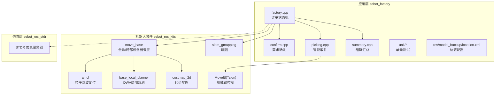

**图示来源** 
- [factory.cpp](file://sebot_factory/src/factory.cpp)
- [amcl_node.cpp](file://sebot_ros_kits/src/sebot_navigation/amcl/src/amcl_node.cpp)
- [move_base.cpp](file://sebot_ros_kits/src/sebot_navigation/move_base/src/move_base.cpp)
- [costmap_2d_ros.h](file://sebot_ros_kits/src/sebot_navigation/costmap_2d/include/costmap_2d/costmap_2d_ros.h)
- [trajectory_planner_ros.h](file://sebot_ros_kits/src/sebot_navigation/base_local_planner/include/base_local_planner/trajectory_planner_ros.h)
- [slam_gmapping.cpp](file://sebot_ros_kits/src/sebot_slam/slam_gmapping/slam_gmapping.cpp)

**章节来源**
- [sebot_factory.launch](file://sebot_factory/launch/sebot_factory.launch)

## 核心组件
- 订单数据结构：订单 ID、优先级、任务类型（取件/送达）、源/目标位置、物品类别、数量、时间戳、状态码、校验信息。
- 订单生命周期：新建→待分配→已分配→执行中→完成/失败→归档。
- 任务调度算法：基于优先级的队列排序（如按截止时间或紧急度加权），结合资源可用性（机器人空闲、电量、负载）进行分配；支持并发多订单并行执行与冲突消解。
- 位置配置 location.xml：定义地点名称、坐标（x,y,θ）、可达性、关联区域与设备（如取件台、货架、充电座）。坐标系统为平面直角坐标系，单位米，角度弧度制，逆时针为正。

**章节来源**
- [order.cpp](file://sebot_factory/unit/order.cpp)
- [location.xml](file://sebot_factory/res/model_backup/location.xml)
- [location.xml](file://sebot_marking/resources/location.xml)

## 架构总览
订单处理系统以 factory.cpp 中的 MultiNavi 状态机为中心，协调 confirm.cpp、picking.cpp、summary.cpp 与导航栈（move_base、AMCL、DWA、代价地图）和机械臂（MoveIt!）。

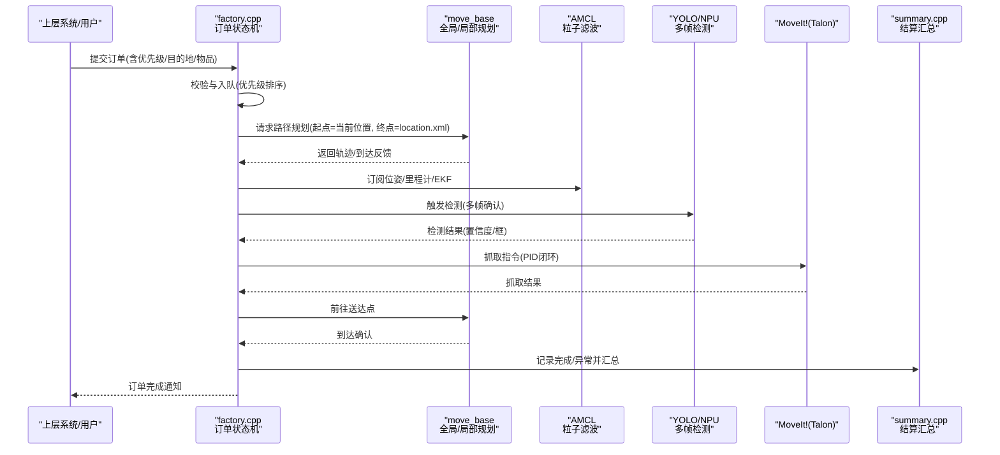

**图示来源** 
- [factory.cpp](file://sebot_factory/src/factory.cpp)
- [move_base.cpp](file://sebot_ros_kits/src/sebot_navigation/move_base/src/move_base.cpp)
- [amcl_node.cpp](file://sebot_ros_kits/src/sebot_navigation/amcl/src/amcl_node.cpp)
- [slam_gmapping.cpp](file://sebot_ros_kits/src/sebot_slam/slam_gmapping/slam_gmapping.cpp)

## 详细组件分析

### 订单数据结构与生命周期
- 字段设计：订单号、优先级、任务类型、源/目标位置名（对应 location.xml）、物品类别、数量、创建时间、更新时间、状态码、错误码、重试次数、校验和。
- 状态机：新建→待分配→已分配→执行中→完成/失败→归档。状态转换受外部事件（导航到达、视觉确认、机械臂动作）与内部定时器（超时、重试）驱动。
- 持久化：内存队列为主，关键状态落盘（JSON/XML）以便重启恢复。

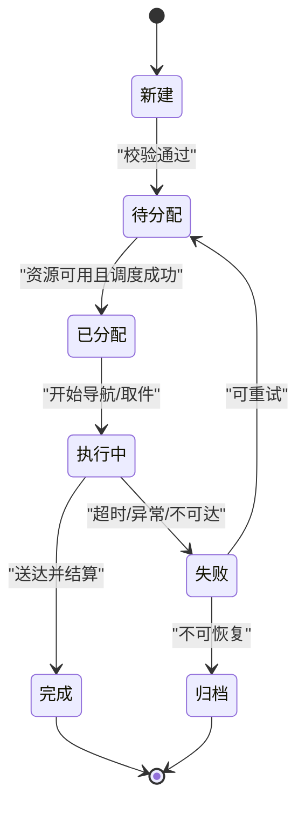

**图示来源** 
- [order.cpp](file://sebot_factory/unit/order.cpp)

**章节来源**
- [order.cpp](file://sebot_factory/unit/order.cpp)

### 位置配置 location.xml 与坐标系统
- 根节点 locations，子节点 location 表示一个地点。
- 属性：name（唯一标识）、x/y（米）、theta（弧度）、type（取件台/货架/充电座等）、reachable（布尔）、zone（区域名）。
- 坐标系统：世界坐标系，原点通常为地图左下角或标定中心，X 向右、Y 向前，角度逆时针为正。
- 用途：导航目标、任务描述、可视化标注、路径规划约束。

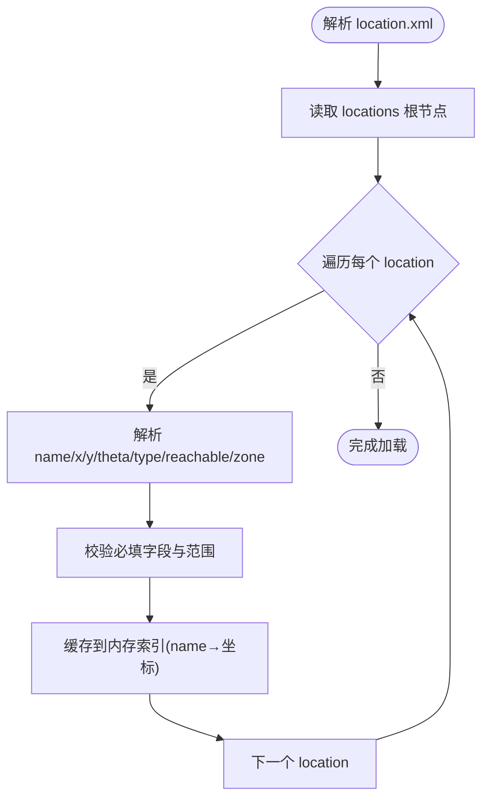

**图示来源** 
- [location.xml](file://sebot_factory/res/model_backup/location.xml)
- [location.xml](file://sebot_marking/resources/location.xml)

**章节来源**
- [location.xml](file://sebot_factory/res/model_backup/location.xml)
- [location.xml](file://sebot_marking/resources/location.xml)

### 订单优先级排序与资源分配策略
- 优先级计算：综合截止时间、紧急度、等待时长、机器人当前负载与电量，形成评分函数。
- 排序策略：最大堆或稳定排序，保证高优先级先出队；同优先级按 FIFO 或最近邻启发式优化。
- 资源分配：选择空闲机器人、电量充足、负载低于阈值者；考虑任务距离与预计耗时，避免热点拥堵。
- 并发控制：限制同时执行的最大订单数，防止资源争用；冲突检测与回退机制（取消低优先级任务）。

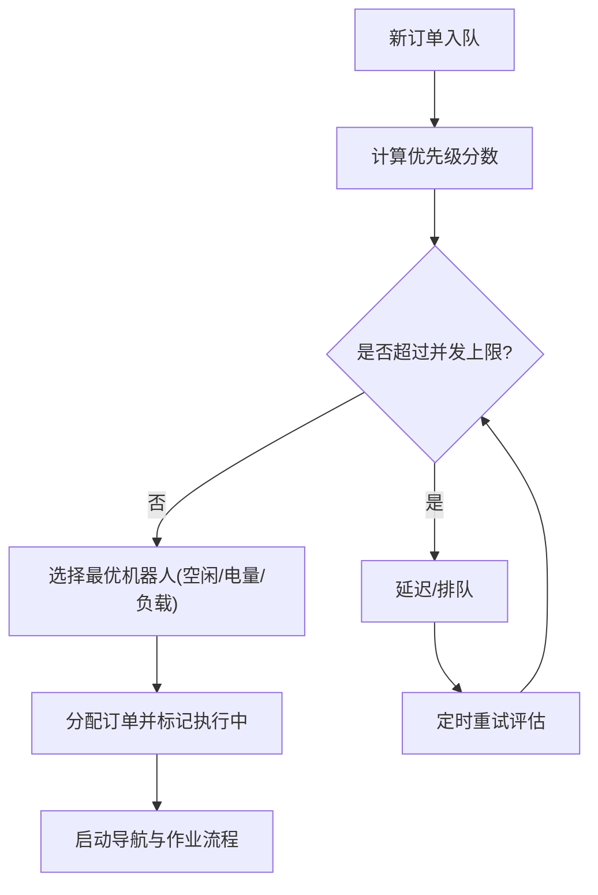

**图示来源** 
- [factory.cpp](file://sebot_factory/src/factory.cpp)

**章节来源**
- [factory.cpp](file://sebot_factory/src/factory.cpp)

### 订单接收、验证、分配、执行与完成流程
- 接收：订阅订单消息或服务调用，解析 JSON/XML，生成订单对象。
- 验证：检查必填字段、位置存在性、可达性、物品类别合法性。
- 分配：根据优先级与资源状态选择机器人，更新订单状态为已分配。
- 执行：导航至取件点→视觉确认→机械臂抓取→导航至送达点→结算。
- 完成：记录日志、更新统计、释放资源。

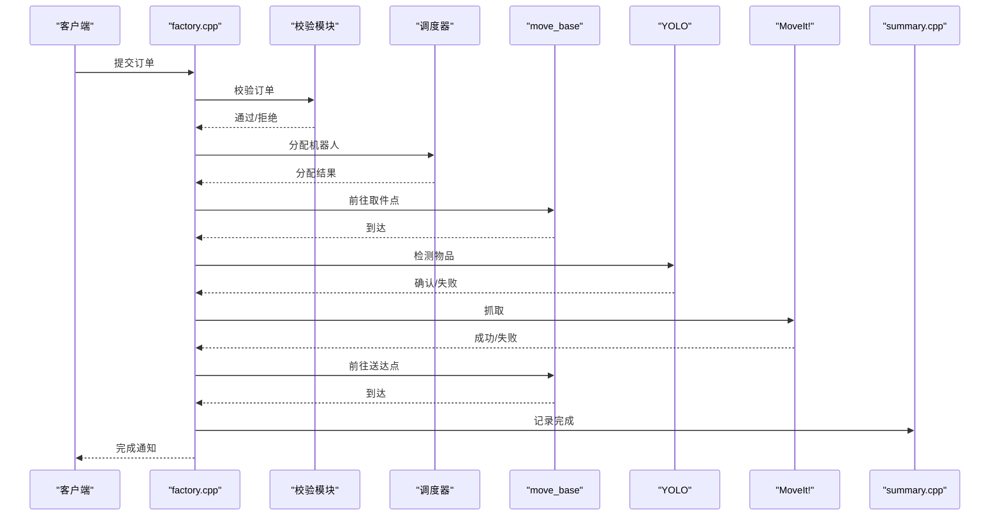

**图示来源** 
- [factory.cpp](file://sebot_factory/src/factory.cpp)
- [confirm.cpp](file://sebot_factory/src/confirm.cpp)
- [picking.cpp](file://sebot_factory/src/picking.cpp)
- [summary.cpp](file://sebot_factory/src/summary.cpp)
- [move_base.cpp](file://sebot_ros_kits/src/sebot_navigation/move_base/src/move_base.cpp)

**章节来源**
- [factory.cpp](file://sebot_factory/src/factory.cpp)
- [confirm.cpp](file://sebot_factory/src/confirm.cpp)
- [picking.cpp](file://sebot_factory/src/picking.cpp)
- [summary.cpp](file://sebot_factory/src/summary.cpp)

### 与导航系统的接口与动态重规划
- 接口：通过 action/service 向 move_base 发送目标位姿（来自 location.xml），订阅里程计与位姿估计（AMCL）。
- 路径规划参数：全局规划器（A*/Dijkstra）、局部规划器（DWA）速度/加速度限制、代价地图膨胀半径、观测层与静态层权重。
- 动态重规划：检测到障碍物或定位漂移时，触发重新规划；支持局部代价地图更新与在线修正。

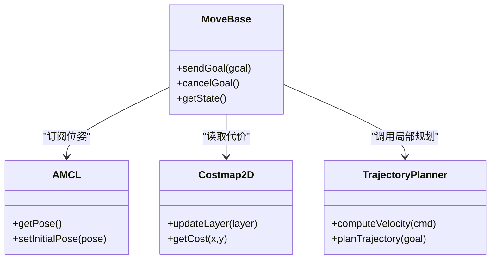

**图示来源** 
- [move_base.cpp](file://sebot_ros_kits/src/sebot_navigation/move_base/src/move_base.cpp)
- [amcl_node.cpp](file://sebot_ros_kits/src/sebot_navigation/amcl/src/amcl_node.cpp)
- [costmap_2d_ros.h](file://sebot_ros_kits/src/sebot_navigation/costmap_2d/include/costmap_2d/costmap_2d_ros.h)
- [trajectory_planner_ros.h](file://sebot_ros_kits/src/sebot_navigation/base_local_planner/include/base_local_planner/trajectory_planner_ros.h)

**章节来源**
- [move_base.cpp](file://sebot_ros_kits/src/sebot_navigation/move_base/src/move_base.cpp)
- [amcl_node.cpp](file://sebot_ros_kits/src/sebot_navigation/amcl/src/amcl_node.cpp)
- [costmap_2d_ros.h](file://sebot_ros_kits/src/sebot_navigation/costmap_2d/include/costmap_2d/costmap_2d_ros.h)
- [trajectory_planner_ros.h](file://sebot_ros_kits/src/sebot_navigation/base_local_planner/include/base_local_planner/trajectory_planner_ros.h)

### 建图与定位集成
- 建图：Gmapping/Hector 提供栅格地图，发布 map 主题；支持在线/离线建图。
- 定位：AMCL 基于激光扫描与地图进行粒子滤波定位，初始位姿可由 UI 设置。
- 集成：factory 在启动时加载地图与 AMCL 配置，确保定位收敛后再下发订单。

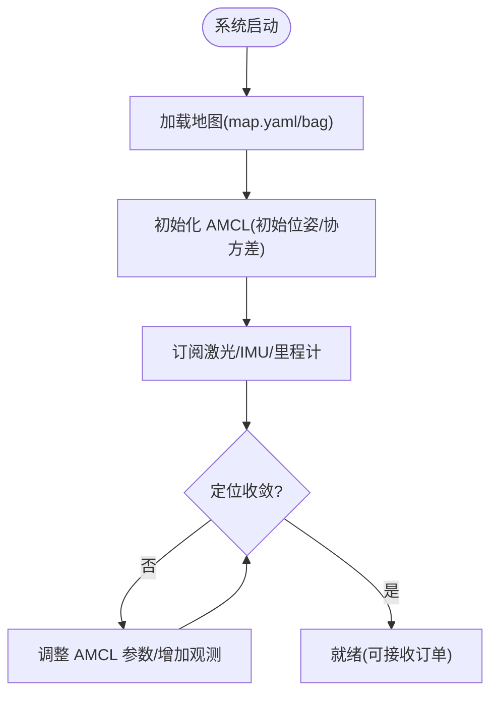

**图示来源** 
- [slam_gmapping.cpp](file://sebot_ros_kits/src/sebot_slam/slam_gmapping/slam_gmapping.cpp)
- [amcl_node.cpp](file://sebot_ros_kits/src/sebot_navigation/amcl/src/amcl_node.cpp)

**章节来源**
- [slam_gmapping.cpp](file://sebot_ros_kits/src/sebot_slam/slam_gmapping/slam_gmapping.cpp)
- [amcl_node.cpp](file://sebot_ros_kits/src/sebot_navigation/amcl/src/amcl_node.cpp)

### 视觉确认与机械臂抓取
- 视觉：YOLOv3 NPU 加速，多帧检测提升鲁棒性；置信度阈值与 IoU 非极大值抑制。
- 抓取：MoveIt! 生成抓取姿态，PID 闭环控制末端执行器；力/位混合控制可选。
- 协同：工厂状态机协调视觉与机械臂时序，失败重试与降级策略。

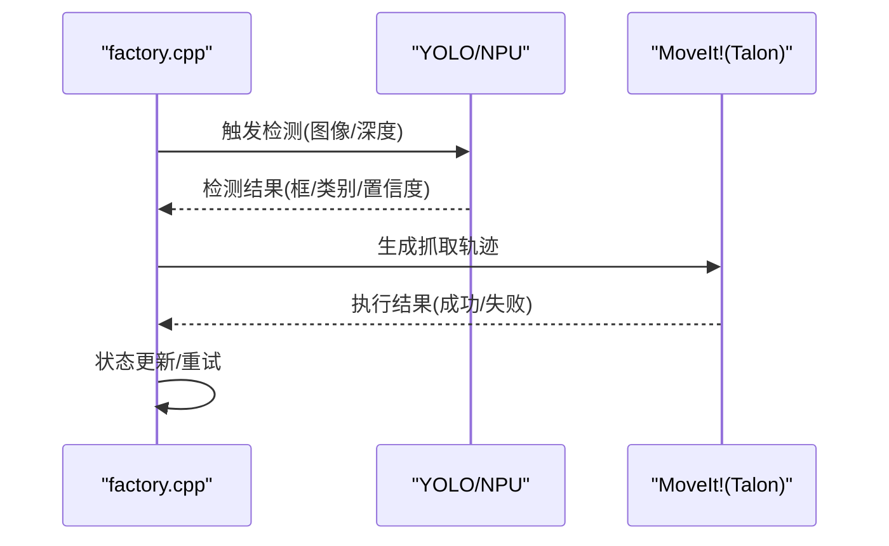

**图示来源** 
- [picking.cpp](file://sebot_factory/src/picking.cpp)

**章节来源**
- [picking.cpp](file://sebot_factory/src/picking.cpp)

### 结算汇总与日志记录
- 结算：记录订单完成时间、路径长度、能耗、异常次数；生成报表。
- 日志：结构化日志（时间戳、级别、模块、消息、上下文），支持滚动与远程上报。
- 监控：指标采集（CPU/内存/ROS 延迟）、告警规则（超时、失败率）。

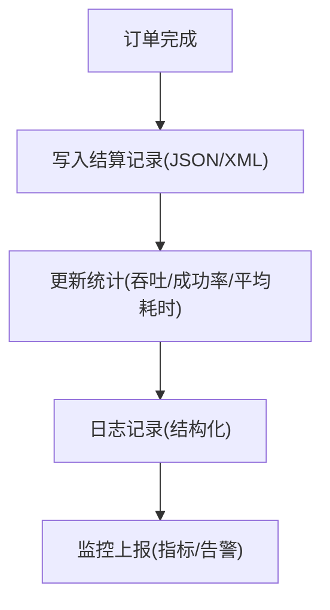

**图示来源** 
- [summary.cpp](file://sebot_factory/src/summary.cpp)

**章节来源**
- [summary.cpp](file://sebot_factory/src/summary.cpp)

### 建图标注上位机（Qt）
- qnode.hpp：封装 ROS 节点通信（主题/服务/参数）。
- CCtrlDashBoard.cpp：UI 交互，设置初始位姿、查看地图、导出 location.xml。

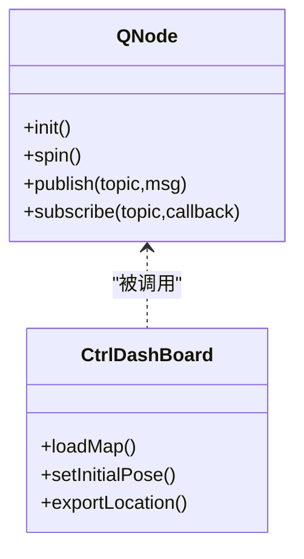

**图示来源** 
- [qnode.hpp](file://sebot_marking/include/qnode.hpp)
- [CCtrlDashBoard.cpp](file://sebot_marking/src/CCtrlDashBoard.cpp)

**章节来源**
- [qnode.hpp](file://sebot_marking/include/qnode.hpp)
- [CCtrlDashBoard.cpp](file://sebot_marking/src/CCtrlDashBoard.cpp)

## 依赖关系分析
- 工厂节点依赖导航栈（move_base、AMCL、DWA、代价地图）、SLAM（Gmapping/Hector）、机械臂（MoveIt!）、视觉（YOLO/NPU）。
- 位置配置 location.xml 被工厂与 UI 共同使用，确保语义一致。
- 仿真层 STDR 通过 launch 参数切换，便于离线验证。

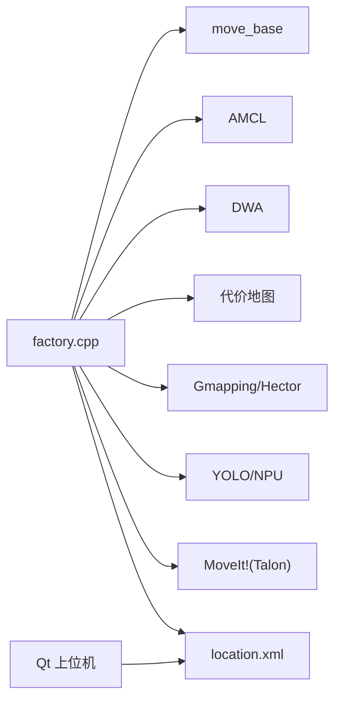

**图示来源** 
- [factory.cpp](file://sebot_factory/src/factory.cpp)
- [location.xml](file://sebot_factory/res/model_backup/location.xml)
- [location.xml](file://sebot_marking/resources/location.xml)

**章节来源**
- [factory.cpp](file://sebot_factory/src/factory.cpp)
- [location.xml](file://sebot_factory/res/model_backup/location.xml)
- [location.xml](file://sebot_marking/resources/location.xml)

## 性能与并发
- 并发模型：多线程/异步回调，限制最大并发订单数，避免 CPU/IO 瓶颈。
- 调度优化：优先级评分函数轻量化，缓存位置索引与机器人状态。
- 导航性能：代价地图增量更新，局部规划器步长与频率调优，减少重规划抖动。
- 视觉性能：NPU 推理批处理，多帧融合降低误检率。

[本节为通用指导，不直接分析具体文件]

## 故障恢复与监控
- 超时与重试：导航超时、视觉失败、机械臂抓取失败均触发重试或降级策略。
- 状态持久化：关键状态落盘，崩溃后恢复至最近一致状态。
- 日志与告警：结构化日志分级，关键错误实时告警；指标采集用于容量规划。
- 定位漂移：AMCL 重定位与地图一致性检查，必要时触发重新建图。

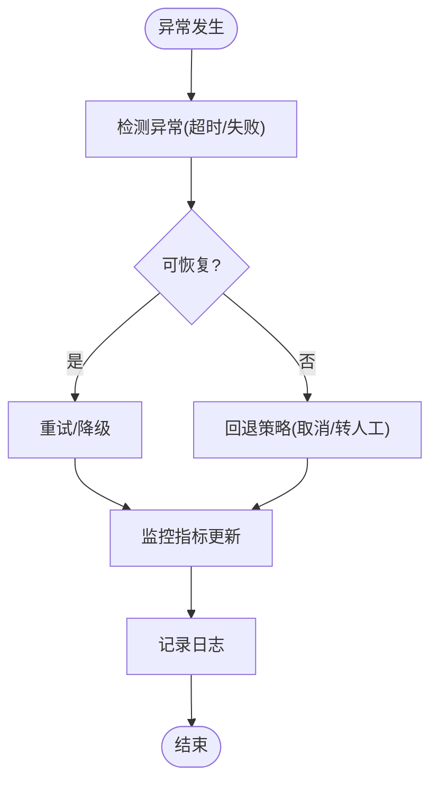

**图示来源** 
- [factory.cpp](file://sebot_factory/src/factory.cpp)
- [summary.cpp](file://sebot_factory/src/summary.cpp)

**章节来源**
- [factory.cpp](file://sebot_factory/src/factory.cpp)
- [summary.cpp](file://sebot_factory/src/summary.cpp)

## 结论
订单处理系统以 factory.cpp 的状态机为核心，整合导航、定位、视觉与机械臂，形成端到端的自动化流程。location.xml 提供统一的位置语义，配合优先级调度与并发控制，实现高效稳定的订单执行。通过结构化日志与监控，保障系统可观测性与可维护性。未来可进一步优化调度算法、增强鲁棒性与扩展多机器人协作。

## 附录
- 关键参数说明（示例）：simulation（仿真模式）、debug（调试界面）、nav_timeout（导航超时）、pid_gain（机械臂 PID）、pick_dist（取件距离）、re_scan（补扫阈值）。
- 常用命令：catkin_make 构建各工作空间；roslaunch 启动对应 launch 文件；rviz 可视化。

[本节为通用指导，不直接分析具体文件]