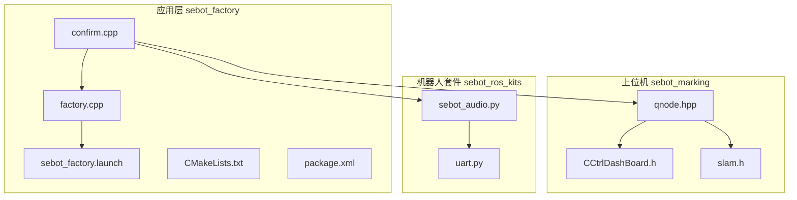
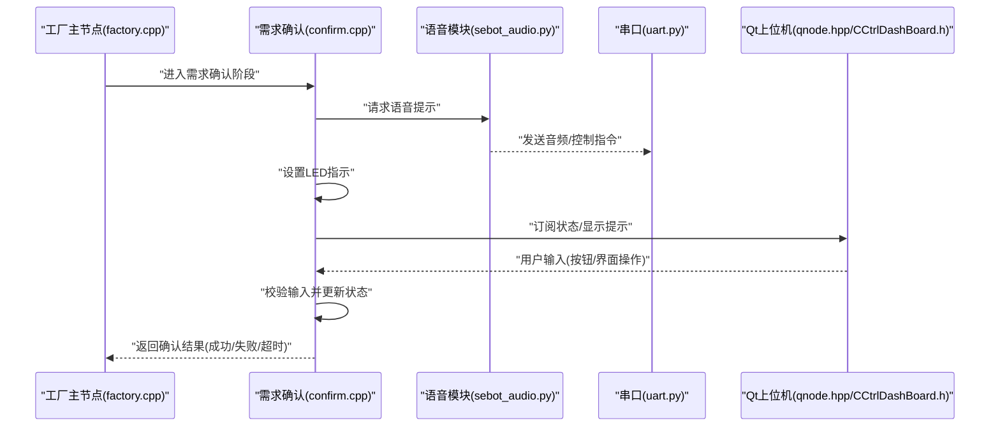
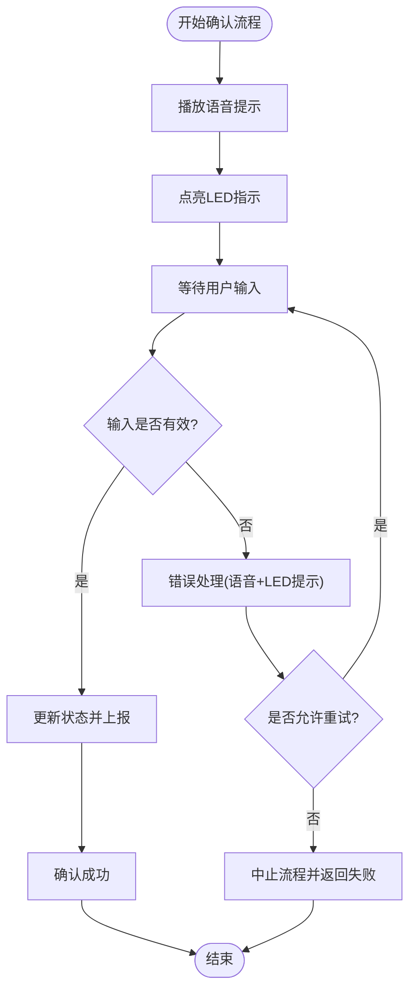
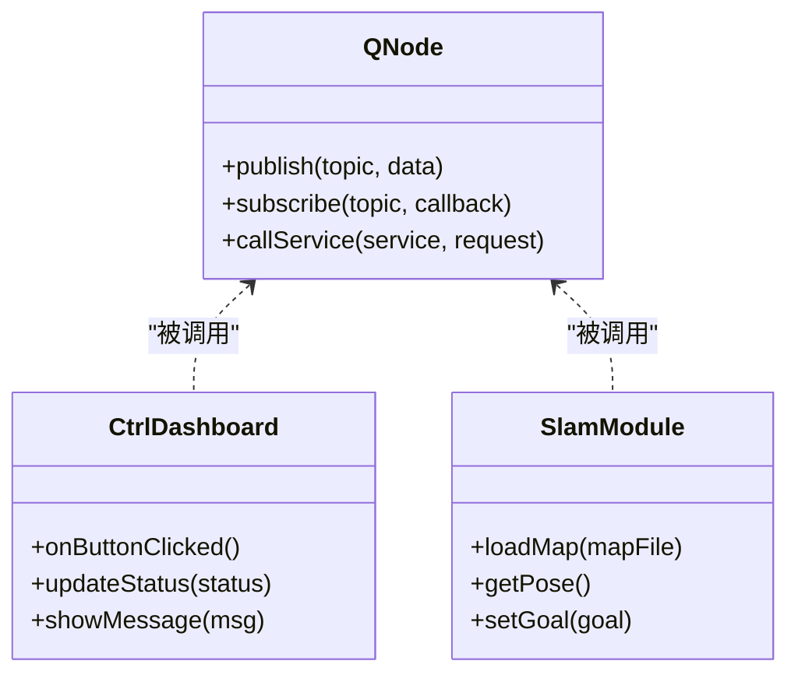
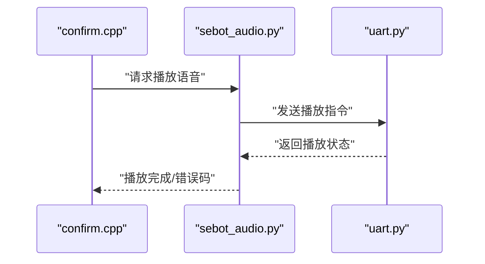
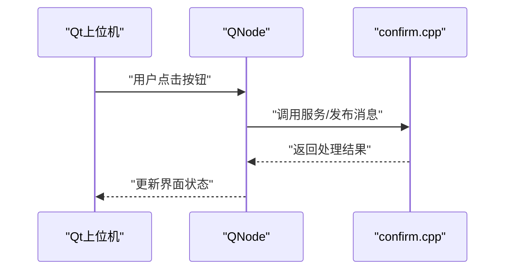
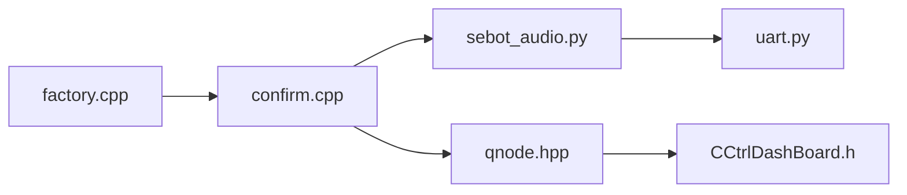

# 需求确认系统

<cite>
**本文引用的文件**   
- [confirm.cpp](file://sebot_factory/src/sebot_factory/src/confirm.cpp)
- [factory.cpp](file://sebot_factory/src/sebot_factory/src/factory.cpp)
- [sebot_factory.launch](file://sebot_factory/src/sebot_factory/launch/sebot_factory.launch)
- [CMakeLists.txt](file://sebot_factory/src/sebot_factory/CMakeLists.txt)
- [package.xml](file://sebot_factory/src/sebot_factory/package.xml)
- [qnode.hpp](file://sebot_factory/src/sebot_marking/include/qnode.hpp)
- [CCtrlDashBoard.h](file://sebot_factory/src/sebot_marking/include/CCtrlDashBoard.h)
- [slam.h](file://sebot_factory/src/sebot_marking/include/slam.h)
- [sebot_audio.py](file://sebot_ros_kits/src/sebot_speech/scripts/sebot_audio.py)
- [uart.py](file://sebot_ros_kits/src/sebot_speech/scripts/uart.py)
</cite>

## 目录
1. [简介](#简介)
2. [项目结构](#项目结构)
3. [核心组件](#核心组件)
4. [架构总览](#架构总览)
5. [详细组件分析](#详细组件分析)
6. [依赖分析](#依赖分析)
7. [性能考虑](#性能考虑)
8. [故障排查指南](#故障排查指南)
9. [结论](#结论)
10. [附录](#附录)

## 简介
本文件面向“需求确认系统”，聚焦 confirm.cpp 的用户交互逻辑与系统集成，涵盖语音提示、LED 指示、按钮响应机制；Qt 界面组件的集成方式、信号槽与事件处理流程；语音反馈生成、音频播放控制与错误提示；以及与上位机界面的数据通信、实时状态同步和用户输入处理。文档同时提供交互流程图、界面布局说明、用户体验优化建议与调试测试方法，帮助开发者快速定位问题并提升交互体验。

## 项目结构
本项目由三个相互独立的 catkin 工作空间组成：
- sebot_factory（应用层）：包含工厂业务主节点（factory.cpp）、需求确认（confirm.cpp）、取件（picking.cpp）、结算（summary.cpp）等核心代码，以及 launch 配置与资源。
- sebot_marking（Qt 上位机）：基于 Qt 的建图标注与控制界面，使用 qnode.hpp、CCtrlDashBoard.h、slam.h 等实现 ROS 通信与 UI 控制。
- sebot_ros_kits（机器人套件）：包含导航栈、传感器驱动、语音模块（sebot_speech）等通用能力。

图表来源
- [confirm.cpp](file://sebot_factory/src/sebot_factory/src/confirm.cpp)
- [factory.cpp](file://sebot_factory/src/sebot_factory/src/factory.cpp)
- [sebot_factory.launch](file://sebot_factory/src/sebot_factory/launch/sebot_factory.launch)
- [CMakeLists.txt](file://sebot_factory/src/sebot_factory/CMakeLists.txt)
- [package.xml](file://sebot_factory/src/sebot_factory/package.xml)
- [qnode.hpp](file://sebot_factory/src/sebot_marking/include/qnode.hpp)
- [CCtrlDashBoard.h](file://sebot_factory/src/sebot_marking/include/CCtrlDashBoard.h)
- [slam.h](file://sebot_factory/src/sebot_marking/include/slam.h)
- [sebot_audio.py](file://sebot_ros_kits/src/sebot_speech/scripts/sebot_audio.py)
- [uart.py](file://sebot_ros_kits/src/sebot_speech/scripts/uart.py)

章节来源
- [sebot_factory.launch](file://sebot_factory/src/sebot_factory/launch/sebot_factory.launch)
- [CMakeLists.txt](file://sebot_factory/src/sebot_factory/CMakeLists.txt)
- [package.xml](file://sebot_factory/src/sebot_factory/package.xml)

## 核心组件
- 需求确认节点（confirm.cpp）
  - 负责在到达取件台后触发需求确认流程，包括语音提示、LED 指示、按钮响应、与上位机/语音模块通信、状态同步与错误处理。
- 工厂主节点（factory.cpp）
  - 管理整体业务流程状态机，协调导航、视觉、机械臂抓取与需求确认阶段切换。
- 语音模块（sebot_speech）
  - 通过 Python 脚本 sebot_audio.py 与串口 uart.py 进行语音合成与播放控制，支持错误提示与状态播报。
- Qt 上位机（sebot_marking）
  - 通过 qnode.hpp 封装 ROS 通信，CCtrlDashBoard.h 与 slam.h 提供界面控件与 SLAM/地图相关功能，用于显示状态、接收用户输入与下发指令。

章节来源
- [confirm.cpp](file://sebot_factory/src/sebot_factory/src/confirm.cpp)
- [factory.cpp](file://sebot_factory/src/sebot_factory/src/factory.cpp)
- [sebot_audio.py](file://sebot_ros_kits/src/sebot_speech/scripts/sebot_audio.py)
- [uart.py](file://sebot_ros_kits/src/sebot_speech/scripts/uart.py)
- [qnode.hpp](file://sebot_factory/src/sebot_marking/include/qnode.hpp)
- [CCtrlDashBoard.h](file://sebot_factory/src/sebot_marking/include/CCtrlDashBoard.h)
- [slam.h](file://sebot_factory/src/sebot_marking/include/slam.h)

## 架构总览
需求确认系统的整体交互链路如下：
- 工厂主节点将流程推进到“需求确认”阶段，调用 confirm.cpp 启动确认流程。
- confirm.cpp 发出语音提示（通过 sebot_audio.py），点亮 LED 指示灯，等待用户按钮输入。
- 用户通过硬件按钮或 Qt 上位机界面进行操作，confirm.cpp 接收输入并更新状态。
- 若确认成功，返回工厂主节点继续后续流程（如视觉搜索与抓取）；若失败或超时，进入错误处理与重试逻辑。

图表来源
- [factory.cpp](file://sebot_factory/src/sebot_factory/src/factory.cpp)
- [confirm.cpp](file://sebot_factory/src/sebot_factory/src/confirm.cpp)
- [sebot_audio.py](file://sebot_ros_kits/src/sebot_speech/scripts/sebot_audio.py)
- [uart.py](file://sebot_ros_kits/src/sebot_speech/scripts/uart.py)
- [qnode.hpp](file://sebot_factory/src/sebot_marking/include/qnode.hpp)
- [CCtrlDashBoard.h](file://sebot_factory/src/sebot_marking/include/CCtrlDashBoard.h)

## 详细组件分析

### confirm.cpp 用户交互逻辑
- 语音提示
  - 在确认流程开始时，调用语音模块生成提示音或语音播报，确保用户感知当前任务阶段。
  - 语音内容可包括任务说明、操作指引与错误提示。
- LED 指示
  - 根据流程状态切换 LED 颜色或闪烁模式，直观反映“等待输入”、“确认中”、“成功”、“失败”等状态。
- 按钮响应机制
  - 监听硬件按钮或上位机输入事件，对有效输入进行去抖与校验，避免误触。
  - 输入成功后更新内部状态，并通知上层节点；输入错误或超时则进入错误处理分支。
- 与上位机通信
  - 通过 ROS Topic/Service 与 Qt 上位机交换状态与指令，保证界面与底层状态一致。
- 错误提示机制
  - 当检测到异常（如输入无效、设备不可用、超时未响应），触发语音与 LED 的错误提示，并记录日志以便调试。

图表来源
- [confirm.cpp](file://sebot_factory/src/sebot_factory/src/confirm.cpp)

章节来源
- [confirm.cpp](file://sebot_factory/src/sebot_factory/src/confirm.cpp)

### Qt 界面组件集成与信号槽机制
- 集成方式
  - 通过 qnode.hpp 封装 ROS 通信接口，向上位机暴露统一 API。
  - CCtrlDashBoard.h 定义界面控件与事件回调，slam.h 提供地图与 SLAM 相关功能。
- 信号槽机制
  - 界面控件（按钮、滑块、文本框）通过信号触发槽函数，执行对应业务逻辑。
  - ROS 消息回调更新界面状态，保证界面与机器人状态同步。
- 事件处理流程
  - 用户操作触发信号 → 槽函数处理 → 调用 qnode 发送 ROS 消息 → 底层节点（confirm.cpp）接收并处理 → 结果回传至界面更新。

图表来源
- [qnode.hpp](file://sebot_factory/src/sebot_marking/include/qnode.hpp)
- [CCtrlDashBoard.h](file://sebot_factory/src/sebot_marking/include/CCtrlDashBoard.h)
- [slam.h](file://sebot_factory/src/sebot_marking/include/slam.h)

章节来源
- [qnode.hpp](file://sebot_factory/src/sebot_marking/include/qnode.hpp)
- [CCtrlDashBoard.h](file://sebot_factory/src/sebot_marking/include/CCtrlDashBoard.h)
- [slam.h](file://sebot_factory/src/sebot_marking/include/slam.h)

### 语音反馈生成与音频播放控制
- 语音生成
  - sebot_audio.py 负责语音合成或预置音频选择，根据任务阶段与状态生成相应提示。
- 播放控制
  - 通过 uart.py 与硬件串口通信，控制音频播放设备的音量、播放进度与停止。
- 错误提示
  - 当语音模块初始化失败、音频设备不可用或播放异常时，输出错误信息并降级为 LED 提示。

图表来源
- [sebot_audio.py](file://sebot_ros_kits/src/sebot_speech/scripts/sebot_audio.py)
- [uart.py](file://sebot_ros_kits/src/sebot_speech/scripts/uart.py)
- [confirm.cpp](file://sebot_factory/src/sebot_factory/src/confirm.cpp)

章节来源
- [sebot_audio.py](file://sebot_ros_kits/src/sebot_speech/scripts/sebot_audio.py)
- [uart.py](file://sebot_ros_kits/src/sebot_speech/scripts/uart.py)
- [confirm.cpp](file://sebot_factory/src/sebot_factory/src/confirm.cpp)

### 与上位机界面的数据通信与实时状态同步
- 通信协议
  - 使用 ROS Topic 发布状态（如“等待输入”、“确认中”、“成功”、“失败”），Service 接收用户指令。
- 状态同步
  - 上位机订阅状态 Topic，实时更新界面显示；用户操作通过 Service 下发至 confirm.cpp。
- 输入处理
  - confirm.cpp 对输入进行校验与去抖，确保可靠性；异常输入触发错误提示与重试。

图表来源
- [qnode.hpp](file://sebot_factory/src/sebot_marking/include/qnode.hpp)
- [confirm.cpp](file://sebot_factory/src/sebot_factory/src/confirm.cpp)

章节来源
- [qnode.hpp](file://sebot_factory/src/sebot_marking/include/qnode.hpp)
- [confirm.cpp](file://sebot_factory/src/sebot_factory/src/confirm.cpp)

## 依赖分析
- 模块耦合
  - confirm.cpp 依赖 factory.cpp 的状态机调度、sebot_speech 的语音模块、Qt 上位机的通信接口。
  - 语音模块依赖串口通信，需确保硬件连接正常。
- 外部依赖
  - ROS 1 通信框架、catkin 构建系统、Python 脚本运行时。
- 潜在循环依赖
  - 需避免 confirm.cpp 与上位机之间直接循环调用，应通过 ROS Topic/Service 解耦。

图表来源
- [factory.cpp](file://sebot_factory/src/sebot_factory/src/factory.cpp)
- [confirm.cpp](file://sebot_factory/src/sebot_factory/src/confirm.cpp)
- [sebot_audio.py](file://sebot_ros_kits/src/sebot_speech/scripts/sebot_audio.py)
- [uart.py](file://sebot_ros_kits/src/sebot_speech/scripts/uart.py)
- [qnode.hpp](file://sebot_factory/src/sebot_marking/include/qnode.hpp)
- [CCtrlDashBoard.h](file://sebot_factory/src/sebot_marking/include/CCtrlDashBoard.h)

章节来源
- [factory.cpp](file://sebot_factory/src/sebot_factory/src/factory.cpp)
- [confirm.cpp](file://sebot_factory/src/sebot_factory/src/confirm.cpp)
- [sebot_audio.py](file://sebot_ros_kits/src/sebot_speech/scripts/sebot_audio.py)
- [uart.py](file://sebot_ros_kits/src/sebot_speech/scripts/uart.py)
- [qnode.hpp](file://sebot_factory/src/sebot_marking/include/qnode.hpp)
- [CCtrlDashBoard.h](file://sebot_factory/src/sebot_marking/include/CCtrlDashBoard.h)

## 性能考虑
- 语音播放延迟
  - 预加载常用语音片段，减少合成时间；必要时采用本地音频文件播放。
- LED 刷新频率
  - 合理设置闪烁周期，避免频繁 IO 操作影响主循环。
- 输入去抖与过滤
  - 软件去抖与阈值过滤，降低误触发概率。
- 通信负载
  - 批量更新状态，避免高频小消息导致网络拥塞。

## 故障排查指南
- 语音模块无法播放
  - 检查 sebot_audio.py 与 uart.py 的串口配置与权限；验证音频设备连接。
- LED 不亮或异常
  - 检查 GPIO 配置与引脚映射；确认电源与电平匹配。
- 按钮无响应
  - 检查输入去抖参数与回调注册；使用日志工具跟踪事件流。
- 上位机状态不同步
  - 检查 ROS Topic/Service 名称与数据类型；确认 QNode 订阅与发布正常。
- 超时与重试
  - 调整超时阈值与重试次数；记录失败原因以便定位。

章节来源
- [confirm.cpp](file://sebot_factory/src/sebot_factory/src/confirm.cpp)
- [sebot_audio.py](file://sebot_ros_kits/src/sebot_speech/scripts/sebot_audio.py)
- [uart.py](file://sebot_ros_kits/src/sebot_speech/scripts/uart.py)
- [qnode.hpp](file://sebot_factory/src/sebot_marking/include/qnode.hpp)

## 结论
需求确认系统通过 confirm.cpp 整合语音提示、LED 指示与按钮响应，结合 Qt 上位机与语音模块，实现了稳定可靠的人机交互流程。合理的状态同步、错误处理与性能优化策略确保了用户体验与系统稳定性。建议在后续迭代中进一步优化语音延迟、输入去抖与通信效率，以提升整体交互流畅度。

## 附录
- 运行配置
  - sebot_factory.launch 中的 simulation 参数用于切换 STDR 仿真模式，debug 参数控制图像识别界面开关；导航超时、PID、取件距离、补扫参数等均在此配置。
- 调试工具
  - 使用 rqt_graph 查看节点关系，rqt_console 查看日志，rosbag 录制与回放消息。
- 测试方法
  - 单元测试：模拟按钮输入与语音模块响应，验证状态转换。
  - 集成测试：端到端流程测试，覆盖成功、失败、超时等场景。
  - 压力测试：高并发输入与长时间运行，观察内存与 CPU 占用。

章节来源
- [sebot_factory.launch](file://sebot_factory/src/sebot_factory/launch/sebot_factory.launch)
- [CMakeLists.txt](file://sebot_factory/src/sebot_factory/CMakeLists.txt)
- [package.xml](file://sebot_factory/src/sebot_factory/package.xml)