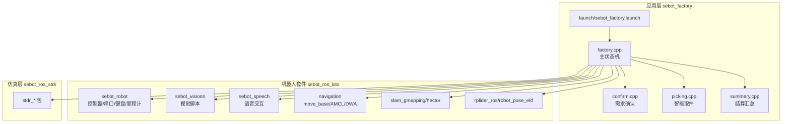
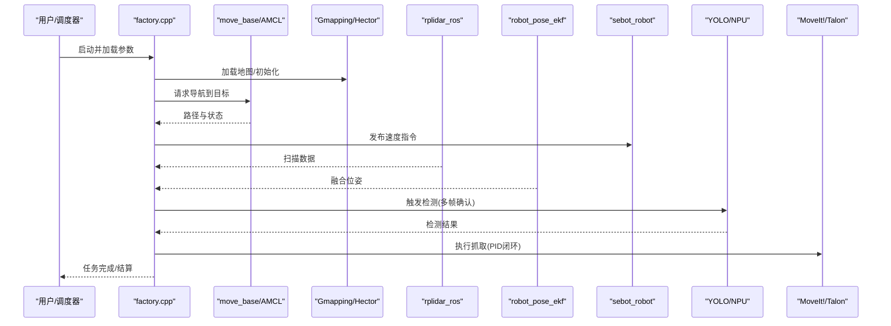
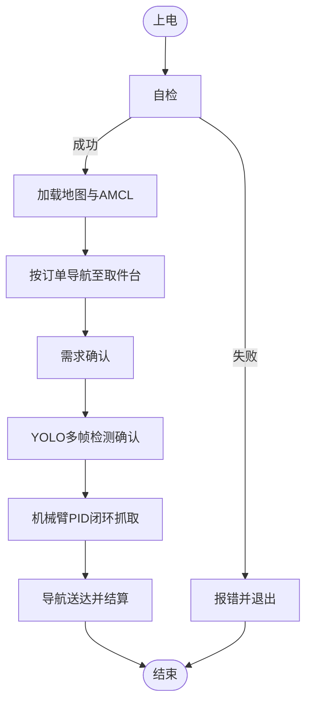
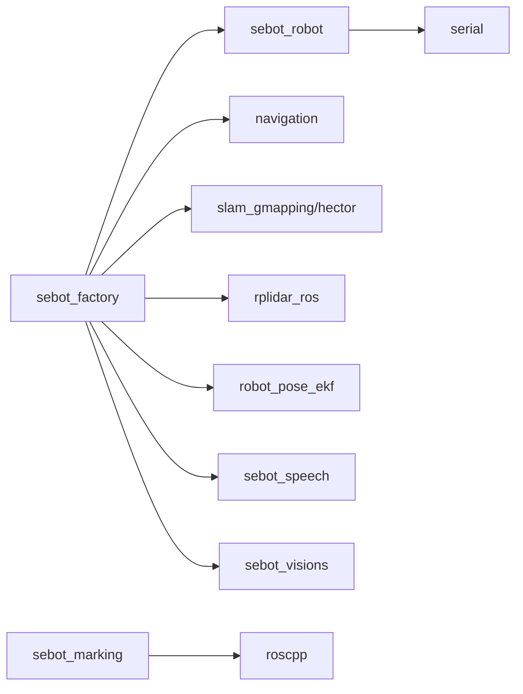

# 代码规范与编程约定

<cite>
**本文引用的文件**   
- [sebot_factory/package.xml](file://sebot_factory/src/sebot_factory/package.xml)
- [sebot_factory/CMakeLists.txt](file://sebot_factory/src/sebot_factory/CMakeLists.txt)
- [sebot_factory/launch/sebot_factory.launch](file://sebot_factory/src/sebot_factory/launch/sebot_factory.launch)
- [sebot_factory/src/factory.cpp](file://sebot_factory/src/sebot_factory/src/factory.cpp)
- [sebot_factory/src/confirm.cpp](file://sebot_factory/src/sebot_factory/src/confirm.cpp)
- [sebot_factory/src/picking.cpp](file://sebot_factory/src/sebot_factory/src/picking.cpp)
- [sebot_factory/src/summary.cpp](file://sebot_factory/src/sebot_factory/src/summary.cpp)
- [sebot_factory/include/sebot_factory/arm.hpp](file://sebot_factory/src/sebot_factory/include/sebot_factory/arm.hpp)
- [sebot_factory/include/sebot_factory/camera.hpp](file://sebot_factory/src/sebot_factory/include/sebot_factory/camera.hpp)
- [sebot_factory/include/sebot_factory/detection.hpp](file://sebot_factory/src/sebot_factory/include/sebot_factory/detection.hpp)
- [sebot_factory/include/sebot_factory/tools.hpp](file://sebot_factory/src/sebot_factory/include/sebot_factory/tools.hpp)
- [sebot_marking/package.xml](file://sebot_marking/src/sebot_marking/package.xml)
- [sebot_marking/CMakeLists.txt](file://sebot_marking/src/sebot_marking/CMakeLists.txt)
- [sebot_marking/launch/sebot_marking.launch](file://sebot_marking/src/sebot_marking/launch/sebot_marking.launch)
- [sebot_marking/src/main.cpp](file://sebot_marking/src/sebot_marking/src/main.cpp)
- [sebot_marking/src/qnode.cpp](file://sebot_marking/src/sebot_marking/src/qnode.cpp)
- [sebot_robot/package.xml](file://sebot_ros_kits/src/sebot_robot/package.xml)
- [sebot_robot/CMakeLists.txt](file://sebot_ros_kits/src/sebot_robot/CMakeLists.txt)
- [sebot_robot/launch/sebot_odom.launch](file://sebot_ros_kits/src/sebot_robot/launch/sebot_odom.launch)
- [sebot_robot/src/controller.cpp](file://sebot_ros_kits/src/sebot_robot/src/controller.cpp)
- [sebot_robot/include/uart.hpp](file://sebot_ros_kits/src/sebot_robot/include/uart.hpp)
- [sebot_speech/package.xml](file://sebot_ros_kits/src/sebot_speech/package.xml)
- [sebot_speech/CMakeLists.txt](file://sebot_ros_kits/src/sebot_speech/CMakeLists.txt)
- [sebot_visions/package.xml](file://sebot_ros_kits/src/sebot_visions/package.xml)
- [sebot_visions/CMakeLists.txt](file://sebot_ros_kits/src/sebot_visions/CMakeLists.txt)
- [sebot_navigation/navigation/package.xml](file://sebot_ros_kits/src/sebot_navigation/navigation/package.xml)
- [sebot_navigation/move_base/package.xml](file://sebot_ros_kits/src/sebot_navigation/move_base/package.xml)
- [sebot_navigation/amcl/package.xml](file://sebot_ros_kits/src/sebot_navigation/amcl/package.xml)
- [sebot_navigation/base_local_planner/package.xml](file://sebot_ros_kits/src/sebot_navigation/base_local_planner/package.xml)
- [rplidar_ros/package.xml](file://sebot_ros_kits/src/sebot_driver/rplidar_ros/package.xml)
- [robot_pose_ekf/package.xml](file://sebot_ros_kits/src/sebot_driver/robot_pose_ekf/package.xml)
- [slam_gmapping/package.xml](file://sebot_ros_kits/src/sebot_slam/slam_gmapping/package.xml)
- [slam_hector/package.xml](file://sebot_ros_kits/src/sebot_slam/slam_hector/package.xml)
</cite>

## 目录
1. [引言](#引言)
2. [项目结构](#项目结构)
3. [核心组件](#核心组件)
4. [架构总览](#架构总览)
5. [详细组件分析](#详细组件分析)
6. [依赖关系分析](#依赖关系分析)
7. [性能考量](#性能考量)
8. [故障排查指南](#故障排查指南)
9. [结论](#结论)
10. [附录](#附录)

## 引言
本规范面向参与机器人竞赛的开发者，统一C++命名、注释、文件组织、ROS接口设计、错误处理与日志调试等编码约定。仓库由三个相互独立的 catkin 工作空间组成：应用层 sebot_factory、机器人套件 sebot_ros_kits、仿真层 sebot_ros_stdr。自研核心集中在 sebot_factory（业务状态机与节点）、sebot_marking（Qt 上位机标注工具）、sebot_robot（底层控制与通信）、sebot_speech（语音交互）与 sebot_visions（视觉脚本）。导航栈与SLAM为开源集成，本文仅说明其在本项目中的角色与参数定制方式。

## 项目结构
- 三层工作空间
  - sebot_factory：应用层，包含工厂业务主节点、确认、取件、结算等子节点及 launch、资源与单元测试。
  - sebot_ros_kits：机器人驱动与功能包集合，含驱动、导航、SLAM、语音、视觉等。
  - sebot_ros_stdr：STDR 仿真环境相关包，用于离线测试与可视化。
- 典型包结构
  - include/：头文件按模块划分，类名与文件名一致，使用 .hpp/.h。
  - src/：源文件以功能为单位拆分，每个 ROS 节点一个可执行目标。
  - launch/：启动脚本集中管理参数、话题重映射与仿真开关。
  - res/ 或 resources/：模型、图片、配置文件等静态资源。
  - CMakeLists.txt / package.xml：构建与依赖声明。

图表来源
- [sebot_factory/launch/sebot_factory.launch](file://sebot_factory/src/sebot_factory/launch/sebot_factory.launch)
- [sebot_factory/src/factory.cpp](file://sebot_factory/src/sebot_factory/src/factory.cpp)
- [sebot_robot/package.xml](file://sebot_ros_kits/src/sebot_robot/package.xml)
- [sebot_navigation/navigation/package.xml](file://sebot_ros_kits/src/sebot_navigation/navigation/package.xml)
- [slam_gmapping/package.xml](file://sebot_ros_kits/src/sebot_slam/slam_gmapping/package.xml)
- [rplidar_ros/package.xml](file://sebot_ros_kits/src/sebot_driver/rplidar_ros/package.xml)

章节来源
- [sebot_factory/package.xml](file://sebot_factory/src/sebot_factory/package.xml)
- [sebot_factory/CMakeLists.txt](file://sebot_factory/src/sebot_factory/CMakeLists.txt)
- [sebot_marking/package.xml](file://sebot_marking/src/sebot_marking/package.xml)
- [sebot_robot/package.xml](file://sebot_ros_kits/src/sebot_robot/package.xml)
- [sebot_speech/package.xml](file://sebot_ros_kits/src/sebot_speech/package.xml)
- [sebot_visions/package.xml](file://sebot_ros_kits/src/sebot_visions/package.xml)

## 核心组件
- 应用层主节点 factory.cpp
  - 职责：实现订单驱动的全流程状态机，协调定位、导航、视觉检测、机械臂抓取与结算。
  - 关键行为：上电自检、加载地图与 AMCL、按订单导航至取件台、需求确认、YOLO 多帧确认、机械臂 PID 闭环抓取、送达并结算。
- 需求确认 confirm.cpp
  - 职责：与上层交互确认任务需求，校验订单有效性，触发后续流程。
- 智能取件 picking.cpp
  - 职责：调用视觉检测与机械臂控制，完成目标识别与抓取动作序列。
- 结算汇总 summary.cpp
  - 职责：统计任务结果，输出结算信息，清理资源。
- Qt 标注工具 sebot_marking
  - 职责：提供建图与标注界面，生成位置与类别标签，辅助训练与验证。
- 底层控制 sebot_robot
  - 职责：串口通信、底盘控制、键盘/摇杆输入、里程计发布与 TF 变换。
- 语音与视觉
  - sebot_speech：语音指令解析与播放。
  - sebot_visions：Python 脚本辅助图像采集与展示。

章节来源
- [sebot_factory/src/factory.cpp](file://sebot_factory/src/sebot_factory/src/factory.cpp)
- [sebot_factory/src/confirm.cpp](file://sebot_factory/src/sebot_factory/src/confirm.cpp)
- [sebot_factory/src/picking.cpp](file://sebot_factory/src/sebot_factory/src/picking.cpp)
- [sebot_factory/src/summary.cpp](file://sebot_factory/src/sebot_factory/src/summary.cpp)
- [sebot_marking/src/main.cpp](file://sebot_marking/src/sebot_marking/src/main.cpp)
- [sebot_marking/src/qnode.cpp](file://sebot_marking/src/sebot_marking/src/qnode.cpp)
- [sebot_robot/src/controller.cpp](file://sebot_ros_kits/src/sebot_robot/src/controller.cpp)

## 架构总览
- 运行入口与配置
  - 通过 launch/sebot_factory.launch 启动主节点，设置 simulation 切换 STDR 仿真模式，debug 控制图像识别界面开关；导航超时、PID、取件距离、补扫等参数集中配置。
- 数据流与控制流
  - 主节点订阅里程计、激光雷达、IMU 与视觉检测结果，发布速度指令与机械臂控制消息；服务接口用于外部控制与查询。
- 导航与SLAM
  - move_base + AMCL + DWA 负责全局与局部规划；Gmapping/Hector 负责建图；EKF 融合 IMU 与轮速计提升位姿估计精度。
- 传感器与驱动
  - rplidar_ros 发布点云/扫描；robot_pose_ekf 融合里程计与 IMU；sebot_robot 提供串口与底盘控制。

图表来源
- [sebot_factory/launch/sebot_factory.launch](file://sebot_factory/src/sebot_factory/launch/sebot_factory.launch)
- [sebot_factory/src/factory.cpp](file://sebot_factory/src/sebot_factory/src/factory.cpp)
- [sebot_navigation/move_base/package.xml](file://sebot_ros_kits/src/sebot_navigation/move_base/package.xml)
- [sebot_navigation/amcl/package.xml](file://sebot_ros_kits/src/sebot_navigation/amcl/package.xml)
- [slam_gmapping/package.xml](file://sebot_ros_kits/src/sebot_slam/slam_gmapping/package.xml)
- [rplidar_ros/package.xml](file://sebot_ros_kits/src/sebot_driver/rplidar_ros/package.xml)
- [robot_pose_ekf/package.xml](file://sebot_ros_kits/src/sebot_driver/robot_pose_ekf/package.xml)
- [sebot_robot/package.xml](file://sebot_ros_kits/src/sebot_robot/package.xml)

## 详细组件分析

### 命名规则与文件组织
- C++ 命名
  - 变量：小写+下划线，如 odom_timeout_ms。
  - 函数：驼峰式，动词开头，如 loadMapAndInitialize()。
  - 类：大驼峰，名词，如 StateMachine、ArmController。
  - 常量：全大写+下划线，如 MAX_GRAB_RETRIES。
  - 文件：头文件与类同名，.hpp/.h；源文件与功能对应，.cpp。
- ROS 包命名
  - 包名小写+下划线，如 sebot_factory、sebot_robot。
  - 节点名小写+下划线，避免与系统命令冲突。
  - 话题与服务名采用名词短语，语义清晰，如 /order/status、/arm/grab。
- 头文件分离
  - 公共接口放 include/，私有实现放 src/；每个类一个头文件。
- 配置文件管理
  - 参数集中 launch/*.launch 与 param/*.yaml；区分仿真与真机参数。

章节来源
- [sebot_factory/include/sebot_factory/arm.hpp](file://sebot_factory/src/sebot_factory/include/sebot_factory/arm.hpp)
- [sebot_factory/include/sebot_factory/camera.hpp](file://sebot_factory/src/sebot_factory/include/sebot_factory/camera.hpp)
- [sebot_factory/include/sebot_factory/detection.hpp](file://sebot_factory/src/sebot_factory/include/sebot_factory/detection.hpp)
- [sebot_factory/include/sebot_factory/tools.hpp](file://sebot_factory/src/sebot_factory/include/sebot_factory/tools.hpp)
- [sebot_factory/CMakeLists.txt](file://sebot_factory/src/sebot_factory/CMakeLists.txt)
- [sebot_robot/include/uart.hpp](file://sebot_ros_kits/src/sebot_robot/include/uart.hpp)

### 注释标准
- 文件头注释
  - 包名、版本、作者、日期、简要描述、许可证。
- 函数注释
  - 功能说明、参数含义、返回值、异常/错误码、副作用。
- 关键逻辑注释
  - 复杂算法、状态转换、边界条件、性能敏感段需加行内注释。
- ROS 接口注释
  - 话题/服务/参数的用途、单位、默认值、取值范围。

章节来源
- [sebot_factory/src/factory.cpp](file://sebot_factory/src/sebot_factory/src/factory.cpp)
- [sebot_marking/src/qnode.cpp](file://sebot_marking/src/sebot_marking/src/qnode.cpp)
- [sebot_robot/src/controller.cpp](file://sebot_ros_kits/src/sebot_robot/src/controller.cpp)

### ROS 特定编码约定
- 节点命名
  - 短小明确，避免通用词，如 order_confirm_node、arm_grab_node。
- 话题命名
  - 使用名词短语，层级清晰，如 /factory/order、/vision/detections、/arm/joint_states。
- 服务接口设计
  - 动词+名词，如 /order/confirm、/arm/grab、/system/reset。
- 参数命名
  - 小写+下划线，带单位后缀，如 timeout_ms、threshold_pct。
- 消息类型
  - 自定义 msg/srv 放在包内 msg/srv 目录，使用 ROS 标准类型优先。

章节来源
- [sebot_factory/launch/sebot_factory.launch](file://sebot_factory/src/sebot_factory/launch/sebot_factory.launch)
- [sebot_robot/launch/sebot_odom.launch](file://sebot_ros_kits/src/sebot_robot/launch/sebot_odom.launch)

### 错误处理模式
- 统一错误码
  - 定义枚举或宏表示错误类别，便于日志与上报。
- 异常与返回码
  - 关键路径使用 try-catch 包裹，非关键路径返回错误码并记录日志。
- 资源清理
  - RAII 管理资源，析构中释放句柄、关闭连接、停止线程。
- 重试与退避
  - 网络/IO 操作支持指数退避与最大重试次数。

章节来源
- [sebot_factory/src/factory.cpp](file://sebot_factory/src/sebot_factory/src/factory.cpp)
- [sebot_robot/src/controller.cpp](file://sebot_ros_kits/src/sebot_robot/src/controller.cpp)

### 日志记录与调试输出
- 分级日志
  - ROS_INFO/WARN/ERROR 分级输出，避免频繁 INFO 刷屏。
- 结构化日志
  - 包含时间戳、节点名、模块、错误码、上下文参数。
- 调试开关
  - 通过参数或环境变量启用详细日志，生产环境默认关闭。
- 可视化调试
  - 使用 RViz/图像窗口显示中间结果，debug 参数控制开关。

章节来源
- [sebot_factory/launch/sebot_factory.launch](file://sebot_factory/src/sebot_factory/launch/sebot_factory.launch)
- [sebot_marking/src/main.cpp](file://sebot_marking/src/sebot_marking/src/main.cpp)

### 状态机与业务流程
- 主状态机
  - 基于 MultiNavi 的状态机在 factory.cpp 中实现，覆盖自检、定位、导航、确认、检测、抓取、结算等阶段。
- 状态转换
  - 事件驱动，进入/退出动作明确，错误分支回退或终止。
- 并发与同步
  - 使用 ROS 回调与队列解耦，关键临界区加锁保护。

图表来源
- [sebot_factory/src/factory.cpp](file://sebot_factory/src/sebot_factory/src/factory.cpp)

章节来源
- [sebot_factory/src/factory.cpp](file://sebot_factory/src/sebot_factory/src/factory.cpp)
- [sebot_factory/src/confirm.cpp](file://sebot_factory/src/sebot_factory/src/confirm.cpp)
- [sebot_factory/src/picking.cpp](file://sebot_factory/src/sebot_factory/src/picking.cpp)
- [sebot_factory/src/summary.cpp](file://sebot_factory/src/sebot_factory/src/summary.cpp)

### Qt 标注工具（sebot_marking）
- 界面与交互
  - 提供建图与标注 UI，生成位置与类别标签，导出为训练数据。
- ROS 集成
  - 通过 qnode 封装 ROS 通信，订阅/发布必要话题。
- 资源管理
  - images.qrc/media.qrc 管理图标与媒体资源。

章节来源
- [sebot_marking/CMakeLists.txt](file://sebot_marking/src/sebot_marking/CMakeLists.txt)
- [sebot_marking/src/main.cpp](file://sebot_marking/src/sebot_marking/src/main.cpp)
- [sebot_marking/src/qnode.cpp](file://sebot_marking/src/sebot_marking/src/qnode.cpp)

### 底层控制（sebot_robot）
- 串口通信
  - uart.hpp 抽象串口接口，封装读写与协议解析。
- 控制与输入
  - controller.cpp 实现速度指令发布；keyboard/joystick 提供输入。
- 里程计与TF
  - 发布里程计与坐标变换，供导航与SLAM使用。

章节来源
- [sebot_robot/include/uart.hpp](file://sebot_ros_kits/src/sebot_robot/include/uart.hpp)
- [sebot_robot/src/controller.cpp](file://sebot_ros_kits/src/sebot_robot/src/controller.cpp)
- [sebot_robot/launch/sebot_odom.launch](file://sebot_ros_kits/src/sebot_robot/launch/sebot_odom.launch)

### 导航与SLAM集成
- 导航栈
  - move_base 作为主控，AMCL 负责定位，DWA 负责局部规划。
- 建图
  - Gmapping/Hector 根据传感器数据构建栅格地图。
- 参数定制
  - 通过 launch 与 yaml 调整代价地图、规划器参数与传感器配置。

章节来源
- [sebot_navigation/navigation/package.xml](file://sebot_ros_kits/src/sebot_navigation/navigation/package.xml)
- [sebot_navigation/move_base/package.xml](file://sebot_ros_kits/src/sebot_navigation/move_base/package.xml)
- [sebot_navigation/amcl/package.xml](file://sebot_ros_kits/src/sebot_navigation/amcl/package.xml)
- [sebot_navigation/base_local_planner/package.xml](file://sebot_ros_kits/src/sebot_navigation/base_local_planner/package.xml)
- [slam_gmapping/package.xml](file://sebot_ros_kits/src/sebot_slam/slam_gmapping/package.xml)
- [slam_hector/package.xml](file://sebot_ros_kits/src/sebot_slam/slam_hector/package.xml)

## 依赖关系分析
- 包依赖
  - sebot_factory 依赖 sebot_robot、navigation、slam、rplidar_ros、robot_pose_ekf、sebot_speech、sebot_visions。
  - sebot_marking 依赖 Qt 与 roscpp。
  - sebot_robot 依赖 roscpp、serial 库。
- 运行时依赖
  - 通过 launch 启动各节点，确保 TF、时钟、参数服务器可用。
- 潜在循环依赖
  - 避免跨包直接包含头文件，使用 ROS 消息/服务解耦。

图表来源
- [sebot_factory/package.xml](file://sebot_factory/src/sebot_factory/package.xml)
- [sebot_robot/package.xml](file://sebot_ros_kits/src/sebot_robot/package.xml)
- [sebot_marking/package.xml](file://sebot_marking/src/sebot_marking/package.xml)
- [sebot_navigation/navigation/package.xml](file://sebot_ros_kits/src/sebot_navigation/navigation/package.xml)
- [slam_gmapping/package.xml](file://sebot_ros_kits/src/sebot_slam/slam_gmapping/package.xml)
- [rplidar_ros/package.xml](file://sebot_ros_kits/src/sebot_driver/rplidar_ros/package.xml)
- [robot_pose_ekf/package.xml](file://sebot_ros_kits/src/sebot_driver/robot_pose_ekf/package.xml)

章节来源
- [sebot_factory/package.xml](file://sebot_factory/src/sebot_factory/package.xml)
- [sebot_robot/package.xml](file://sebot_ros_kits/src/sebot_robot/package.xml)
- [sebot_marking/package.xml](file://sebot_marking/src/sebot_marking/package.xml)

## 性能考量
- 计算密集任务
  - YOLO 推理使用 NPU 加速，多帧检测需合理采样与合并策略。
- I/O 与通信
  - 减少高频日志与图像发布频率，使用压缩传输。
- 内存与线程
  - 避免频繁分配，重用缓冲区；线程间使用无锁队列或原子操作。
- 参数调优
  - 导航超时、PID 增益、检测阈值需按场景标定。

[本节为通用指导，不直接分析具体文件]

## 故障排查指南
- 常见问题
  - 启动失败：检查 launch 参数与依赖包是否编译安装。
  - 定位漂移：查看 AMCL 粒子数与激光匹配质量。
  - 抓取失败：检查视觉置信度阈值与机械臂 PID 参数。
- 诊断手段
  - 使用 rosbag 录制数据回放；RViz 可视化轨迹与点云。
  - 开启 debug 参数获取详细日志。
- 恢复策略
  - 自动重试与降级模式，必要时人工介入。

章节来源
- [sebot_factory/launch/sebot_factory.launch](file://sebot_factory/src/sebot_factory/launch/sebot_factory.launch)
- [sebot_marking/src/main.cpp](file://sebot_marking/src/sebot_marking/src/main.cpp)

## 结论
本规范统一了 C++ 命名、注释、文件组织与 ROS 接口设计，明确了错误处理、日志调试与性能优化策略。通过分层工作空间与模块化设计，确保代码可维护性与可扩展性。建议团队在开发中严格执行本规范，并结合 CI 工具进行风格检查与自动化测试。

[本节为总结，不直接分析具体文件]

## 附录
- 代码风格检查工具
  - clang-format：统一缩进、空格与换行。
  - cpplint：检查 C++ 风格问题。
  - cppcheck：静态分析与潜在缺陷检测。
- IDE 配置建议
  - VS Code：安装 C/C++ 扩展、clang-format、cpplint 插件；配置 tasks 与 lint。
  - CLion：启用内置代码风格与检查规则；集成 CMake 构建。
- 常用命令
  - catkin_make：在工作空间根目录编译。
  - roscore/roslaunch：启动 ROS 与节点。
  - rosrun/rosbag：运行节点与录制数据。

[本节为通用指导，不直接分析具体文件]