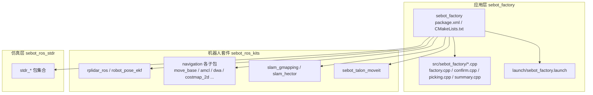
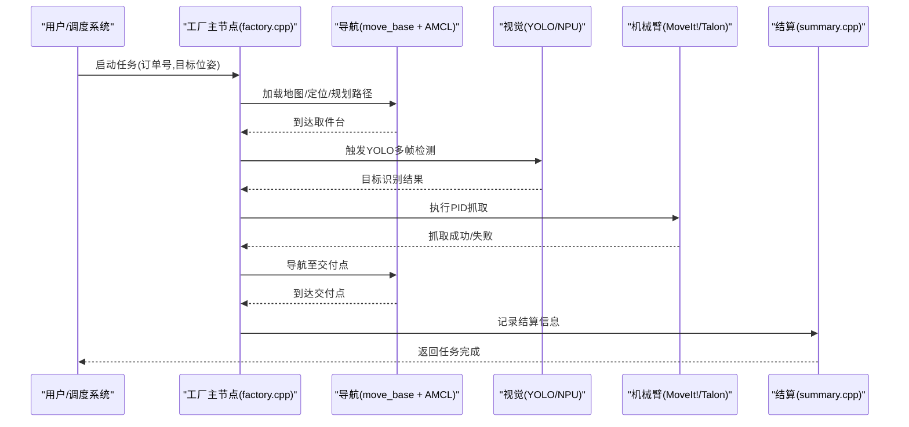
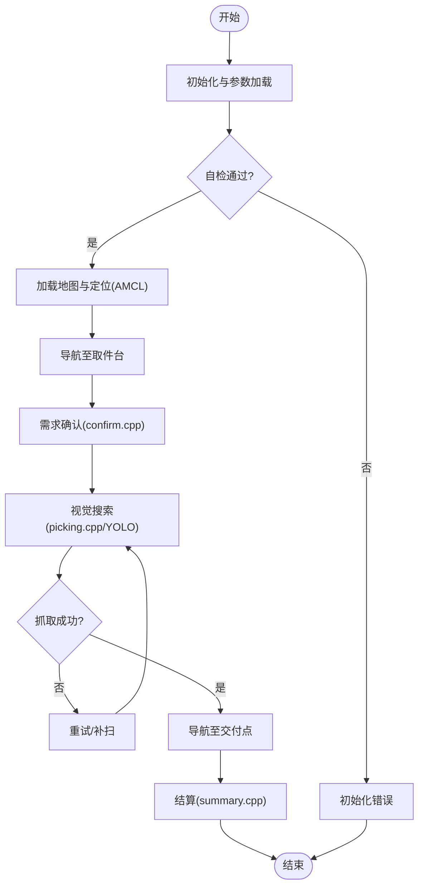
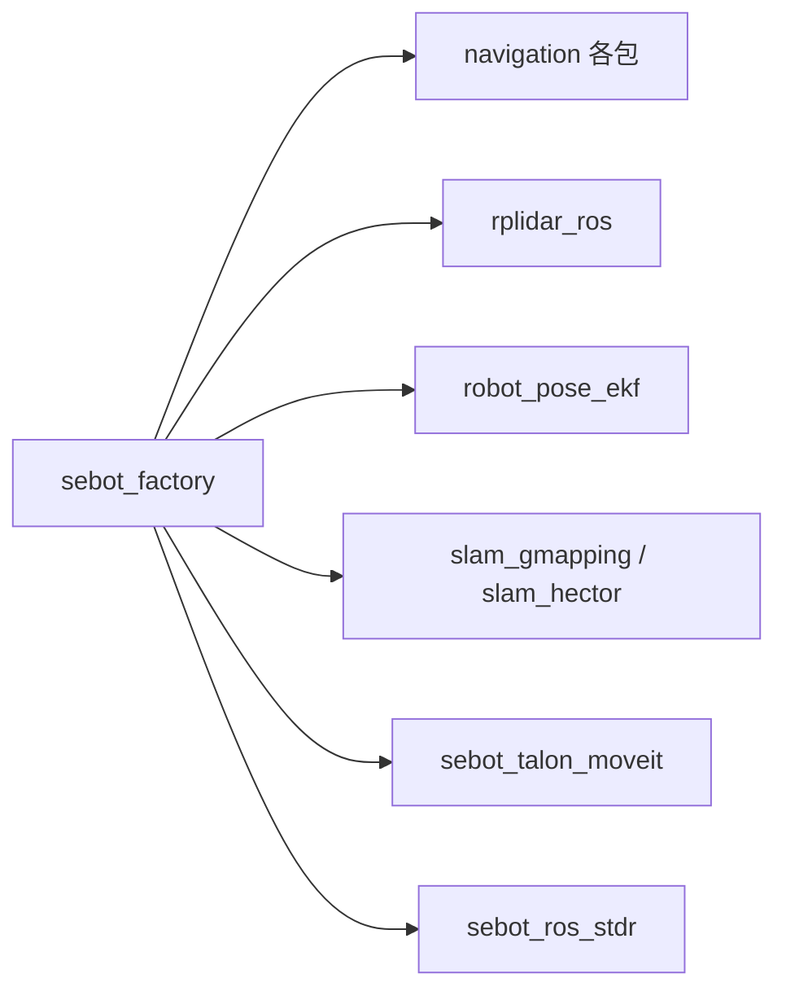

# 代码贡献与协作流程

<cite>
**本文引用的文件**   
- [sebot_factory/package.xml](file://sebot_factory/package.xml)
- [sebot_factory/CMakeLists.txt](file://sebot_factory/CMakeLists.txt)
- [sebot_factory/src/sebot_factory/factory.cpp](file://sebot_factory/src/sebot_factory/factory.cpp)
- [sebot_factory/src/sebot_factory/confirm.cpp](file://sebot_factory/src/sebot_factory/confirm.cpp)
- [sebot_factory/src/sebot_factory/picking.cpp](file://sebot_factory/src/sebot_factory/picking.cpp)
- [sebot_factory/src/sebot_factory/summary.cpp](file://sebot_factory/src/sebot_factory/summary.cpp)
- [sebot_factory/launch/sebot_factory.launch](file://sebot_factory/launch/sebot_factory.launch)
- [sebot_marking/package.xml](file://sebot_marking/package.xml)
- [sebot_marking/CMakeLists.txt](file://sebot_marking/CMakeLists.txt)
- [sebot_marking/src/main.cpp](file://sebot_marking/src/main.cpp)
- [sebot_robot/package.xml](file://sebot_robot/package.xml)
- [sebot_robot/CMakeLists.txt](file://sebot_robot/CMakeLists.txt)
- [sebot_speech/package.xml](file://sebot_speech/package.xml)
- [sebot_speech/CMakeLists.txt](file://sebot_speech/CMakeLists.txt)
- [sebot_visions/package.xml](file://sebot_visions/package.xml)
- [sebot_visions/CMakeLists.txt](file://sebot_visions/CMakeLists.txt)
- [sebot_ros_kits/src/rplidar_ros/package.xml](file://sebot_ros_kits/src/rplidar_ros/package.xml)
- [sebot_ros_kits/src/rplidar_ros/CHANGELOG.rst](file://sebot_ros_kits/src/rplidar_ros/CHANGELOG.rst)
- [sebot_ros_kits/src/robot_pose_ekf/package.xml](file://sebot_ros_kits/src/robot_pose_ekf/package.xml)
- [sebot_ros_kits/src/robot_pose_ekf/CHANGELOG.rst](file://sebot_ros_kits/src/robot_pose_ekf/CHANGELOG.rst)
- [sebot_ros_kits/src/slam_gmapping/README.md](file://sebot_ros_kits/src/slam_gmapping/README.md)
- [sebot_ros_kits/src/slam_hector/README.txt](file://sebot_ros_kits/src/slam_hector/README.txt)
- [sebot_ros_stdr/README.md](file://sebot_ros_stdr/README.md)
</cite>

## 目录
1. [简介](#简介)
2. [项目结构](#项目结构)
3. [核心组件](#核心组件)
4. [架构总览](#架构总览)
5. [详细组件分析](#详细组件分析)
6. [依赖分析](#依赖分析)
7. [性能考虑](#性能考虑)
8. [故障排查指南](#故障排查指南)
9. [结论](#结论)
10. [附录](#附录)

## 简介
本指南面向参与机器人竞赛项目的开发者，统一代码贡献与协作流程。内容覆盖：
- Git 工作流（分支策略、提交信息规范、代码审查）
- ROS 包版本管理与依赖更新
- 合并流程（Pull Request 创建、审查、冲突解决）
- 文档更新规范（README、API 文档、变更日志）
- 团队协作最佳实践（任务分配、进度跟踪、沟通方式）
- 新成员上手流程与导师制度

本项目由三个相互独立的 catkin 工作空间组成：应用层 sebot_factory、机器人套件 sebot_ros_kits、仿真层 sebot_ros_stdr，各自含 src/ 且需分别 catkin_make。自研核心集中在 sebot_factory（factory.cpp 送件状态机、confirm.cpp 需求确认、picking.cpp 智能取件、summary.cpp 结算汇总）、sebot_marking（Qt 建图标注上位机）、sebot_robot、sebot_speech、sebot_visions。导航栈与 SLAM 等第三方包在本项目中仅做集成与参数定制，不深入其内部实现。

## 项目结构
仓库包含三大工作空间，每个工作空间遵循 ROS 包标准组织：
- sebot_factory：业务主节点与 launch 配置
- sebot_ros_kits：驱动、导航、SLAM、MoveIt! 等套件包
- sebot_ros_stdr：STDR 仿真环境相关包

**图表来源** 
- [sebot_factory/package.xml](file://sebot_factory/package.xml)
- [sebot_factory/CMakeLists.txt](file://sebot_factory/CMakeLists.txt)
- [sebot_ros_kits/src/rplidar_ros/package.xml](file://sebot_ros_kits/src/rplidar_ros/package.xml)
- [sebot_ros_kits/src/robot_pose_ekf/package.xml](file://sebot_ros_kits/src/robot_pose_ekf/package.xml)
- [sebot_ros_stdr/README.md](file://sebot_ros_stdr/README.md)

**章节来源**
- [sebot_factory/package.xml](file://sebot_factory/package.xml)
- [sebot_factory/CMakeLists.txt](file://sebot_factory/CMakeLists.txt)
- [sebot_ros_kits/src/rplidar_ros/package.xml](file://sebot_ros_kits/src/rplidar_ros/package.xml)
- [sebot_ros_kits/src/robot_pose_ekf/package.xml](file://sebot_ros_kits/src/robot_pose_ekf/package.xml)
- [sebot_ros_stdr/README.md](file://sebot_ros_stdr/README.md)

## 核心组件
- 应用层 sebot_factory
  - factory.cpp：主状态机（MultiNavi），串联导航、视觉、机械臂抓取与结算
  - confirm.cpp：需求确认交互
  - picking.cpp：基于 YOLO（NPU 加速 Yolov3）的多帧检测与确认
  - summary.cpp：订单结算汇总
  - launch/sebot_factory.launch：运行入口，simulation/debug 等关键参数集中管理
- 机器人套件 sebot_ros_kits
  - rplidar_ros：激光雷达驱动
  - robot_pose_ekf：里程计与 IMU 融合
  - navigation 各包：全局/局部规划、代价地图、定位 AMCL
  - slam_gmapping / slam_hector：建图算法
  - sebot_talon_moveit：机械臂 MoveIt! 配置与启动
- 仿真层 sebot_ros_stdr
  - stdr_* 包：仿真器、GUI、导航、资源等

**章节来源**
- [sebot_factory/src/sebot_factory/factory.cpp](file://sebot_factory/src/sebot_factory/factory.cpp)
- [sebot_factory/src/sebot_factory/confirm.cpp](file://sebot_factory/src/sebot_factory/confirm.cpp)
- [sebot_factory/src/sebot_factory/picking.cpp](file://sebot_factory/src/sebot_factory/picking.cpp)
- [sebot_factory/src/sebot_factory/summary.cpp](file://sebot_factory/src/sebot_factory/summary.cpp)
- [sebot_factory/launch/sebot_factory.launch](file://sebot_factory/launch/sebot_factory.launch)
- [sebot_ros_kits/src/rplidar_ros/package.xml](file://sebot_ros_kits/src/rplidar_ros/package.xml)
- [sebot_ros_kits/src/robot_pose_ekf/package.xml](file://sebot_ros_kits/src/robot_pose_ekf/package.xml)
- [sebot_ros_kits/src/slam_gmapping/README.md](file://sebot_ros_kits/src/slam_gmapping/README.md)
- [sebot_ros_kits/src/slam_hector/README.txt](file://sebot_ros_kits/src/slam_hector/README.txt)
- [sebot_ros_stdr/README.md](file://sebot_ros_stdr/README.md)

## 架构总览
比赛全链路：上电自检 → 加载地图与 AMCL 定位 → 按订单导航至取件台 → 需求确认 → YOLO 视觉搜索（多帧检测确认）→ 机械臂 PID 闭环抓取 → 导航送达并结算。主状态机位于 factory.cpp，通过 launch 参数切换仿真模式与调试开关。

**图表来源** 
- [sebot_factory/src/sebot_factory/factory.cpp](file://sebot_factory/src/sebot_factory/factory.cpp)
- [sebot_factory/src/sebot_factory/picking.cpp](file://sebot_factory/src/sebot_factory/picking.cpp)
- [sebot_factory/src/sebot_factory/summary.cpp](file://sebot_factory/src/sebot_factory/summary.cpp)
- [sebot_factory/launch/sebot_factory.launch](file://sebot_factory/launch/sebot_factory.launch)

## 详细组件分析

### 工厂主节点与状态机（factory.cpp）
- 职责：编排导航、视觉、机械臂、结算等子流程；维护任务生命周期与错误恢复
- 关键行为：
  - 初始化与参数读取（来自 launch）
  - 状态转换（自检、定位、导航、确认、视觉、抓取、交付、结算）
  - 超时与异常处理（导航超时、视觉失败、抓取失败回退）
- 建议扩展点：新增业务阶段时，在状态机中增加状态与转换条件，并在 launch 中补充参数

**图表来源** 
- [sebot_factory/src/sebot_factory/factory.cpp](file://sebot_factory/src/sebot_factory/factory.cpp)
- [sebot_factory/src/sebot_factory/confirm.cpp](file://sebot_factory/src/sebot_factory/confirm.cpp)
- [sebot_factory/src/sebot_factory/picking.cpp](file://sebot_factory/src/sebot_factory/picking.cpp)
- [sebot_factory/src/sebot_factory/summary.cpp](file://sebot_factory/src/sebot_factory/summary.cpp)

**章节来源**
- [sebot_factory/src/sebot_factory/factory.cpp](file://sebot_factory/src/sebot_factory/factory.cpp)
- [sebot_factory/src/sebot_factory/confirm.cpp](file://sebot_factory/src/sebot_factory/confirm.cpp)
- [sebot_factory/src/sebot_factory/picking.cpp](file://sebot_factory/src/sebot_factory/picking.cpp)
- [sebot_factory/src/sebot_factory/summary.cpp](file://sebot_factory/src/sebot_factory/summary.cpp)

### 视觉与抓取（picking.cpp）
- 职责：调用 YOLO（NPU 加速 Yolov3）进行多帧检测与确认，输出稳定目标位姿
- 关键点：
  - 多帧一致性校验（降低误检）
  - 与机械臂坐标系标定与误差补偿
  - 失败重试与补扫策略

**章节来源**
- [sebot_factory/src/sebot_factory/picking.cpp](file://sebot_factory/src/sebot_factory/picking.cpp)

### 结算汇总（summary.cpp）
- 职责：记录任务执行结果、统计指标与结算信息
- 关键点：
  - 数据持久化（本地文件或消息）
  - 可追溯性（时间戳、订单号、状态码）

**章节来源**
- [sebot_factory/src/sebot_factory/summary.cpp](file://sebot_factory/src/sebot_factory/summary.cpp)

### 运行配置（launch/sebot_factory.launch）
- 关键参数：
  - simulation：切换 STDR 仿真模式
  - debug：控制图像识别界面开关
  - 导航超时、PID 参数、取件距离、补扫阈值等
- 使用建议：
  - 区分开发/测试/发布参数集
  - 通过环境变量或参数文件注入

**章节来源**
- [sebot_factory/launch/sebot_factory.launch](file://sebot_factory/launch/sebot_factory.launch)

### Qt 标注上位机（sebot_marking）
- 职责：建图与标注工具，生成位置信息与类别映射
- 关键点：
  - UI 与后端通信（ROS topic/service）
  - 资源管理（images.qrc/media.qrc）

**章节来源**
- [sebot_marking/package.xml](file://sebot_marking/package.xml)
- [sebot_marking/CMakeLists.txt](file://sebot_marking/CMakeLists.txt)
- [sebot_marking/src/main.cpp](file://sebot_marking/src/main.cpp)

### 其他自研包（sebot_robot、sebot_speech、sebot_visions）
- sebot_robot：底层控制与传感器桥接（键盘/摇杆、变换广播）
- sebot_speech：语音交互脚本与音频资源
- sebot_visions：视觉辅助脚本（如 joyStick.py、sebotCollection.py）

**章节来源**
- [sebot_robot/package.xml](file://sebot_robot/package.xml)
- [sebot_robot/CMakeLists.txt](file://sebot_robot/CMakeLists.txt)
- [sebot_speech/package.xml](file://sebot_speech/package.xml)
- [sebot_speech/CMakeLists.txt](file://sebot_speech/CMakeLists.txt)
- [sebot_visions/package.xml](file://sebot_visions/package.xml)
- [sebot_visions/CMakeLists.txt](file://sebot_visions/CMakeLists.txt)

## 依赖分析
- 包间依赖关系
  - sebot_factory 依赖导航、SLAM、驱动与 MoveIt! 包
  - sebot_ros_kits 提供驱动、导航、SLAM、MoveIt! 能力
  - sebot_ros_stdr 提供仿真环境与资源
- 第三方包角色
  - rplidar_ros：激光雷达驱动
  - robot_pose_ekf：里程计与 IMU 融合
  - slam_gmapping / slam_hector：建图
  - navigation 各包：定位与规划

**图表来源** 
- [sebot_factory/package.xml](file://sebot_factory/package.xml)
- [sebot_ros_kits/src/rplidar_ros/package.xml](file://sebot_ros_kits/src/rplidar_ros/package.xml)
- [sebot_ros_kits/src/robot_pose_ekf/package.xml](file://sebot_ros_kits/src/robot_pose_ekf/package.xml)
- [sebot_ros_kits/src/slam_gmapping/README.md](file://sebot_ros_kits/src/slam_gmapping/README.md)
- [sebot_ros_kits/src/slam_hector/README.txt](file://sebot_ros_kits/src/slam_hector/README.txt)
- [sebot_ros_stdr/README.md](file://sebot_ros_stdr/README.md)

**章节来源**
- [sebot_factory/package.xml](file://sebot_factory/package.xml)
- [sebot_ros_kits/src/rplidar_ros/package.xml](file://sebot_ros_kits/src/rplidar_ros/package.xml)
- [sebot_ros_kits/src/robot_pose_ekf/package.xml](file://sebot_ros_kits/src/robot_pose_ekf/package.xml)
- [sebot_ros_kits/src/slam_gmapping/README.md](file://sebot_ros_kits/src/slam_gmapping/README.md)
- [sebot_ros_kits/src/slam_hector/README.txt](file://sebot_ros_kits/src/slam_hector/README.txt)
- [sebot_ros_stdr/README.md](file://sebot_ros_stdr/README.md)

## 性能考虑
- 视觉推理：优先使用 NPU 加速的 YOLO，合理设置多帧阈值与缓存
- 导航规划：根据环境复杂度调整代价地图分辨率与局部规划步长
- 传感器融合：EKF 参数调优以减少漂移
- 资源占用：限制图像传输频率与可视化窗口刷新率

[本节为通用指导，无需特定文件引用]

## 故障排查指南
- 常见问题定位
  - 导航超时：检查地图加载、AMCL 初始位姿、代价地图参数
  - 视觉失败：确认相机标定、光照条件、YOLO 模型路径
  - 抓取失败：核对坐标变换、PID 参数、末端夹具状态
- 日志与调试
  - 启用 debug 参数以打开图像识别界面
  - 查看各节点 rosbag 回放与 rosout 日志
- 回退策略
  - 视觉失败后自动补扫与重试
  - 抓取失败后回退到安全位姿并重试

**章节来源**
- [sebot_factory/launch/sebot_factory.launch](file://sebot_factory/launch/sebot_factory.launch)
- [sebot_factory/src/sebot_factory/picking.cpp](file://sebot_factory/src/sebot_factory/picking.cpp)

## 结论
通过统一的 Git 工作流、清晰的包依赖与参数管理、严格的代码审查与文档规范，团队可在多工作空间环境下高效协作。建议持续完善变更日志与 API 文档，确保版本可追溯与问题可复现。

[本节为总结性内容，无需特定文件引用]

## 附录

### Git 工作流程与分支策略
- 分支命名
  - feature/<功能名>：新功能开发
  - fix/<问题描述>：缺陷修复
  - release/<版本号>：发布准备
  - hotfix/<问题描述>：紧急修复
- 提交信息规范
  - 格式：<类型>(<范围>): <简述>
  - 类型：feat、fix、docs、style、refactor、test、chore
  - 示例：feat(factory): 增加订单结算模块
- 分支保护
  - main/master 仅接受 PR 合并
  - 强制 CI 通过后方可合并

### 代码审查流程
- 创建 Pull Request
  - 关联 Issue/任务编号
  - 填写变更说明与影响范围
- 审查要点
  - 逻辑正确性与边界条件
  - 可读性与注释完整性
  - 性能与资源占用
  - 兼容性与回退方案
- 合并要求
  - 至少一名 Maintainer 批准
  - CI 全部通过
  - 无未解决评论

### 冲突解决
- 先拉取最新主干，再本地 rebase 或 merge
- 逐文件解决冲突，避免遗漏
- 重新运行构建与测试，确保无回归

### ROS 包版本管理与依赖更新
- package.xml
  - 明确依赖包与版本约束
  - 使用 <depend> 与 <exec_depend> 声明运行时依赖
- CMakeLists.txt
  - find_package 指定依赖
  - add_executable/add_library 与 target_link_libraries 链接库
- 依赖更新步骤
  - 升级上游包版本（rplidar_ros、robot_pose_ekf、slam_gmapping/hector）
  - 更新 package.xml 版本与依赖
  - 验证构建与运行
  - 记录变更日志与兼容性说明

**章节来源**
- [sebot_factory/package.xml](file://sebot_factory/package.xml)
- [sebot_factory/CMakeLists.txt](file://sebot_factory/CMakeLists.txt)
- [sebot_ros_kits/src/rplidar_ros/package.xml](file://sebot_ros_kits/src/rplidar_ros/package.xml)
- [sebot_ros_kits/src/rplidar_ros/CHANGELOG.rst](file://sebot_ros_kits/src/rplidar_ros/CHANGELOG.rst)
- [sebot_ros_kits/src/robot_pose_ekf/package.xml](file://sebot_ros_kits/src/robot_pose_ekf/package.xml)
- [sebot_ros_kits/src/robot_pose_ekf/CHANGELOG.rst](file://sebot_ros_kits/src/robot_pose_ekf/CHANGELOG.rst)

### 文档更新规范
- README
  - 安装与环境说明
  - 快速开始与常用命令
  - 参数说明与示例
- API 文档
  - Topic/Service/Action 定义
  - 消息结构与字段含义
  - 示例用法与注意事项
- 变更日志
  - 按版本记录新增、修复、破坏性变更
  - 保持与 package.xml 版本一致

### 团队协作最佳实践
- 任务分配
  - 使用 Issue/看板跟踪任务状态
  - 明确负责人与截止日期
- 进度跟踪
  - 每日站会同步进展与阻塞
  - 周报汇总里程碑与风险
- 沟通方式
  - 技术讨论在 Issue/PR 评论中进行
  - 重要决策归档至 Wiki

### 新成员上手流程与导师制度
- 环境搭建
  - 克隆仓库，初始化三个工作空间
  - 安装依赖，catkin_make 构建
- 熟悉代码
  - 阅读 sebot_factory 主流程与 launch 参数
  - 理解导航与 SLAM 集成方式
- 导师制度
  - 指定导师负责前两周辅导
  - 每周一次一对一反馈与计划调整

[本节为通用指导，无需特定文件引用]