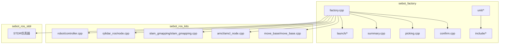
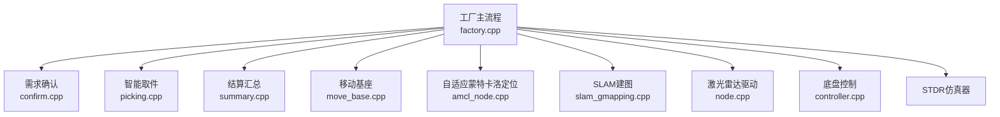
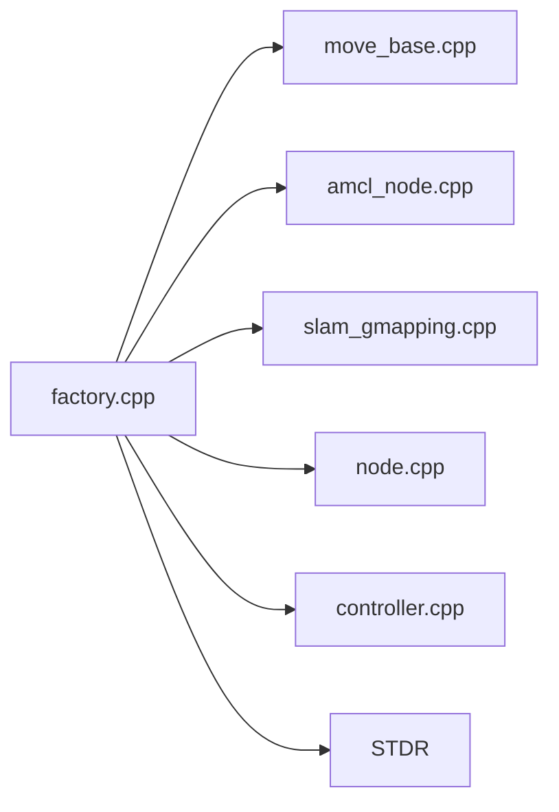

# 单元测试与测试方法

<cite>
**本文档引用的文件**
- [sebot_factory/CMakeLists.txt](file://sebot_factory/CMakeLists.txt)
- [sebot_factory/package.xml](file://sebot_factory/package.xml)
- [sebot_factory/src/sebot_factory/factory.cpp](file://sebot_factory/src/sebot_factory/factory.cpp)
- [sebot_factory/src/sebot_factory/confirm.cpp](file://sebot_factory/src/sebot_factory/confirm.cpp)
- [sebot_factory/src/sebot_factory/picking.cpp](file://sebot_factory/src/sebot_factory/picking.cpp)
- [sebot_factory/src/sebot_factory/summary.cpp](file://sebot_factory/src/sebot_factory/summary.cpp)
- [sebot_factory/src/sebot_factory/unit/arm.cpp](file://sebot_factory/src/sebot_factory/unit/arm.cpp)
- [sebot_factory/src/sebot_factory/unit/model_check.cpp](file://sebot_factory/src/sebot_factory/unit/model_check.cpp)
- [sebot_factory/src/sebot_factory/unit/order.cpp](file://sebot_factory/src/sebot_factory/unit/order.cpp)
- [sebot_factory/src/sebot_factory/unit/pay.cpp](file://sebot_factory/src/sebot_factory/unit/pay.cpp)
- [sebot_factory/src/sebot_factory/unit/pick.cpp](file://sebot_factory/src/sebot_factory/unit/pick.cpp)
- [sebot_factory/src/sebot_factory/unit/test_arm.cpp](file://sebot_factory/src/sebot_factory/unit/test_arm.cpp)
- [sebot_factory/src/sebot_factory/unit/yolo.cpp](file://sebot_factory/src/sebot_factory/unit/yolo.cpp)
- [sebot_factory/src/sebot_factory/include/arm.hpp](file://sebot_factory/src/sebot_factory/include/arm.hpp)
- [sebot_factory/src/sebot_factory/include/camera.hpp](file://sebot_factory/src/sebot_factory/include/camera.hpp)
- [sebot_factory/src/sebot_factory/include/detection.hpp](file://sebot_factory/src/sebot_factory/include/detection.hpp)
- [sebot_factory/src/sebot_factory/include/json.hpp](file://sebot_factory/src/sebot_factory/include/json.hpp)
- [sebot_factory/src/sebot_factory/include/tinyxml.hpp](file://sebot_factory/src/sebot_factory/include/tinyxml.hpp)
- [sebot_factory/src/sebot_factory/include/tools.hpp](file://sebot_factory/src/sebot_factory/include/tools.hpp)
- [sebot_factory/src/sebot_factory/launch/sebot_factory.launch](file://sebot_factory/src/sebot_factory/launch/sebot_factory.launch)
- [sebot_ros_kits/src/sebot_driver/rplidar_ros/src/node.cpp](file://sebot_ros_kits/src/sebot_driver/rplidar_ros/src/node.cpp)
- [sebot_ros_kits/src/sebot_robot/src/controller.cpp](file://sebot_ros_kits/src/sebot_robot/src/controller.cpp)
- [sebot_ros_kits/src/sebot_navigation/move_base/src/move_base.cpp](file://sebot_ros_kits/src/sebot_navigation/move_base/src/move_base.cpp)
- [sebot_ros_kits/src/sebot_navigation/amcl/src/amcl_node.cpp](file://sebot_ros_kits/src/sebot_navigation/amcl/src/amcl_node.cpp)
- [sebot_ros_kits/src/sebot_slam/slam_gmapping/slam_gmapping/slam_gmapping.cpp](file://sebot_ros_kits/src/sebot_slam/slam_gmapping/slam_gmapping/slam_gmapping.cpp)
</cite>

## 目录
1. [简介](#简介)
2. [项目结构](#项目结构)
3. [核心组件](#核心组件)
4. [架构总览](#架构总览)
5. [详细组件分析](#详细组件分析)
6. [依赖分析](#依赖分析)
7. [性能考虑](#性能考虑)
8. [故障排查指南](#故障排查指南)
9. [结论](#结论)
10. [附录](#附录)

## 简介
本指南面向ROS机器人竞赛项目的单元测试与集成测试，覆盖gtest框架使用、模拟对象与消息模拟、测试用例设计原则（边界条件、异常处理、性能测试）、ROS通信测试（话题发布订阅、服务调用、TF变换），以及多节点协同与硬件在环测试。文档结合仓库中sebot_factory业务节点与unit子模块的现有实现，给出可操作的实践方法与最佳建议。

## 项目结构
本项目由三个相互独立的catkin工作空间组成：
- sebot_factory：应用层，包含工厂主流程、需求确认、智能取件、结算汇总及unit测试目录
- sebot_ros_kits：机器人套件，包含驱动、导航栈、SLAM等第三方或开源包
- sebot_ros_stdr：仿真层，提供STDR仿真环境

为便于测试组织，建议在每个功能包内采用“src + include + test”或“src + unit”的结构，将单元测试与源码分离，并通过CMakeLists.txt与package.xml进行编译与依赖声明。

**图示来源**
- [sebot_factory/src/sebot_factory/factory.cpp](file://sebot_factory/src/sebot_factory/factory.cpp)
- [sebot_factory/src/sebot_factory/confirm.cpp](file://sebot_factory/src/sebot_factory/confirm.cpp)
- [sebot_factory/src/sebot_factory/picking.cpp](file://sebot_factory/src/sebot_factory/picking.cpp)
- [sebot_factory/src/sebot_factory/summary.cpp](file://sebot_factory/src/sebot_factory/summary.cpp)
- [sebot_factory/src/sebot_factory/unit/arm.cpp](file://sebot_factory/src/sebot_factory/unit/arm.cpp)
- [sebot_factory/src/sebot_factory/unit/model_check.cpp](file://sebot_factory/src/sebot_factory/unit/model_check.cpp)
- [sebot_factory/src/sebot_factory/unit/order.cpp](file://sebot_factory/src/sebot_factory/unit/order.cpp)
- [sebot_factory/src/sebot_factory/unit/pay.cpp](file://sebot_factory/src/sebot_factory/unit/pay.cpp)
- [sebot_factory/src/sebot_factory/unit/pick.cpp](file://sebot_factory/src/sebot_factory/unit/pick.cpp)
- [sebot_factory/src/sebot_factory/unit/test_arm.cpp](file://sebot_factory/src/sebot_factory/unit/test_arm.cpp)
- [sebot_factory/src/sebot_factory/unit/yolo.cpp](file://sebot_factory/src/sebot_factory/unit/yolo.cpp)
- [sebot_factory/src/sebot_factory/include/arm.hpp](file://sebot_factory/src/sebot_factory/include/arm.hpp)
- [sebot_factory/src/sebot_factory/include/camera.hpp](file://sebot_factory/src/sebot_factory/include/camera.hpp)
- [sebot_factory/src/sebot_factory/include/detection.hpp](file://sebot_factory/src/sebot_factory/include/detection.hpp)
- [sebot_factory/src/sebot_factory/include/json.hpp](file://sebot_factory/src/sebot_factory/include/json.hpp)
- [sebot_factory/src/sebot_factory/include/tinyxml.hpp](file://sebot_factory/src/sebot_factory/include/tinyxml.hpp)
- [sebot_factory/src/sebot_factory/include/tools.hpp](file://sebot_factory/src/sebot_factory/include/tools.hpp)
- [sebot_factory/src/sebot_factory/launch/sebot_factory.launch](file://sebot_factory/src/sebot_factory/launch/sebot_factory.launch)
- [sebot_ros_kits/src/sebot_driver/rplidar_ros/src/node.cpp](file://sebot_ros_kits/src/sebot_driver/rplidar_ros/src/node.cpp)
- [sebot_ros_kits/src/sebot_robot/src/controller.cpp](file://sebot_ros_kits/src/sebot_robot/src/controller.cpp)
- [sebot_ros_kits/src/sebot_navigation/move_base/src/move_base.cpp](file://sebot_ros_kits/src/sebot_navigation/move_base/src/move_base.cpp)
- [sebot_ros_kits/src/sebot_navigation/amcl/src/amcl_node.cpp](file://sebot_ros_kits/src/sebot_navigation/amcl/src/amcl_node.cpp)
- [sebot_ros_ros_kits/src/sebot_slam/slam_gmapping/slam_gmapping/slam_gmapping.cpp](file://sebot_ros_kits/src/sebot_slam/slam_gmapping/slam_gmapping/slam_gmapping.cpp)

**章节来源**
- [sebot_factory/CMakeLists.txt](file://sebot_factory/CMakeLists.txt)
- [sebot_factory/package.xml](file://sebot_factory/package.xml)

## 核心组件
- factory.cpp：主状态机，串联订单导航、需求确认、视觉搜索、机械臂抓取、送达结算全流程
- confirm.cpp：需求确认逻辑，可能涉及传感器输入与用户交互
- picking.cpp：智能取件策略，协调视觉与机械臂动作
- summary.cpp：结算汇总，统计任务结果并输出报告
- unit/*：各业务子节点的单元测试入口，涵盖arm、model_check、order、pay、pick、yolo等

上述组件通过ROS话题与服务进行通信，并与导航、定位、建图、传感器驱动等外部节点协作。

**章节来源**
- [sebot_factory/src/sebot_factory/factory.cpp](file://sebot_factory/src/sebot_factory/factory.cpp)
- [sebot_factory/src/sebot_factory/confirm.cpp](file://sebot_factory/src/sebot_factory/confirm.cpp)
- [sebot_factory/src/sebot_factory/picking.cpp](file://sebot_factory/src/sebot_factory/picking.cpp)
- [sebot_factory/src/sebot_factory/summary.cpp](file://sebot_factory/src/sebot_factory/summary.cpp)

## 架构总览
下图展示从上层业务到导航、定位、SLAM与传感器的整体交互关系，便于理解测试范围与依赖。

**图示来源**
- [sebot_factory/src/sebot_factory/factory.cpp](file://sebot_factory/src/sebot_factory/factory.cpp)
- [sebot_factory/src/sebot_factory/confirm.cpp](file://sebot_factory/src/sebot_factory/confirm.cpp)
- [sebot_factory/src/sebot_factory/picking.cpp](file://sebot_factory/src/sebot_factory/picking.cpp)
- [sebot_factory/src/sebot_factory/summary.cpp](file://sebot_factory/src/sebot_factory/summary.cpp)
- [sebot_ros_kits/src/sebot_navigation/move_base/src/move_base.cpp](file://sebot_ros_kits/src/sebot_navigation/move_base/src/move_base.cpp)
- [sebot_ros_kits/src/sebot_navigation/amcl/src/amcl_node.cpp](file://sebot_ros_kits/src/sebot_navigation/amcl/src/amcl_node.cpp)
- [sebot_ros_kits/src/sebot_slam/slam_gmapping/slam_gmapping/slam_gmapping.cpp](file://sebot_ros_kits/src/sebot_slam/slam_gmapping/slam_gmapping/slam_gmapping.cpp)
- [sebot_ros_kits/src/sebot_driver/rplidar_ros/src/node.cpp](file://sebot_ros_kits/src/sebot_driver/rplidar_ros/src/node.cpp)
- [sebot_ros_kits/src/sebot_robot/src/controller.cpp](file://sebot_ros_kits/src/sebot_robot/src/controller.cpp)

## 详细组件分析

### gtest框架与测试工程搭建
- 在sebot_factory的CMakeLists.txt中添加gtest目标，链接roscpp与业务库，确保unit测试可编译运行
- 在package.xml中声明gtest依赖，保证构建环境具备测试能力
- 建议将测试源文件置于unit/目录，按业务模块划分测试文件，便于维护与扩展

**章节来源**
- [sebot_factory/CMakeLists.txt](file://sebot_factory/CMakeLists.txt)
- [sebot_factory/package.xml](file://sebot_factory/package.xml)

### 模拟对象与消息模拟
- 针对ros::Publisher/ros::Subscriber，建议使用rostest或自定义Mock类封装接口，避免真实网络IO
- 对于图像与点云数据，可使用OpenCV与PCL构造最小化测试样本，验证解析与滤波逻辑
- 对JSON/XML配置，使用tinyxml与json库的解析函数进行断言，确保参数加载正确

**章节来源**
- [sebot_factory/src/sebot_factory/include/json.hpp](file://sebot_factory/src/sebot_factory/include/json.hpp)
- [sebot_factory/src/sebot_factory/include/tinyxml.hpp](file://sebot_factory/src/sebot_factory/include/tinyxml.hpp)

### 测试用例设计原则
- 边界条件：极端距离、极小/极大置信度、空消息、重复命令等
- 异常处理：网络断开、传感器无响应、模型加载失败、路径规划超时
- 性能测试：YOLO推理耗时、点云处理延迟、规划器迭代次数与内存占用

**章节来源**
- [sebot_factory/src/sebot_factory/unit/yolo.cpp](file://sebot_factory/src/sebot_factory/unit/yolo.cpp)
- [sebot_factory/src/sebot_factory/unit/model_check.cpp](file://sebot_factory/src/sebot_factory/unit/model_check.cpp)

### ROS通信测试：话题发布订阅
- 使用rostest启动节点，订阅关键话题（如/laser_scan、/camera/image_raw、/odom）
- 通过publish发送测试消息，断言回调是否被触发且数据格式正确
- 对异步回调，使用ros::WallDuration等待与ros::Time检查时间戳一致性

**章节来源**
- [sebot_factory/src/sebot_factory/unit/arm.cpp](file://sebot_factory/src/sebot_factory/unit/arm.cpp)
- [sebot_factory/src/sebot_factory/unit/pick.cpp](file://sebot_factory/src/sebot_factory/unit/pick.cpp)

### ROS通信测试：服务调用
- 对服务节点（如GetStatus），使用rosservice call或客户端API发起请求
- 断言返回码与字段值，覆盖成功与失败分支

**章节来源**
- [sebot_ros_kits/src/sebot_driver/rplidar_ros/src/node.cpp](file://sebot_ros_kits/src/sebot_driver/rplidar_ros/src/node.cpp)

### ROS通信测试：TF变换
- 使用tf::TransformListener查询坐标系转换，验证帧是否存在与时延是否在阈值内
- 对动态TF，断言位置与姿态变化符合预期运动学约束

**章节来源**
- [sebot_ros_kits/src/sebot_robot/src/controller.cpp](file://sebot_ros_kits/src/sebot_robot/src/controller.cpp)

### 集成测试：多节点协同
- 通过launch文件启动factory、move_base、AMCL、GMapping、RPLidar等节点
- 使用rostest或Python脚本编排场景，验证端到端流程（导航→确认→抓取→送达）
- 记录日志与指标（耗时、成功率、碰撞次数）用于回归对比

**章节来源**
- [sebot_factory/src/sebot_factory/launch/sebot_factory.launch](file://sebot_factory/src/sebot_factory/launch/sebot_factory.launch)
- [sebot_ros_kits/src/sebot_navigation/move_base/src/move_base.cpp](file://sebot_ros_kits/src/sebot_navigation/move_base/src/move_base.cpp)
- [sebot_ros_kits/src/sebot_navigation/amcl/src/amcl_node.cpp](file://sebot_ros_kits/src/sebot_navigation/amcl/src/amcl_node.cpp)
- [sebot_ros_kits/src/sebot_slam/slam_gmapping/slam_gmapping/slam_gmapping.cpp](file://sebot_ros_kits/src/sebot_slam/slam_gmapping/slam_gmapping/slam_gmapping.cpp)

### 集成测试：硬件在环
- 在真实硬件上运行factory与驱动节点，使用串口/USB连接传感器与执行器
- 通过日志与遥测数据判断系统稳定性，必要时引入看门狗与自动恢复机制

**章节来源**
- [sebot_ros_kits/src/sebot_robot/src/controller.cpp](file://sebot_ros_kits/src/sebot_robot/src/controller.cpp)
- [sebot_ros_kits/src/sebot_driver/rplidar_ros/src/node.cpp](file://sebot_ros_kits/src/sebot_driver/rplidar_ros/src/node.cpp)

### 现有测试用例分析与使用示例
- arm.cpp：机械臂关节角度与轨迹校验，断言PID闭环稳定性
- model_check.cpp：模型加载与推理初始化，断言权重文件完整性
- order.cpp：订单数据结构与状态机流转，断言边界状态转移
- pay.cpp：结算逻辑与数值精度，断言金额计算误差范围
- pick.cpp：取件策略与视觉反馈，断言检测置信度阈值
- test_arm.cpp：综合臂控测试，断言安全限位与急停响应
- yolo.cpp：YOLO推理管线，断言NPU加速耗时与检测结果数量

使用示例：
- 编译后运行对应gtest二进制，查看测试结果与覆盖率
- 结合rostest启动完整场景，观察日志与RViz可视化

**章节来源**
- [sebot_factory/src/sebot_factory/unit/arm.cpp](file://sebot_factory/src/sebot_factory/unit/arm.cpp)
- [sebot_factory/src/sebot_factory/unit/model_check.cpp](file://sebot_factory/src/sebot_factory/unit/model_check.cpp)
- [sebot_factory/src/sebot_factory/unit/order.cpp](file://sebot_factory/src/sebot_factory/unit/order.cpp)
- [sebot_factory/src/sebot_factory/unit/pay.cpp](file://sebot_factory/src/sebot_factory/unit/pay.cpp)
- [sebot_factory/src/sebot_factory/unit/pick.cpp](file://sebot_factory/src/sebot_factory/unit/pick.cpp)
- [sebot_factory/src/sebot_factory/unit/test_arm.cpp](file://sebot_factory/src/sebot_factory/unit/test_arm.cpp)
- [sebot_factory/src/sebot_factory/unit/yolo.cpp](file://sebot_factory/src/sebot_factory/unit/yolo.cpp)

## 依赖分析
- 业务节点依赖导航与定位：move_base与AMCL
- 传感器依赖：RPLidar与IMU/里程计EKF融合
- SLAM依赖：GMapping/Hector
- 仿真依赖：STDR

**图示来源**
- [sebot_factory/src/sebot_factory/factory.cpp](file://sebot_factory/src/sebot_factory/factory.cpp)
- [sebot_ros_kits/src/sebot_navigation/move_base/src/move_base.cpp](file://sebot_ros_kits/src/sebot_navigation/move_base/src/move_base.cpp)
- [sebot_ros_kits/src/sebot_navigation/amcl/src/amcl_node.cpp](file://sebot_ros_kits/src/sebot_navigation/amcl/src/amcl_node.cpp)
- [sebot_ros_kits/src/sebot_slam/slam_gmapping/slam_gmapping/slam_gmapping.cpp](file://sebot_ros_kits/src/sebot_slam/slam_gmapping/slam_gmapping/slam_gmapping.cpp)
- [sebot_ros_kits/src/sebot_driver/rplidar_ros/src/node.cpp](file://sebot_ros_kits/src/sebot_driver/rplidar_ros/src/node.cpp)
- [sebot_ros_kits/src/sebot_robot/src/controller.cpp](file://sebot_ros_kits/src/sebot_robot/src/controller.cpp)

**章节来源**
- [sebot_factory/src/sebot_factory/factory.cpp](file://sebot_factory/src/sebot_factory/factory.cpp)

## 性能考虑
- YOLO推理：关注NPU加速耗时、批处理大小、模型量化影响
- 点云处理：滤波与降采样策略，内存峰值与CPU占用
- 规划器：DWA局部规划迭代次数、代价地图更新频率
- 资源监控：使用rosbag记录与rosrun rqt_plot分析关键指标

[本节为通用指导，不直接分析具体文件]

## 故障排查指南
- 常见问题：话题未连接、服务超时、TF帧缺失、模型加载失败
- 排查步骤：
  - 使用rostopic list与rqt_graph检查拓扑
  - 使用rosparam查看参数是否正确加载
  - 使用rosbag回放数据验证回调逻辑
  - 增加日志级别与断点，定位异常分支

**章节来源**
- [sebot_factory/src/sebot_factory/unit/model_check.cpp](file://sebot_factory/src/sebot_factory/unit/model_check.cpp)
- [sebot_factory/src/sebot_factory/unit/yolo.cpp](file://sebot_factory/src/sebot_factory/unit/yolo.cpp)

## 结论
通过分层测试（单元、集成、硬件在环）与系统化mock与消息模拟，可有效保障ROS节点质量与稳定性。建议持续完善unit测试覆盖，结合rostest与rosbag进行回归与性能评估，确保比赛场景下的鲁棒性。

[本节为总结，不直接分析具体文件]

## 附录
- 关键参数说明（来自launch）：simulation模式切换、debug开关、导航超时、PID参数、取件距离、补扫策略
- 推荐工具：rostest、rosbag、rqt_plot、rviz、gdb/valgrind

**章节来源**
- [sebot_factory/src/sebot_factory/launch/sebot_factory.launch](file://sebot_factory/src/sebot_factory/launch/sebot_factory.launch)