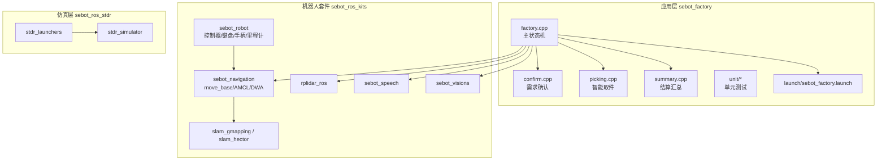
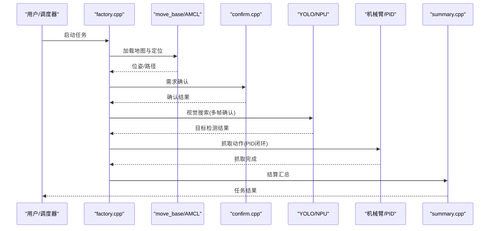
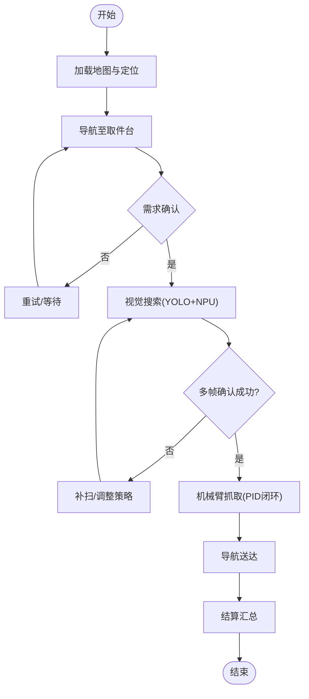
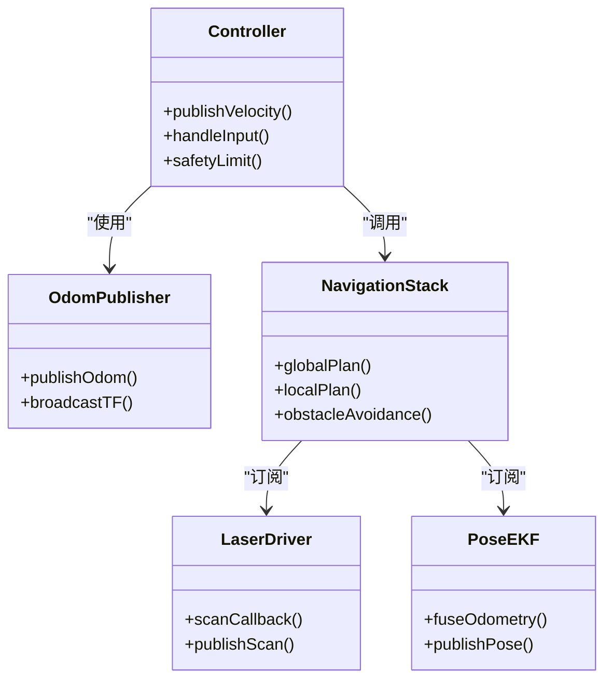
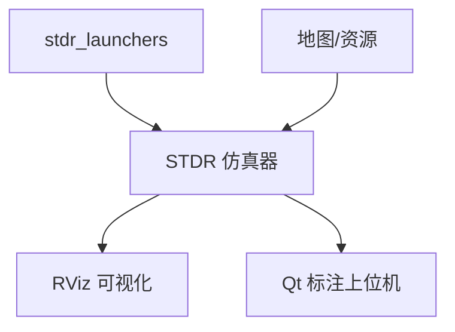
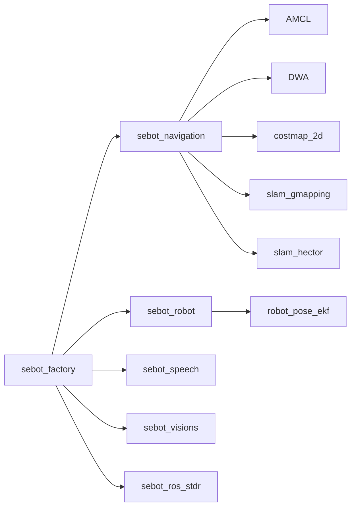

# 开发指南

<cite>
**本文引用的文件**   
- [sebot_factory/CMakeLists.txt](file://sebot_factory/src/sebot_factory/CMakeLists.txt)
- [sebot_factory/package.xml](file://sebot_factory/src/sebot_factory/package.xml)
- [sebot_factory/launch/sebot_factory.launch](file://sebot_factory/src/sebot_factory/launch/sebot_factory.launch)
- [sebot_factory/src/factory.cpp](file://sebot_factory/src/sebot_factory/src/factory.cpp)
- [sebot_factory/src/confirm.cpp](file://sebot_factory/src/sebot_factory/src/confirm.cpp)
- [sebot_factory/src/picking.cpp](file://sebot_factory/src/sebot_factory/src/picking.cpp)
- [sebot_factory/src/summary.cpp](file://sebot_factory/src/sebot_factory/src/summary.cpp)
- [sebot_factory/unit/test_arm.cpp](file://sebot_factory/src/sebot_factory/unit/test_arm.cpp)
- [sebot_marking/CMakeLists.txt](file://sebot_marking/src/sebot_marking/CMakeLists.txt)
- [sebot_marking/package.xml](file://sebot_marking/src/sebot_marking/package.xml)
- [sebot_marking/launch/sebot_marking.launch](file://sebot_marking/src/sebot_marking/launch/sebot_marking.launch)
- [sebot_marking/src/main.cpp](file://sebot_marking/src/sebot_marking/src/main.cpp)
- [sebot_robot/CMakeLists.txt](file://sebot_ros_kits/src/sebot_robot/CMakeLists.txt)
- [sebot_robot/package.xml](file://sebot_ros_kits/src/sebot_robot/package.xml)
- [sebot_robot/launch/sebot_odom.launch](file://sebot_ros_kits/src/sebot_robot/launch/sebot_odom.launch)
- [sebot_robot/src/controller.cpp](file://sebot_ros_kits/src/sebot_robot/src/controller.cpp)
- [sebot_speech/package.xml](file://sebot_ros_kits/src/sebot_speech/package.xml)
- [sebot_speech/launch/sebot_audio.xml](file://sebot_ros_kits/src/sebot_speech/launch/sebot_audio.xml)
- [sebot_visions/CMakeLists.txt](file://sebot_ros_kits/src/sebot_visions/CMakeLists.txt)
- [sebot_visions/scripts/sebotCollection.py](file://sebot_ros_kits/src/sebot_visions/scripts/sebotCollection.py)
- [sebot_navigation/navigation/package.xml](file://sebot_ros_kits/src/sebot_navigation/navigation/package.xml)
- [rplidar_ros/package.xml](file://sebot_ros_kits/src/sebot_driver/rplidar_ros/package.xml)
- [robot_pose_ekf/package.xml](file://sebot_ros_kits/src/sebot_driver/robot_pose_ekf/package.xml)
- [slam_gmapping/package.xml](file://sebot_ros_kits/src/sebot_slam/slam_gmapping/package.xml)
- [slam_hector/package.xml](file://sebot_ros_kits/src/sebot_slam/slam_hector/package.xml)
- [sebot_ros_stdr/README.md](file://sebot_ros_stdr/src/sebot_stdr/README.md)
</cite>

## 目录
1. [简介](#简介)
2. [项目结构](#项目结构)
3. [核心组件](#核心组件)
4. [架构总览](#架构总览)
5. [详细组件分析](#详细组件分析)
6. [依赖关系分析](#依赖关系分析)
7. [性能考虑](#性能考虑)
8. [故障排查指南](#故障排查指南)
9. [结论](#结论)
10. [附录](#附录)

## 简介
本指南面向机器人竞赛项目的开发者，覆盖代码规范、单元测试、调试技巧、性能优化、重构实践、环境搭建与常用命令、以及贡献流程。项目由三个相互独立的 catkin 工作空间组成：应用层 sebot_factory、机器人套件 sebot_ros_kits、仿真层 sebot_ros_stdr。比赛业务全链路为「上电自检 → 加载地图与 AMCL 定位 → 按订单导航至取件台 → 需求确认 → YOLO 视觉搜索（NPU 加速 Yolov3，多帧检测确认）→ 机械臂 PID 闭环抓取 → 导航送达并结算」，主状态机基于 MultiNavi 实现于 factory.cpp。运行配置集中在 launch/sebot_factory.launch，其中 simulation 参数切换 STDR 仿真模式、debug 参数控制图像识别界面开关；导航超时、PID、取件距离、补扫参数等均在此配置。

## 项目结构
- 三层工作空间
  - sebot_factory：应用层，包含工厂业务节点、启动脚本、资源与单元测试。
  - sebot_ros_kits：机器人驱动与功能包集合，包括导航栈、SLAM、语音、视觉、机器人底层控制等。
  - sebot_ros_stdr：STDR 仿真环境，提供地图、传感器模型与仿真器集成。
- 关键组织方式
  - 每个包遵循 ROS 标准布局：src/、include/、launch/、param/、rviz/、scripts/、CMakeLists.txt、package.xml。
  - 自研核心集中在 sebot_factory 的 src/ 与 unit/，sebot_marking 的 Qt 上位机在 sebot_marking/src/。
  - 导航与 SLAM 使用官方/开源 fork，通过 launch 与参数进行集成与定制。

图表来源
- [sebot_factory/src/factory.cpp](file://sebot_factory/src/sebot_factory/src/factory.cpp)
- [sebot_factory/src/confirm.cpp](file://sebot_factory/src/sebot_factory/src/confirm.cpp)
- [sebot_factory/src/picking.cpp](file://sebot_factory/src/sebot_factory/src/picking.cpp)
- [sebot_factory/src/summary.cpp](file://sebot_factory/src/sebot_factory/src/summary.cpp)
- [sebot_factory/launch/sebot_factory.launch](file://sebot_factory/src/sebot_factory/launch/sebot_factory.launch)
- [sebot_ros_kits/src/sebot_robot/CMakeLists.txt](file://sebot_ros_kits/src/sebot_robot/CMakeLists.txt)
- [sebot_ros_kits/src/sebot_navigation/navigation/package.xml](file://sebot_ros_kits/src/sebot_navigation/navigation/package.xml)
- [sebot_ros_kits/src/sebot_slam/slam_gmapping/package.xml](file://sebot_ros_kits/src/sebot_slam/slam_gmapping/package.xml)
- [sebot_ros_kits/src/sebot_slam/slam_hector/package.xml](file://sebot_ros_kits/src/sebot_slam/slam_hector/package.xml)
- [sebot_ros_kits/src/sebot_driver/rplidar_ros/package.xml](file://sebot_ros_kits/src/sebot_driver/rplidar_ros/package.xml)
- [sebot_ros_kits/src/sebot_speech/package.xml](file://sebot_ros_kits/src/sebot_speech/package.xml)
- [sebot_ros_kits/src/sebot_visions/CMakeLists.txt](file://sebot_ros_kits/src/sebot_visions/CMakeLists.txt)
- [sebot_ros_stdr/README.md](file://sebot_ros_stdr/src/sebot_stdr/README.md)

章节来源
- [sebot_factory/CMakeLists.txt](file://sebot_factory/src/sebot_factory/CMakeLists.txt)
- [sebot_factory/package.xml](file://sebot_factory/src/sebot_factory/package.xml)
- [sebot_marking/CMakeLists.txt](file://sebot_marking/src/sebot_marking/CMakeLists.txt)
- [sebot_marking/package.xml](file://sebot_marking/src/sebot_marking/package.xml)
- [sebot_robot/CMakeLists.txt](file://sebot_ros_kits/src/sebot_robot/CMakeLists.txt)
- [sebot_robot/package.xml](file://sebot_ros_kits/src/sebot_robot/package.xml)
- [sebot_speech/package.xml](file://sebot_ros_kits/src/sebot_speech/package.xml)
- [sebot_visions/CMakeLists.txt](file://sebot_ros_kits/src/sebot_visions/CMakeLists.txt)
- [sebot_navigation/navigation/package.xml](file://sebot_ros_kits/src/sebot_navigation/navigation/package.xml)
- [rplidar_ros/package.xml](file://sebot_ros_kits/src/sebot_driver/rplidar_ros/package.xml)
- [robot_pose_ekf/package.xml](file://sebot_ros_kits/src/sebot_driver/robot_pose_ekf/package.xml)
- [slam_gmapping/package.xml](file://sebot_ros_kits/src/sebot_slam/slam_gmapping/package.xml)
- [slam_hector/package.xml](file://sebot_ros_kits/src/sebot_slam/slam_hector/package.xml)
- [sebot_ros_stdr/README.md](file://sebot_ros_stdr/src/sebot_stdr/README.md)

## 核心组件
- 应用层状态机与业务节点
  - factory.cpp：主状态机编排，串联导航、确认、取件、结算等阶段。
  - confirm.cpp：需求确认逻辑，处理用户交互或外部指令。
  - picking.cpp：智能取件流程，协调视觉与机械臂动作。
  - summary.cpp：结算汇总，输出任务结果与统计信息。
- 机器人套件
  - sebot_robot：底盘控制、键盘/手柄输入、里程计发布与变换广播。
  - sebot_navigation：move_base + AMCL + DWA 导航栈，负责全局/局部规划与避障。
  - rplidar_ros：激光雷达数据接入与点云发布。
  - robot_pose_ekf：里程计、IMU 融合估计位姿。
  - slam_gmapping / slam_hector：建图算法选择与参数配置。
  - sebot_speech：语音交互与音频播放。
  - sebot_visions：视觉相关脚本与工具。
- 仿真层
  - stdr_*：STDR 仿真器、地图、GUI、导航与解析器等，用于离线验证与回放。

章节来源
- [sebot_factory/src/factory.cpp](file://sebot_factory/src/sebot_factory/src/factory.cpp)
- [sebot_factory/src/confirm.cpp](file://sebot_factory/src/sebot_factory/src/confirm.cpp)
- [sebot_factory/src/picking.cpp](file://sebot_factory/src/sebot_factory/src/picking.cpp)
- [sebot_factory/src/summary.cpp](file://sebot_factory/src/sebot_factory/src/summary.cpp)
- [sebot_robot/src/controller.cpp](file://sebot_ros_kits/src/sebot_robot/src/controller.cpp)
- [sebot_ros_kits/src/sebot_navigation/navigation/package.xml](file://sebot_ros_kits/src/sebot_navigation/navigation/package.xml)
- [rplidar_ros/package.xml](file://sebot_ros_kits/src/sebot_driver/rplidar_ros/package.xml)
- [robot_pose_ekf/package.xml](file://sebot_ros_kits/src/sebot_driver/robot_pose_ekf/package.xml)
- [slam_gmapping/package.xml](file://sebot_ros_kits/src/sebot_slam/slam_gmapping/package.xml)
- [slam_hector/package.xml](file://sebot_ros_kits/src/sebot_slam/slam_hector/package.xml)
- [sebot_speech/package.xml](file://sebot_ros_kits/src/sebot_speech/package.xml)
- [sebot_visions/CMakeLists.txt](file://sebot_ros_kits/src/sebot_visions/CMakeLists.txt)
- [sebot_ros_stdr/README.md](file://sebot_ros_stdr/src/sebot_stdr/README.md)

## 架构总览
整体采用 ROS 1 + catkin 架构，应用层通过 launch 文件组合各功能包，服务间以话题/服务/动作通信。导航与 SLAM 作为独立模块被上层调用，仿真层可无缝替换真实硬件。

图表来源
- [sebot_factory/src/factory.cpp](file://sebot_factory/src/sebot_factory/src/factory.cpp)
- [sebot_factory/src/confirm.cpp](file://sebot_factory/src/sebot_factory/src/confirm.cpp)
- [sebot_factory/src/picking.cpp](file://sebot_factory/src/sebot_factory/src/picking.cpp)
- [sebot_factory/src/summary.cpp](file://sebot_factory/src/sebot_factory/src/summary.cpp)
- [sebot_ros_kits/src/sebot_navigation/navigation/package.xml](file://sebot_ros_kits/src/sebot_navigation/navigation/package.xml)

## 详细组件分析

### 应用层状态机与业务节点
- factory.cpp
  - 职责：编排任务阶段，管理状态转换，协调导航、确认、取件、结算。
  - 关键点：MultiNavi 状态机、超时与错误恢复、参数读取（来自 sebot_factory.launch）。
- confirm.cpp
  - 职责：需求确认，可能涉及 UI/语音/外部指令。
  - 关键点：输入校验、状态回传、异常分支处理。
- picking.cpp
  - 职责：智能取件，协调视觉与机械臂。
  - 关键点：多帧检测确认、PID 抓取闭环、安全阈值。
- summary.cpp
  - 职责：结算汇总，记录任务指标与结果。
  - 关键点：数据聚合、日志输出、结果上报。

图表来源
- [sebot_factory/src/factory.cpp](file://sebot_factory/src/sebot_factory/src/factory.cpp)
- [sebot_factory/src/confirm.cpp](file://sebot_factory/src/sebot_factory/src/confirm.cpp)
- [sebot_factory/src/picking.cpp](file://sebot_factory/src/sebot_factory/src/picking.cpp)
- [sebot_factory/src/summary.cpp](file://sebot_factory/src/sebot_factory/src/summary.cpp)

章节来源
- [sebot_factory/src/factory.cpp](file://sebot_factory/src/sebot_factory/src/factory.cpp)
- [sebot_factory/src/confirm.cpp](file://sebot_factory/src/sebot_factory/src/confirm.cpp)
- [sebot_factory/src/picking.cpp](file://sebot_factory/src/sebot_factory/src/picking.cpp)
- [sebot_factory/src/summary.cpp](file://sebot_factory/src/sebot_factory/src/summary.cpp)

### 机器人套件与控制
- sebot_robot
  - 控制器 controller.cpp：底盘运动控制、速度指令下发、安全限幅。
  - 键盘/手柄：输入映射与命令发布。
  - 里程计与变换：odom 发布、TF 广播。
- 导航与 SLAM
  - move_base + AMCL + DWA：全局/局部规划与动态避障。
  - rplidar_ros：激光数据接入。
  - robot_pose_ekf：多源位姿融合。
  - slam_gmapping / slam_hector：建图算法选择。
- 语音与视觉
  - sebot_speech：音频播放与语音交互。
  - sebot_visions：视觉脚本与数据采集。

图表来源
- [sebot_robot/src/controller.cpp](file://sebot_ros_kits/src/sebot_robot/src/controller.cpp)
- [sebot_ros_kits/src/sebot_navigation/navigation/package.xml](file://sebot_ros_kits/src/sebot_navigation/navigation/package.xml)
- [rplidar_ros/package.xml](file://sebot_ros_kits/src/sebot_driver/rplidar_ros/package.xml)
- [robot_pose_ekf/package.xml](file://sebot_ros_kits/src/sebot_driver/robot_pose_ekf/package.xml)
- [slam_gmapping/package.xml](file://sebot_ros_kits/src/sebot_slam/slam_gmapping/package.xml)
- [slam_hector/package.xml](file://sebot_ros_kits/src/sebot_slam/slam_hector/package.xml)

章节来源
- [sebot_robot/src/controller.cpp](file://sebot_ros_kits/src/sebot_robot/src/controller.cpp)
- [sebot_ros_kits/src/sebot_navigation/navigation/package.xml](file://sebot_ros_kits/src/sebot_navigation/navigation/package.xml)
- [rplidar_ros/package.xml](file://sebot_ros_kits/src/sebot_driver/rplidar_ros/package.xml)
- [robot_pose_ekf/package.xml](file://sebot_ros_kits/src/sebot_driver/robot_pose_ekf/package.xml)
- [slam_gmapping/package.xml](file://sebot_ros_kits/src/sebot_slam/slam_gmapping/package.xml)
- [slam_hector/package.xml](file://sebot_ros_kits/src/sebot_slam/slam_hector/package.xml)

### 仿真层与可视化
- STDR 仿真
  - stdr_launchers：仿真场景与设备加载。
  - stdr_simulator：物理仿真与传感器模型。
- 可视化
  - rviz：显示激光、点云、路径、位姿等。
  - Qt 上位机（sebot_marking）：建图标注与交互。

图表来源
- [sebot_ros_stdr/README.md](file://sebot_ros_stdr/src/sebot_stdr/README.md)
- [sebot_marking/launch/sebot_marking.launch](file://sebot_marking/src/sebot_marking/launch/sebot_marking.launch)
- [sebot_marking/src/main.cpp](file://sebot_marking/src/sebot_marking/src/main.cpp)

章节来源
- [sebot_ros_stdr/README.md](file://sebot_ros_stdr/src/sebot_stdr/README.md)
- [sebot_marking/launch/sebot_marking.launch](file://sebot_marking/src/sebot_marking/launch/sebot_marking.launch)
- [sebot_marking/src/main.cpp](file://sebot_marking/src/sebot_marking/src/main.cpp)

## 依赖关系分析
- 包级依赖
  - sebot_factory 依赖 sebot_navigation、rplidar_ros、sebot_robot、sebot_speech、sebot_visions。
  - sebot_navigation 依赖 move_base、AMCL、DWA、costmap_2d、navfn 等。
  - sebot_slam 依赖 gmapping/hector 与 sensor_msgs/laser_scan。
  - sebot_ros_stdr 提供仿真环境与地图资源。
- 运行时依赖
  - launch 文件组合节点与参数，simulation 参数切换 STDR 仿真模式。
  - 参数集中管理于 launch 与 param 目录，便于调参与复现实验。

图表来源
- [sebot_factory/package.xml](file://sebot_factory/src/sebot_factory/package.xml)
- [sebot_ros_kits/src/sebot_navigation/navigation/package.xml](file://sebot_ros_kits/src/sebot_navigation/navigation/package.xml)
- [rplidar_ros/package.xml](file://sebot_ros_kits/src/sebot_driver/rplidar_ros/package.xml)
- [robot_pose_ekf/package.xml](file://sebot_ros_kits/src/sebot_driver/robot_pose_ekf/package.xml)
- [slam_gmapping/package.xml](file://sebot_ros_kits/src/sebot_slam/slam_gmapping/package.xml)
- [slam_hector/package.xml](file://sebot_ros_kits/src/sebot_slam/slam_hector/package.xml)
- [sebot_ros_stdr/README.md](file://sebot_ros_stdr/src/sebot_stdr/README.md)

章节来源
- [sebot_factory/package.xml](file://sebot_factory/src/sebot_factory/package.xml)
- [sebot_ros_kits/src/sebot_navigation/navigation/package.xml](file://sebot_ros_kits/src/sebot_navigation/navigation/package.xml)
- [rplidar_ros/package.xml](file://sebot_ros_kits/src/sebot_driver/rplidar_ros/package.xml)
- [robot_pose_ekf/package.xml](file://sebot_ros_kits/src/sebot_driver/robot_pose_ekf/package.xml)
- [slam_gmapping/package.xml](file://sebot_ros_kits/src/sebot_slam/slam_gmapping/package.xml)
- [slam_hector/package.xml](file://sebot_ros_kits/src/sebot_slam/slam_hector/package.xml)
- [sebot_ros_stdr/README.md](file://sebot_ros_stdr/src/sebot_stdr/README.md)

## 性能考虑
- 内存管理
  - 避免频繁分配/释放大对象，复用缓冲区与消息。
  - 合理使用共享内存与零拷贝传输（ROS 1 中可通过自定义消息与共享内存插件）。
- 计算优化
  - 视觉推理使用 NPU 加速（Yolov3），批量处理与多帧确认减少重复计算。
  - 导航参数调优：代价地图分辨率、膨胀半径、局部规划步长与频率。
- 并发处理
  - 将 I/O（传感器、网络）与计算（规划、推理）分离到不同线程或节点。
  - 使用异步回调与队列限制消息堆积，防止阻塞。
- 监控与诊断
  - rosbag 录制关键话题，离线分析延迟与吞吐。
  - rosnode info、rostopic hz、rqt_graph 观察节点与消息流。

[本节为通用指导，不直接分析具体文件]

## 故障排查指南
- 常见问题定位
  - 启动失败：检查 launch 文件参数与依赖包是否编译安装。
  - 导航不生效：确认地图加载、AMCL 初始化、激光数据正常。
  - 视觉识别不稳定：检查光照、相机标定、NPU 模型版本。
  - 抓取失败：检查 PID 参数、机械臂关节限位、力控反馈。
- 调试工具
  - rosbag：录制与回放传感器与中间消息，便于复现问题。
  - RViz：可视化激光、点云、路径、位姿与检测结果。
  - GDB：对 C++ 节点附加断点，查看堆栈与变量。
- 日志与诊断
  - 使用 ROS log 级别与自定义日志输出，区分 INFO/WARN/ERROR。
  - 关键路径添加时间戳与计数，便于性能分析。

章节来源
- [sebot_factory/launch/sebot_factory.launch](file://sebot_factory/src/sebot_factory/launch/sebot_factory.launch)
- [sebot_ros_kits/src/sebot_robot/launch/sebot_odom.launch](file://sebot_ros_kits/src/sebot_robot/launch/sebot_odom.launch)
- [sebot_speech/launch/sebot_audio.xml](file://sebot_ros_kits/src/sebot_speech/launch/sebot_audio.xml)
- [sebot_visions/scripts/sebotCollection.py](file://sebot_ros_kits/src/sebot_visions/scripts/sebotCollection.py)

## 结论
本项目以 ROS 1 + catkin 为基础，通过清晰的分层与模块化设计，将应用层、机器人套件与仿真层解耦。开发时应遵循统一的命名与注释规范，完善单元测试与调试流程，持续优化性能与可靠性。借助 launch 与参数化配置，可在真实硬件与仿真环境之间快速切换，提升迭代效率。

[本节为总结性内容，不直接分析具体文件]

## 附录

### 代码规范与编程约定
- 命名规则
  - 文件名与目录名使用小写加下划线，类与方法使用驼峰或下划线风格保持一致。
  - ROS 话题与服务名称使用名词短语，避免缩写歧义。
- 注释标准
  - 函数头注释说明用途、参数、返回值与异常。
  - 关键算法与状态机分支添加行内注释，解释决策依据。
- 文件组织结构
  - 每个包遵循 ROS 标准布局，公共接口放入 include/，实现放入 src/。
  - 启动脚本与参数分 launch/ 与 param/ 管理，便于复用与版本控制。

[本节为通用指导，不直接分析具体文件]

### 单元测试编写方法
- 测试用例设计
  - 针对状态机分支、边界条件与异常路径设计用例。
  - 使用 sebot_factory/unit/test_arm.cpp 作为参考，模拟机械臂控制与反馈。
- 模拟对象使用
  - 使用 rosbag 回放或自定义消息发布者模拟传感器输入。
  - 对 I/O 密集模块（如视觉、语音）使用桩函数替代真实设备。
- 断言验证
  - 验证输出消息字段、状态转换与返回值。
  - 结合日志与可视化工具交叉验证。

章节来源
- [sebot_factory/unit/test_arm.cpp](file://sebot_factory/src/sebot_factory/unit/test_arm.cpp)

### 调试技巧与工具使用
- rosbag 录制与回放
  - 录制关键话题：/odom、/scan、/camera/image_raw、/joint_states。
  - 回放时重放时间戳，确保时序一致。
- RViz 可视化
  - 加载对应 .rviz 配置文件，显示激光、点云、路径与位姿。
- GDB 调试
  - 对 C++ 节点附加断点，查看堆栈与变量，定位崩溃与死锁。

[本节为通用指导，不直接分析具体文件]

### 性能优化方法
- 内存管理
  - 减少临时对象创建，使用静态缓冲与池化。
  - 合理设置消息队列长度，避免内存峰值。
- 计算优化
  - 视觉推理批处理与流水线并行。
  - 导航参数调优：代价地图更新频率、局部规划步长与频率。
- 并发处理
  - 将 I/O 与计算分离，使用多线程与异步回调。
  - 监控 CPU 与内存占用，识别瓶颈。

[本节为通用指导，不直接分析具体文件]

### 代码重构最佳实践
- 模块化设计
  - 将复杂逻辑拆分为独立节点与库，降低耦合。
  - 使用接口抽象定义模块间契约。
- 依赖管理
  - 明确包依赖，避免循环依赖。
  - 使用 CMakeLists.txt 与 package.xml 声明依赖关系。

[本节为通用指导，不直接分析具体文件]

### 开发环境搭建与 IDE 配置
- 环境搭建
  - 安装 ROS 1 与 catkin 工具链。
  - 克隆仓库并分别 catkin_make 三个工作空间。
- IDE 配置
  - VS Code：安装 C++ 扩展、ROS 插件，配置编译与调试。
  - Qt Creator：用于 sebot_marking 的 Qt 项目。
- 常用命令
  - 构建：catkin_make
  - 运行：roslaunch <package> <launch_file>
  - 调试：rosrun <package> <node> --debug

[本节为通用指导，不直接分析具体文件]

### 贡献代码的流程与规范
- 分支策略
  - 主分支稳定，功能分支开发，提交前合并请求。
- 提交规范
  - 提交信息简洁明了，描述变更内容与原因。
  - 附带必要文档与测试用例。
- 代码审查
  - 同行评审，关注可读性、性能与安全性。
  - 自动化测试与 CI 检查通过后合并。

[本节为通用指导，不直接分析具体文件]