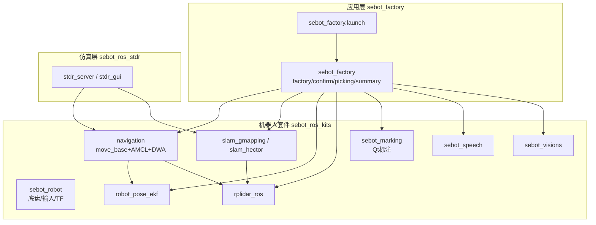
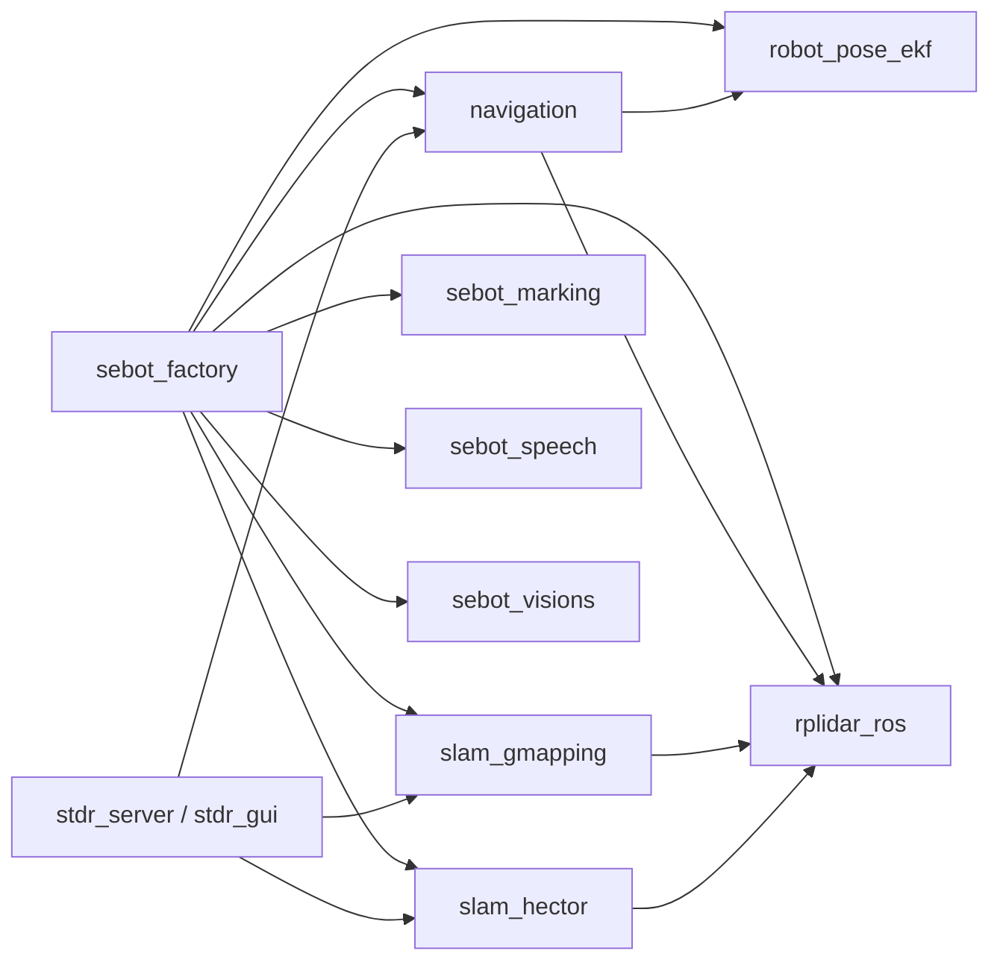

# 开发环境搭建与配置

<cite>
**本文引用的文件**   
- [sebot_factory/CMakeLists.txt](file://sebot_factory/src/sebot_factory/CMakeLists.txt)
- [sebot_factory/package.xml](file://sebot_factory/src/sebot_factory/package.xml)
- [sebot_factory/launch/sebot_factory.launch](file://sebot_factory/src/sebot_factory/launch/sebot_factory.launch)
- [sebot_factory/.catkin_workspace](file://sebot_factory/.catkin_workspace)
- [sebot_ros_kits/.catkin_workspace](file://sebot_ros_kits/.catkin_workspace)
- [sebot_ros_stdr/.catkin_workspace](file://sebot_ros_stdr/.catkin_workspace)
- [sebot_robot/CMakeLists.txt](file://sebot_ros_kits/src/sebot_robot/CMakeLists.txt)
- [sebot_robot/package.xml](file://sebot_ros_kits/src/sebot_robot/package.xml)
- [sebot_marking/CMakeLists.txt](file://sebot_ros_kits/src/sebot_marking/CMakeLists.txt)
- [sebot_marking/package.xml](file://sebot_ros_kits/src/sebot_marking/package.xml)
- [sebot_speech/CMakeLists.txt](file://sebot_ros_kits/src/sebot_speech/CMakeLists.txt)
- [sebot_speech/package.xml](file://sebot_ros_kits/src/sebot_speech/package.xml)
- [sebot_visions/CMakeLists.txt](file://sebot_ros_kits/src/sebot_visions/CMakeLists.txt)
- [sebot_visions/package.xml](file://sebot_ros_kits/src/sebot_visions/package.xml)
- [sebot_navigation/navigation/package.xml](file://sebot_ros_kits/src/sebot_navigation/navigation/package.xml)
- [rplidar_ros/package.xml](file://sebot_ros_kits/src/sebot_driver/rplidar_ros/package.xml)
- [robot_pose_ekf/package.xml](file://sebot_ros_kits/src/sebot_driver/robot_pose_ekf/package.xml)
- [slam_gmapping/package.xml](file://sebot_ros_kits/src/sebot_slam/slam_gmapping/package.xml)
- [slam_hector/package.xml](file://sebot_ros_kits/src/sebot_slam/slam_hector/package.xml)
- [stdr_server/package.xml](file://sebot_ros_stdr/src/sebot_stdr/stdr_server/package.xml)
- [stdr_gui/package.xml](file://sebot_ros_stdr/src/sebot_stdr/stdr_gui/package.xml)
</cite>

## 目录
1. [简介](#简介)
2. [项目结构](#项目结构)
3. [核心组件](#核心组件)
4. [架构总览](#架构总览)
5. [详细组件分析](#详细组件分析)
6. [依赖分析](#依赖分析)
7. [性能考虑](#性能考虑)
8. [故障排除指南](#故障排除指南)
9. [结论](#结论)
10. [附录](#附录)

## 简介
本指南面向ROS机器人竞赛项目的开发与部署，覆盖系统要求、依赖安装、catkin工作空间初始化与管理（含多工作空间）、IDE配置、CMake构建系统与依赖声明、环境变量与启动脚本定制，以及常见问题排查。项目由三个相互独立的catkin工作空间组成：应用层 sebot_factory、机器人套件 sebot_ros_kits、仿真层 sebot_ros_stdr，各自包含 src/ 目录并需分别 catkin_make。自研核心代码集中在 sebot_factory（业务状态机与节点）、sebot_marking（Qt建图标注上位机）、sebot_robot、sebot_speech、sebot_visions；导航与SLAM等采用官方或开源包（fork）在本项目中以集成与参数化为主。

## 项目结构
仓库包含三个独立工作空间，每个工作空间遵循标准ROS包组织方式（src/下为多个package，每个package含 CMakeLists.txt、package.xml、launch/、include/、src/ 等）。顶层 .gitignore 用于忽略生成文件。

```mermaid
graph TB
A["sebot_factory<br/>应用层"] --> A1["src/sebot_factory<br/>CMakeLists.txt / package.xml"]
A --> A2["launch/sebot_factory.launch"]
B["sebot_ros_kits<br/>机器人套件"] --> B1["src/sebot_robot<br/>CMakeLists.txt / package.xml"]
B --> B2["src/sebot_marking<br/>CMakeLists.txt / package.xml"]
B --> B3["src/sebot_speech<br/>CMakeLists.txt / package.xml"]
B --> B4["src/sebot_visions<br/>CMakeLists.txt / package.xml"]
B --> B5["src/sebot_navigation/navigation<br/>package.xml"]
B --> B6["src/sebot_driver/rplidar_ros<br/>package.xml"]
B --> B7["src/sebot_driver/robot_pose_ekf<br/>package.xml"]
B --> B8["src/sebot_slam/slam_gmapping<br/>package.xml"]
B --> B9["src/sebot_slam/slam_hector<br/>package.xml"]
C["sebot_ros_stdr<br/>仿真层"] --> C1["src/sebot_stdr/stdr_server<br/>package.xml"]
C --> C2["src/sebot_stdr/stdr_gui<br/>package.xml"]
```

图表来源
- [sebot_factory/CMakeLists.txt](file://sebot_factory/src/sebot_factory/CMakeLists.txt)
- [sebot_factory/package.xml](file://sebot_factory/src/sebot_factory/package.xml)
- [sebot_factory/launch/sebot_factory.launch](file://sebot_factory/src/sebot_factory/launch/sebot_factory.launch)
- [sebot_robot/CMakeLists.txt](file://sebot_ros_kits/src/sebot_robot/CMakeLists.txt)
- [sebot_robot/package.xml](file://sebot_ros_kits/src/sebot_robot/package.xml)
- [sebot_marking/CMakeLists.txt](file://sebot_ros_kits/src/sebot_marking/CMakeLists.txt)
- [sebot_marking/package.xml](file://sebot_ros_kits/src/sebot_marking/package.xml)
- [sebot_speech/CMakeLists.txt](file://sebot_ros_kits/src/sebot_speech/CMakeLists.txt)
- [sebot_speech/package.xml](file://sebot_ros_kits/src/sebot_speech/package.xml)
- [sebot_visions/CMakeLists.txt](file://sebot_ros_kits/src/sebot_visions/CMakeLists.txt)
- [sebot_visions/package.xml](file://sebot_ros_kits/src/sebot_visions/package.xml)
- [sebot_navigation/navigation/package.xml](file://sebot_ros_kits/src/sebot_navigation/navigation/package.xml)
- [rplidar_ros/package.xml](file://sebot_ros_kits/src/sebot_driver/rplidar_ros/package.xml)
- [robot_pose_ekf/package.xml](file://sebot_ros_kits/src/sebot_driver/robot_pose_ekf/package.xml)
- [slam_gmapping/package.xml](file://sebot_ros_kits/src/sebot_slam/slam_gmapping/package.xml)
- [slam_hector/package.xml](file://sebot_ros_kits/src/sebot_slam/slam_hector/package.xml)
- [stdr_server/package.xml](file://sebot_ros_stdr/src/sebot_stdr/stdr_server/package.xml)
- [stdr_gui/package.xml](file://sebot_ros_stdr/src/sebot_stdr/stdr_gui/package.xml)

章节来源
- [sebot_factory/.catkin_workspace](file://sebot_factory/.catkin_workspace)
- [sebot_ros_kits/.catkin_workspace](file://sebot_ros_kits/.catkin_workspace)
- [sebot_ros_stdr/.catkin_workspace](file://sebot_ros_stdr/.catkin_workspace)

## 核心组件
- 应用层 sebot_factory：实现比赛业务主流程的状态机与节点（factory.cpp、confirm.cpp、picking.cpp、summary.cpp），通过 launch/sebot_factory.launch 统一启动与参数配置（simulation、debug、导航超时、PID、取件距离、补扫等）。
- 机器人套件 sebot_ros_kits：
  - sebot_robot：底盘控制、键盘/手柄输入、里程计与TF发布。
  - sebot_marking：基于Qt的建图标注上位机。
  - sebot_speech：语音交互相关脚本与资源。
  - sebot_visions：视觉相关脚本与资源。
  - 导航与传感器驱动：navigation（move_base+AMCL+DWA）、rplidar_ros、robot_pose_ekf、slam_gmapping、slam_hector。
- 仿真层 sebot_ros_stdr：STDR仿真器及其GUI、地图与导航示例包。

章节来源
- [sebot_factory/launch/sebot_factory.launch](file://sebot_factory/src/sebot_factory/launch/sebot_factory.launch)
- [sebot_robot/CMakeLists.txt](file://sebot_ros_kits/src/sebot_robot/CMakeLists.txt)
- [sebot_robot/package.xml](file://sebot_ros_kits/src/sebot_robot/package.xml)
- [sebot_marking/CMakeLists.txt](file://sebot_ros_kits/src/sebot_marking/CMakeLists.txt)
- [sebot_marking/package.xml](file://sebot_ros_kits/src/sebot_marking/package.xml)
- [sebot_speech/CMakeLists.txt](file://sebot_ros_kits/src/sebot_speech/CMakeLists.txt)
- [sebot_speech/package.xml](file://sebot_ros_kits/src/sebot_speech/package.xml)
- [sebot_visions/CMakeLists.txt](file://sebot_ros_kits/src/sebot_visions/CMakeLists.txt)
- [sebot_visions/package.xml](file://sebot_ros_kits/src/sebot_visions/package.xml)
- [sebot_navigation/navigation/package.xml](file://sebot_ros_kits/src/sebot_navigation/navigation/package.xml)
- [rplidar_ros/package.xml](file://sebot_ros_kits/src/sebot_driver/rplidar_ros/package.xml)
- [robot_pose_ekf/package.xml](file://sebot_ros_kits/src/sebot_driver/robot_pose_ekf/package.xml)
- [slam_gmapping/package.xml](file://sebot_ros_kits/src/sebot_slam/slam_gmapping/package.xml)
- [slam_hector/package.xml](file://sebot_ros_kits/src/sebot_slam/slam_hector/package.xml)
- [stdr_server/package.xml](file://sebot_ros_stdr/src/sebot_stdr/stdr_server/package.xml)
- [stdr_gui/package.xml](file://sebot_ros_stdr/src/sebot_stdr/stdr_gui/package.xml)

## 架构总览
下图展示三层工作空间与关键包的依赖关系及数据流：应用层通过launch调用导航与感知模块，底层驱动提供传感器与底盘接口，仿真层提供STDR环境与可视化。

图表来源
- [sebot_factory/launch/sebot_factory.launch](file://sebot_factory/src/sebot_factory/launch/sebot_factory.launch)
- [sebot_robot/CMakeLists.txt](file://sebot_ros_kits/src/sebot_robot/CMakeLists.txt)
- [sebot_navigation/navigation/package.xml](file://sebot_ros_kits/src/sebot_navigation/navigation/package.xml)
- [slam_gmapping/package.xml](file://sebot_ros_kits/src/sebot_slam/slam_gmapping/package.xml)
- [slam_hector/package.xml](file://sebot_ros_kits/src/sebot_slam/slam_hector/package.xml)
- [robot_pose_ekf/package.xml](file://sebot_ros_kits/src/sebot_driver/robot_pose_ekf/package.xml)
- [rplidar_ros/package.xml](file://sebot_ros_kits/src/sebot_driver/rplidar_ros/package.xml)
- [stdr_server/package.xml](file://sebot_ros_stdr/src/sebot_stdr/stdr_server/package.xml)
- [stdr_gui/package.xml](file://sebot_ros_stdr/src/sebot_stdr/stdr_gui/package.xml)

## 详细组件分析

### 系统要求与依赖安装
- 操作系统：Ubuntu LTS（推荐与ROS版本匹配的长期支持版）。
- ROS版本：根据Ubuntu版本选择对应ROS发行版（如Melodic/Noetic），确保已安装 ros-$ROSDISTRO-desktop-full。
- 编译工具链：cmake、make、g++、python-catkin-tools（可选但推荐）。
- 第三方库：
  - Qt（用于sebot_marking）：qtbase5-dev、libqt5gui、libqt5widgets、libqt5core、libqt5svg、libqt5xml等。
  - OpenCV（若使用Python/ROS图像接口）：opencv-python或系统包。
  - Paddle Inference（YOLO推理，NPU加速）：按Paddle官方说明安装对应版本与依赖。
  - MoveIt!（机械臂规划）：ros-$ROSDISTRO-moveit-* 相关包。
  - Gazebo/STDR：仿真所需依赖（stdr_* 包会引入相应依赖）。
- 建议：在虚拟环境或容器内隔离依赖，避免与系统ROS冲突。

章节来源
- [sebot_marking/CMakeLists.txt](file://sebot_ros_kits/src/sebot_marking/CMakeLists.txt)
- [sebot_marking/package.xml](file://sebot_ros_kits/src/sebot_marking/package.xml)
- [sebot_speech/CMakeLists.txt](file://sebot_ros_kits/src/sebot_speech/CMakeLists.txt)
- [sebot_speech/package.xml](file://sebot_ros_kits/src/sebot_speech/package.xml)
- [sebot_visions/CMakeLists.txt](file://sebot_ros_kits/src/sebot_visions/CMakeLists.txt)
- [sebot_visions/package.xml](file://sebot_ros_kits/src/sebot_visions/package.xml)

### catkin工作空间初始化与管理
- 每个工作空间独立初始化：
  - 在工作空间根目录执行 catkin_init_workspace（或直接创建 src/ 目录）。
  - 在每个工作空间的 src/ 中放置各自的 packages。
  - 在工作空间根目录执行 catkin_make 或 catkin build 进行编译。
- 多工作空间管理：
  - 使用 catkin workspace 命令或手动设置 CATKIN_WORKSPACE 变量。
  - 不同工作空间之间通过依赖解析（package.xml 中的 depend/build_depend/run_depend）自动发现。
  - 若需要跨工作空间引用，建议使用 symlinks 或 catkin workspace 的叠加机制。
- 依赖解析：
  - package.xml 中声明 build_depend、exec_depend、depend 等。
  - catkin_make 会递归解析依赖并生成构建产物。

章节来源
- [sebot_factory/.catkin_workspace](file://sebot_factory/.catkin_workspace)
- [sebot_ros_kits/.catkin_workspace](file://sebot_ros_kits/.catkin_workspace)
- [sebot_ros_stdr/.catkin_workspace](file://sebot_ros_stdr/.catkin_workspace)

### IDE配置（VS Code、CLion、Qt Creator）
- VS Code：
  - 安装扩展：C/C++、ROS、CMake、CMake Tools、YAML、XML。
  - 设置 CMake 路径与编译器，启用 IntelliSense。
  - 配置 launch.json 以直接运行 roslaunch 或自定义脚本。
- CLion：
  - 导入 catkin 工作空间作为 CMake 项目。
  - 设置 ROS 环境变量与调试器（gdb/lldb）。
  - 配置外部工具以快速运行 roslaunch。
- Qt Creator：
  - 针对 sebot_marking 等 Qt 项目，打开对应的 .pro 或 CMakeLists.txt。
  - 配置 Qt 版本与 Kit，确保 qmake 可用。
  - 设置调试器与环境变量。

章节来源
- [sebot_marking/CMakeLists.txt](file://sebot_ros_kits/src/sebot_marking/CMakeLists.txt)
- [sebot_marking/package.xml](file://sebot_ros_kits/src/sebot_marking/package.xml)

### 编译系统配置（CMakeLists.txt与依赖声明）
- CMakeLists.txt：
  - 使用 find_package(ROS ...) 或 catkin_find_package。
  - 添加 include_directories、link_directories。
  - 定义可执行目标 add_executable 与库目标 add_library。
  - 链接依赖 target_link_libraries。
  - 安装规则 install(TARGETS ... DESTINATION ...)。
- package.xml：
  - 声明 build_depend、exec_depend、depend、run_depend。
  - 指定ROS版本与第三方库依赖。
- 构建选项：
  - 通过 cmake 参数或 catkin 构建选项启用/禁用功能（如仿真、调试、优化）。

章节来源
- [sebot_factory/CMakeLists.txt](file://sebot_factory/src/sebot_factory/CMakeLists.txt)
- [sebot_factory/package.xml](file://sebot_factory/src/sebot_factory/package.xml)
- [sebot_robot/CMakeLists.txt](file://sebot_ros_kits/src/sebot_robot/CMakeLists.txt)
- [sebot_robot/package.xml](file://sebot_ros_kits/src/sebot_robot/package.xml)
- [sebot_marking/CMakeLists.txt](file://sebot_ros_kits/src/sebot_marking/CMakeLists.txt)
- [sebot_marking/package.xml](file://sebot_ros_kits/src/sebot_marking/package.xml)
- [sebot_speech/CMakeLists.txt](file://sebot_ros_kits/src/sebot_speech/CMakeLists.txt)
- [sebot_speech/package.xml](file://sebot_ros_kits/src/sebot_speech/package.xml)
- [sebot_visions/CMakeLists.txt](file://sebot_ros_kits/src/sebot_visions/CMakeLists.txt)
- [sebot_visions/package.xml](file://sebot_ros_kits/src/sebot_visions/package.xml)
- [sebot_navigation/navigation/package.xml](file://sebot_ros_kits/src/sebot_navigation/navigation/package.xml)
- [rplidar_ros/package.xml](file://sebot_ros_kits/src/sebot_driver/rplidar_ros/package.xml)
- [robot_pose_ekf/package.xml](file://sebot_ros_kits/src/sebot_driver/robot_pose_ekf/package.xml)
- [slam_gmapping/package.xml](file://sebot_ros_kits/src/sebot_slam/slam_gmapping/package.xml)
- [slam_hector/package.xml](file://sebot_ros_kits/src/sebot_slam/slam_hector/package.xml)
- [stdr_server/package.xml](file://sebot_ros_stdr/src/sebot_stdr/stdr_server/package.xml)
- [stdr_gui/package.xml](file://sebot_ros_stdr/src/sebot_stdr/stdr_gui/package.xml)

### 环境变量配置、路径设置与启动脚本定制
- 环境变量：
  - source /opt/ros/$ROSDISTRO/setup.bash 与 source devel/setup.bash。
  - 设置 ROS_MASTER_URI、ROS_HOSTNAME、ROS_IP 等网络相关变量。
  - 自定义 PATH 指向脚本或可执行文件。
- 路径设置：
  - 将资源目录（模型、配置文件）放入包内 res/ 或 config/，并通过 ROS 参数或环境变量访问。
- 启动脚本定制：
  - 使用 roslaunch 启动多个节点，通过 .launch 文件传递参数。
  - 在 sebot_factory.launch 中切换 simulation 模式、开启/关闭 debug 界面、调整导航超时、PID、取件距离、补扫等关键参数。

章节来源
- [sebot_factory/launch/sebot_factory.launch](file://sebot_factory/src/sebot_factory/launch/sebot_factory.launch)

### 常见环境问题与解决方案
- 依赖缺失：
  - 使用 apt-cache search 查找系统包，或通过 pip/apt 安装第三方库。
  - 检查 package.xml 中的依赖是否完整。
- 编译错误：
  - 清理构建目录 rm -rf build devel，重新 catkin_make。
  - 检查头文件路径与库链接是否正确。
- 运行时找不到包：
  - 确认 source setup.bash 已生效。
  - 检查 ROS_PACKAGE_PATH 是否包含工作空间路径。
- 网络通信问题：
  - 检查 ROS_MASTER_URI、ROS_HOSTNAME、ROS_IP 配置。
  - 确保防火墙允许ROS端口。
- 仿真与硬件差异：
  - 通过 simulation 参数切换 STDR 仿真模式。
  - 校准传感器参数（IMU、激光雷达、里程计）。

章节来源
- [sebot_factory/launch/sebot_factory.launch](file://sebot_factory/src/sebot_factory/launch/sebot_factory.launch)

## 依赖分析
下图展示了各包之间的依赖关系，重点标注了导航、SLAM、EKF、传感器驱动与仿真器的关联。

图表来源
- [sebot_factory/package.xml](file://sebot_factory/src/sebot_factory/package.xml)
- [sebot_navigation/navigation/package.xml](file://sebot_ros_kits/src/sebot_navigation/navigation/package.xml)
- [slam_gmapping/package.xml](file://sebot_ros_kits/src/sebot_slam/slam_gmapping/package.xml)
- [slam_hector/package.xml](file://sebot_ros_kits/src/sebot_slam/slam_hector/package.xml)
- [robot_pose_ekf/package.xml](file://sebot_ros_kits/src/sebot_driver/robot_pose_ekf/package.xml)
- [rplidar_ros/package.xml](file://sebot_ros_kits/src/sebot_driver/rplidar_ros/package.xml)
- [stdr_server/package.xml](file://sebot_ros_stdr/src/sebot_stdr/stdr_server/package.xml)
- [stdr_gui/package.xml](file://sebot_ros_stdr/src/sebot_stdr/stdr_gui/package.xml)

章节来源
- [sebot_factory/package.xml](file://sebot_factory/src/sebot_factory/package.xml)
- [sebot_navigation/navigation/package.xml](file://sebot_ros_kits/src/sebot_navigation/navigation/package.xml)
- [slam_gmapping/package.xml](file://sebot_ros_kits/src/sebot_slam/slam_gmapping/package.xml)
- [slam_hector/package.xml](file://sebot_ros_kits/src/sebot_slam/slam_hector/package.xml)
- [robot_pose_ekf/package.xml](file://sebot_ros_kits/src/sebot_driver/robot_pose_ekf/package.xml)
- [rplidar_ros/package.xml](file://sebot_ros_kits/src/sebot_driver/rplidar_ros/package.xml)
- [stdr_server/package.xml](file://sebot_ros_stdr/src/sebot_stdr/stdr_server/package.xml)
- [stdr_gui/package.xml](file://sebot_ros_stdr/src/sebot_stdr/stdr_gui/package.xml)

## 性能考虑
- 导航与定位：
  - 合理设置 AMCL 粒子数与更新频率，平衡精度与计算开销。
  - DWA局部规划器参数调优（速度、加速度限制、代价权重）。
- SLAM建图：
  - Gmapping/Hector参数调优（分辨率、扫描匹配阈值、滤波参数）。
- 视觉推理：
  - YOLO模型量化与NPU加速，减少CPU负载。
  - 多帧检测融合策略降低误检率。
- 资源管理：
  - 控制图像订阅频率与压缩传输。
  - 使用多线程或异步处理提升吞吐。

[本节为通用指导，不直接分析具体文件]

## 故障排除指南
- 编译失败：
  - 检查 CMakeLists.txt 与 package.xml 的依赖声明。
  - 清理构建目录并重新编译。
- 运行时崩溃：
  - 查看 rosbag 日志与 rqt_console 输出。
  - 使用 gdb 或 lldb 调试核心节点。
- 通信异常：
  - 检查 topic 名称、消息类型与发布者/订阅者匹配。
  - 验证 TF 树与坐标系变换。
- 仿真不一致：
  - 对比 STDR 与真实传感器的参数差异。
  - 逐步启用模块定位问题。

章节来源
- [sebot_factory/launch/sebot_factory.launch](file://sebot_factory/src/sebot_factory/launch/sebot_factory.launch)

## 结论
本项目采用三层catkin工作空间架构，清晰分离应用、套件与仿真。通过标准化的CMake与package.xml管理依赖，结合roslaunch统一启动与参数配置，便于开发与调试。建议在开发过程中严格遵循依赖声明与环境配置规范，利用仿真环境快速验证逻辑，再迁移至真实硬件。

[本节为总结性内容，不直接分析具体文件]

## 附录
- 常用命令：
  - catkin_init_workspace、catkin_make、catkin build。
  - roslaunch、rosbag、rqt、rviz。
- 参考文档：
  - ROS官方文档、catkin手册、CMake指南、Qt开发文档。

[本节为补充信息，不直接分析具体文件]