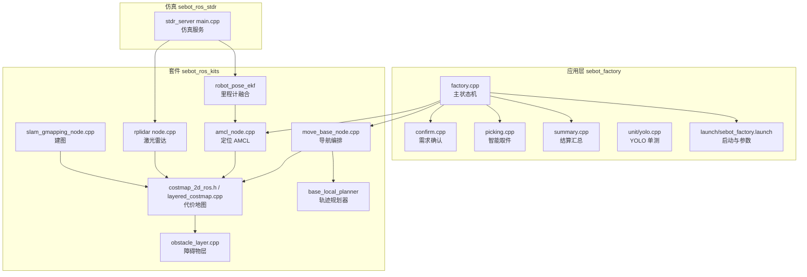
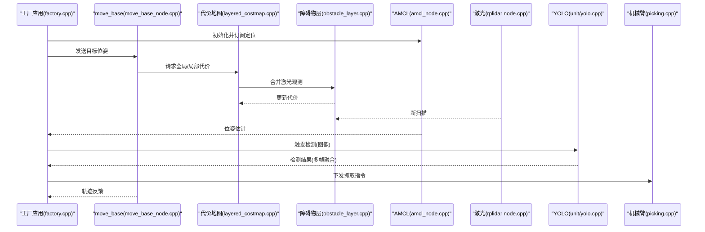
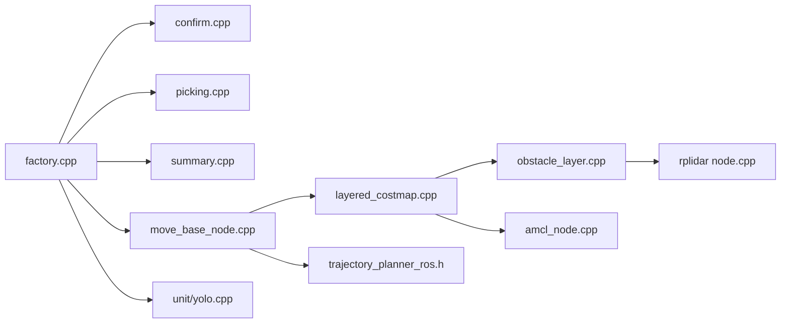

# 性能优化与最佳实践

<cite>
**本文引用的文件**   
- [sebot_factory.launch](file://sebot_factory/src/sebot_factory/launch/sebot_factory.launch)
- [factory.cpp](file://sebot_factory/src/sebot_factory/src/factory.cpp)
- [confirm.cpp](file://sebot_factory/src/sebot_factory/src/confirm.cpp)
- [picking.cpp](file://sebot_factory/src/sebot_factory/src/picking.cpp)
- [summary.cpp](file://sebot_factory/src/sebot_factory/src/summary.cpp)
- [yolo.cpp](file://sebot_factory/src/sebot_factory/unit/yolo.cpp)
- [CMakeLists.txt](file://sebot_factory/src/sebot_factory/CMakeLists.txt)
- [package.xml](file://sebot_factory/src/sebot_factory/package.xml)
- [amcl_node.cpp](file://sebot_ros_kits/src/sebot_navigation/amcl/src/amcl_node.cpp)
- [costmap_2d_ros.h](file://sebot_ros_kits/src/sebot_navigation/costmap_2d/include/costmap_2d/costmap_2d_ros.h)
- [obstacle_layer.cpp](file://sebot_ros_kits/src/sebot_navigation/costmap_2d/plugins/obstacle_layer.cpp)
- [layered_costmap.cpp](file://sebot_ros_kits/src/sebot_navigation/costmap_2d/src/layered_costmap.cpp)
- [move_base_node.cpp](file://sebot_ros_kits/src/sebot_navigation/move_base/src/move_base_node.cpp)
- [trajectory_planner_ros.h](file://sebot_ros_kits/src/sebot_navigation/base_local_planner/include/base_local_planner/trajectory_planner_ros.h)
- [rplidar node.cpp](file://sebot_ros_kits/src/sebot_driver/rplidar_ros/src/node.cpp)
- [robot_pose_ekf odom_estimation_node.cpp](file://sebot_ros_kits/src/sebot_driver/robot_pose_ekf/src/odom_estimation_node.cpp)
- [slam_gmapping slam_gmapping_node.cpp](file://sebot_ros_kits/src/sebot_slam/slam_gmapping/slam_gmapping/slam_gmapping_node.cpp)
- [stdr_server main.cpp](file://sebot_ros_stdr/src/sebot_stdr/stdr_server/src/main.cpp)
</cite>

## 目录
1. [简介](#简介)
2. [项目结构](#项目结构)
3. [核心组件](#核心组件)
4. [架构总览](#架构总览)
5. [详细组件分析](#详细组件分析)
6. [依赖关系分析](#依赖关系分析)
7. [性能考量](#性能考量)
8. [故障排查指南](#故障排查指南)
9. [结论](#结论)
10. [附录](#附录)

## 简介
本指南面向机器人竞赛工程，聚焦 C++ 性能优化、ROS 系统调优、视觉算法加速与导航系统优化，并结合本项目 sebot_factory（应用层）、sebot_ros_kits（驱动与导航栈）与 sebot_ros_stdr（仿真层）的实际代码与配置，给出可落地的优化策略、参数建议与基准测试方法。内容覆盖内存管理、CPU 缓存友好设计、并发与线程模型、节点通信与消息队列、YOLO 推理加速（NPU）、多帧融合、代价地图更新频率控制、路径规划与运动平滑，以及 htop、valgrind、rosbag/rosperf 等工具的使用。

## 项目结构
本项目由三个相互独立的 catkin 工作空间组成：
- sebot_factory：业务应用层，包含工厂状态机、需求确认、智能取件、结算汇总、YOLO 单元测试等。
- sebot_ros_kits：机器人套件，包含驱动（RPLidar、IMU、里程计 EKF）、导航栈（AMCL、DWA、costmap_2d、move_base）、SLAM（Gmapping/Hector）等。
- sebot_ros_stdr：STDR 仿真环境，提供传感器与机器人模型、GUI、导航与 SLAM 的仿真集成。

图表来源
- [factory.cpp](file://sebot_factory/src/sebot_factory/src/factory.cpp)
- [confirm.cpp](file://sebot_factory/src/sebot_factory/src/confirm.cpp)
- [picking.cpp](file://sebot_factory/src/sebot_factory/src/picking.cpp)
- [summary.cpp](file://sebot_factory/src/sebot_factory/src/summary.cpp)
- [yolo.cpp](file://sebot_factory/src/sebot_factory/unit/yolo.cpp)
- [sebot_factory.launch](file://sebot_factory/src/sebot_factory/launch/sebot_factory.launch)
- [amcl_node.cpp](file://sebot_ros_kits/src/sebot_navigation/amcl/src/amcl_node.cpp)
- [move_base_node.cpp](file://sebot_ros_kits/src/sebot_navigation/move_base/src/move_base_node.cpp)
- [costmap_2d_ros.h](file://sebot_ros_kits/src/sebot_navigation/costmap_2d/include/costmap_2d/costmap_2d_ros.h)
- [layered_costmap.cpp](file://sebot_ros_kits/src/sebot_navigation/costmap_2d/src/layered_costmap.cpp)
- [obstacle_layer.cpp](file://sebot_ros_kits/src/sebot_navigation/costmap_2d/plugins/obstacle_layer.cpp)
- [trajectory_planner_ros.h](file://sebot_ros_kits/src/sebot_navigation/base_local_planner/include/base_local_planner/trajectory_planner_ros.h)
- [rplidar node.cpp](file://sebot_ros_kits/src/sebot_driver/rplidar_ros/src/node.cpp)
- [robot_pose_ekf odom_estimation_node.cpp](file://sebot_ros_kits/src/sebot_driver/robot_pose_ekf/src/odom_estimation_node.cpp)
- [slam_gmapping slam_gmapping_node.cpp](file://sebot_ros_kits/src/sebot_slam/slam_gmapping/slam_gmapping/slam_gmapping_node.cpp)
- [stdr_server main.cpp](file://sebot_ros_stdr/src/sebot_stdr/stdr_server/src/main.cpp)

章节来源
- [sebot_factory.launch](file://sebot_factory/src/sebot_factory/launch/sebot_factory.launch)
- [CMakeLists.txt](file://sebot_factory/src/sebot_factory/CMakeLists.txt)
- [package.xml](file://sebot_factory/src/sebot_factory/package.xml)

## 核心组件
- 工厂主状态机（factory.cpp）：串联“自检→加载地图与定位→导航至取件台→需求确认→YOLO 搜索→机械臂抓取→送达结算”的全链路流程，是性能优化的关键编排点。
- 需求确认（confirm.cpp）：负责订单校验与交互，需避免阻塞主循环与频繁 I/O。
- 智能取件（picking.cpp）：与机械臂 PID 闭环协同，关注控制周期与通信延迟。
- 结算汇总（summary.cpp）：统计与日志输出，应避免高频磁盘写入影响实时性。
- YOLO 单测（unit/yolo.cpp）：验证 NPU 推理与多帧融合策略，是视觉加速的核心入口。

章节来源
- [factory.cpp](file://sebot_factory/src/sebot_factory/src/factory.cpp)
- [confirm.cpp](file://sebot_factory/src/sebot_factory/src/confirm.cpp)
- [picking.cpp](file://sebot_factory/src/sebot_factory/src/picking.cpp)
- [summary.cpp](file://sebot_factory/src/sebot_factory/src/summary.cpp)
- [yolo.cpp](file://sebot_factory/src/sebot_factory/unit/yolo.cpp)

## 架构总览
从数据流与控制流角度，系统的关键路径如下：
- 感知：RPLidar 扫描 → costmap_2d 障碍物层更新 → AMCL 粒子滤波定位
- 决策：move_base 全局/局部规划（NavFn/DWA）→ 轨迹发布
- 执行：底盘控制器 + 机械臂 PID 闭环
- 视觉：YOLO NPU 推理 → 多帧融合 → 目标确认 → 触发取件

图表来源
- [move_base_node.cpp](file://sebot_ros_kits/src/sebot_navigation/move_base/src/move_base_node.cpp)
- [layered_costmap.cpp](file://sebot_ros_kits/src/sebot_navigation/costmap_2d/src/layered_costmap.cpp)
- [obstacle_layer.cpp](file://sebot_ros_kits/src/sebot_navigation/costmap_2d/plugins/obstacle_layer.cpp)
- [amcl_node.cpp](file://sebot_ros_kits/src/sebot_navigation/amcl/src/amcl_node.cpp)
- [rplidar node.cpp](file://sebot_ros_kits/src/sebot_driver/rplidar_ros/src/node.cpp)
- [yolo.cpp](file://sebot_factory/src/sebot_factory/unit/yolo.cpp)
- [picking.cpp](file://sebot_factory/src/sebot_factory/src/picking.cpp)
- [factory.cpp](file://sebot_factory/src/sebot_factory/src/factory.cpp)

## 详细组件分析

### C++ 性能优化技术
- 内存管理
  - 使用对象池与预分配容器，减少动态分配与碎片化；在高频回调中复用缓冲区。
  - 避免不必要的拷贝，优先使用 const 引用与移动语义；对大对象采用共享指针或零拷贝传输。
  - 合理设置 ROS 消息的 queue_size 与 latch，降低队列堆积与重传开销。
- CPU 缓存优化
  - 数据结构按访问顺序布局，提升局部性；热点路径避免跨页跳转。
  - 将热数据放入连续内存（如 std::vector），避免链表随机访问。
  - 对图像处理流水线进行分块处理，利用 SIMD 与并行循环。
- 并发编程
  - 使用独立线程处理 I/O 密集任务（如网络/磁盘），计算密集型任务绑定 CPU 核并禁用抢占。
  - 通过无锁队列或环形缓冲在生产者-消费者间传递数据，避免互斥锁竞争。
  - 控制线程优先级与调度策略，确保控制回路满足实时性要求。

章节来源
- [CMakeLists.txt](file://sebot_factory/src/sebot_factory/CMakeLists.txt)
- [package.xml](file://sebot_factory/src/sebot_factory/package.xml)

### ROS 系统性能调优
- 节点通信优化
  - 选择合适的消息类型与序列化格式，减小负载；必要时自定义紧凑消息。
  - 调整订阅/发布的队列长度与发布频率，避免拥塞与丢包。
  - 使用连接导向的传输（如 TCPROS）提高稳定性。
- 消息队列管理
  - 监控 rosbag 与 rosout，及时清理历史数据；限制日志级别与输出量。
  - 对高带宽话题（图像/点云）采用压缩与降采样。
- 资源分配策略
  - 为关键节点设置 CPU 亲和性与 RT 调度；隔离 GUI 与可视化进程。
  - 合理划分内存池，避免频繁 GC（Python 脚本）影响 C++ 节点。

章节来源
- [sebot_factory.launch](file://sebot_factory/src/sebot_factory/launch/sebot_factory.launch)

### 视觉算法性能优化（YOLO）
- 推理加速
  - 启用 NPU 后端，选择合适模型量化与算子融合；批处理输入以提升吞吐。
  - 使用异步推理与结果缓存，避免阻塞主循环。
- 图像预处理优化
  - 在 GPU/NPU 上完成缩放、归一化与通道转换；减少 CPU-GPU 数据传输。
  - 采用 ROI 裁剪与多分辨率策略，降低无效区域计算。
- 多帧融合策略
  - 基于时间窗口与置信度阈值进行投票，抑制抖动；结合运动补偿提升鲁棒性。
  - 融合结果进入状态机前做去抖与迟滞处理，避免误触发。

章节来源
- [yolo.cpp](file://sebot_factory/src/sebot_factory/unit/yolo.cpp)

### 导航系统性能优化
- 路径规划算法优化
  - 全局规划（NavFn/A*）使用分层地图与启发式权重调整；局部规划（DWA）调参平衡响应与平滑。
  - 对静态障碍与动态障碍分别建模，减少不必要的重规划。
- 代价地图更新频率控制
  - 根据场景动态调整 obstacle_layer 更新周期；对远距离区域降低刷新率。
  - 使用增量更新与区域失效机制，避免全图重建。
- 运动控制平滑
  - 轨迹插值与速度曲线优化，减少急停急转；PID 参数自适应调节。
  - 与视觉结果联动，提前减速与避让。

章节来源
- [amcl_node.cpp](file://sebot_ros_kits/src/sebot_navigation/amcl/src/amcl_node.cpp)
- [costmap_2d_ros.h](file://sebot_ros_kits/src/sebot_navigation/costmap_2d/include/costmap_2d/costmap_2d_ros.h)
- [obstacle_layer.cpp](file://sebot_ros_kits/src/sebot_navigation/costmap_2d/plugins/obstacle_layer.cpp)
- [layered_costmap.cpp](file://sebot_ros_kits/src/sebot_navigation/costmap_2d/src/layered_costmap.cpp)
- [move_base_node.cpp](file://sebot_ros_kits/src/sebot_navigation/move_base/src/move_base_node.cpp)
- [trajectory_planner_ros.h](file://sebot_ros_kits/src/sebot_navigation/base_local_planner/include/base_local_planner/trajectory_planner_ros.h)

### 构建与编译优化
- 使用 Release 模式与优化选项（-O3、-march=native），开启链接时优化（LTO）。
- 按需启用多线程编译与增量构建，缩短迭代时间。
- 分离调试符号，生产镜像精简体积。

章节来源
- [CMakeLists.txt](file://sebot_factory/src/sebot_factory/CMakeLists.txt)

## 依赖关系分析
- 应用层依赖导航与视觉模块，通过 ROS 主题与服务解耦。
- 导航栈内部依赖代价地图、定位与局部规划器，形成稳定的数据管线。
- 仿真层提供传感器与机器人模型，便于离线验证与回归测试。

图表来源
- [factory.cpp](file://sebot_factory/src/sebot_factory/src/factory.cpp)
- [confirm.cpp](file://sebot_factory/src/sebot_factory/src/confirm.cpp)
- [picking.cpp](file://sebot_factory/src/sebot_factory/src/picking.cpp)
- [summary.cpp](file://sebot_factory/src/sebot_factory/src/summary.cpp)
- [move_base_node.cpp](file://sebot_ros_kits/src/sebot_navigation/move_base/src/move_base_node.cpp)
- [layered_costmap.cpp](file://sebot_ros_kits/src/sebot_navigation/costmap_2d/src/layered_costmap.cpp)
- [obstacle_layer.cpp](file://sebot_ros_kits/src/sebot_navigation/costmap_2d/plugins/obstacle_layer.cpp)
- [trajectory_planner_ros.h](file://sebot_ros_kits/src/sebot_navigation/base_local_planner/include/base_local_planner/trajectory_planner_ros.h)
- [amcl_node.cpp](file://sebot_ros_kits/src/sebot_navigation/amcl/src/amcl_node.cpp)
- [rplidar node.cpp](file://sebot_ros_kits/src/sebot_driver/rplidar_ros/src/node.cpp)
- [yolo.cpp](file://sebot_factory/src/sebot_factory/unit/yolo.cpp)

## 性能考量
- 端到端延迟
  - 定义关键路径的时序预算：感知→定位→规划→执行→视觉确认，逐项测量与优化。
- 吞吐与资源占用
  - 监控 CPU/内存/IO 使用率，识别瓶颈；对热点函数进行剖析与重构。
- 稳定性与鲁棒性
  - 增加超时与降级策略，防止级联失败；对异常输入进行快速失败与恢复。
- 可观测性
  - 统一指标采集（延迟、吞吐、错误率），接入可视化面板与告警。

[本节为通用指导，不直接分析具体文件]

## 故障排查指南
- 常用工具
  - htop：实时监控 CPU/内存/线程；定位热点进程与线程。
  - valgrind：内存泄漏与越界检测；用于关键模块回归测试。
  - rosbag/rosperf：录制与分析 ROS 消息时序；定位通信瓶颈。
  - perf：内核级性能剖析；识别系统调用与中断热点。
- 常见问题
  - 消息积压：检查队列大小与订阅者处理能力；必要时分流或降频。
  - 定位漂移：检查 AMCL 参数与激光质量；增加回环或外部约束。
  - 代价地图震荡：调整更新频率与膨胀半径；过滤噪声与离群点。
  - YOLO 误检：调整阈值与多帧融合窗口；引入上下文先验。

章节来源
- [amcl_node.cpp](file://sebot_ros_kits/src/sebot_navigation/amcl/src/amcl_node.cpp)
- [obstacle_layer.cpp](file://sebot_ros_kits/src/sebot_navigation/costmap_2d/plugins/obstacle_layer.cpp)
- [layered_costmap.cpp](file://sebot_ros_kits/src/sebot_navigation/costmap_2d/src/layered_costmap.cpp)
- [yolo.cpp](file://sebot_factory/src/sebot_factory/unit/yolo.cpp)

## 结论
通过系统化的 C++ 优化、ROS 调参与视觉/导航专项优化，可在保证实时性与稳定性的前提下显著提升整体性能。建议以端到端指标为导向，结合工具链持续度量与迭代，逐步逼近最优配置。

[本节为总结性内容，不直接分析具体文件]

## 附录
- 关键参数建议（示例方向）
  - 导航：全局/局部规划步长、最大速度/加速度、代价地图分辨率与更新周期。
  - 视觉：NPU 推理批次大小、ROI 尺寸、多帧融合窗口与置信度阈值。
  - 通信：话题队列长度、发布频率、压缩开关。
- 基准测试方法
  - 构造典型场景（空旷/拥挤/动态障碍），记录端到端延迟与成功率。
  - 对比不同参数组合，绘制帕累托前沿，选择折中方案。
- 参考实现位置
  - 工厂主流程与参数：sebot_factory.launch、factory.cpp
  - 导航与代价地图：move_base_node.cpp、layered_costmap.cpp、obstacle_layer.cpp
  - 定位与建图：amcl_node.cpp、slam_gmapping_node.cpp
  - 仿真服务：stdr_server main.cpp

章节来源
- [sebot_factory.launch](file://sebot_factory/src/sebot_factory/launch/sebot_factory.launch)
- [factory.cpp](file://sebot_factory/src/sebot_factory/src/factory.cpp)
- [move_base_node.cpp](file://sebot_ros_kits/src/sebot_navigation/move_base/src/move_base_node.cpp)
- [layered_costmap.cpp](file://sebot_ros_kits/src/sebot_navigation/costmap_2d/src/layered_costmap.cpp)
- [obstacle_layer.cpp](file://sebot_ros_kits/src/sebot_navigation/costmap_2d/plugins/obstacle_layer.cpp)
- [amcl_node.cpp](file://sebot_ros_kits/src/sebot_navigation/amcl/src/amcl_node.cpp)
- [slam_gmapping slam_gmapping_node.cpp](file://sebot_ros_kits/src/sebot_slam/slam_gmapping/slam_gmapping/slam_gmapping_node.cpp)
- [stdr_server main.cpp](file://sebot_ros_stdr/src/sebot_stdr/stdr_server/src/main.cpp)