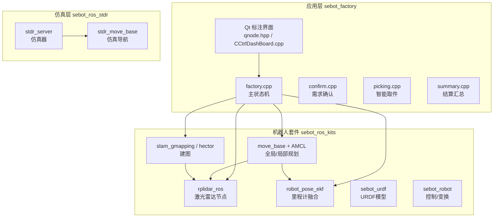
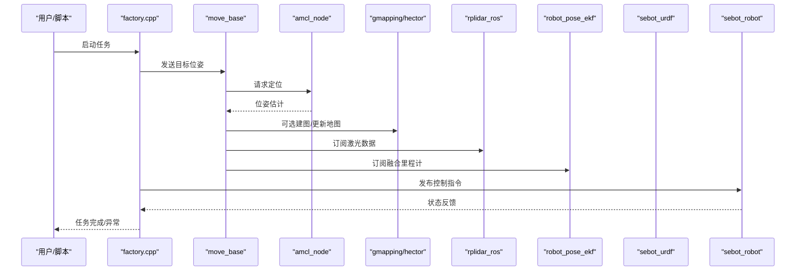
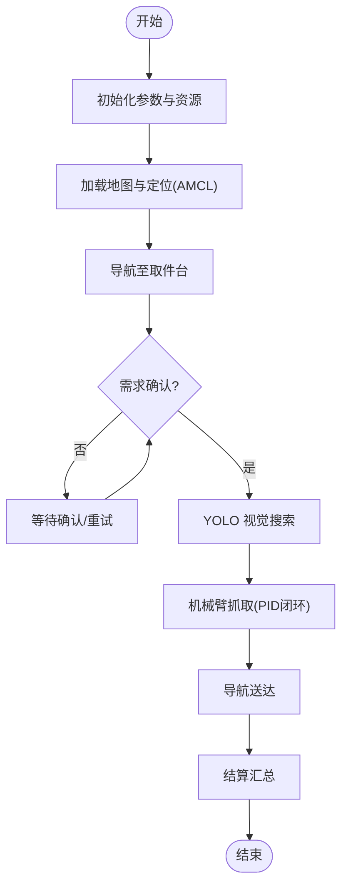
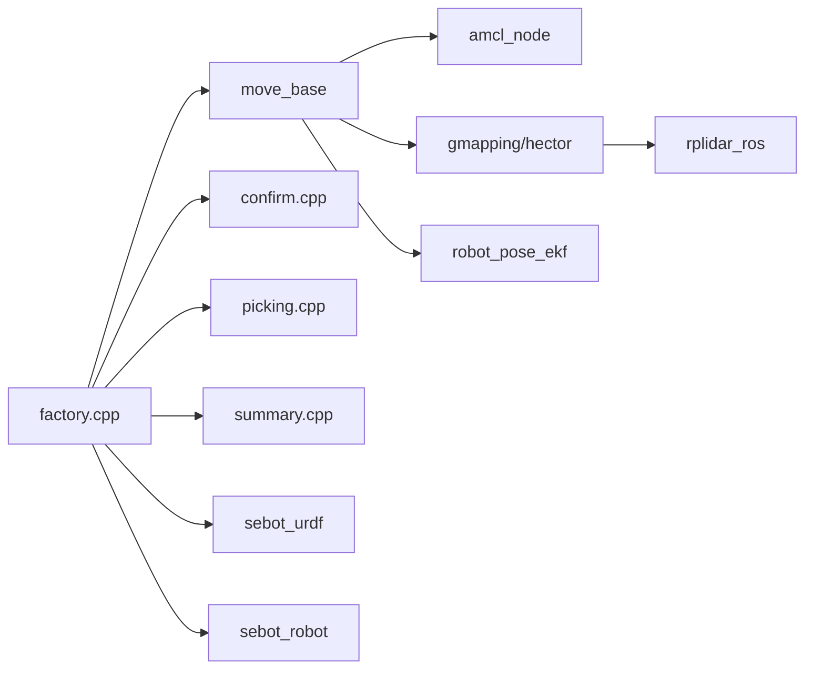

# 调试技巧与工具使用

<cite>
**本文引用的文件**   
- [sebot_factory.launch](file://sebot_factory/src/sebot_factory/launch/sebot_factory.launch)
- [factory.cpp](file://sebot_factory/src/sebot_factory/src/factory.cpp)
- [confirm.cpp](file://sebot_factory/src/sebot_factory/src/confirm.cpp)
- [picking.cpp](file://sebot_factory/src/sebot_factory/src/picking.cpp)
- [summary.cpp](file://sebot_factory/src/sebot_factory/src/summary.cpp)
- [qnode.hpp](file://sebot_factory/src/sebot_marking/include/qnode.hpp)
- [CCtrlDashBoard.cpp](file://sebot_factory/src/sebot_marking/src/CCtrlDashBoard.cpp)
- [slam.ui](file://sebot_factory/src/sebot_marking/ui/slam.ui)
- [addtopics.ui](file://sebot_factory/src/sebot_marking/ui/addtopics.ui)
- [move_base.launch](file://sebot_ros_kits/src/sebot_navigation/move_base/launch/move_base.launch)
- [amcl_node.cpp](file://sebot_ros_kits/src/sebot_navigation/amcl/src/amcl_node.cpp)
- [rplidar.launch](file://sebot_ros_kits/src/sebot_driver/rplidar_ros/launch/rplidar.launch)
- [robot_pose_ekf.launch](file://sebot_ros_kits/src/sebot_driver/robot_pose_ekf/launch/robot_pose_ekf.launch)
- [sebot_urdf.launch](file://sebot_ros_kits/src/sebot_driver/sebot_urdf/launch/sebot_urdf.launch)
- [sebot_odom.launch](file://sebot_ros_kits/src/sebot_robot/launch/sebot_odom.launch)
- [transform.cpp](file://sebot_ros_kits/src/sebot_robot/src/transform.cpp)
- [sebot_slam.launch](file://sebot_ros_kits/src/sebot_slam/sebot_slam/launch/sebot_slam.launch)
- [gmapping_node.cpp](file://sebot_ros_kits/src/sebot_slam/slam_gmapping/slam_gmapping/gmapping_node.cpp)
- [stdr_server.launch](file://sebot_ros_stdr/src/sebot_stdr/stdr_launchers/launch/stdr_server.launch)
- [stdr_move_base.launch](file://sebot_ros_stdr/src/sebot_stdr/stdr_navigation/launch/stdr_move_base.launch)
</cite>

## 目录
1. [简介](#简介)
2. [项目结构](#项目结构)
3. [核心组件](#核心组件)
4. [架构总览](#架构总览)
5. [详细组件分析](#详细组件分析)
6. [依赖关系分析](#依赖关系分析)
7. [性能考量](#性能考量)
8. [故障排查指南](#故障排查指南)
9. [结论](#结论)
10. [附录](#附录)

## 简介
本指南面向ROS机器人竞赛项目的开发与调试，围绕三大工作空间（应用层 sebot_factory、机器人套件 sebot_ros_kits、仿真层 sebot_ros_stdr）展开。内容覆盖：
- ROS 调试工具：rosbag 录制回放、rqt 图形化工具、rostopic/rosnode 命令
- GDB 断点调试：断点设置、变量查看、堆栈跟踪
- RViz 可视化：传感器数据、路径规划、状态监控
- 日志分析：ROS 日志级别、自定义输出、日志文件分析
- 常见问题定位与性能分析、内存泄漏检测

## 项目结构
本项目由三个相互独立的 catkin 工作空间组成，各自含 src/ 且需分别 catkin_make。文档按三层划分：
- 应用层 sebot_factory：业务主流程与交互界面（工厂任务、确认、取件、结算；Qt 标注上位机）
- 机器人套件 sebot_ros_kits：驱动与导航SLAM（RPLidar、里程计EKF、MoveIt!机械臂、AMCL/DWA/Gmapping/Hector）
- 仿真层 sebot_ros_stdr：STDR 仿真环境及集成

图表来源
- [factory.cpp:1-200](file://sebot_factory/src/sebot_factory/src/factory.cpp#L1-L200)
- [amcl_node.cpp:1-200](file://sebot_ros_kits/src/sebot_navigation/amcl/src/amcl_node.cpp#L1-L200)
- [gmapping_node.cpp:1-200](file://sebot_ros_kits/src/sebot_slam/slam_gmapping/slam_gmapping/gmapping_node.cpp#L1-L200)

章节来源
- [sebot_factory.launch:1-200](file://sebot_factory/src/sebot_factory/launch/sebot_factory.launch#L1-L200)

## 核心组件
- 应用层主状态机（factory.cpp）：串联「加载地图与定位 → 导航至取件台 → 需求确认 → YOLO 视觉搜索 → 机械臂抓取 → 导航送达并结算」，关键参数包括导航超时、PID、取件距离、补扫等，均在 launch 中配置。
- 需求确认（confirm.cpp）：与上层交互或传感器触发确认订单需求。
- 智能取件（picking.cpp）：结合视觉与机械臂控制完成抓取。
- 结算汇总（summary.cpp）：统计与上报任务结果。
- Qt 标注上位机（qnode.hpp, CCtrlDashBoard.cpp, slam.ui, addtopics.ui）：用于建图标注与主题订阅展示。

章节来源
- [factory.cpp:1-200](file://sebot_factory/src/sebot_factory/src/factory.cpp#L1-L200)
- [confirm.cpp:1-200](file://sebot_factory/src/sebot_factory/src/confirm.cpp#L1-L200)
- [picking.cpp:1-200](file://sebot_factory/src/sebot_factory/src/picking.cpp#L1-L200)
- [summary.cpp:1-200](file://sebot_factory/src/sebot_factory/src/summary.cpp#L1-L200)
- [qnode.hpp:1-200](file://sebot_factory/src/sebot_marking/include/qnode.hpp#L1-L200)
- [CCtrlDashBoard.cpp:1-200](file://sebot_factory/src/sebot_marking/src/CCtrlDashBoard.cpp#L1-L200)
- [slam.ui:1-200](file://sebot_factory/src/sebot_marking/ui/slam.ui#L1-L200)
- [addtopics.ui:1-200](file://sebot_factory/src/sebot_marking/ui/addtopics.ui#L1-L200)

## 架构总览
系统以 factory.cpp 为主控，调用 move_base 进行导航，AMCL 提供定位，Gmapping/Hector 负责建图，RPLidar 提供激光扫描，robot_pose_ekf 融合里程计，sebot_urdf 描述机器人模型，sebot_robot 提供控制与TF变换。仿真模式下通过 STDR 替代真实硬件。

图表来源
- [factory.cpp:1-200](file://sebot_factory/src/sebot_factory/src/factory.cpp#L1-L200)
- [amcl_node.cpp:1-200](file://sebot_ros_kits/src/sebot_navigation/amcl/src/amcl_node.cpp#L1-L200)
- [gmapping_node.cpp:1-200](file://sebot_ros_kits/src/sebot_slam/slam_gmapping/slam_gmapping/gmapping_node.cpp#L1-L200)

## 详细组件分析

### 应用层主状态机（factory.cpp）
- 职责：编排业务流程，管理导航、确认、视觉、抓取、结算等阶段的状态转换。
- 关键参数：导航超时、PID、取件距离、补扫等，均来源于 launch 配置。
- 调试要点：
  - 使用 rosbag 录制导航与视觉相关主题，回放验证状态切换逻辑。
  - 在状态边界处添加日志，配合 rqt_graph 观察节点通信。
  - 使用 rqt_plot 监控关键变量（如距离、角度误差）。

图表来源
- [factory.cpp:1-200](file://sebot_factory/src/sebot_factory/src/factory.cpp#L1-L200)

章节来源
- [factory.cpp:1-200](file://sebot_factory/src/sebot_factory/src/factory.cpp#L1-L200)
- [sebot_factory.launch:1-200](file://sebot_factory/src/sebot_factory/launch/sebot_factory.launch#L1-L200)

### 需求确认（confirm.cpp）
- 职责：接收外部输入或传感器信号，确认订单需求是否满足。
- 调试要点：
  - 使用 rostopic echo 检查确认消息的格式与时序。
  - 使用 rqt_topic 可视化确认信号的频率与延迟。

章节来源
- [confirm.cpp:1-200](file://sebot_factory/src/sebot_factory/src/confirm.cpp#L1-L200)

### 智能取件（picking.cpp）
- 职责：基于视觉检测结果与机械臂控制实现抓取。
- 调试要点：
  - 使用 rviz 显示检测结果与机械臂轨迹。
  - 使用 rqt_plot 监控 PID 参数与误差曲线。

章节来源
- [picking.cpp:1-200](file://sebot_factory/src/sebot_factory/src/picking.cpp#L1-L200)

### 结算汇总（summary.cpp）
- 职责：统计任务执行结果并上报。
- 调试要点：
  - 使用 rosbag 回放结算主题，校验数据完整性。
  - 使用 rqt_logger 过滤关键日志。

章节来源
- [summary.cpp:1-200](file://sebot_factory/src/sebot_factory/src/summary.cpp#L1-L200)

### Qt 标注上位机（qnode.hpp, CCtrlDashBoard.cpp, slam.ui, addtopics.ui）
- 职责：提供建图标注与主题订阅展示，辅助调试与标定。
- 调试要点：
  - 使用 rqt_console 查看 Qt 应用的日志输出。
  - 通过 addtopics.ui 动态添加主题订阅，slam.ui 调整建图参数。

章节来源
- [qnode.hpp:1-200](file://sebot_factory/src/sebot_marking/include/qnode.hpp#L1-L200)
- [CCtrlDashBoard.cpp:1-200](file://sebot_factory/src/sebot_marking/src/CCtrlDashBoard.cpp#L1-L200)
- [slam.ui:1-200](file://sebot_factory/src/sebot_marking/ui/slam.ui#L1-L200)
- [addtopics.ui:1-200](file://sebot_factory/src/sebot_marking/ui/addtopics.ui#L1-L200)

### 导航与定位（move_base + AMCL）
- 角色：move_base 协调全局/局部规划，AMCL 提供粒子滤波定位。
- 调试要点：
  - 使用 rviz 的 PoseWithCovarianceEstimation 和 Map 显示定位质量。
  - 使用 rostopic echo /tf 检查坐标变换链。

章节来源
- [move_base.launch:1-200](file://sebot_ros_kits/src/sebot_navigation/move_base/launch/move_base.launch#L1-L200)
- [amcl_node.cpp:1-200](file://sebot_ros_kits/src/sebot_navigation/amcl/src/amcl_node.cpp#L1-L200)

### 建图（slam_gmapping / hector）
- 角色：根据激光数据构建栅格地图。
- 调试要点：
  - 使用 rviz 的 LaserScan 与 Map 显示建图过程。
  - 使用 rosbag 录制激光数据，离线重建地图。

章节来源
- [sebot_slam.launch:1-200](file://sebot_ros_kits/src/sebot_slam/sebot_slam/launch/sebot_slam.launch#L1-L200)
- [gmapping_node.cpp:1-200](file://sebot_ros_kits/src/sebot_slam/slam_gmapping/slam_gmapping/gmapping_node.cpp#L1-L200)

### 传感器与驱动（rplidar_ros, robot_pose_ekf, sebot_urdf, sebot_robot）
- 角色：激光雷达提供扫描，EKF 融合里程计，URDF 描述模型，sebot_robot 提供控制与TF。
- 调试要点：
  - 使用 rqt_image_view 查看图像（如有），rostopic echo 检查激光数据。
  - 使用 tf_monitor 检查变换树。

章节来源
- [rplidar.launch:1-200](file://sebot_ros_kits/src/sebot_driver/rplidar_ros/launch/rplidar.launch#L1-L200)
- [robot_pose_ekf.launch:1-200](file://sebot_ros_kits/src/sebot_driver/robot_pose_ekf/launch/robot_pose_ekf.launch#L1-L200)
- [sebot_urdf.launch:1-200](file://sebot_ros_kits/src/sebot_driver/sebot_urdf/launch/sebot_urdf.launch#L1-L200)
- [sebot_odom.launch:1-200](file://sebot_ros_kits/src/sebot_robot/launch/sebot_odom.launch#L1-L200)
- [transform.cpp:1-200](file://sebot_ros_kits/src/sebot_robot/src/transform.cpp#L1-L200)

### 仿真集成（STDR）
- 角色：STDR 仿真器替代真实硬件，stdr_move_base 提供仿真导航。
- 调试要点：
  - 使用 stdr_server.launch 启动仿真，stdr_move_base.launch 运行导航。
  - 对比仿真与实机的参数差异，确保一致性。

章节来源
- [stdr_server.launch:1-200](file://sebot_ros_stdr/src/sebot_stdr/stdr_launchers/launch/stdr_server.launch#L1-L200)
- [stdr_move_base.launch:1-200](file://sebot_ros_stdr/src/sebot_stdr/stdr_navigation/launch/stdr_move_base.launch#L1-L200)

## 依赖关系分析
- 应用层依赖导航与传感器：factory.cpp 通过 move_base 与 AMCL 获取定位，依赖 rplidar_ros 的激光数据，robot_pose_ekf 提供融合里程计。
- 建图依赖激光数据：slam_gmapping/hector 订阅激光扫描生成地图。
- 仿真层与实机层通过统一接口（ROS topic/service）解耦，便于切换。

图表来源
- [factory.cpp:1-200](file://sebot_factory/src/sebot_factory/src/factory.cpp#L1-L200)
- [amcl_node.cpp:1-200](file://sebot_ros_kits/src/sebot_navigation/amcl/src/amcl_node.cpp#L1-L200)
- [gmapping_node.cpp:1-200](file://sebot_ros_kits/src/sebot_slam/slam_gmapping/slam_gmapping/gmapping_node.cpp#L1-L200)

章节来源
- [factory.cpp:1-200](file://sebot_factory/src/sebot_factory/src/factory.cpp#L1-L200)
- [move_base.launch:1-200](file://sebot_ros_kits/src/sebot_navigation/move_base/launch/move_base.launch#L1-L200)

## 性能考量
- 导航性能：调整 move_base 的全局/局部规划参数，优化代价地图分辨率与膨胀半径。
- 视觉处理：YOLO 推理使用 NPU 加速，注意帧率与内存占用，避免阻塞主循环。
- 传感器数据：激光扫描频率过高可能导致CPU负载上升，适当降频或下采样。
- 内存管理：避免频繁分配/释放对象，使用共享指针与对象池。

[本节为通用指导，不直接分析具体文件]

## 故障排查指南

### ROS 调试工具
- rosbag 录制与回放
  - 录制：选择关键主题（如 /odom, /scan, /amcl_pose, /move_base/result）
  - 回放：使用 -d 延迟回放，-r 倍速回放，结合 rviz 同步可视化
- rqt 图形化工具
  - rqt_graph：查看节点拓扑与连接
  - rqt_topic：监控主题频率与延迟
  - rqt_plot：绘制关键变量曲线
  - rqt_console：过滤与搜索日志
- rostopic 与 rosnode
  - rostopic list/info/echo：检查主题与数据
  - rosnode list/info：查看节点状态

章节来源
- [sebot_factory.launch:1-200](file://sebot_factory/src/sebot_factory/launch/sebot_factory.launch#L1-L200)

### GDB 调试器
- 断点设置
  - 在关键函数入口设置断点（如状态切换、导航回调）
  - 条件断点：仅当特定条件满足时中断
- 变量查看
  - print/display 查看变量值
  - watch 监视变量变化
- 堆栈跟踪
  - bt/backtrace 查看调用栈
  - frame 切换帧，inspect 局部变量

章节来源
- [factory.cpp:1-200](file://sebot_factory/src/sebot_factory/src/factory.cpp#L1-L200)

### RViz 可视化工具
- 传感器数据可视化
  - LaserScan：显示激光扫描点云
  - Image：显示摄像头图像（如有）
- 路径规划与状态监控
  - Path：显示全局/局部路径
  - PoseWithCovarianceEstimation：显示定位估计
  - Marker：自定义状态指示

章节来源
- [rplidar.launch:1-200](file://sebot_ros_kits/src/sebot_driver/rplidar_ros/launch/rplidar.launch#L1-L200)
- [amcl_node.cpp:1-200](file://sebot_ros_kits/src/sebot_navigation/amcl/src/amcl_node.cpp#L1-L200)

### 日志分析方法
- ROS 日志级别
  - DEBUG/INFO/WARN/ERROR/FATAL，合理设置级别减少噪音
- 自定义日志输出
  - 使用 ROS 日志宏输出结构化信息
  - 区分不同模块的日志前缀
- 日志文件分析
  - 使用 grep/awk 筛选关键错误
  - 结合时间戳关联多节点日志

章节来源
- [confirm.cpp:1-200](file://sebot_factory/src/sebot_factory/src/confirm.cpp#L1-L200)
- [picking.cpp:1-200](file://sebot_factory/src/sebot_factory/src/picking.cpp#L1-L200)

### 常见问题与定位技巧
- 导航失败
  - 检查地图与定位是否匹配
  - 调整代价地图参数与障碍物阈值
- 视觉识别不稳定
  - 检查光照与遮挡，增加多帧确认
  - 调整YOLO置信度阈值
- 机械臂抓取失败
  - 校准手眼标定，检查PID参数
  - 使用rviz可视化轨迹与碰撞检测

章节来源
- [factory.cpp:1-200](file://sebot_factory/src/sebot_factory/src/factory.cpp#L1-L200)
- [picking.cpp:1-200](file://sebot_factory/src/sebot_factory/src/picking.cpp#L1-L200)

### 性能分析与内存泄漏检测
- 性能分析
  - 使用 perf 或 gprof 分析热点函数
  - 监控CPU/内存占用（top, htop, valgrind --tool=massif）
- 内存泄漏检测
  - 使用 valgrind 检测未释放内存
  - 检查智能指针使用，避免循环引用

[本节为通用指导，不直接分析具体文件]

## 结论
本指南围绕ROS机器人竞赛项目的三大工作空间，系统介绍了调试工具与方法。通过rosbag、rqt、rostopic/rosnode、GDB、RViz等工具，结合日志分析与性能优化，可有效定位问题并提升系统稳定性。建议在实际调试中结合具体场景灵活应用，形成标准化的调试流程。

## 附录
- 常用命令速查
  - rosbag record -O output.bag /topic1 /topic2
  - rosbag play -d 2 -r 1.0 output.bag
  - rqt_graph
  - rostopic echo /scan
  - rosnode info /amcl
  - gdb ./your_node
- 推荐配置文件
  - sebot_factory.launch：关键参数集中管理
  - move_base.launch：导航参数调优
  - amcl_node.cpp：定位算法配置

[本节为补充信息，不直接分析具体文件]