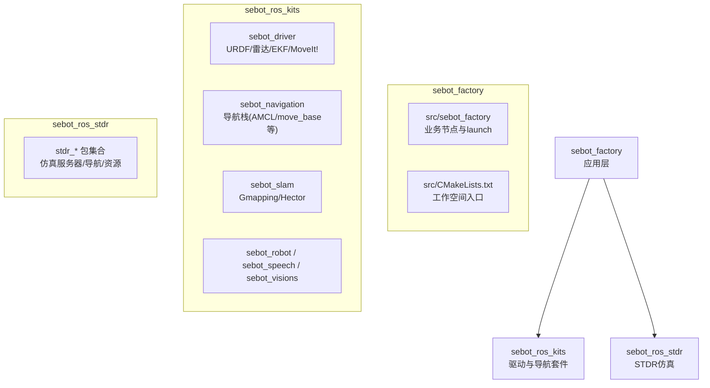
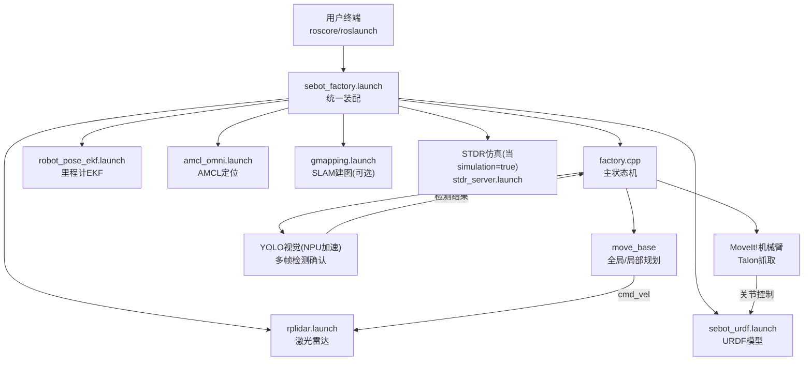
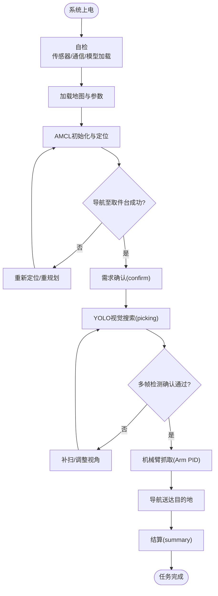
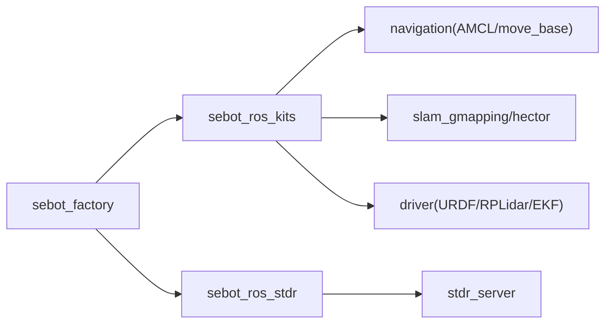

# 快速开始

<cite>
**本文引用的文件**   
- [sebot_factory.launch](file://sebot_factory/src/sebot_factory/launch/sebot_factory.launch)
- [factory.cpp](file://sebot_factory/src/sebot_factory/src/factory.cpp)
- [confirm.cpp](file://sebot_factory/src/sebot_factory/src/confirm.cpp)
- [picking.cpp](file://sebot_factory/src/sebot_factory/src/picking.cpp)
- [summary.cpp](file://sebot_factory/src/sebot_factory/src/summary.cpp)
- [sebot_urdf.launch](file://sebot_ros_kits/src/sebot_driver/sebot_urdf/launch/sebot_urdf.launch)
- [rplidar.launch](file://sebot_ros_kits/src/sebot_driver/rplidar_ros/launch/rplidar.launch)
- [robot_pose_ekf.launch](file://sebot_ros_kits/src/sebot_driver/robot_pose_ekf/launch/robot_pose_ekf.launch)
- [amcl_omni.launch](file://sebot_ros_kits/src/sebot_navigation/amcl/examples/amcl_omni.launch)
- [gmapping.launch](file://sebot_ros_kits/src/sebot_slam/slam_gmapping/slam_gmapping/gmapping.launch)
- [stdr_server.launch](file://sebot_ros_stdr/src/sebot_stdr/stdr_launchers/launch/stdr_server.launch)
- [CMakeLists.txt](file://sebot_factory/src/CMakeLists.txt)
- [package.xml](file://sebot_factory/src/sebot_factory/package.xml)
</cite>

## 目录
1. [简介](#简介)
2. [项目结构](#项目结构)
3. [核心组件](#核心组件)
4. [架构总览](#架构总览)
5. [详细组件分析](#详细组件分析)
6. [依赖关系分析](#依赖关系分析)
7. [性能与运行建议](#性能与运行建议)
8. [故障排除指南](#故障排除指南)
9. [结论](#结论)
10. [附录：首次运行完整步骤（30分钟）](#附录首次运行完整步骤30分钟)

## 简介
本指南面向初学者，帮助你在30分钟内完成机器人竞赛系统的搭建与首次运行。系统基于 ROS 1 + catkin，包含三个相互独立的 catkin 工作空间：
- sebot_factory：应用层业务节点（订单、确认、取件、结算等状态机与交互）
- sebot_ros_kits：机器人驱动与导航套件（URDF、激光雷达、里程计EKF、AMCL、SLAM、MoveIt!等）
- sebot_ros_stdr：STDR仿真环境（用于无硬件时的仿真调试）

你将学会如何克隆源码、配置环境、编译三个工作空间、设置关键参数，并通过一个启动文件一键拉起系统。

## 项目结构
仓库由三个独立 catkin 工作空间组成，每个工作空间均包含 src/ 目录，需分别进行 catkin_make 编译。顶层 .gitignore 仅忽略版本控制无关文件，不干扰构建流程。

图表来源
- [CMakeLists.txt](file://sebot_factory/src/CMakeLists.txt)
- [package.xml](file://sebot_factory/src/sebot_factory/package.xml)

章节来源
- [CMakeLists.txt](file://sebot_factory/src/CMakeLists.txt)
- [package.xml](file://sebot_factory/src/sebot_factory/package.xml)

## 核心组件
- 应用层状态机与业务节点
  - factory.cpp：主状态机（MultiNavi），串联“自检→定位→导航→确认→视觉搜索→抓取→送达→结算”全链路
  - confirm.cpp：需求确认（语音/按键/传感器触发）
  - picking.cpp：智能取件（机械臂PID闭环抓取）
  - summary.cpp：结算汇总（订单完成统计与上报）
- 驱动与导航套件
  - URDF模型加载、RPLidar点云发布、IMU+里程计EKF融合、AMCL定位、move_base导航、SLAM建图
- 仿真层
  - STDR服务器与环境资源，提供与真实硬件一致的ROS话题与服务接口

章节来源
- [factory.cpp](file://sebot_factory/src/sebot_factory/src/factory.cpp)
- [confirm.cpp](file://sebot_factory/src/sebot_factory/src/confirm.cpp)
- [picking.cpp](file://sebot_factory/src/sebot_factory/src/picking.cpp)
- [summary.cpp](file://sebot_factory/src/sebot_factory/src/summary.cpp)

## 架构总览
下图展示了从启动到运行的关键节点与数据流。通过 sebot_factory.launch 统一装配各子系统，支持 simulation 参数切换 STDR 仿真模式，debug 参数控制识别界面开关。

图表来源
- [sebot_factory.launch](file://sebot_factory/src/sebot_factory/launch/sebot_factory.launch)
- [rplidar.launch](file://sebot_ros_kits/src/sebot_driver/rplidar_ros/launch/rplidar.launch)
- [robot_pose_ekf.launch](file://sebot_ros_kits/src/sebot_driver/robot_pose_ekf/launch/robot_pose_ekf.launch)
- [amcl_omni.launch](file://sebot_ros_kits/src/sebot_navigation/amcl/examples/amcl_omni.launch)
- [gmapping.launch](file://sebot_ros_kits/src/sebot_slam/slam_gmapping/slam_gmapping/gmapping.launch)
- [sebot_urdf.launch](file://sebot_ros_kits/src/sebot_driver/sebot_urdf/launch/sebot_urdf.launch)
- [stdr_server.launch](file://sebot_ros_stdr/src/sebot_stdr/stdr_launchers/launch/stdr_server.launch)

## 详细组件分析

### 启动装配与关键参数（sebot_factory.launch）
- 作用
  - 统一加载 URDF、传感器、定位、导航、SLAM、业务节点
  - 通过 simulation 参数切换 STDR 仿真模式（无需硬件）
  - 通过 debug 参数控制图像识别界面开关（便于调试YOLO结果）
  - 集中配置导航超时、PID、取件距离、补扫等关键行为参数
- 关键参数说明
  - simulation：true/false，是否启用 STDR 仿真；为 true 时加载 stdr_server 与仿真地图
  - debug：true/false，是否打开视觉识别可视化界面
  - 导航相关：全局/局部规划器参数、代价地图更新频率、目标到达阈值、超时时间
  - 机械臂相关：PID增益、抓取姿态容差、安全限位
  - 传感器相关：激光雷达帧率、IMU噪声、EKF融合权重
- 使用建议
  - 初次运行建议开启 debug=false 以减少渲染开销
  - 无硬件时使用 simulation=true，并选择标准仿真地图
  - 根据实际场景微调导航超时与补扫参数，避免误判

章节来源
- [sebot_factory.launch](file://sebot_factory/src/sebot_factory/launch/sebot_factory.launch)

### 主状态机与业务节点
- factory.cpp
  - 实现 MultiNavi 主状态机，协调导航、确认、视觉、抓取、结算等阶段
  - 处理异常分支（如定位失败、视觉未检出、抓取失败）与重试策略
- confirm.cpp
  - 接收外部确认信号（语音/按键/传感器），进入下一阶段
- picking.cpp
  - 调用 MoveIt! 执行抓取轨迹，结合PID闭环调整末端位姿
- summary.cpp
  - 汇总订单信息，输出统计与日志，供上层监控或评测

图表来源
- [factory.cpp](file://sebot_factory/src/sebot_factory/src/factory.cpp)
- [confirm.cpp](file://sebot_factory/src/sebot_factory/src/confirm.cpp)
- [picking.cpp](file://sebot_factory/src/sebot_factory/src/picking.cpp)
- [summary.cpp](file://sebot_factory/src/sebot_factory/src/summary.cpp)

章节来源
- [factory.cpp](file://sebot_factory/src/sebot_factory/src/factory.cpp)
- [confirm.cpp](file://sebot_factory/src/sebot_factory/src/confirm.cpp)
- [picking.cpp](file://sebot_factory/src/sebot_factory/src/picking.cpp)
- [summary.cpp](file://sebot_factory/src/sebot_factory/src/summary.cpp)

### 驱动与导航套件集成
- URDF模型：sebot_urdf.launch 加载机器人模型与关节控制器
- 激光雷达：rplidar.launch 发布点云与扫描数据
- 里程计EKF：robot_pose_ekf.launch 融合 IMU 与轮式里程计
- 定位与导航：amcl_omni.launch 提供粒子滤波定位，move_base 负责路径规划
- SLAM建图：gmapping.launch 在未知环境中构建栅格地图

章节来源
- [sebot_urdf.launch](file://sebot_ros_kits/src/sebot_driver/sebot_urdf/launch/sebot_urdf.launch)
- [rplidar.launch](file://sebot_ros_kits/src/sebot_driver/rplidar_ros/launch/rplidar.launch)
- [robot_pose_ekf.launch](file://sebot_ros_kits/src/sebot_driver/robot_pose_ekf/launch/robot_pose_ekf.launch)
- [amcl_omni.launch](file://sebot_ros_kits/src/sebot_navigation/amcl/examples/amcl_omni.launch)
- [gmapping.launch](file://sebot_ros_kits/src/sebot_slam/slam_gmapping/slam_gmapping/gmapping.launch)

### 仿真层（STDR）
- stdr_server.launch 启动仿真服务器，提供与真实硬件一致的话题与服务
- 配合 sebot_factory.launch 的 simulation=true 使用，可快速验证算法与流程

章节来源
- [stdr_server.launch](file://sebot_ros_stdr/src/sebot_stdr/stdr_launchers/launch/stdr_server.launch)

## 依赖关系分析
- 工作空间依赖
  - sebot_factory 依赖 sebot_ros_kits（驱动/导航/SLAM）与 sebot_ros_stdr（仿真）
- 包内依赖
  - 业务节点依赖导航服务（move_base）、定位服务（AMCL）、感知服务（激光雷达/视觉）、控制服务（MoveIt!）
- 外部依赖
  - ROS 1 基础库、Eigen/OpenCV/PCL（视具体功能）、NPU推理框架（YOLO加速）

图表来源
- [package.xml](file://sebot_factory/src/sebot_factory/package.xml)

章节来源
- [package.xml](file://sebot_factory/src/sebot_factory/package.xml)

## 性能与运行建议
- 首次运行关闭 debug 以减轻渲染与I/O压力
- 仿真模式下优先选择轻量级地图与较低分辨率点云
- 合理设置导航超时与补扫次数，避免长时间卡死
- 视觉推理建议使用NPU加速，降低CPU占用
- 若出现卡顿，检查 roscore 所在主机资源占用与网络带宽

## 故障排除指南
- 无法找到包或依赖缺失
  - 确保三个工作空间均已正确 catkin_make 且 source devel/setup.bash
  - 检查 package.xml 中依赖声明是否完整
- 启动后无传感器数据
  - 确认 rplidar.launch 已启动且设备可用
  - 仿真模式下检查 stdr_server 是否正常发布激光与里程计
- 定位失败或漂移严重
  - 检查 AMCL 参数（粒子数、观测模型、地图匹配阈值）
  - 确认 IMU 与里程计EKF权重合理
- 导航超时或无法到达目标
  - 调整代价地图膨胀半径与局部规划器参数
  - 检查障碍物层与动态障碍物过滤
- 视觉未检出或误检
  - 调整 YOLO 阈值与多帧确认逻辑
  - 优化光照与拍摄角度
- 机械臂抓取失败
  - 检查 MoveIt! 配置与碰撞检测
  - 调整PID增益与末端容差

章节来源
- [sebot_factory.launch](file://sebot_factory/src/sebot_factory/launch/sebot_factory.launch)
- [rplidar.launch](file://sebot_ros_kits/src/sebot_driver/rplidar_ros/launch/rplidar.launch)
- [robot_pose_ekf.launch](file://sebot_ros_kits/src/sebot_driver/robot_pose_ekf/launch/robot_pose_ekf.launch)
- [amcl_omni.launch](file://sebot_ros_kits/src/sebot_navigation/amcl/examples/amcl_omni.launch)
- [gmapping.launch](file://sebot_ros_kits/src/sebot_slam/slam_gmapping/slam_gmapping/gmapping.launch)
- [stdr_server.launch](file://sebot_ros_stdr/src/sebot_stdr/stdr_launchers/launch/stdr_server.launch)

## 结论
通过统一的 sebot_factory.launch 装配与清晰的三层工作空间划分，你可以在短时间内完成从环境搭建到系统运行的全流程。建议先以仿真模式验证主流程，再逐步切换到真实硬件并调优参数。遇到常见问题时，参考本指南的故障排除部分快速定位与解决。

## 附录：首次运行完整步骤（30分钟）
- 准备环境
  - 安装 ROS 1（推荐 Noetic 或 Melodic）
  - 安装 catkin 工具链与常用依赖（rospy/roscpp、geometry_msgs、sensor_msgs、nav_msgs、visualization_msgs 等）
- 克隆源码
  - 在工作空间根目录克隆仓库，确保 sebot_factory、sebot_ros_kits、sebot_ros_stdr 三个子目录存在
- 编译工作空间
  - 依次在每个工作空间下执行 catkin_make
  - 每次编译后 source devel/setup.bash
- 配置参数
  - 编辑 sebot_factory.launch，设置 simulation=true（仿真）或 false（真机）
  - 根据需要调整 debug、导航超时、PID、取件距离、补扫等参数
- 启动系统
  - 运行 roscore
  - 使用 roslaunch 启动 sebot_factory.launch
  - 观察 RViz 中的传感器数据、定位与路径规划结果
- 验证流程
  - 仿真模式：确认 stdr_server 正常、激光与里程计数据可见
  - 真机模式：确认雷达、IMU、URDF 模型与控制接口正常
  - 触发订单流程，观察状态机推进与日志输出

章节来源
- [sebot_factory.launch](file://sebot_factory/src/sebot_factory/launch/sebot_factory.launch)
- [CMakeLists.txt](file://sebot_factory/src/CMakeLists.txt)
- [package.xml](file://sebot_factory/src/sebot_factory/package.xml)