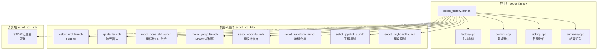
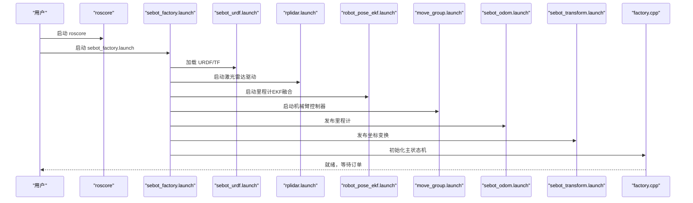
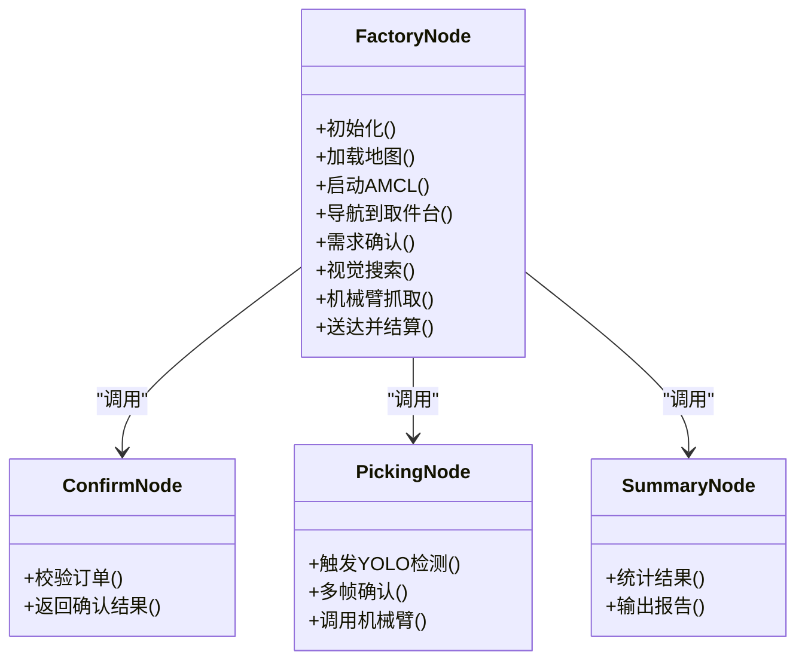
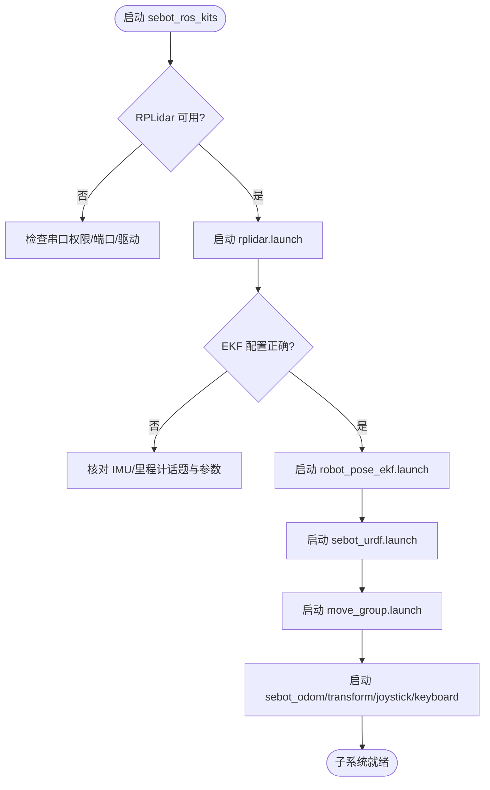
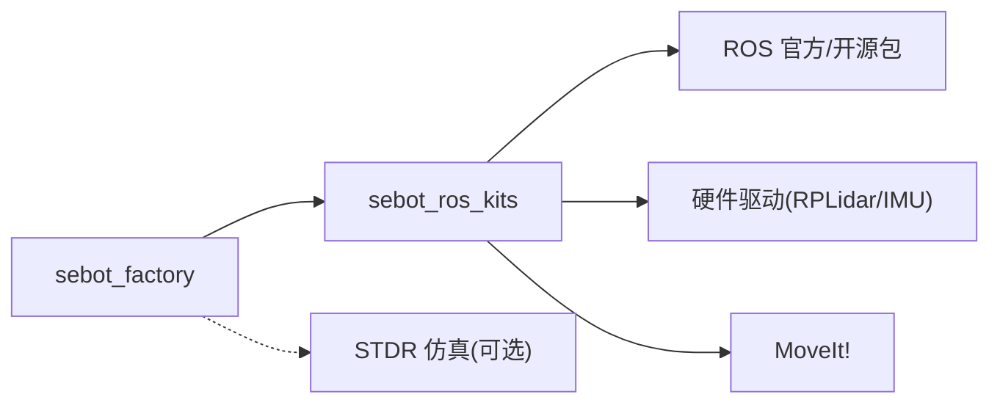

# 启动问题排查

<cite>
**本文引用的文件**   
- [sebot_factory.launch](file://sebot_factory/src/sebot_factory/launch/sebot_factory.launch)
- [factory.cpp](file://sebot_factory/src/sebot_factory/src/factory.cpp)
- [confirm.cpp](file://sebot_factory/src/sebot_factory/src/confirm.cpp)
- [picking.cpp](file://sebot_factory/src/sebot_factory/src/picking.cpp)
- [summary.cpp](file://sebot_factory/src/sebot_factory/src/summary.cpp)
- [sebot_marking.launch](file://sebot_factory/src/sebot_marking/launch/sebot_marking.launch)
- [sebot_urdf.launch](file://sebot_ros_kits/src/sebot_driver/sebot_urdf/launch/sebot_urdf.launch)
- [rplidar.launch](file://sebot_ros_kits/src/sebot_driver/rplidar_ros/launch/rplidar.launch)
- [robot_pose_ekf.launch](file://sebot_ros_kits/src/sebot_driver/robot_pose_ekf/launch/robot_pose_ekf.launch)
- [move_group.launch](file://sebot_ros_kits/src/sebot_driver/sebot_talon_moveit/launch/move_group.launch)
- [sebot_odom.launch](file://sebot_ros_kits/src/sebot_robot/launch/sebot_odom.launch)
- [sebot_transform.launch](file://sebot_ros_kits/src/sebot_robot/launch/sebot_transform.launch)
- [sebot_joystick.launch](file://sebot_ros_kits/src/sebot_robot/launch/sebot_joystick.launch)
- [sebot_keyboard.launch](file://sebot_ros_kits/src/sebot_robot/launch/sebot_keyboard.launch)
- [CMakeLists.txt](file://sebot_factory/src/sebot_factory/CMakeLists.txt)
- [package.xml](file://sebot_factory/src/sebot_factory/package.xml)
- [CMakeLists.txt](file://sebot_ros_kits/src/sebot_driver/CMakeLists.txt)
- [package.xml](file://sebot_ros_kits/src/sebot_driver/package.xml)
- [.catkin_workspace](file://sebot_factory/.catkin_workspace)
- [.catkin_workspace](file://sebot_ros_kits/.catkin_workspace)
</cite>

## 目录
1. [简介](#简介)
2. [项目结构](#项目结构)
3. [核心组件](#核心组件)
4. [架构总览](#架构总览)
5. [详细组件分析](#详细组件分析)
6. [依赖关系分析](#依赖关系分析)
7. [性能与稳定性考虑](#性能与稳定性考虑)
8. [故障排查指南](#故障排查指南)
9. [结论](#结论)
10. [附录](#附录)

## 简介
本文件面向机器人竞赛系统的“启动失败”问题，提供系统化、可操作的排查方法。内容覆盖 ROS 环境配置、catkin 工作空间编译、launch 文件加载、硬件驱动初始化等常见问题；给出症状、原因分析与解决步骤；并提供日志分析方法与常见错误含义说明。系统由三层 catkin 工作空间组成：应用层 sebot_factory、机器人套件 sebot_ros_kits、仿真层 sebot_ros_stdr，各自独立构建与运行。

## 项目结构
- 三层工作空间
  - sebot_factory：业务应用层（工厂流程、确认、取件、结算等节点）
  - sebot_ros_kits：机器人套件（驱动、导航、SLAM、语音、视觉等）
  - sebot_ros_stdr：STDR 仿真器（可选，用于无硬件调试）
- 关键入口
  - 应用主流程：sebot_factory.launch 统一拉起各子系统
  - 建图标注上位机：sebot_marking.launch
  - 驱动与传感器：rplidar.launch、sebot_urdf.launch、robot_pose_ekf.launch
  - 机械臂控制：move_group.launch（MoveIt!）
  - 运动控制与输入：sebot_odom.launch、sebot_transform.launch、sebot_joystick.launch、sebot_keyboard.launch

**图示来源** 
- [sebot_factory.launch](file://sebot_factory/src/sebot_factory/launch/sebot_factory.launch)
- [factory.cpp](file://sebot_factory/src/sebot_factory/src/factory.cpp)
- [confirm.cpp](file://sebot_factory/src/sebot_factory/src/confirm.cpp)
- [picking.cpp](file://sebot_factory/src/sebot_factory/src/picking.cpp)
- [summary.cpp](file://sebot_factory/src/sebot_factory/src/summary.cpp)
- [sebot_urdf.launch](file://sebot_ros_kits/src/sebot_driver/sebot_urdf/launch/sebot_urdf.launch)
- [rplidar.launch](file://sebot_ros_kits/src/sebot_driver/rplidar_ros/launch/rplidar.launch)
- [robot_pose_ekf.launch](file://sebot_ros_kits/src/sebot_driver/robot_pose_ekf/launch/robot_pose_ekf.launch)
- [move_group.launch](file://sebot_ros_kits/src/sebot_driver/sebot_talon_moveit/launch/move_group.launch)
- [sebot_odom.launch](file://sebot_ros_kits/src/sebot_robot/launch/sebot_odom.launch)
- [sebot_transform.launch](file://sebot_ros_kits/src/sebot_robot/launch/sebot_transform.launch)
- [sebot_joystick.launch](file://sebot_ros_kits/src/sebot_robot/launch/sebot_joystick.launch)
- [sebot_keyboard.launch](file://sebot_ros_kits/src/sebot_robot/launch/sebot_keyboard.launch)

**章节来源**
- [sebot_factory.launch](file://sebot_factory/src/sebot_factory/launch/sebot_factory.launch)
- [sebot_marking.launch](file://sebot_factory/src/sebot_marking/launch/sebot_marking.launch)
- [.catkin_workspace](file://sebot_factory/.catkin_workspace)
- [.catkin_workspace](file://sebot_ros_kits/.catkin_workspace)

## 核心组件
- 应用主状态机（factory.cpp）
  - 负责订单生命周期管理：自检 → 地图加载与 AMCL 定位 → 导航至取件台 → 需求确认 → 视觉搜索 → 机械臂抓取 → 送达并结算
  - 关键参数：导航超时、PID 参数、取件距离、补扫策略等，均在 launch 中集中配置
- 需求确认（confirm.cpp）
  - 与上层交互确认任务目标，校验必要信息后进入下一阶段
- 智能取件（picking.cpp）
  - 协调视觉与机械臂动作，完成闭环抓取
- 结算汇总（summary.cpp）
  - 输出任务结果统计，供评测或记录使用
- 建图标注上位机（sebot_marking）
  - Qt 界面辅助建图与标注，通过 sebot_marking.launch 启动

**章节来源**
- [factory.cpp](file://sebot_factory/src/sebot_factory/src/factory.cpp)
- [confirm.cpp](file://sebot_factory/src/sebot_factory/src/confirm.cpp)
- [picking.cpp](file://sebot_factory/src/sebot_factory/src/picking.cpp)
- [summary.cpp](file://sebot_factory/src/sebot_factory/src/summary.cpp)
- [sebot_marking.launch](file://sebot_factory/src/sebot_marking/launch/sebot_marking.launch)

## 架构总览
- 启动链路
  - 先启动 roscore
  - 再启动 sebot_factory.launch，内部依次拉起 URDF/TF、传感器驱动、EKF 融合、MoveIt!、里程计与控制接口
  - 根据 simulation 参数切换 STDR 仿真模式
  - debug 参数控制图像识别界面开关
- 数据流
  - 传感器（激光、IMU、里程计）→ EKF 融合 → TF 坐标系 → 导航栈（AMCL + move_base + DWA）→ 业务状态机（factory）→ 执行器（机械臂、底盘）

**图示来源** 
- [sebot_factory.launch](file://sebot_factory/src/sebot_factory/launch/sebot_factory.launch)
- [sebot_urdf.launch](file://sebot_ros_kits/src/sebot_driver/sebot_urdf/launch/sebot_urdf.launch)
- [rplidar.launch](file://sebot_ros_kits/src/sebot_driver/rplidar_ros/launch/rplidar.launch)
- [robot_pose_ekf.launch](file://sebot_ros_kits/src/sebot_driver/robot_pose_ekf/launch/robot_pose_ekf.launch)
- [move_group.launch](file://sebot_ros_kits/src/sebot_driver/sebot_talon_moveit/launch/move_group.launch)
- [sebot_odom.launch](file://sebot_ros_kits/src/sebot_robot/launch/sebot_odom.launch)
- [sebot_transform.launch](file://sebot_ros_kits/src/sebot_robot/launch/sebot_transform.launch)
- [factory.cpp](file://sebot_factory/src/sebot_factory/src/factory.cpp)

## 详细组件分析

### 应用层 sebot_factory
- 启动入口
  - sebot_factory.launch：集中配置 simulation/debug 等关键参数，按顺序拉起各子节点
- 主状态机
  - factory.cpp：实现订单全生命周期状态机，串联导航、确认、视觉、抓取、结算
- 其他节点
  - confirm.cpp：需求确认
  - picking.cpp：取件逻辑
  - summary.cpp：结算汇总

**图示来源** 
- [factory.cpp](file://sebot_factory/src/sebot_factory/src/factory.cpp)
- [confirm.cpp](file://sebot_factory/src/sebot_factory/src/confirm.cpp)
- [picking.cpp](file://sebot_factory/src/sebot_factory/src/picking.cpp)
- [summary.cpp](file://sebot_factory/src/sebot_factory/src/summary.cpp)

**章节来源**
- [sebot_factory.launch](file://sebot_factory/src/sebot_factory/launch/sebot_factory.launch)
- [factory.cpp](file://sebot_factory/src/sebot_factory/src/factory.cpp)
- [confirm.cpp](file://sebot_factory/src/sebot_factory/src/confirm.cpp)
- [picking.cpp](file://sebot_factory/src/sebot_factory/src/picking.cpp)
- [summary.cpp](file://sebot_factory/src/sebot_factory/src/summary.cpp)

### 机器人套件 sebot_ros_kits
- 传感器与驱动
  - rplidar.launch：启动 RPLidar 节点，发布 /scan 数据
  - robot_pose_ekf.launch：融合 IMU 与里程计，输出稳定位姿
- 坐标与模型
  - sebot_urdf.launch：加载 URDF，发布 TF
- 导航与规划
  - move_group.launch：MoveIt! 控制机械臂
- 控制接口
  - sebot_odom.launch：发布里程计
  - sebot_transform.launch：发布坐标变换
  - sebot_joystick.launch / sebot_keyboard.launch：输入设备控制

**图示来源** 
- [rplidar.launch](file://sebot_ros_kits/src/sebot_driver/rplidar_ros/launch/rplidar.launch)
- [robot_pose_ekf.launch](file://sebot_ros_kits/src/sebot_driver/robot_pose_ekf/launch/robot_pose_ekf.launch)
- [sebot_urdf.launch](file://sebot_ros_kits/src/sebot_driver/sebot_urdf/launch/sebot_urdf.launch)
- [move_group.launch](file://sebot_ros_kits/src/sebot_driver/sebot_talon_moveit/launch/move_group.launch)
- [sebot_odom.launch](file://sebot_ros_kits/src/sebot_robot/launch/sebot_odom.launch)
- [sebot_transform.launch](file://sebot_ros_kits/src/sebot_robot/launch/sebot_transform.launch)
- [sebot_joystick.launch](file://sebot_ros_kits/src/sebot_robot/launch/sebot_joystick.launch)
- [sebot_keyboard.launch](file://sebot_ros_kits/src/sebot_robot/launch/sebot_keyboard.launch)

**章节来源**
- [rplidar.launch](file://sebot_ros_kits/src/sebot_driver/rplidar_ros/launch/rplidar.launch)
- [robot_pose_ekf.launch](file://sebot_ros_kits/src/sebot_driver/robot_pose_ekf/launch/robot_pose_ekf.launch)
- [sebot_urdf.launch](file://sebot_ros_kits/src/sebot_driver/sebot_urdf/launch/sebot_urdf.launch)
- [move_group.launch](file://sebot_ros_kits/src/sebot_driver/sebot_talon_moveit/launch/move_group.launch)
- [sebot_odom.launch](file://sebot_ros_kits/src/sebot_robot/launch/sebot_odom.launch)
- [sebot_transform.launch](file://sebot_ros_kits/src/sebot_robot/launch/sebot_transform.launch)
- [sebot_joystick.launch](file://sebot_ros_kits/src/sebot_robot/launch/sebot_joystick.launch)
- [sebot_keyboard.launch](file://sebot_ros_kits/src/sebot_robot/launch/sebot_keyboard.launch)

### 仿真层 sebot_ros_stdr
- 角色：提供 STDR 仿真环境，便于无硬件联调
- 集成方式：在 sebot_factory.launch 中通过 simulation 参数切换至仿真模式
- 注意：仿真模式下无需真实传感器驱动，但需确保仿真器与 TF/里程计话题一致

**章节来源**
- [sebot_factory.launch](file://sebot_factory/src/sebot_factory/launch/sebot_factory.launch)

## 依赖关系分析
- 包依赖
  - sebot_factory 依赖 sebot_ros_kits 中的驱动与导航包
  - sebot_ros_kits 依赖 ROS 官方导航栈与开源 SLAM/Motion 库
- 构建依赖
  - 每个工作空间独立 catkin_make，需在各自 src/ 下满足 package.xml 与 CMakeLists.txt 的依赖声明
- 运行时依赖
  - roscore、TF、ROS 消息类型、外部驱动（如 RPLidar SDK）、MoveIt! 插件

**图示来源** 
- [CMakeLists.txt](file://sebot_factory/src/sebot_factory/CMakeLists.txt)
- [package.xml](file://sebot_factory/src/sebot_factory/package.xml)
- [CMakeLists.txt](file://sebot_ros_kits/src/sebot_driver/CMakeLists.txt)
- [package.xml](file://sebot_ros_kits/src/sebot_driver/package.xml)

**章节来源**
- [CMakeLists.txt](file://sebot_factory/src/sebot_factory/CMakeLists.txt)
- [package.xml](file://sebot_factory/src/sebot_factory/package.xml)
- [CMakeLists.txt](file://sebot_ros_kits/src/sebot_driver/CMakeLists.txt)
- [package.xml](file://sebot_ros_kits/src/sebot_driver/package.xml)

## 性能与稳定性考虑
- 启动顺序与资源占用
  - 建议先启动底层驱动与 TF，再启动导航与业务节点，避免空指针或 TF 缺失导致崩溃
- 参数调优
  - 导航超时、PID、取件距离、补扫参数等在 sebot_factory.launch 中集中配置，应根据实际场景调整
- 可视化与调试
  - debug 参数控制图像识别界面，建议在开发阶段开启以便观察中间结果
- 仿真优先
  - 使用 STDR 仿真快速验证流程，减少硬件调试成本

[本节为通用指导，不直接分析具体文件]

## 故障排查指南

### 一、ROS 环境变量与版本问题
- 症状
  - roscore 无法启动或找不到命令
  - rosrun/roslaunch 报“找不到包”或“未找到可执行文件”
- 可能原因
  - 未 source ROS 环境脚本
  - ROS 版本与工作空间不匹配
- 解决步骤
  - 确认已 source 对应版本的 setup.bash
  - 检查 ROS_DISTRO 与安装路径一致
  - 重新构建工作空间并再次 source

**章节来源**
- [.catkin_workspace](file://sebot_factory/.catkin_workspace)
- [.catkin_workspace](file://sebot_ros_kits/.catkin_workspace)

### 二、catkin 工作空间编译失败
- 症状
  - catkin_make 报错“缺少依赖”“找不到头文件”“链接失败”
- 可能原因
  - package.xml 或 CMakeLists.txt 依赖声明不完整
  - 第三方库未安装或路径不正确
  - 工作空间未正确初始化
- 解决步骤
  - 在工作空间根目录执行 catkin_make
  - 根据错误提示安装缺失依赖
  - 检查 CMakeLists.txt 与 package.xml 的依赖项
  - 清理 build/devel 后重试

**章节来源**
- [CMakeLists.txt](file://sebot_factory/src/sebot_factory/CMakeLists.txt)
- [package.xml](file://sebot_factory/src/sebot_factory/package.xml)
- [CMakeLists.txt](file://sebot_ros_kits/src/sebot_driver/CMakeLists.txt)
- [package.xml](file://sebot_ros_kits/src/sebot_driver/package.xml)

### 三、launch 文件加载错误
- 症状
  - roslaunch 报“找不到 launch 文件”“参数解析失败”“节点启动后立即退出”
- 可能原因
  - launch 路径错误或未 source 工作空间
  - 参数未设置或类型不匹配
  - 依赖节点未启动（如 TF、rosbag、传感器）
- 解决步骤
  - 确认从正确的工作空间根目录执行 roslaunch
  - 检查 launch 文件中参数默认值与类型
  - 逐步注释子节点定位问题
  - 查看对应节点的日志

**章节来源**
- [sebot_factory.launch](file://sebot_factory/src/sebot_factory/launch/sebot_factory.launch)
- [sebot_marking.launch](file://sebot_factory/src/sebot_marking/launch/sebot_marking.launch)

### 四、硬件驱动初始化失败（以 RPLidar 为例）
- 症状
  - rplidar.launch 启动后无 /scan 数据，或节点崩溃
- 可能原因
  - 串口权限不足
  - 端口号或波特率配置错误
  - 驱动未安装或内核模块冲突
- 解决步骤
  - 将用户加入 dialout 组并重新登录
  - 检查 /dev 下的设备名与权限
  - 核对 rplidar.launch 中的端口与速率参数
  - 单独测试 rplidar_node 是否正常工作

**章节来源**
- [rplidar.launch](file://sebot_ros_kits/src/sebot_driver/rplidar_ros/launch/rplidar.launch)

### 五、里程计与 EKF 融合异常
- 症状
  - /odom 或 /imu/data 数据异常，机器人位姿漂移
- 可能原因
  - IMU 与里程计频率不一致
  - EKF 参数配置不当
  - TF 坐标系未正确发布
- 解决步骤
  - 检查 IMU 与里程计话题是否存在且频率正常
  - 调整 robot_pose_ekf.launch 中的协方差与滤波参数
  - 使用 rviz 验证 TF 树与传感器数据

**章节来源**
- [robot_pose_ekf.launch](file://sebot_ros_kits/src/sebot_driver/robot_pose_ekf/launch/robot_pose_ekf.launch)
- [sebot_urdf.launch](file://sebot_ros_kits/src/sebot_driver/sebot_urdf/launch/sebot_urdf.launch)

### 六、机械臂 MoveIt 启动失败
- 症状
  - move_group.launch 启动后关节不可控或报错
- 可能原因
  - URDF/SRDF 配置错误
  - 控制器未正确加载
  - 通信端口或协议不匹配
- 解决步骤
  - 检查 urdf/srdf 文件完整性
  - 确认控制器插件与参数正确
  - 单独测试 moveit_simple_controller_manager

**章节来源**
- [move_group.launch](file://sebot_ros_kits/src/sebot_driver/sebot_talon_moveit/launch/move_group.launch)

### 七、导航与定位问题（AMCL + move_base）
- 症状
  - 定位不收敛、路径规划失败、频繁碰撞
- 可能原因
  - 地图未加载或坐标系不一致
  - AMCL 参数不合理
  - 传感器数据缺失或噪声过大
- 解决步骤
  - 确认地图与服务可用
  - 调整 AMCL 粒子数与观测模型参数
  - 检查 /scan 与 /odom 数据质量

[本节为通用指导，不直接分析具体文件]

### 八、日志分析方法
- roscore 启动日志
  - 查看终端输出与 ~/.ros/log 目录
- 节点启动错误信息
  - 使用 roslaunch --screen 查看实时输出
  - 使用 rosnode info 与 rosparam list 诊断
- 常用命令
  - rostopic list / echo
  - rosservice call
  - rqt_graph / rqt_plot

[本节为通用指导，不直接分析具体文件]

### 九、常见错误代码与含义
- “找不到包/可执行文件”
  - 检查 package.xml 与 CMakeLists.txt 的依赖与可执行定义
- “权限被拒绝”
  - 检查串口/USB 权限，添加用户到相关组
- “连接超时/端口忙”
  - 检查驱动端口占用与配置
- “TF 树断裂”
  - 检查坐标变换发布与命名空间
- “内存不足/段错误”
  - 降低图像处理分辨率或关闭调试界面

[本节为通用指导，不直接分析具体文件]

## 结论
通过分层工作空间与集中式 launch 配置，系统具备良好的模块化与可扩展性。启动失败通常源于环境配置、依赖缺失、参数错误或硬件权限问题。按照本文的排查流程与环境检查方法，可快速定位并解决问题。建议在开发阶段优先使用仿真模式，结合可视化与日志分析提高调试效率。

## 附录
- 推荐启动顺序
  - roscore → 驱动与 TF → EKF → MoveIt → 控制接口 → 应用主流程
- 关键参数位置
  - sebot_factory.launch：simulation、debug、导航超时、PID、取件距离、补扫参数
- 常用工具
  - rviz、rqt_graph、rosbag、rosparam、rosnode、rostopic

[本节为通用指导，不直接分析具体文件]