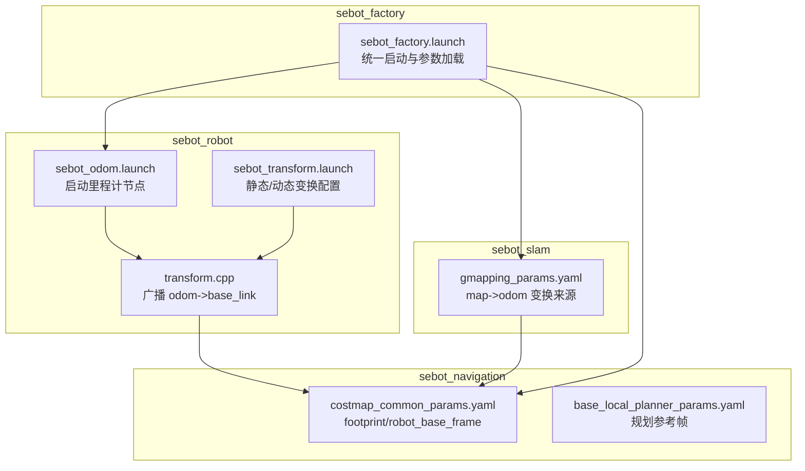
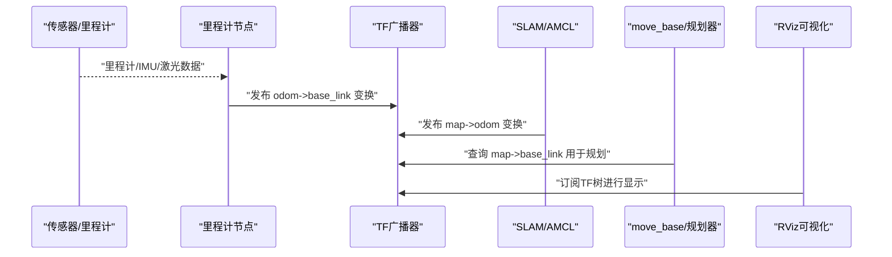
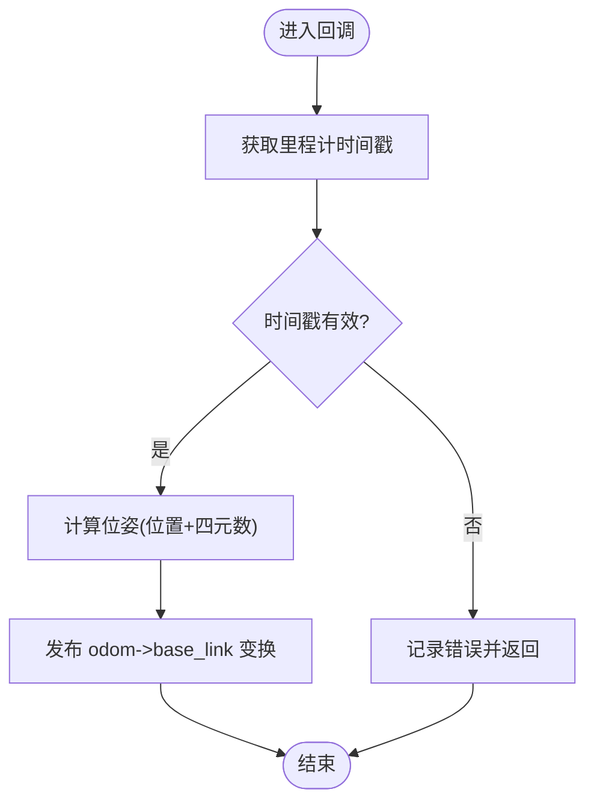
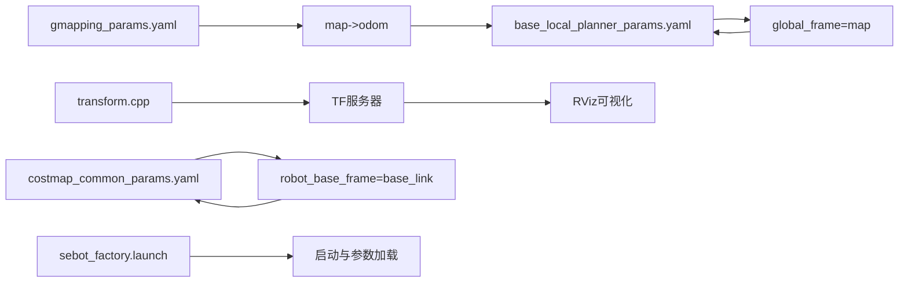

# TF坐标系问题诊断

<cite>
**本文引用的文件**
- [sebot_robot/launch/sebot_transform.launch](file://sebot_ros_kits/src/sebot_robot/launch/sebot_transform.launch)
- [sebot_robot/src/transform.cpp](file://sebot_ros_kits/src/sebot_robot/src/transform.cpp)
- [sebot_robot/launch/sebot_odom.launch](file://sebot_ros_kits/src/sebot_robot/launch/sebot_odom.launch)
- [sebot_navigation/param/base_local_planner_params.yaml](file://sebot_ros_kits/src/sebot_navigation/param/base_local_planner_params.yaml)
- [sebot_navigation/param/costmap_common_params.yaml](file://sebot_ros_kits/src/sebot_navigation/param/costmap_common_params.yaml)
- [sebot_slam/param/gmapping_params.yaml](file://sebot_ros_kits/src/sebot_slam/sebot_slam/param/gmapping_params.yaml)
- [sebot_factory/launch/sebot_factory.launch](file://sebot_factory/src/sebot_factory/launch/sebot_factory.launch)
- [sebot_robot/rviz/odom.rviz](file://sebot_ros_kits/src/sebot_robot/rviz/odom.rviz)
</cite>

## 目录
1. [简介](#简介)
2. [项目结构](#项目结构)
3. [核心组件](#核心组件)
4. [架构总览](#架构总览)
5. [详细组件分析](#详细组件分析)
6. [依赖关系分析](#依赖关系分析)
7. [性能考虑](#性能考虑)
8. [故障排查指南](#故障排查指南)
9. [结论](#结论)
10. [附录](#附录)

## 简介
本文件面向机器人竞赛系统中的TF坐标系变换问题，提供从树结构、命名规范、时间戳同步到常见问题的系统化诊断方法。文档覆盖常用坐标系（base_link、odom、map、laser等）的变换矩阵计算思路，给出tf_monitor与RViz可视化的使用要点，并提供配置模板、广播频率优化与内存优化的最佳实践。内容基于仓库中的驱动、导航、SLAM与工厂应用层集成方式总结而成。

## 项目结构
本项目由三个相互独立的catkin工作空间组成：
- sebot_factory：业务应用层（状态机、视觉、交互等）
- sebot_ros_kits：机器人套件（驱动、导航、SLAM、语音、视觉脚本等）
- sebot_ros_stdr：仿真环境（STDR仿真器与配套包）

在TF相关方面，关键实现集中在sebot_robot（里程计与坐标变换广播）、sebot_navigation（导航栈参数对坐标系的约定）、sebot_slam（建图与map帧发布）以及sebot_factory（启动与参数加载）。

图表来源
- [sebot_robot/src/transform.cpp](file://sebot_ros_kits/src/sebot_robot/src/transform.cpp)
- [sebot_robot/launch/sebot_odom.launch](file://sebot_ros_kits/src/sebot_robot/launch/sebot_odom.launch)
- [sebot_robot/launch/sebot_transform.launch](file://sebot_ros_kits/src/sebot_robot/launch/sebot_transform.launch)
- [sebot_slam/param/gmapping_params.yaml](file://sebot_ros_kits/src/sebot_slam/sebot_slam/param/gmapping_params.yaml)
- [sebot_navigation/param/costmap_common_params.yaml](file://sebot_ros_kits/src/sebot_navigation/param/costmap_common_params.yaml)
- [sebot_navigation/param/base_local_planner_params.yaml](file://sebot_ros_kits/src/sebot_navigation/param/base_local_planner_params.yaml)
- [sebot_factory/launch/sebot_factory.launch](file://sebot_factory/src/sebot_factory/launch/sebot_factory.launch)

章节来源
- [sebot_robot/launch/sebot_odom.launch](file://sebot_ros_kits/src/sebot_robot/launch/sebot_odom.launch)
- [sebot_robot/launch/sebot_transform.launch](file://sebot_ros_kits/src/sebot_robot/launch/sebot_transform.launch)
- [sebot_robot/src/transform.cpp](file://sebot_ros_kits/src/sebot_robot/src/transform.cpp)
- [sebot_slam/param/gmapping_params.yaml](file://sebot_ros_kits/src/sebot_slam/sebot_slam/param/gmapping_params.yaml)
- [sebot_navigation/param/costmap_common_params.yaml](file://sebot_ros_kits/src/sebot_navigation/param/costmap_common_params.yaml)
- [sebot_navigation/param/base_local_planner_params.yaml](file://sebot_ros_kits/src/sebot_navigation/param/base_local_planner_params.yaml)
- [sebot_factory/launch/sebot_factory.launch](file://sebot_factory/src/sebot_factory/launch/sebot_factory.launch)

## 核心组件
- 坐标变换广播器：负责将里程计信息转换为odom->base_link的TF并发布，确保时间戳与消息一致。
- 地图构建与定位：通过SLAM或AMCL建立map->odom或map->base_link的变换链，供导航栈使用。
- 导航参数约束：costmap与局部规划器需明确robot_base_frame、global_frame、odom_frame等，保证坐标系一致性。
- 启动与集成：factory.launch统一拉起各节点并加载参数，确保TF树完整可用。

章节来源
- [sebot_robot/src/transform.cpp](file://sebot_ros_kits/src/sebot_robot/src/transform.cpp)
- [sebot_slam/param/gmapping_params.yaml](file://sebot_ros_kits/src/sebot_slam/sebot_slam/param/gmapping_params.yaml)
- [sebot_navigation/param/costmap_common_params.yaml](file://sebot_ros_kits/src/sebot_navigation/param/costmap_common_params.yaml)
- [sebot_navigation/param/base_local_planner_params.yaml](file://sebot_ros_kits/src/sebot_navigation/param/base_local_planner_params.yaml)
- [sebot_factory/launch/sebot_factory.launch](file://sebot_factory/src/sebot_factory/launch/sebot_factory.launch)

## 架构总览
下图展示TF树在系统中的角色与数据流向：传感器与里程计产生odom->base_link；SLAM/AMCL产生map->odom；导航栈以map为全局参考，base_local_planner以odom为局部参考；激光雷达等传感器frame_id需与laser或camera等命名一致，便于可视化与配准。

图表来源
- [sebot_robot/src/transform.cpp](file://sebot_ros_kits/src/sebot_robot/src/transform.cpp)
- [sebot_slam/param/gmapping_params.yaml](file://sebot_ros_kits/src/sebot_slam/sebot_slam/param/gmapping_params.yaml)
- [sebot_navigation/param/costmap_common_params.yaml](file://sebot_ros_kits/src/sebot_navigation/param/costmap_common_params.yaml)
- [sebot_navigation/param/base_local_planner_params.yaml](file://sebot_ros_kits/src/sebot_navigation/param/base_local_planner_params.yaml)

## 详细组件分析

### 坐标变换广播器（odom->base_link）
- 职责：将里程计输出转换为TF，确保时间戳与里程计消息一致，避免插值失败。
- 关键点：
  - 使用ros::Time作为变换时间戳，来源于里程计消息header.stamp。
  - 四元数表示旋转，遵循ROS右手坐标系约定（X前、Y左、Z上）。
  - 广播频率应与里程计更新频率匹配，避免抖动与延迟。
- 常见问题：
  - 时间戳落后于当前时间导致无法查找变换。
  - 旋转方向错误（如左右镜像），检查欧拉角到四元数的转换顺序。
  - 广播频率过低导致下游节点频繁等待。

图表来源
- [sebot_robot/src/transform.cpp](file://sebot_ros_kits/src/sebot_robot/src/transform.cpp)

章节来源
- [sebot_robot/src/transform.cpp](file://sebot_ros_kits/src/sebot_robot/src/transform.cpp)

### 地图与定位（map->odom）
- 职责：SLAM（Gmapping/Hector）或AMCL维护map->odom变换，供全局定位与路径规划使用。
- 关键点：
  - gmapping_params.yaml中指定map_frame、odom_frame、base_frame等。
  - AMCL初始化时需设置初始位姿，确保map->odom正确。
  - 若使用EKF融合（robot_pose_ekf），需保证输入源（轮式里程计、IMU、激光）时间戳对齐。
- 常见问题：
  - map未发布或帧ID不一致导致导航失败。
  - 初始位姿设置错误导致定位漂移。
  - 多源融合时时间戳不同步造成跳变。

章节来源
- [sebot_slam/param/gmapping_params.yaml](file://sebot_ros_kits/src/sebot_slam/sebot_slam/param/gmapping_params.yaml)
- [sebot_navigation/param/costmap_common_params.yaml](file://sebot_ros_kits/src/sebot_navigation/param/costmap_common_params.yaml)
- [sebot_navigation/param/base_local_planner_params.yaml](file://sebot_ros_kits/src/sebot_navigation/param/base_local_planner_params.yaml)

### 导航参数与坐标系约定
- costmap_common_params.yaml：
  - robot_base_frame：通常为base_link，所有代价层以此为基础。
  - global_frame：通常为map，用于全局代价图。
  - odom_frame：通常为odom，用于局部代价图。
- base_local_planner_params.yaml：
  - 规划参考帧与轨迹生成需与odom一致，避免坐标系错乱。
- 常见问题：
  - robot_base_frame与实际TF不一致导致碰撞检测错误。
  - global_frame与map不一致导致全局规划失败。

章节来源
- [sebot_navigation/param/costmap_common_params.yaml](file://sebot_ros_kits/src/sebot_navigation/param/costmap_common_params.yaml)
- [sebot_navigation/param/base_local_planner_params.yaml](file://sebot_ros_kits/src/sebot_navigation/param/base_local_planner_params.yaml)

### 启动与集成（sebot_factory.launch）
- 职责：统一拉起各节点（里程计、SLAM、导航、视觉等），加载参数，切换仿真/真机模式。
- 关键点：
  - simulation参数控制STDR仿真模式。
  - debug参数控制图像识别界面开关。
  - 导航超时、PID、取件距离、补扫等参数集中管理。
- 常见问题：
  - launch中缺少必要的TF广播节点导致树不完整。
  - 参数加载顺序不当导致节点启动失败。

章节来源
- [sebot_factory/launch/sebot_factory.launch](file://sebot_factory/src/sebot_factory/launch/sebot_factory.launch)

## 依赖关系分析
- transform.cpp依赖里程计消息与TF库，发布odom->base_link。
- gmapping_params.yaml定义map->odom的来源与帧ID。
- costmap与规划器依赖一致的robot_base_frame与global_frame。
- factory.launch协调上述模块，确保TF树完整。

图表来源
- [sebot_robot/src/transform.cpp](file://sebot_ros_kits/src/sebot_robot/src/transform.cpp)
- [sebot_slam/param/gmapping_params.yaml](file://sebot_ros_kits/src/sebot_slam/sebot_slam/param/gmapping_params.yaml)
- [sebot_navigation/param/costmap_common_params.yaml](file://sebot_ros_kits/src/sebot_navigation/param/costmap_common_params.yaml)
- [sebot_navigation/param/base_local_planner_params.yaml](file://sebot_ros_kits/src/sebot_navigation/param/base_local_planner_params.yaml)
- [sebot_factory/launch/sebot_factory.launch](file://sebot_factory/src/sebot_factory/launch/sebot_factory.launch)

章节来源
- [sebot_robot/src/transform.cpp](file://sebot_ros_kits/src/sebot_robot/src/transform.cpp)
- [sebot_slam/param/gmapping_params.yaml](file://sebot_ros_kits/src/sebot_slam/sebot_slam/param/gmapping_params.yaml)
- [sebot_navigation/param/costmap_common_params.yaml](file://sebot_ros_kits/src/sebot_navigation/param/costmap_common_params.yaml)
- [sebot_navigation/param/base_local_planner_params.yaml](file://sebot_ros_kits/src/sebot_navigation/param/base_local_planner_params.yaml)
- [sebot_factory/launch/sebot_factory.launch](file://sebot_factory/src/sebot_factory/launch/sebot_factory.launch)

## 性能考虑
- 广播频率优化：
  - 将TF广播频率与里程计更新频率对齐，避免过高导致CPU占用或过低导致延迟。
  - 批量发布静态变换，减少动态广播开销。
- 内存使用优化：
  - 限制TF缓存长度，避免历史变换堆积。
  - 合理设置rviz显示阈值，减少渲染压力。
- 时间戳同步：
  - 确保所有传感器与里程计消息使用系统时钟，避免手动修改时间戳。
  - 使用ros::Time.now()仅在必要时，优先使用消息自带时间戳。

[本节为通用指导，不直接分析具体文件]

## 故障排查指南
- 坐标系丢失：
  - 使用tf_monitor检查缺失的变换链，确认odom->base_link与map->odom是否发布。
  - 检查launch是否包含必要的TF广播节点。
- 变换延迟：
  - 查看tf_monitor输出的延迟统计，定位慢节点。
  - 降低rviz刷新率，减少可视化负载。
- 旋转方向错误：
  - 检查四元数生成逻辑，确认欧拉角到四元数的转换顺序。
  - 在RViz中观察base_link姿态是否符合预期。
- 时间戳不同步：
  - 使用rostopic echo检查消息时间戳，确保与系统时间接近。
  - 避免在回调中执行耗时操作，影响时间戳更新。

章节来源
- [sebot_robot/rviz/odom.rviz](file://sebot_ros_kits/src/sebot_robot/rviz/odom.rviz)
- [sebot_robot/launch/sebot_odom.launch](file://sebot_ros_kits/src/sebot_robot/launch/sebot_odom.launch)
- [sebot_robot/launch/sebot_transform.launch](file://sebot_ros_kits/src/sebot_robot/launch/sebot_transform.launch)

## 结论
通过统一的TF树管理、严格的帧ID命名与时间戳同步、合理的广播频率与内存配置，可显著提升机器人系统的稳定性与可调试性。建议在生产环境中启用tf_monitor与RViz可视化，定期校验坐标系一致性，并结合日志与工具快速定位问题。

[本节为总结，不直接分析具体文件]

## 附录
- 常用坐标系关系与变换矩阵计算思路：
  - base_link到odom：由里程计积分得到平移与旋转四元数。
  - odom到map：由SLAM或AMCL估计，结合激光与里程计观测。
  - laser到base_link：静态变换，由URDF或launch中的静态TF发布。
- tf_monitor使用要点：
  - 监控特定帧对的延迟与频率，定位瓶颈。
  - 检查是否存在循环或断裂的变换链。
- RViz坐标系可视化：
  - 添加TF显示，选择正确的固定帧（通常为map或odom）。
  - 调整显示阈值与颜色，便于区分不同帧。
- 配置模板与最佳实践：
  - 在costmap_common_params.yaml中明确robot_base_frame与global_frame。
  - 在gmapping_params.yaml中统一map_frame与odom_frame。
  - 在factory.launch中集中管理参数，便于版本控制与部署。

[本节为概念性内容，不直接分析具体文件]