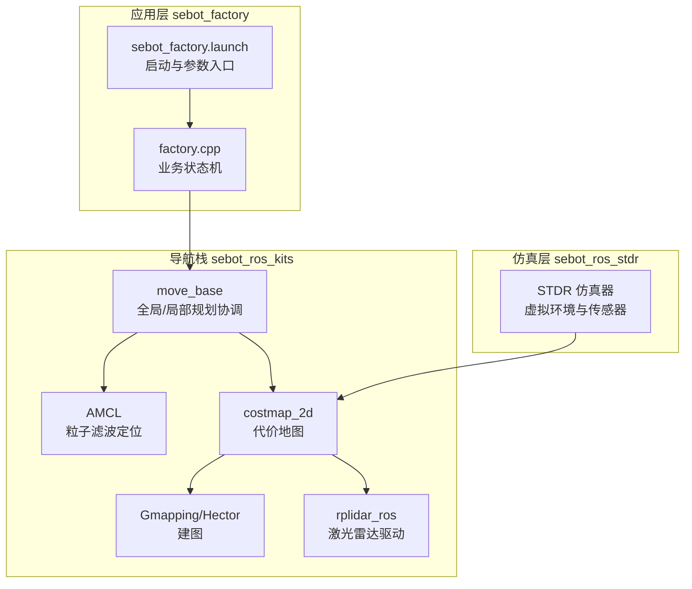
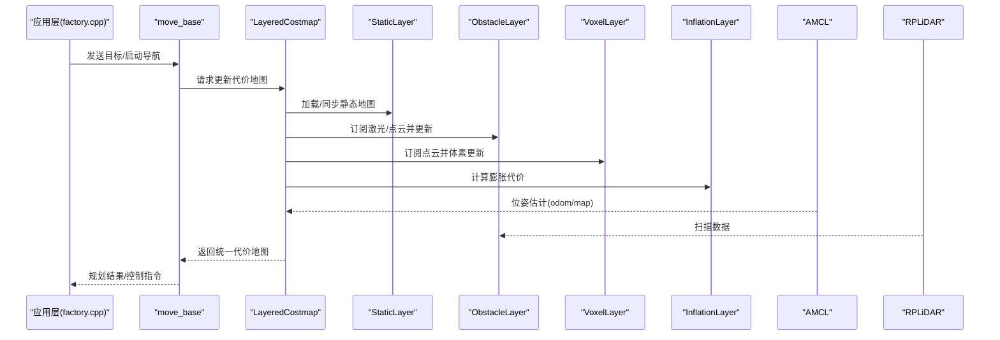
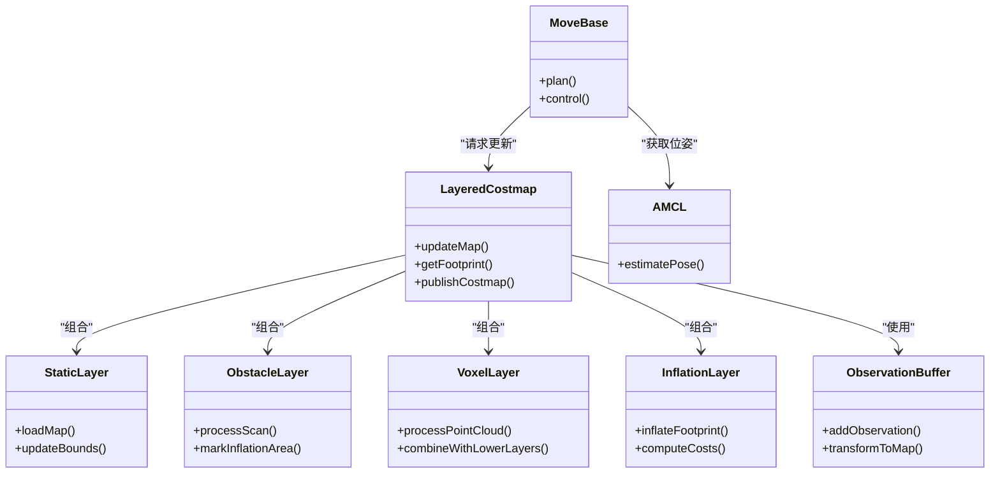

# 代价地图问题诊断

<cite>
**本文引用的文件**   
- [sebot_factory.launch](file://sebot_factory/src/sebot_factory/launch/sebot_factory.launch)
- [factory.cpp](file://sebot_factory/src/sebot_factory/src/factory.cpp)
- [costmap_2d_ros.h](file://sebot_ros_kits/src/sebot_navigation/costmap_2d/include/costmap_2d/costmap_2d_ros.h)
- [layered_costmap.h](file://sebot_ros_kits/src/sebot_navigation/costmap_2d/include/costmap_2d/layered_costmap.h)
- [static_layer.h](file://sebot_ros_kits/src/sebot_navigation/costmap_2d/include/costmap_2d/static_layer.h)
- [obstacle_layer.h](file://sebot_ros_kits/src/sebot_navigation/costmap_2d/include/costmap_2d/obstacle_layer.h)
- [inflation_layer.h](file://sebot_ros_kits/src/sebot_navigation/costmap_2d/include/costmap_2d/inflation_layer.h)
- [voxel_layer.h](file://sebot_ros_kits/src/sebot_navigation/costmap_2d/include/costmap_2d/voxel_layer.h)
- [example_params.yaml](file://sebot_ros_kits/src/sebot_navigation/costmap_2d/launch/example_params.yaml)
- [move_base.launch.xml](file://sebot_ros_kits/src/sebot_navigation/move_base/launch/move_base.launch.xml)
- [amcl_node.cpp](file://sebot_ros_kits/src/sebot_navigation/amcl/src/amcl_node.cpp)
- [gmapping 节点（slam_gmapping）](file://sebot_ros_kits/src/sebot_slam/slam_gmapping)
- [hector_mapping 节点（slam_hector）](file://sebot_ros_kits/src/sebot_slam/hector_slam/hector_mapping)
- [rplidar.launch](file://sebot_ros_kits/src/sebot_driver/rplidar_ros/launch/rplidar.launch)
</cite>

## 目录
1. [简介](#简介)
2. [项目结构](#项目结构)
3. [核心组件](#核心组件)
4. [架构总览](#架构总览)
5. [详细组件分析](#详细组件分析)
6. [依赖关系分析](#依赖关系分析)
7. [性能考量](#性能考量)
8. [故障排查指南](#故障排查指南)
9. [结论](#结论)
10. [附录：配置模板与调优建议](#附录配置模板与调优建议)

## 简介
本文件面向机器人竞赛系统中的代价地图（Costmap 2D）问题诊断，覆盖静态层、膨胀层、障碍层、体素层的配置要点与常见问题；解释代价地图更新机制、传感器数据融合策略、膨胀半径对导航的影响；提供地图加载失败、坐标变换错误、内存泄漏等问题的排查方法；并给出可视化调试、图层状态监控、性能优化技巧以及不同环境下的配置模板与参数调优指南。文档基于 sebot_factory（业务应用）、sebot_ros_kits（导航栈与驱动）、sebot_ros_stdr（仿真）三层工作空间组织进行说明。

## 项目结构
- sebot_factory：竞赛业务主流程与状态机，包含 launch 入口与关键业务节点源码。
- sebot_ros_kits：ROS 导航栈与驱动包集合，含 costmap_2d、move_base、AMCL、SLAM、RPLiDAR 等。
- sebot_ros_stdr：STDR 仿真器及其导航/定位示例与资源。

图表来源
- [sebot_factory.launch](file://sebot_factory/src/sebot_factory/launch/sebot_factory.launch)
- [factory.cpp](file://sebot_factory/src/sebot_factory/src/factory.cpp)
- [move_base.launch.xml](file://sebot_ros_kits/src/sebot_navigation/move_base/launch/move_base.launch.xml)
- [amcl_node.cpp](file://sebot_ros_kits/src/sebot_navigation/amcl/src/amcl_node.cpp)
- [rplidar.launch](file://sebot_ros_kits/src/sebot_driver/rplidar_ros/launch/rplidar.launch)

章节来源
- [sebot_factory.launch](file://sebot_factory/src/sebot_factory/launch/sebot_factory.launch)
- [factory.cpp](file://sebot_factory/src/sebot_factory/src/factory.cpp)
- [move_base.launch.xml](file://sebot_ros_kits/src/sebot_navigation/move_base/launch/move_base.launch.xml)

## 核心组件
- 代价地图（Layered Costmap）：由多个 Layer 组合而成，包括 Static、Obstacle、Inflation、Voxel 等，负责将多源信息融合为统一的代价栅格。
- 层接口与实现：
  - 静态层：加载先验地图（PGM/YAML），维护不可通行区域。
  - 障碍层：订阅激光/深度点云，按射线投射或体素化更新代价。
  - 膨胀层：根据机器人足迹与膨胀半径生成安全缓冲区。
  - 体素层：三维体素栅格，用于动态障碍物与高度信息。
- 运行时管理：LayeredCostmap 负责生命周期、更新调度、坐标系转换、观测缓冲与发布。

章节来源
- [costmap_2d_ros.h](file://sebot_ros_kits/src/sebot_navigation/costmap_2d/include/costmap_2d/costmap_2d_ros.h)
- [layered_costmap.h](file://sebot_ros_kits/src/sebot_navigation/costmap_2d/include/costmap_2d/layered_costmap.h)
- [static_layer.h](file://sebot_ros_kits/src/sebot_navigation/costmap_2d/include/costmap_2d/static_layer.h)
- [obstacle_layer.h](file://sebot_ros_kits/src/sebot_navigation/costmap_2d/include/costmap_2d/obstacle_layer.h)
- [inflation_layer.h](file://sebot_ros_kits/src/sebot_navigation/costmap_2d/include/costmap_2d/inflation_layer.h)
- [voxel_layer.h](file://sebot_ros_kits/src/sebot_navigation/costmap_2d/include/costmap_2d/voxel_layer.h)

## 架构总览
代价地图在 move_base 的规划周期中被周期性更新，AMCL 提供位姿估计，SLAM 提供先验地图，激光/点云通过观测缓冲进入障碍层/体素层，最终由膨胀层输出安全代价。

图表来源
- [move_base.launch.xml](file://sebot_ros_kits/src/sebot_navigation/move_base/launch/move_base.launch.xml)
- [costmap_2d_ros.h](file://sebot_ros_kits/src/sebot_navigation/costmap_2d/include/costmap_2d/costmap_2d_ros.h)
- [layered_costmap.h](file://sebot_ros_kits/src/sebot_navigation/costmap_2d/include/costmap_2d/layered_costmap.h)
- [amcl_node.cpp](file://sebot_ros_kits/src/sebot_navigation/amcl/src/amcl_node.cpp)
- [rplidar.launch](file://sebot_ros_kits/src/sebot_driver/rplidar_ros/launch/rplidar.launch)

## 详细组件分析

### 静态层（Static Layer）
- 职责：加载 PGM/YAML 地图，设置不可通行/自由区域，支持重加载与分辨率对齐。
- 关键参数：
  - map_topic / static_map_topic：地图话题
  - resolution / origin_x / origin_y：分辨率与原点
  - lethal_cost / non_traversable_is_fatal：致命代价与不可通行判定
  - track_unknown_space：是否跟踪未知区域
- 常见问题：
  - 地图加载失败：路径错误、文件格式不兼容、分辨率不一致
  - 坐标系不匹配：地图 frame_id 与 robot_base_frame 不一致导致无法投影
  - 内存占用过高：分辨率过低或地图尺寸过大
- 排查要点：
  - 检查 map_server 是否成功发布地图消息
  - 确认 tf 中 map→odom→base_link 链完整且无漂移
  - 使用 rqt_image_view 查看静态层图像

章节来源
- [static_layer.h](file://sebot_ros_kits/src/sebot_navigation/costmap_2d/include/costmap_2d/static_layer.h)
- [example_params.yaml](file://sebot_ros_kits/src/sebot_navigation/costmap_2d/launch/example_params.yaml)

### 障碍层（Obstacle Layer）
- 职责：接收激光/点云，按射线投射或体素化方式更新代价，支持最小/最大探测距离、清除半径、滚动窗口等。
- 关键参数：
  - observation_sources：指定激光/点云源
  - min_obstacle_height / max_obstacle_height：高度过滤
  - obstacle_range / raytrace_range：探测与射线清理范围
  - clearing / marking：是否允许清除与标记
  - inflation_radius / track_unknown_space：与膨胀层协作与未知区处理
- 常见问题：
  - 噪声过多：阈值过低导致误报
  - 漏检：最大探测距离过小或高度过滤过严
  - 刷新不及时：update_min_x/min_y/max_x/max_y 设置不当
- 排查要点：
  - 观察 laser_scan 与 point_cloud 话题是否正常
  - 检查 sensor_frame 与 base_link 的 tf 是否正确
  - 调整 clearing 与 marking 开关验证行为

章节来源
- [obstacle_layer.h](file://sebot_ros_kits/src/sebot_navigation/costmap_2d/include/costmap_2d/obstacle_layer.h)
- [example_params.yaml](file://sebot_ros_kits/src/sebot_navigation/costmap_2d/launch/example_params.yaml)

### 膨胀层（Inflation Layer）
- 职责：基于机器人足迹与膨胀半径生成安全代价，避免碰撞并引导路径平滑。
- 关键参数：
  - inflation_radius：膨胀半径（影响安全裕度）
  - cost_scaling_factor：代价衰减系数（越大衰减越快）
  - footprint / footprint_padding：机器人外形与安全边距
  - publish_scale：发布缩放比例
- 常见问题：
  - 膨胀过度：路径绕行严重或无法通过窄道
  - 膨胀不足：贴壁行驶风险高
  - 足迹定义错误：与实际机器人几何不符
- 排查要点：
  - 使用 RViz 的 Costmap 显示观察膨胀效果
  - 对比 footprint 与 URDF 模型一致性
  - 调节 cost_scaling_factor 平衡速度与安全性

章节来源
- [inflation_layer.h](file://sebot_ros_kits/src/sebot_navigation/costmap_2d/include/costmap_2d/inflation_layer.h)
- [example_params.yaml](file://sebot_ros_kits/src/sebot_navigation/costmap_2d/launch/example_params.yaml)

### 体素层（Voxel Layer）
- 职责：三维体素栅格存储高度信息，适合复杂场景的动态障碍物与台阶检测。
- 关键参数：
  - voxel_size / z_resolution / z_layers：体素尺寸与层数
  - max_z / min_z：高度范围
  - combination_method：与下层代价的组合策略
  - observation_sources：点云源配置
- 常见问题：
  - 内存爆炸：体素尺寸过小或 z_layers 过多
  - 更新缓慢：点云频率过高或分辨率过高
  - 高度误判：点云噪声或未校准
- 排查要点：
  - 监控内存与 CPU 占用
  - 降低 voxel_size 或减少 z_layers
  - 预处理点云（去噪/滤波）

章节来源
- [voxel_layer.h](file://sebot_ros_kits/src/sebot_navigation/costmap_2d/include/costmap_2d/voxel_layer.h)
- [example_params.yaml](file://sebot_ros_kits/src/sebot_navigation/costmap_2d/launch/example_params.yaml)

### 代价地图更新机制与传感器融合
- 更新周期：LayeredCostmap 在固定频率下调用各层 update()，合并代价并对外发布。
- 观测缓冲：ObservationBuffer 缓存激光/点云，按时间戳与 tf 转换到地图坐标系。
- 融合策略：
  - 静态层优先（不可通行）
  - 障碍层/体素层叠加动态信息
  - 膨胀层最后生成安全代价
- 坐标系：map→odom→base_link→sensor_frame 必须正确广播，否则投影失败。

```mermaid
flowchart TD
Start(["开始"]) --> CheckTF["检查tf链(map/odom/base/sensor)"]
CheckTF --> TFOK{"tf有效?"}
TFOK -- 否 --> FixTF["修复tf/时间同步"]
TFOK -- 是 --> LoadStatic["加载静态层地图"]
LoadStatic --> ObstacleUpdate["障碍层/体素层更新"]
ObstacleUpdate --> Inflation["膨胀层计算"]
Inflation --> Merge["合并代价并发布"]
Merge --> End(["结束"])
FixTF --> End
```

图表来源
- [layered_costmap.h](file://sebot_ros_kits/src/sebot_navigation/costmap_2d/include/costmap_2d/layered_costmap.h)
- [costmap_2d_ros.h](file://sebot_ros_kits/src/sebot_navigation/costmap_2d/include/costmap_2d/costmap_2d_ros.h)

章节来源
- [layered_costmap.h](file://sebot_ros_kits/src/sebot_navigation/costmap_2d/include/costmap_2d/layered_costmap.h)
- [costmap_2d_ros.h](file://sebot_ros_kits/src/sebot_navigation/costmap_2d/include/costmap_2d/costmap_2d_ros.h)

## 依赖关系分析
- move_base 依赖 costmap_2d 提供代价地图，依赖 AMCL 提供位姿，依赖 SLAM 提供先验地图。
- costmap_2d 依赖 tf 进行坐标变换，依赖 observation_buffer 管理观测数据。
- 应用层 factory.cpp 通过 move_base 发起导航任务，间接依赖代价地图。

图表来源
- [move_base.launch.xml](file://sebot_ros_kits/src/sebot_navigation/move_base/launch/move_base.launch.xml)
- [layered_costmap.h](file://sebot_ros_kits/src/sebot_navigation/costmap_2d/include/costmap_2d/layered_costmap.h)
- [costmap_2d_ros.h](file://sebot_ros_kits/src/sebot_navigation/costmap_2d/include/costmap_2d/costmap_2d_ros.h)

章节来源
- [move_base.launch.xml](file://sebot_ros_kits/src/sebot_navigation/move_base/launch/move_base.launch.xml)
- [layered_costmap.h](file://sebot_ros_kits/src/sebot_navigation/costmap_2d/include/costmap_2d/layered_costmap.h)

## 性能考量
- 分辨率与尺寸：提高分辨率会显著增加内存与计算量，需权衡精度与实时性。
- 更新频率：代价地图更新频率过高会导致 CPU 压力，合理设置 global/local planner 的循环周期。
- 观测源频率：激光/点云频率过高时，可降采样或限制更新范围。
- 体素层开销：z_layers 与 voxel_size 直接影响内存与速度，建议按需开启。
- 膨胀层参数：cost_scaling_factor 较大可减少计算但可能牺牲安全性。

[本节为通用指导，无需特定文件引用]

## 故障排查指南

### 地图加载失败
- 症状：静态层未更新、RViz 无地图显示、move_base 报错。
- 排查步骤：
  - 检查 map_server 是否成功发布 map 话题
  - 确认 PGM/YAML 格式与分辨率一致
  - 核对 map frame_id 与 costmap 的 robot_base_frame
  - 查看日志中的加载错误码与路径
- 参考文件
  - [example_params.yaml](file://sebot_ros_kits/src/sebot_navigation/costmap_2d/launch/example_params.yaml)
  - [static_layer.h](file://sebot_ros_kits/src/sebot_navigation/costmap_2d/include/costmap_2d/static_layer.h)

章节来源
- [example_params.yaml](file://sebot_ros_kits/src/sebot_navigation/costmap_2d/launch/example_params.yaml)
- [static_layer.h](file://sebot_ros_kits/src/sebot_navigation/costmap_2d/include/costmap_2d/static_layer.h)

### 坐标变换错误
- 症状：障碍层无更新、代价地图空白或错位、定位漂移。
- 排查步骤：
  - 使用 rosrun tf view_frames 检查 map→odom→base_link→sensor 链
  - 确保所有帧的时间戳同步，避免时钟漂移
  - 检查传感器标定与 URDF 一致
- 参考文件
  - [amcl_node.cpp](file://sebot_ros_kits/src/sebot_navigation/amcl/src/amcl_node.cpp)
  - [rplidar.launch](file://sebot_ros_kits/src/sebot_driver/rplidar_ros/launch/rplidar.launch)

章节来源
- [amcl_node.cpp](file://sebot_ros_kits/src/sebot_navigation/amcl/src/amcl_node.cpp)
- [rplidar.launch](file://sebot_ros_kits/src/sebot_driver/rplidar_ros/launch/rplidar.launch)

### 内存泄漏与高占用
- 症状：运行一段时间后内存持续增长、系统卡顿。
- 排查步骤：
  - 使用 valgrind/rostest 定位泄漏点
  - 检查体素层 z_layers 与 voxel_size 是否过大
  - 关闭不必要的观测源或降低频率
- 参考文件
  - [voxel_layer.h](file://sebot_ros_kits/src/sebot_navigation/costmap_2d/include/costmap_2d/voxel_layer.h)
  - [layered_costmap.h](file://sebot_ros_kits/src/sebot_navigation/costmap_2d/include/costmap_2d/layered_costmap.h)

章节来源
- [voxel_layer.h](file://sebot_ros_kits/src/sebot_navigation/costmap_2d/include/costmap_2d/voxel_layer.h)
- [layered_costmap.h](file://sebot_ros_kits/src/sebot_navigation/costmap_2d/include/costmap_2d/layered_costmap.h)

### 导航不稳定或频繁停滞
- 症状：机器人在狭窄通道反复停止或绕远路。
- 排查步骤：
  - 调整膨胀半径与 cost_scaling_factor
  - 检查 footprint 是否与机器人实际尺寸一致
  - 观察障碍层是否误报（噪声/反射）
- 参考文件
  - [inflation_layer.h](file://sebot_ros_kits/src/sebot_navigation/costmap_2d/include/costmap_2d/inflation_layer.h)
  - [obstacle_layer.h](file://sebot_ros_kits/src/sebot_navigation/costmap_2d/include/costmap_2d/obstacle_layer.h)

章节来源
- [inflation_layer.h](file://sebot_ros_kits/src/sebot_navigation/costmap_2d/include/costmap_2d/inflation_layer.h)
- [obstacle_layer.h](file://sebot_ros_kits/src/sebot_navigation/costmap_2d/include/costmap_2d/obstacle_layer.h)

## 结论
代价地图是导航系统的核心，其稳定性与准确性直接决定机器人的导航表现。通过合理配置静态层、障碍层、膨胀层与体素层，并确保坐标变换与传感器数据质量，可实现高效可靠的代价地图更新。结合可视化调试与性能监控，能够快速定位并解决常见问题。针对不同环境，应选择合适的分辨率、更新频率与膨胀策略，以平衡精度、实时性与安全性。

[本节为总结，无需特定文件引用]

## 附录：配置模板与调优建议

### 室内走廊（窄道）
- 分辨率：0.05m
- 膨胀半径：0.3–0.5m
- cost_scaling_factor：10–20
- 障碍层：min_obstacle_height=0.1，max_obstacle_height=1.5
- 体素层：关闭或仅启用必要高度范围

### 开放大厅（宽场）
- 分辨率：0.1m
- 膨胀半径：0.2–0.4m
- cost_scaling_factor：5–10
- 障碍层：增大 obstacle_range，提高 raytrace_range
- 体素层：可选，用于检测低矮障碍物

### 室外非结构化环境
- 分辨率：0.1–0.2m
- 膨胀半径：0.4–0.6m
- 障碍层：加强高度过滤与噪声抑制
- 体素层：启用 z_layers≥3，关注内存占用

### 参数调优清单
- 静态层：确认 map 分辨率与 origin，track_unknown_space 按需开启
- 障碍层：observation_sources、clearing/mark 开关、高度过滤
- 膨胀层：footprint、inflation_radius、cost_scaling_factor
- 体素层：voxel_size、z_resolution、z_layers、combination_method
- 坐标系：map→odom→base_link→sensor 链完整性与时钟同步
- 性能：更新频率、观测源频率、分辨率与尺寸折衷

章节来源
- [example_params.yaml](file://sebot_ros_kits/src/sebot_navigation/costmap_2d/launch/example_params.yaml)
- [costmap_2d_ros.h](file://sebot_ros_kits/src/sebot_navigation/costmap_2d/include/costmap_2d/costmap_2d_ros.h)
- [layered_costmap.h](file://sebot_ros_kits/src/sebot_navigation/costmap_2d/include/costmap_2d/layered_costmap.h)