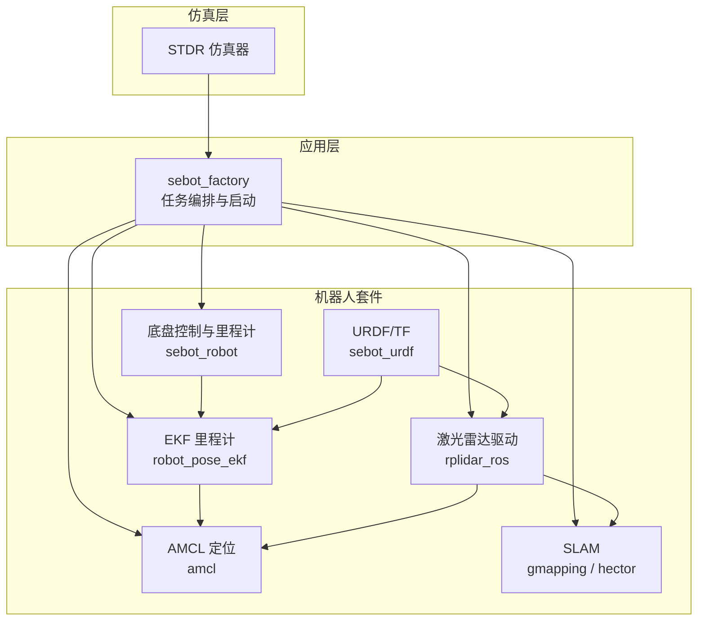
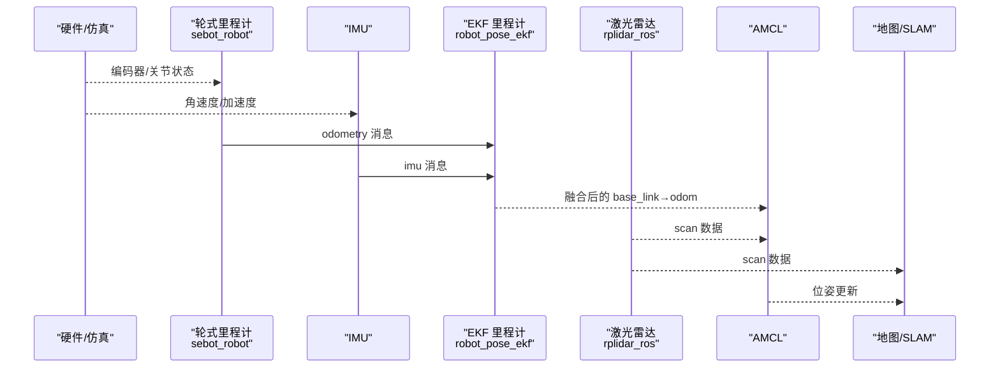
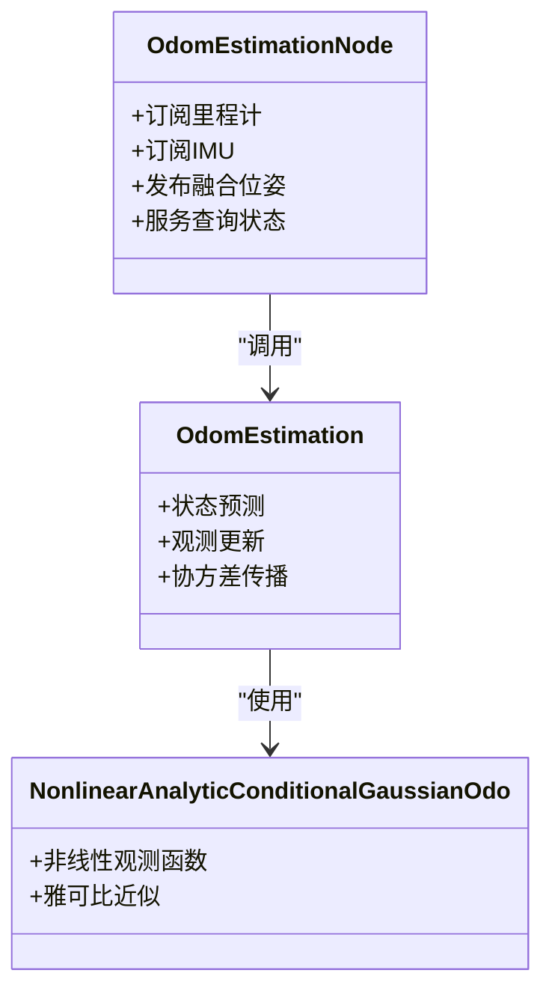
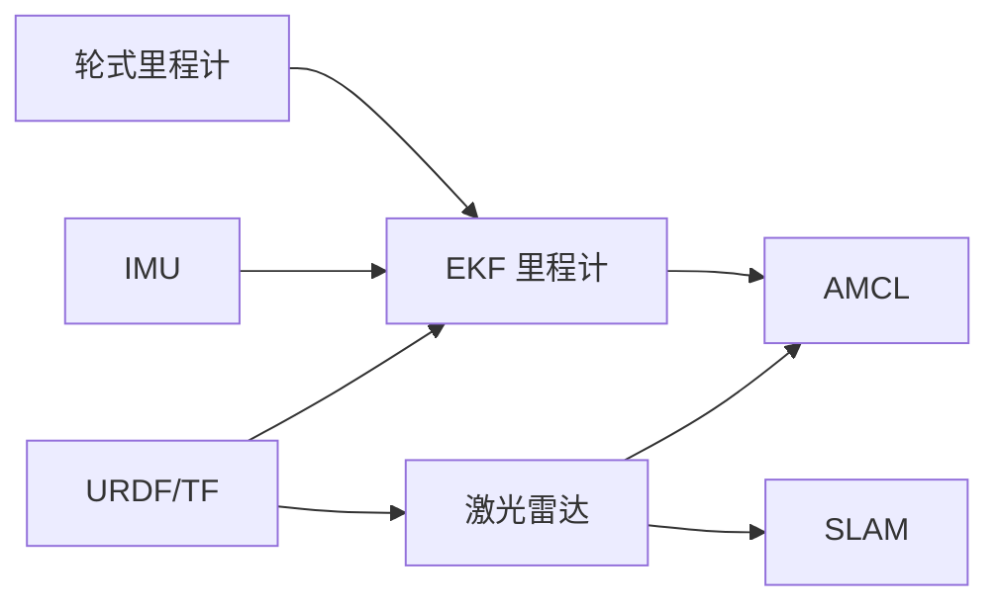

# 传感器融合问题诊断

<cite>
**本文引用的文件**   
- [sebot_factory.launch](file://sebot_factory/src/sebot_factory/launch/sebot_factory.launch)
- [robot_pose_ekf.launch](file://sebot_ros_kits/src/sebot_driver/robot_pose_ekf/launch/robot_pose_ekf.launch)
- [odom_estimation_node.cpp](file://sebot_ros_kits/src/sebot_driver/robot_pose_ekf/src/odom_estimation_node.cpp)
- [odom_estimation.cpp](file://sebot_ros_kits/src/sebot_driver/robot_pose_ekf/src/odom_estimation.cpp)
- [nonlinearanalyticconditionalgaussianodo.h](file://sebot_ros_kits/src/sebot_driver/robot_pose_ekf/include/robot_pose_ekf/nonlinearanalyticconditionalgaussianodo.h)
- [rplidar.launch](file://sebot_ros_kits/src/sebot_driver/rplidar_ros/launch/rplidar.launch)
- [node.cpp](file://sebot_ros_kits/src/sebot_driver/rplidar_ros/src/node.cpp)
- [sebot_odom.launch](file://sebot_ros_kits/src/sebot_robot/launch/sebot_odom.launch)
- [controller.cpp](file://sebot_ros_kits/src/sebot_robot/src/controller.cpp)
- [amcl_node.cpp](file://sebot_ros_kits/src/sebot_navigation/amcl/src/amcl_node.cpp)
- [gmapping_node.cpp](file://sebot_ros_kits/src/sebot_slam/slam_gmapping/slam_gmapping/gmapping_node.cpp)
- [hector_mapping_node.cpp](file://sebot_ros_kits/src/sebot_slam/slam_hector/hector_mapping/src/hector_mapping_node.cpp)
- [sebot_urdf.yaml](file://sebot_ros_kits/src/sebot_urdf/config/sebot_urdf.yaml)
- [sebot_urdf.urdf](file://sebot_ros_kits/src/sebot_urdf/urdf/sebot_urdf.urdf)
</cite>

## 目录
1. [简介](#简介)
2. [项目结构](#项目结构)
3. [核心组件](#核心组件)
4. [架构总览](#架构总览)
5. [详细组件分析](#详细组件分析)
6. [依赖关系分析](#依赖关系分析)
7. [性能与稳定性考量](#性能与稳定性考量)
8. [故障排查指南](#故障排查指南)
9. [结论](#结论)
10. [附录：参数与配置清单](#附录参数与配置清单)

## 简介
本文件面向机器人竞赛系统，聚焦传感器融合中的关键问题与诊断方法。围绕 EKF 姿态估计、轮式里程计、IMU、激光雷达等数据源，说明融合原理、配置要点、时间同步与坐标系转换的重要性，并给出异常检测、噪声抑制、丢包处理、健康检查、质量评估与故障切换的实践方案。同时提供调试工具使用、数据记录分析与融合参数优化的操作指引，帮助快速定位与修复传感器相关问题，提升导航与建图的鲁棒性。

## 项目结构
本项目由三个相互独立的 catkin 工作空间组成：
- sebot_factory（应用层）：业务状态机与任务编排，启动入口集中管理仿真/实机模式与调试开关。
- sebot_ros_kits（机器人套件）：驱动与中间件集成，包含 EKF 里程计、RPLidar、URDF、AMCL、SLAM 等。
- sebot_ros_stdr（仿真层）：STDR 仿真器与配套导航/建图 launch。

传感器融合相关的关键位置：
- EKF 里程计节点与 launch：robot_pose_ekf
- 激光雷达驱动与 launch：rplidar_ros
- 底盘控制器与里程计发布：sebot_robot
- AMCL 定位与 SLAM：amcl、slam_gmapping、slam_hector
- 机器人 URDF 与坐标变换：sebot_urdf

图表来源
- [sebot_factory.launch](file://sebot_factory/src/sebot_factory/launch/sebot_factory.launch)
- [robot_pose_ekf.launch](file://sebot_ros_kits/src/sebot_driver/robot_pose_ekf/launch/robot_pose_ekf.launch)
- [rplidar.launch](file://sebot_ros_kits/src/sebot_driver/rplidar_ros/launch/rplidar.launch)
- [sebot_odom.launch](file://sebot_ros_kits/src/sebot_robot/launch/sebot_odom.launch)
- [amcl_node.cpp](file://sebot_ros_kits/src/sebot_navigation/amcl/src/amcl_node.cpp)
- [gmapping_node.cpp](file://sebot_ros_kits/src/sebot_slam/slam_gmapping/slam_gmapping/gmapping_node.cpp)
- [hector_mapping_node.cpp](file://sebot_ros_kits/src/sebot_slam/slam_hector/hector_mapping/src/hector_mapping_node.cpp)
- [sebot_urdf.yaml](file://sebot_ros_kits/src/sebot_urdf/config/sebot_urdf.yaml)
- [sebot_urdf.urdf](file://sebot_ros_kits/src/sebot_urdf/urdf/sebot_urdf.urdf)

章节来源
- [sebot_factory.launch](file://sebot_factory/src/sebot_factory/launch/sebot_factory.launch)
- [robot_pose_ekf.launch](file://sebot_ros_kits/src/sebot_driver/robot_pose_ekf/launch/robot_pose_ekf.launch)
- [rplidar.launch](file://sebot_ros_kits/src/sebot_driver/rplidar_ros/launch/rplidar.launch)
- [sebot_odom.launch](file://sebot_ros_kits/src/sebot_robot/launch/sebot_odom.launch)

## 核心组件
- EKF 里程计（robot_pose_ekf）：将 IMU、轮式里程计、可选外部位姿观测进行协方差加权融合，输出稳定的 base_link→odom 变换。
- 轮式里程计（sebot_robot）：由编码器或关节状态计算线速度/角速度并发布 odom 消息。
- IMU：提供加速度与角速度，用于航向与姿态约束，改善漂移。
- 激光雷达（rplidar_ros）：提供扫描数据，供 AMCL 与 SLAM 使用，间接约束位姿。
- AMCL 与 SLAM：基于粒子滤波或栅格地图更新位姿/地图，对融合结果形成闭环反馈。
- URDF/TF：定义各传感器相对基座的安装位姿，保证坐标变换正确。

章节来源
- [odom_estimation_node.cpp](file://sebot_ros_kits/src/sebot_driver/robot_pose_ekf/src/odom_estimation_node.cpp)
- [odom_estimation.cpp](file://sebot_ros_kits/src/sebot_driver/robot_pose_ekf/src/odom_estimation.cpp)
- [nonlinearanalyticconditionalgaussianodo.h](file://sebot_ros_kits/src/sebot_driver/robot_pose_ekf/include/robot_pose_ekf/nonlinearanalyticconditionalgaussianodo.h)
- [controller.cpp](file://sebot_ros_kits/src/sebot_robot/src/controller.cpp)
- [node.cpp](file://sebot_ros_kits/src/sebot_driver/rplidar_ros/src/node.cpp)
- [amcl_node.cpp](file://sebot_ros_kits/src/sebot_navigation/amcl/src/amcl_node.cpp)
- [gmapping_node.cpp](file://sebot_ros_kits/src/sebot_slam/slam_gmapping/slam_gmapping/gmapping_node.cpp)
- [hector_mapping_node.cpp](file://sebot_ros_kits/src/sebot_slam/slam_hector/hector_mapping/src/hector_mapping_node.cpp)
- [sebot_urdf.urdf](file://sebot_ros_kits/src/sebot_urdf/urdf/sebot_urdf.urdf)

## 架构总览
下图展示传感器到融合与定位的端到端数据流与依赖关系。

图表来源
- [controller.cpp](file://sebot_ros_kits/src/sebot_robot/src/controller.cpp)
- [odom_estimation_node.cpp](file://sebot_ros_kits/src/sebot_driver/robot_pose_ekf/src/odom_estimation_node.cpp)
- [node.cpp](file://sebot_ros_kits/src/sebot_driver/rplidar_ros/src/node.cpp)
- [amcl_node.cpp](file://sebot_ros_kits/src/sebot_navigation/amcl/src/amcl_node.cpp)

## 详细组件分析

### EKF 姿态估计（robot_pose_ekf）
- 输入：轮式里程计、IMU、可选外部位姿观测（如视觉/RTK）。
- 输出：base_link→odom 的位姿与协方差。
- 关键点：
  - 协方差矩阵初始化直接影响权重分配；过大导致响应迟钝，过小易发散。
  - 观测更新顺序与可用性门限决定融合稳定性。
  - 非线性观测模型需满足可观测性与数值稳定条件。

图表来源
- [odom_estimation_node.cpp](file://sebot_ros_kits/src/sebot_driver/robot_pose_ekf/src/odom_estimation_node.cpp)
- [odom_estimation.cpp](file://sebot_ros_kits/src/sebot_driver/robot_pose_ekf/src/odom_estimation.cpp)
- [nonlinearanalyticconditionalgaussianodo.h](file://sebot_ros_kits/src/sebot_driver/robot_pose_ekf/include/robot_pose_ekf/nonlinearanalyticconditionalgaussianodo.h)

章节来源
- [odom_estimation_node.cpp](file://sebot_ros_kits/src/sebot_driver/robot_pose_ekf/src/odom_estimation_node.cpp)
- [odom_estimation.cpp](file://sebot_ros_kits/src/sebot_driver/robot_pose_ekf/src/odom_estimation.cpp)
- [nonlinearanalyticconditionalgaussianodo.h](file://sebot_ros_kits/src/sebot_driver/robot_pose_ekf/include/robot_pose_ekf/nonlinearanalyticconditionalgaussianodo.h)

### 轮式里程计（sebot_robot）
- 数据来源：编码器或关节状态，经运动学模型转换为线/角速度。
- 常见问题：
  - 零偏与量化误差导致低速漂移。
  - 打滑时速度估计失真。
- 建议：
  - 合理设置死区与低通滤波。
  - 结合 IMU 修正航向漂移。

章节来源
- [controller.cpp](file://sebot_ros_kits/src/sebot_robot/src/controller.cpp)
- [sebot_odom.launch](file://sebot_ros_kits/src/sebot_robot/launch/sebot_odom.launch)

### IMU 数据
- 作用：提供角速度与加速度，辅助航向与姿态约束。
- 校准要点：
  - 零偏标定、尺度因子校正、轴对齐。
  - 采样频率与延迟一致性。
- 异常处理：
  - 超限阈值告警、短时丢包插值、长时间失效降级。

章节来源
- [robot_pose_ekf.launch](file://sebot_ros_kits/src/sebot_driver/robot_pose_ekf/launch/robot_pose_ekf.launch)

### 激光雷达（rplidar_ros）
- 作用：为 AMCL/SLAM 提供环境观测，间接约束位姿。
- 配置要点：
  - 帧率、分辨率、最大距离、角度范围。
  - 坐标系命名与 TF 树一致。
- 异常处理：
  - 丢包重传、超时剔除、点云去噪。

章节来源
- [rplidar.launch](file://sebot_ros_kits/src/sebot_driver/rplidar_ros/launch/rplidar.launch)
- [node.cpp](file://sebot_ros_kits/src/sebot_driver/rplidar_ros/src/node.cpp)

### AMCL 与 SLAM
- AMCL：基于粒子滤波，利用激光扫描与地图匹配更新位姿，对 EKF 输出形成闭环约束。
- SLAM：gmapping/hector 在线建图，要求稳定的里程计与一致的 TF。
- 关键参数：
  - 粒子数、重采样阈值、scan 匹配容差、地图分辨率。

章节来源
- [amcl_node.cpp](file://sebot_ros_kits/src/sebot_navigation/amcl/src/amcl_node.cpp)
- [gmapping_node.cpp](file://sebot_ros_kits/src/sebot_slam/slam_gmapping/slam_gmapping/gmapping_node.cpp)
- [hector_mapping_node.cpp](file://sebot_ros_kits/src/sebot_slam/slam_hector/hector_mapping/src/hector_mapping_node.cpp)

### 坐标系与 URDF
- 所有传感器在 URDF 中声明相对于 base_link 的安装位姿，确保 TF 正确。
- 常见错误：
  - 坐标系命名不一致、单位不统一（米/度）、旋转顺序错误。
- 建议：
  - 使用 urdf_tool 校验，rviz 可视化 TF 树。

章节来源
- [sebot_urdf.urdf](file://sebot_ros_kits/src/sebot_urdf/urdf/sebot_urdf.urdf)
- [sebot_urdf.yaml](file://sebot_ros_kits/src/sebot_urdf/config/sebot_urdf.yaml)

## 依赖关系分析
传感器到融合的定位链路依赖如下：
- 轮式里程计与 IMU 是 EKF 的直接输入。
- EKF 输出被 AMCL 与 SLAM 消费。
- 激光雷达为 AMCL/SLAM 提供观测。
- URDF/TF 贯穿全链路，任何一处错误都会导致全局错位。

图表来源
- [controller.cpp](file://sebot_ros_kits/src/sebot_robot/src/controller.cpp)
- [odom_estimation_node.cpp](file://sebot_ros_kits/src/sebot_driver/robot_pose_ekf/src/odom_estimation_node.cpp)
- [node.cpp](file://sebot_ros_kits/src/sebot_driver/rplidar_ros/src/node.cpp)
- [amcl_node.cpp](file://sebot_ros_kits/src/sebot_navigation/amcl/src/amcl_node.cpp)
- [gmapping_node.cpp](file://sebot_ros_kits/src/sebot_slam/slam_gmapping/slam_gmapping/gmapping_node.cpp)
- [hector_mapping_node.cpp](file://sebot_ros_kits/src/sebot_slam/slam_hector/hector_mapping/src/hector_mapping_node.cpp)
- [sebot_urdf.urdf](file://sebot_ros_kits/src/sebot_urdf/urdf/sebot_urdf.urdf)

章节来源
- [sebot_odom.launch](file://sebot_ros_kits/src/sebot_robot/launch/sebot_odom.launch)
- [robot_pose_ekf.launch](file://sebot_ros_kits/src/sebot_driver/robot_pose_ekf/launch/robot_pose_ekf.launch)
- [rplidar.launch](file://sebot_ros_kits/src/sebot_driver/rplidar_ros/launch/rplidar.launch)

## 性能与稳定性考量
- 时间同步
  - 确保各传感器时间戳来自同一时钟源，避免跨进程漂移。
  - 使用 ROS time sync 机制，必要时做软同步补偿。
- 坐标系一致性
  - 严格遵循 base_link→odom→map 的层级，避免环路与重复变换。
- 协方差与噪声建模
  - 根据实测统计调整 EKF 协方差与观测噪声，避免过拟合或欠拟合。
- 资源占用
  - 降低不必要的高频发布，合理设置滤波器与降采样。
- 鲁棒性
  - 多源冗余设计，单源失效时自动降级运行。

[本节为通用指导，无需特定文件引用]

## 故障排查指南

### 常见问题与处理方法
- 传感器数据异常
  - 现象：跳变、负值、饱和。
  - 处理：阈值门限、平滑滤波、异常帧丢弃。
- 噪声过大
  - 现象：位姿抖动、轨迹发散。
  - 处理：增大观测协方差、增加低通滤波、优化安装刚性。
- 丢包严重
  - 现象：位姿停滞、地图撕裂。
  - 处理：重传策略、插值保持、超时告警与降级。
- 时间不同步
  - 现象：融合滞后、匹配失败。
  - 处理：统一时钟、启用时间同步、检查网络延迟。
- 坐标系错误
  - 现象：TF 树错乱、rviz 显示异常。
  - 处理：核对 URDF、检查命名与单位、可视化验证。

### 传感器健康检查与数据质量评估
- 健康检查
  - 心跳/连接状态监控、丢包率统计、帧率监测。
- 质量评估
  - 协方差增长趋势、观测残差分布、匹配得分（AMCL/SLAM）。
- 故障切换机制
  - 主从源切换、降级模式（仅 IMU 或仅里程计）、安全停车。

### 调试工具与数据记录
- 工具
  - rosbag 录制、rqt_plot 曲线观察、rviz 可视化 TF/位姿/扫描。
- 分析
  - 回放 bag 对比不同参数效果，定位参数敏感点。
- 优化流程
  - 先稳 IMU 与里程计，再调 EKF 协方差，最后微调 AMCL/SLAM 参数。

章节来源
- [sebot_factory.launch](file://sebot_factory/src/sebot_factory/launch/sebot_factory.launch)
- [robot_pose_ekf.launch](file://sebot_ros_kits/src/sebot_driver/robot_pose_ekf/launch/robot_pose_ekf.launch)
- [rplidar.launch](file://sebot_ros_kits/src/sebot_driver/rplidar_ros/launch/rplidar.launch)
- [sebot_odom.launch](file://sebot_ros_kits/src/sebot_robot/launch/sebot_odom.launch)

## 结论
传感器融合是机器人导航与建图的核心。通过合理的 EKF 配置、严格的坐标与时序管理、完善的异常检测与降级策略，可以显著提升系统在复杂环境下的鲁棒性。建议以“先稳基础、后调细节”的原则逐步优化，并结合数据记录与可视化工具持续验证。

[本节为总结，无需特定文件引用]

## 附录：参数与配置清单
- 启动与模式
  - simulation：切换 STDR 仿真模式。
  - debug：控制图像识别界面开关。
- 导航与 PID
  - 导航超时、PID 增益、取件距离、补扫参数等均在工厂 launch 中配置。
- EKF 与传感器
  - 协方差初始化、观测可用门限、IMU 零偏与尺度、激光雷达帧率与范围。
- 坐标与 TF
  - URDF 中传感器安装位姿、命名规范、单位统一。

章节来源
- [sebot_factory.launch](file://sebot_factory/src/sebot_factory/launch/sebot_factory.launch)
- [robot_pose_ekf.launch](file://sebot_ros_kits/src/sebot_driver/robot_pose_ekf/launch/robot_pose_ekf.launch)
- [rplidar.launch](file://sebot_ros_kits/src/sebot_driver/rplidar_ros/launch/rplidar.launch)
- [sebot_urdf.urdf](file://sebot_ros_kits/src/sebot_urdf/urdf/sebot_urdf.urdf)