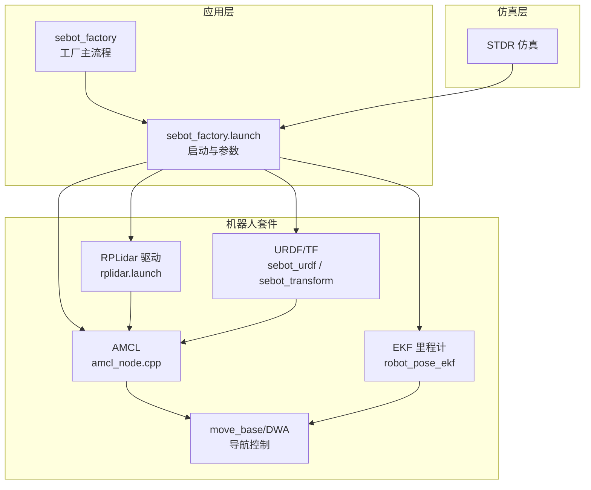
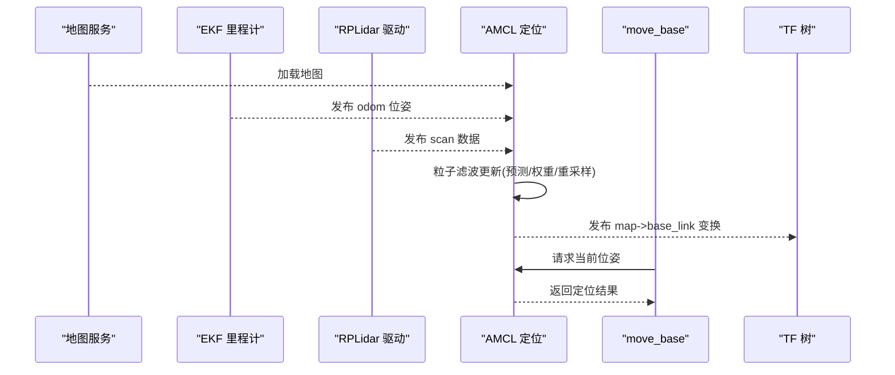
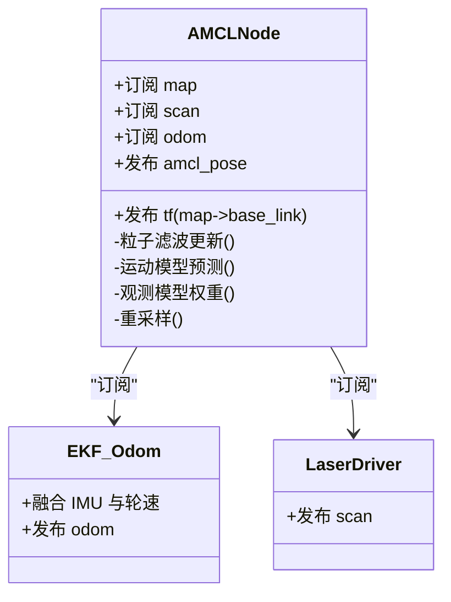
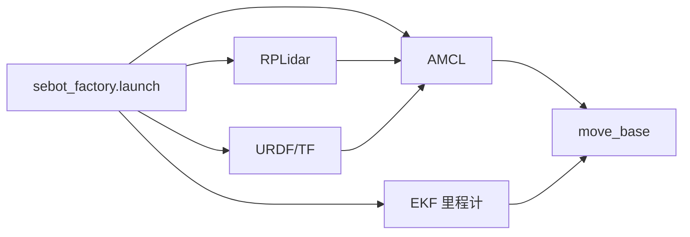

# 定位问题诊断

<cite>
**本文引用的文件**   
- [amcl_node.cpp](file://sebot_ros_kits/src/sebot_navigation/amcl/src/amcl_node.cpp)
- [AMCL.cfg](file://sebot_ros_kits/src/sebot_navigation/amcl/cfg/AMCL.cfg)
- [amcl_diff.launch](file://sebot_ros_kits/src/sebot_navigation/amcl/examples/amcl_diff.launch)
- [amcl_omni.launch](file://sebot_ros_kits/src/sebot_navigation/amcl/examples/amcl_omni.launch)
- [robot_pose_ekf.launch](file://sebot_ros_kits/src/sebot_driver/robot_pose_ekf/launch/robot_pose_ekf.launch)
- [odom_estimation_node.cpp](file://sebot_ros_kits/src/sebot_driver/robot_pose_ekf/src/odom_estimation_node.cpp)
- [rplidar.launch](file://sebot_ros_kits/src/sebot_driver/rplidar_ros/launch/rplidar.launch)
- [sebot_urdf.launch](file://sebot_ros_kits/src/sebot_driver/sebot_urdf/launch/sebot_urdf.launch)
- [sebot_transform.launch](file://sebot_ros_kits/src/sebot_robot/launch/sebot_transform.launch)
- [sebot_odom.launch](file://sebot_ros_kits/src/sebot_robot/launch/sebot_odom.launch)
- [factory.cpp](file://sebot_factory/src/sebot_factory/factory.cpp)
- [sebot_factory.launch](file://sebot_factory/src/sebot_factory/launch/sebot_factory.launch)
- [basic_localization.py](file://sebot_ros_kits/src/sebot_navigation/amcl/test/basic_localization.py)
- [set_pose.py](file://sebot_ros_kits/src/sebot_navigation/amcl/test/set_pose.py)
</cite>

## 目录
1. [简介](#简介)
2. [项目结构](#项目结构)
3. [核心组件](#核心组件)
4. [架构总览](#架构总览)
5. [详细组件分析](#详细组件分析)
6. [依赖关系分析](#依赖关系分析)
7. [性能与调优](#性能与调优)
8. [故障排查指南](#故障排查指南)
9. [结论](#结论)
10. [附录：常用命令与监控](#附录常用命令与监控)

## 简介
本文件面向机器人竞赛系统中的 AMCL（自适应蒙特卡洛定位）问题诊断，聚焦以下目标：
- 定位漂移、定位丢失、初始定位失败的排查方法
- AMCL 参数调优对定位精度的影响（粒子数量、重采样阈值、运动模型参数）
- 里程计误差、IMU 数据异常、激光雷达匹配失败对定位的影响
- TF 坐标系变换错误的诊断
- 地图与传感器数据不匹配的解决方法
- 定位性能监控方法与调试工具使用指南

本项目由三层 catkin 工作空间组成：应用层 sebot_factory、机器人套件 sebot_ros_kits、仿真层 sebot_ros_stdr。导航栈基于 move_base + AMCL + DWA，建图采用 Gmapping/Hector，传感器包含 RPLidar、IMU、里程计 EKF 融合。

## 项目结构
- 应用层 sebot_factory：业务主状态机与任务编排，启动导航与感知节点，集中配置 launch 参数。
- 机器人套件 sebot_ros_kits：导航栈（AMCL、move_base、DWA）、驱动（RPLidar、EKF 里程计）、URDF 与 TF 发布。
- 仿真层 sebot_ros_stdr：STDR 仿真环境及示例导航配置。

图表来源
- [sebot_factory.launch](file://sebot_factory/src/sebot_factory/launch/sebot_factory.launch)
- [amcl_node.cpp](file://sebot_ros_kits/src/sebot_navigation/amcl/src/amcl_node.cpp)
- [robot_pose_ekf.launch](file://sebot_ros_kits/src/sebot_driver/robot_pose_ekf/launch/robot_pose_ekf.launch)
- [rplidar.launch](file://sebot_ros_kits/src/sebot_driver/rplidar_ros/launch/rplidar.launch)
- [sebot_urdf.launch](file://sebot_ros_kits/src/sebot_driver/sebot_urdf/launch/sebot_urdf.launch)
- [sebot_transform.launch](file://sebot_ros_kits/src/sebot_robot/launch/sebot_transform.launch)

章节来源
- [sebot_factory.launch](file://sebot_factory/src/sebot_factory/launch/sebot_factory.launch)
- [amcl_node.cpp](file://sebot_ros_kits/src/sebot_navigation/amcl/src/amcl_node.cpp)

## 核心组件
- AMCL 定位节点：订阅里程计与激光扫描，结合地图进行粒子滤波定位，输出 robot_pose 到 map 的 TF 变换。
- EKF 里程计融合：融合轮式里程计与 IMU，输出更稳定的 odom 位姿。
- 激光雷达驱动：提供实时 scan 数据。
- URDF/TF：定义传感器与车体相对位姿，确保坐标变换正确。
- 导航栈：move_base 调用 AMCL 与局部规划器完成路径跟踪。

章节来源
- [amcl_node.cpp](file://sebot_ros_kits/src/sebot_navigation/amcl/src/amcl_node.cpp)
- [robot_pose_ekf.launch](file://sebot_ros_kits/src/sebot_driver/robot_pose_ekf/launch/robot_pose_ekf.launch)
- [rplidar.launch](file://sebot_ros_kits/src/sebot_driver/rplidar_ros/launch/rplidar.launch)
- [sebot_urdf.launch](file://sebot_ros_kits/src/sebot_driver/sebot_urdf/launch/sebot_urdf.launch)
- [sebot_transform.launch](file://sebot_ros_kits/src/sebot_robot/launch/sebot_transform.launch)

## 架构总览
AMCL 在导航中的关键数据流如下：
- 输入：map（静态地图）、scan（激光扫描）、odom（EKF 融合后的里程计）、tf（传感器与车体关系）
- 处理：粒子滤波更新（运动模型预测 + 观测模型权重计算 + 重采样）
- 输出：robot_pose（map->odom 或 base_link->odom），供 move_base 使用

图表来源
- [amcl_node.cpp](file://sebot_ros_kits/src/sebot_navigation/amcl/src/amcl_node.cpp)
- [robot_pose_ekf.launch](file://sebot_ros_kits/src/sebot_driver/robot_pose_ekf/launch/robot_pose_ekf.launch)
- [rplidar.launch](file://sebot_ros_kits/src/sebot_driver/rplidar_ros/launch/rplidar.launch)

## 详细组件分析

### AMCL 定位节点
- 功能：根据里程计与激光扫描，结合地图进行粒子滤波定位；支持设置初始位姿、重采样策略、运动模型等。
- 关键输入：/map、/scan、/odom、tf 变换；关键输出：/amcl_pose、map->base_link 变换。
- 常见问题：粒子发散、重采样过度、观测似然低导致定位抖动。

图表来源
- [amcl_node.cpp](file://sebot_ros_kits/src/sebot_navigation/amcl/src/amcl_node.cpp)
- [robot_pose_ekf.launch](file://sebot_ros_kits/src/sebot_driver/robot_pose_ekf/launch/robot_pose_ekf.launch)
- [rplidar.launch](file://sebot_ros_kits/src/sebot_driver/rplidar_ros/launch/rplidar.launch)

章节来源
- [amcl_node.cpp](file://sebot_ros_kits/src/sebot_navigation/amcl/src/amcl_node.cpp)

### EKF 里程计融合
- 作用：将轮式里程计与 IMU 数据进行卡尔曼滤波融合，降低里程计漂移，为 AMCL 提供更可靠的运动估计。
- 典型问题：IMU 偏置未校准、时间戳不同步、协方差过大导致融合不稳定。

章节来源
- [robot_pose_ekf.launch](file://sebot_ros_kits/src/sebot_driver/robot_pose_ekf/launch/robot_pose_ekf.launch)
- [odom_estimation_node.cpp](file://sebot_ros_kits/src/sebot_driver/robot_pose_ekf/src/odom_estimation_node.cpp)

### 激光雷达驱动
- 作用：提供高频 scan 数据，用于 AMCL 观测模型匹配。
- 典型问题：点云缺失、噪声大、帧率不足导致匹配失败。

章节来源
- [rplidar.launch](file://sebot_ros_kits/src/sebot_driver/rplidar_ros/launch/rplidar.launch)

### URDF 与 TF 变换
- 作用：定义各传感器与车体的相对位姿，确保 AMCL 能正确将 scan 投影到地图坐标系。
- 典型问题：TF 缺失或错误（如 base_link->laser 未发布），导致 AMCL 无法匹配。

章节来源
- [sebot_urdf.launch](file://sebot_ros_kits/src/sebot_driver/sebot_urdf/launch/sebot_urdf.launch)
- [sebot_transform.launch](file://sebot_ros_kits/src/sebot_robot/launch/sebot_transform.launch)

### 导航栈集成（move_base + DWA）
- move_base 依赖 AMCL 提供的位姿进行全局与局部规划；DWA 负责局部避障与轨迹优化。
- 若 AMCL 定位不准，move_base 会频繁重规划或陷入局部最优。

章节来源
- [amcl_node.cpp](file://sebot_ros_kits/src/sebot_navigation/amcl/src/amcl_node.cpp)

## 依赖关系分析
- AMCL 依赖：地图服务、EKF 里程计、激光雷达、TF 树。
- move_base 依赖：AMCL、局部规划器（DWA）、代价地图。
- 上层应用依赖：sebot_factory 通过 launch 统一启动并配置各节点。

图表来源
- [sebot_factory.launch](file://sebot_factory/src/sebot_factory/launch/sebot_factory.launch)
- [amcl_node.cpp](file://sebot_ros_kits/src/sebot_navigation/amcl/src/amcl_node.cpp)
- [robot_pose_ekf.launch](file://sebot_ros_kits/src/sebot_driver/robot_pose_ekf/launch/robot_pose_ekf.launch)
- [rplidar.launch](file://sebot_ros_kits/src/sebot_driver/rplidar_ros/launch/rplidar.launch)
- [sebot_urdf.launch](file://sebot_ros_kits/src/sebot_driver/sebot_urdf/launch/sebot_urdf.launch)
- [sebot_transform.launch](file://sebot_ros_kits/src/sebot_robot/launch/sebot_transform.launch)

章节来源
- [sebot_factory.launch](file://sebot_factory/src/sebot_factory/launch/sebot_factory.launch)

## 性能与调优

### AMCL 参数调优要点
- 粒子数量（particles）：增加可提升精度但消耗更多 CPU；建议从 1000~3000 起步，逐步调整。
- 重采样阈值（resample_threshold）：过低会导致频繁重采样，粒子多样性下降；过高则收敛慢。
- 运动模型参数（lambdax, lambday, lambdatheta 等）：反映里程计不确定性，需根据实际轮滑、地面摩擦校准。
- 观测模型参数（min/max range、sigma_hit、alpha1..4）：影响激光匹配鲁棒性，长走廊与空旷区域需调整。
- 初始化策略（initial_cov_x/y/th）：初始定位不确定度越大，搜索范围越广，但收敛更慢。

章节来源
- [AMCL.cfg](file://sebot_ros_kits/src/sebot_navigation/amcl/cfg/AMCL.cfg)
- [amcl_diff.launch](file://sebot_ros_kits/src/sebot_navigation/amcl/examples/amcl_diff.launch)
- [amcl_omni.launch](file://sebot_ros_kits/src/sebot_navigation/amcl/examples/amcl_omni.launch)

### 里程计与 IMU 校准
- 轮式里程计：检查编码器分辨率、齿轮比、轮胎磨损；必要时增大运动模型噪声以容忍偏差。
- IMU：零偏校准、时间同步、安装角度正确；避免强振动与磁干扰。

章节来源
- [robot_pose_ekf.launch](file://sebot_ros_kits/src/sebot_driver/robot_pose_ekf/launch/robot_pose_ekf.launch)
- [odom_estimation_node.cpp](file://sebot_ros_kits/src/sebot_driver/robot_pose_ekf/src/odom_estimation_node.cpp)

### 激光雷达匹配优化
- 提高帧率与减少丢包；合理设置 min/max range 以过滤噪声与远距无效点。
- 在空旷区域适当放宽匹配阈值，在狭窄通道收紧以避免误匹配。

章节来源
- [rplidar.launch](file://sebot_ros_kits/src/sebot_driver/rplidar_ros/launch/rplidar.launch)

## 故障排查指南

### 定位漂移
- 症状：粒子分布逐渐扩散，位姿随时间偏离真实位置。
- 排查步骤：
  - 检查里程计是否打滑或 IMU 偏置；观察 EKF 输出是否稳定。
  - 调整运动模型噪声，使预测与实际一致。
  - 验证激光匹配质量（scan 与地图一致性）。
  - 适当增加粒子数与重采样频率。

章节来源
- [amcl_node.cpp](file://sebot_ros_kits/src/sebot_navigation/amcl/src/amcl_node.cpp)
- [robot_pose_ekf.launch](file://sebot_ros_kits/src/sebot_driver/robot_pose_ekf/launch/robot_pose_ekf.launch)

### 定位丢失
- 症状：粒子迅速发散，AMCL 无法收敛。
- 排查步骤：
  - 确认地图已加载且坐标系正确。
  - 检查 TF 树是否完整（map->odom->base_link->sensor）。
  - 验证 scan 数据有效（无大量缺失或噪声）。
  - 临时扩大初始协方差，帮助重新全局定位。

章节来源
- [amcl_node.cpp](file://sebot_ros_kits/src/sebot_navigation/amcl/src/amcl_node.cpp)
- [sebot_urdf.launch](file://sebot_ros_kits/src/sebot_driver/sebot_urdf/launch/sebot_urdf.launch)
- [sebot_transform.launch](file://sebot_ros_kits/src/sebot_robot/launch/sebot_transform.launch)

### 初始定位失败
- 症状：设置初始位姿后 AMCL 不收敛或收敛到错误位置。
- 排查步骤：
  - 使用 RViz “2D Pose Estimate” 多次尝试，观察粒子分布变化。
  - 调整 initial_cov_x/y/th 以扩大搜索范围。
  - 检查地图与传感器尺度是否一致（单位、分辨率）。
  - 使用测试脚本辅助定位：basic_localization.py、set_pose.py。

章节来源
- [basic_localization.py](file://sebot_ros_kits/src/sebot_navigation/amcl/test/basic_localization.py)
- [set_pose.py](file://sebot_ros_kits/src/sebot_navigation/amcl/test/set_pose.py)
- [AMCL.cfg](file://sebot_ros_kits/src/sebot_navigation/amcl/cfg/AMCL.cfg)

### TF 坐标系变换错误
- 症状：AMCL 报 TF 缺失或错误，scan 无法投影到地图。
- 排查步骤：
  - 使用 rosrun tf view_frames 生成 TF 图，检查 map->odom->base_link->laser 链路。
  - 确认 URDF 中传感器安装位姿正确。
  - 检查 sebot_transform 节点是否正常发布所需变换。

章节来源
- [sebot_urdf.launch](file://sebot_ros_kits/src/sebot_driver/sebot_urdf/launch/sebot_urdf.launch)
- [sebot_transform.launch](file://sebot_ros_kits/src/sebot_robot/launch/sebot_transform.launch)

### 地图与传感器数据不匹配
- 症状：激光扫描与地图轮廓不一致，AMCL 匹配失败。
- 排查步骤：
  - 检查地图分辨率与单位是否与传感器一致。
  - 校准传感器外参（安装高度、俯仰角）。
  - 调整 AMCL 观测模型参数（sigma_hit、max range 等）。

章节来源
- [amcl_node.cpp](file://sebot_ros_kits/src/sebot_navigation/amcl/src/amcl_node.cpp)
- [rplidar.launch](file://sebot_ros_kits/src/sebot_driver/rplidar_ros/launch/rplidar.launch)

### 定位性能监控与调试工具
- RViz：可视化粒子分布、scan 匹配、TF 树、位姿轨迹。
- rosbag：录制关键话题（/scan、/odom、/amcl_pose、/tf）以便离线分析。
- rqt_plot：绘制位姿误差、粒子数量、重采样频率等指标。
- 测试脚本：basic_localization.py、set_pose.py 辅助快速验证定位能力。

章节来源
- [basic_localization.py](file://sebot_ros_kits/src/sebot_navigation/amcl/test/basic_localization.py)
- [set_pose.py](file://sebot_ros_kits/src/sebot_navigation/amcl/test/set_pose.py)

## 结论
AMCL 定位的稳定性依赖于高质量的里程计与 IMU 融合、准确的 TF 变换、合理的激光匹配以及恰当的 AMCL 参数。通过系统化的参数调优与严格的故障排查流程，可有效解决定位漂移、丢失与初始定位失败等问题。建议在比赛环境中建立标准调试流程与监控指标，确保定位性能的可重复性与鲁棒性。

## 附录：常用命令与监控
- 查看 TF 树：rosrun tf view_frames
- 录制数据：rosbag record /scan /odom /amcl_pose /tf
- 可视化：rviz 加载对应 rviz 配置文件，显示粒子、scan、位姿
- 设置初始位姿：使用 RViz “2D Pose Estimate” 或调用 set_pose 服务

章节来源
- [sebot_factory.launch](file://sebot_factory/src/sebot_factory/launch/sebot_factory.launch)
- [amcl_node.cpp](file://sebot_ros_kits/src/sebot_navigation/amcl/src/amcl_node.cpp)