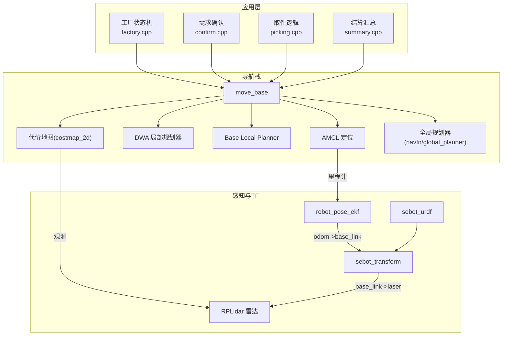
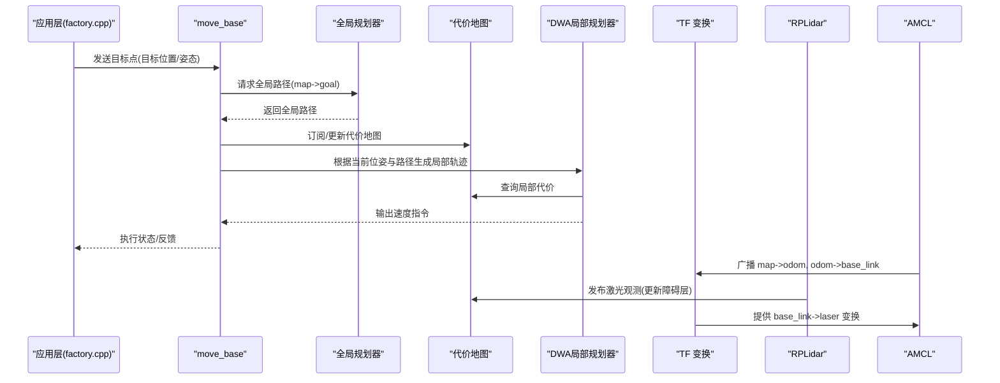
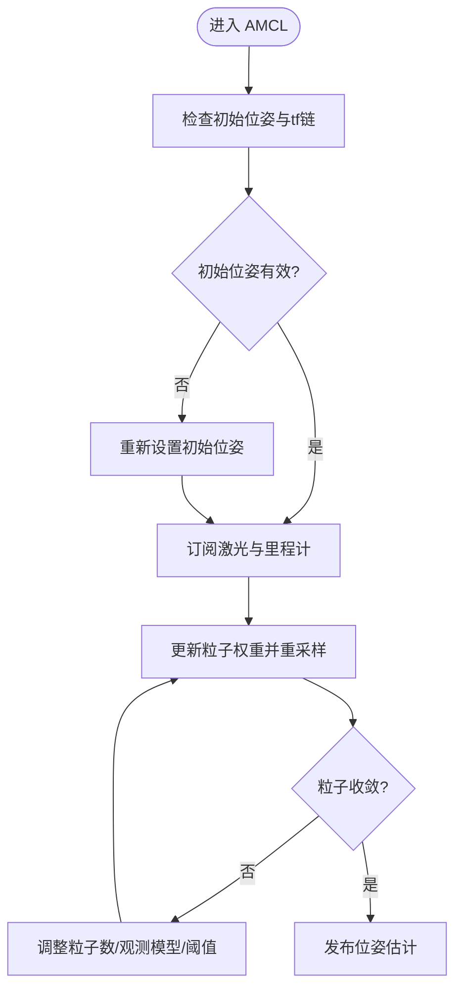
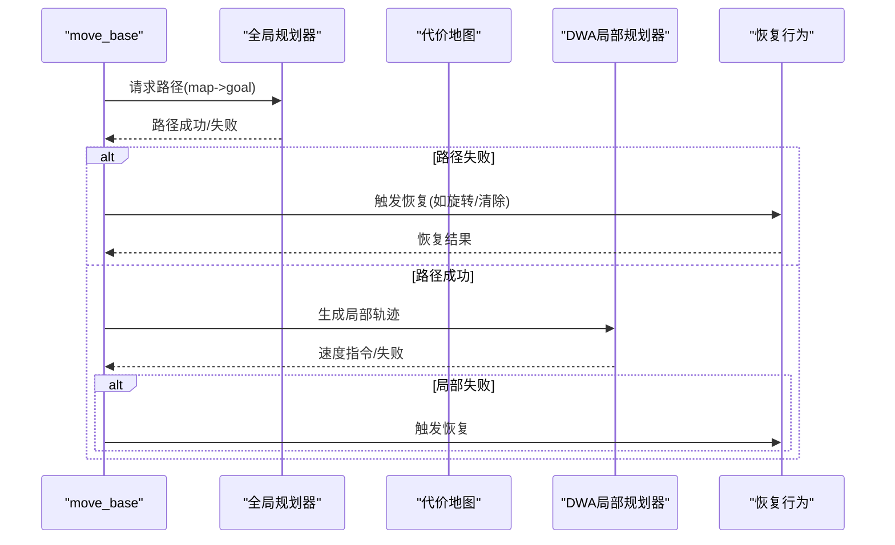
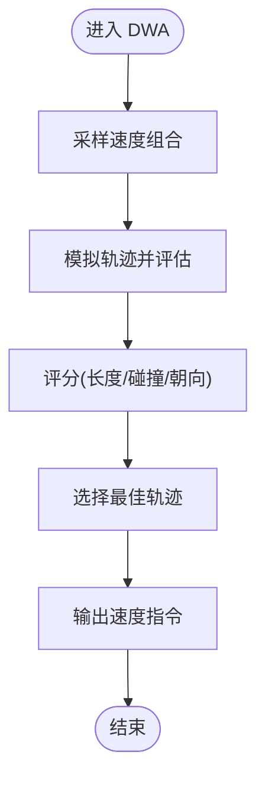
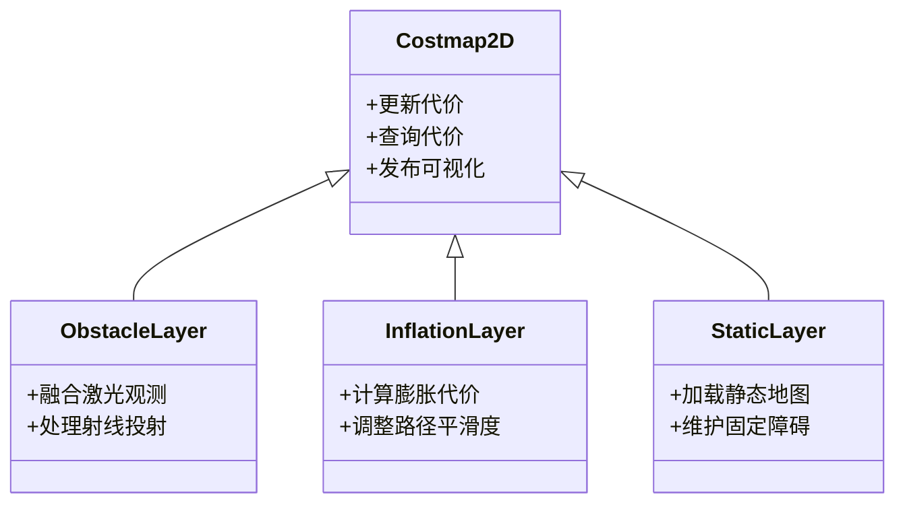
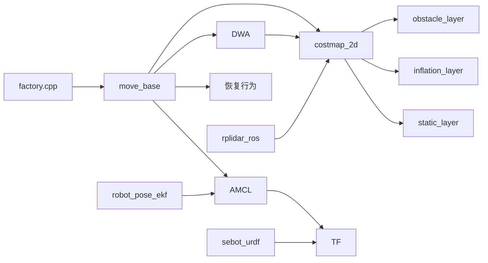

# 导航问题诊断

<cite>
**本文引用的文件**   
- [sebot_factory.launch](file://sebot_factory/src/sebot_factory/launch/sebot_factory.launch)
- [factory.cpp](file://sebot_factory/src/sebot_factory/src/factory.cpp)
- [confirm.cpp](file://sebot_factory/src/sebot_factory/src/confirm.cpp)
- [picking.cpp](file://sebot_factory/src/sebot_factory/src/picking.cpp)
- [summary.cpp](file://sebot_factory/src/sebot_factory/src/summary.cpp)
- [amcl_node.cpp](file://sebot_ros_kits/src/sebot_navigation/amcl/src/amcl_node.cpp)
- [move_base 主循环与状态机](file://sebot_ros_kits/src/sebot_navigation/move_base/src/move_base.cpp)
- [DWA 局部规划器实现](file://sebot_ros_kits/src/sebot_navigation/dwa_local_planner/src/dwa_plan.cpp)
- [base_local_planner 轨迹评估](file://sebot_ros_kits/src/sebot_navigation/base_local_planner/src/trajectory_planner.cpp)
- [costmap_2d 代价地图核心](file://sebot_ros_kits/src/sebot_navigation/costmap_2d/src/costmap_2d.cpp)
- [obstacle_layer 障碍物层](file://sebot_ros_kits/src/sebot_navigation/costmap_2d/plugins/obstacle_layer.cpp)
- [inflation_layer 膨胀层](file://sebot_ros_kits/src/sebot_navigation/costmap_2d/plugins/inflation_layer.cpp)
- [static_layer 静态层](file://sebot_ros_kits/src/sebot_navigation/costmap_2d/plugins/static_layer.cpp)
- [robot_pose_ekf 里程计融合](file://sebot_ros_kits/src/sebot_driver/robot_pose_ekf/src/odom_estimation_node.cpp)
- [rplidar_ros 雷达节点](file://sebot_ros_kits/src/sebot_driver/rplidar_ros/src/node.cpp)
- [slam_gmapping 建图节点](file://sebot_ros_kits/src/sebot_slam/slam_gmapping/slam_gmapping/slam_gmapping.cpp)
- [sebot_urdf 机器人模型](file://sebot_ros_kits/src/sebot_driver/sebot_urdf/urdf/sebot_urdf.urdf)
- [sebot_transform 坐标变换发布](file://sebot_ros_kits/src/sebot_robot/src/transform.cpp)
- [sebot_odom 里程计发布](file://sebot_ros_kits/src/sebot_robot/src/controller.cpp)
</cite>

## 目录
1. [简介](#简介)
2. [项目结构](#项目结构)
3. [核心组件](#核心组件)
4. [架构总览](#架构总览)
5. [详细组件分析](#详细组件分析)
6. [依赖关系分析](#依赖关系分析)
7. [性能考虑](#性能考虑)
8. [故障排查指南](#故障排查指南)
9. [结论](#结论)
10. [附录](#附录)

## 简介
本文件面向机器人竞赛系统的导航子系统，聚焦定位漂移、路径规划失败、局部避障异常、代价地图更新延迟等典型问题，给出系统化诊断方法与参数调优建议。内容覆盖 AMCL 粒子滤波定位、move_base 配置、DWA 局部规划器参数、TF 坐标系变换错误、激光雷达数据异常、地图加载失败等，并提供针对导航超时、循环移动、无法到达目标点的排查流程与优化策略。

## 项目结构
本项目由三个相互独立的 catkin 工作空间组成：
- sebot_factory（应用层）：业务状态机与任务编排，集成导航、视觉、机械臂控制。
- sebot_ros_kits（机器人套件）：传感器驱动、SLAM、导航栈、URDF 与 TF 发布。
- sebot_ros_stdr（仿真层）：STDR 仿真环境及示例导航配置。

导航相关的关键入口与配置集中在 sebot_factory 的 launch 文件中，通过 simulation/debug 等开关切换仿真模式与调试界面；导航链路使用 move_base + AMCL + DWA，建图使用 Gmapping/Hector，TF 由 robot_pose_ekf 与 sebot_transform 提供。

图表来源
- [sebot_factory.launch](file://sebot_factory/src/sebot_factory/launch/sebot_factory.launch)
- [factory.cpp](file://sebot_factory/src/sebot_factory/src/factory.cpp)
- [amcl_node.cpp](file://sebot_ros_kits/src/sebot_navigation/amcl/src/amcl_node.cpp)
- [move_base 主循环与状态机](file://sebot_ros_kits/src/sebot_navigation/move_base/src/move_base.cpp)
- [dwa_plan.cpp](file://sebot_ros_kits/src/sebot_navigation/dwa_local_planner/src/dwa_plan.cpp)
- [trajectory_planner.cpp](file://sebot_ros_kits/src/sebot_navigation/base_local_planner/src/trajectory_planner.cpp)
- [costmap_2d.cpp](file://sebot_ros_kits/src/sebot_navigation/costmap_2d/src/costmap_2d.cpp)
- [obstacle_layer.cpp](file://sebot_ros_kits/src/sebot_navigation/costmap_2d/plugins/obstacle_layer.cpp)
- [inflation_layer.cpp](file://sebot_ros_kits/src/sebot_navigation/costmap_2d/plugins/inflation_layer.cpp)
- [static_layer.cpp](file://sebot_ros_kits/src/sebot_navigation/costmap_2d/plugins/static_layer.cpp)
- [odom_estimation_node.cpp](file://sebot_ros_kits/src/sebot_driver/robot_pose_ekf/src/odom_estimation_node.cpp)
- [node.cpp](file://sebot_ros_kits/src/sebot_driver/rplidar_ros/src/node.cpp)
- [sebot_urdf.urdf](file://sebot_ros_kits/src/sebot_driver/sebot_urdf/urdf/sebot_urdf.urdf)
- [transform.cpp](file://sebot_ros_kits/src/sebot_robot/src/transform.cpp)

章节来源
- [sebot_factory.launch](file://sebot_factory/src/sebot_factory/launch/sebot_factory.launch)
- [factory.cpp](file://sebot_factory/src/sebot_factory/src/factory.cpp)

## 核心组件
- AMCL 粒子滤波定位：订阅激光与里程计，估计位姿并广播 tf。常见问题包括粒子发散、收敛慢、初始位姿设置不当。
- move_base 导航控制器：协调全局/局部规划器、代价地图、恢复行为。常见问题包括规划超时、循环移动、无法到达目标点。
- DWA 局部规划器：基于速度采样生成轨迹并评分。常见问题包括局部极小值、震荡、碰撞风险高。
- 代价地图 costmap_2d：融合静态地图、动态障碍物、膨胀层。常见问题包括更新延迟、障碍物穿透、膨胀半径不合理。
- SLAM/Gmapping：建图质量影响导航可靠性。常见问题包括地图尺度不一致、特征不足导致定位漂移。
- TF 坐标变换：odom、base_link、laser、map 等帧一致性至关重要。常见问题包括缺失/错配帧、时间戳不同步。

章节来源
- [amcl_node.cpp](file://sebot_ros_kits/src/sebot_navigation/amcl/src/amcl_node.cpp)
- [move_base 主循环与状态机](file://sebot_ros_kits/src/sebot_navigation/move_base/src/move_base.cpp)
- [dwa_plan.cpp](file://sebot_ros_kits/src/sebot_navigation/dwa_local_planner/src/dwa_plan.cpp)
- [costmap_2d.cpp](file://sebot_ros_kits/src/sebot_navigation/costmap_2d/src/costmap_2d.cpp)
- [obstacle_layer.cpp](file://sebot_ros_kits/src/sebot_navigation/costmap_2d/plugins/obstacle_layer.cpp)
- [inflation_layer.cpp](file://sebot_ros_kits/src/sebot_navigation/costmap_2d/plugins/inflation_layer.cpp)
- [static_layer.cpp](file://sebot_ros_kits/src/sebot_navigation/costmap_2d/plugins/static_layer.cpp)
- [odom_estimation_node.cpp](file://sebot_ros_kits/src/sebot_driver/robot_pose_ekf/src/odom_estimation_node.cpp)
- [node.cpp](file://sebot_ros_kits/src/sebot_driver/rplidar_ros/src/node.cpp)
- [sebot_urdf.urdf](file://sebot_ros_kits/src/sebot_driver/sebot_urdf/urdf/sebot_urdf.urdf)
- [transform.cpp](file://sebot_ros_kits/src/sebot_robot/src/transform.cpp)

## 架构总览
导航系统以 move_base 为核心调度器，AMCL 提供全局定位，DWA 负责局部避障与轨迹跟踪，代价地图实时融合激光与静态地图信息，全局规划器在 map 坐标系下计算无碰撞路径。TF 链确保各传感器与机器人本体坐标系一致。

图表来源
- [move_base 主循环与状态机](file://sebot_ros_kits/src/sebot_navigation/move_base/src/move_base.cpp)
- [dwa_plan.cpp](file://sebot_ros_kits/src/sebot_navigation/dwa_local_planner/src/dwa_plan.cpp)
- [costmap_2d.cpp](file://sebot_ros_kits/src/sebot_navigation/costmap_2d/src/costmap_2d.cpp)
- [amcl_node.cpp](file://sebot_ros_kits/src/sebot_navigation/amcl/src/amcl_node.cpp)
- [node.cpp](file://sebot_ros_kits/src/sebot_driver/rplidar_ros/src/node.cpp)

## 详细组件分析

### AMCL 粒子滤波定位问题诊断
- 症状
  - 定位漂移：粒子云扩散，位姿估计不稳定。
  - 收敛慢：需要长时间运动才能稳定。
  - 初始化失败：启动后位姿估计不收敛或错误。
- 关键原因
  - 初始位姿设置不准确。
  - 激光与里程计噪声大或时间戳不同步。
  - 地图与真实环境差异大，特征不足。
  - 粒子数不足或重采样阈值不当。
- 诊断步骤
  - 检查 RViz 中粒子云分布是否集中在真实位姿附近。
  - 核对 tf 链 map->odom->base_link->laser 是否存在且时间戳一致。
  - 验证激光数据正常、里程计频率与精度。
  - 调整 AMCL 的粒子数量、重采样阈值、最小/最大距离、观测模型参数。
- 参数调优要点
  - 增大粒子数以提高鲁棒性但增加计算量。
  - 调整观测模型权重，平衡激光与里程计贡献。
  - 合理设置最小/最大距离以过滤远场噪声。
  - 启用自适应重采样与在线参数调节。

图表来源
- [amcl_node.cpp](file://sebot_ros_kits/src/sebot_navigation/amcl/src/amcl_node.cpp)

章节来源
- [amcl_node.cpp](file://sebot_ros_kits/src/sebot_navigation/amcl/src/amcl_node.cpp)

### move_base 配置与导航超时、循环移动、无法到达目标点
- 症状
  - 导航超时：全局/局部规划耗时过长或频繁失败。
  - 循环移动：机器人在局部极小值处打转。
  - 无法到达目标点：路径被阻塞或局部规划器无法生成可行轨迹。
- 关键原因
  - 全局规划器参数过保守或代价地图存在虚假障碍。
  - 局部规划器速度范围或评分函数不合理。
  - 恢复行为未正确触发或参数不当。
  - 目标点位于不可达区域或代价地图未更新。
- 诊断步骤
  - 查看 RViz 中的全局/局部路径与代价地图可视化。
  - 检查 move_base 日志中的规划失败原因与恢复行为。
  - 验证目标点是否在自由空间内，代价地图是否包含最新激光数据。
  - 调整全局/局部规划器的时间与重试参数。
- 参数调优要点
  - 全局规划器：提高搜索分辨率、放宽代价阈值、启用更合适的算法。
  - 局部规划器：扩大速度搜索范围、调整评分权重（轨迹长度、碰撞风险、朝向误差）。
  - 恢复行为：启用清除代价地图、旋转退出等策略，设置合理的尝试次数与时限。

图表来源
- [move_base 主循环与状态机](file://sebot_ros_kits/src/sebot_navigation/move_base/src/move_base.cpp)

章节来源
- [move_base 主循环与状态机](file://sebot_ros_kits/src/sebot_navigation/move_base/src/move_base.cpp)

### DWA 局部规划器参数调整
- 症状
  - 局部避障异常：碰撞风险高或过于保守。
  - 震荡与抖动：速度指令频繁变化。
  - 无法通过狭窄通道：轨迹生成失败。
- 关键原因
  - 速度上限/加速度限制不合理。
  - 评分函数权重失衡（优先长度而非安全）。
  - 代价地图分辨率低或动态更新不及时。
- 诊断步骤
  - 观察 RViz 中的局部轨迹与速度曲线。
  - 检查激光数据频率与代价地图更新周期。
  - 调整速度搜索网格与轨迹采样数量。
- 参数调优要点
  - 适当提高最大速度与加速度以提升效率，同时保证安全性。
  - 增加对碰撞风险与朝向误差的权重，避免贴边行驶。
  - 提高轨迹采样密度以改善狭窄通道通过率。

图表来源
- [dwa_plan.cpp](file://sebot_ros_kits/src/sebot_navigation/dwa_local_planner/src/dwa_plan.cpp)

章节来源
- [dwa_plan.cpp](file://sebot_ros_kits/src/sebot_navigation/dwa_local_planner/src/dwa_plan.cpp)

### 代价地图更新延迟与局部避障异常
- 症状
  - 障碍物未及时反映，导致碰撞或绕行失败。
  - 膨胀层过度或不足，路径过于绕弯或贴近障碍。
  - 静态层与动态层冲突，地图出现空洞或虚假障碍。
- 关键原因
  - 激光数据频率低或时间戳滞后。
  - 代价地图更新周期过长或缓冲区溢出。
  - 膨胀半径设置不当。
- 诊断步骤
  - 检查激光话题频率与时间戳。
  - 查看代价地图各层可视化（静态/障碍/膨胀）。
  - 调整更新周期、缓冲区大小与传感器融合参数。
- 参数调优要点
  - 提高激光频率与代价地图更新速率。
  - 合理设置膨胀半径与衰减系数。
  - 调整障碍物层的射线投射与合并策略。

图表来源
- [costmap_2d.cpp](file://sebot_ros_kits/src/sebot_navigation/costmap_2d/src/costmap_2d.cpp)
- [obstacle_layer.cpp](file://sebot_ros_kits/src/sebot_navigation/costmap_2d/plugins/obstacle_layer.cpp)
- [inflation_layer.cpp](file://sebot_ros_kits/src/sebot_navigation/costmap_2d/plugins/inflation_layer.cpp)
- [static_layer.cpp](file://sebot_ros_kits/src/sebot_navigation/costmap_2d/plugins/static_layer.cpp)

章节来源
- [costmap_2d.cpp](file://sebot_ros_kits/src/sebot_navigation/costmap_2d/src/costmap_2d.cpp)
- [obstacle_layer.cpp](file://sebot_ros_kits/src/sebot_navigation/costmap_2d/plugins/obstacle_layer.cpp)
- [inflation_layer.cpp](file://sebot_ros_kits/src/sebot_navigation/costmap_2d/plugins/inflation_layer.cpp)
- [static_layer.cpp](file://sebot_ros_kits/src/sebot_navigation/costmap_2d/plugins/static_layer.cpp)

### TF 坐标系变换错误排查
- 症状
  - 定位漂移或导航失败，RViz 显示坐标轴错位。
  - 激光数据无法投影到机器人坐标系。
- 关键原因
  - 缺少必要帧（如 base_link->laser）。
  - 时间戳不同步或频率不一致。
  - URDF 与实际安装不符。
- 诊断步骤
  - 使用 tf_monitor/tf_echo 检查帧链完整性与时序。
  - 核对 URDF 中传感器安装位置与方向。
  - 确保 robot_pose_ekf 与 sebot_transform 正确发布帧。
- 修复建议
  - 补充缺失的 tf 发布节点。
  - 统一时间源与同步机制。
  - 修正 URDF 描述与实际硬件匹配。

章节来源
- [sebot_urdf.urdf](file://sebot_ros_kits/src/sebot_driver/sebot_urdf/urdf/sebot_urdf.urdf)
- [transform.cpp](file://sebot_ros_kits/src/sebot_robot/src/transform.cpp)
- [odom_estimation_node.cpp](file://sebot_ros_kits/src/sebot_driver/robot_pose_ekf/src/odom_estimation_node.cpp)

### 激光雷达数据异常处理
- 症状
  - 地图空洞或噪声过多。
  - 障碍物检测不准确，导致路径规划失败。
- 关键原因
  - 雷达连接不稳定或数据丢包。
  - 扫描频率与处理节点不匹配。
  - 反射面或透明物体导致测量误差。
- 诊断步骤
  - 检查 rplidar_ros 节点日志与话题频率。
  - 在 RViz 中可视化激光点云与扫描线。
  - 调整雷达参数（角度范围、滤波阈值）。
- 修复建议
  - 提升通信带宽与稳定性。
  - 增加数据校验与插值补偿。
  - 结合多传感器融合提高鲁棒性。

章节来源
- [node.cpp](file://sebot_ros_kits/src/sebot_driver/rplidar_ros/src/node.cpp)

### 地图加载失败的原因分析
- 症状
  - 导航无法启动或路径规划失败。
  - 代价地图为空或尺寸异常。
- 关键原因
  - 地图文件格式错误或路径不正确。
  - 地图分辨率与机器人尺度不匹配。
  - map_server 配置参数错误。
- 诊断步骤
  - 检查地图文件完整性与扩展名。
  - 验证 map_server 的参数（分辨率、原点、图像路径）。
  - 使用 map_server 工具重新转换地图格式。
- 修复建议
  - 使用标准工具生成 .pgm 与 .yaml 配对文件。
  - 校准地图分辨率与机器人实际尺寸。
  - 确保 map 坐标系与 AMCL 配置一致。

章节来源
- [sebot_factory.launch](file://sebot_factory/src/sebot_factory/launch/sebot_factory.launch)

## 依赖关系分析
导航系统依赖多个模块协同工作，任何一环异常都可能导致整体失效。

图表来源
- [factory.cpp](file://sebot_factory/src/sebot_factory/src/factory.cpp)
- [move_base 主循环与状态机](file://sebot_ros_kits/src/sebot_navigation/move_base/src/move_base.cpp)
- [amcl_node.cpp](file://sebot_ros_kits/src/sebot_navigation/amcl/src/amcl_node.cpp)
- [dwa_plan.cpp](file://sebot_ros_kits/src/sebot_navigation/dwa_local_planner/src/dwa_plan.cpp)
- [costmap_2d.cpp](file://sebot_ros_kits/src/sebot_navigation/costmap_2d/src/costmap_2d.cpp)
- [obstacle_layer.cpp](file://sebot_ros_kits/src/sebot_navigation/costmap_2d/plugins/obstacle_layer.cpp)
- [inflation_layer.cpp](file://sebot_ros_kits/src/sebot_navigation/costmap_2d/plugins/inflation_layer.cpp)
- [static_layer.cpp](file://sebot_ros_kits/src/sebot_navigation/costmap_2d/plugins/static_layer.cpp)
- [node.cpp](file://sebot_ros_kits/src/sebot_driver/rplidar_ros/src/node.cpp)
- [odom_estimation_node.cpp](file://sebot_ros_kits/src/sebot_driver/robot_pose_ekf/src/odom_estimation_node.cpp)
- [sebot_urdf.urdf](file://sebot_ros_kits/src/sebot_driver/sebot_urdf/urdf/sebot_urdf.urdf)

章节来源
- [factory.cpp](file://sebot_factory/src/sebot_factory/src/factory.cpp)
- [move_base 主循环与状态机](file://sebot_ros_kits/src/sebot_navigation/move_base/src/move_base.cpp)

## 性能考虑
- 计算资源分配：AMCL 粒子数与代价地图分辨率需平衡精度与性能。
- 数据流优化：提高激光频率与减少不必要的数据拷贝。
- 规划器选择：根据场景复杂度选择合适的全局/局部规划器。
- 内存管理：避免代价地图频繁重建与缓存过大。
- 并行化：传感器数据处理与规划计算尽量异步进行。

## 故障排查指南
- 定位漂移
  - 检查 AMCL 粒子云与初始位姿。
  - 验证 tf 链与传感器时间戳。
  - 调整观测模型与重采样参数。
- 路径规划失败
  - 查看全局/局部路径与代价地图可视化。
  - 调整规划器参数与恢复行为。
  - 确保目标点在自由空间内。
- 局部避障异常
  - 检查激光数据与代价地图更新。
  - 调整 DWA 速度范围与评分权重。
  - 优化膨胀层半径与衰减系数。
- 导航超时与循环移动
  - 增加重试次数与超时阈值。
  - 启用旋转退出与清除代价地图。
  - 检查是否存在局部极小值。
- 无法到达目标点
  - 验证目标点可达性与代价地图一致性。
  - 调整全局规划器搜索范围与代价阈值。
  - 检查恢复行为是否有效触发。
- TF 坐标系错误
  - 使用 tf_monitor/tf_echo 检查帧链。
  - 核对 URDF 与实际安装。
  - 确保时间同步与频率一致。
- 激光雷达异常
  - 检查 rplidar_ros 节点与话题频率。
  - 调整雷达参数与滤波阈值。
  - 结合多传感器融合提高鲁棒性。
- 地图加载失败
  - 验证地图文件格式与路径。
  - 检查 map_server 参数与分辨率。
  - 使用标准工具重新生成地图。

章节来源
- [amcl_node.cpp](file://sebot_ros_kits/src/sebot_navigation/amcl/src/amcl_node.cpp)
- [move_base 主循环与状态机](file://sebot_ros_kits/src/sebot_navigation/move_base/src/move_base.cpp)
- [dwa_plan.cpp](file://sebot_ros_kits/src/sebot_navigation/dwa_local_planner/src/dwa_plan.cpp)
- [costmap_2d.cpp](file://sebot_ros_kits/src/sebot_navigation/costmap_2d/src/costmap_2d.cpp)
- [obstacle_layer.cpp](file://sebot_ros_kits/src/sebot_navigation/costmap_2d/plugins/obstacle_layer.cpp)
- [inflation_layer.cpp](file://sebot_ros_kits/src/sebot_navigation/costmap_2d/plugins/inflation_layer.cpp)
- [static_layer.cpp](file://sebot_ros_kits/src/sebot_navigation/costmap_2d/plugins/static_layer.cpp)
- [node.cpp](file://sebot_ros_kits/src/sebot_driver/rplidar_ros/src/node.cpp)
- [sebot_urdf.urdf](file://sebot_ros_kits/src/sebot_driver/sebot_urdf/urdf/sebot_urdf.urdf)

## 结论
导航系统的稳定性依赖于 AMCL 定位、move_base 调度、DWA 局部规划与代价地图更新的协同工作。通过系统化诊断与参数调优，可显著提升导航性能与鲁棒性。建议在实际部署中持续监控关键指标（定位精度、规划成功率、响应时间），并根据环境变化动态调整参数。

## 附录
- 常用调试工具：RViz、rosbag、tf_monitor、rqt_plot。
- 关键日志位置：move_base、AMCL、costmap_2d、rplidar_ros。
- 推荐参数模板：根据场景复杂度提供默认参数集，逐步微调至最优。