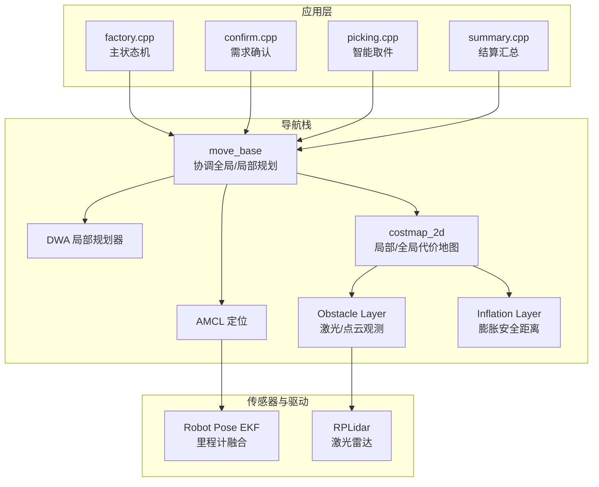
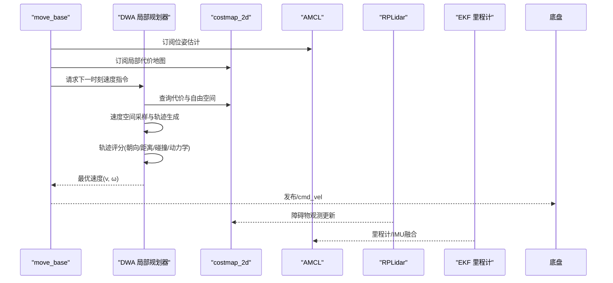
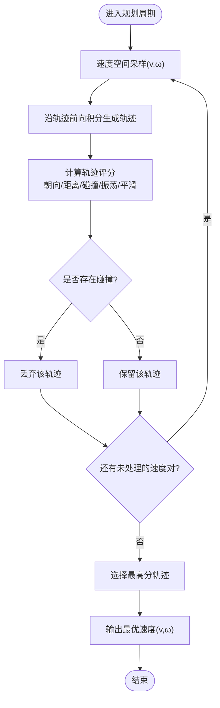
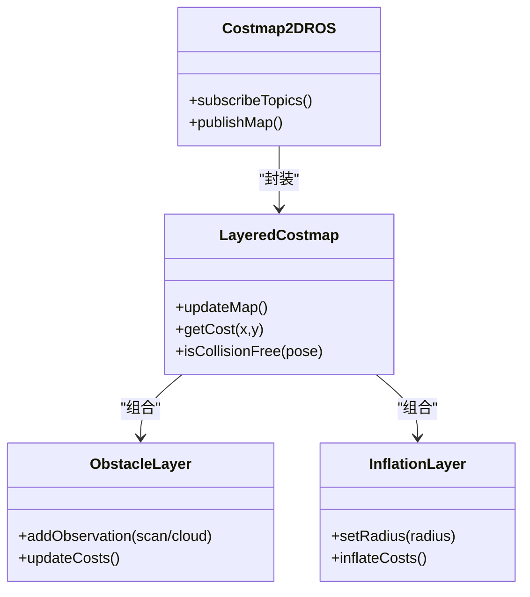
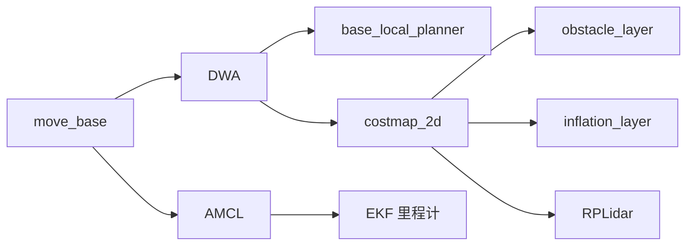

# 局部规划问题诊断

<cite>
**本文引用的文件**   
- [sebot_factory.launch](file://sebot_factory/src/sebot_factory/launch/sebot_factory.launch)
- [factory.cpp](file://sebot_factory/src/sebot_factory/src/factory.cpp)
- [confirm.cpp](file://sebot_factory/src/sebot_factory/src/confirm.cpp)
- [picking.cpp](file://sebot_factory/src/sebot_factory/src/picking.cpp)
- [summary.cpp](file://sebot_factory/src/sebot_factory/src/summary.cpp)
- [sebot_navigation.launch](file://sebot_ros_kits/src/sebot_navigation/sebot_navigation/launch/sebot_navigation.launch)
- [move_base.cfg](file://sebot_ros_kits/src/sebot_navigation/move_base/cfg/move_base.cfg)
- [dwa_local_planner_plugin.xml](file://sebot_ros_kits/src/sebot_navigation/dwa_local_planner/blp_plugin.xml)
- [dwa_local_planner.h](file://sebot_ros_kits/src/sebot_navigation/dwa_local_planner/include/dwa_local_planner/dwa_local_planner.h)
- [dwa_local_planner.cpp](file://sebot_ros_kits/src/sebot_navigation/dwa_local_planner/src/dwa_local_planner.cpp)
- [costmap_2d_ros.h](file://sebot_ros_kits/src/sebot_navigation/costmap_2d/include/costmap_2d/costmap_2d_ros.h)
- [layered_costmap.h](file://sebot_ros_kits/src/sebot_navigation/costmap_2d/include/costmap_2d/layered_costmap.h)
- [obstacle_layer.h](file://sebot_ros_kits/src/sebot_navigation/costmap_2d/include/costmap_2d/obstacle_layer.h)
- [inflation_layer.h](file://sebot_ros_kits/src/sebot_navigation/costmap_2d/include/costmap_2d/inflation_layer.h)
- [trajectory.h](file://sebot_ros_kits/src/sebot_navigation/base_local_planner/include/base_local_planner/trajectory.h)
- [simple_trajectory_generator.h](file://sebot_ros_kits/src/sebot_navigation/base_local_planner/include/base_local_planner/simple_trajectory_generator.h)
- [velocity_iterator.h](file://sebot_ros_kits/src/sebot_navigation/base_local_planner/include/base_local_planner/velocity_iterator.h)
- [obstacle_cost_function.h](file://sebot_ros_kits/src/sebot_navigation/base_local_planner/include/base_local_planner/obstacle_cost_function.h)
- [oscillation_cost_function.h](file://sebot_ros_kits/src/sebot_navigation/base_local_planner/include/base_local_planner/oscillation_cost_function.h)
- [prefer_forward_cost_function.h](file://sebot_ros_kits/src/sebot_navigation/base_local_planner/include/base_local_planner/prefer_forward_cost_function.h)
- [twirling_cost_function.h](file://sebot_ros_kits/src/sebot_navigation/base_local_planner/include/base_local_planner/twirling_cost_function.h)
- [amcl_node.cpp](file://sebot_ros_kits/src/sebot_navigation/amcl/src/amcl_node.cpp)
- [robot_pose_ekf_node.cpp](file://sebot_ros_kits/src/sebot_driver/robot_pose_ekf/src/odom_estimation_node.cpp)
- [rplidar_node.cpp](file://sebot_ros_kits/src/sebot_driver/rplidar_ros/src/node.cpp)
</cite>

## 目录
1. [简介](#简介)
2. [项目结构](#项目结构)
3. [核心组件](#核心组件)
4. [架构总览](#架构总览)
5. [详细组件分析](#详细组件分析)
6. [依赖关系分析](#依赖关系分析)
7. [性能考量](#性能考量)
8. [故障排查指南](#故障排查指南)
9. [结论](#结论)
10. [附录](#附录)

## 简介
本文件面向机器人竞赛系统中的“局部路径规划”问题，聚焦 DWA（动态窗口法）局部规划器的参数调优、轨迹生成失败、避障异常等典型现象。文档从速度空间搜索、轨迹评分函数、碰撞检测机制入手，结合本项目中的 move_base + DWA + costmap_2d 的集成方式，给出定位与修复方法；同时覆盖局部代价地图更新延迟、动态障碍物响应、机器人运动学约束对规划的影响，并提供循环移动、原地打转、无法前进等问题的诊断与解决方案，以及性能监控、轨迹可视化调试、参数实时调整的实践建议。

## 项目结构
本项目由三个相互独立的 catkin 工作空间组成：
- sebot_factory：应用层业务节点（工厂流程状态机、需求确认、取件、结算等）
- sebot_ros_kits：机器人套件与导航栈（AMCL、DWA、costmap_2d、move_base、RPLidar、EKF 里程计融合等）
- sebot_ros_stdr：仿真环境（STDR 仿真器、示例场景与配置）

导航相关的关键入口与配置集中在 launch 与 param 中，其中 sebot_factory.launch 负责启动导航与业务节点，并包含 simulation/debug 等关键开关。

图表来源
- [sebot_factory.launch](file://sebot_factory/src/sebot_factory/launch/sebot_factory.launch)
- [sebot_navigation.launch](file://sebot_ros_kits/src/sebot_navigation/sebot_navigation/launch/sebot_navigation.launch)
- [amcl_node.cpp](file://sebot_ros_kits/src/sebot_navigation/amcl/src/amcl_node.cpp)
- [rplidar_node.cpp](file://sebot_ros_kits/src/sebot_driver/rplidar_ros/src/node.cpp)
- [robot_pose_ekf_node.cpp](file://sebot_ros_kits/src/sebot_driver/robot_pose_ekf/src/odom_estimation_node.cpp)

章节来源
- [sebot_factory.launch](file://sebot_factory/src/sebot_factory/launch/sebot_factory.launch)
- [sebot_navigation.launch](file://sebot_ros_kits/src/sebot_navigation/sebot_navigation/launch/sebot_navigation.launch)

## 核心组件
- move_base：协调全局规划器与局部规划器，管理恢复行为与目标到达判定。
- DWA 局部规划器：在速度空间内采样候选轨迹，基于代价函数评分选择最优控制指令。
- costmap_2d：维护静态层、障碍层、膨胀层等，提供局部/全局代价地图。
- AMCL：粒子滤波定位，为规划器提供位姿估计。
- 传感器链路：RPLidar 提供障碍物观测，EKF 融合 IMU/轮速计得到更稳健的里程计。

章节来源
- [dwa_local_planner.h](file://sebot_ros_kits/src/sebot_navigation/dwa_local_planner/include/dwa_local_planner/dwa_local_planner.h)
- [dwa_local_planner.cpp](file://sebot_ros_kits/src/sebot_navigation/dwa_local_planner/src/dwa_local_planner.cpp)
- [costmap_2d_ros.h](file://sebot_ros_kits/src/sebot_navigation/costmap_2d/include/costmap_2d/costmap_2d_ros.h)
- [layered_costmap.h](file://sebot_ros_kits/src/sebot_navigation/costmap_2d/include/costmap_2d/layered_costmap.h)
- [amcl_node.cpp](file://sebot_ros_kits/src/sebot_navigation/amcl/src/amcl_node.cpp)
- [rplidar_node.cpp](file://sebot_ros_kits/src/sebot_driver/rplidar_ros/src/node.cpp)
- [robot_pose_ekf_node.cpp](file://sebot_ros_kits/src/sebot_driver/robot_pose_ekf/src/odom_estimation_node.cpp)

## 架构总览
下图展示 move_base 与 DWA、costmap_2d、AMCL 的交互时序，体现一次局部规划周期内的数据流与控制输出。

图表来源
- [dwa_local_planner.cpp](file://sebot_ros_kits/src/sebot_navigation/dwa_local_planner/src/dwa_local_planner.cpp)
- [costmap_2d_ros.h](file://sebot_ros_kits/src/sebot_navigation/costmap_2d/include/costmap_2d/costmap_2d_ros.h)
- [amcl_node.cpp](file://sebot_ros_kits/src/sebot_navigation/amcl/src/amcl_node.cpp)
- [rplidar_node.cpp](file://sebot_ros_kits/src/sebot_driver/rplidar_ros/src/node.cpp)
- [robot_pose_ekf_node.cpp](file://sebot_ros_kits/src/sebot_driver/robot_pose_ekf/src/odom_estimation_node.cpp)

## 详细组件分析

### DWA 局部规划器工作原理
- 速度空间搜索：在满足机器人动力学约束的范围内，按步长离散化 v 和 ω，生成候选速度对。
- 轨迹生成：对每个速度对进行前向积分，得到有限时间窗内的离散轨迹。
- 轨迹评分：综合多项代价函数，包括朝向目标、距目标距离、碰撞代价、振荡惩罚、转向平滑度等。
- 碰撞检测：基于当前位姿与轨迹上的各点，查询 costmap 的代价值判断是否侵入障碍物或超出膨胀半径。
- 控制输出：选择得分最高的速度对作为下一时刻的控制指令。

图表来源
- [dwa_local_planner.h](file://sebot_ros_kits/src/sebot_navigation/dwa_local_planner/include/dwa_local_planner/dwa_local_planner.h)
- [dwa_local_planner.cpp](file://sebot_ros_kits/src/sebot_navigation/dwa_local_planner/src/dwa_local_planner.cpp)
- [trajectory.h](file://sebot_ros_kits/src/sebot_navigation/base_local_planner/include/base_local_planner/trajectory.h)
- [simple_trajectory_generator.h](file://sebot_ros_kits/src/sebot_navigation/base_local_planner/include/base_local_planner/simple_trajectory_generator.h)
- [velocity_iterator.h](file://sebot_ros_kits/src/sebot_navigation/base_local_planner/include/base_local_planner/velocity_iterator.h)
- [obstacle_cost_function.h](file://sebot_ros_kits/src/sebot_navigation/base_local_planner/include/base_local_planner/obstacle_cost_function.h)
- [oscillation_cost_function.h](file://sebot_ros_kits/src/sebot_navigation/base_local_planner/include/base_local_planner/oscillation_cost_function.h)
- [prefer_forward_cost_function.h](file://sebot_ros_kits/src/sebot_navigation/base_local_planner/include/base_local_planner/prefer_forward_cost_function.h)
- [twirling_cost_function.h](file://sebot_ros_kits/src/sebot_navigation/base_local_planner/include/base_local_planner/twirling_cost_function.h)

章节来源
- [dwa_local_planner.h](file://sebot_ros_kits/src/sebot_navigation/dwa_local_planner/include/dwa_local_planner/dwa_local_planner.h)
- [dwa_local_planner.cpp](file://sebot_ros_kits/src/sebot_navigation/dwa_local_planner/src/dwa_local_planner.cpp)
- [trajectory.h](file://sebot_ros_kits/src/sebot_navigation/base_local_planner/include/base_local_planner/trajectory.h)
- [simple_trajectory_generator.h](file://sebot_ros_kits/src/sebot_navigation/base_local_planner/include/base_local_planner/simple_trajectory_generator.h)
- [velocity_iterator.h](file://sebot_ros_kits/src/sebot_navigation/base_local_planner/include/base_local_planner/velocity_iterator.h)
- [obstacle_cost_function.h](file://sebot_ros_kits/src/sebot_navigation/base_local_planner/include/base_local_planner/obstacle_cost_function.h)
- [oscillation_cost_function.h](file://sebot_ros_kits/src/sebot_navigation/base_local_planner/include/base_local_planner/oscillation_cost_function.h)
- [prefer_forward_cost_function.h](file://sebot_ros_kits/src/sebot_navigation/base_local_planner/include/base_local_planner/prefer_forward_cost_function.h)
- [twirling_cost_function.h](file://sebot_ros_kits/src/sebot_navigation/base_local_planner/include/base_local_planner/twirling_cost_function.h)

### 代价地图与碰撞检测
- layered_costmap：组合多个 layer（static、obstacle、inflation），统一对外提供代价查询接口。
- obstacle_layer：接收激光/点云观测，将自由空间与未知区域映射到代价地图。
- inflation_layer：根据机器人外形与安全距离，对障碍物周围进行代价膨胀，确保轨迹不侵入。
- costmap_2d_ros：封装 ROS 服务与话题，供 move_base/DWA 订阅与更新。

图表来源
- [layered_costmap.h](file://sebot_ros_kits/src/sebot_navigation/costmap_2d/include/costmap_2d/layered_costmap.h)
- [obstacle_layer.h](file://sebot_ros_kits/src/sebot_navigation/costmap_2d/include/costmap_2d/obstacle_layer.h)
- [inflation_layer.h](file://sebot_ros_kits/src/sebot_navigation/costmap_2d/include/costmap_2d/inflation_layer.h)
- [costmap_2d_ros.h](file://sebot_ros_kits/src/sebot_navigation/costmap_2d/include/costmap_2d/costmap_2d_ros.h)

章节来源
- [layered_costmap.h](file://sebot_ros_kits/src/sebot_navigation/costmap_2d/include/costmap_2d/layered_costmap.h)
- [obstacle_layer.h](file://sebot_ros_kits/src/sebot_navigation/costmap_2d/include/costmap_2d/obstacle_layer.h)
- [inflation_layer.h](file://sebot_ros_kits/src/sebot_navigation/costmap_2d/include/costmap_2d/inflation_layer.h)
- [costmap_2d_ros.h](file://sebot_ros_kits/src/sebot_navigation/costmap_2d/include/costmap_2d/costmap_2d_ros.h)

### 参数体系与调优要点
- move_base 参数：全局/局部规划频率、目标到达阈值、恢复行为触发条件、超时策略等。
- DWA 参数：速度分辨率、最大最小速度、加速度限制、轨迹长度、评分权重（朝向/距离/碰撞/振荡/平滑）。
- costmap 参数：局部地图尺寸、分辨率、更新频率、观测衰减、膨胀半径、观测噪声。
- AMCL 参数：粒子数、重采样阈值、激光匹配参数、初始位姿方差。
- 传感器参数：RPLidar 帧率、扫描范围、EKF 融合噪声协方差。

章节来源
- [move_base.cfg](file://sebot_ros_kits/src/sebot_navigation/move_base/cfg/move_base.cfg)
- [dwa_local_planner_plugin.xml](file://sebot_ros_kits/src/sebot_navigation/dwa_local_planner/blp_plugin.xml)
- [sebot_factory.launch](file://sebot_factory/src/sebot_factory/launch/sebot_factory.launch)
- [sebot_navigation.launch](file://sebot_ros_kits/src/sebot_navigation/sebot_navigation/launch/sebot_navigation.launch)

## 依赖关系分析
- move_base 依赖 DWA 与 AMCL，通过 costmap_2d 获取环境信息。
- DWA 依赖 base_local_planner 的轨迹生成与评分模块。
- costmap_2d 依赖 sensor_msgs（激光/点云）与 tf 变换。
- AMCL 依赖 odom/imu 与 laser scan 匹配。
- RPLidar 与 EKF 为底层感知与位姿源。

图表来源
- [dwa_local_planner.cpp](file://sebot_ros_kits/src/sebot_navigation/dwa_local_planner/src/dwa_local_planner.cpp)
- [costmap_2d_ros.h](file://sebot_ros_kits/src/sebot_navigation/costmap_2d/include/costmap_2d/costmap_2d_ros.h)
- [amcl_node.cpp](file://sebot_ros_kits/src/sebot_navigation/amcl/src/amcl_node.cpp)
- [rplidar_node.cpp](file://sebot_ros_kits/src/sebot_driver/rplidar_ros/src/node.cpp)
- [robot_pose_ekf_node.cpp](file://sebot_ros_kits/src/sebot_driver/robot_pose_ekf/src/odom_estimation_node.cpp)

章节来源
- [dwa_local_planner.cpp](file://sebot_ros_kits/src/sebot_navigation/dwa_local_planner/src/dwa_local_planner.cpp)
- [costmap_2d_ros.h](file://sebot_ros_kits/src/sebot_navigation/costmap_2d/include/costmap_2d/costmap_2d_ros.h)
- [amcl_node.cpp](file://sebot_ros_kits/src/sebot_navigation/amcl/src/amcl_node.cpp)
- [rplidar_node.cpp](file://sebot_ros_kits/src/sebot_driver/rplidar_ros/src/node.cpp)
- [robot_pose_ekf_node.cpp](file://sebot_ros_kits/src/sebot_driver/robot_pose_ekf/src/odom_estimation_node.cpp)

## 性能考量
- 规划频率与计算负载：提高 DWA 频率可提升动态响应，但会增加 CPU 占用；需平衡 local_plan_publish_rate 与采样密度。
- 代价地图更新延迟：局部地图过大或分辨率过高会导致更新滞后；合理设置 size、resolution、update_frequency。
- 传感器数据质量：激光噪点、丢帧会引发误判；检查 RPLidar 帧率与 EKF 协方差。
- 轨迹评分权重：过高的碰撞权重可能导致保守停滞；适当降低振荡惩罚以改善灵活性。
- 内存与 I/O：频繁发布 map/markers 会影响带宽；按需启用可视化。

[本节为通用指导，无需特定文件引用]

## 故障排查指南

### 轨迹生成失败
- 症状：DWA 无候选轨迹或始终返回零速度。
- 可能原因：
  - 速度上限过低或加速度限制过小，导致无法生成可行轨迹。
  - 局部地图全为高代价（膨胀半径过大或观测噪声过高）。
  - 机器人位姿估计漂移（AMCL/EKF 不稳定）。
- 排查步骤：
  - 检查 DWA 速度/加速度参数与机器人实际能力匹配。
  - 观察局部代价地图是否出现大面积高代价；调整 obstacle 与 inflation 参数。
  - 验证 AMCL 粒子分布与位姿收敛性；必要时重置定位。
- 参考实现位置：
  - [dwa_local_planner.cpp](file://sebot_ros_kits/src/sebot_navigation/dwa_local_planner/src/dwa_local_planner.cpp)
  - [layered_costmap.h](file://sebot_ros_kits/src/sebot_navigation/costmap_2d/include/costmap_2d/layered_costmap.h)
  - [amcl_node.cpp](file://sebot_ros_kits/src/sebot_navigation/amcl/src/amcl_node.cpp)

章节来源
- [dwa_local_planner.cpp](file://sebot_ros_kits/src/sebot_navigation/dwa_local_planner/src/dwa_local_planner.cpp)
- [layered_costmap.h](file://sebot_ros_kits/src/sebot_navigation/costmap_2d/include/costmap_2d/layered_costmap.h)
- [amcl_node.cpp](file://sebot_ros_kits/src/sebot_navigation/amcl/src/amcl_node.cpp)

### 避障异常（误撞或过度避让）
- 症状：轻微靠近即急停、绕开正常通道、或在窄道反复震荡。
- 可能原因：
  - 膨胀半径过大或 obstacle 层阈值过于敏感。
  - 激光噪声导致虚假障碍物。
  - 评分函数中碰撞权重过高。
- 排查步骤：
  - 调整 inflation radius 与 obstacle 层阈值，观察代价地图变化。
  - 增加激光滤波或降低 update_frequency，减少噪声影响。
  - 降低 collision_cost 权重，提升 forward 与 distance 权重。
- 参考实现位置：
  - [obstacle_layer.h](file://sebot_ros_kits/src/sebot_navigation/costmap_2d/include/costmap_2d/obstacle_layer.h)
  - [inflation_layer.h](file://sebot_ros_kits/src/sebot_navigation/costmap_2d/include/costmap_2d/inflation_layer.h)
  - [obstacle_cost_function.h](file://sebot_ros_kits/src/sebot_navigation/base_local_planner/include/base_local_planner/obstacle_cost_function.h)

章节来源
- [obstacle_layer.h](file://sebot_ros_kits/src/sebot_navigation/costmap_2d/include/costmap_2d/obstacle_layer.h)
- [inflation_layer.h](file://sebot_ros_kits/src/sebot_navigation/costmap_2d/include/costmap_2d/inflation_layer.h)
- [obstacle_cost_function.h](file://sebot_ros_kits/src/sebot_navigation/base_local_planner/include/base_local_planner/obstacle_cost_function.h)

### 循环移动与原地打转
- 症状：机器人在狭窄空间内反复转向或画圈。
- 可能原因：
  - 振荡惩罚不足或 prefer_forward 权重过低。
  - 目标方向与局部代价冲突，导致反复切换方向。
- 排查步骤：
  - 增大 oscillation_cost 权重，抑制来回摆动。
  - 提高 prefer_forward 权重，鼓励向前趋势。
  - 检查全局路径是否合理，避免死胡同。
- 参考实现位置：
  - [oscillation_cost_function.h](file://sebot_ros_kits/src/sebot_navigation/base_local_planner/include/base_local_planner/oscillation_cost_function.h)
  - [prefer_forward_cost_function.h](file://sebot_ros_kits/src/sebot_navigation/base_local_planner/include/base_local_planner/prefer_forward_cost_function.h)
  - [twirling_cost_function.h](file://sebot_ros_kits/src/sebot_navigation/base_local_planner/include/base_local_planner/twirling_cost_function.h)

章节来源
- [oscillation_cost_function.h](file://sebot_ros_kits/src/sebot_navigation/base_local_planner/include/base_local_planner/oscillation_cost_function.h)
- [prefer_forward_cost_function.h](file://sebot_ros_kits/src/sebot_navigation/base_local_planner/include/base_local_planner/prefer_forward_cost_function.h)
- [twirling_cost_function.h](file://sebot_ros_kits/src/sebot_navigation/base_local_planner/include/base_local_planner/twirling_cost_function.h)

### 无法前进（停滞）
- 症状：长时间速度为零，无法接近目标。
- 可能原因：
  - 局部地图被污染（静态层误标、膨胀半径过大）。
  - 目标到达阈值过小或全局路径不可达。
  - 传感器数据缺失导致 costmap 无自由空间。
- 排查步骤：
  - 清理 costmap（clear_costmap_recovery），检查 static 层与 inflation 参数。
  - 调整 goal_tolerance 与 global planner 可达性。
  - 检查 RPLidar 与 EKF 数据是否正常发布。
- 参考实现位置：
  - [costmap_2d_ros.h](file://sebot_ros_kits/src/sebot_navigation/costmap_2d/include/costmap_2d/costmap_2d_ros.h)
  - [rplidar_node.cpp](file://sebot_ros_kits/src/sebot_driver/rplidar_ros/src/node.cpp)
  - [robot_pose_ekf_node.cpp](file://sebot_ros_kits/src/sebot_driver/robot_pose_ekf/src/odom_estimation_node.cpp)

章节来源
- [costmap_2d_ros.h](file://sebot_ros_kits/src/sebot_navigation/costmap_2d/include/costmap_2d/costmap_2d_ros.h)
- [rplidar_node.cpp](file://sebot_ros_kits/src/sebot_driver/rplidar_ros/src/node.cpp)
- [robot_pose_ekf_node.cpp](file://sebot_ros_kits/src/sebot_driver/robot_pose_ekf/src/odom_estimation_node.cpp)

### 局部代价地图更新延迟
- 症状：机器人对动态障碍物反应迟缓，轨迹规划滞后。
- 可能原因：
  - 局部地图尺寸过大或分辨率过高。
  - obstacle_layer 更新频率低或观测缓冲延迟。
- 排查步骤：
  - 减小 local_map_size 与 resolution，提高 update_frequency。
  - 检查激光数据频率与消息队列积压情况。
- 参考实现位置：
  - [layered_costmap.h](file://sebot_ros_kits/src/sebot_navigation/costmap_2d/include/costmap_2d/layered_costmap.h)
  - [obstacle_layer.h](file://sebot_ros_kits/src/sebot_navigation/costmap_2d/include/costmap_2d/obstacle_layer.h)

章节来源
- [layered_costmap.h](file://sebot_ros_kits/src/sebot_navigation/costmap_2d/include/costmap_2d/layered_costmap.h)
- [obstacle_layer.h](file://sebot_ros_kits/src/sebot_navigation/costmap_2d/include/costmap_2d/obstacle_layer.h)

### 动态障碍物响应不佳
- 症状：遇到行人或移动物体时未能及时避让。
- 可能原因：
  - 局部地图更新不及时或观测衰减过快。
  - DWA 轨迹长度过短，无法预见未来碰撞。
- 排查步骤：
  - 提高 obstacle 层观测保留时间与衰减系数。
  - 增加 DWA 轨迹长度与时间窗口。
- 参考实现位置：
  - [obstacle_layer.h](file://sebot_ros_kits/src/sebot_navigation/costmap_2d/include/costmap_2d/obstacle_layer.h)
  - [dwa_local_planner.cpp](file://sebot_ros_kits/src/sebot_navigation/dwa_local_planner/src/dwa_local_planner.cpp)

章节来源
- [obstacle_layer.h](file://sebot_ros_kits/src/sebot_navigation/costmap_2d/include/costmap_2d/obstacle_layer.h)
- [dwa_local_planner.cpp](file://sebot_ros_kits/src/sebot_navigation/dwa_local_planner/src/dwa_local_planner.cpp)

### 机器人运动学约束影响
- 说明：DWA 的速度/加速度限制必须与实际底盘一致；否则会产生不可执行轨迹或频繁抖动。
- 排查步骤：
  - 核对 max/min 速度、角速度、加速度参数。
  - 检查 cmd_vel 发布频率与底盘控制器响应。
- 参考实现位置：
  - [dwa_local_planner.cpp](file://sebot_ros_kits/src/sebot_navigation/dwa_local_planner/src/dwa_local_planner.cpp)

章节来源
- [dwa_local_planner.cpp](file://sebot_ros_kits/src/sebot_navigation/dwa_local_planner/src/dwa_local_planner.cpp)

### 性能监控、轨迹可视化与参数实时调整
- 性能监控：
  - 使用 rqt_plot 监控 /cmd_vel、/local_plan、/costmap 更新频率与大小。
  - 使用 rostopic hz 检查激光与里程计数据频率。
- 轨迹可视化：
  - RViz 中显示 local_plan、global_plan、costmap 与 markers。
  - 开启 DWA 的轨迹预览（若插件支持）。
- 参数实时调整：
  - 使用 rqt_reconfigure 动态调整 move_base 与 DWA 参数。
  - 在 sebot_factory.launch 中集中管理 simulation/debug 等开关。
- 参考实现位置：
  - [sebot_factory.launch](file://sebot_factory/src/sebot_factory/launch/sebot_factory.launch)
  - [move_base.cfg](file://sebot_ros_kits/src/sebot_navigation/move_base/cfg/move_base.cfg)

章节来源
- [sebot_factory.launch](file://sebot_factory/src/sebot_factory/launch/sebot_factory.launch)
- [move_base.cfg](file://sebot_ros_kits/src/sebot_navigation/move_base/cfg/move_base.cfg)

## 结论
通过对 DWA 局部规划器、代价地图与传感器链路的系统分析，可以明确轨迹生成失败、避障异常、循环移动与停滞等问题的根因与修复路径。关键在于合理设置速度/加速度约束、代价地图更新频率与膨胀半径、以及轨迹评分权重；同时借助实时监控与可视化手段，快速定位与优化参数，确保机器人在动态环境中稳定、高效地执行任务。

[本节为总结性内容，无需特定文件引用]

## 附录
- 常用命令：
  - rostopic list 查看话题
  - rostopic echo /cmd_vel 检查速度指令
  - rosparam get/set 读取/修改参数
  - rqt_reconfigure 动态调参
- 关键包角色：
  - move_base：协调全局/局部规划与恢复行为
  - DWA：速度空间搜索与轨迹评分
  - costmap_2d：代价地图管理与碰撞检测
  - AMCL：定位与位姿估计
  - RPLidar/EKF：感知与里程计融合

[本节为补充信息，无需特定文件引用]