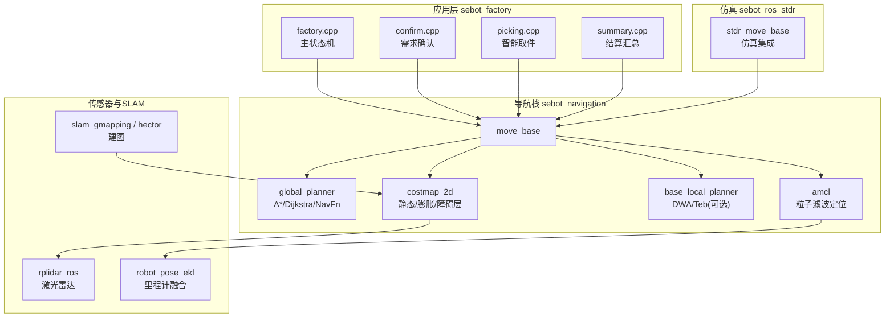
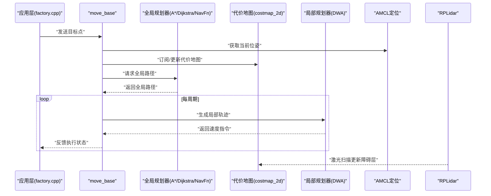
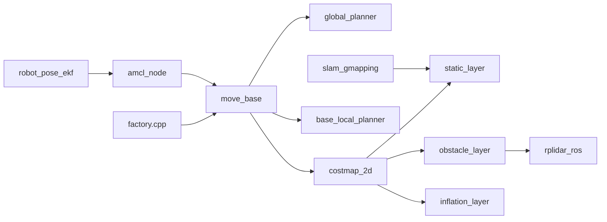

# 路径规划问题诊断

<cite>
**本文引用的文件**   
- [sebot_factory.launch](file://sebot_factory/src/sebot_factory/launch/sebot_factory.launch)
- [factory.cpp](file://sebot_factory/src/sebot_factory/src/factory.cpp)
- [confirm.cpp](file://sebot_factory/src/sebot_factory/src/confirm.cpp)
- [picking.cpp](file://sebot_factory/src/sebot_factory/src/picking.cpp)
- [summary.cpp](file://sebot_factory/src/sebot_factory/src/summary.cpp)
- [move_base 配置与参数](file://sebot_ros_kits/src/sebot_navigation/move_base/cfg/move_base.cfg)
- [costmap_2d 插件配置](file://sebot_ros_kits/src/sebot_navigation/costmap_2d/costmap_plugins.xml)
- [global_planner 插件配置](file://sebot_ros_kits/src/sebot_navigation/global_planner/bgp_plugin.xml)
- [navfn 包结构](file://sebot_ros_kits/src/sebot_navigation/navfn/package.xml)
- [amcl_node 入口](file://sebot_ros_kits/src/sebot_navigation/amcl/src/amcl_node.cpp)
- [base_local_planner 轨迹规划器](file://sebot_ros_kits/src/sebot_navigation/base_local_planner/src/trajectory_planner_ros.cpp)
- [rplidar 节点](file://sebot_ros_kits/src/sebot_driver/rplidar_ros/src/node.cpp)
- [robot_pose_ekf 里程计融合](file://sebot_ros_kits/src/sebot_driver/robot_pose_ekf/src/odom_estimation_node.cpp)
- [slam_gmapping 建图](file://sebot_ros_kits/src/sebot_slam/slam_gmapping/slam_gmapping/slam_gmapping_node.cpp)
- [stdr_move_base 启动配置](file://sebot_ros_stdr/src/sebot_stdr/stdr_move_base/launch/default.launch)
</cite>

## 目录
1. [简介](#简介)
2. [项目结构](#项目结构)
3. [核心组件](#核心组件)
4. [架构总览](#架构总览)
5. [详细组件分析](#详细组件分析)
6. [依赖关系分析](#依赖关系分析)
7. [性能考量](#性能考量)
8. [故障排查指南](#故障排查指南)
9. [结论](#结论)
10. [附录](#附录)

## 简介
本文件面向机器人竞赛系统中的“全局路径规划”问题，聚焦路径规划失败、路径不可行、规划超时等典型症状的根因分析与解决策略。文档覆盖：
- 全局规划器配置（A*、Dijkstra、NavFn）选择与调参
- 代价地图更新策略与障碍物检测阈值
- 地图质量对规划效果的影响
- 动态障碍物处理与狭窄通道通过性
- 规划路径可视化调试、规划时间优化、多目标点规划策略
- 常见场景的参数调优建议与最佳实践

## 项目结构
本项目由三个相互独立的 catkin 工作空间组成：
- sebot_factory：应用层业务节点（状态机、确认、取件、结算等）
- sebot_ros_kits：机器人套件（导航栈、驱动、SLAM、语音、视觉等）
- sebot_ros_stdr：仿真环境（STDR 模拟器及集成）

导航相关的关键目录集中在 sebot_ros_kits/src/sebot_navigation 下，包含 move_base、costmap_2d、global_planner、navfn、amcl、base_local_planner 等；传感器与定位在 sebot_driver 与 sebot_slam 中；仿真集成在 sebot_ros_stdr 中。

图表来源
- [sebot_factory.launch](file://sebot_factory/src/sebot_factory/launch/sebot_factory.launch)
- [factory.cpp](file://sebot_factory/src/sebot_factory/src/factory.cpp)
- [move_base 配置与参数](file://sebot_ros_kits/src/sebot_navigation/move_base/cfg/move_base.cfg)
- [costmap_2d 插件配置](file://sebot_ros_kits/src/sebot_navigation/costmap_2d/costmap_plugins.xml)
- [global_planner 插件配置](file://sebot_ros_kits/src/sebot_navigation/global_planner/bgp_plugin.xml)
- [amcl_node 入口](file://sebot_ros_kits/src/sebot_navigation/amcl/src/amcl_node.cpp)
- [base_local_planner 轨迹规划器](file://sebot_ros_kits/src/sebot_navigation/base_local_planner/src/trajectory_planner_ros.cpp)
- [rplidar 节点](file://sebot_ros_kits/src/sebot_driver/rplidar_ros/src/node.cpp)
- [robot_pose_ekf 里程计融合](file://sebot_ros_kits/src/sebot_driver/robot_pose_ekf/src/odom_estimation_node.cpp)
- [slam_gmapping 建图](file://sebot_ros_kits/src/sebot_slam/slam_gmapping/slam_gmapping/slam_gmapping_node.cpp)
- [stdr_move_base 启动配置](file://sebot_ros_stdr/src/sebot_stdr/stdr_move_base/launch/default.launch)

章节来源
- [sebot_factory.launch](file://sebot_factory/src/sebot_factory/launch/sebot_factory.launch)
- [factory.cpp](file://sebot_factory/src/sebot_factory/src/factory.cpp)

## 核心组件
- 全局规划器（Global Planner）
  - 支持 A*、Dijkstra、NavFn 等算法，通过插件机制切换。关键配置文件位于 global_planner 包与 move_base 参数中。
- 代价地图（Costmap2D）
  - 由静态层、膨胀层、障碍层组合而成，负责将传感器数据与地图信息转化为可规划的代价场。
- 局部规划器（Local Planner）
  - base_local_planner（DWA）或 Teb 等，负责在局部范围内生成安全、可行的轨迹并执行。
- 定位与建图
  - AMCL 提供位姿估计；Gmapping/Hector 提供建图；EKF 融合 IMU 与轮式里程计。
- 传感器
  - RPLidar 提供激光扫描；IMU 辅助姿态估计。

章节来源
- [global_planner 插件配置](file://sebot_ros_kits/src/sebot_navigation/global_planner/bgp_plugin.xml)
- [costmap_2d 插件配置](file://sebot_ros_kits/src/sebot_navigation/costmap_2d/costmap_plugins.xml)
- [base_local_planner 轨迹规划器](file://sebot_ros_kits/src/sebot_navigation/base_local_planner/src/trajectory_planner_ros.cpp)
- [amcl_node 入口](file://sebot_ros_kits/src/sebot_navigation/amcl/src/amcl_node.cpp)
- [rplidar 节点](file://sebot_ros_kits/src/sebot_driver/rplidar_ros/src/node.cpp)
- [robot_pose_ekf 里程计融合](file://sebot_ros_kits/src/sebot_driver/robot_pose_ekf/src/odom_estimation_node.cpp)
- [slam_gmapping 建图](file://sebot_ros_kits/src/sebot_slam/slam_gmapping/slam_gmapping/slam_gmapping_node.cpp)

## 架构总览
全局规划流程从 move_base 发起，读取当前位姿与目标点，基于代价地图调用全局规划器生成粗路径，再由局部规划器细化为可执行轨迹。AMCL 提供位姿，SLAM 提供地图，RPLidar 提供实时障碍观测。

图表来源
- [move_base 配置与参数](file://sebot_ros_kits/src/sebot_navigation/move_base/cfg/move_base.cfg)
- [global_planner 插件配置](file://sebot_ros_kits/src/sebot_navigation/global_planner/bgp_plugin.xml)
- [costmap_2d 插件配置](file://sebot_ros_kits/src/sebot_navigation/costmap_2d/costmap_plugins.xml)
- [base_local_planner 轨迹规划器](file://sebot_ros_kits/src/sebot_navigation/base_local_planner/src/trajectory_planner_ros.cpp)
- [amcl_node 入口](file://sebot_ros_kits/src/sebot_navigation/amcl/src/amcl_node.cpp)
- [rplidar 节点](file://sebot_ros_kits/src/sebot_driver/rplidar_ros/src/node.cpp)

## 详细组件分析

### 全局规划器配置与算法选择
- 算法选项
  - A*：启发式搜索，适合大地图快速求解
  - Dijkstra：无启发式，保证最短代价但计算量较大
  - NavFn：经典势场方法，实现简单但对复杂地形敏感
- 配置要点
  - 在 move_base 参数中选择 planner 插件与对应参数命名空间
  - 调整代价权重、启发式系数、最大扩展步数等
- 常见问题
  - 选择 NavFn 时易陷入局部极小值
  - Dijkstra 在高分辨率地图下耗时显著
  - A* 启发式不当导致次优路径

章节来源
- [global_planner 插件配置](file://sebot_ros_kits/src/sebot_navigation/global_planner/bgp_plugin.xml)
- [move_base 配置与参数](file://sebot_ros_kits/src/sebot_navigation/move_base/cfg/move_base.cfg)

### 代价地图更新策略与障碍物检测阈值
- 层级结构
  - 静态层：加载地图，固定不变
  - 膨胀层：根据机器人半径与安全距离进行膨胀
  - 障碍层：融合激光/深度数据，实时更新
- 更新频率与范围
  - 设置合适的更新频率与观察区域，避免过度刷新
- 阈值设置
  - 激光探测阈值影响障碍识别灵敏度
  - 膨胀半径需匹配机器人尺寸与运动学约束

章节来源
- [costmap_2d 插件配置](file://sebot_ros_kits/src/sebot_navigation/costmap_2d/costmap_plugins.xml)
- [rplidar 节点](file://sebot_ros_kits/src/sebot_driver/rplidar_ros/src/node.cpp)

### 地图质量对规划效果的影响
- 分辨率与精度
  - 过低分辨率导致通道误判，过高分辨率增加计算负担
- 标注准确性
  - 静态层标注错误会直接导致全局路径不可行
- 动态元素处理
  - 临时障碍应依赖障碍层而非静态层

章节来源
- [slam_gmapping 建图](file://sebot_ros_kits/src/sebot_slam/slam_gmapping/slam_gmapping/slam_gmapping_node.cpp)

### 动态障碍物处理
- 实时感知
  - 使用激光/深度传感器更新障碍层
- 局部重规划
  - 局部规划器在遇到动态障碍时进行短期避障
- 全局重规划触发条件
  - 当局部无法找到可行轨迹时触发全局重规划

章节来源
- [base_local_planner 轨迹规划器](file://sebot_ros_kits/src/sebot_navigation/base_local_planner/src/trajectory_planner_ros.cpp)
- [costmap_2d 插件配置](file://sebot_ros_kits/src/sebot_navigation/costmap_2d/costmap_plugins.xml)

### 狭窄通道通过性问题
- 膨胀半径设置
  - 过大的膨胀半径会导致通道被误判为不可通行
- 机器人模型
  - 确保 footprint 与实际尺寸一致
- 代价权重调整
  - 适当降低通道内代价以鼓励通过

章节来源
- [costmap_2d 插件配置](file://sebot_ros_kits/src/sebot_navigation/costmap_2d/costmap_plugins.xml)

### 规划路径可视化调试
- RViz 显示
  - 启用 Global Plan、Local Plan、Costmap 等图层
- 日志与指标
  - 记录规划耗时、路径长度、重规划次数
- 交互式工具
  - 使用 2D Goal 和 Set Pose 进行快速验证

章节来源
- [sebot_factory.launch](file://sebot_factory/src/sebot_factory/launch/sebot_factory.launch)

### 规划时间优化
- 算法选择
  - 大地图优先 A*，小地图可用 Dijkstra
- 地图分块
  - 使用分层代价地图减少计算范围
- 参数调优
  - 限制最大扩展步数、调整启发式系数

章节来源
- [global_planner 插件配置](file://sebot_ros_kits/src/sebot_navigation/global_planner/bgp_plugin.xml)

### 多目标点规划策略
- 任务序列
  - 按订单顺序生成目标点队列
- 中间点优化
  - 合并相邻目标点减少重规划
- 优先级管理
  - 高优先级任务中断低优先级任务

章节来源
- [factory.cpp](file://sebot_factory/src/sebot_factory/src/factory.cpp)

## 依赖关系分析
全局规划涉及多个模块的紧密协作，任何一环异常都可能导致规划失败。

图表来源
- [factory.cpp](file://sebot_factory/src/sebot_factory/src/factory.cpp)
- [move_base 配置与参数](file://sebot_ros_kits/src/sebot_navigation/move_base/cfg/move_base.cfg)
- [global_planner 插件配置](file://sebot_ros_kits/src/sebot_navigation/global_planner/bgp_plugin.xml)
- [costmap_2d 插件配置](file://sebot_ros_kits/src/sebot_navigation/costmap_2d/costmap_plugins.xml)
- [amcl_node 入口](file://sebot_ros_kits/src/sebot_navigation/amcl/src/amcl_node.cpp)
- [rplidar 节点](file://sebot_ros_kits/src/sebot_driver/rplidar_ros/src/node.cpp)
- [robot_pose_ekf 里程计融合](file://sebot_ros_kits/src/sebot_driver/robot_pose_ekf/src/odom_estimation_node.cpp)
- [slam_gmapping 建图](file://sebot_ros_kits/src/sebot_slam/slam_gmapping/slam_gmapping/slam_gmapping_node.cpp)

## 性能考量
- 计算复杂度
  - A* O(b^d)，Dijkstra O(V^2)，NavFn O(N)
- 内存占用
  - 高分辨率地图与多层代价地图占用大量内存
- 实时性
  - 规划频率与传感器更新频率需协调
- 资源限制
  - 嵌入式平台需限制地图大小与算法复杂度

## 故障排查指南

### 路径规划失败
- 现象
  - 全局规划器无法找到路径
- 可能原因
  - 起点或终点位于障碍物内
  - 代价地图膨胀半径过大
  - 地图标注错误
- 解决方法
  - 检查起点/终点位姿
  - 调整膨胀半径
  - 修正静态地图

章节来源
- [costmap_2d 插件配置](file://sebot_ros_kits/src/sebot_navigation/costmap_2d/costmap_plugins.xml)

### 路径不可行
- 现象
  - 全局路径存在但局部无法跟踪
- 可能原因
  - 局部规划器参数过于保守
  - 动态障碍物干扰
  - 机器人动力学限制
- 解决方法
  - 调整局部规划器参数
  - 提高传感器更新频率
  - 检查机器人模型

章节来源
- [base_local_planner 轨迹规划器](file://sebot_ros_kits/src/sebot_navigation/base_local_planner/src/trajectory_planner_ros.cpp)

### 规划超时
- 现象
  - 全局规划器计算时间过长
- 可能原因
  - 地图分辨率过高
  - 算法参数设置不当
  - 系统资源不足
- 解决方法
  - 降低地图分辨率
  - 调整算法参数
  - 优化系统性能

章节来源
- [global_planner 插件配置](file://sebot_ros_kits/src/sebot_navigation/global_planner/bgp_plugin.xml)

### 定位漂移导致规划失败
- 现象
  - 定位不准确导致路径规划异常
- 可能原因
  - AMCL 参数设置不当
  - 传感器噪声过大
  - 地图与真实环境不一致
- 解决方法
  - 调整 AMCL 参数
  - 校准传感器
  - 更新地图

章节来源
- [amcl_node 入口](file://sebot_ros_kits/src/sebot_navigation/amcl/src/amcl_node.cpp)

### 狭窄通道卡住
- 现象
  - 机器人在狭窄通道中无法通过
- 可能原因
  - 膨胀半径过大
  - 局部规划器参数不合理
  - 传感器遮挡
- 解决方法
  - 减小膨胀半径
  - 调整局部规划器参数
  - 改善传感器布局

章节来源
- [costmap_2d 插件配置](file://sebot_ros_kits/src/sebot_navigation/costmap_2d/costmap_plugins.xml)

## 结论
全局路径规划是机器人导航系统的核心环节，其稳定性与效率直接影响机器人的整体表现。通过合理配置全局规划器、优化代价地图、调整传感器阈值、改进地图质量等手段，可以有效解决路径规划失败、路径不可行、规划超时等问题。在实际应用中，应根据具体场景选择合适的算法与参数，并结合可视化调试工具进行持续优化。

## 附录

### 常见场景参数调优建议
- 大地图快速导航
  - 使用 A* 算法
  - 提高启发式权重
  - 限制最大扩展步数
- 高精度路径要求
  - 使用 Dijkstra 算法
  - 提高地图分辨率
  - 减小膨胀半径
- 动态环境适应
  - 提高传感器更新频率
  - 调整局部规划器参数
  - 启用实时重规划

### 最佳实践
- 地图质量优先
  - 定期更新地图
  - 确保标注准确性
- 参数渐进调优
  - 从小范围开始测试
  - 逐步扩大测试范围
- 监控与日志
  - 记录关键指标
  - 建立故障数据库
- 仿真验证
  - 在仿真环境中充分测试
  - 验证边界情况

章节来源
- [sebot_factory.launch](file://sebot_factory/src/sebot_factory/launch/sebot_factory.launch)
- [factory.cpp](file://sebot_factory/src/sebot_factory/src/factory.cpp)
- [confirm.cpp](file://sebot_factory/src/sebot_factory/src/confirm.cpp)
- [picking.cpp](file://sebot_factory/src/sebot_factory/src/picking.cpp)
- [summary.cpp](file://sebot_factory/src/sebot_factory/src/summary.cpp)