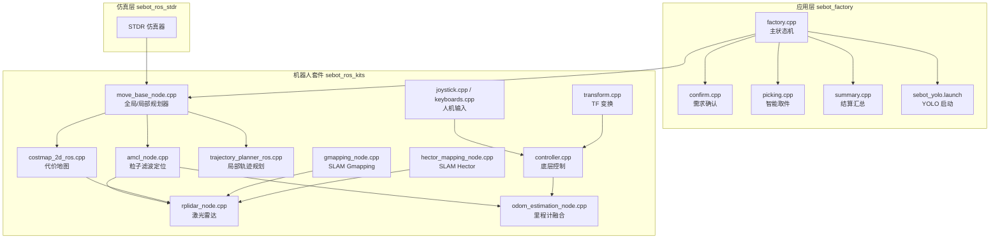
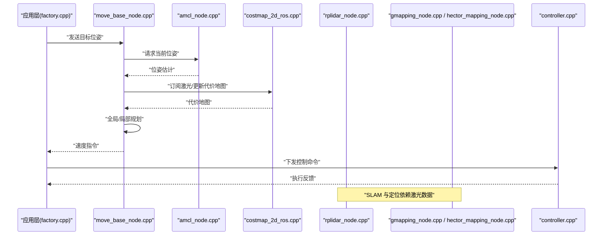
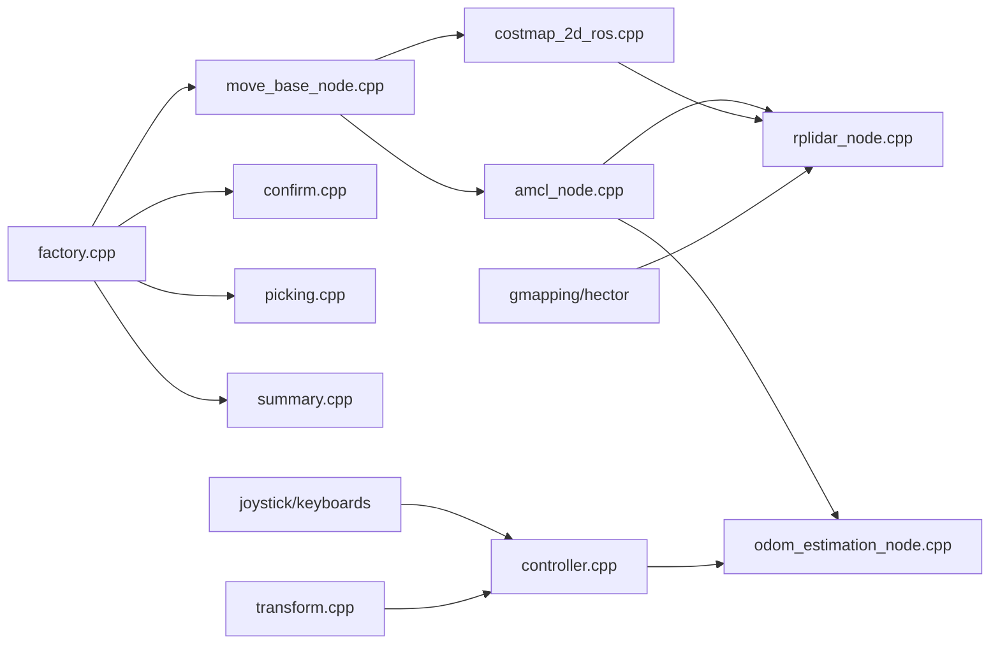

# 性能优化与监控

<cite>
**本文引用的文件**   
- [sebot_factory.launch](file://sebot_factory/src/sebot_factory/launch/sebot_factory.launch)
- [factory.cpp](file://sebot_factory/src/sebot_factory/src/factory.cpp)
- [confirm.cpp](file://sebot_factory/src/sebot_factory/src/confirm.cpp)
- [picking.cpp](file://sebot_factory/src/sebot_factory/src/picking.cpp)
- [summary.cpp](file://sebot_factory/src/sebot_factory/src/summary.cpp)
- [sebot_yolo.launch](file://sebot_factory/src/sebot_factory/launch/sebot_yolo.launch)
- [io_paddle.json](file://sebot_factory/src/sebot_factory/res/inference/io_paddle.json)
- [deploy_paddle.ro](file://sebot_factory/src/sebot_factory/res/inference/deploy_paddle.ro)
- [label_list.txt](file://sebot_factory/src/sebot_factory/res/inference/label_list.txt)
- [sebot_marking.launch](file://sebot_marking/src/sebot_marking/launch/sebot_marking.launch)
- [qnode.hpp](file://sebot_marking/src/sebot_marking/include/qnode.hpp)
- [slam.h](file://sebot_marking/src/sebot_marking/include/slam.h)
- [CCtrlDashBoard.cpp](file://sebot_marking/src/sebot_marking/src/CCtrlDashBoard.cpp)
- [main.cpp](file://sebot_marking/src/sebot_marking/src/main.cpp)
- [move_base_node.cpp](file://sebot_ros_kits/src/sebot_navigation/move_base/src/move_base_node.cpp)
- [amcl_node.cpp](file://sebot_ros_kits/src/sebot_navigation/amcl/src/amcl_node.cpp)
- [costmap_2d_ros.cpp](file://sebot_ros_kits/src/sebot_navigation/costmap_2d/src/costmap_2d_ros.cpp)
- [trajectory_planner_ros.cpp](file://sebot_ros_kits/src/sebot_navigation/base_local_planner/src/trajectory_planner_ros.cpp)
- [rplidar_node.cpp](file://sebot_ros_kits/src/sebot_driver/rplidar_ros/src/node.cpp)
- [odom_estimation_node.cpp](file://sebot_ros_kits/src/sebot_driver/robot_pose_ekf/src/odom_estimation_node.cpp)
- [gmapping_node.cpp](file://sebot_ros_kits/src/sebot_slam/slam_gmapping/slam_gmapping/gmapping_node.cpp)
- [hector_mapping_node.cpp](file://sebot_ros_kits/src/sebot_slam/slam_hector/hector_mapping/src/hector_mapping_node.cpp)
- [controller.cpp](file://sebot_ros_kits/src/sebot_robot/src/controller.cpp)
- [joystick.cpp](file://sebot_ros_kits/src/sebot_robot/src/joystick.cpp)
- [keyboards.cpp](file://sebot_ros_kits/src/sebot_robot/src/keyboards.cpp)
- [transform.cpp](file://sebot_ros_kits/src/sebot_robot/src/transform.cpp)
</cite>

## 目录
1. [简介](#简介)
2. [项目结构](#项目结构)
3. [核心组件](#核心组件)
4. [架构总览](#架构总览)
5. [详细组件分析](#详细组件分析)
6. [依赖关系分析](#依赖关系分析)
7. [性能考量](#性能考量)
8. [故障排查指南](#故障排查指南)
9. [结论](#结论)
10. [附录](#附录)

## 简介
本文件面向机器人竞赛系统，聚焦性能优化与监控。围绕 CPU 占用率、内存使用、磁盘 I/O、ROS 节点执行时间、消息传递延迟、计算密集型任务（SLAM 建图、视觉推理、导航算法）展开，给出诊断方法、调优策略与持续优化流程。系统由三层 catkin 工作空间组成：应用层 sebot_factory、机器人套件 sebot_ros_kits、仿真层 sebot_ros_stdr。比赛业务全链路为“上电自检 → 加载地图与 AMCL 定位 → 按订单导航至取件台 → 需求确认 → YOLO 视觉搜索（NPU 加速 Yolov3，多帧检测确认）→ 机械臂 PID 闭环抓取 → 导航送达并结算”，主状态机基于 MultiNavi 实现于 factory.cpp。运行配置集中在 launch/sebot_factory.launch，包含 simulation、debug、导航超时、PID、取件距离、补扫等关键参数。

## 项目结构
- 应用层 sebot_factory：工厂业务状态机、订单处理、YOLO 推理集成、任务编排与总结。
- 机器人套件 sebot_ros_kits：驱动与传感器（RPLidar、IMU、里程计 EKF）、导航栈（move_base、AMCL、DWA）、SLAM（Gmapping/Hector）、机器人控制（控制器、键盘/摇杆输入）。
- 仿真层 sebot_ros_stdr：STDR 仿真环境、GUI、导航与 SLAM 的仿真集成。

图表来源 
- [move_base_node.cpp](file://sebot_ros_kits/src/sebot_navigation/move_base/src/move_base_node.cpp)
- [amcl_node.cpp](file://sebot_ros_kits/src/sebot_navigation/amcl/src/amcl_node.cpp)
- [costmap_2d_ros.cpp](file://sebot_ros_kits/src/sebot_navigation/costmap_2d/src/costmap_2d_ros.cpp)
- [trajectory_planner_ros.cpp](file://sebot_ros_kits/src/sebot_navigation/base_local_planner/src/trajectory_planner_ros.cpp)
- [rplidar_node.cpp](file://sebot_ros_kits/src/sebot_driver/rplidar_ros/src/node.cpp)
- [odom_estimation_node.cpp](file://sebot_ros_kits/src/sebot_driver/robot_pose_ekf/src/odom_estimation_node.cpp)
- [gmapping_node.cpp](file://sebot_ros_kits/src/sebot_slam/slam_gmapping/slam_gmapping/gmapping_node.cpp)
- [hector_mapping_node.cpp](file://sebot_ros_kits/src/sebot_slam/slam_hector/hector_mapping/src/hector_mapping_node.cpp)
- [controller.cpp](file://sebot_ros_kits/src/sebot_robot/src/controller.cpp)
- [joystick.cpp](file://sebot_ros_kits/src/sebot_robot/src/joystick.cpp)
- [keyboards.cpp](file://sebot_ros_kits/src/sebot_robot/src/keyboards.cpp)
- [transform.cpp](file://sebot_ros_kits/src/sebot_robot/src/transform.cpp)

章节来源
- [sebot_factory.launch](file://sebot_factory/src/sebot_factory/launch/sebot_factory.launch)
- [factory.cpp](file://sebot_factory/src/sebot_factory/src/factory.cpp)

## 核心组件
- 工厂主状态机（factory.cpp）：串联导航、确认、取件、结算；通过 MultiNavi 协调 move_base 与子任务。
- 需求确认（confirm.cpp）：交互或规则判定是否满足取件条件，影响后续分支。
- 智能取件（picking.cpp）：结合视觉与机械臂控制，完成抓取动作。
- 结算汇总（summary.cpp）：统计任务结果，输出日志与指标。
- YOLO 推理（sebot_yolo.launch + io_paddle.json + deploy_paddle.ro + label_list.txt）：NPU 加速推理，多帧确认提升鲁棒性。
- 导航栈（move_base + AMCL + DWA + costmap_2d）：全局路径规划、局部避障、代价地图更新。
- SLAM（Gmapping/Hector）：在线建图与位姿估计。
- 传感器与控制（RPLidar、EKF 里程计、控制器、输入设备、TF）：提供感知与执行能力。

章节来源
- [factory.cpp](file://sebot_factory/src/sebot_factory/src/factory.cpp)
- [confirm.cpp](file://sebot_factory/src/sebot_factory/src/confirm.cpp)
- [picking.cpp](file://sebot_factory/src/sebot_factory/src/picking.cpp)
- [summary.cpp](file://sebot_factory/src/sebot_factory/src/summary.cpp)
- [sebot_yolo.launch](file://sebot_factory/src/sebot_factory/launch/sebot_yolo.launch)
- [io_paddle.json](file://sebot_factory/src/sebot_factory/res/inference/io_paddle.json)
- [deploy_paddle.ro](file://sebot_factory/src/sebot_factory/res/inference/deploy_paddle.ro)
- [label_list.txt](file://sebot_factory/src/sebot_factory/res/inference/label_list.txt)

## 架构总览
下图展示从应用层到导航、SLAM、传感器与控制的关键数据流与调用关系，便于定位性能瓶颈与优化点。

图表来源 
- [move_base_node.cpp](file://sebot_ros_kits/src/sebot_navigation/move_base/src/move_base_node.cpp)
- [amcl_node.cpp](file://sebot_ros_kits/src/sebot_navigation/amcl/src/amcl_node.cpp)
- [costmap_2d_ros.cpp](file://sebot_ros_kits/src/sebot_navigation/costmap_2d/src/costmap_2d_ros.cpp)
- [rplidar_node.cpp](file://sebot_ros_kits/src/sebot_driver/rplidar_ros/src/node.cpp)
- [gmapping_node.cpp](file://sebot_ros_kits/src/sebot_slam/slam_gmapping/slam_gmapping/gmapping_node.cpp)
- [hector_mapping_node.cpp](file://sebot_ros_kits/src/sebot_slam/slam_hector/hector_mapping/src/hector_mapping_node.cpp)
- [controller.cpp](file://sebot_ros_kits/src/sebot_robot/src/controller.cpp)

## 详细组件分析

### 工厂主状态机与任务编排（factory.cpp）
- 职责：串联导航、确认、取件、结算；管理超时、重试与错误恢复。
- 性能关注点：
  - 状态切换频率与阻塞调用避免。
  - 与 move_base 的交互周期与超时阈值。
  - 子任务并行化与资源竞争（CPU/内存）。
- 优化建议：
  - 将耗时操作（如大图像预处理、模型加载）前置或异步化。
  - 合理设置导航超时与重规划间隔，避免频繁重算。
  - 使用线程池或队列解耦高负载模块。

章节来源
- [factory.cpp](file://sebot_factory/src/sebot_factory/src/factory.cpp)

### 需求确认（confirm.cpp）
- 职责：根据规则或交互确认是否满足取件条件。
- 性能关注点：
  - 条件判断逻辑复杂度与 IO 访问。
  - 与 UI/上位机的通信延迟。
- 优化建议：
  - 缓存易变但低频更新的配置。
  - 减少不必要的 ROS 服务调用，合并批量查询。

章节来源
- [confirm.cpp](file://sebot_factory/src/sebot_factory/src/confirm.cpp)

### 智能取件（picking.cpp）
- 职责：视觉引导与机械臂控制协同，完成抓取。
- 性能关注点：
  - 视觉推理与图像处理开销。
  - 机械臂 PID 控制循环频率与稳定性。
- 优化建议：
  - 降低图像分辨率或采用 ROI 裁剪。
  - 使用 NPU 加速推理（见 YOLO 部分）。
  - 控制环与视觉环分离，避免互相阻塞。

章节来源
- [picking.cpp](file://sebot_factory/src/sebot_factory/src/picking.cpp)

### 结算汇总（summary.cpp）
- 职责：统计任务指标、生成报告。
- 性能关注点：
  - 日志写入频率与磁盘 I/O。
- 优化建议：
  - 批量落盘与异步写入。
  - 限制高频日志级别，仅保留关键指标。

章节来源
- [summary.cpp](file://sebot_factory/src/sebot_factory/src/summary.cpp)

### YOLO 视觉推理（sebot_yolo.launch + io_paddle.json + deploy_paddle.ro + label_list.txt）
- 职责：NPU 加速 Yolov3 推理，多帧检测确认提升鲁棒性。
- 性能关注点：
  - 模型加载与初始化耗时。
  - 推理帧率与内存占用。
  - 标签列表与输入输出配置。
- 优化建议：
  - 预热模型，复用会话。
  - 调整输入尺寸与批大小。
  - 使用量化模型或更轻量 backbone。
  - 多帧确认时采用滑动窗口与置信度阈值。

章节来源
- [sebot_yolo.launch](file://sebot_factory/src/sebot_factory/launch/sebot_yolo.launch)
- [io_paddle.json](file://sebot_factory/src/sebot_factory/res/inference/io_paddle.json)
- [deploy_paddle.ro](file://sebot_factory/src/sebot_factory/res/inference/deploy_paddle.ro)
- [label_list.txt](file://sebot_factory/src/sebot_factory/res/inference/label_list.txt)

### 导航栈（move_base + AMCL + DWA + costmap_2d）
- 职责：全局路径规划、局部避障、代价地图更新、定位。
- 性能关注点：
  - 代价地图更新频率与分辨率。
  - 局部规划采样数与轨迹评估开销。
  - AMCL 粒子数与重采样频率。
- 优化建议：
  - 降低代价地图分辨率或限制更新区域。
  - 调整 DWA 采样参数与最大轨迹长度。
  - 动态调节 AMCL 粒子数（静止时减少，运动时增加）。

章节来源
- [move_base_node.cpp](file://sebot_ros_kits/src/sebot_navigation/move_base/src/move_base_node.cpp)
- [amcl_node.cpp](file://sebot_ros_kits/src/sebot_navigation/amcl/src/amcl_node.cpp)
- [costmap_2d_ros.cpp](file://sebot_ros_kits/src/sebot_navigation/costmap_2d/src/costmap_2d_ros.cpp)
- [trajectory_planner_ros.cpp](file://sebot_ros_kits/src/sebot_navigation/base_local_planner/src/trajectory_planner_ros.cpp)

### SLAM 建图（Gmapping/Hector）
- 职责：在线建图与位姿估计。
- 性能关注点：
  - 激光点云规模与扫描频率。
  - 地图栅格分辨率与更新策略。
- 优化建议：
  - 降低激光分辨率或降采样。
  - 调整匹配窗口与迭代次数。
  - 在稳定场景下降低更新频率。

章节来源
- [gmapping_node.cpp](file://sebot_ros_kits/src/sebot_slam/slam_gmapping/slam_gmapping/gmapping_node.cpp)
- [hector_mapping_node.cpp](file://sebot_ros_kits/src/sebot_slam/slam_hector/hector_mapping/src/hector_mapping_node.cpp)

### 传感器与控制（RPLidar、EKF 里程计、控制器、输入设备、TF）
- 职责：数据采集、融合、控制执行与坐标变换。
- 性能关注点：
  - 激光数据吞吐与丢包。
  - EKF 滤波频率与协方差更新。
  - 控制环延迟与抖动。
- 优化建议：
  - 合理设置激光订阅频率与缓冲区大小。
  - 调整 EKF 噪声参数与观测频率。
  - 控制环与感知环解耦，避免锁竞争。

章节来源
- [rplidar_node.cpp](file://sebot_ros_kits/src/sebot_driver/rplidar_ros/src/node.cpp)
- [odom_estimation_node.cpp](file://sebot_ros_kits/src/sebot_driver/robot_pose_ekf/src/odom_estimation_node.cpp)
- [controller.cpp](file://sebot_ros_kits/src/sebot_robot/src/controller.cpp)
- [joystick.cpp](file://sebot_ros_kits/src/sebot_robot/src/joystick.cpp)
- [keyboards.cpp](file://sebot_ros_kits/src/sebot_robot/src/keyboards.cpp)
- [transform.cpp](file://sebot_ros_kits/src/sebot_robot/src/transform.cpp)

### 建图标注上位机（sebot_marking）
- 职责：Qt 界面进行地图标注与可视化。
- 性能关注点：
  - GUI 渲染与事件循环。
  - 大量图像/地图数据的显示与交互。
- 优化建议：
  - 使用异步加载与懒渲染。
  - 限制同时显示的图层数量。
  - 合理设置刷新频率与缩放级别。

章节来源
- [sebot_marking.launch](file://sebot_marking/src/sebot_marking/launch/sebot_marking.launch)
- [qnode.hpp](file://sebot_marking/src/sebot_marking/include/qnode.hpp)
- [slam.h](file://sebot_marking/src/sebot_marking/include/slam.h)
- [CCtrlDashBoard.cpp](file://sebot_marking/src/sebot_marking/src/CCtrlDashBoard.cpp)
- [main.cpp](file://sebot_marking/src/sebot_marking/src/main.cpp)

## 依赖关系分析
- 应用层依赖导航与 SLAM 提供的位姿与地图信息。
- 导航依赖代价地图与定位结果，定位依赖激光与里程计融合。
- SLAM 依赖激光数据与 IMU/里程计。
- 控制依赖 TF 与底层执行器。

图表来源 
- [factory.cpp](file://sebot_factory/src/sebot_factory/src/factory.cpp)
- [move_base_node.cpp](file://sebot_ros_kits/src/sebot_navigation/move_base/src/move_base_node.cpp)
- [amcl_node.cpp](file://sebot_ros_kits/src/sebot_navigation/amcl/src/amcl_node.cpp)
- [costmap_2d_ros.cpp](file://sebot_ros_kits/src/sebot_navigation/costmap_2d/src/costmap_2d_ros.cpp)
- [rplidar_node.cpp](file://sebot_ros_kits/src/sebot_driver/rplidar_ros/src/node.cpp)
- [odom_estimation_node.cpp](file://sebot_ros_kits/src/sebot_driver/robot_pose_ekf/src/odom_estimation_node.cpp)
- [gmapping_node.cpp](file://sebot_ros_kits/src/sebot_slam/slam_gmapping/slam_gmapping/gmapping_node.cpp)
- [hector_mapping_node.cpp](file://sebot_ros_kits/src/sebot_slam/slam_hector/hector_mapping/src/hector_mapping_node.cpp)
- [controller.cpp](file://sebot_ros_kits/src/sebot_robot/src/controller.cpp)
- [joystick.cpp](file://sebot_ros_kits/src/sebot_robot/src/joystick.cpp)
- [keyboards.cpp](file://sebot_ros_kits/src/sebot_robot/src/keyboards.cpp)
- [transform.cpp](file://sebot_ros_kits/src/sebot_robot/src/transform.cpp)

## 性能考量

### CPU 占用率分析与优化
- 分析方法：
  - 使用 top/htop 观察各进程 CPU 使用率。
  - 使用 perf 或 gprof 对热点函数进行剖析。
- 优化要点：
  - 识别高 CPU 模块（SLAM、视觉推理、局部规划）。
  - 降低循环频率或采样密度。
  - 使用多线程/并行化与 SIMD 优化。

### 内存使用监控与优化
- 分析方法：
  - 使用 valgrind 或 massif 检测内存泄漏与峰值。
  - 监控 ROS 节点内存增长趋势。
- 优化要点：
  - 避免频繁分配/释放大对象。
  - 使用对象池与内存池。
  - 及时释放图像与点云缓冲。

### 磁盘 I/O 性能优化
- 分析方法：
  - 使用 iostat 与iotop 观察读写延迟与吞吐。
  - 记录日志与地图保存的频率与大小。
- 优化要点：
  - 批量写入与异步落盘。
  - 降低日志级别与频率。
  - 使用 SSD 与独立分区。

### ROS 节点执行时间与消息延迟测量
- 分析方法：
  - 使用 rosbag 录制与 rosbw/plot 分析消息到达时间。
  - 在关键路径插入时间戳，统计端到端延迟。
- 优化要点：
  - 调整发布/订阅频率与缓冲区大小。
  - 减少跨进程通信开销（共享内存/零拷贝）。
  - 避免阻塞式 I/O 在回调中。

### 计算密集型任务优化（SLAM、视觉推理、导航）
- SLAM：
  - 降低激光分辨率与扫描频率。
  - 调整匹配窗口与迭代次数。
- 视觉推理：
  - 使用 NPU 加速与量化模型。
  - 多帧确认与 ROI 裁剪。
- 导航：
  - 调整代价地图分辨率与更新策略。
  - 优化 DWA 采样与轨迹评估。

### 基准测试与持续优化
- 建立基准场景（固定地图、固定任务序列）。
- 定期回归测试，记录关键指标（帧率、延迟、CPU/内存）。
- 引入自动化性能监控与告警。

## 故障排查指南
- 常见问题：
  - 导航卡顿：检查代价地图更新频率与局部规划参数。
  - 定位漂移：调整 AMCL 粒子数与激光质量。
  - 视觉误检：调整阈值与多帧确认策略。
  - 控制抖动：检查 PID 参数与控制环频率。
- 排查步骤：
  - 使用 rqt_graph 与 rqt_plot 观察节点与信号。
  - 使用 rostopic echo 与 rosbag 回放定位问题。
  - 逐步禁用非关键模块以隔离瓶颈。

## 结论
通过分层监控与针对性优化，可显著提升机器人竞赛系统的实时性与稳定性。重点在于平衡感知、规划与控制的频率与精度，合理使用硬件加速与并行化，建立完善的基准与持续优化机制。

## 附录

### 关键参数说明（来自 sebot_factory.launch）
- simulation：切换 STDR 仿真模式。
- debug：控制图像识别界面开关。
- 导航超时：影响全局/局部规划的重试与恢复。
- PID：机械臂抓取控制参数。
- 取件距离：触发抓取的条件阈值。
- 补扫：建图过程中的额外扫描策略。

章节来源
- [sebot_factory.launch](file://sebot_factory/src/sebot_factory/launch/sebot_factory.launch)