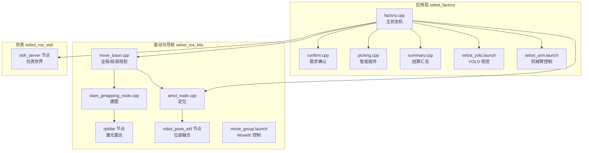
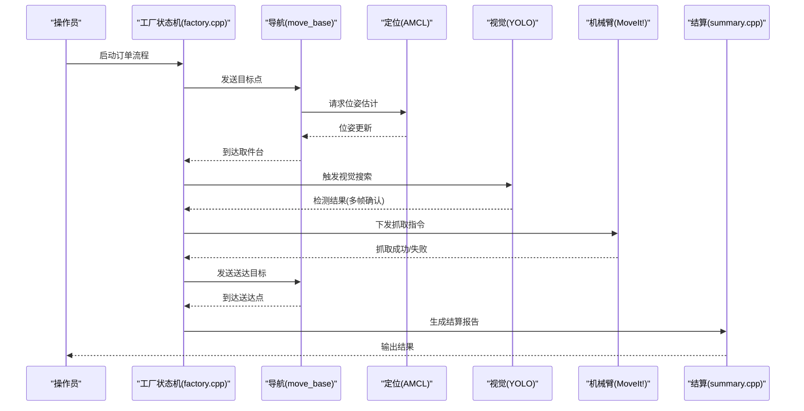
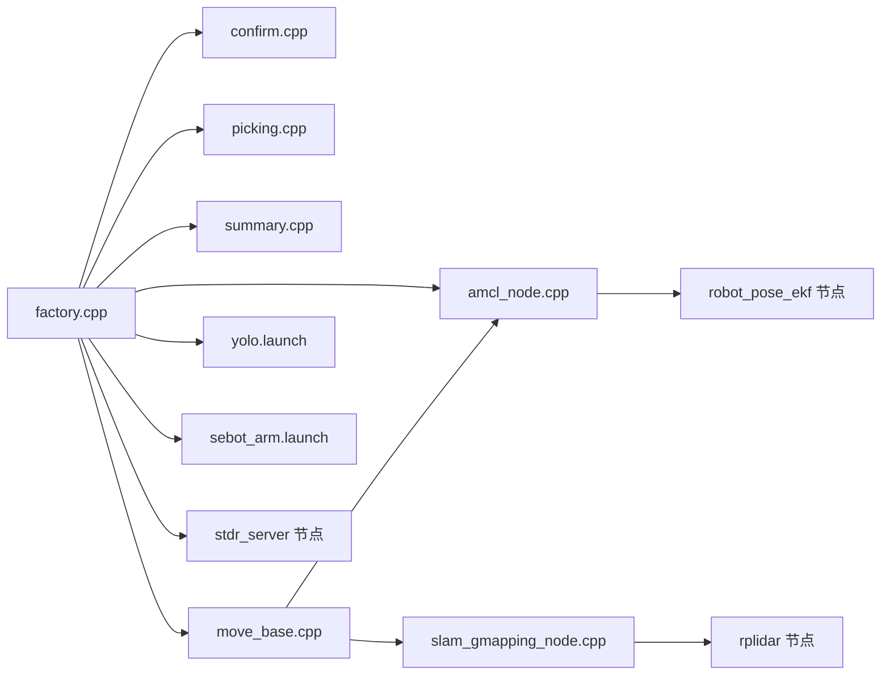
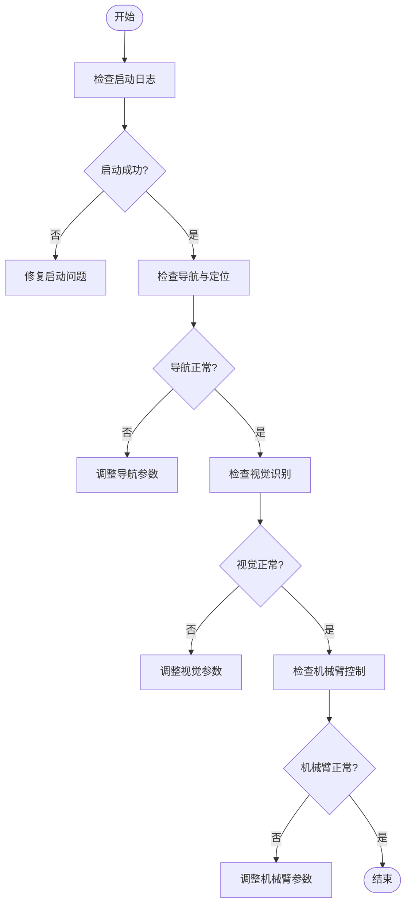

# 故障排除

<cite>
**本文引用的文件**   
- [sebot_factory.launch](file://sebot_factory/src/sebot_factory/launch/sebot_factory.launch)
- [factory.cpp](file://sebot_factory/src/sebot_factory/src/factory.cpp)
- [confirm.cpp](file://sebot_factory/src/sebot_factory/src/confirm.cpp)
- [picking.cpp](file://sebot_factory/src/sebot_factory/src/picking.cpp)
- [summary.cpp](file://sebot_factory/src/sebot_factory/src/summary.cpp)
- [yolo.launch](file://sebot_factory/src/sebot_factory/launch/sebot_yolo.launch)
- [sebot_arm.launch](file://sebot_factory/src/sebot_factory/launch/sebot_arm.launch)
- [sebot_urdf.launch](file://sebot_ros_kits/src/sebot_robot/launch/sebot_urdf.launch)
- [move_group.launch](file://sebot_ros_kits/src/sebot_driver/sebot_talon_moveit/launch/move_group.launch)
- [amcl_node.cpp](file://sebot_ros_kits/src/sebot_navigation/amcl/src/amcl_node.cpp)
- [move_base.cpp](file://sebot_ros_kits/src/sebot_navigation/move_base/src/move_base.cpp)
- [gmapping 节点](file://sebot_ros_kits/src/sebot_slam/slam_gmapping/slam_gmapping/slam_gmapping_node.cpp)
- [rplidar 节点](file://sebot_ros_kits/src/sebot_driver/rplidar_ros/src/node.cpp)
- [robot_pose_ekf 节点](file://sebot_ros_kits/src/sebot_driver/robot_pose_ekf/src/odom_estimation_node.cpp)
- [stdr_server 节点](file://sebot_ros_stdr/src/sebot_stdr/stdr_server/src/stdr_server_node.cpp)
</cite>

## 目录
1. [简介](#简介)
2. [项目结构](#项目结构)
3. [核心组件](#核心组件)
4. [架构总览](#架构总览)
5. [详细组件分析](#详细组件分析)
6. [依赖关系分析](#依赖关系分析)
7. [性能考虑](#性能考虑)
8. [故障排除指南](#故障排除指南)
9. [结论](#结论)
10. [附录](#附录)

## 简介
本故障排除文档面向机器人竞赛系统，覆盖启动失败、导航异常、视觉识别错误、机械臂控制问题等常见故障。文档提供症状描述、可能原因与解决步骤，并给出日志分析方法（ROS 日志、系统日志、性能监控）、调试工具使用（rosnode、rostopic、rviz、rqt）以及性能瓶颈诊断方法（CPU 占用、内存泄漏、通信延迟）。同时包含问题排查流程图和常见错误代码对照表，并提供社区支持与反馈渠道。

## 项目结构
本项目由三个相互独立的 catkin 工作空间组成：
- sebot_factory：应用层业务（订单状态机、需求确认、智能取件、结算汇总、YOLO 视觉、机械臂控制集成）
- sebot_ros_kits：机器人驱动与导航栈（RPLidar、IMU、里程计 EKF、AMCL、DWA、MoveIt!、SLAM）
- sebot_ros_stdr：STDR 仿真环境与服务

运行配置集中在 launch 文件中，如 sebot_factory.launch 用于切换仿真模式、开启调试界面、设置导航超时、PID、取件距离、补扫参数等关键项。

图表来源
- [sebot_factory.launch](file://sebot_factory/src/sebot_factory/launch/sebot_factory.launch)
- [factory.cpp](file://sebot_factory/src/sebot_factory/src/factory.cpp)
- [amcl_node.cpp](file://sebot_ros_kits/src/sebot_navigation/amcl/src/amcl_node.cpp)
- [move_base.cpp](file://sebot_ros_kits/src/sebot_navigation/move_base/src/move_base.cpp)
- [gmapping 节点](file://sebot_ros_kits/src/sebot_slam/slam_gmapping/slam_gmapping/slam_gmapping_node.cpp)
- [rplidar 节点](file://sebot_ros_kits/src/sebot_driver/rplidar_ros/src/node.cpp)
- [robot_pose_ekf 节点](file://sebot_ros_kits/src/sebot_driver/robot_pose_ekf/src/odom_estimation_node.cpp)
- [stdr_server 节点](file://sebot_ros_stdr/src/sebot_stdr/stdr_server/src/stdr_server_node.cpp)

章节来源
- [sebot_factory.launch](file://sebot_factory/src/sebot_factory/launch/sebot_factory.launch)
- [factory.cpp](file://sebot_factory/src/sebot_factory/src/factory.cpp)

## 核心组件
- 工厂主状态机（factory.cpp）：协调订单流程、导航、视觉、抓取与结算；通过 MultiNavi 实现多目标导航。
- 需求确认（confirm.cpp）：与用户交互或传感器触发确认任务条件。
- 智能取件（picking.cpp）：调用视觉结果与机械臂控制完成抓取。
- 结算汇总（summary.cpp）：统计订单执行结果并输出报告。
- 视觉模块（YOLO）：基于 NPU 加速的 Yolov3 多帧检测确认。
- 导航栈：move_base + AMCL + DWA，配合 Gmapping/Hector 建图。
- 机械臂：MoveIt!（Talon），通过 move_group 接口控制。
- 传感器与位姿：RPLidar、IMU、里程计经 robot_pose_ekf 融合。

章节来源
- [factory.cpp](file://sebot_factory/src/sebot_factory/src/factory.cpp)
- [confirm.cpp](file://sebot_factory/src/sebot_factory/src/confirm.cpp)
- [picking.cpp](file://sebot_factory/src/sebot_factory/src/picking.cpp)
- [summary.cpp](file://sebot_factory/src/sebot_factory/src/summary.cpp)
- [yolo.launch](file://sebot_factory/src/sebot_factory/launch/sebot_yolo.launch)
- [sebot_arm.launch](file://sebot_factory/src/sebot_factory/launch/sebot_arm.launch)
- [amcl_node.cpp](file://sebot_ros_kits/src/sebot_navigation/amcl/src/amcl_node.cpp)
- [move_base.cpp](file://sebot_ros_kits/src/sebot_navigation/move_base/src/move_base.cpp)
- [gmapping 节点](file://sebot_ros_kits/src/sebot_slam/slam_gmapping/slam_gmapping/slam_gmapping_node.cpp)
- [rplidar 节点](file://sebot_ros_kits/src/sebot_driver/rplidar_ros/src/node.cpp)
- [robot_pose_ekf 节点](file://sebot_ros_kits/src/sebot_driver/robot_pose_ekf/src/odom_estimation_node.cpp)

## 架构总览
比赛业务全链路为「上电自检 → 加载地图与 AMCL 定位 → 按订单导航至取件台 → 需求确认 → YOLO 视觉搜索（NPU 加速 Yolov3，多帧检测确认）→ 机械臂 PID 闭环抓取 → 导航送达并结算」。主状态机基于 MultiNavi 实现于 factory.cpp。

图表来源
- [factory.cpp](file://sebot_factory/src/sebot_factory/src/factory.cpp)
- [move_base.cpp](file://sebot_ros_kits/src/sebot_navigation/move_base/src/move_base.cpp)
- [amcl_node.cpp](file://sebot_ros_kits/src/sebot_navigation/amcl/src/amcl_node.cpp)
- [yolo.launch](file://sebot_factory/src/sebot_factory/launch/sebot_yolo.launch)
- [sebot_arm.launch](file://sebot_factory/src/sebot_factory/launch/sebot_arm.launch)
- [summary.cpp](file://sebot_factory/src/sebot_factory/src/summary.cpp)

## 详细组件分析

### 工厂主状态机（factory.cpp）
- 职责：编排订单生命周期，协调导航、视觉、抓取与结算。
- 关键点：MultiNavi 多目标导航、超时处理、状态回退与重试。
- 常见问题：状态卡死、目标未达、回调丢失。
- 建议：检查 rosout 日志、订阅 /factory/state 主题、验证 move_base 服务可用性。

章节来源
- [factory.cpp](file://sebot_factory/src/sebot_factory/src/factory.cpp)

### 需求确认（confirm.cpp）
- 职责：在取件前进行条件确认（如人员到位、物品可见）。
- 关键点：输入校验、超时返回、事件驱动。
- 常见问题：确认信号未触发、误判。
- 建议：查看相关话题与参数，必要时启用调试界面。

章节来源
- [confirm.cpp](file://sebot_factory/src/sebot_factory/src/confirm.cpp)

### 智能取件（picking.cpp）
- 职责：根据视觉结果计算抓取位姿，调用机械臂执行。
- 关键点：坐标变换、PID 闭环、碰撞检测。
- 常见问题：抓取偏移、碰撞保护触发。
- 建议：检查相机标定、坐标系转换、机械臂轨迹参数。

章节来源
- [picking.cpp](file://sebot_factory/src/sebot_factory/src/picking.cpp)

### 结算汇总（summary.cpp）
- 职责：统计订单执行结果，生成报告。
- 关键点：数据聚合、时间戳对齐、异常记录。
- 常见问题：数据缺失、时序错乱。
- 建议：核对消息队列长度与频率，确保同步机制正常。

章节来源
- [summary.cpp](file://sebot_factory/src/sebot_factory/src/summary.cpp)

### 视觉模块（YOLO）
- 职责：NPU 加速 Yolov3 多帧检测确认。
- 关键点：模型路径、标签列表、阈值、帧率。
- 常见问题：无检测、误检率高、NPU 负载高。
- 建议：检查 yolo.launch 配置、模型文件完整性、GPU/NPU 资源占用。

章节来源
- [yolo.launch](file://sebot_factory/src/sebot_factory/launch/sebot_yolo.launch)

### 机械臂控制（MoveIt!）
- 职责：接收抓取指令，执行轨迹规划与运动控制。
- 关键点：URDF/SRDF、控制器、关节限制。
- 常见问题：规划失败、关节超限、通信延迟。
- 建议：检查 move_group.launch、控制器状态、关节限位参数。

章节来源
- [sebot_arm.launch](file://sebot_factory/src/sebot_factory/launch/sebot_arm.launch)
- [move_group.launch](file://sebot_ros_kits/src/sebot_driver/sebot_talon_moveit/launch/move_group.launch)

### 导航与定位（move_base + AMCL）
- 职责：全局路径规划与局部避障，粒子滤波定位。
- 关键点：代价地图、观测层、粒子数、收敛性。
- 常见问题：定位漂移、路径震荡、无法到达。
- 建议：检查 amcl 参数、激光数据质量、地图一致性。

章节来源
- [move_base.cpp](file://sebot_ros_kits/src/sebot_navigation/move_base/src/move_base.cpp)
- [amcl_node.cpp](file://sebot_ros_kits/src/sebot_navigation/amcl/src/amcl_node.cpp)

### 建图（Gmapping/Hector）
- 职责：构建与环境一致的栅格地图。
- 关键点：扫描频率、地图分辨率、更新策略。
- 常见问题：地图空洞、漂移、构建缓慢。
- 建议：优化扫描参数、保证环境特征丰富。

章节来源
- [gmapping 节点](file://sebot_ros_kits/src/sebot_slam/slam_gmapping/slam_gmapping/slam_gmapping_node.cpp)

### 传感器与位姿（RPLidar + IMU + EKF）
- 职责：采集激光与惯性数据，融合里程计得到稳定位姿。
- 关键点：时间同步、噪声模型、协方差。
- 常见问题：位跳变、噪声大、融合失败。
- 建议：检查传感器驱动、EKF 参数、时间戳对齐。

章节来源
- [rplidar 节点](file://sebot_ros_kits/src/sebot_driver/rplidar_ros/src/node.cpp)
- [robot_pose_ekf 节点](file://sebot_ros_kits/src/sebot_driver/robot_pose_ekf/src/odom_estimation_node.cpp)

### 仿真（STDR）
- 职责：提供虚拟环境与传感器仿真。
- 关键点：场景加载、物理引擎、传感器模拟。
- 常见问题：仿真卡顿、传感器噪声异常。
- 建议：调整仿真步长、传感器噪声参数。

章节来源
- [stdr_server 节点](file://sebot_ros_stdr/src/sebot_stdr/stdr_server/src/stdr_server_node.cpp)

## 依赖关系分析
- 应用层依赖导航栈、视觉与机械臂控制接口。
- 导航栈依赖定位、建图与传感器数据。
- 仿真层提供虚拟环境，便于开发与测试。

图表来源
- [factory.cpp](file://sebot_factory/src/sebot_factory/src/factory.cpp)
- [move_base.cpp](file://sebot_ros_kits/src/sebot_navigation/move_base/src/move_base.cpp)
- [amcl_node.cpp](file://sebot_ros_kits/src/sebot_navigation/amcl/src/amcl_node.cpp)
- [gmapping 节点](file://sebot_ros_kits/src/sebot_slam/slam_gmapping/slam_gmapping/slam_gmapping_node.cpp)
- [rplidar 节点](file://sebot_ros_kits/src/sebot_driver/rplidar_ros/src/node.cpp)
- [robot_pose_ekf 节点](file://sebot_ros_kits/src/sebot_driver/robot_pose_ekf/src/odom_estimation_node.cpp)
- [stdr_server 节点](file://sebot_ros_stdr/src/sebot_stdr/stdr_server/src/stdr_server_node.cpp)

## 性能考虑
- CPU 占用：视觉推理与建图通常占比较高，需监控进程 CPU 使用率。
- 内存泄漏：长时间运行后内存增长，需检查图像缓冲与消息队列。
- 通信延迟：ROS 网络与串口通信可能引入延迟，需测量主题发布频率与响应时间。
- 建议：使用 htop、valgrind、rosbag 录制与分析，优化参数与线程分配。

## 故障排除指南

### 启动失败
- 症状：节点无法启动、端口占用、权限不足。
- 可能原因：ROS 环境未正确初始化、设备权限受限、配置文件错误。
- 解决步骤：
  - 检查 ROS 环境变量与 catkin 工作空间。
  - 确认设备权限（如串口、USB）。
  - 验证 launch 文件参数与路径。
  - 查看 rosout 与系统日志。

章节来源
- [sebot_factory.launch](file://sebot_factory/src/sebot_factory/launch/sebot_factory.launch)

### 导航异常
- 症状：无法到达目标、路径震荡、定位漂移。
- 可能原因：地图不一致、激光数据缺失、AMCL 参数不当。
- 解决步骤：
  - 检查地图与当前环境匹配。
  - 验证激光雷达数据与时间戳。
  - 调整 AMCL 粒子数与观测模型。
  - 使用 rviz 可视化位姿与路径。

章节来源
- [move_base.cpp](file://sebot_ros_kits/src/sebot_navigation/move_base/src/move_base.cpp)
- [amcl_node.cpp](file://sebot_ros_kits/src/sebot_navigation/amcl/src/amcl_node.cpp)

### 视觉识别错误
- 症状：无检测、误检率高、NPU 负载过高。
- 可能原因：模型路径错误、光照影响、阈值设置不当。
- 解决步骤：
  - 检查 yolo.launch 中模型与标签路径。
  - 调整检测阈值与多帧确认逻辑。
  - 监控 NPU/GPU 资源占用。

章节来源
- [yolo.launch](file://sebot_factory/src/sebot_factory/launch/sebot_yolo.launch)

### 机械臂控制问题
- 症状：抓取失败、碰撞保护触发、轨迹规划失败。
- 可能原因：坐标变换错误、关节限位、控制器未就绪。
- 解决步骤：
  - 检查 URDF/SRDF 与控制器配置。
  - 验证相机到基座的坐标变换。
  - 使用 rqt 监控关节状态与轨迹。

章节来源
- [sebot_arm.launch](file://sebot_factory/src/sebot_factory/launch/sebot_arm.launch)
- [move_group.launch](file://sebot_ros_kits/src/sebot_driver/sebot_talon_moveit/launch/move_group.launch)

### 日志分析方法
- ROS 日志：使用 rosout 与 roslaunch 日志文件，过滤关键节点。
- 系统日志：查看 dmesg 与 syslog，排查硬件与驱动问题。
- 性能监控：使用 htop、nvidia-smi、rosbag 录制与分析。

### 调试工具使用
- rosnode：查看节点状态与连接。
- rostopic：监听与发布主题，验证数据流。
- rviz：可视化传感器数据、路径与位姿。
- rqt：图形化监控参数与消息。

### 性能瓶颈诊断
- CPU 占用：使用 htop 监控各进程 CPU 使用率。
- 内存泄漏：使用 valgrind 检测内存泄漏。
- 通信延迟：使用 rostopic hz 与 rosbag 分析消息频率与时延。

### 问题排查流程图

### 常见错误代码对照表
- 启动失败：检查端口权限、配置文件路径、ROS 环境。
- 导航失败：检查地图一致性、激光数据、AMCL 参数。
- 视觉错误：检查模型路径、标签列表、检测阈值。
- 机械臂错误：检查 URDF/SRDF、控制器状态、坐标变换。

## 结论
本故障排除文档覆盖了机器人竞赛系统的常见故障与解决方法，提供了详细的日志分析与调试工具使用指南。通过系统化排查与性能优化，可有效提升系统稳定性与效率。

## 附录
- 社区支持：参与 ROS 官方论坛与 GitHub Issues。
- 问题反馈：提交详细日志与复现步骤，便于快速定位问题。