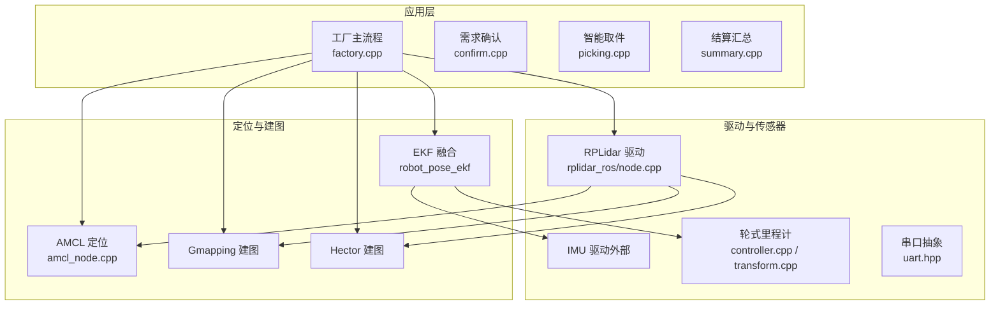
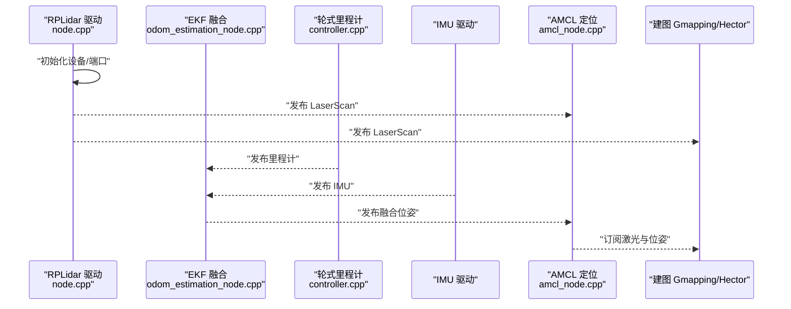
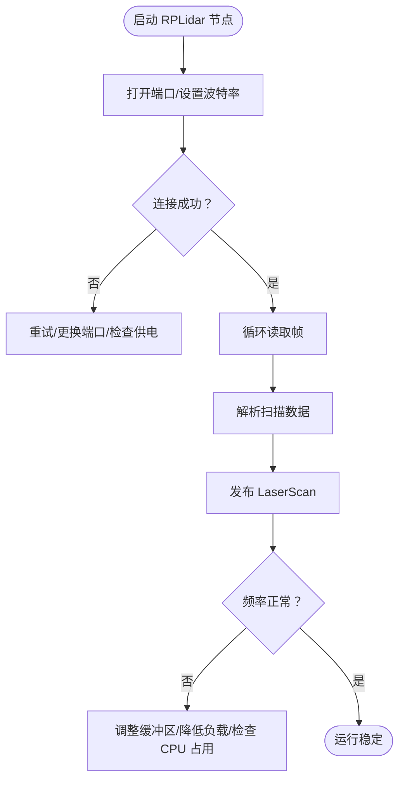
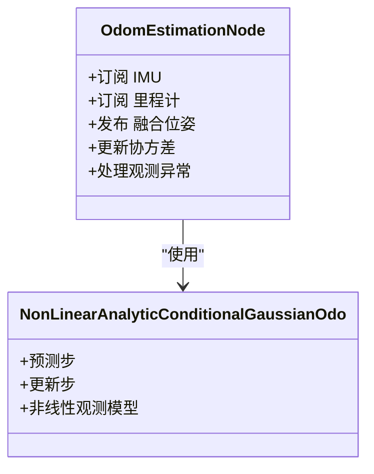
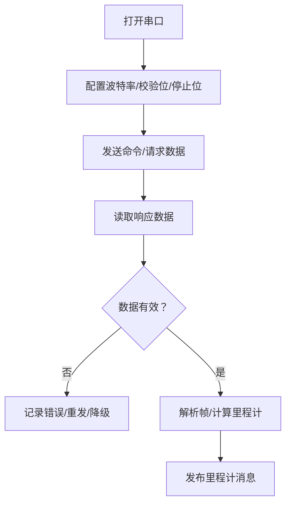
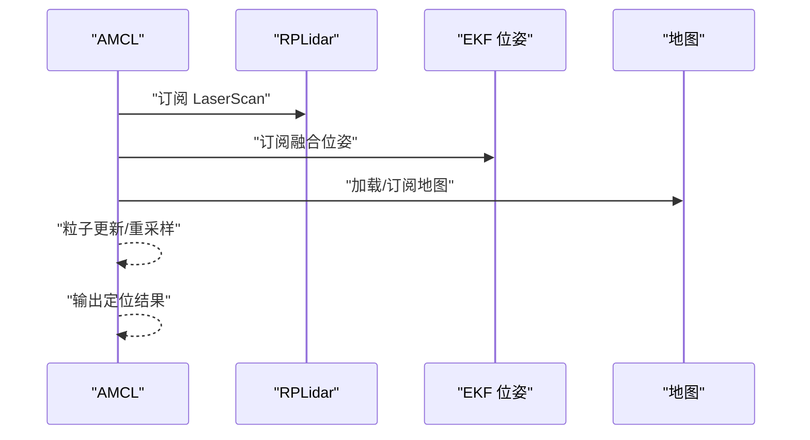
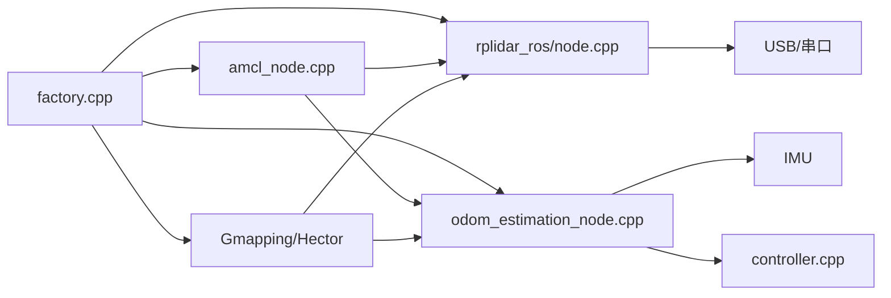

# 传感器通信问题

<cite>
**本文引用的文件**   
- [sebot_factory.launch](file://sebot_factory/src/sebot_factory/launch/sebot_factory.launch)
- [factory.cpp](file://sebot_factory/src/sebot_factory/src/factory.cpp)
- [confirm.cpp](file://sebot_factory/src/sebot_factory/src/confirm.cpp)
- [picking.cpp](file://sebot_factory/src/sebot_factory/src/picking.cpp)
- [summary.cpp](file://sebot_factory/src/sebot_factory/src/summary.cpp)
- [rplidar.launch](file://sebot_ros_kits/src/sebot_driver/rplidar_ros/launch/rplidar.launch)
- [node.cpp](file://sebot_ros_kits/src/sebot_driver/rplidar_ros/src/node.cpp)
- [client.cpp](file://sebot_ros_kits/src/sebot_driver/rplidar_ros/src/client.cpp)
- [robot_pose_ekf.launch](file://sebot_ros_kits/src/sebot_driver/robot_pose_ekf/launch/robot_pose_ekf.launch)
- [odom_estimation_node.h](file://sebot_ros_kits/src/sebot_driver/robot_pose_ekf/include/robot_pose_ekf/odom_estimation_node.h)
- [odom_estimation_node.cpp](file://sebot_ros_kits/src/sebot_driver/robot_pose_ekf/src/odom_estimation_node.cpp)
- [nonlinearanalyticconditionalgaussianodo.h](file://sebot_ros_kits/src/sebot_driver/robot_pose_ekf/include/robot_pose_ekf/nonlinearanalyticconditionalgaussianodo.h)
- [nonlinearanalyticconditionalgaussianodo.cpp](file://sebot_ros_kits/src/sebot_driver/robot_pose_ekf/src/nonlinearanalyticconditionalgaussianodo.cpp)
- [uart.hpp](file://sebot_ros_kits/src/sebot_robot/include/uart.hpp)
- [controller.cpp](file://sebot_ros_kits/src/sebot_robot/src/controller.cpp)
- [transform.cpp](file://sebot_ros_kits/src/sebot_robot/src/transform.cpp)
- [amcl_node.cpp](file://sebot_ros_kits/src/sebot_navigation/amcl/src/amcl_node.cpp)
- [gmapping 节点入口（包内）](file://sebot_ros_kits/src/sebot_slam/slam_gmapping/slam_gmapping)
- [hector_mapping 节点入口（包内）](file://sebot_ros_kits/src/sebot_slam/slam_hector/hector_mapping/src/hector_mapping.cpp)
- [sebot_odom.launch](file://sebot_ros_kits/src/sebot_robot/launch/sebot_odom.launch)
- [sebot_transform.launch](file://sebot_ros_kits/src/sebot_robot/launch/sebot_transform.launch)
</cite>

## 目录
1. [简介](#简介)
2. [项目结构](#项目结构)
3. [核心组件](#核心组件)
4. [架构总览](#架构总览)
5. [详细组件分析](#详细组件分析)
6. [依赖关系分析](#依赖关系分析)
7. [性能与稳定性考量](#性能与稳定性考量)
8. [故障排除指南](#故障排除指南)
9. [结论](#结论)
10. [附录](#附录)

## 简介
本故障排除文档面向机器人传感器通信系统，聚焦激光雷达（RPLidar）、IMU、轮式里程计及 EKF 融合、串口通信、时间同步与坐标系转换等常见问题。文档结合仓库中的驱动与导航/建图集成方式，提供从现象到根因、再到解决步骤的系统化排查方法，并给出数据质量评估与优化建议。

## 项目结构
本项目由三个相互独立的 catkin 工作空间组成：
- sebot_factory：应用层业务节点（订单处理、取件、确认、结算等）
- sebot_ros_kits：机器人驱动与导航/建图套件（RPLidar、EKF、AMCL、Gmapping/Hector 等）
- sebot_ros_stdr：仿真环境（STDR）

传感器相关的关键路径集中在 sebot_ros_kits 的 rplidar_ros、robot_pose_ekf、sebot_robot、sebot_navigation、sebot_slam 等包中；应用层通过 launch 文件统一启动与参数配置。

图表来源
- [factory.cpp](file://sebot_factory/src/sebot_factory/src/factory.cpp)
- [node.cpp](file://sebot_ros_kits/src/sebot_driver/rplidar_ros/src/node.cpp)
- [controller.cpp](file://sebot_ros_kits/src/sebot_robot/src/controller.cpp)
- [transform.cpp](file://sebot_ros_kits/src/sebot_robot/src/transform.cpp)
- [odom_estimation_node.cpp](file://sebot_ros_kits/src/sebot_driver/robot_pose_ekf/src/odom_estimation_node.cpp)
- [amcl_node.cpp](file://sebot_ros_kits/src/sebot_navigation/amcl/src/amcl_node.cpp)

章节来源
- [sebot_factory.launch](file://sebot_factory/src/sebot_factory/launch/sebot_factory.launch)
- [factory.cpp](file://sebot_factory/src/sebot_factory/src/factory.cpp)

## 核心组件
- RPLidar 驱动：负责 USB/串口扫描数据读取、解析并发布 LaserScan 消息。关键入口为 node.cpp，启动脚本在 rplidar.launch。
- EKF 融合：robot_pose_ekf 将 IMU 角速度与轮式里程计进行融合，输出位姿估计。关键节点为 odom_estimation_node，算法实现包含非线性的条件高斯更新。
- 轮式里程计与串口：controller.cpp 与 transform.cpp 负责底盘控制与坐标变换，uart.hpp 封装串口读写接口。
- 定位与建图：AMCL 使用激光雷达观测进行粒子滤波定位；Gmapping/Hector 用于建图。

章节来源
- [rplidar.launch](file://sebot_ros_kits/src/sebot_driver/rplidar_ros/launch/rplidar.launch)
- [node.cpp](file://sebot_ros_kits/src/sebot_driver/rplidar_ros/src/node.cpp)
- [client.cpp](file://sebot_ros_kits/src/sebot_driver/rplidar_ros/src/client.cpp)
- [robot_pose_ekf.launch](file://sebot_ros_kits/src/sebot_driver/robot_pose_ekf/launch/robot_pose_ekf.launch)
- [odom_estimation_node.h](file://sebot_ros_kits/src/sebot_driver/robot_pose_ekf/include/robot_pose_ekf/odom_estimation_node.h)
- [odom_estimation_node.cpp](file://sebot_ros_kits/src/sebot_driver/robot_pose_ekf/src/odom_estimation_node.cpp)
- [nonlinearanalyticconditionalgaussianodo.h](file://sebot_ros_kits/src/sebot_driver/robot_pose_ekf/include/robot_pose_ekf/nonlinearanalyticconditionalgaussianodo.h)
- [nonlinearanalyticconditionalgaussianodo.cpp](file://sebot_ros_kits/src/sebot_driver/robot_pose_ekf/src/nonlinearanalyticconditionalgaussianodo.cpp)
- [uart.hpp](file://sebot_ros_kits/src/sebot_robot/include/uart.hpp)
- [controller.cpp](file://sebot_ros_kits/src/sebot_robot/src/controller.cpp)
- [transform.cpp](file://sebot_ros_kits/src/sebot_robot/src/transform.cpp)
- [amcl_node.cpp](file://sebot_ros_kits/src/sebot_navigation/amcl/src/amcl_node.cpp)

## 架构总览
下图展示了传感器数据流与融合定位的整体架构，包括 RPLidar 扫描发布、EKF 融合、AMCL 定位以及建图模块的交互关系。

图表来源
- [node.cpp](file://sebot_ros_kits/src/sebot_driver/rplidar_ros/src/node.cpp)
- [odom_estimation_node.cpp](file://sebot_ros_kits/src/sebot_driver/robot_pose_ekf/src/odom_estimation_node.cpp)
- [controller.cpp](file://sebot_ros_kits/src/sebot_robot/src/controller.cpp)
- [amcl_node.cpp](file://sebot_ros_kits/src/sebot_navigation/amcl/src/amcl_node.cpp)

## 详细组件分析

### RPLidar 通信与数据流
- 设备初始化与连接：通过 launch 指定端口/波特率，驱动内部建立 USB/串口会话，周期性读取帧并解析为点云或扫描。
- 数据发布：解析后的 LaserScan 以固定频率发布，供 AMCL 与建图模块订阅。
- 常见异常：USB 不稳定导致断连、数据接收中断、扫描频率异常（过低或抖动）。

图表来源
- [rplidar.launch](file://sebot_ros_kits/src/sebot_driver/rplidar_ros/launch/rplidar.launch)
- [node.cpp](file://sebot_ros_kits/src/sebot_driver/rplidar_ros/src/node.cpp)
- [client.cpp](file://sebot_ros_kits/src/sebot_driver/rplidar_ros/src/client.cpp)

章节来源
- [rplidar.launch](file://sebot_ros_kits/src/sebot_driver/rplidar_ros/launch/rplidar.launch)
- [node.cpp](file://sebot_ros_kits/src/sebot_driver/rplidar_ros/src/node.cpp)
- [client.cpp](file://sebot_ros_kits/src/sebot_driver/rplidar_ros/src/client.cpp)

### EKF 融合（IMU + 轮式里程计）
- 输入：IMU 角速度/加速度、轮式里程计位姿增量。
- 融合策略：基于非线性条件高斯更新，对姿态与位置进行协方差传播与观测修正。
- 典型问题：姿态角漂移、位置发散、权重配置不当（协方差过大/过小）。

图表来源
- [odom_estimation_node.h](file://sebot_ros_kits/src/sebot_driver/robot_pose_ekf/include/robot_pose_ekf/odom_estimation_node.h)
- [odom_estimation_node.cpp](file://sebot_ros_kits/src/sebot_driver/robot_pose_ekf/src/odom_estimation_node.cpp)
- [nonlinearanalyticconditionalgaussianodo.h](file://sebot_ros_kits/src/sebot_driver/robot_pose_ekf/include/robot_pose_ekf/nonlinearanalyticconditionalgaussianodo.h)
- [nonlinearanalyticconditionalgaussianodo.cpp](file://sebot_ros_kits/src/sebot_driver/robot_pose_ekf/src/nonlinearanalyticconditionalgaussianodo.cpp)

章节来源
- [robot_pose_ekf.launch](file://sebot_ros_kits/src/sebot_driver/robot_pose_ekf/launch/robot_pose_ekf.launch)
- [odom_estimation_node.cpp](file://sebot_ros_kits/src/sebot_driver/robot_pose_ekf/src/odom_estimation_node.cpp)
- [nonlinearanalyticconditionalgaussianodo.cpp](file://sebot_ros_kits/src/sebot_driver/robot_pose_ekf/src/nonlinearanalyticconditionalgaussianodo.cpp)

### 串口通信与轮式里程计
- 串口抽象：uart.hpp 提供统一的串口读写接口，封装打开、配置、收发、错误处理。
- 里程计生成：controller.cpp 读取编码器/传感器原始数据，计算位移与角度增量，发布里程计。
- 常见问题：波特率不匹配、数据帧格式不一致、缓冲区溢出、丢包。

图表来源
- [uart.hpp](file://sebot_ros_kits/src/sebot_robot/include/uart.hpp)
- [controller.cpp](file://sebot_ros_kits/src/sebot_robot/src/controller.cpp)

章节来源
- [uart.hpp](file://sebot_ros_kits/src/sebot_robot/include/uart.hpp)
- [controller.cpp](file://sebot_ros_kits/src/sebot_robot/src/controller.cpp)
- [transform.cpp](file://sebot_ros_kits/src/sebot_robot/src/transform.cpp)

### AMCL 定位与建图
- AMCL：订阅激光与位姿，进行粒子滤波定位，输出机器人位姿。
- 建图：Gmapping/Hector 订阅激光与位姿构建地图，支持在线/离线建图。
- 常见问题：激光缺失/延迟导致定位失败、初始位姿错误、地图不匹配。

图表来源
- [amcl_node.cpp](file://sebot_ros_kits/src/sebot_navigation/amcl/src/amcl_node.cpp)

章节来源
- [amcl_node.cpp](file://sebot_ros_kits/src/sebot_navigation/amcl/src/amcl_node.cpp)
- [gmapping 节点入口（包内）](file://sebot_ros_kits/src/sebot_slam/slam_gmapping/slam_gmapping)
- [hector_mapping 节点入口（包内）](file://sebot_ros_kits/src/sebot_slam/slam_hector/hector_mapping/src/hector_mapping.cpp)

## 依赖关系分析
- 应用层 factory.cpp 依赖 RPLidar、EKF、AMCL、建图模块提供的感知与定位能力。
- RPLidar 驱动依赖底层 USB/串口栈；EKF 依赖 IMU 与里程计；AMCL 依赖激光与位姿；建图依赖激光与位姿。
- 启动与参数集中管理于 launch 文件，确保各模块协同工作。

图表来源
- [factory.cpp](file://sebot_factory/src/sebot_factory/src/factory.cpp)
- [node.cpp](file://sebot_ros_kits/src/sebot_driver/rplidar_ros/src/node.cpp)
- [odom_estimation_node.cpp](file://sebot_ros_kits/src/sebot_driver/robot_pose_ekf/src/odom_estimation_node.cpp)
- [amcl_node.cpp](file://sebot_ros_kits/src/sebot_navigation/amcl/src/amcl_node.cpp)
- [controller.cpp](file://sebot_ros_kits/src/sebot_robot/src/controller.cpp)

章节来源
- [factory.cpp](file://sebot_factory/src/sebot_factory/src/factory.cpp)
- [sebot_factory.launch](file://sebot_factory/src/sebot_factory/launch/sebot_factory.launch)

## 性能与稳定性考量
- RPLidar 频率与带宽：在高频率扫描下需确保 CPU 与 I/O 带宽充足，避免阻塞导致丢帧。
- EKF 协方差调优：合理设置 IMU 与里程计的噪声协方差，防止过度信任单一传感器导致漂移或发散。
- AMCL 粒子数与重采样阈值：根据环境复杂度与计算资源平衡精度与实时性。
- 串口缓冲与超时：增大缓冲区、设置合理的超时与重传策略，提升鲁棒性。

[本节为通用指导，无需特定文件引用]

## 故障排除指南

### 激光雷达（RPLidar）通信问题
- 症状
  - USB 连接不稳定，频繁断开重连
  - 数据接收中断，LaserScan 长时间无更新
  - 扫描频率异常（过低或抖动），影响定位与建图
- 诊断步骤
  - 检查端口与权限：确认设备节点存在且权限正确
  - 验证波特率与协议：与驱动配置一致，避免不匹配
  - 观察系统日志：查看 dmesg 与 ROS 日志中的错误信息
  - 监控频率与丢包：使用 rostopic hz 与 rosbag 回放分析
- 解决方法
  - 更换高质量 USB 线缆与供电稳定的接口
  - 调整驱动参数（如缓冲区大小、读取间隔）
  - 降低其他任务负载，避免 CPU 抢占
  - 必要时重启驱动节点或重新插拔设备

章节来源
- [rplidar.launch](file://sebot_ros_kits/src/sebot_driver/rplidar_ros/launch/rplidar.launch)
- [node.cpp](file://sebot_ros_kits/src/sebot_driver/rplidar_ros/src/node.cpp)
- [client.cpp](file://sebot_ros_kits/src/sebot_driver/rplidar_ros/src/client.cpp)

### IMU 与轮式里程计的 EKF 融合错误
- 症状
  - 姿态角漂移（偏航/俯仰/横滚异常变化）
  - 位置估计发散（轨迹快速偏离真实路径）
  - 传感器权重配置不当（协方差过大/过小）
- 诊断步骤
  - 检查 IMU 数据质量：零偏、噪声水平、采样频率
  - 检查里程计一致性：编码器分辨率、打滑情况
  - 查看 EKF 协方差矩阵：是否收敛、是否出现负值或过大
  - 对比单源估计：分别关闭 IMU 或里程计观察差异
- 解决方法
  - 校准 IMU 与轮式编码器，获取准确噪声模型
  - 调整 EKF 协方差参数，平衡 IMU 与里程计权重
  - 增加观测异常检测与剔除机制
  - 在动态环境中引入鲁棒观测模型

章节来源
- [robot_pose_ekf.launch](file://sebot_ros_kits/src/sebot_driver/robot_pose_ekf/launch/robot_pose_ekf.launch)
- [odom_estimation_node.cpp](file://sebot_ros_kits/src/sebot_driver/robot_pose_ekf/src/odom_estimation_node.cpp)
- [nonlinearanalyticconditionalgaussianodo.cpp](file://sebot_ros_kits/src/sebot_driver/robot_pose_ekf/src/nonlinearanalyticconditionalgaussianodo.cpp)

### 串口通信故障排查
- 症状
  - 无法打开串口或频繁超时
  - 数据格式不匹配，解析失败
  - 缓冲区溢出，丢包严重
- 诊断步骤
  - 核对波特率、校验位、停止位与帧格式
  - 使用串口调试工具抓包比对期望格式
  - 检查系统串口队列与缓冲区大小
  - 监控错误计数与重传次数
- 解决方法
  - 修正配置参数，确保与设备一致
  - 增大缓冲区与读取超时，优化解析逻辑
  - 增加校验与重传机制，提升可靠性

章节来源
- [uart.hpp](file://sebot_ros_kits/src/sebot_robot/include/uart.hpp)
- [controller.cpp](file://sebot_ros_kits/src/sebot_robot/src/controller.cpp)

### 传感器数据质量评估
- 信号强度检测：统计 LaserScan 强度分布，识别弱反射区域与遮挡
- 噪声过滤：对 IMU 与里程计数据进行低通滤波或中值滤波
- 数据完整性验证：检查时间戳连续性、帧序号、CRC 校验
- 可视化与指标：绘制轨迹、频率直方图、误差曲线，辅助定位问题

[本节为通用指导，无需特定文件引用]

### 多传感器时间同步与坐标系转换
- 时间同步
  - 确保各传感器时间戳来自同一时钟源或使用 ROS 时间同步
  - 对异步数据采用插值或最近邻对齐
- 坐标系转换
  - 标定传感器安装偏移（TF 树）
  - 检查坐标系命名与方向约定（ROS 标准）
  - 使用 tf_monitor 与 rviz 验证变换链

章节来源
- [transform.cpp](file://sebot_ros_kits/src/sebot_robot/src/transform.cpp)
- [sebot_transform.launch](file://sebot_ros_kits/src/sebot_robot/launch/sebot_transform.launch)

### 定位与建图相关问题
- 定位失败
  - 检查激光数据是否连续、AMCL 初始位姿是否正确
  - 调整粒子数与重采样阈值
- 建图质量差
  - 检查运动速度与激光覆盖范围
  - 优化建图参数（如网格分辨率、扫描匹配阈值）

章节来源
- [amcl_node.cpp](file://sebot_ros_kits/src/sebot_navigation/amcl/src/amcl_node.cpp)
- [gmapping 节点入口（包内）](file://sebot_ros_kits/src/sebot_slam/slam_gmapping/slam_gmapping)
- [hector_mapping 节点入口（包内）](file://sebot_ros_kits/src/sebot_slam/slam_hector/hector_mapping/src/hector_mapping.cpp)

## 结论
通过对 RPLidar、IMU、轮式里程计与 EKF 融合的深入分析与系统化排查，可有效定位并解决传感器通信与融合中的常见问题。建议在部署前完成传感器校准与参数调优，并在运行中持续监控数据质量与系统状态，以确保机器人在复杂环境下的稳定运行。

[本节为总结性内容，无需特定文件引用]

## 附录
- 常用诊断命令
  - rostopic hz /scan：检查激光频率
  - rostopic echo /odom：查看里程计数据
  - rosparam list：列出当前参数
  - rosbag record：录制数据用于离线分析
- 参考启动文件
  - sebot_factory.launch：应用层启动与参数配置
  - rplidar.launch：激光雷达驱动启动
  - robot_pose_ekf.launch：EKF 融合启动
  - sebot_odom.launch 与 sebot_transform.launch：里程计与 TF 启动

章节来源
- [sebot_factory.launch](file://sebot_factory/src/sebot_factory/launch/sebot_factory.launch)
- [rplidar.launch](file://sebot_ros_kits/src/sebot_driver/rplidar_ros/launch/rplidar.launch)
- [robot_pose_ekf.launch](file://sebot_ros_kits/src/sebot_driver/robot_pose_ekf/launch/robot_pose_ekf.launch)
- [sebot_odom.launch](file://sebot_ros_kits/src/sebot_robot/launch/sebot_odom.launch)
- [sebot_transform.launch](file://sebot_ros_kits/src/sebot_robot/launch/sebot_transform.launch)