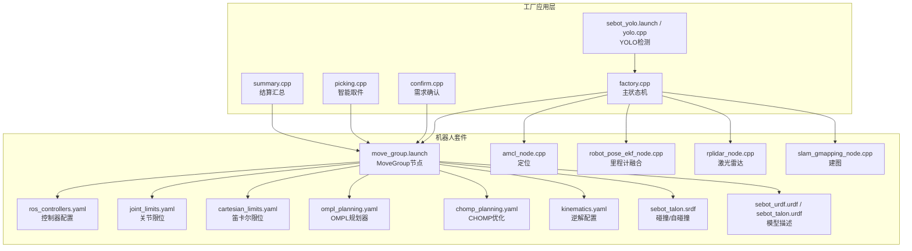
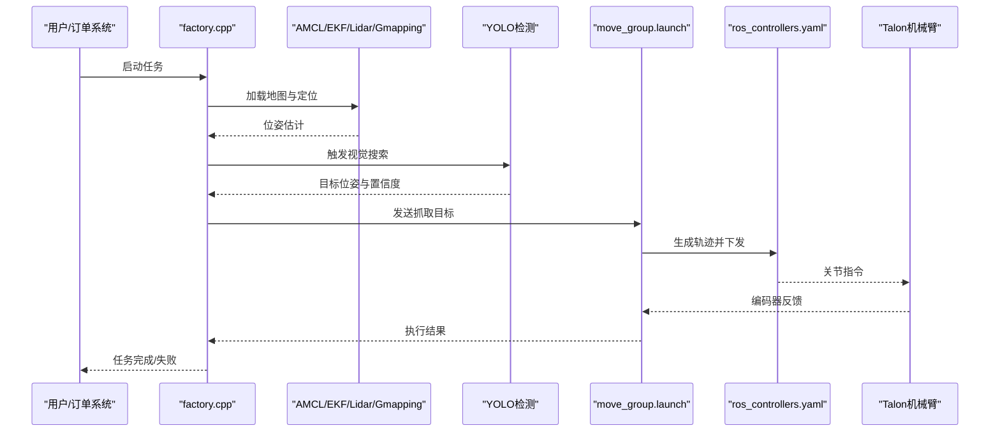
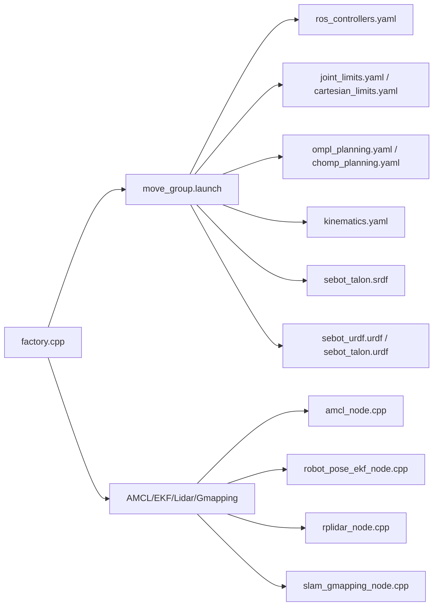

# 机械臂控制问题

<cite>
**本文引用的文件**   
- [sebot_factory.launch](file://sebot_factory/src/sebot_factory/launch/sebot_factory.launch)
- [factory.cpp](file://sebot_factory/src/sebot_factory/src/factory.cpp)
- [confirm.cpp](file://sebot_factory/src/sebot_factory/src/confirm.cpp)
- [picking.cpp](file://sebot_factory/src/sebot_factory/src/picking.cpp)
- [summary.cpp](file://sebot_factory/src/sebot_factory/src/summary.cpp)
- [arm.hpp](file://sebot_factory/src/sebot_factory/include/arm.hpp)
- [detection.hpp](file://sebot_factory/src/sebot_factory/include/detection.hpp)
- [tools.hpp](file://sebot_factory/src/sebot_factory/include/tools.hpp)
- [sebot_talon_moveit_controller_manager.launch.xml](file://sebot_ros_kits/src/sebot_driver/sebot_talon_moveit/launch/sebot_arm_moveit_controller_manager.launch.xml)
- [ros_controllers.yaml](file://sebot_ros_kits/src/sebot_driver/sebot_talon_moveit/config/ros_controllers.yaml)
- [joint_limits.yaml](file://sebot_ros_kits/src/sebot_driver/sebot_talon_moveit/config/joint_limits.yaml)
- [cartesian_limits.yaml](file://sebot_ros_kits/src/sebot_driver/sebot_talon_moveit/config/cartesian_limits.yaml)
- [ompl_planning.yaml](file://sebot_ros_kits/src/sebot_driver/sebot_talon_moveit/config/ompl_planning.yaml)
- [chomp_planning.yaml](file://sebot_ros_kits/src/sebot_driver/sebot_talon_moveit/config/chomp_planning.yaml)
- [kinematics.yaml](file://sebot_ros_kits/src/sebot_driver/sebot_talon_moveit/config/kinematics.yaml)
- [sebot_talon.srdf](file://sebot_ros_kits/src/sebot_driver/sebot_talon_moveit/config/sebot_talon.srdf)
- [move_group.launch](file://sebot_ros_kits/src/sebot_driver/sebot_talon_moveit/launch/move_group.launch)
- [trajectory_execution.launch.xml](file://sebot_ros_kits/src/sebot_driver/sebot_talon_moveit/launch/trajectory_execution.launch.xml)
- [sebot_urdf.launch](file://sebot_ros_kits/src/sebot_driver/sebot_urdf/launch/sebot_urdf.launch)
- [sebot_urdf.urdf](file://sebot_ros_kits/src/sebot_driver/sebot_urdf/urdf/sebot_urdf.urdf)
- [sebot_talon.urdf](file://sebot_ros_kits/src/sebot_driver/sebot_talon/urdf/sebot_talon.urdf)
- [sebot_odom.launch](file://sebot_ros_kits/src/sebot_robot/launch/sebot_odom.launch)
- [controller.cpp](file://sebot_ros_kits/src/sebot_robot/src/controller.cpp)
- [amcl_node.cpp](file://sebot_ros_kits/src/sebot_navigation/amcl/src/amcl_node.cpp)
- [robot_pose_ekf_node.cpp](file://sebot_ros_kits/src/sebot_driver/robot_pose_ekf/src/odom_estimation_node.cpp)
- [rplidar_node.cpp](file://sebot_ros_kits/src/sebot_driver/rplidar_ros/src/node.cpp)
- [slam_gmapping_node.cpp](file://sebot_ros_kits/src/sebot_slam/slam_gmapping/slam_gmapping_node.cpp)
- [sebot_yolo.launch](file://sebot_factory/src/sebot_factory/launch/sebot_yolo.launch)
- [yolo.cpp](file://sebot_factory/src/sebot_factory/unit/yolo.cpp)
</cite>

## 目录
1. [简介](#简介)
2. [项目结构](#项目结构)
3. [核心组件](#核心组件)
4. [架构总览](#架构总览)
5. [详细组件分析](#详细组件分析)
6. [依赖关系分析](#依赖关系分析)
7. [性能与稳定性考量](#性能与稳定性考量)
8. [故障排查指南](#故障排查指南)
9. [结论](#结论)
10. [附录](#附录)

## 简介
本文件面向Talon机械臂控制系统的问题排查，聚焦PID参数调优、关节运动异常诊断、抓取精度不足的原因分析与解决、MoveIt!配置调试与轨迹规划问题定位，以及自检流程、故障恢复与安全保护的使用说明。文档基于仓库中的工厂应用层（sebot_factory）、机器人驱动与控制套件（sebot_ros_kits）和仿真环境（sebot_ros_stdr）进行系统化梳理，帮助工程师快速定位并解决问题。

## 项目结构
本项目由三个相互独立的catkin工作空间组成：
- sebot_factory：上层业务逻辑（订单处理、视觉检测、取件流程、结算汇总等），主状态机在factory.cpp中实现。
- sebot_ros_kits：底层驱动与工具包，包含Talon机械臂URDF与MoveIt!配置、导航栈（AMCL、DWA、Gmapping/Hector）、RPLidar驱动、里程计EKF融合、语音与视觉脚本等。
- sebot_ros_stdr：STDR仿真环境，用于离线验证与调试。

图表来源
- [factory.cpp:1-200](file://sebot_factory/src/sebot_factory/src/factory.cpp#L1-L200)
- [move_group.launch:1-120](file://sebot_ros_kits/src/sebot_driver/sebot_talon_moveit/launch/move_group.launch#L1-L120)
- [ros_controllers.yaml:1-120](file://sebot_ros_kits/src/sebot_driver/sebot_talon_moveit/config/ros_controllers.yaml#L1-L120)
- [joint_limits.yaml:1-80](file://sebot_ros_kits/src/sebot_driver/sebot_talon_moveit/config/joint_limits.yaml#L1-L80)
- [cartesian_limits.yaml:1-60](file://sebot_ros_kits/src/sebot_driver/sebot_talon_moveit/config/cartesian_limits.yaml#L1-L60)
- [ompl_planning.yaml:1-120](file://sebot_ros_kits/src/sebot_driver/sebot_talon_moveit/config/ompl_planning.yaml#L1-L120)
- [chomp_planning.yaml:1-120](file://sebot_ros_kits/src/sebot_driver/sebot_talon_moveit/config/chomp_planning.yaml#L1-L120)
- [kinematics.yaml:1-60](file://sebot_ros_kits/src/sebot_driver/sebot_talon_moveit/config/kinematics.yaml#L1-L60)
- [sebot_talon.srdf:1-120](file://sebot_ros_kits/src/sebot_driver/sebot_talon_moveit/config/sebot_talon.srdf#L1-L120)
- [sebot_urdf.urdf:1-200](file://sebot_ros_kits/src/sebot_driver/sebot_urdf/urdf/sebot_urdf.urdf#L1-L200)
- [sebot_talon.urdf:1-200](file://sebot_ros_kits/src/sebot_driver/sebot_talon/urdf/sebot_talon.urdf#L1-L200)
- [amcl_node.cpp:1-200](file://sebot_ros_kits/src/sebot_navigation/amcl/src/amcl_node.cpp#L1-L200)
- [robot_pose_ekf_node.cpp:1-200](file://sebot_ros_kits/src/sebot_driver/robot_pose_ekf/src/odom_estimation_node.cpp#L1-L200)
- [rplidar_node.cpp:1-200](file://sebot_ros_kits/src/sebot_driver/rplidar_ros/src/node.cpp#L1-L200)
- [slam_gmapping_node.cpp:1-200](file://sebot_ros_kits/src/sebot_slam/slam_gmapping/slam_gmapping_node.cpp#L1-L200)

章节来源
- [sebot_factory.launch:1-120](file://sebot_factory/src/sebot_factory/launch/sebot_factory.launch#L1-L120)
- [factory.cpp:1-200](file://sebot_factory/src/sebot_factory/src/factory.cpp#L1-L200)

## 核心组件
- 工厂主状态机（factory.cpp）：协调导航、视觉、取件、结算等业务流程，负责自检、超时与错误恢复。
- 需求确认（confirm.cpp）：通过交互或规则确认订单需求，触发后续动作。
- 智能取件（picking.cpp）：调用MoveIt!进行轨迹规划与执行，结合视觉反馈调整末端位姿。
- 结算汇总（summary.cpp）：统计任务结果，输出日志与指标。
- 视觉检测（sebot_yolo.launch / yolo.cpp）：基于NPU加速的YOLOv3多帧检测，提供目标位置与置信度。
- MoveIt!与控制器（move_group.launch / ros_controllers.yaml / joint_limits.yaml / cartesian_limits.yaml / ompl_planning.yaml / chomp_planning.yaml / kinematics.yaml / sebot_talon.srdf）：定义机械臂运动学、动力学限制、规划器与控制器参数。
- 定位与建图（amcl_node.cpp / robot_pose_ekf_node.cpp / rplidar_node.cpp / slam_gmapping_node.cpp）：提供全局定位、局部融合与建图能力。

章节来源
- [factory.cpp:1-200](file://sebot_factory/src/sebot_factory/src/factory.cpp#L1-L200)
- [confirm.cpp:1-120](file://sebot_factory/src/sebot_factory/src/confirm.cpp#L1-L120)
- [picking.cpp:1-120](file://sebot_factory/src/sebot_factory/src/picking.cpp#L1-L120)
- [summary.cpp:1-120](file://sebot_factory/src/sebot_factory/src/summary.cpp#L1-L120)
- [sebot_yolo.launch:1-120](file://sebot_factory/src/sebot_factory/launch/sebot_yolo.launch#L1-L120)
- [yolo.cpp:1-120](file://sebot_factory/src/sebot_factory/unit/yolo.cpp#L1-L120)
- [move_group.launch:1-120](file://sebot_ros_kits/src/sebot_driver/sebot_talon_moveit/launch/move_group.launch#L1-L120)
- [ros_controllers.yaml:1-120](file://sebot_ros_kits/src/sebot_driver/sebot_talon_moveit/config/ros_controllers.yaml#L1-L120)
- [joint_limits.yaml:1-80](file://sebot_ros_kits/src/sebot_driver/sebot_talon_moveit/config/joint_limits.yaml#L1-L80)
- [cartesian_limits.yaml:1-60](file://sebot_ros_kits/src/sebot_driver/sebot_talon_moveit/config/cartesian_limits.yaml#L1-L60)
- [ompl_planning.yaml:1-120](file://sebot_ros_kits/src/sebot_driver/sebot_talon_moveit/config/ompl_planning.yaml#L1-L120)
- [chomp_planning.yaml:1-120](file://sebot_ros_kits/src/sebot_driver/sebot_talon_moveit/config/chomp_planning.yaml#L1-L120)
- [kinematics.yaml:1-60](file://sebot_ros_kits/src/sebot_driver/sebot_talon_moveit/config/kinematics.yaml#L1-L60)
- [sebot_talon.srdf:1-120](file://sebot_ros_kits/src/sebot_driver/sebot_talon_moveit/config/sebot_talon.srdf#L1-L120)

## 架构总览
系统以ROS为通信总线，上层业务节点订阅传感器话题并发布控制指令；MoveIt!作为运动规划与执行中枢，将高层目标转换为关节轨迹，并通过控制器下发到底层驱动器。定位与建图模块提供全局坐标参考，视觉模块提供目标位姿估计。

图表来源
- [factory.cpp:1-200](file://sebot_factory/src/sebot_factory/src/factory.cpp#L1-L200)
- [amcl_node.cpp:1-200](file://sebot_ros_kits/src/sebot_navigation/amcl/src/amcl_node.cpp#L1-L200)
- [robot_pose_ekf_node.cpp:1-200](file://sebot_ros_kits/src/sebot_driver/robot_pose_ekf/src/odom_estimation_node.cpp#L1-L200)
- [rplidar_node.cpp:1-200](file://sebot_ros_kits/src/sebot_driver/rplidar_ros/src/node.cpp#L1-L200)
- [slam_gmapping_node.cpp:1-200](file://sebot_ros_kits/src/sebot_slam/slam_gmapping/slam_gmapping_node.cpp#L1-L200)
- [sebot_yolo.launch:1-120](file://sebot_factory/src/sebot_factory/launch/sebot_yolo.launch#L1-L120)
- [yolo.cpp:1-120](file://sebot_factory/src/sebot_factory/unit/yolo.cpp#L1-L120)
- [move_group.launch:1-120](file://sebot_ros_kits/src/sebot_driver/sebot_talon_moveit/launch/move_group.launch#L1-L120)
- [ros_controllers.yaml:1-120](file://sebot_ros_kits/src/sebot_driver/sebot_talon_moveit/config/ros_controllers.yaml#L1-L120)

## 详细组件分析

### PID控制参数调优方法
- 比例项（P）：影响响应速度与稳态误差。增大P可加快响应，但过大会导致超调与振荡。建议从较小值开始逐步增加，观察阶跃响应的上升时间与超调量。
- 积分项（I）：消除稳态误差，但会增加相位滞后与振荡风险。若存在持续偏差，逐步引入I，并监控低频振荡。
- 微分项（D）：抑制超调与振荡，提高阻尼。对噪声敏感，需配合滤波使用。适当增加D可改善稳定性，但过大将放大噪声。

最佳实践
- 先整定P至临界稳定，再引入I消除静差，最后加入D抑制振荡。
- 分轴调参：不同关节负载与惯性差异大，应分别记录各关节的响应曲线。
- 在线观测：利用RViz与rosbag回放关节角度、速度、电流与误差信号，辅助判断。
- 安全边界：设置合理的加速度与速度限幅，避免激振与过载。

章节来源
- [ros_controllers.yaml:1-120](file://sebot_ros_kits/src/sebot_driver/sebot_talon_moveit/config/ros_controllers.yaml#L1-L120)
- [joint_limits.yaml:1-80](file://sebot_ros_kits/src/sebot_driver/sebot_talon_moveit/config/joint_limits.yaml#L1-L80)
- [cartesian_limits.yaml:1-60](file://sebot_ros_kits/src/sebot_driver/sebot_talon_moveit/config/cartesian_limits.yaml#L1-L60)

### 关节运动异常的诊断方法
常见问题
- 关节限位触发：检查joint_limits.yaml与SRDF中的限位设置，确认实际目标是否越界。
- 电机过载保护：监测电流与温度，降低速度/加速度，检查负载与机械卡滞。
- 编码器数据异常：检查编码器反馈频率与噪声，必要时增加低通滤波或更换硬件。

诊断步骤
- 查看关节角度、速度、电流与误差曲线，识别抖动、饱和或跳变。
- 使用RViz可视化轨迹与实际位姿，对比规划与执行的偏差。
- 检查控制器日志与错误码，定位具体关节与阶段。

章节来源
- [joint_limits.yaml:1-80](file://sebot_ros_kits/src/sebot_driver/sebot_talon_moveit/config/joint_limits.yaml#L1-L80)
- [sebot_talon.srdf:1-120](file://sebot_ros_kits/src/sebot_driver/sebot_talon_moveit/config/sebot_talon.srdf#L1-L120)
- [ros_controllers.yaml:1-120](file://sebot_ros_kits/src/sebot_driver/sebot_talon_moveit/config/ros_controllers.yaml#L1-L120)

### 抓取精度不足的原因分析与解决方案
可能原因
- 坐标变换误差：相机到基座、手眼标定不准确，TF树延迟或不一致。
- 视觉定位偏差：YOLO检测置信度低、多目标混淆、光照变化影响。
- 机械结构间隙：连杆间隙、末端夹具磨损导致重复定位误差。

解决方案
- 重新标定手眼系统，验证TF链连续性与时间戳同步。
- 提升视觉鲁棒性：多帧融合、阈值过滤、背景建模。
- 机械维护：紧固连接件、更换磨损部件，校准零点。

章节来源
- [sebot_yolo.launch:1-120](file://sebot_factory/src/sebot_factory/launch/sebot_yolo.launch#L1-L120)
- [yolo.cpp:1-120](file://sebot_factory/src/sebot_factory/unit/yolo.cpp#L1-L120)
- [sebot_urdf.urdf:1-200](file://sebot_ros_kits/src/sebot_driver/sebot_urdf/urdf/sebot_urdf.urdf#L1-L200)
- [sebot_talon.urdf:1-200](file://sebot_ros_kits/src/sebot_driver/sebot_talon/urdf/sebot_talon.urdf#L1-L200)

### MoveIt!配置文件调试方法与轨迹规划问题排查
关键配置
- ros_controllers.yaml：控制器类型、PID参数、发布频率。
- joint_limits.yaml：关节角度、速度、加速度限制。
- cartesian_limits.yaml：笛卡尔空间的速度与加速度限制。
- ompl_planning.yaml / chomp_planning.yaml：规划器参数（采样率、迭代次数、权重）。
- kinematics.yaml：逆解求解器与容差。
- sebot_talon.srdf：碰撞体、自碰撞与虚拟关节。

排查技巧
- 使用move_group.launch启动后，通过rviz发送简单目标，验证基础运动。
- 逐步放宽限制，定位是规划器还是控制器导致的失败。
- 记录规划时间、成功率与轨迹平滑度，对比不同规划器效果。

章节来源
- [move_group.launch:1-120](file://sebot_ros_kits/src/sebot_driver/sebot_talon_moveit/launch/move_group.launch#L1-L120)
- [ros_controllers.yaml:1-120](file://sebot_ros_kits/src/sebot_driver/sebot_talon_moveit/config/ros_controllers.yaml#L1-L120)
- [joint_limits.yaml:1-80](file://sebot_ros_kits/src/sebot_driver/sebot_talon_moveit/config/joint_limits.yaml#L1-L80)
- [cartesian_limits.yaml:1-60](file://sebot_ros_kits/src/sebot_driver/sebot_talon_moveit/config/cartesian_limits.yaml#L1-L60)
- [ompl_planning.yaml:1-120](file://sebot_ros_kits/src/sebot_driver/sebot_talon_moveit/config/ompl_planning.yaml#L1-L120)
- [chomp_planning.yaml:1-120](file://sebot_ros_kits/src/sebot_driver/sebot_talon_moveit/config/chomp_planning.yaml#L1-L120)
- [kinematics.yaml:1-60](file://sebot_ros_kits/src/sebot_driver/sebot_talon_moveit/config/kinematics.yaml#L1-L60)
- [sebot_talon.srdf:1-120](file://sebot_ros_kits/src/sebot_driver/sebot_talon_moveit/config/sebot_talon.srdf#L1-L120)

### 机械臂自检流程、故障恢复机制与安全保护措施
自检流程
- 上电后检查通信链路、编码器状态、限位开关与电机使能。
- 执行零点校准与空载回零，验证关节自由度。
- 加载URDF与SRDF，确认模型与物理参数一致。

故障恢复
- 检测到超限或通信中断时，进入安全停止状态，等待人工干预。
- 自动重试有限次数，超过阈值则上报错误并终止任务。
- 支持软复位与硬复位，确保系统可恢复。

安全措施
- 软件限位与急停接口联动，硬件急停优先。
- 力矩与电流保护，防止过载损坏。
- 碰撞检测与紧急制动，减少伤害风险。

章节来源
- [factory.cpp:1-200](file://sebot_factory/src/sebot_factory/src/factory.cpp#L1-L200)
- [sebot_urdf.urdf:1-200](file://sebot_ros_kits/src/sebot_driver/sebot_urdf/urdf/sebot_urdf.urdf#L1-L200)
- [sebot_talon.srdf:1-120](file://sebot_ros_kits/src/sebot_driver/sebot_talon_moveit/config/sebot_talon.srdf#L1-L120)

## 依赖关系分析
系统依赖关系清晰分层：应用层依赖MoveIt!与导航栈，MoveIt!依赖控制器与URDF/SRDF，导航栈依赖传感器驱动与EKF融合。

图表来源
- [factory.cpp:1-200](file://sebot_factory/src/sebot_factory/src/factory.cpp#L1-L200)
- [move_group.launch:1-120](file://sebot_ros_kits/src/sebot_driver/sebot_talon_moveit/launch/move_group.launch#L1-L120)
- [ros_controllers.yaml:1-120](file://sebot_ros_kits/src/sebot_driver/sebot_talon_moveit/config/ros_controllers.yaml#L1-L120)
- [joint_limits.yaml:1-80](file://sebot_ros_kits/src/sebot_driver/sebot_talon_moveit/config/joint_limits.yaml#L1-L80)
- [cartesian_limits.yaml:1-60](file://sebot_ros_kits/src/sebot_driver/sebot_talon_moveit/config/cartesian_limits.yaml#L1-L60)
- [ompl_planning.yaml:1-120](file://sebot_ros_kits/src/sebot_driver/sebot_talon_moveit/config/ompl_planning.yaml#L1-L120)
- [chomp_planning.yaml:1-120](file://sebot_ros_kits/src/sebot_driver/sebot_talon_moveit/config/chomp_planning.yaml#L1-L120)
- [kinematics.yaml:1-60](file://sebot_ros_kits/src/sebot_driver/sebot_talon_moveit/config/kinematics.yaml#L1-L60)
- [sebot_talon.srdf:1-120](file://sebot_ros_kits/src/sebot_driver/sebot_talon_moveit/config/sebot_talon.srdf#L1-L120)
- [sebot_urdf.urdf:1-200](file://sebot_ros_kits/src/sebot_driver/sebot_urdf/urdf/sebot_urdf.urdf#L1-L200)
- [sebot_talon.urdf:1-200](file://sebot_ros_kits/src/sebot_driver/sebot_talon/urdf/sebot_talon.urdf#L1-L200)
- [amcl_node.cpp:1-200](file://sebot_ros_kits/src/sebot_navigation/amcl/src/amcl_node.cpp#L1-L200)
- [robot_pose_ekf_node.cpp:1-200](file://sebot_ros_kits/src/sebot_driver/robot_pose_ekf/src/odom_estimation_node.cpp#L1-L200)
- [rplidar_node.cpp:1-200](file://sebot_ros_kits/src/sebot_driver/rplidar_ros/src/node.cpp#L1-L200)
- [slam_gmapping_node.cpp:1-200](file://sebot_ros_kits/src/sebot_slam/slam_gmapping/slam_gmapping_node.cpp#L1-L200)

## 性能与稳定性考量
- 规划器选择：OMPL适合复杂场景，CHOMP适合局部优化与实时性要求高的任务。
- 控制器频率：提高发布频率可降低跟踪误差，但需平衡CPU负载。
- 传感器融合：EKF融合IMU与里程计，提升定位鲁棒性。
- 视觉处理：多帧融合与NPU加速提升检测速度与准确性。
- 资源管理：合理分配线程与内存，避免阻塞与泄漏。

## 故障排查指南
- PID调优失败：检查传感器噪声与执行器非线性，分段调参并记录曲线。
- 关节限位频繁触发：核对URDF与SRDF限位，检查目标点是否在可达域内。
- 电机过载：降低速度/加速度，检查负载分布与机械干涉。
- 编码器异常：检查接线与屏蔽，增加滤波与校验。
- 抓取精度低：重新标定手眼，优化视觉算法，维护机械结构。
- MoveIt!规划失败：简化目标，放宽限制，切换规划器，检查碰撞模型。
- 定位漂移：检查激光扫描质量与地图更新，调整AMCL参数。
- 自检失败：逐项检查通信、编码器、限位与使能状态，按手册复位。

章节来源
- [ros_controllers.yaml:1-120](file://sebot_ros_kits/src/sebot_driver/sebot_talon_moveit/config/ros_controllers.yaml#L1-L120)
- [joint_limits.yaml:1-80](file://sebot_ros_kits/src/sebot_driver/sebot_talon_moveit/config/joint_limits.yaml#L1-L80)
- [sebot_talon.srdf:1-120](file://sebot_ros_kits/src/sebot_driver/sebot_talon_moveit/config/sebot_talon.srdf#L1-L120)
- [amcl_node.cpp:1-200](file://sebot_ros_kits/src/sebot_navigation/amcl/src/amcl_node.cpp#L1-L200)
- [robot_pose_ekf_node.cpp:1-200](file://sebot_ros_kits/src/sebot_driver/robot_pose_ekf/src/odom_estimation_node.cpp#L1-L200)
- [rplidar_node.cpp:1-200](file://sebot_ros_kits/src/sebot_driver/rplidar_ros/src/node.cpp#L1-L200)
- [slam_gmapping_node.cpp:1-200](file://sebot_ros_kits/src/sebot_slam/slam_gmapping/slam_gmapping_node.cpp#L1-L200)

## 结论
通过系统化的PID调优、关节异常诊断、抓取精度优化与MoveIt!配置调试，结合自检流程与安全保护措施，可有效提升Talon机械臂控制的稳定性与可靠性。建议建立标准化的调试流程与参数库，持续积累实践经验，快速定位并解决问题。

## 附录
- 常用命令：rosbag录制与回放、rviz可视化、rostopic查看与发布。
- 日志分析：roscore日志、控制器日志、MoveIt!规划日志。
- 工具推荐：PlotJuggler用于信号分析，rqt_plot用于实时曲线。